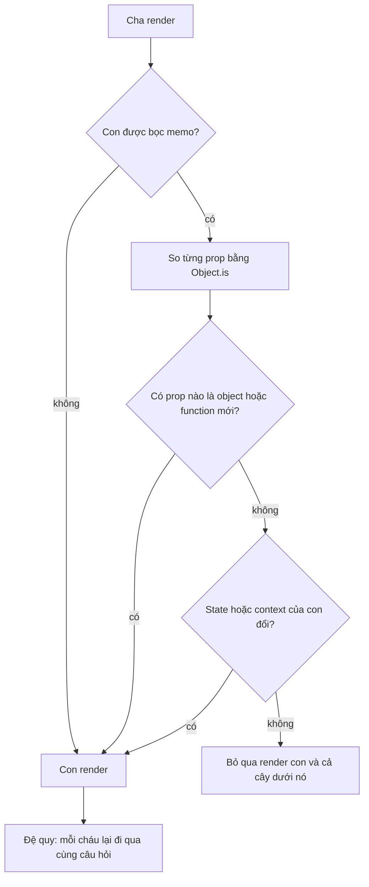

## Bối cảnh & vấn đề

Bảng giao dịch của một app ngân hàng có 2.000 dòng và lag khi user chọn một dòng. Team đọc được "dùng `React.memo` để tối ưu" nên bọc `memo(Row)`, thêm `useCallback` cho handler, thêm `useMemo` cho vài phép tính. Profiler sau đó vẫn cho thấy **mọi** dòng render lại mỗi lần chọn. Một năm sau, codebase có 400 `useCallback`, nhiều cái với deps sai gây stale data, và code khó đọc hơn hẳn, trong khi lag vẫn còn.

Vấn đề không phải memoization "không hoạt động". Nó hoạt động đúng như thiết kế: so sánh **reference**. Chỉ cần **một** prop là object hay function mới mỗi render, `memo` thấy props khác và render. Memoization là một chuỗi mắt xích: `memo` ở con, reference ổn định cho **mọi** prop, và deps đúng. Thiếu một mắt là cả chuỗi vô dụng, nhưng vẫn tốn chi phí so sánh và làm code phức tạp.

Bài này giải thích từng công cụ memo làm gì, vì sao inline object/function phá memo, cách tránh re-render bằng **composition** (rẻ và bền hơn memo), cách debug một dòng memo vẫn render, và **React Compiler**: công cụ build-time tự động memoize, đang thay đổi cách viết React. Nền tảng "cái gì trigger render" ở [bài render & snapshot](/tracks/react/learn/render-commit-snapshot).

**Interview angle:** `react-059` (CV) hỏi một case memo **đã đo** và một case đã **gỡ** memo. Không có số liệu đo là câu trả lời yếu.

## Khái niệm

### Memoization

**Memoization** là lưu lại kết quả của một phép tính theo input, để lần sau cùng input thì trả lại kết quả cũ thay vì tính lại. React có ba công cụ, mỗi cái memo một thứ khác nhau, và cả ba đều so input bằng `Object.is` (shallow).

### React.memo: bỏ qua render của component

`memo(Component, areEqual?)` bọc một component. Khi cha render, React so **từng prop** của lần này với lần trước bằng `Object.is`. Nếu tất cả bằng nhau, React bỏ qua render component đó và dùng lại kết quả cũ. `memo` so **mọi** prop được truyền, kể cả prop mà component không dùng. `areEqual(prev, next)` tuỳ chỉnh việc so sánh; trả `true` nghĩa là "bằng nhau, **bỏ qua** render" (ngược với `shouldComponentUpdate`).

`memo` không chặn render do **state của chính component** hoặc **context** nó đọc đổi. Nó chỉ chặn phần "cha render thì con render theo".

### useMemo: cache một giá trị

`useMemo(() => compute(a, b), [a, b])` gọi `compute` ở render đầu và mỗi khi `a` hoặc `b` đổi; các render khác trả lại giá trị đã lưu. Hai mục đích: tránh **tính toán nặng** lặp lại (lọc/sắp xếp 10.000 phần tử), và giữ **reference ổn định** cho object/array để truyền xuống con `memo` hoặc làm deps của effect. `useMemo` là tối ưu hiệu năng, không phải đảm bảo ngữ nghĩa: React có thể bỏ cache trong vài trường hợp (ví dụ component suspend lúc mount), nên code không được **phụ thuộc** vào việc giá trị không bị tính lại.

### useCallback: cache chính function

`useCallback(fn, deps)` trả lại **cùng một function** khi deps không đổi. Nó tương đương `useMemo(() => fn, deps)`. `useCallback` không làm function chạy nhanh hơn; function vẫn được **tạo** mỗi render (đối số `fn` là một arrow function mới), chỉ là React trả lại cái cũ. Lợi ích duy nhất là **identity** ổn định, và identity chỉ quan trọng khi có ai đó so sánh nó: một con `memo`, deps của effect/`useMemo`, hoặc một thư viện dùng reference.

```tsx
const onSelect = useCallback((id: string) => setSelected(id), []); // setSelected ổn định
```

**Interview angle:** `react-011`, follow-up "khi nào `useCallback` vô dụng?": khi con không `memo` và function không nằm trong deps nào. Thí nghiệm bên dưới cho thấy con vẫn render.

### Identity: vì sao inline object/function phá memo

Mỗi lần component chạy, `{ padding: 8 }`, `[]`, `() => {}` tạo ra **object mới** trong bộ nhớ. `Object.is({}, {})` là `false`. Truyền `style={{ padding: 8 }}` xuống một con `memo` nghĩa là prop `style` luôn khác, `memo` luôn render. Tương tự với `children`: JSX `<Icon />` là một object element mới mỗi render, nên con `memo` nhận `children` gần như luôn render lại.

Cách giữ identity: đưa hằng số ra **ngoài component** (`const rowStyle = { padding: 8 }` ở module), dùng `useMemo`/`useCallback`, hoặc truyền **primitive** (`isSelected={id === selected}` thay vì cả object `selection`).

Nhưng identity chỉ quan trọng khi có ai so sánh nó. Inline function truyền cho một `<button>` thường hay một component không `memo` và rẻ thì hoàn toàn không sao. Đừng tối ưu trước khi Profiler chỉ ra vấn đề.

### Composition: tránh re-render không cần memo

Có hai kỹ thuật cấu trúc khiến memo thường không cần thiết:

- **Đẩy state xuống** (move state down): nếu chỉ một ô input cần state `query`, tách input thành component riêng giữ state đó. Khi gõ, chỉ component nhỏ đó render; phần còn lại của trang không liên quan.
- **Nâng nội dung lên** (lift content up) qua `children`: component giữ state hay đổi nhận phần nặng qua `children`. Element `children` được **cha của nó** tạo ra, nên khi state của component giữa đổi, `children` vẫn là **cùng object element** như lần trước, và React bỏ qua việc render nó.

```tsx
function ScrollTracker({ children }: { children: React.ReactNode }) {
  const [y, setY] = useState(0);
  useEffect(() => {
    const onScroll = () => setY(window.scrollY);
    window.addEventListener("scroll", onScroll);
    return () => window.removeEventListener("scroll", onScroll);
  }, []);
  return <div data-y={y}>{children}</div>;
}
// <ScrollTracker><ExpensiveTree /></ScrollTracker>: ExpensiveTree không render khi cuộn
```

Vì sao `children` không render lại? React khi render `ScrollTracker` thấy element `children` ở vị trí đó có cùng reference với lần trước (do `App` không render), nên nó bỏ qua nhánh đó, giống hệt bailout của `memo` nhưng không cần so sánh props.

**Interview angle:** `react-026` và follow-up "vì sao children không render dù cha của nó render?": vì element được tạo ở component **ngoài**, và component ngoài không render.

### React Compiler

**React Compiler** là công cụ build-time (Babel plugin `babel-plugin-react-compiler`, 1.0 stable tháng 10/2025) (verify) phân tích component và hook, rồi **tự chèn memoization chi tiết** tới từng giá trị và từng element JSX. Nó thay phần lớn `useMemo`, `useCallback` và `memo` thủ công, và memo được cả những chỗ không thể memo bằng tay (ví dụ sau một `return` sớm).

Compiler dựa vào giả định code tuân **Rules of React**: render thuần, không mutate props, state hay giá trị đã dùng để render, không đọc ref trong render, hook đúng quy tắc. Khi phát hiện vi phạm, nó **bỏ qua** (bail out) function đó, để nguyên code gốc thay vì compile sai. Nhưng phát hiện không tuyệt đối: thí nghiệm bên dưới cho thấy compiler 1.0 từ chối `props.count = 1` nhưng vẫn compile một component gọi `items.push()` trên prop. Vì vậy lint và code review vẫn cần thiết.

Compiler không sửa được vấn đề thuật toán: lọc O(n²), list 10.000 dòng không virtualize, hay state đặt sai chỗ vẫn chậm. Nó cũng không compile **class component**.

**Interview angle:** `react-028`, follow-up "component ngừng cập nhật sau khi bật compiler": gần như chắc chắn là **mutation**. Code cũ mutate object rồi dựa vào việc "đằng nào cũng render lại"; compiler memo giá trị đó nên UI dùng bản cũ.

## Cơ chế hoạt động

### Chuỗi mắt xích của memoization



Sơ đồ cho thấy vì sao memo thủ công mong manh: để đi tới nhánh "bỏ qua", **mọi** prop phải giữ identity. Một `style={{...}}` inline, một callback có deps đổi mỗi lần, hay một `items` được `.filter()` lại ở cha đều đưa luồng về "Con render". Khi con được bỏ qua, cả cây dưới nó cũng được bỏ qua (trừ những component có state/context riêng đổi), nên một `memo` đúng chỗ ở gốc một cây lớn có giá trị hơn nhiều `memo` rải ở lá.

### Compiler memo ra sao

Thay vì hook, compiler dùng một mảng cache theo từng component (`_c(n)` từ `react/compiler-runtime`). Với mỗi giá trị, nó so input với lần trước; giống thì lấy từ cache, khác thì tính lại và lưu. Output thật từ compiler 1.0 cho component `Row`:

```js
export function Row(t0) {
  const $ = _c(7);
  const { item, onSelect } = t0;
  let t1;
  if ($[0] === Symbol.for("react.memo_cache_sentinel")) {
    t1 = { padding: 8 };              // hằng số: tạo một lần
    $[0] = t1;
  } else {
    t1 = $[0];
  }
  const style = t1;
  let t2;
  if ($[1] !== item.id || $[2] !== onSelect) {
    t2 = () => onSelect(item.id);     // chỉ tạo lại khi item.id hoặc onSelect đổi
    $[1] = item.id;
    $[2] = onSelect;
    $[3] = t2;
  } else {
    t2 = $[3];
  }
  // ... tương tự cho element <li>, phụ thuộc item.name và t2
}
```

Compiler theo dõi phụ thuộc ở mức field (`item.id`, không phải cả `item`), và memo cả object `style` mà dev viết inline. Đó là lý do "React Compiler tự ổn định các reference này". Ở cấp cha, compiler cũng memo element `<Row ... />`, nên khi props không đổi, React thấy cùng element và bỏ qua, giống hiệu ứng của `memo`.

## Ví dụ thực tế

Output dưới đây là **output thật** (React 19.2.8 trong jsdom; compiler output từ `babel-plugin-react-compiler` 1.0.0).

### Dòng memo vẫn render (react-043)

```tsx
const Row = memo(function Row({ item, onSelect, style }: RowProps) {
  return <li style={style} onClick={() => onSelect(item.id)}>{item.name}</li>;
});

function List({ items }: { items: Item[] }) {
  const [selected, setSelected] = useState<string | null>(null);
  const handleSelect = useCallback((id: string) => {
    setSelected(id);
    track("select", { id, previous: selected });
  }, [selected]);
  return (
    <ul>
      {items.map((item) => (
        <Row key={item.id} item={item} onSelect={handleSelect} style={{ padding: 8 }} />
      ))}
    </ul>
  );
}
```

Ba nguyên nhân: `style` là object mới mỗi render; `handleSelect` có deps `[selected]` nên đổi reference **mỗi lần chọn**; và nếu `items` được cha tạo lại (`.filter` không memo), `item` cũng là object mới. Bản sửa:

```tsx
const rowStyle = { padding: 8 };                           // hằng số module

const Row = memo(function Row({ item, onSelect, style, isSelected }: RowProps) {
  return <li style={style} aria-selected={isSelected} onClick={() => onSelect(item.id)}>{item.name}</li>;
});

function List({ items }: { items: Item[] }) {
  const [selected, setSelected] = useState<string | null>(null);
  const prev = useRef<string | null>(null);
  const handleSelect = useCallback((id: string) => {
    track("select", { id, previous: prev.current });      // đọc giá trị trước qua ref trong handler
    prev.current = id;
    setSelected(id);
  }, []);
  return (
    <ul>
      {items.map((item) => (
        <Row key={item.id} item={item} isSelected={item.id === selected} onSelect={handleSelect} style={rowStyle} />
      ))}
    </ul>
  );
}
```

Đếm số lần render của Row sau hai lần chọn trên 5 dòng:

```text
043-A: row renders after 2 selections (5 rows): 10
  track select { id: 'i1', previous: null }
  track select { id: 'i3', previous: 'i1' }
043-B: row renders after 2 selections (5 rows): 3
```

Bản lỗi render mọi dòng mỗi lần (5 × 2 = 10). Bản sửa chỉ render những dòng có `isSelected` đổi: lần 1 là dòng `i1`, lần 2 là `i1` và `i3`. Lưu ý không đặt `track()` vào updater function: updater phải thuần. Đọc/ghi ref trong **event handler** là hợp lệ.

### Composition vs inline

```tsx
function Expensive() { renders.exp++; return <p>expensive</p>; }
function ColorPicker({ children }: { children: React.ReactNode }) {
  const [c, setC] = useState(0);
  return <div><button onClick={() => setC(c + 1)}>c</button>{children}</div>;
}
function Inline() {
  const [c, setC] = useState(0);
  return <div><button onClick={() => setC(c + 1)}>c</button><Expensive /></div>;
}
// bấm nút 3 lần với <Inline /> và với <ColorPicker><Expensive /></ColorPicker>
```

```text
026 inline child: Expensive renders after 3 state changes: 3
026 children prop: Expensive renders after 3 state changes: 0
```

### useCallback không có con memo

```tsx
function Plain({ onClick }: { onClick: () => void }) { renders.plain++; return <i onClick={onClick}>x</i>; }
function P() {
  const [n, setN] = useState(0);
  const cb = useCallback(() => {}, []);
  return <><button onClick={() => setN(n + 1)}>n</button><Plain onClick={cb} /></>;
}
```

```text
useCallback + non-memo child: child renders after parent update: 1
```

`useCallback` ở đây chỉ tốn thêm một lần so sánh deps.

### Compiler bỏ qua code vi phạm Rules of React

Chạy compiler với `logger` trên bốn component nhỏ:

```text
export function Bad2(props) { props.count = 1; ... }
[left as-is]
CompileError  This value cannot be modified Modifying component props or hook arguments is not allowed. Consider using a local variable instead

export function R() { const r = useRef(0); r.current += 1; return <p>{r.current}</p>; }
[left as-is]
CompileError  Cannot access refs during render React refs are values that are not needed for rendering. ...

export function C({a}) { if (a) { const [x] = useState(0); } return <p/>; }
[left as-is]
CompileError  Hooks must always be called in a consistent order, and may not be called conditionally. ...

export function Bad({ items }) { items.push("x"); return <ul>{items.length}</ul>; }
[compiled]
CompileSuccess Bad
```

Ba case đầu bị bỏ qua đúng như tài liệu mô tả. Case cuối là mutation qua method call trên prop, và compiler 1.0 **không** phát hiện, vẫn compile. Bài học: "compiler bail out khi vi phạm" đúng với phần lớn vi phạm nó nhìn thấy, không phải mọi vi phạm.

### Selector Redux và memo (react-059)

Trong app Redux, `useSelector(state => state.tx.items.filter(t => t.accountId === id))` trả **mảng mới** mỗi lần store đổi, kể cả khi action không liên quan. `useSelector` so kết quả bằng `===`, thấy khác, và render component, rồi mọi `memo(Row)` nhận `items` mới cũng render. `createSelector` của Redux Toolkit memo kết quả theo input:

```ts
const selectTxByAccount = createSelector(
  [(s: RootState) => s.tx.items, (_: RootState, id: string) => id],
  (items, id) => items.filter((t) => t.accountId === id),
);
const txs = useSelector((s: RootState) => selectTxByAccount(s, accountId));
```

Khung câu trả lời cho `react-059`: triệu chứng (bảng lag khi filter), đo bằng Profiler (commit bao nhiêu ms, bao nhiêu `Row` render, "Why did this render?"), nguyên nhân (selector trả mảng mới, callback inline), fix (`createSelector`, `memo(Row)`, callback ổn định), **số liệu trước/sau** (điền số liệu thật của bạn). Case gỡ memo: `useMemo(() => a * 2, [a])` rải khắp nơi, hoặc `useCallback` với deps sai gây stale data; gỡ đi làm code rõ hơn mà Profiler không đổi.

## Trade-offs & lựa chọn thay thế

| Cách tiếp cận | Chi phí | Bền khi code đổi | Hợp khi |
|---|---|---|---|
| Không tối ưu | 0 | Cao | Mặc định, cho tới khi Profiler chỉ ra vấn đề |
| Đẩy state xuống / `children` | Thay đổi cấu trúc | Cao | Một vùng nhỏ hay đổi nằm trong cây lớn |
| `memo` + `useCallback`/`useMemo` thủ công | So sánh mỗi render, code nhiễu | Thấp (một prop mới là hỏng) | Hot path đã đo, chưa bật compiler |
| `useMemo` cho tính toán nặng | Bộ nhớ cho cache | Trung bình | Lọc/sắp xếp lớn, parse nặng (đo > ~1 ms) |
| React Compiler | Build chậm hơn (Babel), cần code tuân Rules of React | Cao | Codebase hiện đại, có lint |
| Virtualization | Thư viện, UX phức tạp hơn | Cao | List hàng nghìn dòng ([bài performance](/tracks/react/learn/performance-realtime)) |

Khi nào chọn gì: sửa **cấu trúc** trước (state ở đúng chỗ, composition), vì nó không vỡ khi ai đó thêm một prop. Dùng memo thủ công cho vài hot path đã đo. Với codebase mới hoặc đã sạch lint, bật compiler và ngừng viết memo tay. Với list rất dài, không lượng memo nào thay được virtualization.

## So sánh: rollout React Compiler trên codebase cũ

Kịch bản `react-052`: codebase 4 năm tuổi, nhiều `useMemo` tay, vài class component. Một kế hoạch hợp lý:

1. **Baseline**: đo flow chính bằng Profiler (commit time), INP/Web Vitals từ RUM, bundle size, thời gian build. Không có baseline thì không chứng minh được giá trị.
2. **Lint trước**: bật các rule của compiler trong `eslint-plugin-react-hooks` (bản mới gộp rule compiler vào preset `recommended`) (verify) để thấy vi phạm (mutation, đọc ref trong render, setState trong render). Sửa dần; mỗi vi phạm là một component compiler sẽ bỏ qua.
3. **Rollout từng phần**: compile một thư mục (`sources` trong config), hoặc chế độ opt-in với directive `"use memo"` ở đầu file/function; opt-out tạm thời bằng `"use no memo"` cho component có vấn đề (verify). Có thể kết hợp feature flag hoặc canary.
4. **Theo dõi**: loại bug đặc trưng là "UI không cập nhật" (mutation) và effect chạy khác đi (deps được memo làm effect chạy **ít** hơn trước). Chạy e2e trên flow quan trọng.
5. **Không xoá `useMemo`/`useCallback` hàng loạt ngay**: compiler làm việc cùng chúng. Gỡ dần sau khi ổn định, vì một số memo tay đang giữ ngữ nghĩa (ví dụ deps của effect).
6. **Chấp nhận giới hạn**: class component không được compile; build chậm hơn vì Babel. Next.js 16 có `reactCompiler: true` ổn định nhưng không bật mặc định (verify).

Chứng minh với management bằng số: commit time trên flow chính, INP p75 trước/sau, số `useMemo`/`useCallback` gỡ được, số bug hiệu năng mở mới.

## Edge cases & failure modes

- **Deps sai trong `useCallback`.** Deps thiếu làm callback đọc state cũ (stale closure); deps thừa làm callback đổi mỗi render, memo con vô dụng.
- **`areEqual` tuỳ chỉnh bỏ sót prop function.** So sánh chỉ `value` mà bỏ qua `onChange`: con giữ `onChange` cũ, gọi vào closure cũ, cập nhật sai state.
- **Deep compare trong `areEqual`.** So sâu object lớn mỗi render có thể tốn hơn chính việc render.
- **Context bỏ qua memo.** Con `memo` đọc context vẫn render khi context đổi; memo không giúp gì ([bài state architecture](/tracks/react/learn/state-architecture)).
- **Compiler và thư viện mutate.** Thư viện trả object mutable (một số form lib, class instance), compiler memo reference, UI không thấy thay đổi bên trong. Dùng `"use no memo"` hoặc bọc bằng API immutable.
- **Compiler và effect.** Giá trị trong deps giờ ổn định hơn, nên effect vốn "vô tình" chạy mỗi render giờ chỉ chạy khi thật sự đổi; code dựa vào hành vi cũ sẽ lộ bug.
- **`useMemo` với side effect.** Gọi API trong `useMemo` "cho chạy một lần" là sai: React có thể gọi lại hoặc bỏ cache.

## Pitfalls

- ❌ Bọc mọi component bằng `memo` và mọi function bằng `useCallback` → ✅ đo bằng Profiler, sửa cấu trúc trước, memo có chủ đích ở gốc cây nặng.
- ❌ `useCallback` cho handler truyền xuống con không `memo` → ✅ bỏ đi; identity chỉ quan trọng khi có người so sánh nó.
- ❌ `style={{...}}`, `options={[]}` inline xuống con `memo` → ✅ hằng số module, `useMemo`, hoặc truyền primitive.
- ❌ `useCallback(fn, [selected])` chỉ để log `selected` → ✅ đọc giá trị trước qua ref trong handler, hoặc chuyển logic sang nơi phản ứng với thay đổi.
- ❌ Selector Redux trả mảng/object mới mỗi lần → ✅ `createSelector`, hoặc chọn primitive, hoặc `shallowEqual`.
- ❌ Xoá hết `useMemo` ngay khi bật compiler → ✅ gỡ dần sau khi có baseline và e2e xanh.
- ❌ Tin compiler bắt mọi mutation → ✅ giữ lint và review; compiler 1.0 vẫn compile `props.items.push()`.
- ❌ Dùng compiler để chữa list 10.000 dòng → ✅ virtualization; compiler không đổi thuật toán hay số node DOM.

## Tóm tắt

- `memo` bỏ qua render **component** khi mọi prop `Object.is` bằng nhau; `useMemo` cache **giá trị**; `useCallback` cache **function** (identity).
- Memo là chuỗi mắt xích: một prop object/function mới là cả chuỗi vô dụng; `children` JSX cũng là object mới mỗi render.
- `useCallback` chỉ có ích khi con được `memo` hoặc function nằm trong deps.
- **Composition** (đẩy state xuống, truyền phần nặng qua `children`) tránh re-render mà không cần memo, và bền hơn khi code đổi.
- Debug dòng memo vẫn render: tìm prop đổi identity (style inline, callback có deps đổi, item tạo lại) bằng Profiler "Why did this render?".
- **React Compiler** (1.0) tự memo ở mức từng giá trị, cần code tuân **Rules of React**, bỏ qua function vi phạm mà nó phát hiện, nhưng không phát hiện mọi mutation.
- Rollout compiler: baseline → lint → từng thư mục/opt-in → theo dõi bug "UI không cập nhật" → gỡ memo tay dần.
