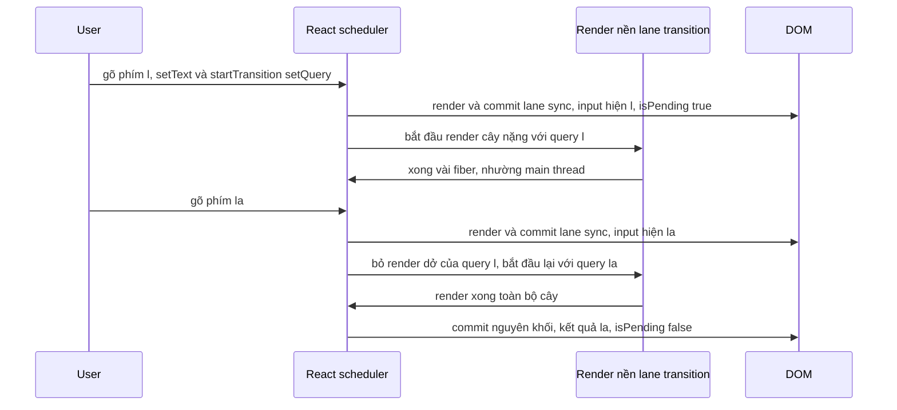
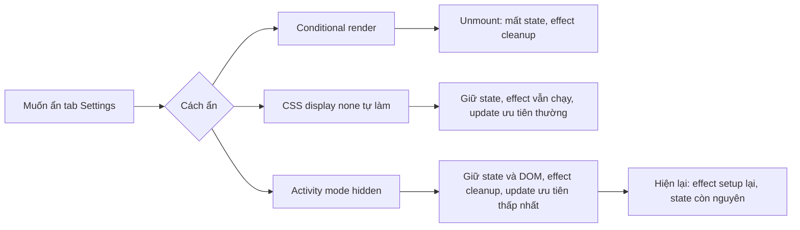

## Bối cảnh & vấn đề

Một trang tìm sản phẩm có ô search và một biểu đồ nặng vẽ lại theo từ khoá (mỗi lần render mất khoảng 150 ms). Khi user gõ "laptop", mỗi phím phải chờ biểu đồ vẽ xong mới hiện chữ: gõ 6 ký tự mất gần một giây, chữ xuất hiện giật cục. Team thử debounce 300 ms: input mượt hơn nhưng giờ kết quả luôn trễ, và máy yếu vẫn đơ mỗi lần debounce kích hoạt.

Gốc vấn đề: trước React 18, render là **một khối đồng bộ không ngắt được**. Khi React bắt đầu render cây biểu đồ, main thread bận 150 ms, và phím gõ tiếp theo phải xếp hàng. React không có cách nào nói "update ô input quan trọng hơn, làm nó trước". **Concurrent rendering** (React 18+) thêm đúng khả năng đó: mỗi update có một **mức ưu tiên**, và render của update ưu tiên thấp có thể bị **tạm dừng hoặc bỏ dở** để nhường cho update khẩn cấp.

Bài này giải thích lane (mức ưu tiên), vì sao render ngắt được nhưng commit thì không, hai API chính để đánh dấu update không khẩn cấp (`useTransition`, `useDeferredValue`), vấn đề **tearing** khi đọc store ngoài React và `useSyncExternalStore`, và `<Activity>` của React 19.2. Suspense trong transition được bàn ở [bài Suspense & error boundaries](/tracks/react/learn/suspense-error-boundaries).

**Interview angle:** `react-018` gần như luôn có mặt trong vòng React senior; câu phân loại là "transition có làm code nhanh hơn không?" (không, nó giữ UI **phản hồi**).

## Khái niệm

### Concurrent rendering

**Concurrent rendering** không có nghĩa là React chạy song song trên nhiều thread. JavaScript vẫn một thread. Nó nghĩa là React có thể **chuẩn bị nhiều phiên bản UI cùng lúc** và **chen ngang** một render đang dở: render được chia thành nhiều đơn vị nhỏ (mỗi fiber là một đơn vị), sau mỗi đơn vị React kiểm tra xem có việc quan trọng hơn không, và nếu có thì nhường main thread (**time slicing**) hoặc bỏ render dở đó để làm lại sau.

Khả năng này chỉ bật cho những update bạn **đánh dấu** là không khẩn cấp (transition, deferred value). Update thường vẫn render đồng bộ như trước. Đó là lý do nó được gọi là "concurrent features", không phải "concurrent mode" như các bản thử nghiệm cũ.

### Fiber và lane

**Fiber** là kiến trúc reconciler từ React 16: mỗi component instance là một node fiber với con trỏ tới cha, con, anh em, cho phép React dừng giữa chừng và tiếp tục từ node bất kỳ. Reconciler cũ (stack reconciler) đệ quy trên call stack của JavaScript nên không thể dừng.

**Lane** là cách React biểu diễn mức ưu tiên của update, dưới dạng bit trong một số nguyên (nên có thể gộp nhiều lane). Các nhóm chính, từ cao xuống thấp:

- **Sync / discrete**: click, gõ phím, submit. Phải phản hồi ngay.
- **Continuous**: scroll, mousemove, drag. Xảy ra dồn dập.
- **Default**: update không gắn với event cụ thể (sau `await`, từ timer).
- **Transition**: update được bọc trong `startTransition` hoặc Action.
- **Idle / Offscreen**: việc nền, cây đang ẩn (`<Activity mode="hidden">`).

Lane là chi tiết nội bộ, không phải API; nhưng hiểu nó giúp giải thích mọi hành vi của transition.

### Render ngắt được, commit thì không

Render phase chỉ **tính toán** cây mới trong bộ nhớ; nó chưa chạm DOM. Bỏ dở nó không để lại dấu vết gì mà user thấy được. **Commit phase** thì áp thay đổi vào DOM và chạy layout effect. Nếu commit bị ngắt giữa chừng, user sẽ thấy nửa UI cũ, nửa UI mới. Vì vậy commit luôn **đồng bộ và nguyên khối**.

Hệ quả thực tế quan trọng nhất: vì render có thể chạy nhiều lần mà không commit, **render phải thuần và idempotent**. Side effect trong render (gửi analytics, ghi biến module, ghi `ref.current`) có thể chạy cho một render không bao giờ được hiển thị. Ví dụ: đếm "số lần hiển thị" trong thân component, dưới transition bị ngắt ba lần, bộ đếm tăng 4 trong khi user chỉ thấy UI một lần.

**Interview angle:** `react-049` follow-up "ví dụ side effect trong render chỉ hỏng dưới concurrent features": ghi vào cache/biến module hay ghi ref "previous value" trong render; render bị bỏ dở để lại giá trị của một UI chưa từng tồn tại.

### useTransition và startTransition

`const [isPending, startTransition] = useTransition()`. Bọc **setState mà bạn kiểm soát** trong `startTransition(() => setTab("posts"))` để nói "update này không khẩn cấp". React render ngay với `isPending = true` (lane khẩn cấp, UI cũ vẫn hiện), rồi render phiên bản mới ở lane transition trong nền. Nếu user bấm tiếp, React bỏ render dở và bắt đầu với giá trị mới. Khi render nền xong, React commit và `isPending` về `false`.

`startTransition` (import từ `react`) dùng được ngoài component, nhưng không có `isPending`. Từ React 19, callback của `startTransition` có thể là **async function**, và React gọi nó là một **Action**: `isPending` giữ `true` suốt thời gian chờ `await` (verify). Một giới hạn đã biết: setState **sau** `await` trong Action cần được bọc thêm một `startTransition` nữa để vẫn là transition (react.dev ghi nhận đây là hạn chế hiện tại) (verify).

### useDeferredValue

`const deferred = useDeferredValue(value)`. Khi `value` đổi, React render **hai lần**: lần khẩn cấp với `deferred` còn **giá trị cũ** (nên phần UI dùng `deferred` có thể bỏ qua nhờ memo), rồi lần nền (lane transition) với `deferred` bằng **giá trị mới**. Lần nền có thể bị ngắt nếu `value` đổi tiếp. Dùng khi bạn **không** kiểm soát setter, thường là giá trị nhận từ props.

Để render khẩn cấp thật sự rẻ, phần nặng phải được bỏ qua khi `deferred` không đổi: bọc component nặng bằng `memo`, hoặc để React Compiler làm việc đó. Không có memo, render khẩn cấp vẫn render cây nặng với giá trị cũ, và lợi ích biến mất.

React 19 thêm tham số thứ hai: `useDeferredValue(value, initialValue)`. Ở lần render đầu, `deferred` bằng `initialValue` (ví dụ `""`), rồi React render nền với `value` thật. Hữu ích để mount nhanh rồi mới tính phần nặng (verify).

### Transition không phải debounce

Cả hai hook không làm công việc nhanh hơn và không giảm số lần tính toán. Chúng chỉ đảm bảo input **không bị chặn** bởi render nặng. Với network (mỗi phím một request), bạn vẫn cần debounce hoặc data library với request cancellation, vì transition không huỷ request nào. Chúng cũng không chữa race condition: response cũ về sau vẫn ghi đè response mới ([bài data fetching](/tracks/react/learn/data-fetching-ssr-rsc)).

### Input phải nằm ngoài transition

State của chính ô input (`value` của controlled input) phải được set **đồng bộ**, ngoài transition. Nếu bọc `setText` trong transition, React có thể trì hoãn update đó; trong lúc chờ, DOM input đã có ký tự mới nhưng React lại render `value` cũ, gây nhảy cursor và mất ký tự. Pattern đúng: hai state, hoặc một state + deferred value.

```tsx
function Search() {
  const [text, setText] = useState("");         // khẩn cấp, cho input
  const deferredText = useDeferredValue(text);  // nền, cho kết quả nặng
  return (
    <>
      <input value={text} onChange={(e) => setText(e.target.value)} />
      <HeavyResults query={deferredText} />      {/* HeavyResults bọc memo */}
    </>
  );
}
```

**Interview angle:** `react-018` follow-up "vì sao input phải ở ngoài transition?": controlled input cần React commit giá trị đồng bộ với DOM; trì hoãn nó làm React ghi đè cái browser vừa gõ.

### Tearing và useSyncExternalStore

**Tearing** (xé hình) là khi các phần khác nhau của UI hiển thị **các phiên bản khác nhau** của cùng một dữ liệu trong cùng một lần commit. Nó xảy ra với **store bên ngoài React** (biến module, Redux store cũ, `window.location`) khi render được time-slice: component A đọc store lúc giá trị là 1, React nhường thread, store đổi thành 2, component B đọc 2, rồi React commit cả hai. State của React (`useState`) không bị vì React quản lý nó theo từng render.

`useSyncExternalStore(subscribe, getSnapshot, getServerSnapshot?)` là cách chuẩn để đọc store ngoài một cách an toàn. React gọi `getSnapshot` và, nếu phát hiện snapshot đổi giữa chừng, render lại **đồng bộ** để mọi component thấy cùng một giá trị. Ba yêu cầu:

- `subscribe(callback)` đăng ký và **trả về** hàm huỷ đăng ký.
- `getSnapshot()` phải trả **cùng một giá trị** (cùng reference) nếu store không đổi. Trả `{ ...state }` mới mỗi lần làm React tưởng store luôn đổi, dẫn đến vòng lặp vô hạn (thí nghiệm bên dưới).
- `getServerSnapshot` cho SSR và hydration; thiếu nó thì React báo lỗi khi render trên server.

Thư viện state hiện đại (Redux qua `react-redux` v8+, Zustand) dùng hook này bên trong. App code thường chỉ gọi trực tiếp cho browser API: `navigator.onLine`, `matchMedia`, `localStorage` event.

**Interview angle:** `react-030` follow-up "vì sao `getSnapshot` trả `{...state}` gây loop?": React so snapshot bằng `Object.is`; object mới mỗi lần nghĩa là "đã đổi" mỗi lần, render lại, lại đổi.

### Activity (React 19.2)

`<Activity mode="visible" | "hidden">` bọc một cây con. Khi `hidden`, React **ẩn** con bằng `display: none`, **giữ state và DOM**, nhưng **cleanup mọi effect** của cây đó và render mọi update của nó ở ưu tiên thấp nhất. Khi quay lại `visible`, React chạy lại setup của effect (verify).

So sánh ba cách ẩn:

- `{show && <Tab />}`: unmount, **mất state** (input đang gõ, scroll), effect cleanup.
- CSS `display: none` tự làm: giữ state, nhưng cây ẩn **vẫn chạy effect** (subscription, polling, video), vẫn render với ưu tiên thường, tốn tài nguyên.
- `<Activity mode="hidden">`: giữ state, **tắt effect**, render nền ưu tiên thấp. Có thể dùng để **pre-render** màn hình user sắp mở (render trước ở mode hidden).

Yêu cầu: effect phải có cleanup đối xứng, vì Activity sẽ chạy cleanup/setup mỗi lần ẩn/hiện, giống StrictMode ([bài effects](/tracks/react/learn/effects)).

**Interview angle:** `react-041` follow-up "video hoặc WebSocket trong Activity ẩn thì sao?": effect bị cleanup nên subscription đóng (nếu viết đúng); nhưng DOM được giữ, nên một `<video>` đang phát **vẫn phát** trừ khi bạn pause nó trong cleanup của effect (react.dev dùng đúng ví dụ này) (verify).

## Cơ chế hoạt động

### Update khẩn cấp chen ngang transition



Mỗi phím tạo hai update: `setText` ở lane sync và `setQuery` ở lane transition. React luôn xử lý lane cao trước, nên ô input được commit ngay. Render cây nặng chạy ở lane transition, từng fiber một; sau mỗi khoảng khoảng 5 ms React kiểm tra có update ưu tiên cao hơn không. Khi phím tiếp theo tới, React commit input, rồi **vứt** render nền dở dang (nó chưa commit nên không ai thấy) và bắt đầu lại với giá trị mới nhất. Kết quả: input luôn mượt; kết quả hiện ra khi user tạm ngừng gõ đủ lâu để render nền hoàn thành. Commit cuối vẫn đồng bộ, nguyên khối.

### Ba cách ẩn một cây con



## Ví dụ thực tế

Output dưới đây là **output thật** (React 19.2.8 trong jsdom, bọc bằng `act`; `act` flush mọi lane nên ta thấy thứ tự render, không thấy được việc bị ngắt theo thời gian).

### useDeferredValue render hai lần

```tsx
function Search({ query }: { query: string }) {
  const d = useDeferredValue(query);
  console.log(`  render query="${query}" deferred="${d}"`);
  return null;
}
// render query="a", rồi query="ab"

function S2({ q }: { q: string }) {
  const d = useDeferredValue(q, "");
  console.log(`  render q="${q}" deferred="${d}"`);
  return null;
}
// mount với q="react"
```

```text
A) useDeferredValue
  render query="a" deferred="a"
  render query="ab" deferred="a"
  render query="ab" deferred="ab"
A2) useDeferredValue(value, initialValue)
  render q="react" deferred=""
  render q="react" deferred="react"
```

Khi `query` đổi sang `"ab"`, render đầu tiên (khẩn cấp) vẫn có `deferred="a"`; render thứ hai (nền) mới có `"ab"`. Với `initialValue`, lần mount đầu render với `""` rồi render nền với giá trị thật.

### useTransition và isPending

```tsx
function Tabs() {
  const [tab, setTab] = useState("home");
  const [isPending, start] = useTransition();
  console.log(`  render tab=${tab} isPending=${isPending}`);
  return <button onClick={() => start(() => setTab("posts"))}>go</button>;
}
```

```text
B) useTransition click
  render tab=home isPending=false
  render tab=home isPending=true
  render tab=posts isPending=false
```

Render thứ hai là lane khẩn cấp: tab vẫn là `home` (UI cũ) nhưng `isPending=true`, đủ để hiện spinner nhỏ hoặc làm mờ nội dung. Render thứ ba là transition.

### Activity giữ state, tắt effect

```tsx
function Draft() {
  const [t, setT] = useState("");
  useEffect(() => {
    console.log("  effect setup (subscribe)");
    return () => console.log("  effect cleanup (unsubscribe)");
  }, []);
  return <input value={t} onChange={(e) => setT(e.target.value)} />;
}
function Tabbed({ mode }: { mode: "visible" | "hidden" }) {
  return <Activity mode={mode}><Draft /></Activity>;
}
// gõ "half typed", ẩn, kiểm tra DOM, hiện lại
```

```text
C) Activity
  effect setup (subscribe)
  -> hide
  effect cleanup (unsubscribe)
  input still in DOM: true | style.display: none | value: half typed
  -> show
  effect setup (subscribe)
  value after show: half typed
```

### useSyncExternalStore: snapshot không cache và store có selector

```tsx
// Sai: snapshot mới mỗi lần
function BadSnap() {
  const s = useSyncExternalStore(store.subscribe, () => ({ ...store.state }));
  return <p>{s.n}</p>;
}

// Đúng: store bất biến, mỗi ô chỉ đọc slice của mình
const prices = {
  data: { AAPL: 1, MSFT: 1 } as Record<string, number>,
  subs: new Set<() => void>(),
  subscribe: (cb: () => void) => { prices.subs.add(cb); return () => prices.subs.delete(cb); },
  set(sym: string, v: number) {
    prices.data = { ...prices.data, [sym]: v };       // object mới khi đổi
    prices.subs.forEach((f) => f());
  },
};
function usePrice(sym: string) {
  return useSyncExternalStore(prices.subscribe, () => prices.data[sym]); // primitive, ổn định
}
function A1() { rendersA++; return <i>{usePrice("AAPL")}</i>; }
function B1() { rendersB++; return <i>{usePrice("MSFT")}</i>; }
// hai tick AAPL trong cùng một act
```

```text
D) getSnapshot returns new object
[console.error] The result of getSnapshot should be cached to avoid an infinite loop
  thrown: Maximum update depth exceeded. This can happen when a component repeatedly calls setState inside componentWillUpdate or componentDidUpdate. React limits the number of nested updates to prevent infinite loops.
E) after 2 AAPL ticks: AAPL cell renders = 1 MSFT cell renders = 0
```

Ô MSFT không render vì snapshot của nó (số `1`) không đổi. Hai tick AAPL trong cùng tick được batch thành một render. Đây là nền của thiết kế dashboard realtime ở [bài performance & realtime](/tracks/react/learn/performance-realtime).

### useOnline với getServerSnapshot

```tsx
function subscribe(cb: () => void) {
  window.addEventListener("online", cb);
  window.addEventListener("offline", cb);
  return () => { window.removeEventListener("online", cb); window.removeEventListener("offline", cb); };
}
export function useOnline() {
  return useSyncExternalStore(subscribe, () => navigator.onLine, () => true);
}
```

`subscribe` được khai báo **ngoài** component: nếu nó là function mới mỗi render, React huỷ đăng ký rồi đăng ký lại mỗi lần. `() => true` là giá trị dùng cho HTML của server và lần hydrate đầu, tránh mismatch.

## Trade-offs & lựa chọn thay thế

| Công cụ | Bọc cái gì | Có `isPending` | Hợp khi | Không giải quyết |
|---|---|---|---|---|
| `useTransition` | Setter mình kiểm soát | Có | Đổi tab, filter list lớn, navigation | Race, số request |
| `startTransition` (module) | Setter, ngoài component | Không | Store, router, code không phải hook | Hiển thị pending |
| `useDeferredValue` | Giá trị nhận từ ngoài (prop) | Không (so `value !== deferred`) | Component nhận `query` và render nặng | Cần memo con để có tác dụng |
| Debounce/throttle | Tần suất gọi | Không | Network, analytics, autosave | Render nặng vẫn chặn khi chạy |
| Virtualization | Số node render | Không | List hàng nghìn dòng | Tính toán nặng ngoài render |
| Web Worker | Tính toán CPU | Không | Parse, lọc dữ liệu rất lớn | Chi phí serialize dữ liệu |

Khi nào chọn gì: có quyền với `setState` → `useTransition`; chỉ có prop → `useDeferredValue`. Nếu vấn đề là **số request**, dùng debounce hoặc data library, transition không giúp. Nếu một render đơn lẻ đã quá nặng (vài trăm ms), transition chỉ che triệu chứng; giảm công việc bằng virtualization, memo hoặc chuyển tính toán sang worker. Với store ngoài React, luôn đi qua `useSyncExternalStore` (hoặc thư viện đã dùng nó), không `useEffect` + `useState` tự subscribe.

## Edge cases & failure modes

- **Transition và Suspense.** Nội dung **đã hiển thị** bị suspend trong transition: React giữ UI cũ thay vì hiện fallback. Boundary **mới mount** vẫn hiện fallback ([bài Suspense](/tracks/react/learn/suspense-error-boundaries)).
- **Transition quá lâu.** Render nền không bao giờ xong nếu value đổi liên tục (user gõ không ngừng); kết quả không bao giờ hiện. Hiếm, nhưng với input tốc độ cao nên kết hợp throttle.
- **setState sau `await` trong Action.** Không tự động là transition; bọc lại bằng `startTransition` nếu muốn nó không khẩn cấp (verify).
- **Side effect trong render dưới transition.** Chạy cho các render bị bỏ dở: analytics đếm sai, cache module ghi giá trị chưa từng hiển thị.
- **Store ngoài đọc trong render không qua `useSyncExternalStore`.** Tearing trong transition; và `useEffect` subscribe bỏ lỡ update xảy ra giữa render và effect.
- **`getSnapshot` trả array từ `.filter()`.** Mảng mới mỗi lần: vòng lặp vô hạn. Memo selector theo input, hoặc trả primitive.
- **Activity và side effect ngoài effect.** Timer tạo trong event handler, audio/video đang phát, không gắn với effect nên không dừng khi ẩn.
- **Pre-render bằng Activity hidden.** Cây ẩn render ở ưu tiên thấp và **không chạy effect**; data fetch viết trong effect sẽ không chạy cho tới khi hiện. Chỉ data qua Suspense mới được pre-fetch.

## Pitfalls

- ❌ Bọc `setText` của controlled input trong `startTransition` → ✅ input update đồng bộ; chỉ bọc update của phần nặng, hoặc dùng `useDeferredValue(text)`.
- ❌ Dùng `useDeferredValue` mà không memo component nặng → ✅ `memo(HeavyResults)` (hoặc React Compiler) để render khẩn cấp bỏ qua nó.
- ❌ Nghĩ transition thay được debounce cho search API → ✅ transition giữ UI mượt; debounce hoặc data library giảm request và huỷ request cũ.
- ❌ Ghi analytics hoặc biến module trong render → ✅ render có thể chạy nhiều lần không commit; đặt side effect trong effect hoặc handler.
- ❌ Tự subscribe store ngoài bằng `useEffect` + `useState` → ✅ `useSyncExternalStore`, chống tearing và bỏ lỡ update.
- ❌ `getSnapshot` trả `{ ...state }` hoặc `.filter()` → ✅ trả reference đã cache hoặc primitive.
- ❌ Ẩn tab bằng CSS tự làm khi tab có polling/subscription → ✅ `<Activity mode="hidden">` tắt effect và giữ state.
- ❌ Dùng Activity với effect không có cleanup → ✅ cleanup đối xứng; StrictMode ở dev đã giúp lộ bug này.

## Tóm tắt

- **Concurrent rendering**: render được chia nhỏ theo fiber, có thể nhường thread, bỏ dở và làm lại; chỉ bật cho update được đánh dấu không khẩn cấp.
- **Lane** là mức ưu tiên: sync/discrete > continuous > default > transition > idle/offscreen.
- **Render ngắt được, commit thì không**: commit phải nguyên khối để user không thấy nửa cũ nửa mới; nên render phải thuần và idempotent.
- `useTransition` bọc **setter mình kiểm soát**, cho `isPending`; `useDeferredValue` trì hoãn **giá trị** (thường là prop), render khẩn cấp với giá trị cũ, render nền với giá trị mới.
- Cả hai giữ UI **phản hồi**, không làm công việc nhanh hơn, không thay debounce, không chữa race; input phải update ngoài transition.
- **Tearing** là các phần UI thấy các phiên bản khác nhau của store ngoài; `useSyncExternalStore` chống bằng snapshot nhất quán, yêu cầu `getSnapshot` trả giá trị cache.
- `<Activity mode="hidden">` (19.2): giữ state và DOM, cleanup effect, render ưu tiên thấp; khác conditional render (mất state) và CSS tự ẩn (effect vẫn chạy).
