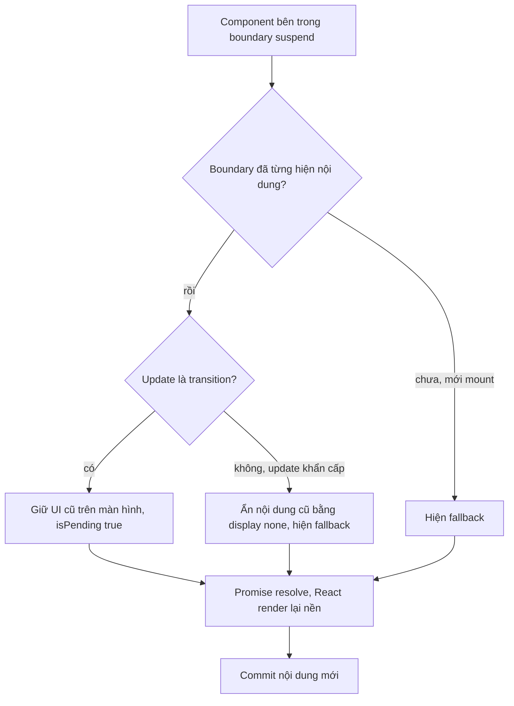
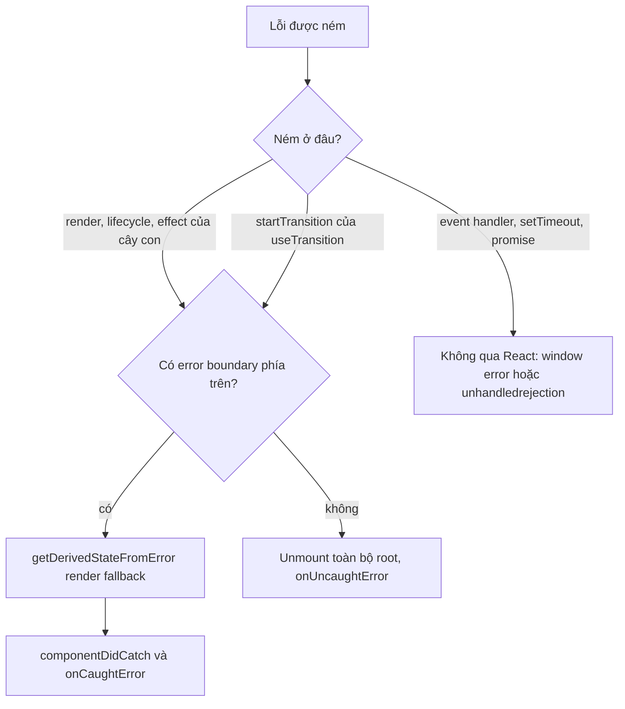

## Bối cảnh & vấn đề

Một app ngân hàng dạng SPA có bundle `main.js` 2,4 MB: biểu đồ, thư viện PDF, date picker với mọi locale đều tải ngay từ lần đầu, dù 80% user chỉ xem số dư. Team thêm code splitting và time-to-interactive giảm rõ rệt. Hai tuần sau, sau một lần deploy buổi chiều, support nhận hàng chục báo cáo "trắng trang khi bấm vào Báo cáo". Log chỉ có một dòng: `ChunkLoadError: Loading chunk 734 failed`. Cùng lúc, trang tìm kiếm có hiện tượng lạ: mỗi lần đổi filter, toàn bộ kết quả biến mất, thay bằng spinner, rồi hiện lại, rất khó chịu.

Cả ba chuyện liên quan tới hai loại **boundary** của React. **Suspense boundary** quyết định hiển thị gì khi một phần cây "chưa sẵn sàng" (code chưa tải, data chưa về). **Error boundary** quyết định hiển thị gì khi một phần cây **ném lỗi** trong lúc render. Không có boundary, một lỗi render ở một widget nhỏ làm React unmount **toàn bộ** app: màn hình trắng.

Bài này đi qua `lazy` và code splitting, cách Suspense chọn giữa fallback và UI cũ (khác nhau giữa update khẩn cấp và transition), version skew sau deploy, error boundary bắt và không bắt gì, và cách React 19 thay đổi việc báo lỗi. `use(promise)` và data fetching với Suspense được đào sâu ở [bài data fetching](/tracks/react/learn/data-fetching-ssr-rsc).

**Interview angle:** `react-044` là câu scenario production: interviewer muốn nghe root cause (tab cũ xin chunk đã bị xoá) **và** hai tầng phòng thủ (giữ asset cũ + error boundary có reload).

## Khái niệm

### Code splitting và React.lazy

**Code splitting** là chia bundle thành nhiều file (chunk) để trình duyệt chỉ tải phần cần cho màn hình hiện tại. Bundler (Vite, webpack) tạo chunk mới ở mỗi chỗ gọi `import()` động. `React.lazy` biến một `import()` thành một component:

```tsx
const Reports = lazy(() => import("./pages/Reports")); // chunk riêng, tải khi render lần đầu
```

Ba yêu cầu. Module phải có **default export** là component; nếu là named export, map lại: `lazy(() => import("./Chart").then((m) => ({ default: m.Chart })))`. `lazy` phải được gọi ở **top-level module**: gọi trong component tạo một component type mới mỗi render, gây remount và mất state ([bài reconciliation](/tracks/react/learn/reconciliation-keys)). Và component lazy phải nằm trong một `<Suspense>` ở phía trên.

**Route-level splitting** (mỗi trang một chunk) là điểm bắt đầu tốt nhất vì ranh giới rõ và lợi ích lớn. **Component-level** dành cho widget nặng hiếm dùng: editor, biểu đồ, xuất PDF. Với thư viện chỉ dùng khi thao tác (ví dụ `xlsx` khi bấm "Xuất Excel"), gọi `await import("xlsx")` ngay trong handler, không cần `lazy`.

### Suspense boundary

`<Suspense fallback={<Skeleton />}>` bọc một cây con. Khi một component bên trong **suspend** (lazy chưa tải xong, `use(promise)` chưa resolve, hoặc data framework báo đang chờ), React tìm Suspense **gần nhất** phía trên và hiển thị `fallback` thay cho **cả** cây con của boundary đó. Khi mọi thứ bên trong sẵn sàng, React hiển thị nội dung thật.

Suspense không phải cơ chế fetch data. Nó chỉ là cách **khai báo trạng thái loading** theo vùng. Thứ gì có thể suspend là do nguồn dữ liệu quyết định: `lazy`, `use()`, và các framework/library hỗ trợ Suspense (Next.js, Relay, React Query với `useSuspenseQuery`). Suspend bên trong `useEffect` thì không có tác dụng.

### Transition giữ UI cũ

Suspense chọn giữa fallback và UI cũ tuỳ vào **loại update**:

- **Update khẩn cấp** (setState thường): nội dung đã hiển thị bị suspend thì React **ẩn** nội dung cũ (giữ DOM với `display: none`) và hiện fallback ngay.
- **Transition** (`startTransition`, navigation của router hỗ trợ transition): nếu boundary **đã hiển thị nội dung** trước đó, React **giữ UI cũ** trên màn hình cho tới khi nội dung mới sẵn sàng, tránh "flash" spinner. `isPending` của `useTransition` dùng để hiện chỉ báo nhẹ (làm mờ, spinner nhỏ).
- Boundary **mới mount lần đầu** thì vẫn hiện fallback, kể cả trong transition, vì không có "UI cũ" nào để giữ.

Đây là lời giải cho trang tìm kiếm ở đầu bài: bọc việc đổi filter (hoặc đổi search param qua router) trong transition. Muốn **reset** về fallback khi đổi entity (từ khách A sang khách B, nơi giữ UI của A là sai), đặt `key={customerId}` trên boundary: key đổi thì boundary là boundary mới.

**Interview angle:** `react-037`: câu phải có "transition + nội dung đã hiển thị → giữ UI cũ; boundary mới → vẫn fallback". Follow-up "đổi search param thay cả trang bằng spinner" chính là update khẩn cấp; sửa bằng transition hoặc `useDeferredValue`.

### Thiết kế boundary

Suspense boundary nên đặt theo **vùng UX**, không theo từng component. Quá nhỏ: màn hình "nổ bỏng ngô" (popcorn), mười skeleton hiện và biến mất lệch nhau. Quá lớn: một widget chậm che cả trang. Thường mỗi route có một boundary cho khung chính, và các vùng độc lập (sidebar, feed, biểu đồ) có boundary riêng. React 19 khi Suspense "hiện lại" nội dung thì gom các boundary gần nhau để giảm nhảy layout, và 19.2 áp dụng việc gom này cho streaming SSR (verify).

### Error boundary

**Error boundary** là class component định nghĩa ít nhất một trong hai phương thức:

- `static getDerivedStateFromError(error)`: trả state mới để render **fallback**. Chạy trong render phase, nên phải thuần.
- `componentDidCatch(error, info)`: chạy sau commit, dùng để **log** (gửi Sentry kèm `info.componentStack`).

Nó bắt lỗi ném ra **trong lúc render**, trong lifecycle, trong constructor, và trong effect của **cây con**. React chưa có hook tương đương (verify), nên codebase thường dùng thư viện `react-error-boundary` (`<ErrorBoundary FallbackComponent onReset resetKeys>`), bản chất vẫn là một class.

Error boundary **không** bắt:

- Lỗi trong **event handler** (`onClick` ném lỗi): handler chạy ngoài render, React không cần unmount gì. Dùng `try/catch` và state lỗi.
- Code **async** chạy sau đó: `setTimeout`, promise `.then`, code sau `await` trong handler.
- Lỗi của **chính boundary** (nó chỉ bắt lỗi của con).
- Lỗi ở server khi render SSR theo cách thông thường (xử lý bằng callback của API server).

Ngoại lệ đáng nhớ: lỗi ném ra trong function truyền vào `startTransition` của **`useTransition`** (kể cả Action async) được React đưa lên boundary gần nhất (react.dev có ví dụ riêng) (verify). Thí nghiệm bên dưới cho thấy điều này, và cũng cho thấy một Action async gọi qua `startTransition` import từ module (không phải từ hook) ném lỗi thì **không** tới boundary trong 19.2.8: nó thành lỗi toàn cục (verify).

Muốn đưa lỗi từ event handler vào boundary (để dùng chung UI lỗi), có một mẹo: `setState(() => { throw error; })`; updater ném lỗi trong render nên boundary bắt được.

**Interview angle:** `react-009`: red flag là "error boundary bắt mọi lỗi trong cây con, kể cả onClick".

### Báo lỗi ở React 19

React 18 **re-throw** lỗi đã bị boundary bắt: cùng một lỗi được log hai, ba lần và bắn `window.onerror`, nên nhiều setup monitoring "vô tình" bắt lỗi render qua `window.onerror`. React 19 **không còn re-throw** lỗi đã bị bắt; nó log một lần (verify). Thay vào đó `createRoot` và `hydrateRoot` nhận ba callback:

- `onCaughtError(error, info)`: lỗi đã bị một error boundary bắt.
- `onUncaughtError(error, info)`: không boundary nào bắt; React unmount toàn bộ root.
- `onRecoverableError(error, info)`: React tự phục hồi được, ví dụ hydration mismatch rồi fallback sang render ở client.

Đây là chỗ gắn Sentry/Datadog tập trung. Hệ quả khi upgrade: nếu monitoring chỉ dựa vào `window.onerror`, dashboard có thể **giảm đột ngột** số lỗi frontend sau khi lên React 19, không phải vì app tốt hơn mà vì mất tín hiệu.

**Interview angle:** `react-042` follow-up "dashboard lỗi giảm mạnh sau upgrade, tin tốt hay xấu?": gần như chắc chắn là mất tín hiệu; gắn `onCaughtError`/`onUncaughtError` và so số lỗi theo release.

### ChunkLoadError và version skew

**Version skew** là khi trình duyệt đang chạy code của **bản build cũ** trong khi server/CDN đã phục vụ **bản mới**. Với code splitting, tab mở từ trước khi deploy vẫn giữ `main.js` cũ, trong đó có manifest trỏ tới chunk cũ (`Reports-3f9a.js`). Khi user điều hướng tới Reports, `import()` xin chunk đó; nếu deploy đã **xoá** asset cũ, server trả 404 (hoặc trả `index.html` với status 200, còn tệ hơn: lỗi parse). `lazy` reject, component throw, và không có error boundary nên React unmount cả app: trắng trang.

Webpack gọi lỗi này `ChunkLoadError`; Vite/ESM báo "Failed to fetch dynamically imported module" (và phát event `vite:preloadError` trên `window`).

## Cơ chế hoạt động

### Suspense chọn fallback hay UI cũ



Quyết định diễn ra ở boundary gần nhất phía trên component suspend. Boundary mới không có gì để giữ, nên luôn hiện fallback. Boundary đã có nội dung thì React xem update gây ra suspend có phải transition không: nếu có, nó "treo" commit lại và để UI cũ trên màn hình; nếu không, nó ẩn nội dung cũ và hiện fallback ngay. Trong cả hai trường hợp, DOM của nội dung cũ không bị xoá khi ẩn, nên state bên trong được giữ.

### Lỗi đi tới đâu



## Ví dụ thực tế

Output dưới đây là **output thật** (React 19.2.8, react-dom/client trong jsdom, `console.error` bị tắt để output gọn).

### lazy + Suspense

```tsx
const Page = lazy(() => sleep(20).then(() => ({ default: () => <p>Settings page</p> })));
root.render(<Suspense fallback={<p>Loading…</p>}><Page /></Suspense>);
```

```text
A) right after render: Loading…
A) after chunk loads: Settings page
```

### Update khẩn cấp vs transition (react-037)

```tsx
const cache = new Map<string, Promise<string>>();
const fetchResults = (q: string) => {
  if (!cache.has(q)) cache.set(q, sleep(30).then(() => `results for ${q}`));
  return cache.get(q)!;                         // promise ổn định theo q
};
function Results({ q }: { q: string }) { return <p>{use(fetchResults(q))}</p>; }

function App() {
  const [q, setQ] = useState("a");
  const [isPending, startTransition] = useTransition();
  return (
    <div style={{ opacity: isPending ? 0.5 : 1 }}>
      <Suspense fallback={<p>spinner</p>}><Results q={q} /></Suspense>
      {isPending ? " (pending)" : ""}
    </div>
  );
}
// setQ("b") thường, rồi startTransition(() => setQ("c"))
```

```text
B) initial: results for a
B) urgent setQ('b') immediately: results for aspinner
B) later: results for b
B) startTransition setQ('c') immediately: results for b (pending)
B) later: results for c
```

Với update khẩn cấp, `textContent` vẫn chứa "results for a" vì DOM cũ được giữ nhưng bị ẩn: kiểm tra riêng cho thấy `old result display: none | fallback present: true`. Với transition, "results for b" **vẫn hiển thị**, kèm " (pending)", tới khi "c" sẵn sàng.

### Error boundary bắt gì

```tsx
class Boundary extends Component<{ children: React.ReactNode }, { error: Error | null }> {
  state = { error: null as Error | null };
  static getDerivedStateFromError(error: Error) { return { error }; }
  componentDidCatch(error: Error, info: React.ErrorInfo) {
    console.log("  componentDidCatch:", error.message, "| stack has Bomb:", info.componentStack?.includes("Bomb"));
  }
  render() {
    return this.state.error
      ? <p role="alert">Something went wrong: {this.state.error.message}</p>
      : this.props.children;
  }
}
function Bomb({ kind }: { kind: "render" | "handler" | "action" }) {
  if (kind === "render") throw new Error("render boom");
  return (
    <button onClick={() => {
      if (kind === "handler") throw new Error("handler boom");
      startTransition(async () => { await sleep(1); throw new Error("action boom"); }); // startTransition import từ "react"
    }}>btn</button>
  );
}
// createRoot(c, { onCaughtError, onUncaughtError }), render <Boundary><Bomb kind=.../></Boundary>, click nút
```

```text
C) kind=render
  onCaughtError: render boom
  componentDidCatch: render boom | stack has Bomb: true
  screen: Something went wrong: render boom
C) kind=handler
  window error event: handler boom
  screen: btn
C) kind=action
  window error event: action boom
  screen: btn
```

Và cùng Action nhưng gọi qua `useTransition`:

```tsx
function ActionBtn() {
  const [isPending, start] = useTransition();
  return <button onClick={() => start(async () => { await sleep(1); throw new Error("action boom"); })}>
    {isPending ? "saving" : "save"}
  </button>;
}
```

```text
A) onCaughtError: action boom
A) screen: Boundary: action boom
```

Không có boundary nào (render ngoài `act` để thấy hành vi thật):

```text
C) onUncaughtError: render boom | has componentStack: true
C) container empty: true
```

`container empty: true` chính là "trắng trang".

### ChunkLoadError: retry một lần, rồi boundary (react-044)

```tsx
function lazyWithRetry<T extends React.ComponentType<any>>(
  factory: () => Promise<{ default: T }>, retries = 1,
) {
  return lazy(async () => {
    for (let i = 0; ; i++) {
      try { return await factory(); }
      catch (e) {
        if (i >= retries) throw e;
        console.log(`  import failed (${(e as Error).message}), retrying`);
        await sleep(500 * (i + 1));
      }
    }
  });
}
// Flaky: lần 1 reject, lần 2 thành công. Dead: luôn reject.
```

```text
E) Flaky
  import failed (Failed to fetch dynamically imported module: /assets/Report-3f9a.js), retrying
  screen: Report loaded
E) Dead
  componentDidCatch: Failed to fetch dynamically imported module: /assets/Old-1a2b.js | stack has Bomb: false
  screen: Something went wrong: Failed to fetch dynamically imported module: /assets/Old-1a2b.js
```

(Thí nghiệm dùng delay 5 ms thay cho 500 ms.) Retry chữa lỗi mạng thoáng qua; chunk **đã bị xoá** thì retry vô ích, nên fallback của boundary quanh route phải xử lý version skew:

```tsx
function ChunkErrorFallback({ error }: { error: Error }) {
  const isChunk = /Loading chunk|dynamically imported module|ChunkLoadError/i.test(error.message);
  useEffect(() => {
    if (!isChunk) return;
    if (!sessionStorage.getItem("chunk-reloaded")) {   // chống vòng lặp reload
      sessionStorage.setItem("chunk-reloaded", "1");
      window.location.reload();
    }
  }, [isChunk]);
  return isChunk
    ? <p role="alert">Có phiên bản mới. <button onClick={() => location.reload()}>Tải lại</button></p>
    : <p role="alert">Không tải được trang này.</p>;
}
```

Phòng ngừa ở hạ tầng quan trọng hơn: asset có hash trong tên, cache `immutable`, và **giữ asset của vài build trước** trên CDN (không xoá khi deploy). Thêm lớp phát hiện version mới: poll `/version.json` hoặc so header build-id, hiện banner "có phiên bản mới". Next.js có `deploymentId` để phát hiện skew và chuyển sang hard navigation (verify).

### Code splitting ở banking SPA (react-058)

Khung câu trả lời cho câu CV: (1) đo trước bằng bundle analyzer (`rollup-plugin-visualizer` hoặc `webpack-bundle-analyzer`): chunk nào lớn (chart, PDF, locale của date lib), user vào trang nào đầu tiên; (2) route-level `lazy` trước, component-level cho widget nặng hiếm dùng, `import()` trong handler cho thư viện chỉ dùng khi thao tác; (3) Suspense skeleton theo vùng, error boundary cho chunk lỗi, prefetch route kế tiếp khi hover hoặc idle; (4) kết quả có số: initial JS, LCP/TTI trước/sau (điền số liệu thật của bạn).

Follow-up "lazy route có gây waterfall chunk → data không?": có, nếu data chỉ bắt đầu fetch khi component lazy đã tải và render. Sửa bằng cách bắt đầu **cả hai song song** khi route match: router loader (React Router `loader`, TanStack Router) hoặc gọi `queryClient.prefetchQuery` cùng lúc với `import()`.

## Trade-offs & lựa chọn thay thế

| Quyết định | Lựa chọn A | Lựa chọn B | Khi nào |
|---|---|---|---|
| Mức split | Route-level: ít chunk, ranh giới rõ | Component-level: nhỏ hơn nhưng nhiều request | Route trước; component cho widget > vài chục KB hiếm dùng |
| Tải chunk | Khi render (`lazy`) | Prefetch khi hover/idle | Prefetch cho route có khả năng cao được mở tiếp |
| Kích thước Suspense | Một boundary lớn | Nhiều boundary nhỏ | Theo vùng UX; tránh popcorn và tránh che cả trang |
| Update gây suspend | Khẩn cấp: fallback ngay | Transition: giữ UI cũ | Transition khi đã có nội dung; key reset khi đổi entity |
| Error boundary | Một cái ở root | Theo route và widget | Nhiều cái; root chỉ là lưới cuối |
| Tự viết class | Không dependency | `react-error-boundary` | Thư viện: có `resetKeys`, `onReset`, `useErrorBoundary` |
| Chunk lỗi | Retry import | Reload trang một lần | Retry cho lỗi mạng; reload cho version skew |

Khi nào chọn gì: split theo route và thêm boundary lỗi cho mỗi route cùng lúc, vì code splitting **tạo ra** một loại lỗi mới (tải chunk thất bại). Error boundary theo vùng giúp một widget hỏng không kéo cả trang theo; boundary ở root chỉ để hiện "đã có lỗi" thay vì trắng trang.

## Edge cases & failure modes

- **Server trả `index.html` cho chunk thiếu.** SPA fallback rewrite mọi 404 về `index.html` với status 200; `import()` nhận HTML và báo lỗi cú pháp thay vì lỗi tải. Loại trừ `/assets/*` khỏi rewrite.
- **Reload loop.** Reload khi gặp chunk lỗi mà không có cờ: nếu lỗi do nguyên nhân khác (CDN sập), trang reload vô hạn.
- **Promise tạo trong render.** `use(fetch(...))` trong Client Component tạo promise mới mỗi render, suspend mãi. Promise phải được cache hoặc đến từ Server Component ([bài data fetching](/tracks/react/learn/data-fetching-ssr-rsc)).
- **Boundary không reset.** Sau khi hiện fallback lỗi, boundary giữ state lỗi mãi; điều hướng sang route khác vẫn thấy lỗi. Dùng `key` theo route hoặc `resetKeys`.
- **Lỗi trong fallback.** Fallback của error boundary tự ném lỗi thì lỗi đi lên boundary kế tiếp.
- **`componentDidCatch` gọi API chậm.** Log đồng bộ lớn trong `componentDidCatch` chặn commit; gửi log bất đồng bộ.
- **Lỗi từ thư viện ngoài React.** Chart hay map ném lỗi trong callback của chính nó (không phải trong render) nên không tới boundary.

## Pitfalls

- ❌ `const Page = lazy(...)` khai báo trong component → ✅ khai báo ở top-level module.
- ❌ Split code mà không thêm error boundary → ✅ mỗi route lazy có boundary xử lý chunk lỗi.
- ❌ Xoá asset build cũ ngay khi deploy → ✅ giữ vài build trước trên CDN; asset có hash và `immutable`.
- ❌ Đổi filter bằng setState thường rồi than spinner che cả trang → ✅ bọc trong transition, hoặc `useDeferredValue`, để giữ UI cũ.
- ❌ Tin error boundary bắt lỗi `onClick` và `setTimeout` → ✅ `try/catch` trong handler, hoặc ném vào render bằng `setState(() => { throw e })`.
- ❌ Chỉ dựa vào `window.onerror` để thấy lỗi render ở React 19 → ✅ `onCaughtError`, `onUncaughtError`, `onRecoverableError` trên root.
- ❌ Một boundary duy nhất ở root → ✅ boundary theo route và theo widget độc lập.
- ❌ Suspense boundary quanh từng component nhỏ → ✅ theo vùng UX để tránh popcorn loading.

## Tóm tắt

- `lazy(() => import(...))` tạo chunk riêng, cần default export, khai báo ở top-level, nằm trong `<Suspense>`. Bắt đầu bằng route-level split.
- **Suspense** hiện fallback của boundary gần nhất khi con suspend. Update **khẩn cấp** ẩn UI cũ và hiện fallback; **transition** giữ UI cũ nếu boundary đã có nội dung; boundary mới luôn hiện fallback.
- **Error boundary** (class, `getDerivedStateFromError` + `componentDidCatch`) bắt lỗi render, lifecycle, effect của cây con; **không** bắt event handler, async, lỗi của chính nó.
- Lỗi trong `startTransition` của `useTransition` (kể cả Action async) tới boundary; không có boundary thì React unmount cả root (trắng trang).
- React 19 không re-throw lỗi đã bắt; dùng `onCaughtError`/`onUncaughtError`/`onRecoverableError` để gửi monitoring.
- **ChunkLoadError** sau deploy là version skew: giữ asset cũ, retry import một lần, boundary reload trang một lần có cờ chống lặp, banner "có phiên bản mới".
