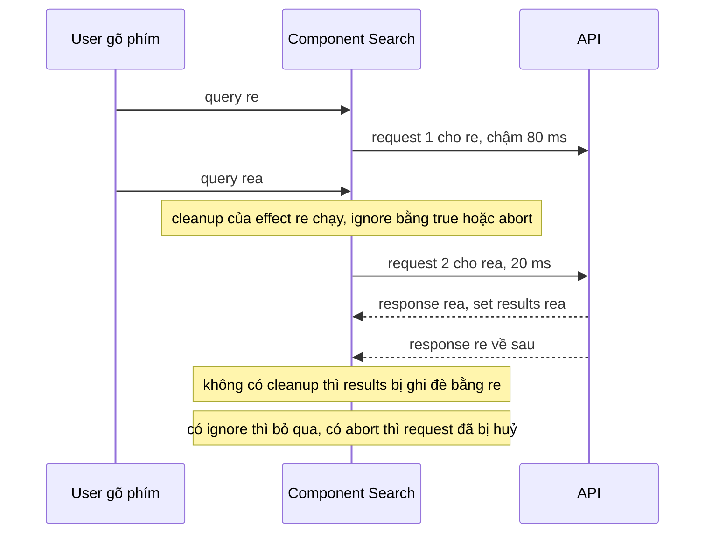
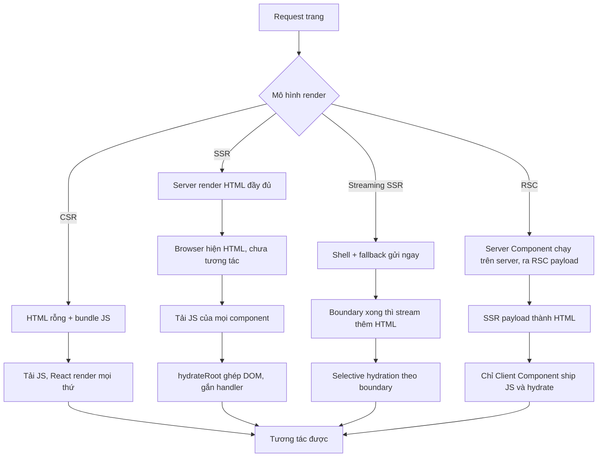

## Bối cảnh & vấn đề

Ô tìm kiếm của một trang thương mại điện tử đôi khi hiện kết quả của từ khoá **cũ**: user gõ "rea", màn hình hiện kết quả cho "re". QA không tái hiện được trên máy mình, vì mạng công ty nhanh và đều. Cùng tháng, trang chi tiết đơn hàng mất 2,8 giây mới hiện đủ: đơn hàng tải xong mới tải khách hàng, khách hàng xong mới tải lịch sử thanh toán, mỗi bước chờ bước trước. Và sau khi team thêm SSR để cải thiện SEO, production log đầy lỗi "Hydration failed because the server rendered HTML didn't match the client".

Ba sự cố này là ba mặt của cùng một câu hỏi: **dữ liệu đi vào cây React ở đâu và khi nào**. Fetch trong `useEffect` có những giới hạn cơ bản (race condition, waterfall, không cache) mà không lượng cleanup nào sửa hết. Render ở server giúp HTML đến sớm, nhưng tạo ra yêu cầu mới: lần render đầu ở client phải **khớp chính xác** với HTML của server. Và React Server Components thay đổi cả mô hình: một số component chỉ chạy trên server và không bao giờ ship JavaScript xuống client.

Bài này đi từ bug race condition (có output chạy thật), qua lý do fetch trong effect là anti-pattern, `use(promise)`, rồi phân biệt CSR, SSR + hydration, streaming và RSC từ góc nhìn của React, cách tìm và sửa hydration mismatch, và khung đánh giá khi cân nhắc chuyển SPA sang Next.js App Router. Kiến thức Next.js cụ thể nằm ở [track Next.js](/tracks/nextjs).

**Interview angle:** `react-014` có red flag rõ ràng: "chỉ thêm debounce là hết". Debounce giảm số request nhưng không đảm bảo thứ tự response.

## Khái niệm

### Race condition khi fetch trong effect

Một effect `fetch` theo `query` bắt đầu một request **mỗi khi `query` đổi**. Các request chạy song song và **về theo thứ tự bất kỳ**. Nếu request cho `"re"` chậm hơn request cho `"rea"`, `setResults` của `"re"` chạy **sau cùng** và ghi đè kết quả mới bằng kết quả cũ. Đó là **race condition**: kết quả phụ thuộc vào thời gian, không phụ thuộc vào logic.

Hai cách chữa trong effect, đều dựa trên cleanup (cleanup của effect cũ chạy khi `query` đổi, xem [bài effects](/tracks/react/learn/effects)):

- **Cờ `ignore`**: cleanup đặt `ignore = true`; khi response cũ về, nó thấy cờ và không set state. Request cũ vẫn chạy tới cùng.
- **`AbortController`**: cleanup gọi `controller.abort()`, trình duyệt **huỷ** request cũ; promise reject với `AbortError`, phải bỏ qua lỗi này. Tiết kiệm băng thông và tải server.

Ngoài ra luôn `encodeURIComponent(query)`, kiểm tra `res.ok` (fetch không reject khi HTTP 500), và debounce input để giảm số request.

### Vì sao fetch trong effect là anti-pattern

Ngay cả khi cleanup đúng, fetch trong effect vẫn có những giới hạn mà react.dev liệt kê:

- **Chậm bắt đầu**: effect chỉ chạy sau khi JS tải, parse, render và commit. Request lẽ ra có thể bắt đầu từ server hoặc ngay khi route match.
- **Waterfall**: component con chỉ mount sau khi cha fetch xong và render; con lại fetch, rồi cháu. Ba request tuần tự thay vì song song.
- **Không cache, không dedupe**: hai component cần cùng dữ liệu thì gửi hai request; quay lại màn hình thì fetch lại và hiện spinner.
- **Tự lo mọi thứ**: loading/error, retry, stale data, refetch khi focus, pagination, SSR, preload. Mỗi team viết lại một phiên bản khác nhau, nhiều bug khác nhau.

Thay thế: **data library** (TanStack Query, SWR, RTK Query: cache theo query key, dedupe, bỏ response cũ, retry), **data loading của router/framework** (React Router loader, TanStack Router, Next.js), hoặc **Server Components**. Effect chỉ còn cho việc đồng bộ thật sự với hệ thống ngoài.

**Interview angle:** `react-045` follow-up "bắt đầu fetch ở đâu để chạy song song với việc tải code của route?": ở router, khi route match (loader hoặc `prefetchQuery` cùng lúc với `import()` của route), không đợi component render.

### use(promise)

`use(resource)` (React 19) đọc giá trị của một **Promise** hoặc **Context**. Với Promise: nếu chưa resolve, component **suspend** (Suspense gần nhất hiện fallback, xem [bài Suspense](/tracks/react/learn/suspense-error-boundaries)); nếu reject, lỗi đi tới error boundary gần nhất. Khác hook thường, `use` gọi được trong `if` và vòng lặp.

Yêu cầu quan trọng nhất: promise phải **ổn định** giữa các lần render. Nếu Client Component tạo promise mới trong render (`use(fetch(...))`), mỗi lần React thử render lại là một promise mới chưa resolve, component suspend mãi. Thí nghiệm bên dưới cho thấy màn hình kẹt ở "loading" và promise bị tạo ba lần. Nguồn promise hợp lệ: được tạo trong **Server Component** rồi truyền xuống Client Component qua props, hoặc lấy từ một **cache** (data library, cache theo key). Không bọc `use` trong `try/catch` để bắt lỗi; dùng error boundary.

**Interview angle:** `react-022` follow-up Next.js: truyền promise **chưa await** từ Server Component xuống Client Component cho phép server gửi HTML khung ngay (không chặn chờ dữ liệu), còn Client Component `use()` promise đó dưới Suspense và stream nội dung khi dữ liệu về.

### CSR, SSR, hydration

- **CSR** (client-side rendering): server trả HTML gần như rỗng (`<div id="root"></div>`) cùng bundle JS. Trình duyệt tải JS, React render toàn bộ UI. First paint có nội dung chậm, SEO phụ thuộc vào crawler chạy JS, bundle lớn.
- **SSR** (server-side rendering): server chạy React (`renderToPipeableStream` trên Node, `renderToReadableStream` trên Web Streams) để tạo HTML đầy đủ. Trình duyệt hiện nội dung ngay khi HTML tới. Nhưng HTML chưa tương tác được; phải tải JS và **hydrate**.
- **Hydration**: `hydrateRoot(container, <App />)` render lại cây ở client, **ghép** kết quả với DOM có sẵn thay vì tạo DOM mới, và gắn event handler. Toàn bộ code component vẫn phải được ship xuống client.

### Streaming SSR và selective hydration

React 18 thêm **streaming**: server gửi HTML khung (shell) ngay, với fallback ở chỗ các `<Suspense>` đang chờ dữ liệu; khi dữ liệu của một boundary về, server gửi thêm một đoạn HTML kèm script nhỏ để "đổi chỗ" fallback bằng nội dung. **Selective hydration**: React hydrate từng boundary khi code của nó sẵn sàng, và ưu tiên boundary mà user đang tương tác (click vào một vùng chưa hydrate thì vùng đó được hydrate trước).

### React Server Components

**Server Component** là component chỉ chạy trên server (khi build hoặc mỗi request). Output của nó không phải HTML mà là **RSC payload**: mô tả cây đã render, kèm "lỗ" tham chiếu tới Client Component. Code của Server Component **không bao giờ** được ship xuống client, nên nó có thể đọc database, dùng secret, import thư viện nặng mà không tốn bundle.

**Client Component** được đánh dấu bằng directive `'use client'` ở đầu file; đó là **ranh giới**: file đó và mọi thứ nó import đi vào bundle client. Chỉ Client Component có state, effect, event handler, và chỉ chúng cần hydrate. Server Component render được Client Component (truyền props có thể serialize), nhưng không dùng được `useState` vì nó không tồn tại ở client để giữ state.

RSC cần framework (bundler phải tách hai đồ thị module, router phải xin payload): Next.js App Router là triển khai chính. **SSR và RSC là hai thứ độc lập**: RSC payload có thể được lấy khi điều hướng mà không SSR; SSR có thể chạy không có RSC (Next.js Pages Router, Remix cổ điển).

**Interview angle:** `react-031`: phân biệt ba câu "HTML đến từ đâu" (SSR), "JS nào xuống client" (RSC giảm), "khi nào tương tác được" (hydration).

### Hydration mismatch

Hydration yêu cầu lần render đầu ở client ra **đúng** HTML mà server đã gửi. Khác đi thì React báo "Hydration failed..." và **render lại cây đó hoàn toàn ở client** (mất lợi ích SSR cho vùng đó, có thể nhấp nháy). React gọi `onRecoverableError` của root. Nguyên nhân thường gặp:

- **Giá trị phụ thuộc thời gian/môi trường**: `Date.now()`, `new Date().toLocaleString()` (timezone, locale server khác client), `Math.random()`, ID tự sinh (dùng `useId`).
- **Rẽ nhánh theo môi trường** trong render: `typeof window !== "undefined"`, đọc `localStorage`, `navigator`, kích thước màn hình.
- **HTML lồng sai**: `<div>` trong `<p>`, `<a>` trong `<a>`, `<tr>` không có `<tbody>`. Parser của trình duyệt **tự sửa** DOM, nên DOM thật khác HTML server gửi.
- **Dữ liệu khác nhau**: server dùng cache cũ, client fetch dữ liệu mới trước khi hydrate.
- **Bên ngoài**: extension trình duyệt chèn attribute hoặc node (Grammarly, password manager), CDN/proxy chỉnh HTML.

## Cơ chế hoạt động

### Race condition và cleanup



Mỗi giá trị `query` có effect riêng với closure riêng. Khi `query` đổi, React chạy cleanup của effect cũ **trước** khi chạy effect mới, nên cờ `ignore` của effect cũ được bật đúng lúc. Response cũ về sau vẫn chạy `.then`, nhưng thấy `ignore === true` của **closure của nó** và không set state. Với `AbortController`, request cũ bị huỷ ở tầng mạng và `.then` không chạy.

### Từ request tới trang tương tác được



Điểm khác cốt lõi nằm ở hai trục: **HTML có sẵn sớm không** (SSR, streaming, RSC đều có) và **bao nhiêu JavaScript phải tải và hydrate** (CSR và SSR: mọi component; RSC: chỉ Client Component). Streaming thêm trục thứ ba: không phải chờ phần chậm nhất của trang mới gửi được byte đầu tiên.

## Ví dụ thực tế

Output dưới đây là **output thật** (React 19.2.8; client trong jsdom, server bằng `react-dom/server` trên Node). `fakeFetch` giả lập mạng: `"r"` 10 ms, `"re"` 80 ms (chậm), `"rea"` 20 ms.

### Ba phiên bản Search (react-014)

```tsx
function Buggy({ query }: { query: string }) {
  const [r, setR] = useState<string[]>([]);
  useEffect(() => { fakeFetch(query).then(setR); }, [query]);
  return <p>{r.join(",")}</p>;
}
function Ignore({ query }: { query: string }) {
  const [r, setR] = useState<string[]>([]);
  useEffect(() => {
    let ignore = false;
    fakeFetch(query).then((x) => { if (!ignore) setR(x); });
    return () => { ignore = true; };
  }, [query]);
  return <p>{r.join(",")}</p>;
}
function Abort({ query }: { query: string }) {
  const [r, setR] = useState<string[]>([]);
  useEffect(() => {
    const c = new AbortController();
    fakeFetch(query, c.signal)
      .then(setR)
      .catch((e) => { if (e.name !== "AbortError") throw e; });
    return () => c.abort();
  }, [query]);
  return <p>{r.join(",")}</p>;
}
// gõ "r" → "re" → "rea" cách nhau 5 ms, rồi chờ mọi response
```

```text
A) Buggy  typed "rea" -> screen shows: re-1,re-2
A) Ignore typed "rea" -> screen shows: rea-1,rea-2
A) Abort  typed "rea" -> screen shows: rea-1,rea-2  (aborted requests: 2)
```

Bản lỗi hiện kết quả của `"re"` dù user đã gõ `"rea"`. Bản `AbortController` huỷ hai request cũ. Bản dùng TanStack Query không cần cleanup tự viết:

```tsx
function Search({ query }: { query: string }) {
  const { data = [], isFetching } = useQuery({
    queryKey: ["search", query],
    queryFn: ({ signal }) =>
      fetch(`/api/search?q=${encodeURIComponent(query)}`, { signal }).then((r) => {
        if (!r.ok) throw new Error(`HTTP ${r.status}`);
        return r.json() as Promise<Item[]>;
      }),
    enabled: query.length > 1,
    placeholderData: keepPreviousData, // giữ kết quả cũ khi đang tải query mới
  });
  return <List items={data} dim={isFetching} />;
}
```

Mỗi `query` là một cache entry riêng; dữ liệu hiển thị luôn thuộc về `queryKey` hiện tại, nên response cũ không thể ghi đè. Query truyền `signal` để thư viện huỷ request không còn cần.

Follow-up "vì sao `useDeferredValue` một mình không sửa race?": nó chỉ trì hoãn **render**; mỗi giá trị `query` vẫn kích hoạt một request, và response cũ về sau vẫn gọi `setResults`.

### use() với promise không ổn định (react-022)

```tsx
function Profile() {
  const user = use((calls++, sleep(10).then(() => "Ann"))); // promise mới mỗi lần render
  return <p>{user}</p>;
}
// <Suspense fallback={<p>loading</p>}><Profile /></Suspense>, chờ 100 ms
```

```text
B) screen: loading | promise created 3 times
```

Promise đã resolve sau 10 ms nhưng mỗi lần React thử render lại, component tạo promise **mới**, suspend lại. Sửa: tạo promise ở Server Component, hoặc lấy từ cache:

```tsx
// Server Component (Next.js App Router)
export default async function Page({ params }: { params: Promise<{ id: string }> }) {
  const { id } = await params;                     // Next.js 15+: params là Promise
  const userPromise = getUser(id);                 // không await: không chặn shell
  return (
    <Suspense fallback={<ProfileSkeleton />}>
      <Profile userPromise={userPromise} />
    </Suspense>
  );
}

// Client Component
"use client";
export function Profile({ userPromise }: { userPromise: Promise<User> }) {
  const user = use(userPromise);                   // cùng promise qua mọi render
  return <p>{user.name}</p>;
}
```

### Streaming SSR

```tsx
let p: Promise<string> | null = null;
function Reviews() {
  p ??= sleep(30).then(() => "4.8 stars");
  return <section>{use(p)}</section>;
}
function Page() {
  return (
    <main>
      <h1>Product</h1>
      <Suspense fallback={<p>Loading reviews…</p>}><Reviews /></Suspense>
    </main>
  );
}
const { pipe } = renderToPipeableStream(<Page />, { onShellReady() { pipe(res); } });
```

```text
B) chunk 1 at +6ms (174 bytes): <main><h1>Product</h1><!--$?--><template id="B:0"></template><p>Loading reviews…</p><!--/$--></main><script…/>
B) chunk 2 at +37ms (917 bytes): <div hidden id="S:0"><section>4.8 stars</section></div><script…/>
```

(Nội dung các thẻ `<script>` được rút gọn.) Byte đầu tiên đi sau 6 ms với fallback; phần reviews đi sau khoảng 30 ms trong một `div hidden`, và script nhỏ đi kèm chuyển nó vào đúng chỗ `B:0`. Trang không phải chờ phần chậm nhất.

### Hydration mismatch (react-038)

```tsx
function Clock({ now }: { now: string }) { return <p>Rendered at {now}</p>; }
function Nested() { return <p>Price: <div>100</div></p>; }
function Ts({ now }: { now: string }) { return <p suppressHydrationWarning>{now}</p>; }
// renderToString ở "server", gán vào innerHTML (trình duyệt parse), rồi hydrateRoot với props của "client"
```

```text
A) server HTML: <p>Rendered at <!-- -->10:00:00</p>
   DOM after browser parse: <p>Rendered at <!-- -->10:00:00</p>
   onRecoverableError: Hydration failed because the server rendered text didn't match the client. As a result this tree will be regenerated on the client. This can happen if a SSR-ed Client Component used:
   final DOM: <p>Rendered at 10:00:03</p>
B) server HTML: <p>Price: <div>100</div></p>
   DOM after browser parse: <p>Price: </p><div>100</div><p></p>
   onRecoverableError: Hydration failed because the server rendered HTML didn't match the client. As a result this tree will be regenerated on the client. This can happen if a SSR-ed Client Component used:
   final DOM: <p>Price: <div>100</div></p>
C) suppressHydrationWarning server HTML: <p>10:00:00</p>
   DOM after browser parse: <p>10:00:00</p>
   final DOM: <p>10:00:00</p>
```

Ba điều rút ra. (A) thời gian khác nhau giữa server và client: React vứt DOM của server và render lại ở client. (B) server không sai gì về logic, nhưng parser **tách** `<div>` ra khỏi `<p>`, nên DOM không còn khớp. (C) `suppressHydrationWarning` chỉ tắt cảnh báo cho **text của đúng phần tử đó** (một cấp), và React **giữ text của server** (`10:00:00`), không vá thành giá trị client. Vì vậy nó chỉ hợp với timestamp chấp nhận lệch; đặt nó trên `<body>` không che được lỗi ở sâu hơn, chỉ che attribute/text của chính `<body>`.

Cách sửa chuẩn cho giá trị chỉ có ở client: render giá trị trung tính ở lần đầu rồi cập nhật sau khi mount, hoặc dùng `useSyncExternalStore` với `getServerSnapshot`:

```tsx
const subscribe = () => () => {};
function LocalTime({ iso }: { iso: string }) {
  const isClient = useSyncExternalStore(subscribe, () => true, () => false);
  return <time dateTime={iso}>{isClient ? new Date(iso).toLocaleString() : iso.slice(0, 10)}</time>;
}
```

Tìm component gây lỗi: React 19 in **diff** chi tiết của vùng không khớp ở dev (verify); so "View Source" (HTML server) với DOM trong DevTools; thử ở cửa sổ ẩn danh để loại trừ extension; bisect bằng cách tắt dần các component.

### Đánh giá migrate SPA sang Next.js App Router (react-054)

Không có câu trả lời mặc định; khung đánh giá:

1. **App có phần public/SEO không?** Dashboard sau login hưởng lợi ít nhất từ SSR/RSC; landing, catalog, blog hưởng lợi nhiều.
2. **Bottleneck hiện tại là gì?** Đo trước: bundle (JS per route), API latency, waterfall. Nếu vấn đề là waterfall, router loader + React Query + prefetch giải quyết được mà không cần đổi framework.
3. **Chi phí**: mô hình server/client boundary mới, cần hạ tầng chạy server (không chỉ static hosting), thư viện client-only phải bọc `'use client'`, auth/session đổi (cookie ở server), caching của framework phải học, learning curve của team.
4. **Nếu làm**: migrate incremental theo route (proxy/rewrite từ app cũ sang app mới), đo trước và sau mỗi route.

Follow-up "phần nào của dashboard sau login hưởng lợi ít nhất từ Server Components?": các màn hình tương tác dày (editor, bảng lọc realtime, form nhiều bước) vì gần như toàn bộ là Client Component; RSC chỉ có lợi ở khung và phần đọc nhiều, tương tác ít.

## Trade-offs & lựa chọn thay thế

| Cách lấy dữ liệu | Race | Waterfall | Cache/dedupe | SSR | Hợp khi |
|---|---|---|---|---|---|
| `useEffect` + `fetch` tự viết | Tự lo (ignore/abort) | Dễ bị | Không | Không | Widget nhỏ, prototype |
| TanStack Query / SWR | Thư viện lo | Giảm được nhờ prefetch | Có | Có (hydrate cache) | SPA, dashboard, mọi app client |
| Router loader | Router lo | Loader song song theo route | Tuỳ router | Tuỳ framework | Route-centric app |
| Server Components | Không có ở client | Tránh được nếu fetch song song | Framework cache | Có | Next.js App Router, trang đọc nhiều |
| `use(promise)` từ Server Component | Không | Stream theo boundary | Theo nguồn promise | Có | Khung trang nhanh, dữ liệu chậm stream sau |

| Mô hình render | First content | JS xuống client | SEO | Hạ tầng |
|---|---|---|---|---|
| CSR | Chậm | Toàn bộ | Yếu | Static hosting |
| SSR + hydration | Nhanh | Toàn bộ | Tốt | Server Node/Edge |
| Streaming SSR | Nhanh, không chờ phần chậm | Toàn bộ | Tốt | Server hỗ trợ stream |
| RSC + SSR | Nhanh | Chỉ Client Component | Tốt | Framework (Next.js) |

Khi nào chọn gì: app sau login thuần tương tác vẫn có thể là CSR + React Query + code splitting, đơn giản và rẻ. Trang public cần SEO và first paint nhanh thì SSR/streaming. RSC đáng giá khi phần lớn trang là nội dung đọc và bạn muốn cắt JS xuống client, chấp nhận học một mô hình mới.

## Edge cases & failure modes

- **Fetch không reject khi 4xx/5xx.** `fetch` chỉ reject khi lỗi mạng; không kiểm tra `res.ok` thì `res.json()` của trang lỗi HTML ném lỗi parse khó hiểu.
- **AbortError bị báo như lỗi thật.** Quên bỏ qua `AbortError` thì mỗi lần gõ phím, monitoring nhận một lỗi.
- **StrictMode và fetch trong effect.** Ở dev, effect chạy hai lần nên có hai request; với cleanup đúng, request đầu bị huỷ hoặc bỏ qua.
- **Hydration mismatch lặp lại theo timezone.** Chỉ user ở timezone khác server gặp lỗi; local dev không thấy. Truyền timezone từ server hoặc format ở client sau mount.
- **`typeof window` trong render.** Server render nhánh A, client render nhánh B: mismatch chắc chắn. Dùng `useSyncExternalStore` với `getServerSnapshot` hoặc render sau mount.
- **Dữ liệu server cache cũ.** HTML dựng từ cache 5 phút trước, client fetch dữ liệu mới rồi render trước khi hydrate: khác nhau. Hydrate bằng **đúng** dữ liệu server đã dùng (dehydrate/hydrate cache).
- **Serialize props qua ranh giới RSC.** Truyền function, class instance, `Date` phức tạp từ Server Component xuống Client Component: lỗi serialize. Chỉ truyền dữ liệu serializable (và promise, Server Action).
- **Promise reject trong `use()` không có error boundary.** Lỗi đi tới root, cả trang trắng.

## Pitfalls

- ❌ Chỉ thêm debounce để "sửa" kết quả cũ đè kết quả mới → ✅ cleanup với `ignore` hoặc `AbortController`, hoặc data library theo query key.
- ❌ Fetch trong effect ở component con sau khi cha fetch xong → ✅ fetch song song ở router/loader, hoặc gom request ở server.
- ❌ `use(fetch(url))` trong Client Component → ✅ promise từ Server Component hoặc từ cache ổn định.
- ❌ Bọc `use()` trong `try/catch` → ✅ error boundary cho promise reject.
- ❌ `Date.now()`, `Math.random()`, `localStorage` trong render của component SSR → ✅ `useId`, giá trị từ server, hoặc cập nhật sau mount.
- ❌ `suppressHydrationWarning` trên `<body>` để tắt mọi lỗi → ✅ chỉ đặt trên phần tử có text lệch không tránh được; nó chỉ có tác dụng một cấp và giữ text của server.
- ❌ `<div>` bên trong `<p>`, `<a>` lồng `<a>` → ✅ HTML hợp lệ; parser tự sửa DOM gây mismatch.
- ❌ Nghĩ SSR và RSC là một → ✅ SSR tạo HTML; RSC quyết định component nào chạy ở server và không ship JS.

## Tóm tắt

- Fetch trong effect theo prop có **race condition**; chữa bằng cleanup với cờ `ignore` hoặc `AbortController` (huỷ request), cộng `encodeURIComponent`, `res.ok`, debounce.
- Ngay cả khi đúng, fetch trong effect vẫn **chậm bắt đầu, tạo waterfall, không cache**; dùng data library, router loader hoặc Server Components.
- `use(promise)` suspend tới khi resolve, reject đi tới error boundary, gọi được trong `if`; promise phải **ổn định** (từ Server Component hoặc cache).
- **CSR** render ở client; **SSR** gửi HTML rồi **hydrate** (ghép DOM, gắn handler); **streaming** gửi shell trước và stream từng Suspense boundary; **RSC** chạy component ở server và chỉ ship JS của Client Component.
- **Hydration mismatch** do giá trị thời gian/random/locale, rẽ nhánh theo `window`, HTML lồng sai (parser tự sửa), dữ liệu khác nhau, extension; React render lại vùng đó ở client và gọi `onRecoverableError`.
- `suppressHydrationWarning` chỉ cho text lệch không tránh được, tác dụng một cấp, giữ text của server.
- Migrate SPA sang Next.js: đánh giá theo nhu cầu SEO, bottleneck đo được và chi phí mô hình mới; migrate từng route.
