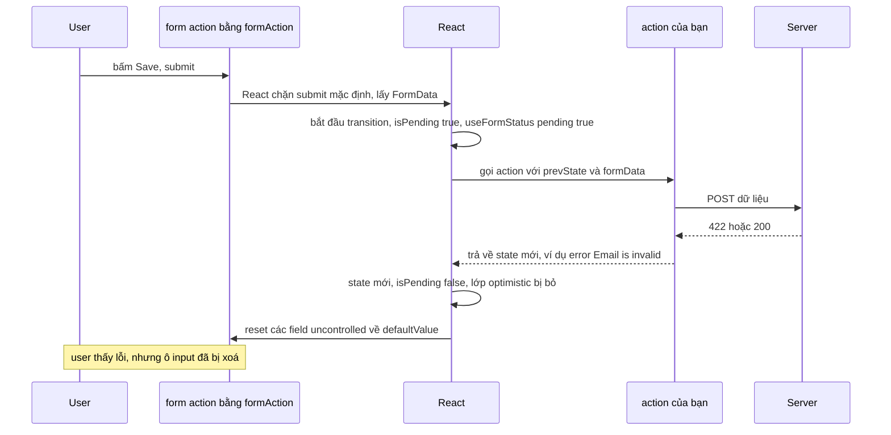
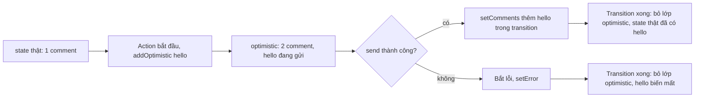

## Bối cảnh & vấn đề

Form "Cập nhật hồ sơ" của một app có 20 trường. Phiên bản đầu dùng controlled input cho mọi trường: mỗi phím gõ render lại cả form, trên điện thoại cấp thấp gõ bị trễ thấy rõ. Nút "Lưu" có ba state riêng (`isSaving`, `error`, `success`) và ai đó quên reset `error` khi submit lần hai, nên lỗi cũ vẫn hiện. Ô nhập số tiền tự thêm dấu phẩy khi gõ, và cursor nhảy về cuối mỗi phím. Comment "Đã gửi" hiện ngay nhưng khi mạng lỗi thì comment ma vẫn nằm đó.

React 19 đưa ra **Actions**: một mô hình chuẩn cho mutation, gồm `<form action={fn}>`, `useActionState`, `useFormStatus` và `useOptimistic`. Chúng xử lý pending, lỗi, thứ tự các lần submit và optimistic UI mà trước đây mỗi team tự viết. Nhưng chúng có những hành vi cần biết trước, ví dụ form tự reset sau khi action hoàn tất, kể cả khi action trả về lỗi validation (thí nghiệm bên dưới).

Bài này bắt đầu từ controlled vs uncontrolled, rồi đi qua từng API của Actions với output chạy thật, lý do cursor nhảy trong input controlled, và cách thiết kế một hệ thống cho 30 form phức tạp. Transition, nền của Actions, ở [bài concurrent rendering](/tracks/react/learn/concurrent-rendering).

**Interview angle:** `react-004` nghe dễ nhưng follow-up về React 19 ("field uncontrolled ra sao sau khi submit thành công?") lọc người đã dùng Actions thật.

## Khái niệm

### Controlled input

**Controlled input** nhận `value` từ state React và cập nhật state trong `onChange`. React là **nguồn sự thật**: DOM luôn hiển thị đúng `value` mà render cuối cùng trả về. Ưu điểm: validate và format ngay khi gõ, disable nút theo state, đồng bộ nhiều trường. Chi phí: mỗi phím là một lần render của component giữ state (và của mọi con không memo).

```tsx
const [email, setEmail] = useState("");
<input value={email} onChange={(e) => setEmail(e.target.value)} />
```

### Uncontrolled input

**Uncontrolled input** để **DOM giữ giá trị**. Bạn chỉ đặt giá trị ban đầu bằng `defaultValue` (hoặc `defaultChecked`), và đọc giá trị khi cần: qua `ref.current.value`, hoặc qua `FormData` khi submit. Không render khi gõ, hợp với form lớn, và là mô hình mà `<form action>` của React 19 dựa vào. Thư viện như React Hook Form dựa trên uncontrolled (đăng ký ref) để có hiệu năng tốt.

Đừng đổi qua lại giữa hai chế độ trong vòng đời của một input: `value={undefined}` rồi `value="x"` làm React cảnh báo "A component is changing an uncontrolled input to be controlled". Khởi tạo state bằng `""`, không bằng `undefined`.

### Action

Trong React 19, **Action** là một function (thường async) chạy **trong một transition** để thực hiện mutation. Truyền function vào prop `action` của `<form>` (hoặc `formAction` của `<button>`) thì khi submit, React chặn submit mặc định của trình duyệt, gọi function với **`FormData`** của form, trong một transition (verify). Không cần `e.preventDefault()`, không cần state cho từng trường.

Sau khi Action hoàn tất mà không ném lỗi, React **tự reset** các field uncontrolled của form về `defaultValue` (verify). Muốn reset thủ công ở nơi khác, dùng `requestFormReset(form)` của `react-dom`.

### useActionState

`const [state, formAction, isPending] = useActionState(action, initialState)`. React bọc `action` của bạn: mỗi lần `formAction` được gọi, React gọi `action(prevState, formData)`, lấy giá trị trả về (hoặc giá trị resolve) làm `state` mới. `isPending` là `true` trong lúc action chạy. Các lần gọi được **xếp hàng tuần tự**: lần 2 nhận `prevState` là kết quả của lần 1.

Lỗi **mong đợi** (validation, 422, hết hàng) nên được **trả về** trong state để hiển thị; `throw` sẽ đẩy lỗi lên error boundary gần nhất và thay cả vùng bằng fallback. Hook này trước đây có tên `useFormState` trong `react-dom` bản canary và đã được đổi tên (verify).

### useFormStatus

`const { pending, data, method, action } = useFormStatus()` (từ `react-dom`) đọc trạng thái của **`<form>` cha gần nhất**. Nó phải được gọi trong một component **con** của form; gọi trong chính component render `<form>` thì không thấy form đó (hook đọc context mà form cung cấp cho các con). Dùng để làm nút submit và input dùng chung trong design system: nút tự disable và hiện "Đang lưu…" mà không cần nhận prop từ form.

**Interview angle:** `react-020` follow-up "`useFormStatus` khác gì và vì sao phải gọi ở con?": nó không giữ state kết quả như `useActionState`, chỉ đọc pending/data của form đang submit; nó đọc qua context của `<form>` nên phải nằm dưới form.

### useOptimistic

`const [optimistic, addOptimistic] = useOptimistic(state, (current, input) => next)`. `optimistic` bằng `state` khi không có action nào đang chạy. Gọi `addOptimistic(input)` **bên trong một Action hoặc transition** thì React hiển thị `next` ngay, trong lúc action còn chạy. Khi transition kết thúc, React **bỏ lớp optimistic** và render lại từ `state` thật.

Hệ quả: thành công thì `state` thật phải đã chứa item mới (bạn setState, revalidate hoặc router refresh), nên UI không đổi; thất bại thì item optimistic **tự biến mất**, không cần viết rollback, nhưng bạn phải tự hiện lỗi. Gọi `addOptimistic` ngoài transition thì React cảnh báo và giá trị không được giữ.

**Interview angle:** `react-021` follow-up so với `onMutate` của React Query: `useOptimistic` là state **cục bộ** của một component; `onMutate` sửa **cache dùng chung**, nên mọi màn hình đọc cùng query key thấy thay đổi và rollback nhất quán.

### Vì sao cursor nhảy về cuối

Khi user gõ, trình duyệt sửa DOM và đặt cursor. Rồi React render và gán `input.value = <giá trị từ state>`. Nếu giá trị đó **giống** cái DOM đang có, React không đụng vào DOM và cursor đứng yên. Nếu **khác** (bạn đã uppercase, thêm dấu phẩy, cắt ký tự), React phải gán value mới, và trình duyệt đặt cursor về **cuối** chuỗi.

Ba nguyên nhân: (1) **biến đổi giá trị** trong `onChange` (format tiền, uppercase); (2) **update không đồng bộ**: setState sau `await`, state trong transition, hoặc store cập nhật trễ, nên React ghi một giá trị cũ đè lên cái user vừa gõ; (3) **remount** mỗi phím (key đổi, component khai báo lồng) làm mất luôn cả focus.

Cách sửa: giữ **raw value** khi gõ và format khi `blur`; cập nhật state **đồng bộ** trong `onChange`, không trong transition; nếu buộc phải format live, tính lại vị trí cursor và đặt `setSelectionRange` trong `useLayoutEffect`; hoặc dùng uncontrolled input với thư viện mask.

**Interview angle:** `react-048` follow-up "vì sao state của input không được nằm trong `startTransition`?": transition có thể bị trì hoãn hoặc render lại; trong lúc đó DOM đã có ký tự mới nhưng React sẽ commit `value` cũ đè lên.

## Cơ chế hoạt động

### Vòng đời một form Action



Sơ đồ đọc theo thời gian. Submit đi vào React chứ không phải trình duyệt, nên không có full page reload. React đánh dấu transition đang chạy: `isPending` của `useActionState` và `pending` của `useFormStatus` cùng bật. Action async của bạn chạy; trong lúc đó user vẫn tương tác được. Khi action trả về, giá trị đó thành `state`, mọi `addOptimistic` trong transition bị bỏ, và React reset form. Bước reset xảy ra cả khi action **trả về** một lỗi validation, vì với React đó vẫn là một action hoàn tất bình thường.

### Lớp optimistic



## Ví dụ thực tế

Output dưới đây là **output thật** (React 19.2.8, react-dom/client trong jsdom, submit bằng `form.requestSubmit()`).

### useActionState + useFormStatus (react-020)

```tsx
type State = { error?: string; ok?: boolean; calls: number };

async function saveEmail(prev: State, formData: FormData): Promise<State> {
  const email = String(formData.get("email"));
  console.log(`  action called: prev.calls=${prev.calls} email="${email}"`);
  await sleep(20);                                   // giả lập POST /api/profile
  if (!email.includes("@")) return { error: "Email is invalid", calls: prev.calls + 1 };
  return { ok: true, calls: prev.calls + 1 };
}

function SubmitButton() {
  const { pending, data } = useFormStatus();         // đọc form cha
  return <button type="submit">{pending ? `Saving ${data?.get("email")}…` : "Save"}</button>;
}

function EmailForm() {
  const [state, formAction, isPending] = useActionState(saveEmail, { calls: 0 });
  return (
    <form action={formAction}>
      <input name="email" defaultValue="" />
      <SubmitButton />
      <span>
        {isPending ? "[isPending]" : ""}
        {state.error ? `[alert: ${state.error}]` : ""}
        {state.ok ? "[saved]" : ""}
      </span>
    </form>
  );
}
```

```text
A) submit invalid
  action called: prev.calls=0 email="not-an-email"
  while pending: button="Saving not-an-email…" status="[isPending]" input="not-an-email"
  after: button="Save" status="[alert: Email is invalid]" input=""
A) submit valid
  action called: prev.calls=1 email="a@b.co"
  after: button="Save" status="[saved]" input=""
A) two quick submits
  action called: prev.calls=2 email="x"
  action called: prev.calls=3 email="x"
  after: button="Save" status="[alert: Email is invalid]" input=""
```

Bốn điều quan sát được. `useFormStatus` ở nút con thấy `pending` và cả `data` đang gửi. Hai lần submit nhanh chạy **tuần tự** (`prev.calls` 2 rồi 3). Lỗi validation được trả về và hiển thị. Và ô input bị **xoá sau lần submit lỗi**: user gõ sai một ký tự là mất hết. Cách giữ giá trị: trả lại dữ liệu đã nhập trong state và dùng nó làm `defaultValue` (React reset về `defaultValue` mới):

```tsx
type State = { error?: string; values: { email: string } };

async function saveEmail(prev: State, fd: FormData): Promise<State> {
  const email = String(fd.get("email"));
  const res = await fetch("/api/profile", { method: "POST", body: JSON.stringify({ email }) });
  if (res.status === 422) return { error: "Email is invalid", values: { email } };
  return { values: { email: "" } };
}
// <input name="email" defaultValue={state.values.email} key={state.values.email} />
```

`key` theo giá trị đảm bảo input nhận `defaultValue` mới ngay cả khi React không reset.

### useOptimistic khi server thành công và thất bại (react-021)

```tsx
type C = { id: string; text: string; pending?: boolean };

function Comments({ send }: { send: (t: string) => Promise<void> }) {
  const [comments, setComments] = useState<C[]>([{ id: "1", text: "first" }]);
  const [optimistic, addOptimistic] = useOptimistic(
    comments,
    (list, text: string) => [...list, { id: "temp", text, pending: true }],
  );
  const [error, setError] = useState("");
  async function action(formData: FormData) {
    const text = String(formData.get("text"));
    addOptimistic(text);
    try {
      await send(text);
      startTransition(() => setComments((l) => [...l, { id: crypto.randomUUID(), text }]));
      setError("");
    } catch (e) {
      setError((e as Error).message);               // optimistic item sẽ tự biến mất
    }
  }
  return (
    <form action={action}>
      <ul>{optimistic.map((c) => <li key={c.id}>{c.text}{c.pending ? " (sending)" : ""}</li>)}</ul>
      <input name="text" />
      {error && <p>{error}</p>}
    </form>
  );
}
```

```text
B) useOptimistic, server succeeds
  during: firsthello (sending)
  after: firsthello |
B) useOptimistic, server fails
  during: firsthello (sending)
  after: first | Network error, comment not sent
C) addOptimistic outside transition
[console.error] An optimistic state update occurred outside a transition or action. To fix, move the update to an action, or wrap with startTransition.
  button: 0
```

`setComments` sau `await` được bọc trong `startTransition`, vì setState sau `await` trong Action không tự động thuộc transition (hạn chế hiện tại theo react.dev) (verify). Case C: gọi `addOptimistic` trong `onClick` thường không có tác dụng.

### Uncontrolled sang controlled

```tsx
function Toggle() {
  const [v, setV] = useState<string | undefined>(undefined);
  return <><input value={v} onChange={(e) => setV(e.target.value)} /><button onClick={() => setV("x")}>set</button></>;
}
```

```text
[console.error] A component is changing an uncontrolled input to be controlled. This is likely caused by the value changing from undefined to a defined value, which should not happen. Decide between using a controlle
```

(Thông điệp bị cắt ở 200 ký tự trong harness.)

### Cursor nhảy khi biến đổi giá trị (react-048)

```tsx
function Plain() { const [v, setV] = useState("abc"); return <input value={v} onChange={(e) => setV(e.target.value)} />; }
function Upper() { const [v, setV] = useState("abc"); return <input value={v} onChange={(e) => setV(e.target.value.toUpperCase())} />; }
// user gõ "x" ở vị trí 1: DOM thành "axbc", cursor ở 2
```

```text
E) Plain: value="axbc" caret=2
E) Upper: value="AXBC" caret=4
```

(jsdom mô phỏng việc gán `value` đặt cursor về cuối giống trình duyệt; hành vi trên từng trình duyệt thật có thể khác chi tiết.) Sửa cho trường hợp format tiền: lưu raw digits, hiển thị bản format, và khôi phục cursor theo số chữ số đứng trước nó:

```tsx
function MoneyInput({ value, onChange }: { value: string; onChange: (digits: string) => void }) {
  const ref = useRef<HTMLInputElement>(null);
  const caretDigits = useRef<number | null>(null);
  const formatted = value ? Number(value).toLocaleString("en-US") : "";
  useLayoutEffect(() => {
    const el = ref.current;
    if (!el || caretDigits.current === null) return;
    let pos = 0, seen = 0;
    while (pos < formatted.length && seen < caretDigits.current) { if (/\d/.test(formatted[pos])) seen++; pos++; }
    el.setSelectionRange(pos, pos);                   // trước paint: không nhấp nháy
    caretDigits.current = null;
  });
  return (
    <input
      ref={ref}
      inputMode="numeric"
      value={formatted}
      onChange={(e) => {
        const before = e.target.value.slice(0, e.target.selectionStart ?? 0);
        caretDigits.current = before.replace(/\D/g, "").length;
        onChange(e.target.value.replace(/\D/g, ""));  // đồng bộ, không trong transition
      }}
    />
  );
}
```

### Thiết kế form system cho 30+ form (react-055)

Khung thiết kế, theo từng quyết định:

- **Nền tảng**: React Hook Form (uncontrolled, ít render) hoặc TanStack Form; **schema dùng chung FE/BE** bằng zod cho kiểu và validation, để lỗi client và server nói cùng một ngôn ngữ.
- **Tách draft khỏi server state**: dữ liệu load từ API chỉ khởi tạo form một lần (`defaultValues`, key theo entity id, xem [bài reconciliation](/tracks/react/learn/reconciliation-keys)); submit qua mutation hoặc Action.
- **Lỗi server về từng field**: API trả Problem Details (RFC 9457) với mảng `errors[]` có `field`; form map về `setError(field, message)`.
- **Multi-step**: reducer hoặc state machine cho bước ([bài render & snapshot](/tracks/react/learn/render-commit-snapshot)); persist draft (autosave debounce + PUT idempotent, hoặc `localStorage`), cảnh báo khi rời trang có thay đổi chưa lưu.
- **Conditional fields**: schema dạng discriminated union (`z.discriminatedUnion("type", ...)`); unregister field bị ẩn để không gửi giá trị cũ.
- **A11y**: `<label>` cho mọi input, lỗi gắn `aria-describedby` và `aria-invalid`, focus field lỗi đầu tiên khi submit thất bại.
- **Component field chuẩn** trong design system (`<TextField>`, `<MoneyField>`, `<SubmitButton>` dùng `useFormStatus`) để 30 form nhất quán.

Follow-up "autosave và submit tay đua nhau, bản cũ ghi đè bản mới": gắn **version** (hoặc `updatedAt`) vào mỗi lần lưu và server từ chối bản cũ hơn (optimistic concurrency, 409); ở client, huỷ autosave đang chờ khi submit tay (`AbortController`), và chỉ áp response nếu nó thuộc lần lưu mới nhất (so sequence number).

## Trade-offs & lựa chọn thay thế

| Cách làm form | Render khi gõ | Validate live | Pending/lỗi | Hợp khi |
|---|---|---|---|---|
| Controlled + `useState` | Mỗi phím | Dễ | Tự viết | Form nhỏ, cần format/validate live |
| Uncontrolled + `<form action>` + `useActionState` | Không | Chỉ khi submit (hoặc HTML validation) | Có sẵn, xếp hàng tuần tự | Form đơn giản đến vừa, Server Actions |
| React Hook Form | Gần như không | Có (resolver zod) | Tự nối với mutation | Form lớn, nhiều field, validate phức tạp |
| TanStack Form | Theo field | Có | Tự nối | Cần type-safety sâu, form động |
| Optimistic bằng `useOptimistic` | | | Tự revert khi transition xong | UI cục bộ một component |
| Optimistic qua data library (`onMutate`) | | | Rollback thủ công, cache chung | Dữ liệu hiện ở nhiều màn hình |

Khi nào chọn gì: form vài trường gửi lên server, nhất là với Next.js Server Actions, thì `<form action>` + `useActionState` là gọn nhất; nhớ hành vi reset. Form lớn, nhiều bước, validate phức tạp thì React Hook Form với schema zod. Controlled input vẫn đúng cho trường cần phản hồi từng phím (search, format tiền), miễn là state nằm ở component nhỏ để không render cả form. Với optimistic update trên dữ liệu dùng chung (danh sách hiện ở sidebar và trang chính), dùng cơ chế của data library thay vì `useOptimistic`.

## Edge cases & failure modes

- **Form reset sau lỗi validation trả về.** Action hoàn tất nên field uncontrolled bị xoá; trả lại giá trị trong state làm `defaultValue`, hoặc dùng controlled cho form cần giữ dữ liệu.
- **Action ném lỗi.** Lỗi đi lên error boundary, cả vùng bị thay bằng fallback; chỉ `throw` cho lỗi bất ngờ.
- **Submit trùng.** `useActionState` xếp hàng tuần tự, không bỏ qua lần hai; nút nên disable khi `pending` nếu mutation không idempotent, và server cần idempotency key cho thanh toán.
- **setState sau `await` trong Action.** Không thuộc transition; bọc lại bằng `startTransition` nếu muốn nó được xử lý cùng lớp optimistic.
- **`useFormStatus` gọi ngoài form.** Luôn trả `pending: false`; không lỗi, nên dễ tưởng là chạy.
- **File upload và `FormData`.** `formData.get("file")` là `File`; gửi qua `fetch` với body `FormData`, đừng `JSON.stringify` (file thành `{}`).
- **Checkbox không được tick.** Không có trong `FormData`; `formData.get("agree")` là `null`, không phải `"false"`.
- **Controlled input với IME (tiếng Việt, tiếng Nhật).** Format trong `onChange` giữa lúc đang gõ tổ hợp (composition) phá chữ; chờ `compositionend` hoặc format khi blur.

## Pitfalls

- ❌ Controlled input cho mọi trường của form 50 trường → ✅ uncontrolled (React Hook Form hoặc `<form action>`), controlled chỉ cho trường cần phản hồi từng phím.
- ❌ `useState<string>()` rồi `value={v}` → ✅ khởi tạo `""`; không đổi uncontrolled sang controlled.
- ❌ `throw` cho lỗi validation trong action → ✅ trả lỗi trong state; `throw` dành cho lỗi bất ngờ (error boundary).
- ❌ Gọi `useFormStatus` trong component render `<form>` → ✅ gọi trong component con của form (nút submit dùng chung).
- ❌ Gọi `addOptimistic` trong `onClick` thường → ✅ gọi bên trong Action hoặc `startTransition`.
- ❌ Tự viết rollback sau khi optimistic thất bại → ✅ `useOptimistic` tự bỏ lớp optimistic; chỉ cần hiện lỗi và cập nhật state thật khi thành công.
- ❌ Format số tiền trong `onChange` rồi than cursor nhảy → ✅ format khi blur, hoặc khôi phục cursor trong `useLayoutEffect`.
- ❌ Bọc `setText` của input trong transition → ✅ state của input cập nhật đồng bộ.

## Tóm tắt

- **Controlled**: React giữ giá trị (`value` + `onChange`), validate/format live, render mỗi phím. **Uncontrolled**: DOM giữ (`defaultValue`), đọc qua ref hoặc `FormData`, ít render.
- **Action** (React 19): function chạy trong transition; `<form action={fn}>` gọi `fn(formData)`, không cần `preventDefault`, và **reset field uncontrolled** sau khi action hoàn tất, kể cả khi trả về lỗi validation.
- `useActionState(action, init)` → `[state, formAction, isPending]`; action nhận `(prevState, formData)`; các lần gọi xếp hàng tuần tự; lỗi mong đợi trả về trong state.
- `useFormStatus()` (react-dom) đọc `pending`/`data` của form cha; phải gọi trong component con.
- `useOptimistic(state, reducer)`: gọi `addOptimistic` trong Action; khi transition xong lớp optimistic bị bỏ, thất bại thì item tự biến mất.
- Cursor nhảy khi React gán `value` khác cái DOM vừa có: biến đổi giá trị, update trễ/trong transition, hoặc remount.
- Form system lớn: thư viện uncontrolled + schema dùng chung, draft tách khỏi server state, lỗi server map về field, state machine cho multi-step, component field chuẩn.
