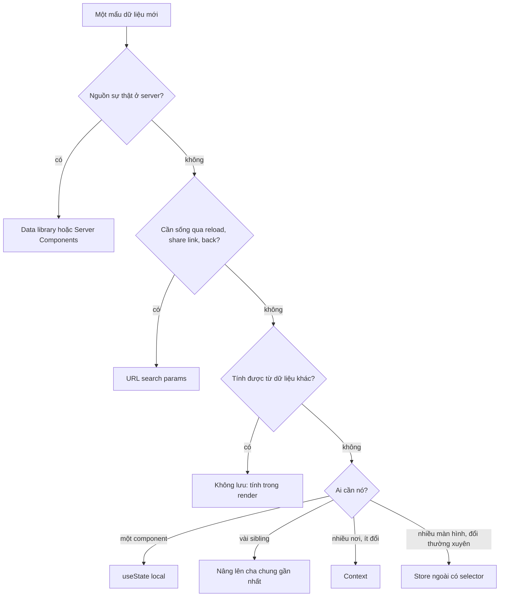
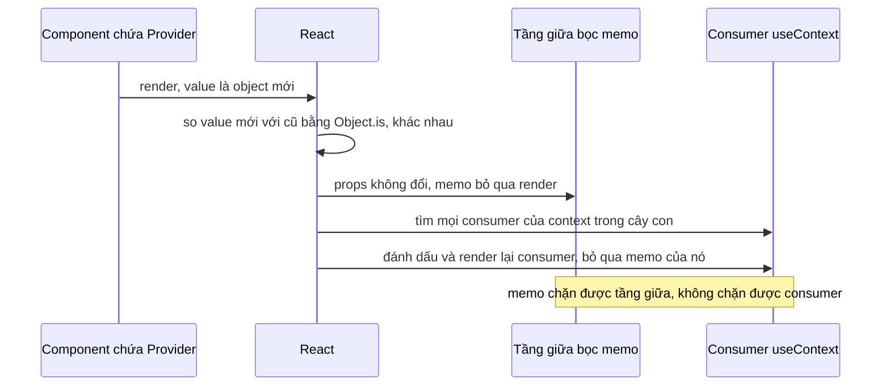

## Bối cảnh & vấn đề

Một dashboard B2B có 40 màn hình, 6 team cùng đóng góp. Sau hai năm: response API được lưu trong Redux **và** trong React Query "cho chắc", nên hai nơi lệch nhau sau mỗi lần sửa; filter của bảng nằm trong state component nên user copy link gửi đồng nghiệp thì mất filter; một `AppContext` chứa `user`, `theme`, `cart`, `notifications` làm cả app render lại mỗi khi có notification mới; và component `<DataTable>` của design system có 63 prop boolean, mỗi team thêm một cái.

Không cái nào là bug của React. Đó là hệ quả của việc không có **quy tắc đặt state** và **ranh giới** rõ ràng. React cho bạn nhiều chỗ để giữ state (local, lifted, context, URL, store ngoài, cache của data library), và mỗi chỗ có trade-off riêng về ai đọc được, ai ghi được, tồn tại bao lâu, và làm component nào render lại.

Bài này đưa ra framework chọn chỗ đặt state, giải thích chính xác vì sao Context gây re-render và các cách chữa (có output chạy thật), rồi mở rộng sang kiến trúc: thiết kế component API cho design system (component library, `<DataTable>`), branding theo tenant, và ranh giới feature cho app nhiều team. Chi tiết về các thư viện state (Redux Toolkit, Zustand, Jotai) nằm ở [track state management](/tracks/state-management).

**Interview angle:** `react-051` là câu design mở; interviewer không chờ một đáp án mà chờ bạn **phân loại** dữ liệu trước khi chọn công cụ.

## Khái niệm

### Props, state và one-way data flow

**Props** là dữ liệu cha truyền xuống con, **read-only** trong con. **State** là dữ liệu component tự giữ và đổi theo thời gian. React theo **one-way data flow**: dữ liệu đi xuống qua props; con muốn "gửi ngược lên" thì gọi một callback cha truyền xuống. Quy tắc này làm luồng dữ liệu dễ lần theo: muốn biết giá trị đến từ đâu, đi ngược lên cây.

**Prop drilling** là khi một prop phải đi qua nhiều tầng trung gian không dùng nó, chỉ để tới component sâu cần nó. Nó không sai, nhưng làm tầng giữa phụ thuộc vào dữ liệu không liên quan. Trước khi dùng Context để chữa, thử **composition**: truyền component đã dựng sẵn qua `children` hoặc slot, để tầng giữa không cần biết prop đó ([bài memoization](/tracks/react/learn/memoization-compiler)).

### Sáu loại state và nơi của chúng

- **Server state**: dữ liệu có nguồn sự thật ở server (đơn hàng, user, danh sách sản phẩm). Nó có thể cũ, cần cache, refetch, dedupe, invalidate. Chỗ đúng: **data library** (TanStack Query, RTK Query, SWR) hoặc Server Components. Không copy vào global store.
- **URL state**: filter, sort, page, tab đang chọn, id đang xem. Phải sống sót qua reload, share link, back/forward. Chỗ đúng: **search params / route params**.
- **Local UI state**: mở/đóng dropdown, hover, draft của một input. Chỗ đúng: `useState` ở **component gần nhất** cần nó.
- **Lifted state**: vài sibling cần chung một giá trị. Chỗ đúng: **cha chung gần nhất**.
- **Context**: giá trị **ít đổi**, nhiều nơi đọc, thường là dependency injection: theme, locale, user đã đăng nhập, feature flags, client instance (API client, query client).
- **Global client store**: state của client phức tạp, nhiều màn hình đọc và ghi, không có nguồn ở server: giỏ hàng offline, editor, wizard dài, trạng thái kết nối realtime. Chỗ đúng: Redux Toolkit, Zustand, Jotai.

Nguyên tắc xuyên suốt: **một nguồn sự thật** cho mỗi dữ liệu, và **derived data không lưu** (tính từ nguồn khi cần).

**Interview angle:** `react-051` follow-up "đồng nghiệp lưu response vào cả Redux và React Query": hai nguồn sự thật lệch nhau sau mutation, invalidate một bên quên bên kia, gấp đôi bộ nhớ và code đồng bộ; React Query đã là cache.

### Context hoạt động ra sao

`createContext(default)` tạo một context. Provider (React 19: `<Ctx value={v}>` trực tiếp; `<Ctx.Provider>` vẫn chạy và sẽ bị deprecate) (verify) cung cấp giá trị cho cây con. Component đọc bằng `useContext(Ctx)` hoặc `use(Ctx)`. Khi provider render với `value` **khác** lần trước theo `Object.is`, React tìm **mọi** component đọc context đó trong cây con và render lại chúng, **bỏ qua `memo`** của chúng và của các tầng giữa.

Hai hệ quả. Thứ nhất, Context **không có selector**: component chỉ cần `user.name` vẫn render khi bất kỳ phần nào của `value` đổi. Thứ hai, `value={{ user, setUser }}` là object **mới mỗi lần provider render**, kể cả khi `user` không đổi, nên mọi consumer render mỗi khi component chứa provider render vì bất cứ lý do gì.

### Cách chữa vấn đề hiệu năng của Context

1. **`useMemo` cho value**: `const value = useMemo(() => ({ user, setUser }), [user])`. Chữa được trường hợp "provider render vì lý do khác".
2. **Tách context theo tần suất đổi**: tách state và actions (`CountCtx` và `SetCountCtx`). `setState`/`dispatch` có reference ổn định, nên component chỉ gọi action không bao giờ render lại vì state đổi.
3. **Tách context theo domain**: `ThemeCtx`, `AuthCtx`, `NotificationsCtx` thay vì một `AppContext` khổng lồ.
4. **Đẩy provider xuống sâu**: provider của wizard chỉ bọc wizard, không bọc cả app.
5. **Tách component nhỏ đọc context**: phần đọc context nhỏ lại, phần nặng nhận props primitive và được memo.
6. **Chuyển sang store có selector** khi state đổi thường xuyên và nhiều consumer: `useSyncExternalStore` hoặc thư viện ([bài concurrent](/tracks/react/learn/concurrent-rendering)).

**Interview angle:** `react-024`: câu trả lời mạnh nói rõ "consumer render khi value đổi theo `Object.is`, memo không chặn được", rồi đưa ít nhất hai cách chữa có thứ tự.

### Component API cho design system

Một **component library** (design system) được nhiều team dùng cần API ổn định và linh hoạt. Các nguyên tắc:

- **Composition thay cho boolean prop**: thay vì `<Card withHeader withFooter headerIcon="x" footerAlign="right">`, cho `<Card><Card.Header icon={<X/>}/>...<Card.Footer/></Card>` (**compound components**, chia sẻ state qua context nội bộ).
- **Props nhất quán**: `variant`, `size`, `disabled` cùng tên, cùng giá trị trên mọi component.
- **Controlled và uncontrolled**: mỗi state tương tác (open, value, sort) hỗ trợ cả `value`/`onChange` lẫn `defaultValue`.
- **Spread native props và ref**: `<Button {...rest} ref={ref}>` để team dùng được `aria-*`, `data-*`, `type`. React 19: `ref` là prop ([bài hooks & refs](/tracks/react/learn/hooks-refs)).
- **Headless core**: logic trong hook (`useTable`, `useCombobox`), UI mặc định dùng hook đó; team cần tuỳ biến sâu dùng hook trực tiếp.
- **A11y mặc định**: semantic HTML, keyboard, focus management, `aria-*` đúng chuẩn WAI-ARIA APG.
- **Theming bằng design token** (CSS variables), không hard-code màu.

### Theming và multi-tenant

**Design token** là biến có tên cho mỗi quyết định thiết kế (`--color-primary`, `--radius-md`). Đặt chúng làm **CSS custom property** thì đổi theme chỉ là đổi giá trị biến ở gốc; component không render lại, trình duyệt tự tính lại style. Với app **multi-tenant** (nhiều khách hàng dùng chung một codebase), tenant config tải từ server (token, feature flags, phương thức thanh toán) và được áp ở gốc: token thành CSS variables, flags qua context/hook `useFeature("guestCheckout")`. Khác biệt lớn (một flow thanh toán riêng) đi qua slot/composition và lazy-load module chỉ tenant đó dùng.

## Cơ chế hoạt động

### Chọn chỗ đặt một mẩu state



Các câu hỏi đặt theo thứ tự "loại bỏ" nhanh nhất. Server state và URL state có đặc tính riêng (cache, share) nên tách ra đầu tiên. Derived data bị loại vì lưu nó chỉ tạo ra một nguồn sự thật thứ hai phải đồng bộ. Phần còn lại là client state thực sự, và câu hỏi chỉ còn "ai cần, đổi bao thường xuyên".

### Context propagation



React không cần render lại các tầng giữa để "truyền" context xuống: nó duyệt cây fiber tìm những fiber có đăng ký context đó và đánh dấu chúng. Vì vậy `memo` ở tầng giữa có tác dụng (tầng giữa không render), còn `memo` ở chính consumer thì không.

## Ví dụ thực tế

Output dưới đây là **output thật** (React 19.2.8 trong jsdom).

### Value inline vs useMemo (react-024)

```tsx
const AuthCtx = createContext<{ user: User; setUser: (u: User) => void } | null>(null);
const UserBadge = memo(function UserBadge() {
  const { user } = useContext(AuthCtx)!;
  renders.badge++;
  return <b>{user.name}</b>;
});
const Unrelated = memo(function Unrelated() { renders.unrelated++; return <i>static</i>; });

function ProviderInline() {
  const [user, setUser] = useState({ name: "Ann" });
  const [tick, setTick] = useState(0);                // state không liên quan
  return (
    <AuthCtx value={{ user, setUser }}>
      <button onClick={() => setTick(tick + 1)}>tick</button>
      <UserBadge /><Unrelated />
    </AuthCtx>
  );
}
function ProviderMemo() {
  const [user, setUser] = useState({ name: "Ann" });
  const [tick, setTick] = useState(0);
  const value = useMemo(() => ({ user, setUser }), [user]);
  return (
    <AuthCtx value={value}>
      <button onClick={() => setTick(tick + 1)}>tick</button>
      <UserBadge /><Unrelated />
    </AuthCtx>
  );
}
// bấm tick 3 lần
```

```text
A) ProviderInline: after 3 unrelated parent updates -> memo consumer renders=3, memo non-consumer renders=0
A) ProviderMemo: after 3 unrelated parent updates -> memo consumer renders=0, memo non-consumer renders=0
```

### Tách state và actions

```tsx
const CountCtx = createContext(0);
const SetCountCtx = createContext<React.Dispatch<React.SetStateAction<number>>>(() => {});
const Display = memo(function Display() { renders.display++; return <p>{useContext(CountCtx)}</p>; });
const IncButton = memo(function IncButton() {
  renders.inc++;
  const set = useContext(SetCountCtx);
  return <button onClick={() => set((n) => n + 1)}>+</button>;
});
function Split() {
  const [n, setN] = useState(0);
  return (
    <SetCountCtx value={setN}>
      <CountCtx value={n}><Display /><IncButton /></CountCtx>
    </SetCountCtx>
  );
}
// bấm + 3 lần
```

```text
B) split contexts: after 3 increments -> Display renders=3, IncButton renders=0
```

`setN` có reference ổn định nên `SetCountCtx` không bao giờ đổi; nút tăng không render lại dù nó gây ra mọi update.

### Filter trong URL

```tsx
function useUrlState<T extends string>(key: string, fallback: T) {
  const [params, setParams] = useSearchParams();       // React Router
  const value = (params.get(key) as T | null) ?? fallback;
  const setValue = (v: T) => setParams((p) => { p.set(key, v); return p; }, { replace: true });
  return [value, setValue] as const;
}
// const [status, setStatus] = useUrlState("status", "open");
// /orders?status=paid&sort=-createdAt&page=2: reload, share, back đều giữ nguyên
```

Query key của data library nên gồm đúng các tham số URL: `["orders", { status, sort, page }]`.

### DataTable headless cho 10 team (react-046)

```tsx
export type ColumnDef<T> = {
  id: string;
  header: React.ReactNode;
  accessor: (row: T) => React.ReactNode;
  sortable?: boolean;
};

type SortState = { id: string; desc: boolean } | null;

export function useTable<T>(opts: {
  rows: T[];
  columns: ColumnDef<T>[];
  sort?: SortState;                                  // controlled
  defaultSort?: SortState;                           // uncontrolled
  onSortChange?: (s: SortState) => void;
  manualSorting?: boolean;                           // server-side: không sort ở client
}) {
  const [inner, setInner] = useState<SortState>(opts.defaultSort ?? null);
  const sort = opts.sort !== undefined ? opts.sort : inner;
  const setSort = (s: SortState) => { if (opts.sort === undefined) setInner(s); opts.onSortChange?.(s); };
  const rows = opts.manualSorting || !sort ? opts.rows : [...opts.rows].sort(/* theo sort.id */ () => 0);
  return { rows, columns: opts.columns, sort, setSort };
}

// Lớp styled mặc định dùng hook; team cần tuỳ biến dùng useTable trực tiếp
export function DataTable<T>(props: Parameters<typeof useTable<T>>[0] & {
  renderRow?: (row: T, cells: React.ReactNode[]) => React.ReactNode;   // slot
}) {
  const t = useTable(props);
  return (
    <table>
      <thead>
        <tr>
          {t.columns.map((c) => (
            <th key={c.id} aria-sort={t.sort?.id === c.id ? (t.sort.desc ? "descending" : "ascending") : "none"}>
              {c.sortable ? <button onClick={() => t.setSort({ id: c.id, desc: !(t.sort?.id === c.id && t.sort.desc) })}>{c.header}</button> : c.header}
            </th>
          ))}
        </tr>
      </thead>
      <tbody>{/* rows, dùng renderRow nếu có */}</tbody>
    </table>
  );
}
```

(Đây là phác thảo API, không phải code chạy hoàn chỉnh; logic sort bị lược.) Follow-up "một team cần inline editing, team khác cần server-side pagination": server-side dùng `manualSorting`/`manualPagination` + controlled `sort`/`page` nối với query key; inline editing đi qua slot `renderCell` hoặc column `cell` nhận `row` và `onChange`, không cần prop `editable` riêng. Trên thực tế, TanStack Table đã là headless core như vậy; design system bọc nó thay vì tự viết.

### Component library cho banking app (react-061)

Khung câu trả lời: API (composition, `variant`/`size` nhất quán, controlled/uncontrolled, spread native props, `ref` là prop, a11y mặc định); theming (token → CSS variables, dark mode bằng đổi biến); chất lượng (Storybook, visual regression test, test a11y tự động, type export chuẩn); phát hành (semver, changelog, deprecation warning ở dev **trước** khi xoá prop, codemod cho thay đổi lớn); adoption (bao nhiêu màn hình/team dùng: điền số liệu thật của bạn). Follow-up "một team cứ override CSS bên trong component": đó là tín hiệu API thiếu điểm tuỳ biến; thêm slot hoặc token cho nhu cầu đó, và cân nhắc CSS layers (`@layer`) để style của người dùng thắng một cách có kiểm soát.

### Tenant branding không fork component (react-064)

```tsx
type TenantConfig = { tokens: Record<string, string>; features: Record<string, boolean> };
const FeaturesCtx = createContext<Record<string, boolean>>({});

export function TenantProvider({ config, children }: { config: TenantConfig; children: React.ReactNode }) {
  useLayoutEffect(() => {                              // áp token trước paint
    for (const [k, v] of Object.entries(config.tokens)) document.documentElement.style.setProperty(`--${k}`, v);
  }, [config.tokens]);
  const features = useMemo(() => config.features, [config.features]);
  return <FeaturesCtx value={features}>{children}</FeaturesCtx>;
}
export const useFeature = (name: string) => useContext(FeaturesCtx)[name] === true;

// Component: {useFeature("guestCheckout") && <GuestCheckout />}, không có if (tenant === "acme")
```

Follow-up "refresh tenant config làm cả app render lại": token nằm trong CSS variables nên đổi token không render component nào; flags tách context riêng và memo theo nội dung (so sánh sâu khi refetch, chỉ đổi reference khi flag thật sự đổi). Tránh flash theme sai khi tải: SSR token vào `<style>` trong HTML, hoặc inline script đặt biến trước khi React chạy.

### Ranh giới cho dashboard 40 màn hình, 6 team (react-053)

- **Feature-based folders**: `features/orders`, `features/customers`, mỗi feature có `index.ts` là public API; lint rule (`eslint-plugin-boundaries` hoặc `no-restricted-imports`) cấm import sâu chéo feature.
- **Tách lớp**: design system (UI thuần) → feature components → hooks (business logic) → data layer (API client, query keys) → routing.
- **Role-based UI**: permission từ server vào context, hook `useCan("orders:refund")`; UI chỉ **ẩn**, server vẫn kiểm tra quyền.
- **Code splitting theo route/feature**; monorepo (Nx, Turborepo) khi có nhiều package dùng chung.
- **Micro-frontends** chỉ khi team cần **deploy độc lập** thật sự; chi phí là shared deps, UX nhất quán, phiên bản React phải khớp.
- **Chuẩn chung**: error boundary theo route, pattern loading/empty/error, testing pyramid, ADR cho quyết định kiến trúc.

## Trade-offs & lựa chọn thay thế

| Nơi giữ state | Ai đọc/ghi | Sống bao lâu | Re-render | Hợp với |
|---|---|---|---|---|
| `useState` local | Component và con qua props | Tới khi unmount | Component đó và con | UI tạm, draft |
| Lifted state | Sibling qua cha | Theo cha | Cha và các con | Vài component liên quan |
| Context | Mọi consumer trong cây | Theo provider | Mọi consumer khi value đổi | Theme, auth, locale, DI |
| URL | Mọi component, cả user (link) | Qua reload, share | Component đọc params | Filter, sort, page, tab |
| Data library | Mọi component qua query key | Theo cache policy | Component dùng query đó | Server state |
| Store ngoài (Zustand, Redux) | Mọi component qua selector | Theo app | Chỉ component có slice đổi | Client state phức tạp, dùng chung |

Khi nào chọn gì: đi theo sơ đồ ở trên. Context không phải "store nhẹ"; nó là dependency injection. Nếu bạn thấy mình viết `useMemo` cho value, tách ba context và vẫn lo re-render, đó là tín hiệu dữ liệu này thuộc về một store có selector. Ngược lại, đừng đưa mọi thứ vào global store: state chỉ một màn hình dùng nằm local sẽ tự biến mất khi rời màn hình, không cần reset.

## Edge cases & failure modes

- **Hai nguồn sự thật.** Server data copy vào store rồi sửa ở một nơi; nơi kia hiển thị bản cũ. Bug xuất hiện sau mutation, khó tái hiện.
- **Provider bị thiếu.** `useContext` trả giá trị default (thường `null`) và crash ở chỗ đọc. Viết hook `useAuth()` ném lỗi rõ ràng khi không có provider.
- **Context value là class instance mutable.** Mutate bên trong không đổi reference, consumer không render; giống bug mutation của state.
- **URL state và giá trị không hợp lệ.** User sửa tay `?page=abc`; parse và validate (zod) param, fallback về mặc định.
- **Store global giữ state sau logout.** User B đăng nhập trên cùng tab thấy dữ liệu của A; reset store và `queryClient.clear()` khi logout.
- **Compound component dùng ngoài cha.** `<Card.Footer>` không nằm trong `<Card>` thì context nội bộ không có; ném lỗi rõ ràng trong dev.
- **Token theme áp sau paint.** Áp CSS variables trong `useEffect` gây nháy theme mặc định; dùng layout effect hoặc SSR.
- **Breaking change ẩn trong design system.** Đổi markup bên trong làm hỏng CSS override và test snapshot của team dùng; coi DOM structure public là một phần API nếu team đã phụ thuộc vào nó.

## Pitfalls

- ❌ Lưu response API vào Redux "cho tiện" khi đã có React Query → ✅ một nguồn: data library cho server state.
- ❌ Filter, sort, page trong `useState` → ✅ URL search params; share link và back/forward hoạt động.
- ❌ `value={{ user, setUser }}` inline → ✅ `useMemo`, hoặc tách context state/actions.
- ❌ Một `AppContext` cho mọi thứ → ✅ context theo domain và tần suất đổi; state đổi nhanh vào store có selector.
- ❌ Nghĩ `memo` chặn được re-render do context → ✅ consumer luôn render khi value đổi; memo chỉ chặn tầng giữa.
- ❌ Thêm boolean prop cho mỗi biến thể của component thư viện → ✅ composition, slot, headless hook.
- ❌ `if (tenant === "acme")` rải khắp code → ✅ feature flag qua hook, token qua CSS variables, slot cho khác biệt lớn.
- ❌ Ẩn nút theo role và coi như đã phân quyền → ✅ UI chỉ ẩn; server luôn kiểm tra.

## Tóm tắt

- Phân loại dữ liệu trước khi chọn công cụ: **server state** (data library/RSC), **URL state** (search params), **local**, **lifted**, **context** (ít đổi, DI), **global store** (client state phức tạp). Derived data không lưu.
- **Một nguồn sự thật** cho mỗi dữ liệu; không copy server data vào store.
- Context: consumer render khi `value` đổi theo `Object.is`, **không có selector**, `memo` không chặn được consumer.
- Chữa: `useMemo` value, tách context state/actions và theo domain, đẩy provider xuống, hoặc chuyển sang store có selector.
- Design system: composition và compound components thay boolean prop, controlled + uncontrolled, spread native props và `ref`, headless core, a11y mặc định, token bằng CSS variables, semver và deprecation có lộ trình.
- Multi-tenant: config từ server, token thành CSS variables, flags qua hook, slot/lazy-load cho khác biệt lớn.
- App nhiều team: feature folders với public API và lint ranh giới, tách lớp, permission qua hook (server vẫn kiểm tra), micro-frontends chỉ khi cần deploy độc lập.
