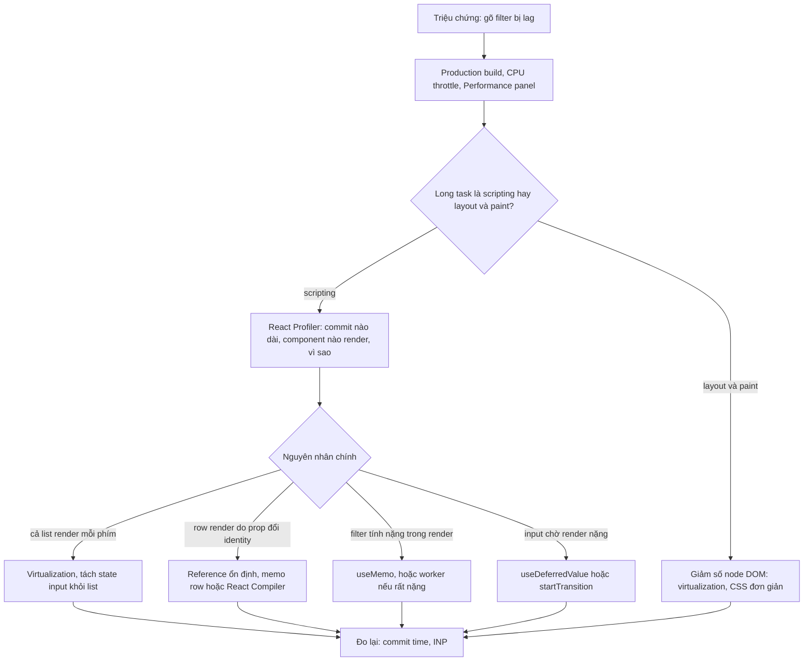
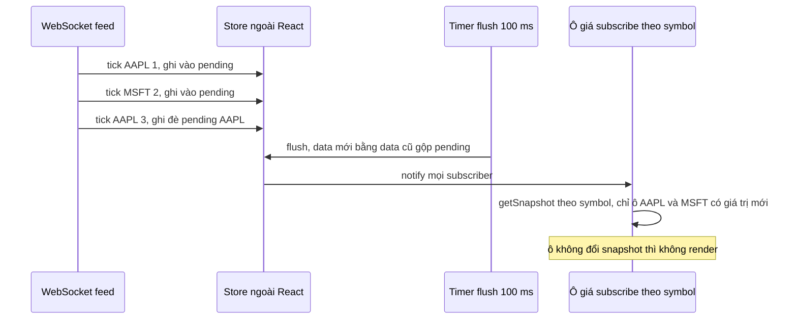

## Bối cảnh & vấn đề

Trang danh mục sản phẩm của một hệ thống nội bộ có 5.000 dòng và một ô filter. Mỗi phím gõ, input đơ khoảng nửa giây. Team thêm `useMemo`, `useCallback` và `memo` ở vài chỗ theo cảm tính, không đo; Profiler vẫn cho thấy commit dài như cũ. Ở màn hình khác, dashboard giá chứng khoán nhận 50 message mỗi giây qua WebSocket; sau 20 phút mở, tab ngốn 1,5 GB RAM và quạt laptop kêu. Sau một release, chỉ số INP trên RUM xấu đi 40% dù bundle size không đổi.

Ba vấn đề này cùng đòi hỏi một kỹ năng: **đo trước, rồi sửa đúng chỗ theo thứ tự tác động**. Hiệu năng React hiếm khi đến từ một dòng code; nó đến từ **số lượng việc** (bao nhiêu component render, bao nhiêu node DOM, bao nhiêu update mỗi giây) và **vị trí của state** (update ở đâu kéo theo bao nhiêu component). Công cụ memo chỉ là một trong nhiều đòn bẩy, và thường không phải cái lớn nhất.

Bài này đi qua quy trình chẩn đoán, virtualization, kiến trúc cho dữ liệu realtime tần suất cao, subscription trong class component (và bản hooks tương đương), performance budget trong CI và RUM, load test phía frontend, và khung kể lại một bug hiệu năng trong phỏng vấn. Nó dựa trên [memoization](/tracks/react/learn/memoization-compiler), [concurrent rendering](/tracks/react/learn/concurrent-rendering) và `useSyncExternalStore`. Chỉ số web ở mức trình duyệt nằm trong [track browser & web performance](/tracks/browser-web-perf).

**Interview angle:** `react-036` muốn nghe câu đầu tiên là "đo" (Profiler, Performance panel, production build), không phải "thêm useMemo".

## Khái niệm

### Đo: công cụ và câu hỏi

**React DevTools Profiler** ghi lại từng **commit**: component nào render, mất bao lâu, và (khi bật "Record why each component rendered") **vì sao** nó render: props nào đổi, state hay context nào đổi, hay cha render. Đây là công cụ để trả lời "cái gì render thừa".

**Chrome Performance panel** cho bức tranh rộng hơn: thời gian **scripting** (JS, gồm render của React), **rendering/layout** và **painting**, và các **long task** (> 50 ms chặn main thread). Nếu commit ngắn mà frame vẫn chậm, vấn đề nằm ở layout/paint (quá nhiều node DOM, CSS đắt), không phải ở React.

Luôn đo trên **production build**: bản dev của React chạy chậm hơn nhiều vì có kiểm tra và cảnh báo, và StrictMode render hai lần. Và đo trên máy yếu (CPU throttling 4x hoặc 6x) vì user thật không có laptop của dev.

`<Profiler id onRender>` của React cho số đo commit trong code, dùng được cho test hiệu năng tự động hoặc gửi về monitoring.

### INP và long task

**INP** (Interaction to Next Paint) là Core Web Vital đo độ trễ từ tương tác (click, gõ phím) tới frame tiếp theo được vẽ, lấy gần như giá trị tệ nhất trong phiên. Ngưỡng "tốt" là ≤ 200 ms. Một phím gõ gây render 5.000 dòng là một long task, và INP phản ánh trực tiếp điều đó. Vì thế INP là metric field tốt nhất cho hiệu năng render của React.

### Virtualization

**Virtualization** (windowing) chỉ render những dòng **đang nằm trong viewport** (cộng vài dòng buffer), thay vì toàn bộ list. Một container có chiều cao bằng tổng chiều cao các dòng để thanh cuộn đúng, và các dòng hiển thị được đặt vào đúng vị trí bằng `transform` hoặc `top`. Khi cuộn, component tính lại khoảng index cần hiển thị. Số node DOM và số component render giảm từ hàng nghìn xuống vài chục, bất kể list dài bao nhiêu. Thư viện: TanStack Virtual, react-window, react-virtuoso (hỗ trợ chiều cao thay đổi tốt).

Cái giá: Ctrl+F của trình duyệt không thấy dòng chưa render, screen reader không biết tổng số dòng, chiều cao dòng thay đổi cần đo động, và scroll restoration phức tạp hơn.

### Dữ liệu realtime tần suất cao

Feed giá 50 message/giây mà mỗi message là một `setState` ở component cha của cả bảng nghĩa là 50 lần render cả bảng mỗi giây. Ba nguyên tắc:

- **Tách nguồn dữ liệu khỏi React**: giữ giá mới nhất trong một store ngoài React (Map, Zustand), không trong state của component.
- **Subscribe theo slice**: mỗi ô subscribe đúng key của nó bằng `useSyncExternalStore` (hoặc selector của thư viện); chỉ ô có giá đổi mới render.
- **Coalesce theo frame hoặc theo khoảng**: gom message trong 16 ms (một frame, bằng `requestAnimationFrame`) hoặc 100–250 ms rồi flush một lần. Mắt người không đọc được số đổi 50 lần/giây; 4–10 lần/giây là đủ cho bảng giá.

Thêm: virtualize bảng, tránh layout thrash (cập nhật text, không đổi kích thước ô), và với ô cực nóng đã đo là cần, cập nhật DOM trực tiếp qua ref (bỏ qua React cho đúng ô đó).

**Interview angle:** `react-039` follow-up "test component này cho deterministic": inject store/socket giả, dùng fake timers để điều khiển flush, assert số lần render qua `<Profiler>` hoặc bộ đếm.

### Subscription và memory leak

Mỗi subscription (socket listener, `setInterval`, `addEventListener`) giữ một reference tới callback, và callback giữ closure tới component (state, props, `this`). Nếu không gỡ khi unmount, component đã unmount không được garbage collect, và callback vẫn chạy (setState vào component chết, tính toán thừa). Mỗi lần mount/unmount thêm một listener: đó là leak tuyến tính theo thời gian dùng app.

Trong **class component**: subscribe trong `componentDidMount`, **gỡ đúng cùng reference handler** trong `componentWillUnmount` (vì thế handler phải là class field hoặc được bind một lần, không phải arrow function inline), và xử lý đổi symbol trong `componentDidUpdate` (unsubscribe cũ, subscribe mới). Trong **hooks**: một `useEffect` với cleanup đối xứng làm cả ba việc.

### Performance budget

**Performance budget** là ngưỡng đo được mà team cam kết không vượt: JS per route (ví dụ ≤ 170 KB gzip cho route checkout), LCP ≤ 2,5 s, INP ≤ 200 ms, CLS ≤ 0,1 ở p75. Budget chỉ có tác dụng khi được **enforce tự động**: CI chặn PR vượt ngưỡng, và RUM theo release phát hiện regression mà lab không thấy.

## Cơ chế hoạt động

### Quy trình chẩn đoán list lag



Quy trình đi từ rộng tới hẹp. Performance panel trả lời "thời gian đi đâu": nếu phần lớn là layout/paint thì React không phải thủ phạm chính, và số node DOM mới là vấn đề. Nếu là scripting, Profiler chỉ ra component và lý do render. Mỗi nguyên nhân có một cách sửa, xếp theo tác động: virtualization thường cắt 90%+ công việc; tách state và deferred value giữ input mượt; memo và `useMemo` cắt phần còn lại. Luôn đo lại sau **mỗi** thay đổi để biết cái nào có tác dụng.

### Luồng dữ liệu realtime đã coalesce



Message đến dồn dập chỉ ghi vào một object `pending` (rẻ, không chạm React). Một timer (hoặc `requestAnimationFrame`) gộp pending vào snapshot mới **mỗi khoảng**, rồi báo cho subscriber. `useSyncExternalStore` của mỗi ô gọi `getSnapshot`, so với giá trị cũ, và chỉ những ô đổi giá mới render. Ba tick AAPL trong một khoảng thành một lần render.

## Ví dụ thực tế

Output dưới đây là **output thật**, chạy React 19.2.8 trong jsdom. Thời gian đo trong jsdom **không** đại diện cho trình duyệt thật (không có layout, paint); hãy đọc chúng như tỉ lệ tương đối, còn số lần render và số node là chính xác.

### 5.000 dòng: naive vs windowed (react-036)

```tsx
const products = Array.from({ length: 5000 }, (_, i) => ({ id: i, name: `Product ${i}`, price: (i * 37) % 1000 }));

function Row({ p }: { p: Product }) { rowRenders++; return <li>{p.name} - {p.price}</li>; }
const MemoRow = memo(Row);

function Naive() {
  const [q, setQ] = useState("");
  const list = products.filter((p) => p.name.includes(q));
  return <><input value={q} onChange={(e) => setQ(e.target.value)} /><ul>{list.map((p) => <Row key={p.id} p={p} />)}</ul></>;
}
function Windowed() {
  const [q, setQ] = useState("");
  const list = products.filter((p) => p.name.includes(q));
  const visible = list.slice(0, 30);                 // thư viện tính theo scrollTop và chiều cao dòng
  return (
    <>
      <input value={q} onChange={(e) => setQ(e.target.value)} />
      <div style={{ height: list.length * 32 }}><ul>{visible.map((p) => <MemoRow key={p.id} p={p} />)}</ul></div>
    </>
  );
}
// gõ "P", "Pr", "Pro", "Prod"
```

```text
A) Naive    4 keystrokes: 163 ms, row renders=20000, <li> in DOM=5000
A) Windowed 4 keystrokes: 2 ms, row renders=0, <li> in DOM=30
```

Bản naive render 5.000 dòng mỗi phím (20.000 lần) và giữ 5.000 node DOM. Bản windowed chỉ có 30 node; và vì 30 dòng đầu không đổi (mọi sản phẩm đều khớp "Prod"), `memo` bỏ qua cả 30. Trong trình duyệt thật, khoảng cách còn lớn hơn vì layout và paint của 5.000 node tốn hơn nhiều so với jsdom. Bản dùng TanStack Virtual:

```tsx
function VirtualList({ items }: { items: Product[] }) {
  const parentRef = useRef<HTMLDivElement>(null);
  const v = useVirtualizer({ count: items.length, getScrollElement: () => parentRef.current, estimateSize: () => 32, overscan: 8 });
  return (
    <div ref={parentRef} style={{ height: 600, overflow: "auto" }}>
      <div style={{ height: v.getTotalSize(), position: "relative" }}>
        {v.getVirtualItems().map((row) => (
          <div key={items[row.index].id} style={{ position: "absolute", top: 0, transform: `translateY(${row.start}px)`, height: row.size }}>
            {items[row.index].name}
          </div>
        ))}
      </div>
    </div>
  );
}
```

Thứ tự sửa đầy đủ cho câu hỏi: virtualization → tách state input khỏi list (hoặc `useDeferredValue(query)` với list bọc `memo`) → reference ổn định cho props của row → `useMemo` cho filter nặng → debounce nếu filter gọi server → đo lại INP và commit time.

Follow-up "virtualization làm hỏng Ctrl+F và screen reader": thêm ô search trong app (thay cho Ctrl+F), `aria-rowcount`/`aria-rowindex` để screen reader biết vị trí, overscan đủ lớn cho điều hướng bàn phím, hoặc với list vài trăm dòng thì dùng CSS `content-visibility: auto` thay vì virtualization (DOM vẫn đầy đủ, trình duyệt bỏ qua render phần ngoài màn hình).

### Feed 50 message/giây (react-039)

```tsx
// Naive: setState ở component của cả bảng cho mỗi message
function NaiveTable() {
  const [prices, setPrices] = useState<Record<string, number>>({});
  useEffect(() => {
    const h = (sym: string, v: number) => setPrices((p) => ({ ...p, [sym]: v }));
    feed.on("tick", h);
    return () => { feed.off("tick", h); };
  }, []);
  return <table><tbody><tr>{syms.map((s) => <td key={s}>{prices[s]}</td>)}</tr></tbody></table>;
}

// Coalesced: store ngoài React, flush mỗi 100 ms, mỗi ô subscribe symbol của nó
const store = {
  data: {} as Record<string, number>,
  pending: {} as Record<string, number>,
  subs: new Set<() => void>(),
  scheduled: false,
  push(sym: string, v: number) {
    store.pending[sym] = v;
    if (!store.scheduled) {
      store.scheduled = true;
      setTimeout(() => {
        store.scheduled = false;
        store.data = { ...store.data, ...store.pending };
        store.pending = {};
        store.subs.forEach((f) => f());
      }, 100);
    }
  },
  subscribe(cb: () => void) { store.subs.add(cb); return () => { store.subs.delete(cb); }; },
};
function Cell({ sym }: { sym: string }) {
  const v = useSyncExternalStore(store.subscribe, () => store.data[sym]);
  return <td>{v}</td>;
}
// 50 message trong khoảng 1 giây (render thật, ngoài act); đếm commit bằng useEffect không deps
```

```text
B) naive: setState per message, 50 messages in ~1s -> whole-table commits=50
B) coalesced every 100ms + per-cell subscription -> cell commits=50 (5 cells, ~10 flushes)
B) only AAPL ticking -> cell commits=10, final AAPL cell="49"
```

Bản naive commit cả bảng 50 lần (với 5 ô là 250 lần render ô; với bảng 500 ô là 25.000). Bản coalesced: mỗi ô render khoảng 10 lần/giây (một lần mỗi flush), và khi chỉ AAPL đổi, chỉ ô AAPL render (10 lần), vẫn hiển thị giá mới nhất. Thêm cho production: reconnect với exponential backoff, đánh dấu dữ liệu "stale" (màu xám, timestamp) khi mất kết nối, và subscription trong effect có cleanup.

### Subscription trong class component (react-062)

```tsx
class Ticker extends Component<{ symbol: string; fixed: boolean }, { price: number }> {
  state = { price: 0 };
  onPrice = (p: { symbol: string; price: number }) => {        // class field: một reference ổn định
    if (p.symbol === this.props.symbol) this.setState({ price: p.price });
  };
  componentDidMount() {
    socket.on("price", this.onPrice);
    socket.emit("subscribe", this.props.symbol);
  }
  componentDidUpdate(prev: { symbol: string }) {
    if (this.props.fixed && prev.symbol !== this.props.symbol) {
      socket.emit("unsubscribe", prev.symbol);
      socket.emit("subscribe", this.props.symbol);
    }
  }
  componentWillUnmount() {
    if (this.props.fixed) {
      socket.off("price", this.onPrice);                         // gỡ đúng reference
      socket.emit("unsubscribe", this.props.symbol);
    }
  }
  render() { return <span>{this.props.symbol}: {this.state.price}</span>; }
}
// mount/unmount 20 lần (đổi key), đếm listener trên socket
```

```text
C) fixed=false: after 20 mount/unmount cycles -> 'price' listeners=20
C) fixed=true: after 20 mount/unmount cycles -> 'price' listeners=1
```

Bản thiếu cleanup tích luỹ 20 listener, mỗi cái giữ một component đã chết; bản đúng chỉ còn listener của component đang mount. Phát hiện trong thực tế: heap snapshot trong DevTools (tìm "Detached" DOM và số instance của component tăng theo thời gian), hoặc log `socket.listeners("price").length` định kỳ. Viết lại bằng hooks (follow-up):

```tsx
function Ticker({ symbol }: { symbol: string }) {
  const [price, setPrice] = useState(0);
  useEffect(() => {
    const onPrice = (p: { symbol: string; price: number }) => { if (p.symbol === symbol) setPrice(p.price); };
    socket.on("price", onPrice);
    socket.emit("subscribe", symbol);
    return () => { socket.off("price", onPrice); socket.emit("unsubscribe", symbol); };
  }, [symbol]);                                                   // đổi symbol: cleanup cũ, setup mới
  return <span>{symbol}: {price}</span>;
}
```

Ba lifecycle của class gói thành một effect; đổi `symbol` tự động unsubscribe cái cũ. Với nhiều component cùng symbol, đặt một lớp subscription dùng chung (đếm reference theo symbol) trong store, để socket chỉ `subscribe` một lần cho mỗi symbol.

### Performance budget chống regression (react-056)

```jsonc
// .size-limit.json: CI fail khi vượt
[
  { "name": "checkout route", "path": "dist/assets/checkout-*.js", "limit": "170 KB" },
  { "name": "initial", "path": "dist/assets/index-*.js", "limit": "120 KB" }
]
```

```ts
// RUM: gửi field data theo release
import { onINP, onLCP, onCLS } from "web-vitals";
const send = (m: { name: string; value: number; id: string }) =>
  navigator.sendBeacon("/rum", JSON.stringify({ ...m, release: import.meta.env.VITE_RELEASE, route: location.pathname }));
onINP(send); onLCP(send); onCLS(send);
```

Khung đầy đủ: chọn metric liên quan tới user (LCP, INP, CLS từ RUM; JS per route; số request); đặt budget **theo route quan trọng**, không chỉ tổng; CI với size-limit (comment diff lên PR) và Lighthouse CI cho vài trang, fail khi vượt, có quy trình xin ngoại lệ; dashboard RUM theo release; văn hoá: owner rõ ràng, review dependency mới (kích thước, tree-shaking), lazy-load mặc định cho phần nặng.

Follow-up "INP xấu đi mà bundle không đổi": nhìn vào **công việc lúc tương tác**, không phải lúc tải: một handler mới làm việc đồng bộ nặng, một context/store đổi làm cả cây render, một list mất virtualization, third-party script (analytics, chat widget) chạy long task; dùng attribution của `web-vitals` (`onINP` với build `attribution`) để biết element và loại tương tác chậm.

### Load test frontend vs backend (react-063)

Phân biệt hai thứ: **backend/socket** đo số kết nối đồng thời, message/giây, latency p95/p99 bằng k6, Artillery hoặc công cụ tải của Socket.IO, và tìm bottleneck (CPU, event loop lag, Redis adapter khi scale nhiều node). **Frontend** đo trình duyệt chịu được bao nhiêu update/giây: CPU profile, long task, memory theo thời gian (mở tab 30 phút với feed thật hoặc feed giả tốc độ cao), trên máy yếu. Kết quả và thay đổi đã làm (throttle, coalescing, adapter): điền số liệu thật của bạn. Nói rõ hạn chế: kịch bản test không giống traffic thật (phân bố symbol, burst lúc mở phiên).

### Kể một bug hiệu năng (react-057)

Khung STAR: **S/T**: màn hình nào, triệu chứng (lag, trắng trang, dữ liệu sai), ảnh hưởng (bao nhiêu user). **A**: cách tái hiện, công cụ (Profiler, Performance panel, heap snapshot, source map), giả thuyết đã loại bỏ, root cause (ví dụ: context value inline làm 300 component render mỗi notification, hoặc listener leak như ví dụ trên), fix và test chống tái phát. **R**: số trước/sau (commit time, INP, memory sau 30 phút: điền số liệu thật của bạn). **Reflection**: quy ước rút ra (lint rule, budget, dashboard). Follow-up "cái gì lẽ ra bắt được trước production?": test hiệu năng với `<Profiler>` đếm render, size-limit, test memory dài hạn trong e2e, RUM canary.

## Trade-offs & lựa chọn thay thế

| Kỹ thuật | Tác động | Chi phí | Dùng khi |
|---|---|---|---|
| Virtualization | Rất lớn (số node cố định) | Ctrl+F, a11y, chiều cao động | List/bảng > vài trăm dòng |
| `content-visibility: auto` | Vừa (bỏ render ngoài màn hình) | DOM vẫn đầy đủ, hỗ trợ trình duyệt | List vài trăm dòng, cần Ctrl+F |
| Tách state / composition | Lớn | Đổi cấu trúc | State hay đổi nằm cao trong cây |
| `useDeferredValue` / transition | Input mượt | Kết quả trễ một nhịp | Render nặng theo input |
| `memo` + reference ổn định | Vừa | Mong manh khi code đổi | Hot path đã đo |
| Coalesce update | Rất lớn với realtime | Độ trễ hiển thị 16–250 ms | Feed tần suất cao |
| Store ngoài + selector | Lớn | Thêm lớp | Nhiều consumer, update thường xuyên |
| Cập nhật DOM qua ref | Rất lớn cho ô nóng | Ra ngoài mô hình React | Vài ô cực nóng, đã đo |
| Web Worker | Giải phóng main thread | Serialize dữ liệu | Tính toán CPU nặng (parse, sort 1 triệu dòng) |

Khi nào chọn gì: đi theo thứ tự tác động/chi phí. Giảm **số lượng việc** trước (virtualization, coalesce, tách state), rồi mới giảm **chi phí mỗi việc** (memo). Cập nhật DOM trực tiếp và worker là công cụ đặc biệt, chỉ dùng khi đo cho thấy cần.

## Edge cases & failure modes

- **Đo trên dev build.** Dev chậm hơn production nhiều lần và StrictMode render hai lần; kết luận sai về "component chậm".
- **Profiler không ghi được vì sao.** Phải bật "Record why each component rendered" trước khi ghi.
- **Virtualization với chiều cao thay đổi.** Ước lượng sai làm thanh cuộn nhảy; dùng đo động (`measureElement`) và `overscan`.
- **Coalesce làm mất sự kiện quan trọng.** Gộp giá thì được, nhưng gộp "lệnh khớp" hay "cảnh báo" thì mất thông tin; chỉ coalesce dữ liệu dạng "giá trị mới nhất".
- **Tab ẩn tích luỹ message.** Trình duyệt throttle timer và `requestAnimationFrame` ở tab nền; buffer tăng mãi. Chỉ giữ giá trị mới nhất, hoặc tạm dừng subscribe khi `document.hidden`.
- **Reconnect storm.** Hàng nghìn client reconnect cùng lúc khi server restart; exponential backoff có jitter.
- **Leak qua closure.** Listener đã gỡ nhưng một `setTimeout` hoặc promise trong nó vẫn giữ component; cleanup phải huỷ cả timer.
- **Budget tổng thay vì theo route.** Tổng bundle đạt budget nhưng route checkout lại import cả thư viện chart qua một barrel file.

## Pitfalls

- ❌ Thêm `useMemo`/`memo` trước khi đo → ✅ Profiler + Performance panel trên production build, CPU throttle.
- ❌ Render 5.000 dòng và tối ưu từng dòng → ✅ virtualization trước; memo sau.
- ❌ `setState` ở component cha của bảng cho mỗi message WebSocket → ✅ store ngoài, coalesce theo khoảng, subscribe theo slice.
- ❌ `socket.on("price", (p) => ...)` inline trong `componentDidMount` → ✅ handler là class field để `off` đúng reference; hooks: cleanup trong effect.
- ❌ Chỉ xử lý unmount mà quên đổi symbol → ✅ `componentDidUpdate` (hoặc deps của effect) unsubscribe cũ, subscribe mới.
- ❌ Budget chỉ trong wiki → ✅ size-limit và Lighthouse CI chặn PR, RUM theo release.
- ❌ Load test chỉ backend → ✅ đo cả trình duyệt: long task, memory theo thời gian trên máy yếu.
- ❌ Kể bug hiệu năng không có số → ✅ số trước/sau, công cụ đã dùng, và quy ước rút ra.

## Tóm tắt

- **Đo trước**: Profiler (render gì, vì sao), Performance panel (scripting vs layout/paint, long task), production build, CPU throttle; INP là metric field chính cho tương tác.
- Sửa theo thứ tự tác động: **giảm số lượng việc** (virtualization, tách state, coalesce) trước **giảm chi phí mỗi việc** (memo).
- **Virtualization** giữ số node cố định bất kể độ dài list; cái giá là Ctrl+F, a11y và chiều cao động.
- Realtime tần suất cao: **store ngoài React**, **subscribe theo slice** bằng `useSyncExternalStore`, **coalesce** theo frame hoặc 100–250 ms.
- Subscription phải gỡ đúng reference khi unmount và khi đổi key; class dùng handler là class field, hooks dùng một effect có cleanup.
- **Performance budget** theo route, enforce bằng CI (size-limit, Lighthouse CI) và RUM theo release; INP xấu mà bundle không đổi thì tìm công việc lúc tương tác.
- Load test tách backend (kết nối, throughput, latency) và frontend (long task, memory theo thời gian); câu chuyện hiệu năng luôn có số trước/sau.
