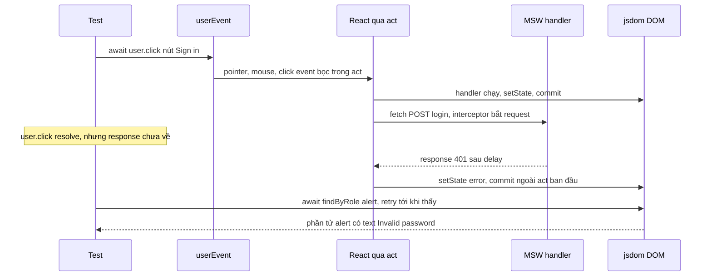
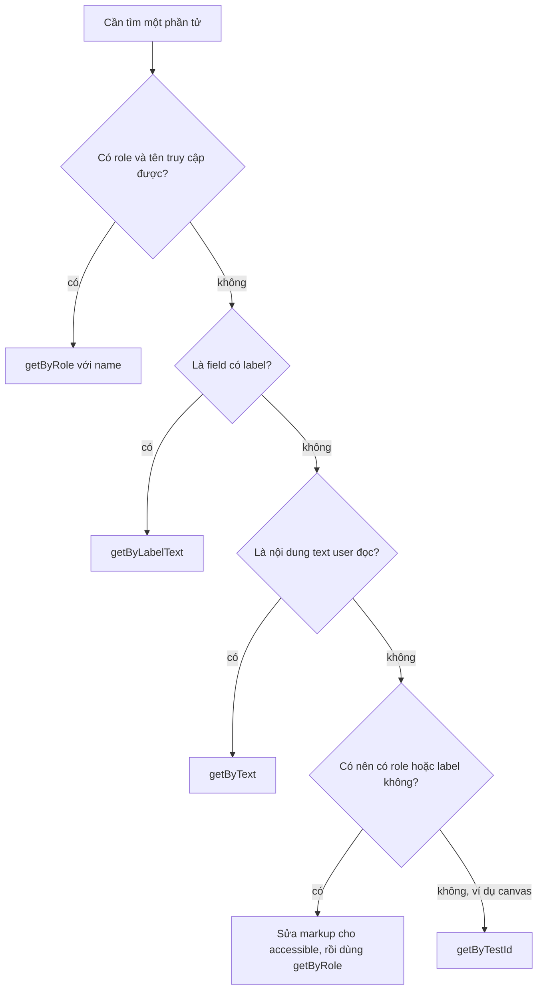

## Bối cảnh & vấn đề

Một team có 1.200 test React, và mỗi lần refactor là 200 test đỏ dù app vẫn chạy đúng. Test kiểm tra state nội bộ (`wrapper.state("isOpen")`), tên class CSS, và số lần một hàm con được gọi. Khi team chuyển từ `useEffect` + `fetch` sang React Query, mọi test dùng `jest.mock("./api")` đều vỡ. Trong khi đó, bug thật (nút "Thanh toán" không có accessible name, form không hiện lỗi khi server trả 500) lọt qua vì không test nào kiểm tra điều user thực sự thấy. CI còn thêm một loại lỗi khó chịu: test thỉnh thoảng fail kèm cảnh báo "not wrapped in act(...)".

Nguyên tắc chính của Testing Library giải quyết cả hai vấn đề: **test càng giống cách phần mềm được dùng, càng cho bạn nhiều tự tin**. Test tương tác qua role, label và text như user (và như công nghệ hỗ trợ), mock ở **ranh giới mạng** thay vì ở module nội bộ, và **chờ** UI thay vì assert ngay. Test viết như vậy sống sót qua refactor, và bắt đúng loại bug user gặp.

Bài này đi qua thứ tự ưu tiên của query, `getBy`/`queryBy`/`findBy`, `userEvent`, nguồn gốc và cách sửa đúng cảnh báo `act`, so sánh ba cách mock network (có test chạy thật bằng Vitest + MSW), và cách dùng characterization test để refactor code legacy an toàn. Chiến lược test toàn hệ thống (pyramid, e2e, contract test) nằm ở [track testing](/tracks/testing).

**Interview angle:** `react-032` follow-up "khi nào `getByTestId` là lựa chọn đúng?" phân biệt người hiểu nguyên tắc với người học thuộc thứ tự.

## Khái niệm

### Testing Library và nguyên tắc hành vi

**React Testing Library** (RTL) render component vào DOM (jsdom trong test runner) và cho bạn các **query** để tìm phần tử theo những gì user nhận biết được. Nó cố ý **không** cho truy cập state, props hay instance của component. Hệ quả: test chỉ biết về **hành vi quan sát được**. Đổi `useState` sang `useReducer`, tách component, đổi thư viện fetch, test vẫn xanh nếu UI vẫn đúng.

**Implementation details** là những thứ user không thấy: state nội bộ, tên hàm, cấu trúc component, class CSS. Test phụ thuộc vào chúng vỡ khi refactor (false negative) và vẫn xanh khi UI hỏng (false positive).

### Thứ tự ưu tiên của query

Theo tài liệu Testing Library:

1. `getByRole` (kèm `{ name }`): theo **role ARIA** và **accessible name**, đúng như cây accessibility mà screen reader thấy.
2. `getByLabelText`: input theo `<label>`.
3. `getByPlaceholderText`: khi không có label (bản thân đã là mùi a11y).
4. `getByText`: nội dung không tương tác (đoạn văn, thông báo).
5. `getByDisplayValue`: giá trị hiện tại của input.
6. `getByAltText`, `getByTitle`.
7. `getByTestId`: lối thoát cuối cùng.

`getByRole` được ưu tiên vì hai lý do. Nó **bền**: đổi `<button class="btn-primary">` thành component `<Button>` hay đổi markup bên trong không làm test vỡ, miễn là vẫn là một button tên "Sign in". Và nó **kiểm tra luôn accessibility**: một `<div onClick>` trông như nút không có role `button`, nên `getByRole("button")` không tìm thấy; test fail đúng chỗ user dùng bàn phím hay screen reader cũng gặp lỗi.

`getByTestId` đúng khi không có cách nào user phân biệt được phần tử: một canvas biểu đồ, một container để kiểm tra layout, hay phần tử có text động không ổn định mà không có role phù hợp.

### getBy, queryBy, findBy

Mỗi query có ba biến thể (và bản `All`):

- `getBy*`: trả phần tử, **ném lỗi** nếu không có hoặc có nhiều hơn một. Dùng cho thứ phải có ngay.
- `queryBy*`: trả `null` nếu không có. Dùng **duy nhất** để assert "không tồn tại": `expect(screen.queryByRole("alert")).not.toBeInTheDocument()`.
- `findBy*`: trả **Promise**, retry cho tới khi tìm thấy hoặc timeout (mặc định 1000 ms). Dùng cho thứ xuất hiện **sau** một việc async (fetch, timer, transition).

Dùng `screen` (`screen.getByRole(...)`) thay vì destructure từ kết quả `render`; nó luôn trỏ tới `document.body` và gợi ý query tốt hơn khi fail.

### userEvent và fireEvent

`fireEvent.click(el)` dispatch **một** DOM event. `userEvent` (v14) mô phỏng **chuỗi** event thật của một tương tác: `user.type(input, "abc")` sinh focus, keydown, keypress, input, keyup cho từng ký tự; `user.click` sinh pointerdown, mousedown, focus, pointerup, mouseup, click. Vì vậy `userEvent` bắt được bug mà `fireEvent` bỏ qua (handler gắn vào `onKeyDown`, input bị disabled nhưng vẫn nhận `fireEvent.change`). Từ v14, gọi `const user = userEvent.setup()` trước khi render, và `await` mọi thao tác.

### act

`act(fn)` (import từ `react`) nói với React: "chạy `fn`, rồi xử lý **mọi** update, effect và microtask mà nó gây ra, trước khi tôi assert". Không có `act`, update có thể còn nằm trong hàng đợi của scheduler khi test kiểm tra DOM. React 19 chỉ còn `act` trong `react-dom/test-utils` với cảnh báo deprecated; import từ `react` (verify).

React chỉ cảnh báo khi biến toàn cục **`IS_REACT_ACT_ENVIRONMENT`** là `true`. RTL tự bật nó bằng `beforeAll` **nếu** test runner có `beforeAll` toàn cục. Với Vitest không bật `globals: true`, RTL không bật được: không có cảnh báo act (và không auto-cleanup), nên lỗi thời gian bị che đi (thí nghiệm bên dưới).

### Cảnh báo "not wrapped in act(...)"

RTL đã bọc `render`, `fireEvent` và `userEvent` trong `act`. Vì vậy cảnh báo gần như luôn có nghĩa: **có một update xảy ra sau khi test đã "xong" với nó**, thường là fetch resolve, timer bắn, hoặc promise hoàn tất sau khi test assert và chuyển sang bước khác. Test không **chờ** hiệu ứng async.

Sửa đúng: chờ **kết quả trên UI**: `await screen.findBy...`, `await waitFor(() => expect(...))`, `await user.click(...)`. Với fake timers: `vi.advanceTimersByTime` bọc trong `act`, hoặc `userEvent.setup({ advanceTimers: vi.advanceTimersByTime })`. Sai: bọc lung tung `await act(async () => {})` cho "hết cảnh báo", hoặc tắt `console.error`. Cả hai che một test không thật sự kiểm tra trạng thái cuối cùng, và là nguồn gốc của test flaky.

**Interview angle:** `react-033` follow-up "test pass local, flaky trên CI kèm cảnh báo này": máy CI chậm hơn nên update async đến sau assert; tìm assertion chạy trước khi UI ổn định, thay bằng `findBy`, kiểm tra handler MSW chưa reset và timer thật trong test.

### Ba cách mock network

- **Mock module/hook** (`vi.mock("./api")`): nhanh, đơn giản. Nhưng test gắn với **cách** component lấy dữ liệu; đổi từ `fetch` sang React Query là test vỡ dù hành vi đúng. Không kiểm tra URL, method, header.
- **Mock `global.fetch`**: bớt coupling hơn, nhưng phải tự dựng `Response` (status, header, body), dễ sai; và không áp dụng cho `axios`/XHR.
- **MSW** (Mock Service Worker): chặn ở **tầng network** (Service Worker trong browser, interceptor trong Node), handler khai báo theo URL và method. Component chạy code fetch thật. Cùng một bộ handler dùng cho test, Storybook và dev. Nhược điểm: setup ban đầu, phải reset handler giữa các test, và `onUnhandledRequest: "error"` để bắt request quên mock.

Với React Query: tạo `QueryClient` **mới cho mỗi test** (cache không rò giữa test) và tắt `retry` (nếu không, test lỗi mất nhiều giây vì retry có backoff).

### Characterization test

**Characterization test** ghi lại hành vi **hiện tại** của code legacy (kể cả những chỗ có vẻ sai), để khi refactor, mọi thay đổi hành vi đều lộ ra. Nó khác test thông thường ở chỗ bạn không viết theo spec mà theo quan sát. Với React, viết bằng RTL theo hành vi (role, text) thì test sống sót qua việc tách một class component 800 dòng thành hook và component nhỏ.

## Cơ chế hoạt động

### Từ tương tác tới assertion



Mấu chốt nằm ở dòng Note: `await user.click` chỉ đảm bảo **tương tác** và các update đồng bộ của nó đã xong. Response mạng về sau đó, gây một update mới. Nếu test assert ngay sau `click`, nó thấy trạng thái trung gian; và update đến sau là cái React cảnh báo "not wrapped in act". `findBy` chờ đúng thứ user chờ: phần tử alert xuất hiện. RTL bọc việc retry trong môi trường act phù hợp nên update đến trong lúc chờ không bị cảnh báo.

### Chọn query



Nhánh "sửa markup" là điểm quan trọng: khi không tìm được bằng role, thường đó là bug accessibility, không phải lý do dùng test id.

## Ví dụ thực tế

Output dưới đây là **output thật**: Vitest 5.0.2, jsdom, @testing-library/react 16.3.3, user-event 14.6.7, MSW 2.15.0, React 19.2.8.

### Component được test

```tsx
export function Orders() {
  const [state, setState] = useState<{ status: "loading" | "error" | "ok"; orders: Order[] }>({ status: "loading", orders: [] });
  useEffect(() => {
    let ignore = false;
    fetch("http://api.test/api/orders")
      .then((r) => { if (!r.ok) throw new Error(`HTTP ${r.status}`); return r.json(); })
      .then((orders) => { if (!ignore) setState({ status: "ok", orders }); })
      .catch(() => { if (!ignore) setState({ status: "error", orders: [] }); });
    return () => { ignore = true; };
  }, []);
  if (state.status === "loading") return <p role="status">Loading orders…</p>;
  if (state.status === "error") return <p role="alert">Could not load orders</p>;
  if (state.orders.length === 0) return <p>No orders yet</p>;
  return <ul aria-label="orders">{state.orders.map((o) => <li key={o.id}>#{o.id}: {o.total} USD</li>)}</ul>;
}

export function LoginForm({ onLogin }: { onLogin: (email: string, pw: string) => Promise<boolean> }) {
  const [error, setError] = useState("");
  return (
    <form onSubmit={async (e) => {
      e.preventDefault();
      const fd = new FormData(e.currentTarget);
      if (!(await onLogin(String(fd.get("email")), String(fd.get("password"))))) setError("Invalid password");
    }}>
      <label>Email <input name="email" type="email" /></label>
      <label>Password <input name="password" type="password" /></label>
      <div className="btn-primary" onClick={() => {}}>Sign in (div)</div>
      <button type="submit">Sign in</button>
      {error && <p role="alert">{error}</p>}
    </form>
  );
}
```

### Test với MSW và query theo role (react-032, react-047)

```tsx
import { setupServer } from "msw/node";
import { http, HttpResponse, delay } from "msw";

const server = setupServer(
  http.get("http://api.test/api/orders", async () => {
    await delay(20);
    return HttpResponse.json([{ id: "1001", total: 42 }]);
  }),
);
beforeAll(() => server.listen({ onUnhandledRequest: "error" }));
afterEach(() => server.resetHandlers());
afterAll(() => server.close());

describe("Orders (MSW)", () => {
  it("shows loading then data", async () => {
    render(<Orders />);
    expect(screen.getByRole("status")).toHaveTextContent(/loading/i);
    expect(await screen.findByRole("list", { name: "orders" })).toHaveTextContent("#1001: 42 USD");
    expect(screen.queryByRole("status")).not.toBeInTheDocument();
  });
  it("shows an error on 500", async () => {
    server.use(http.get("http://api.test/api/orders", () => HttpResponse.json({ message: "boom" }, { status: 500 })));
    render(<Orders />);
    expect(await screen.findByRole("alert")).toHaveTextContent(/could not load orders/i);
  });
  it("shows empty state", async () => {
    server.use(http.get("http://api.test/api/orders", () => HttpResponse.json([])));
    render(<Orders />);
    expect(await screen.findByText(/no orders yet/i)).toBeInTheDocument();
  });
});

describe("LoginForm queries", () => {
  it("finds controls by role and label", async () => {
    const user = userEvent.setup();
    render(<LoginForm onLogin={async () => false} />);
    await user.type(screen.getByLabelText(/email/i), "a@b.co");
    await user.type(screen.getByLabelText(/password/i), "wrong");
    await user.click(screen.getByRole("button", { name: /sign in/i }));
    expect(await screen.findByRole("alert")).toHaveTextContent(/invalid password/i);
  });
  it("a div styled as a button is not a button", () => {
    render(<LoginForm onLogin={async () => true} />);
    expect(screen.getAllByRole("button").map((b) => b.textContent)).toEqual(["Sign in"]);
  });
});
```

```text
 ✓ t/orders.test.tsx > Orders (MSW) > shows loading then data 110ms
 ✓ t/orders.test.tsx > Orders (MSW) > shows an error on 500 7ms
 ✓ t/orders.test.tsx > Orders (MSW) > shows empty state 5ms
 ✓ t/orders.test.tsx > LoginForm queries > finds controls by role and label 70ms
 ✓ t/orders.test.tsx > LoginForm queries > a div styled as a button is not a button 4ms
```

Test cuối cho thấy `getByRole("button")` bỏ qua `<div class="btn-primary">`: với user dùng bàn phím và screen reader, đó không phải một nút. Ba test đầu phủ đủ loading, lỗi và rỗng, và không test nào biết component dùng `fetch` hay React Query.

### Cảnh báo act: có và không có (react-033)

```tsx
it("BAD: asserts before the fetch resolves (act warning)", async () => {
  globalThis.fetch = vi.fn(() => new Promise((r) =>
    setTimeout(() => r(new Response(JSON.stringify([{ id: "7", total: 1 }]))), 10))) as typeof fetch;
  render(<Orders />);
  expect(screen.getByRole("status")).toBeInTheDocument();   // test coi như xong ở đây
  await new Promise((r) => setTimeout(r, 30));               // ...nhưng update đến sau
});
it("GOOD: waits for the UI with findBy", async () => {
  // cùng mock fetch
  render(<Orders />);
  expect(await screen.findByText("#7: 1 USD")).toBeInTheDocument();
});
```

Chạy với `vitest.config.ts` có `test: { environment: "jsdom", globals: true }`, `console.error` được thu lại:

```text
captured console.error: [ 'An update to Orders inside a test was not wrapped in act(...).' ]
 ✓ t/act.test.tsx > BAD: asserts before the fetch resolves (act warning) 100ms
 ✓ t/act.test.tsx > GOOD: waits for the UI with findBy 15ms
```

Cùng test đó **không có** `globals: true`: `captured console.error: []`. RTL chỉ bật `IS_REACT_ACT_ENVIRONMENT` qua `beforeAll` toàn cục, nên thiếu globals thì React im lặng và bug thời gian bị che. Nếu không muốn bật globals, đặt `globalThis.IS_REACT_ACT_ENVIRONMENT = true` và gọi `cleanup()` trong `afterEach` ở file setup.

Import `act` cũ ở React 19:

```text
[console.error] `ReactDOMTestUtils.act` is deprecated in favor of `React.act`. Import `act` from `react` instead of `react-dom/test-utils`. See https://react.dev/warnings/react-dom-test-utils for more info.
```

### Test với React Query

```tsx
function renderWithClient(ui: React.ReactElement) {
  const client = new QueryClient({ defaultOptions: { queries: { retry: false, gcTime: Infinity } } });
  return render(<QueryClientProvider client={client}>{ui}</QueryClientProvider>);
}
```

`QueryClient` mới cho mỗi test tránh dữ liệu rò từ test trước; `retry: false` để test lỗi không đợi ba lần retry có backoff.

### Refactor legacy có kiểm chứng (react-065)

Khung STAR: **S**: một class component 800 dòng trộn logic và UI, không test, bug lặp lại khi thêm tính năng. **A**: viết characterization test bằng RTL **trước** khi đụng code, theo hành vi user thấy (các role, text, luồng chính và luồng lỗi với MSW); refactor từng bước nhỏ (tách hook business logic, tách component con, chuyển class sang function), mỗi bước một PR nhỏ, test phải xanh; bật feature flag hoặc canary cho bản mới; phối hợp với QA cho flow quan trọng. **R**: số bug/incident giảm, thời gian làm tính năng mới, kích thước component (điền số liệu thật của bạn). **Reflection**: ví dụ dùng codemod cho phần cơ học, thống nhất tiêu chí với QA sớm hơn. Follow-up "thuyết phục PO dành thời gian": nối refactor với chi phí thật (bug lặp lại, tính năng bị chặn), đề xuất làm dần gắn với tính năng đang làm thay vì một sprint riêng.

Follow-up của `react-047` ("suite 12 phút, chuyển gì sang Playwright, gì sang unit test hook?"): flow đi qua nhiều trang và phụ thuộc trình duyệt thật (auth redirect, upload, layout) sang Playwright; logic thuần (tính phí, reducer, validate) và custom hook phức tạp sang unit test (`renderHook`, function thuần) chạy mili-giây; giữ RTL cho hành vi của từng component; song song hoá và shard trên CI.

## Trade-offs & lựa chọn thay thế

| Cách mock | Coupling với implementation | Độ thật | Tái sử dụng | Chi phí setup |
|---|---|---|---|---|
| `vi.mock("./api")` | Cao | Thấp (không có HTTP) | Thấp | Thấp |
| Mock `global.fetch` | Trung bình | Trung bình (tự dựng Response) | Thấp | Thấp |
| MSW | Thấp | Cao (URL, method, status, header) | Cao (test, Storybook, dev) | Trung bình |

| Loại test | Tốc độ | Tự tin | Dùng cho |
|---|---|---|---|
| Function thuần / reducer | Rất nhanh | Logic | Tính toán, validate, state machine |
| `renderHook` | Nhanh | Hook | Custom hook phức tạp |
| RTL component + MSW | Nhanh | Hành vi component | Phần lớn test UI |
| Playwright e2e | Chậm | Toàn hệ thống, trình duyệt thật | Flow quan trọng, nhiều trang |

Khi nào chọn gì: mặc định RTL + MSW cho component có fetch, vì test không vỡ khi đổi cách fetch. Mock module chỉ hợp khi dependency không phải network (ví dụ SDK analytics, `Date`), hoặc khi cần một test cực nhanh cho một nhánh hiếm. Đẩy logic phức tạp ra function thuần để test nó không cần React. Giữ e2e cho ít flow nhưng quan trọng.

## Edge cases & failure modes

- **Thiếu `globals: true` trong Vitest.** Không cảnh báo act, không auto-cleanup; DOM của test trước còn lại làm `getByRole` thấy hai phần tử.
- **Handler MSW rò giữa test.** Quên `server.resetHandlers()`: `server.use(...)` lỗi 500 của test này làm test sau fail.
- **Request không được mock.** Không đặt `onUnhandledRequest: "error"`: request thật bay ra ngoài hoặc treo, test timeout khó hiểu.
- **Fake timers và userEvent.** Bật fake timers mà không truyền `advanceTimers` cho `userEvent.setup`: `await user.type` treo vì delay nội bộ không bao giờ trôi.
- **`findBy` timeout 1000 ms.** API giả chậm hơn (delay 2 s) làm test fail; giảm delay trong test hoặc tăng `timeout` có chủ đích.
- **`waitFor` với side effect bên trong.** `waitFor(() => { user.click(...) })` click nhiều lần khi retry; chỉ đặt assertion trong `waitFor`.
- **StrictMode trong test.** Render trong `<StrictMode>` thì effect chạy hai lần, mock đếm số lần gọi sai lệch; quyết định rõ và nhất quán.
- **Snapshot test lớn.** Snapshot cả trang vỡ ở mọi thay đổi nhỏ, và reviewer cập nhật mà không đọc; chỉ snapshot phần nhỏ, ổn định.

## Pitfalls

- ❌ `getByTestId` cho mọi thứ → ✅ `getByRole` với `name` trước; test id cho phần tử không có cách nhận biết khác.
- ❌ Assert state nội bộ hay class CSS → ✅ assert điều user thấy: text, role, trạng thái disabled, alert.
- ❌ `expect(screen.getByRole("alert"))` ngay sau click gây fetch → ✅ `await screen.findByRole("alert")`.
- ❌ `expect(screen.getByText("x")).toBeNull()` để kiểm tra không có → ✅ `queryByText` (getBy ném lỗi trước khi assert).
- ❌ Bọc `act(async () => {})` hoặc tắt `console.error` cho hết cảnh báo act → ✅ chờ kết quả UI bằng `findBy`/`waitFor`/`await user...`.
- ❌ `fireEvent.change` để "gõ" → ✅ `userEvent.setup()` rồi `await user.type`, sinh đủ chuỗi event như user thật.
- ❌ `vi.mock("./api")` cho mọi component có fetch → ✅ MSW ở tầng network; test sống sót khi đổi thư viện fetch.
- ❌ Một `QueryClient` dùng chung cho mọi test → ✅ client mới mỗi test, `retry: false`.

## Tóm tắt

- Nguyên tắc: test càng giống cách phần mềm được dùng càng đáng tin; test hành vi, không test implementation details.
- Thứ tự query: `getByRole` (kèm `name`) → `getByLabelText` → `getByPlaceholderText` → `getByText` → `getByDisplayValue` → `getByAltText`/`getByTitle` → `getByTestId`. `getByRole` bền với refactor và kiểm tra luôn accessibility.
- `getBy` cho thứ phải có ngay, `queryBy` để assert không tồn tại, `findBy` cho thứ xuất hiện sau việc async; dùng `screen`.
- `userEvent.setup()` + `await` sinh chuỗi event thật; `fireEvent` chỉ một event.
- Cảnh báo act nghĩa là **update xảy ra sau khi test không còn chờ**; sửa bằng `findBy`/`waitFor`/`await user...`, không bằng bọc act lung tung. Import `act` từ `react` ở React 19; Vitest cần `globals: true` (hoặc tự bật `IS_REACT_ACT_ENVIRONMENT`).
- Mock network bằng **MSW** để test không phụ thuộc cách fetch; reset handler giữa test, `onUnhandledRequest: "error"`; React Query: client mới mỗi test, tắt retry.
- Refactor legacy: characterization test theo hành vi trước, rồi refactor từng bước nhỏ với test xanh.
