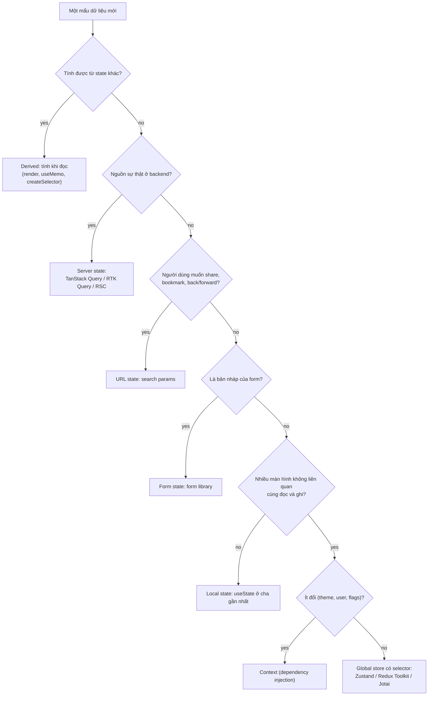
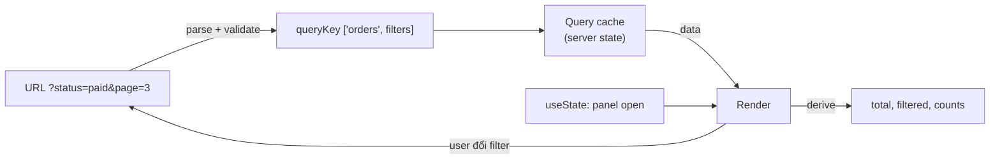

## Bối cảnh & vấn đề

Một team làm trang quản lý đơn hàng. Ngày đầu, mọi thứ nằm trong Redux: `orders`, `ordersLoading`, `ordersError`, `selectedOrderId`, `isFilterPanelOpen`, `filters`, `cartTotal`. Mỗi màn hình mount thì dispatch một thunk fetch `/orders` rồi `dispatch(setOrders(data))`. Sáu tháng sau, bug report chảy về đều đặn:

- "Tôi vừa sửa trạng thái đơn ở màn hình chi tiết, quay lại danh sách vẫn thấy trạng thái cũ."
- "Gửi link cho đồng nghiệp, họ mở ra thấy danh sách không có filter tôi đang chọn."
- "Tổng tiền trong giỏ hiện 220.000 đ nhưng cộng tay các dòng ra 370.000 đ."
- "Mở hai tab, mỗi tab hiển thị một phiên bản dữ liệu khác nhau."

Không bug nào nằm ở Redux cả. Tất cả đến từ một lỗi phân loại: team coi **mọi dữ liệu** là cùng một loại "state", rồi đặt tất cả vào cùng một chỗ với cùng một cơ chế. Dữ liệu đơn hàng là **bản sao** của thứ nằm ở server, nên nó cần cache, refetch, invalidation. Filter là thứ người dùng muốn **chia sẻ qua link**, nên nó thuộc về URL. Tổng tiền là giá trị **suy ra** từ các dòng hàng, nên không nên lưu. Trạng thái mở panel chỉ một component quan tâm, nên nó là local state.

Bài này là nền móng cho cả track: trước khi so sánh Redux, Zustand hay TanStack Query, bạn cần phân biệt được năm loại state, biết mỗi loại có "nguồn sự thật" (source of truth) ở đâu, và chọn đúng công cụ cho từng loại. Các bài sau đi sâu vào từng công cụ: [Redux Toolkit](/tracks/state-management/learn/redux-toolkit-core), [selectors và re-render](/tracks/state-management/learn/selectors-rerenders), [TanStack Query](/tracks/state-management/learn/tanstack-query-cache). Kiến thức React nền (useState, props, Context, re-render) nằm ở track [React](/tracks/react).

**Interview angle:** câu mở màn kinh điển là "Redux hay Zustand?". Ứng viên senior không trả lời ngay tên thư viện mà hỏi lại "state đó là loại gì, ai sở hữu nó, ai cần đọc nó".

## Khái niệm

### Source of truth (nguồn sự thật)

**Source of truth** là nơi duy nhất mà giá trị "đúng" của một dữ liệu được định nghĩa; mọi nơi khác chỉ là bản sao hoặc giá trị suy ra. Khi một dữ liệu có hai source of truth (ví dụ `filters` vừa nằm trong Redux vừa nằm trong URL, sync hai chiều bằng effect), sớm muộn hai bản sẽ lệch nhau: một lần navigate back, một lần reload, một effect chạy lệch một nhịp.

Nguyên tắc cả bài xoay quanh câu hỏi: **dữ liệu này thuộc về ai?** Nếu thuộc về backend, source of truth là database, và client chỉ giữ cache. Nếu thuộc về trình duyệt của người dùng này, source of truth là client. Nếu người dùng muốn bookmark nó, source of truth nên là URL.

**Interview angle:** interviewer hay đưa một đoạn code sync state với URL bằng `useEffect` hai chiều và hỏi bug ở đâu; câu trả lời là "có hai source of truth".

### Server state

**Server state** là dữ liệu mà nguồn sự thật nằm ở backend: danh sách đơn hàng, profile, tồn kho, quyền. Client chỉ giữ một **bản sao có thể đã cũ** (stale), vì trong lúc bạn xem, người khác hoặc một job nền có thể đã sửa nó. Server state có những đặc điểm mà client state không có: lấy về bất đồng bộ, có thể lỗi mạng, dùng chung giữa nhiều người, và "hết hạn" theo thời gian.

Vì vậy server state cần một bộ tính năng riêng: **cache** theo tham số, **dedupe** (nhiều component cùng cần một dữ liệu thì chỉ gọi API một lần), **stale-while-revalidate** (hiển thị cache ngay rồi refetch nền), refetch khi focus/reconnect, **invalidation** sau mutation, retry có backoff, pagination. Tự viết những thứ này bằng `useEffect` + Redux là hàng nghìn dòng code và rất nhiều race condition. Các thư viện data fetching (TanStack Query, RTK Query, SWR) hoặc React Server Components trong Next.js giải quyết đúng bài toán này.

```ts
// Server state: the key identifies the server resource, the library owns caching
const { data: orders } = useQuery({
  queryKey: ["orders", { status: "paid", page: 1 }],
  queryFn: () => api.getOrders({ status: "paid", page: 1 }),
});
```

**Interview angle:** câu "server state là bản sao có thể cũ" là cụm từ interviewer muốn nghe; nó dẫn ngay tới câu hỏi tiếp theo về `staleTime`.

### Client state (UI state)

**Client state** là dữ liệu chỉ tồn tại ở trình duyệt, và client chính là nguồn sự thật: modal đang mở, tab đang chọn, theme, bước hiện tại của wizard, item đang được kéo thả, bản nháp chưa lưu. Nó đồng bộ (không cần fetch), không ai khác sửa được, và thường mất đi khi reload là chấp nhận được.

Phần lớn client state là **local**: chỉ một component hoặc một cây nhỏ cần nó, nên `useState`/`useReducer` đặt ở component cha gần nhất là đủ (react.dev gọi là "lifting state up"). Chỉ một phần nhỏ là **global client state** thật sự: nhiều màn hình không liên quan cùng đọc và ghi, ví dụ giỏ hàng offline của khách, trạng thái phiên làm việc, workflow chuyển tiền nhiều bước, hàng đợi thông báo. Đó mới là chỗ Redux Toolkit, Zustand hay Jotai có giá trị.

```ts
// Local UI state: nobody else needs it
const [isFilterPanelOpen, setOpen] = useState(false);
```

**Interview angle:** interviewer muốn nghe bạn nói "phần lớn state là local, global store chỉ dành cho phần nhỏ thật sự dùng chung".

### URL state

**URL state** là state được mã hoá trong pathname và query string: `/orders?status=paid&page=3`. Những gì người dùng muốn **share, bookmark, back/forward, giữ lại sau reload** thì nên ở URL: filter, sort, trang hoặc cursor, tab đang chọn, từ khoá tìm kiếm, id của item đang mở trong modal chi tiết. Lợi ích phụ lớn là server (ví dụ `searchParams` trong Next.js App Router) có thể render đúng trạng thái ngay từ request đầu tiên.

Giới hạn của URL: chỉ chứa **string**, nên mọi thứ phải serialize và parse lại (và validate, vì người dùng sửa URL được); độ dài có giới hạn thực tế (vài nghìn ký tự là an toàn); URL xuất hiện trong log, history, header `Referer`, nên **không** đặt PII hay token vào đó. Mỗi thay đổi URL có thể tạo một entry history mới hoặc trigger navigation, nên cần cân nhắc `push` hay `replace`.

Nguyên tắc quan trọng nhất: **đọc thẳng từ URL**, đừng copy vào state rồi sync hai chiều. Thư viện như `nuqs` cho phép đọc/ghi search params với kiểu dữ liệu và parser, nhưng bản chất vẫn là URL làm nguồn sự thật.

**Interview angle:** follow-up phổ biến là "gõ vào ô search làm `?q=` đổi mỗi phím và history bị ngập"; đáp án là debounce và dùng `replace` thay vì `push`.

### Form state (draft)

**Form state** là bản nháp người dùng đang nhập: giá trị các field, field nào đã chạm (touched), lỗi validate, đang submit hay không. Nó là client state, nhưng có vòng đời riêng: bắt đầu từ một giá trị khởi tạo (thường lấy từ server state), bị chỉnh sửa, rồi được gửi đi và biến mất. Thư viện form (React Hook Form, TanStack Form) hoặc form uncontrolled với Server Actions quản lý nó tốt hơn global store.

Lỗi phổ biến là đặt draft vào Redux "để giữ khi chuyển màn hình". Mỗi phím gõ thành một action đi qua toàn bộ store, mọi selector chạy lại, và draft của người này có thể bị persist lên máy dùng chung. Chỉ đưa draft lên global khi thật sự có yêu cầu (wizard nhiều trang phải giữ dữ liệu), và khi đó cân nhắc lưu **draft ở server** (checkout session) thay vì ở client.

**Interview angle:** interviewer có thể hỏi "form sửa profile lấy giá trị ban đầu từ server, rồi server data refetch giữa chừng thì sao?"; đáp án là draft được khởi tạo một lần và không bị refetch ghi đè.

### Derived state

**Derived state** là giá trị tính được từ state khác: tổng tiền từ các dòng hàng, danh sách đã lọc từ danh sách gốc + filter, `isValid` từ các field. React docs khuyên thẳng: nếu tính được từ props hoặc state hiện có, **đừng lưu nó vào state**. Lưu `total` cạnh `items` nghĩa là mọi chỗ sửa `items` phải nhớ cập nhật `total`; quên một chỗ là UI sai. Dùng `useEffect` để "đồng bộ" derived state còn tệ hơn: render thừa một lần với giá trị cũ rồi mới render lại với giá trị đúng.

Cách đúng là lưu **tối thiểu** và tính khi đọc: trong render, với `useMemo` nếu tính toán đắt, hoặc memoized selector (`createSelector`) trong Redux. Ngoại lệ duy nhất là khi giá trị "suy ra" thật ra đến từ server, ví dụ thuế do backend tính: đó là server state, không phải derived state.

```ts
// Store the minimum, derive on read
const total = items.reduce((sum, i) => sum + i.price * i.qty, 0);
```

**Interview angle:** câu follow-up hay gặp: "tổng giỏ hàng phải cộng thuế do server tính, đó là derived state hay server state?"; câu trả lời đúng là phần thuế là server state, phần cộng các dòng là derived.

### Context không phải state manager

**React Context** là cơ chế truyền một giá trị xuống cây component mà không cần prop drilling. Bản thân nó không lưu state (state nằm trong `useState`/`useReducer` của provider), không có selector, và mỗi khi `value` đổi reference thì **mọi consumer** re-render. Vì vậy Context là công cụ **dependency injection** rất tốt cho giá trị ít đổi: theme, locale, user đã đăng nhập, feature flags, instance của `QueryClient` hay API client.

Khi giá trị đổi thường xuyên và nhiều consumer chỉ cần một phần nhỏ, Context bắt đầu gây re-render diện rộng; lúc đó bạn cần store có selector (Zustand, Redux, Jotai). Chi tiết đo re-render có ở bài [selectors và re-render](/tracks/state-management/learn/selectors-rerenders).

**Interview angle:** "Context có thay được Redux không?" là câu bẫy; câu trả lời tốt tách hai việc: Context là cơ chế truyền, Redux là store có selector, middleware và devtools.

### Bảng tóm tắt năm loại state

| Loại | Source of truth | Ví dụ | Công cụ mặc định |
| --- | --- | --- | --- |
| Server state | Backend/database | orders, profile, tồn kho | TanStack Query, RTK Query, RSC |
| Client state local | Component | modal mở, hover, tab trong card | `useState`, `useReducer` |
| Client state global | Store phía client | giỏ hàng khách, workflow nhiều bước | Zustand, Redux Toolkit, Jotai |
| URL state | URL | filter, sort, page, tab trang | router search params, `nuqs` |
| Form draft | Form library | giá trị input, lỗi validate | React Hook Form, TanStack Form |
| Derived | Không lưu | total, danh sách đã lọc | tính trong render, `useMemo`, selector |

## Cơ chế hoạt động

Khi review một đoạn state mới, bạn có thể đi qua một cây quyết định cố định. Mục đích là mỗi mẩu dữ liệu có đúng **một** nơi ở và đúng một cơ chế cập nhật.



Thứ tự câu hỏi có chủ ý. **Derived** được hỏi đầu tiên vì nó loại bỏ dữ liệu không cần lưu, là cách giảm bug rẻ nhất. **Server state** thứ hai vì trong app CRUD điển hình, đây là phần lớn nhất (thường 70–90% "state" của một app admin là dữ liệu từ API); tách nó ra khỏi store là thay đổi có tác động lớn nhất. **URL** thứ ba vì nó quyết định trải nghiệm share link và back button. Chỉ những gì còn lại sau ba bộ lọc đó mới là client state, và phần lớn trong số đó là local.

Luồng dữ liệu trong một màn hình điển hình sau khi phân loại đúng trông như sau: URL cung cấp filter → filter đi vào query key → thư viện data fetching trả dữ liệu từ cache hoặc fetch → component tính derived values trong render → local state lo phần UI tạm thời. Không có bước nào copy dữ liệu từ nơi này sang nơi khác.



Chú ý mũi tên cuối: khi người dùng đổi filter, component **ghi vào URL**, không ghi vào state riêng. URL đổi → key đổi → cache entry khác. Một vòng một chiều, không có sync hai chiều.

**Interview angle:** vẽ được sơ đồ "URL → key → cache → render → derive" cho thấy bạn hiểu data flow một chiều, không chỉ thuộc tên thư viện.

## Ví dụ thực tế

### Derived state bị lệch và URL làm source of truth

Đoạn code sau tái hiện bug "tổng tiền 220.000 đ" ở phần mở đầu, và một cặp `parse`/`serialize` cho filter trong URL:

```ts
// 1) Derived state stored next to its source drifts
type Line = { sku: string; price: number; qty: number };
const stored = { items: [] as Line[], total: 0 };
function addItem(l: Line) { stored.items.push(l); stored.total += l.price * l.qty; }
function changeQty(sku: string, qty: number) { stored.items.find((i) => i.sku === sku)!.qty = qty; } // forgot total
addItem({ sku: "A", price: 120_000, qty: 1 });
addItem({ sku: "B", price: 50_000, qty: 2 });
changeQty("B", 5);
const derive = (items: Line[]) => items.reduce((s, i) => s + i.price * i.qty, 0);
console.log("stored total :", stored.total);
console.log("derived total:", derive(stored.items));

// 2) URL as the source of truth for filters
type Filters = { status: "all" | "paid" | "open"; page: number; q: string };
const DEFAULTS: Filters = { status: "all", page: 1, q: "" };
function parse(search: string): Filters {
  const p = new URLSearchParams(search);
  const status = p.get("status");
  const page = Number(p.get("page"));
  return {
    status: status === "paid" || status === "open" ? status : DEFAULTS.status,
    page: Number.isInteger(page) && page > 0 ? page : DEFAULTS.page,
    q: p.get("q") ?? DEFAULTS.q,
  };
}
function serialize(f: Filters): string {
  const p = new URLSearchParams();
  for (const [k, v] of Object.entries(f)) if (v !== (DEFAULTS as any)[k]) p.set(k, String(v));
  p.sort();
  return p.size ? `?${p}` : "";
}
console.log(parse("?status=paid&page=3&q=ao%20thun"));
console.log(parse("?status=hacked&page=-2"));
console.log(serialize({ status: "paid", page: 1, q: "áo thun" }));
```

Output thật (Node 24, `node l01.ts` với type stripping):

```text
stored total : 220000
derived total: 370000
{ status: 'paid', page: 3, q: 'ao thun' }
{ status: 'all', page: 1, q: '' }
?q=%C3%A1o+thun&status=paid
```

Phân tích. `changeQty` quên cập nhật `total`, nên giá trị lưu (220.000) lệch với giá trị thật (120.000 + 5 × 50.000 = 370.000). Bug này không cần race condition hay async; chỉ cần một đường cập nhật bị quên. Khi tính `total` lúc đọc, lớp bug này biến mất hoàn toàn.

Ở phần URL, `parse` coi URL là **input không tin cậy**: `status=hacked` và `page=-2` rơi về giá trị mặc định thay vì làm vỡ UI hay gửi tham số rác lên API. `serialize` bỏ các giá trị mặc định (URL ngắn, link gọn) và `sort()` để cùng một bộ filter luôn cho cùng một chuỗi, giúp cache của CDN hay router không bị phân mảnh. Ký tự tiếng Việt được percent-encode tự động.

Trong React, component chỉ cần đọc `parse(location.search)` mỗi lần render và ghi bằng `router.replace(serialize(next))`. Với ô tìm kiếm, debounce khoảng 300 ms trước khi ghi và dùng `replace` để không tạo một history entry cho mỗi phím.

### Phân loại state cho checkout nhiều bước

Checkout (giỏ → địa chỉ → vận chuyển → thanh toán → xác nhận), phải sống sót qua reload và hỗ trợ khách chưa đăng nhập, là bài design hay gặp. Áp cây quyết định:

| Dữ liệu | Loại | Nơi ở |
| --- | --- | --- |
| Các dòng trong giỏ | Server state (kể cả với khách) | Server cart gắn `cartId` trong cookie; query `['cart']` |
| Giá, thuế, phí ship, tồn kho | Server state | Luôn tính lại ở server, hiển thị lại nếu đổi |
| Bước hiện tại | URL state | `/checkout/shipping` |
| Địa chỉ đang nhập | Form draft | Form library; lưu vào checkout session khi qua bước |
| Phương thức ship đã chọn | Server state | Checkout session ở server |
| Tổng tiền hiển thị | Derived từ server state | Tính khi render từ response |
| Dialog "mã giảm giá" mở | Local | `useState` |

Vì sao không lưu cả checkout vào `localStorage`? Vì giá và tồn kho sẽ cũ, người dùng đổi thiết bị sẽ mất dữ liệu, và bạn không thể tin giá trị client gửi lên. **Checkout session phía server** (id trong cookie) làm nguồn sự thật cho phép reload, đổi tab, thậm chí đổi thiết bị mà vẫn tiếp tục. Mỗi bước là một route; route guard kiểm tra session ở server để chặn nhảy tới bước chưa hợp lệ (vào `/checkout/payment` khi chưa chọn địa chỉ thì redirect về). Nút "Đặt hàng" gửi kèm **idempotency key** và disable theo `isPending` của mutation, để double-click không tạo hai đơn.

Khi khách đăng nhập mà đã có server cart cũ, cần một bước **merge** ở server (cộng số lượng, bỏ sản phẩm đã ngừng bán, báo lại giá mới) rồi invalidate query `['cart']`. Đây là logic nghiệp vụ, không phải logic của state library.

**Interview angle:** interviewer chấm điểm cao khi bạn đặt giá/tồn kho là server state "tính lại trước khi đặt hàng" và dùng URL cho bước hiện tại, thay vì một Redux slice khổng lồ.

## Trade-offs & lựa chọn thay thế

| Tiêu chí | Không global store (local + URL + data lib) | Context + `useReducer` | Zustand | Redux Toolkit | Jotai |
| --- | --- | --- | --- | --- | --- |
| Dependency thêm | Chỉ data library | Không | ~1 KB | RTK + react-redux | Nhỏ |
| Selector (render theo phần) | N/A | Không | Có | Có | Có (theo atom) |
| DevTools, time-travel | Devtools của data lib | Không | Qua middleware | Mạnh nhất | Có |
| Convention cho team lớn | Tự đặt | Tự đặt | Ít | Nhiều (slice, feature folder) | Ít |
| Middleware, side effects | N/A | Tự viết | Middleware đơn giản | Thunk, listener, RTK Query | Atom async |
| Dùng ngoài React | N/A | Không | Có (`getState`) | Có | Hạn chế |
| Hợp khi | Phần lớn app CRUD | Theme, auth, locale | Client state vừa phải, team nhỏ | App lớn, nhiều team, workflow phức tạp | State phân mảnh, editor, derive nhiều |

Khi nào chọn cái nào. Mặc định cho một sản phẩm mới là **không có global store**: server state đi vào TanStack Query (hoặc RSC nếu dùng Next.js App Router), URL giữ filter, local state cho phần còn lại, Context cho vài giá trị ít đổi. Chỉ thêm store khi có **bằng chứng**: prop drilling qua 4–5 tầng cho dữ liệu đổi thường xuyên, Context gây re-render đo được trong React Profiler, bug đồng bộ state giữa các màn hình, hoặc logic side effect rải rác trong component khó test.

Khi đã cần store, **Zustand** hợp với team nhỏ và client state vừa phải: API tối giản, có selector, gọi được ngoài React. **Redux Toolkit** hợp với team lớn cần convention rõ, DevTools với action log để debug/audit (ví dụ app ngân hàng cần biết chính xác chuỗi sự kiện dẫn tới một trạng thái), middleware phức tạp, hoặc đã dùng RTK Query. **Jotai** hợp khi state tự nhiên chia thành nhiều mẩu nhỏ độc lập và có nhiều giá trị derive (editor, canvas, form builder).

Evidence nên làm bạn đổi quyết định về sau: số lần một dữ liệu được copy giữa store và cache (hai nguồn sự thật), số re-render trong Profiler khi gõ một phím, số bug "stale data" mỗi quý, thời gian onboard người mới đọc hiểu luồng state.

**Interview angle:** với câu open-ended "Redux, Zustand, Jotai hay không gì cả", interviewer chấm tiêu chí và evidence, không chấm tên thư viện bạn chọn.

## Edge cases & failure modes

- **Hai nguồn sự thật cho filter**: filter nằm trong Redux, được sync sang URL bằng effect và ngược lại. Nhấn back: URL đổi, effect A ghi vào store, effect B thấy store đổi và ghi lại URL, tạo thêm một history entry, back button "không hoạt động". Chỉ để URL làm nguồn.
- **Server state bị copy vào local state**: `const [name, setName] = useState(user.name)` khởi tạo một lần; khi query refetch trả tên mới, input vẫn hiển thị tên cũ. Đây là cố ý nếu đó là draft; là bug nếu bạn muốn hiển thị. Hãy đặt tên rõ (`initialName`) hoặc dùng `key={user.id}` để reset draft khi đổi entity.
- **URL quá dài**: nhét một mảng 200 id đã chọn vào query string sẽ vượt giới hạn của proxy/CDN (thường 8 KB cho request line, tuỳ server, verify với hạ tầng của bạn) và trả `414 URI Too Long`. Với selection lớn, lưu ở server (saved view id) và đặt id đó lên URL.
- **URL làm lộ dữ liệu**: email hay số điện thoại trong `?q=` đi vào access log, analytics, header `Referer` sang site bên thứ ba. Không đặt PII vào URL; nếu tìm theo email thì dùng POST hoặc mã hoá phía server.
- **Global store phình thành "bãi rác"**: mỗi dev thêm một field "cho tiện", store có 300 field, không ai dám xoá. Đặt rule review: field nào vào global store phải trả lời được "màn hình nào khác cần nó".
- **Derived value đắt tính lại mỗi render**: lọc 50.000 dòng trong render làm gõ phím giật. Đây không phải lý do để lưu vào state; dùng `useMemo`/`createSelector` và cân nhắc để server lọc.
- **Checkout chỉ lưu ở localStorage**: giá thay đổi giữa chừng, người dùng thanh toán theo giá cũ hiển thị trên UI; server bắt buộc phải tính lại và UI phải hiển thị chênh lệch trước khi xác nhận.

## Pitfalls

- ❌ Fetch trong thunk rồi `dispatch(setOrders(data))` cho mọi API → ✅ dùng TanStack Query/RTK Query cho server state, vì bạn sẽ phải tự viết lại cache, dedupe, stale, invalidation cho từng slice.
- ❌ Lưu `total`, `filteredList`, `isValid` cạnh dữ liệu gốc → ✅ tính khi đọc, vì mọi đường cập nhật bị quên đều thành bug hiển thị sai.
- ❌ Copy filter từ URL vào state rồi sync hai chiều → ✅ đọc thẳng từ URL và ghi bằng `router.replace`, vì hai nguồn sự thật luôn lệch nhau ở back/forward.
- ❌ Dùng Context cho state đổi mỗi giây (giá realtime, vị trí chuột) → ✅ store có selector, vì mọi consumer của Context re-render mỗi lần value đổi.
- ❌ Đặt form draft vào global store mặc định → ✅ form library, chỉ nâng lên (hoặc lưu server) khi thật sự cần giữ giữa các trang.
- ❌ Chọn thư viện trước, phân loại state sau → ✅ phân loại trước; nhiều app không cần global store.
- ❌ Đưa PII, token vào query string → ✅ URL chỉ chứa dữ liệu an toàn để xuất hiện trong log và `Referer`.

## Tóm tắt

- Câu hỏi đầu tiên là **state này thuộc loại nào và nguồn sự thật ở đâu**, không phải chọn thư viện nào.
- **Server state** là bản sao có thể cũ của dữ liệu backend; cần cache, dedupe, refetch, invalidation, nên dùng TanStack Query, RTK Query hoặc RSC.
- **Client state** phần lớn là local; global client state chỉ dành cho dữ liệu nhiều màn hình cùng đọc và ghi.
- **URL state** cho filter/sort/page/tab: share được, back/forward đúng; parse và validate như input không tin cậy, không đặt PII.
- **Derived state** không lưu; tính trong render, `useMemo` hoặc `createSelector`.
- **Context** là dependency injection cho giá trị ít đổi, không phải state manager có selector.
- Mặc định "không global store", chỉ thêm khi có evidence: re-render đo được, bug đồng bộ, side effect rải rác.
