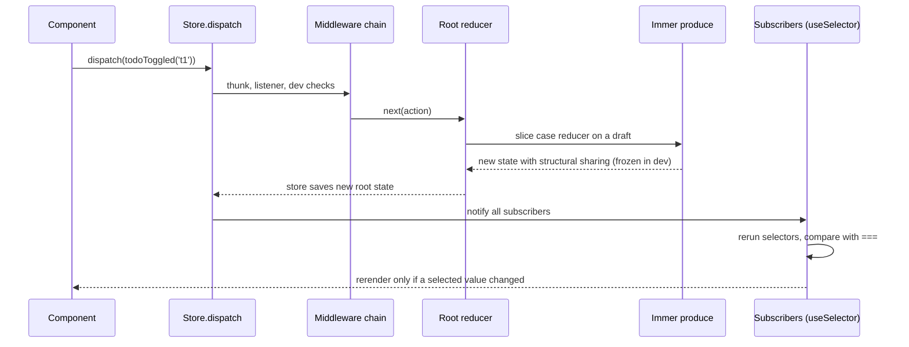
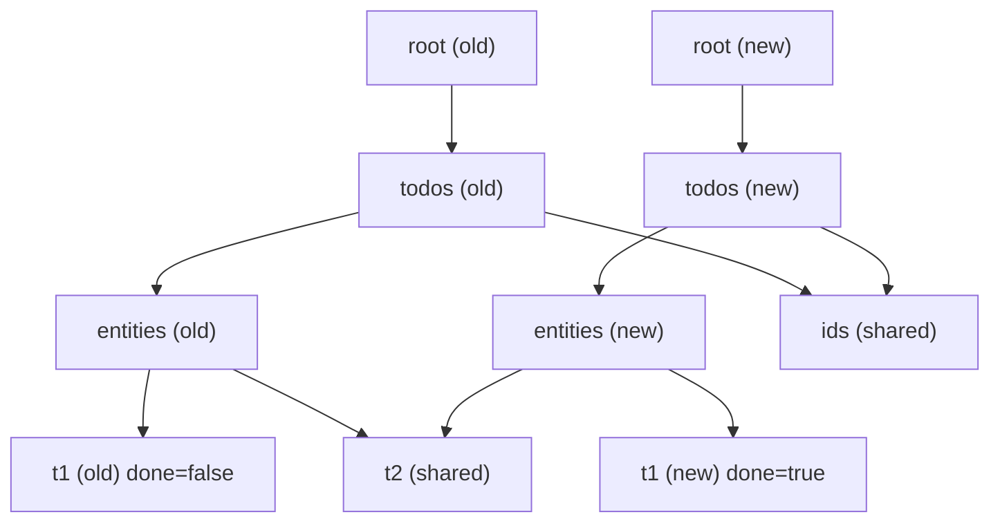

## Bối cảnh & vấn đề

Năm 2018, một codebase Redux "cổ điển" cho một màn hình giỏ hàng có bốn file: `actionTypes.js` (`export const ADD_ITEM = 'ADD_ITEM'`), `actions.js` (action creator), `reducer.js` (một `switch` dài với spread lồng ba tầng), và `selectors.js`. Thêm một field mới nghĩa là sửa bốn file. Một reviewer bỏ sót dòng `state.items.push(item)` trong reducer (mutate trực tiếp), và bug xuất hiện: component không re-render vì reference của `state.items` không đổi, nhưng Redux DevTools lại hiện state đã đổi. Mất hai ngày để tìm ra.

Redux Toolkit (RTK) ra đời để xoá đúng những đau đớn đó: boilerplate, mutate nhầm, cấu hình store rườm rà, và thiếu chuẩn cho async. Từ Redux 4.2, `createStore` được đánh dấu `@deprecated` để khuyến khích dùng `configureStore` của RTK; RTK là cách viết Redux được khuyến nghị chính thức. Nhưng RTK không thay đổi **mô hình** của Redux: vẫn là một store, action mô tả sự kiện, reducer thuần. Hiểu mô hình gốc giúp bạn biết vì sao các quy tắc tồn tại, còn hiểu RTK giúp bạn không phải tự viết lại chúng.

Bài này đi từ khái niệm lõi (store, action, reducer, dispatch, selector) tới những gì RTK thêm vào (Immer, dev checks, entity adapter), và cách tổ chức một codebase lớn. Side effect (thunk, listener) ở bài [side effects](/tracks/state-management/learn/redux-side-effects), selector và re-render ở bài [selectors](/tracks/state-management/learn/selectors-rerenders), còn RTK Query ở bài [RTK Query](/tracks/state-management/learn/rtk-query).

**Interview angle:** "RTK cho bạn gì so với Redux viết tay?" là câu easy phổ biến; câu trả lời tốt liệt kê cụ thể (`configureStore` dev checks, Immer, `createEntityAdapter`) thay vì chỉ nói "ít boilerplate".

## Khái niệm

### Store, action, reducer, dispatch, selector

**Store** là object giữ toàn bộ state client của app trong một cây duy nhất, với ba method chính: `getState()`, `dispatch(action)`, `subscribe(listener)`. **Action** là một object thuần `{ type, payload }` mô tả "chuyện gì đã xảy ra", ví dụ `{ type: 'cart/itemAdded', payload: { sku: 'A' } }`. **Reducer** là hàm `(state, action) => newState` quyết định state mới dựa trên sự kiện. **Dispatch** là cách duy nhất để thay đổi state: gửi action vào store, store gọi reducer, lưu kết quả, rồi báo cho mọi subscriber. **Selector** là hàm `(state) => value` đọc hoặc suy ra một phần state.

Mô hình này buộc mọi thay đổi đi qua một cửa duy nhất, nên bạn có thể log, replay, time-travel (tua lại từng action trong DevTools), và test reducer như hàm thuần: đưa state + action vào, kiểm tra state ra. Đây là lý do các team làm fintech thích Redux: chuỗi action là một audit log tự nhiên của phiên làm việc.

```ts
const next = cartReducer({ items: [] }, { type: "cart/itemAdded", payload: { sku: "A" } });
// next = { items: [{ sku: "A" }] }
```

**Interview angle:** interviewer thường hỏi tiếp "vì sao action nên mô tả sự kiện (`orderPlaced`) thay vì setter (`setOrders`)?"; câu trả lời: nhiều reducer có thể phản ứng với một sự kiện, và log action đọc như lịch sử nghiệp vụ.

### Ba quy tắc của reducer

Reducer phải **thuần** (pure): cùng input luôn cho cùng output, không gọi API, không `Math.random()`, không `Date.now()`, không đọc `localStorage`. Nếu reducer không thuần, time-travel và replay cho kết quả khác lần chạy thật, và test phải mock thế giới bên ngoài.

Reducer phải **immutable**: không sửa state cũ, mà trả về object mới cho phần thay đổi. React-Redux phát hiện thay đổi bằng so sánh reference (`===`); nếu bạn mutate `state.items.push(x)` rồi trả về cùng `state`, selector trả về cùng reference và component không re-render. Immutability cũng là điều kiện cho time-travel: state cũ phải còn nguyên để quay lại.

Reducer phải **đồng bộ**: không `async`, không `await`. Side effect (fetch, timer, WebSocket) nằm ở **middleware** (thunk, listener middleware, RTK Query), còn reducer chỉ nhận kết quả qua action. Giá trị không xác định như id hay timestamp được tạo trong **prepare callback** của action creator, không phải trong reducer.

**Interview angle:** câu hỏi bẫy: "reducer gọi `uuid()` có sao không?"; có, vì replay sẽ tạo id khác. Đưa nó vào `prepare`.

### createSlice và Immer

**`createSlice`** nhận `name`, `initialState` và object `reducers`, rồi sinh ra cả reducer lẫn action creator với type dạng `"<name>/<reducerKey>"`. Bên trong mỗi case reducer, bạn được phép viết code "mutate" như `state.items.push(item)`, vì RTK bọc reducer bằng **Immer**.

Immer hoạt động bằng **Proxy**: nó đưa cho bạn một **draft**, ghi lại mọi thay đổi bạn làm lên draft, rồi tạo ra state mới bằng **structural sharing**: chỉ những node trên đường đi từ root tới chỗ thay đổi được copy, phần còn lại giữ nguyên reference. Nhờ vậy selector đọc phần không đổi vẫn nhận cùng reference và component không re-render. Ở dev, Immer còn **freeze** state kết quả (auto-freeze), nên mọi cố gắng mutate state bên ngoài reducer sẽ ném lỗi.

Có hai điều bạn **không** được làm trong reducer Immer: vừa mutate draft vừa `return` một giá trị mới (Immer ném lỗi vì không biết chọn cái nào), và gán lại `state = newValue` (chỉ đổi biến local, không có tác dụng; hãy `return newValue`). Ngoài ra, draft là Proxy, nên `console.log(state)` in ra Proxy khó đọc; dùng `current(state)` để xem giá trị.

```ts
todoToggled(state, action: PayloadAction<string>) {
  const t = state.entities[action.payload];
  if (t) t.done = !t.done;          // safe: this is an Immer draft
},
reset: () => initialState,          // replacing the whole state: return it
```

**Interview angle:** follow-up kinh điển "Immer làm gì bên dưới, và một điều không được làm trong reducer Immer?"; nhắc Proxy + structural sharing + "không vừa mutate vừa return".

### configureStore và dev checks

**`configureStore`** thay `createStore` + `combineReducers` + `applyMiddleware` + DevTools enhancer bằng một lời gọi. Mặc định nó thêm middleware **thunk**, bật Redux DevTools, và ở môi trường development thêm các middleware kiểm tra: **immutability check** (phát hiện mutate state giữa các lần dispatch), **serializability check** (cảnh báo khi action hoặc state chứa giá trị không serialize được), và từ RTK 2 là **action creator check** (cảnh báo khi bạn dispatch nhầm chính hàm action creator thay vì action) (verify). Các check này bị loại bỏ ở production build nên không tốn chi phí.

```ts
const store = configureStore({
  reducer: { todos: todosReducer },
  middleware: (getDefault) =>
    getDefault({ serializableCheck: { ignoredActions: ["socket/connected"] } }).concat(logger),
});
```

Lưu ý RTK 2 dùng **callback** cho `middleware` (dạng mảng đã bị bỏ) và builder callback cho `extraReducers` (dạng object bị xoá) (verify với version bạn dùng).

**Interview angle:** biết rằng dev checks chỉ chạy ở development và có thể cấu hình `ignoredActions`/`ignoredPaths` cho thấy bạn đã dùng thật.

### Serializability

**Serializable** nghĩa là giá trị chuyển qua `JSON.stringify` rồi `JSON.parse` mà không mất thông tin: string, number, boolean, null, plain object, array. `Date`, `Map`, `Set`, class instance, Promise, function, Error thì không. Redux khuyến nghị (Style Guide gọi là "Essential") không đặt giá trị non-serializable vào state và action.

Lý do rất thực tế: Redux DevTools serialize state để hiển thị và time-travel; `redux-persist` lưu state xuống storage; SSR gửi state từ server xuống client dưới dạng JSON. `Date` sau khi đi qua JSON thành string, nên code gọi `state.at.getTime()` sẽ vỡ sau khi rehydrate. Class instance có method khuyến khích mutate (`order.markPaid()`), phá immutability. Cách lưu đúng: `Date` → ISO string hoặc epoch ms; `Map` → object hoặc entity adapter; Promise → field `status: 'loading' | 'done'`.

Ngoại lệ có chủ đích tồn tại: một action mang tham chiếu tới object non-serializable chỉ để middleware dùng (ví dụ socket instance) có thể được bỏ qua bằng `ignoredActions`. Còn chính object đó (WebSocket connection) nên sống trong module riêng hoặc middleware, không bao giờ trong state.

**Interview angle:** câu "WebSocket connection nên đặt ở đâu nếu không phải Redux?" có đáp án: một module/service singleton hoặc bên trong middleware, store chỉ giữ trạng thái `connected: boolean`.

### Normalization và createEntityAdapter

**Normalization** là lưu mỗi entity **một lần**, theo id, như một bảng trong database: `{ ids: ['p1', 'p2'], entities: { p1: {...}, p2: {...} } }`. Quan hệ giữa entity được biểu diễn bằng id (`order.productIds`), không lồng object. Khi cùng một product xuất hiện trong nhiều order, sửa tên product chỉ cần sửa một chỗ, và mọi view đọc qua id đều thấy tên mới.

**`createEntityAdapter`** sinh sẵn state shape đó, các case reducer CRUD (`addOne`, `addMany`, `setAll`, `upsertMany`, `updateOne`, `removeOne`...), và selector (`selectAll`, `selectById`, `selectIds`, `selectTotal`). Option `sortComparer` giữ mảng `ids` luôn được sắp xếp. Bạn có thể thêm field khác vào state bằng `getInitialState({ filter: 'all' })`.

Normalize không phải lúc nào cũng cần. Cache của TanStack Query hay RTK Query lưu **theo query** (không normalized), và với phần lớn app, invalidate/refetch là đủ để các view nhất quán. Normalize có giá trị khi nhiều view cùng **sửa** một entity phía client (editor, kanban kéo thả, dữ liệu realtime), hoặc khi danh sách lớn cần lookup theo id O(1).

**Interview angle:** interviewer hay hỏi ngược: "TanStack Query không normalize, vậy làm sao giữ list và detail nhất quán?"; câu trả lời nằm ở bài [mutation và invalidation](/tracks/state-management/learn/mutations-invalidation).

### Cấu trúc feature và typed hooks

Redux Style Guide khuyến nghị tổ chức theo **feature folder**: `features/cart/cartSlice.ts`, `features/cart/selectors.ts`, `features/cart/useCart.ts`, thay vì tách theo loại file (`actions/`, `reducers/`). Mỗi slice **sở hữu** một nhánh state; slice khác muốn phản ứng với sự kiện của nó thì dùng `extraReducers` lắng nghe action, không import và ghi chéo. Selector là **public API** của slice: component gọi `selectCartCount`, không đọc `state.cart.items.length` trực tiếp, nên đổi shape nội bộ không làm vỡ component.

Typed hooks tạo một lần: `useAppSelector = useSelector.withTypes<RootState>()`, `useAppDispatch = useDispatch.withTypes<AppDispatch>()` (API `withTypes` có từ react-redux 9.1, verify). Server data đi vào RTK Query API slice, tách theo feature bằng `injectEndpoints` để code splitting.

Custom hook đứng giữa component và store: `useTransfer()` trả `{ state, enter, confirm }`, component chỉ render. Logic thuần (tính phí, kiểm tra hạn mức) viết thành function hoặc đặt trong reducer để test riêng.

**Interview angle:** câu "hai slice cần reset khi `userLoggedOut`, làm sao không import lẫn nhau?" có đáp án: định nghĩa action chung bằng `createAction` và cả hai `extraReducers` lắng nghe nó, hoặc reset ở root reducer.

## Cơ chế hoạt động

Luồng một lần dispatch trong store tạo bởi `configureStore`:



Diễn giải. Action đi qua **chuỗi middleware** trước: thunk middleware kiểm tra nếu action là function thì gọi nó thay vì chuyển tiếp; các dev check ghi nhận state trước để so sánh sau. Sau đó root reducer (do `combineReducers` tạo từ object `reducer`) gọi reducer của từng slice với nhánh state tương ứng. Slice reducer chạy case reducer trên một draft của Immer; Immer tạo state mới chỉ copy các node bị chạm. Store lưu root state mới và gọi **mọi subscriber**. Mỗi `useSelector` chạy lại selector của nó và so sánh kết quả với lần trước bằng `===`; chỉ component có kết quả khác mới render.

Điểm quan trọng: **mọi subscriber đều được gọi sau mọi action**. Hiệu năng vì vậy phụ thuộc vào việc selector rẻ và trả về reference ổn định, chủ đề của bài [selectors](/tracks/state-management/learn/selectors-rerenders).

Structural sharing sau khi toggle `t1` trông như sau:



Chỉ bốn node trên đường tới `t1` được tạo mới; `t2` và mảng `ids` được dùng chung giữa state cũ và mới. Component chỉ đọc `t2` nhận cùng reference và không re-render.

## Ví dụ thực tế

### Slice, entity adapter, structural sharing và dev checks

```ts
import { configureStore, createSlice, createEntityAdapter, createSelector, type PayloadAction } from "@reduxjs/toolkit";

type Todo = { id: string; title: string; done: boolean };
const todos = createEntityAdapter<Todo>({ sortComparer: (a, b) => a.title.localeCompare(b.title) });
const todosSlice = createSlice({
  name: "todos",
  initialState: todos.getInitialState({ filter: "all" as "all" | "done" }),
  reducers: {
    todoAdded: todos.addOne,
    todoToggled(state, action: PayloadAction<string>) {
      const t = state.entities[action.payload];
      if (t) t.done = !t.done;
    },
    filterChanged(state, action: PayloadAction<"all" | "done">) { state.filter = action.payload; },
  },
});
const { todoAdded, todoToggled, filterChanged } = todosSlice.actions;
console.log("action creator:", todoToggled("t1"));

const store = configureStore({ reducer: { todos: todosSlice.reducer } });
store.dispatch(todoAdded({ id: "t2", title: "Write lesson", done: false }));
store.dispatch(todoAdded({ id: "t1", title: "Buy milk", done: false }));
const before = store.getState().todos;
store.dispatch(todoToggled("t1"));
const after = store.getState().todos;
console.log("normalized:", JSON.stringify(after));
console.log("structural sharing: root changed", before !== after,
  "| entities.t1 changed", before.entities.t1 !== after.entities.t1,
  "| entities.t2 same", before.entities.t2 === after.entities.t2);
const sel = todos.getSelectors((s: ReturnType<typeof store.getState>) => s.todos);
console.log("selectAll:", sel.selectAll(store.getState()).map((t) => t.title));

// dev checks: a Date in an action/state, then mutations
const bad = createSlice({ name: "bad", initialState: { at: "", list: [] as number[] }, reducers: {
  savedDate(state, a: PayloadAction<any>) { (state as any).at = a.payload; },
} });
const store2 = configureStore({ reducer: { bad: bad.reducer } });
store2.dispatch(bad.actions.savedDate(new Date("2026-09-30T00:00:00Z")));
try { (store2.getState().bad.list as number[]).push(1); }
catch (e) { console.log("mutating state outside a reducer ->", e.constructor.name + ":", e.message); }
const store3 = configureStore({ reducer: (state = { n: [] as number[] }, action: any) => {
  if (action.type === "oops") state.n.push(1); return state; } });
try { store3.dispatch({ type: "oops" }); } catch (e) { console.log("hand-written reducer mutation ->", e.message); }
```

Output thật (Node 24, `@reduxjs/toolkit` 2.13.0, `NODE_ENV=development`; các dòng `console.error` được rút gọn còn dòng đầu):

```text
action creator: { type: 'todos/todoToggled', payload: 't1' }
normalized: {"ids":["t1","t2"],"entities":{"t2":{"id":"t2","title":"Write lesson","done":false},"t1":{"id":"t1","title":"Buy milk","done":true}},"filter":"all"}
structural sharing: root changed true | entities.t1 changed true | entities.t2 same true
selectAll: [ 'Buy milk', 'Write lesson' ]
console.error: A non-serializable value was detected in an action, in the path: `payload`. Value: 2026-09-30T00:00:00.000Z
console.error: A non-serializable value was detected in the state, in the path: `bad.at`. Value: 2026-09-30T00:00:00.000Z
mutating state outside a reducer -> TypeError: Cannot add property 0, object is not extensible
hand-written reducer mutation -> A state mutation was detected inside a dispatch, in the path: n.0. ...
```

Đọc output. Action creator sinh type `todos/todoToggled` tự động. Entity adapter lưu `ids` đã sắp theo `title` (`t1` "Buy milk" đứng trước dù được thêm sau), còn `entities` là map theo id. Sau khi toggle `t1`, root và `t1` là object mới, nhưng `t2` **giữ nguyên reference**: đó là structural sharing. Serializability check bắt `Date` hai lần, một lần trong action và một lần trong state. State do Immer tạo bị **freeze**, nên `push` bên ngoài reducer ném `TypeError`. Với reducer viết tay (không có Immer), immutability check phát hiện mutation và ném lỗi ngay khi dispatch, chỉ rõ path `n.0`.

### Custom hook test với store thật

Pattern "tách business logic khỏi presentation bằng custom hook" được test tốt nhất với **store thật** tạo từ `makeStore(preloadedState)`, thay vì mock `useSelector`. Mock kiểm tra rằng bạn gọi đúng hàm; store thật kiểm tra rằng **hành vi** đúng: reducer, selector, và hook làm việc cùng nhau.

```tsx
const transfer = createSlice({
  name: "transfer",
  initialState: { step: "form", amount: 0, dailyLimit: 50_000_000, error: null } as TransferState,
  reducers: {
    amountEntered(s, a: PayloadAction<number>) {
      if (a.payload > s.dailyLimit) { s.error = "OVER_LIMIT"; return; }
      s.amount = a.payload; s.error = null; s.step = "review";
    },
    confirmed(s) { if (s.step === "review") s.step = "done"; },
  },
});
const makeStore = (preloadedState?: Partial<RootState>) => configureStore({ reducer: rootReducer, preloadedState });

function useTransfer() {
  const state = useAppSelector((s) => s.transfer);
  const dispatch = useAppDispatch();
  return { state, enter: (n: number) => dispatch(transfer.actions.amountEntered(n)),
           confirm: () => dispatch(transfer.actions.confirmed()) };
}

const store = makeStore({ transfer: { step: "form", amount: 0, dailyLimit: 10_000_000, error: null } });
const r = await renderHook(useTransfer, store);   // renders <Provider store={store}> around the hook
await act(async () => { r.current.enter(12_000_000); });
console.log("over limit ->", r.current.state.step, r.current.state.error);
await act(async () => { r.current.enter(2_000_000); });
console.log("valid      ->", r.current.state.step, r.current.state.amount);
await act(async () => { r.current.confirm(); });
console.log("confirm    ->", r.current.state.step);
```

Output thật (React 19.3, react-redux 9.3, jsdom; `renderHook` là helper nhỏ tự viết, Testing Library cung cấp bản tương đương):

```text
over limit -> form OVER_LIMIT
valid      -> review 2000000
confirm    -> done
```

`preloadedState` cho phép đặt hạn mức 10 triệu cho test mà không cần dispatch chuỗi action setup. Test chạy qua reducer thật, nên nếu ai đó đổi logic hạn mức, test sẽ đỏ. Kết hợp với MSW cho API layer, bạn có test tích hợp nhẹ mà vẫn nhanh.

**Interview angle:** câu "vì sao test với store thật tốt hơn mock `useSelector`?" có đáp án: mock khoá test vào chi tiết triển khai và bỏ qua bug ở reducer/selector.

## Trade-offs & lựa chọn thay thế

| Tiêu chí | Redux viết tay | Redux Toolkit | Zustand | `useReducer` + Context |
| --- | --- | --- | --- | --- |
| Boilerplate | Cao (types, creators, switch) | Thấp (`createSlice`) | Rất thấp | Thấp |
| Chống mutate nhầm | Không (tự kỷ luật) | Immer + freeze + immutability check | Không (tự dùng spread hoặc middleware immer) | Không |
| DevTools, time-travel | Có (tự cấu hình) | Có sẵn | Qua middleware `devtools` | Không |
| Async chuẩn | Tự chọn middleware | thunk, `createAsyncThunk`, listener, RTK Query | Tự viết trong action | Tự viết |
| Normalization | Tự viết | `createEntityAdapter` | Tự viết | Tự viết |
| Chi phí học | Trung bình | Trung bình (nhiều API) | Thấp | Thấp |

Khi nào chọn cái nào. Không có lý do để viết Redux tay cho code mới; nếu đã chọn Redux thì dùng RTK. RTK hợp khi team lớn cần một convention chung (slice, feature folder, selector là public API), cần DevTools với lịch sử action để debug và audit, hoặc có workflow client phức tạp nhiều bước. Zustand hợp khi client state nhỏ gọn và team muốn ít khái niệm. `useReducer` + Context hợp cho state có logic chuyển trạng thái phức tạp nhưng chỉ một cây component dùng (ví dụ một wizard).

Với dữ liệu từ API, câu hỏi không phải "RTK hay không" mà là "RTK Query hay TanStack Query" (xem bài [RTK Query](/tracks/state-management/learn/rtk-query)). Giữ response API trong slice tự viết là lựa chọn tệ nhất trong cả bảng.

## Edge cases & failure modes

- **Dispatch trong reducer**: gọi `dispatch` bên trong reducer ném lỗi "Reducers may not dispatch actions". Sự kiện thứ cấp phải đi qua middleware (listener) hoặc gộp logic vào `extraReducers`.
- **Immer với class instance**: Immer chỉ tạo draft cho plain object, array, Map, Set (và class đánh dấu `immerable`). Class instance trong state không được draft; mutate nó là mutate thật và không có state mới.
- **Vừa mutate vừa return**: `state.x = 1; return { ...state }` ném lỗi "An immer producer returned a new value *and* modified its draft". Chọn một trong hai.
- **State lớn và dev checks**: immutability check và serializability check duyệt toàn bộ state sau mỗi action; với state vài MB, dev build chậm đi rõ, và RTK in cảnh báo khi check mất hơn 32 ms (verify). Cấu hình `warnAfter`, `ignoredPaths`, hoặc tắt riêng check đó cho nhánh lớn, và tự hỏi vì sao state lớn vậy.
- **Serialize `Date` rồi rehydrate**: state persist hoặc SSR chứa `Date` sẽ thành string sau khi đọc lại; code gọi method trên nó ném `TypeError: x.getTime is not a function` chỉ sau reload.
- **Slice đọc chéo state của slice khác trong reducer**: reducer của slice chỉ nhận nhánh của nó. Nếu cần dữ liệu slice khác, đưa vào payload (thunk lấy từ `getState()`) hoặc derive trong selector.
- **Reset khi logout bỏ sót slice**: mỗi slice tự reset bằng `extraReducers` dễ quên slice mới thêm. Reset ở root reducer (`state = undefined` khi gặp `loggedOut`) bao phủ mọi slice, kể cả slice thêm sau này.

## Pitfalls

- ❌ `state.items.push(x)` trong reducer viết tay → ✅ dùng `createSlice` (Immer), vì mutate làm reference không đổi và UI không render.
- ❌ Đặt `Date`, `Map`, class, Promise vào state → ✅ ISO string, object/entity adapter, field status, vì DevTools, persist và SSR đều dựa vào JSON.
- ❌ Action kiểu setter `setOrders`, `setLoading` → ✅ action mô tả sự kiện `orderPlaced`, `checkoutStarted`, để nhiều slice cùng phản ứng và log đọc như lịch sử.
- ❌ Component đọc `state.cart.items` trực tiếp khắp nơi → ✅ selector là public API của slice, để đổi shape không làm vỡ component.
- ❌ Gọi API, `Date.now()`, `uuid()` trong reducer → ✅ middleware hoặc `prepare` callback, vì reducer phải thuần để replay và test.
- ❌ Mock `useSelector` trong test hook → ✅ `makeStore(preloadedState)` với store thật, vì test hành vi chứ không test chi tiết triển khai.
- ❌ Lồng entity trong entity (order chứa product đầy đủ) khi nhiều view cùng sửa product → ✅ normalize bằng `createEntityAdapter`.

## Tóm tắt

- Redux: một store, **action mô tả sự kiện**, reducer `(state, action) => newState` thuần, immutable, đồng bộ; side effect nằm ở middleware.
- `createSlice` sinh action creator + reducer; **Immer** cho phép viết code "mutate" trên draft và tạo state mới bằng **structural sharing**.
- `configureStore` thêm thunk, DevTools, và dev-only checks: immutability, serializability, action creator (RTK 2).
- Không đặt giá trị **non-serializable** vào state/action; object như WebSocket sống ngoài store.
- **Normalize** bằng `createEntityAdapter` khi nhiều view cùng sửa entity; cache theo query thường đủ cho phần còn lại.
- Feature folder, selector là public API, typed hooks `withTypes`, cross-slice qua `extraReducers`.
- Test custom hook với **store thật** tạo từ `makeStore(preloadedState)`.
