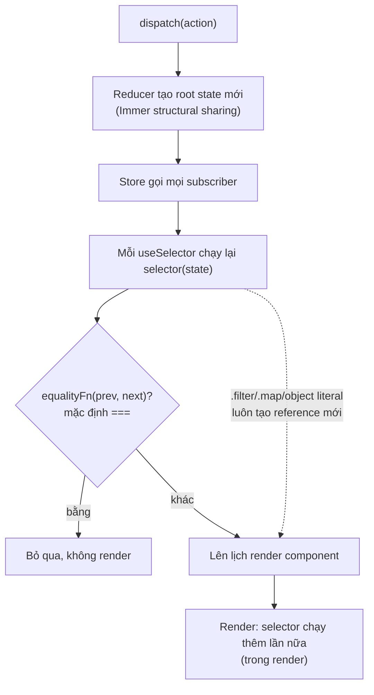
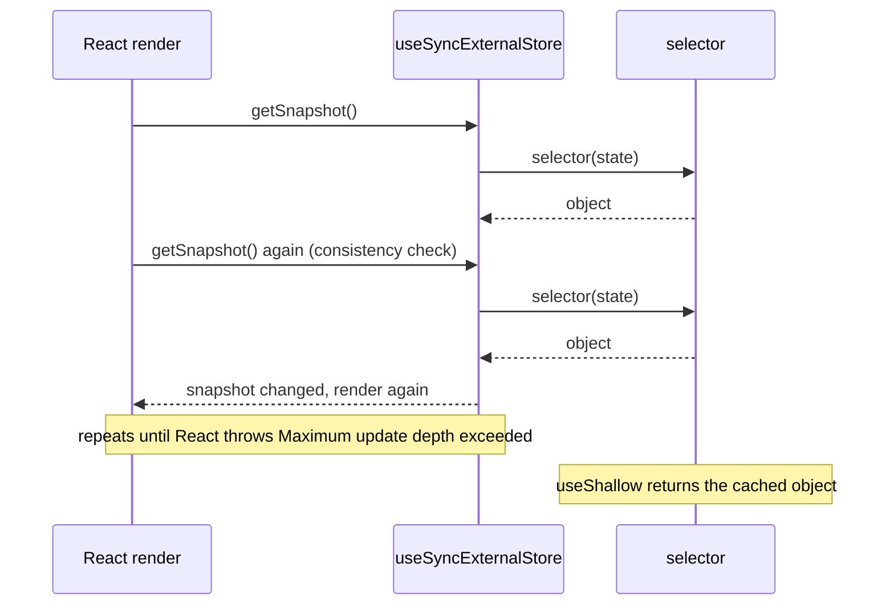

## Bối cảnh & vấn đề

Một dashboard giao dịch có 120 ô hiển thị giá. Mỗi giây store nhận khoảng 20 action cập nhật giá, plus một action `clock/ticked`. Profiler của React cho thấy **cả 120 ô** render lại sau mỗi action, kể cả `clock/ticked` không liên quan gì tới giá. CPU laptop của người dùng chạm 90%, gõ vào ô tìm kiếm bị trễ nửa giây.

Nguyên nhân nằm ở một dòng:

```ts
const rows = useSelector((s: RootState) => s.prices.list.filter((p) => watchlist.includes(p.symbol)));
```

`.filter` luôn trả về **mảng mới**. React-Redux so sánh kết quả selector bằng `===`, thấy khác, và render lại. Ở một app khác dùng Zustand v5, cùng kiểu lỗi (selector trả object mới) không chỉ làm render thừa mà làm component **crash** với `Maximum update depth exceeded`.

Mọi store có selector (Redux, Zustand, Jotai) đều dựa trên cùng một hợp đồng: **selector phải trả về giá trị ổn định khi dữ liệu nó quan tâm không đổi**. Bài này giải thích cơ chế subscription bên dưới, vì sao reference stability quyết định hiệu năng, cách sửa bằng `createSelector`, `shallowEqual`, `useShallow`, và vì sao Context không có selector. Nền tảng về render trong React (khi nào component render, `memo`) nằm ở track [React](/tracks/react).

**Interview angle:** debug câu selector `.filter` là một trong những câu hỏi Redux phổ biến nhất ở mức medium; interviewer muốn nghe "so sánh `===`, reference mới mỗi lần".

## Khái niệm

### Subscription và useSyncExternalStore

Một **external store** là state nằm ngoài React (Redux store, Zustand store), có `getState()` và `subscribe(listener)`. React 18 cung cấp **`useSyncExternalStore(subscribe, getSnapshot)`** để component đọc store này an toàn với concurrent rendering. Mỗi khi store báo thay đổi, React gọi `getSnapshot()` và so sánh kết quả với lần trước bằng `Object.is`; nếu khác, component render lại.

Hợp đồng then chốt: `getSnapshot` phải trả về **cùng giá trị** nếu store không đổi. Nếu mỗi lần gọi trả object mới, React coi như state luôn thay đổi, render lại, gọi `getSnapshot` lần nữa, lại thấy khác, và rơi vào vòng lặp; React phát hiện điều này và in "The result of getSnapshot should be cached to avoid an infinite loop", rồi ném "Maximum update depth exceeded".

React-Redux (v8+) dùng `useSyncExternalStoreWithSelector`: nó ghi nhớ kết quả selector và chỉ so sánh bằng hàm equality bạn truyền (mặc định `===`), nên selector trả object mới gây render thừa nhưng không lặp vô hạn. Zustand v5 dùng thẳng `useSyncExternalStore` với selector làm một phần của `getSnapshot`, nên selector không ổn định gây **lặp vô hạn** (verify với minor version).

**Interview angle:** biết rằng cả React-Redux và Zustand đều đứng trên `useSyncExternalStore` cho thấy bạn hiểu cơ chế chung, không chỉ thuộc API từng thư viện.

### Reference stability

**Reference stability** nghĩa là cùng dữ liệu thì trả về cùng object (cùng địa chỉ bộ nhớ). Primitive (number, string, boolean) so sánh theo giá trị nên luôn ổn định. Object và array tạo mới bằng `{...}`, `[...]`, `.map`, `.filter`, `Object.keys` luôn là reference mới, dù nội dung giống hệt.

Vì vậy có ba cách viết selector an toàn: trả **primitive** (`s => s.items.length`); trả **reference có sẵn trong state** (`s => s.orders.list`, Immer giữ nguyên reference nếu nhánh đó không đổi); hoặc trả giá trị **đã memo** (qua `createSelector` hay `useShallow`). Mọi selector tạo object mới mà không memo là selector có vấn đề.

```ts
useSelector((s) => s.cart.items.length);          // primitive: stable
useSelector((s) => s.cart.items);                 // existing reference: stable
useSelector((s) => s.cart.items.map((i) => i.id)); // new array each call: unstable
```

**Interview angle:** câu hỏi hay gặp: "selector `s => ({ a: s.a })` có vấn đề gì?"; đáp án: object literal mới mỗi lần.

### Memoized selector với createSelector (Reselect)

**`createSelector`** (Reselect, được RTK re-export) nhận một mảng **input selectors** và một **result function**. Mỗi lần gọi, nó chạy các input selector; nếu mọi kết quả input bằng (`===`) lần trước, nó trả lại kết quả cũ mà không chạy result function. Vì input selectors thường trả reference có sẵn trong state (được Immer giữ ổn định), output cũng ổn định cho tới khi input thật sự đổi.

```ts
const selectPaid = createSelector([(s: RootState) => s.orders.list], (list) => list.filter((o) => o.paid));
```

Input selector phải **rẻ và ổn định**; logic biến đổi nằm ở result function. Nếu input selector trả mảng mới (`s => s.orders.list.filter(...)`) thì memo vô dụng. Reselect 5 có dev check `inputStabilityCheck` cảnh báo khi input selector trả kết quả khác nhau cho cùng input, và `identityFunctionCheck` cảnh báo khi result function chỉ trả lại input (memo vô nghĩa) (verify).

**Interview angle:** interviewer hỏi tiếp "cache size của Reselect là bao nhiêu?"; câu trả lời phụ thuộc version, xem mục tiếp theo.

### Cache size: lruMemoize vs weakMapMemoize

Reselect 4 dùng `defaultMemoize` với **cache size 1**: chỉ nhớ bộ tham số gần nhất. Với selector có tham số (`selectByStatus(state, status)`) mà hai component gọi với hai status khác nhau, cache liên tục bị đẩy ra và selector tính lại mỗi lần. Cách chữa kinh điển là tạo **một instance selector cho mỗi component** (`useMemo(() => makeSelectByStatus(), [])`).

Reselect 5 (đi kèm RTK 2) đổi mặc định sang **`weakMapMemoize`**: một cây cache theo từng tham số (WeakMap cho object, Map cho primitive), nên nhớ **nhiều** bộ tham số cùng lúc và giải phóng khi object tham số bị GC. Bản cũ vẫn có tên `lruMemoize` với `maxSize` cấu hình được. Nhờ vậy, nhu cầu "selector factory per component" giảm hẳn ở RTK 2 (verify với version bạn dùng).

**Interview angle:** nói được "Reselect 5 dùng `weakMapMemoize` mặc định, cache size 1 là hành vi của Reselect 4/`lruMemoize`" là dấu hiệu bạn cập nhật kiến thức.

### Equality function: shallowEqual

`useSelector(selector, equalityFn)` nhận tham số thứ hai để thay `===`. **`shallowEqual`** so sánh từng key (hoặc phần tử) ở tầng đầu bằng `===`. Selector trả `{ a: s.a, b: s.b }` với `shallowEqual` chỉ render khi `a` hoặc `b` đổi reference. Với mảng từ `.filter`, `shallowEqual` so sánh từng phần tử: nếu các phần tử là reference ổn định từ state, kết quả giống nhau và không render.

Cái giá là selector vẫn **chạy lại** sau mọi action (filter 10.000 phần tử mỗi action vẫn tốn CPU), và việc so sánh cũng tốn O(n). `createSelector` tránh cả hai; `shallowEqual` là sửa nhanh khi dữ liệu nhỏ.

**Interview angle:** so sánh `createSelector` với `shallowEqual` theo hai trục: số lần chạy selector và số lần render.

### Zustand selectors và useShallow

Zustand store là một hook: `useCart(selector)`. Component chỉ render khi kết quả selector đổi (so sánh `Object.is`). Gọi `useCart()` không selector nghĩa là subscribe **cả store**, render sau mọi thay đổi. Muốn lấy nhiều field một lần, bọc selector bằng **`useShallow`**: nó ghi nhớ kết quả trước và trả lại **cùng reference** nếu so sánh shallow thấy bằng, biến selector không ổn định thành ổn định.

```ts
const { count, hasCoupon } = useCart(useShallow((s) => ({ count: s.items.length, hasCoupon: s.coupon !== null })));
```

Action nằm trong store nên component chỉ cần action có thể select action (`useCart(s => s.add)`), reference của function không đổi nên không bao giờ render lại vì nó. Ngoài React, `useCart.getState()` và `useCart.setState()` cho phép đọc/ghi từ service, socket handler hay test. Nếu muốn equality function tuỳ biến như v4, v5 cung cấp `createWithEqualityFn` trong `zustand/traditional` (verify).

**Interview angle:** follow-up "làm sao persist một phần store Zustand mà không vỡ SSR?"; dùng middleware `persist` với `partialize` và `skipHydration`/rehydrate sau mount (xem bài [real-time, persist, offline](/tracks/state-management/learn/realtime-sync-offline)).

### Context không có selector

`useContext(Ctx)` subscribe vào **toàn bộ value** của provider gần nhất. Khi `value` đổi reference (thường là mỗi lần provider render nếu bạn viết `value={{ state, actions }}`), **mọi consumer** render lại, kể cả consumer chỉ dùng `actions`, và `memo` không chặn được vì context bỏ qua memo. Hai cách giảm: **tách context** thành một context cho state đổi thường xuyên và một context cho actions ổn định; và **memo value** bằng `useMemo`/`useState` để reference chỉ đổi khi dữ liệu đổi.

Tách context giúp consumer chỉ gọi action không render lại, nhưng mọi consumer của context state vẫn render khi state đổi. Khi nhiều consumer chỉ cần những phần khác nhau của một object lớn đổi thường xuyên, đó là tín hiệu cần store có selector.

**Interview angle:** interviewer thường yêu cầu "chỉ cho tôi cách tách context giảm re-render"; nên kèm con số từ Profiler, như ở phần ví dụ.

### Jotai: atom thay cho selector

**Jotai** đi hướng ngược lại: thay vì một store lớn và selector, bạn có nhiều **atom** nhỏ; component dùng `useAtom(priceAtom)` chỉ phụ thuộc atom đó. Atom derive (`atom(get => get(a) + get(b))`) tính lại khi dependency đổi, giống `createSelector` nhưng dependency được theo dõi tự động. Không cần nghĩ về reference stability của selector, nhưng khi graph atom lớn, khó thấy "ai phụ thuộc ai".

## Cơ chế hoạt động

Luồng từ một action tới quyết định render, với React-Redux:



Diễn giải. Sau mỗi dispatch, **mọi** `useSelector` đang mount đều chạy selector, bất kể action liên quan hay không. Chi phí thứ nhất là thời gian chạy selector, chi phí thứ hai là render nếu equality thất bại. Selector trả primitive hoặc reference có sẵn thì equality `===` đúng, gần như không tốn gì. Selector tạo reference mới thì luôn thất bại, và component render dù dữ liệu y hệt. `createSelector` cắt ở bước D (không chạy result function), `shallowEqual` cắt ở bước E.

Với Zustand v5, bước E bị thay bằng `useSyncExternalStore` so sánh `Object.is(getSnapshot(), getSnapshot())`. Nếu selector không ổn định, React thấy snapshot "đổi" ngay trong lúc render, render lại, và vòng lặp xảy ra:



`useShallow` phá vòng lặp vì nó giữ lại kết quả trước và trả lại chính object đó nếu nội dung shallow-equal, nên `Object.is` đúng ngay từ lần so sánh thứ hai.

## Ví dụ thực tế

### Đo re-render: Redux, Zustand, Context

Chương trình sau mount các component vào jsdom và đếm số lần render. Phần 1 dispatch 5 action không liên quan (`clock++`). Phần 2 mount component Zustand dùng selector object không có `useShallow`. Phần 3 đổi `note` 3 lần (không liên quan tới badge) rồi thêm 1 item. Phần 4 và 5 so sánh một context với context tách đôi.

```tsx
// 1) react-redux
const selectPaid = createSelector([(s: S) => s.orders.list], (l) => l.filter((o) => o.paid));
function Naive()   { const paid = useSelector((s: S) => s.orders.list.filter((o) => o.paid)); count("naive .filter"); return <i>{paid.length}</i>; }
function Memo()    { const paid = useSelector(selectPaid); count("createSelector"); return <i>{paid.length}</i>; }
function Shallow() { const paid = useSelector((s: S) => s.orders.list.filter((o) => o.paid), shallowEqual); count("filter + shallowEqual"); return <i>{paid.length}</i>; }
await mount(<Provider store={store}><Naive /><Memo /><Shallow /></Provider>);
for (let i = 0; i < 5; i++) await act(async () => { store.dispatch(orders.actions.tick()); });

// 2) zustand v5: object selector without useShallow
function BadBadge() { const { count, hasCoupon } = useCart((s) => ({ count: s.items.length, hasCoupon: s.coupon !== null })); return <span>{count}{hasCoupon && "*"}</span>; }
try { await mount(<BadBadge />); } catch (e) { console.log("threw:", e.message); }

// 3) zustand fixes
function GoodBadge()  { const { count: c } = useCart(useShallow((s) => ({ count: s.items.length, hasCoupon: s.coupon !== null }))); count("useShallow badge"); return <span>{c}</span>; }
function PrimBadge()  { const c = useCart((s) => s.items.length); count("primitive badge"); return <span>{c}</span>; }
function WholeStore() { const s = useCart(); count("useCart() no selector"); return <span>{s.items.length}</span>; }
await mount(<><GoodBadge /><PrimBadge /><WholeStore /></>);
for (let i = 0; i < 3; i++) await act(async () => { useCart.getState().setNote("n" + i); });
await act(async () => { useCart.getState().add("sku-1"); });

// 4) one context value { theme, count, inc } vs 5) split CountCtx + ActionsCtx (actions held in useState)
```

Output thật (React 19.3, react-redux 9.3, zustand 5.0.15, jsdom, `NODE_ENV=development`, cảnh báo rút gọn còn dòng đầu):

```text
1) react-redux, 5 unrelated actions (clock++):
  console.warn: Selector unknown returned a different result when called with the same parameters. This can lead to unnecessary rerenders.
  renders: {"naive .filter":6,"createSelector":1,"filter + shallowEqual":1}
2) zustand object selector without useShallow:
  console.error: The result of getSnapshot should be cached to avoid an infinite loop
  threw: Maximum update depth exceeded. This can happen when a component repeatedly calls setState inside componentWill...
3) zustand, 3 note changes + 1 add: {"useShallow badge":2,"primitive badge":2,"useCart() no selector":5}
4) single context, 3 increments: {"ThemeLabel (reads theme only)":4,"IncButton (reads inc only)":4}
5) split contexts, 3 increments: {"CountLabel":4,"IncButton (actions ctx)":1}
```

Đọc từng dòng. **(1)** Selector `.filter` render 6 lần (1 mount + 5 action không liên quan), còn `createSelector` và `shallowEqual` chỉ render lúc mount. React-Redux ở dev chạy selector hai lần với cùng state và cảnh báo khi kết quả khác nhau (dev check `stabilityCheck`, mặc định chạy một lần). **(2)** Zustand v5 với selector object ném **Maximum update depth exceeded** ngay khi mount, chứ không chỉ render thừa. **(3)** `useShallow` và selector primitive chỉ render 2 lần (mount + lần thêm item); `useCart()` không selector render 5 lần (mount + 3 lần đổi `note` + 1 lần add). **(4)** Một context chứa `{ theme, count, inc }`: `ThemeLabel` chỉ đọc `theme` vẫn render 4 lần, `memo` không cứu được. **(5)** Tách context và giữ object actions ổn định bằng `useState`: `IncButton` chỉ render 1 lần, còn `CountLabel` vẫn render mỗi lần `count` đổi, đúng như mong đợi.

Cách test "CartBadge không render khi field không liên quan đổi" chính là kỹ thuật trên: một biến đếm trong component (hoặc `<Profiler onRender>`), đổi field không liên quan trong `act`, rồi assert số lần render không tăng.

### Cấu trúc selector cho một slice thật

Trong một codebase RTK lớn, mỗi feature export selector như public API:

```ts
// features/accounts/selectors.ts
export const selectAccountsState = (s: RootState) => s.accounts;
export const selectAccountIds = (s: RootState) => s.accounts.ids;
export const selectAccountById = (s: RootState, id: string) => s.accounts.entities[id];
export const selectSelectedAccountId = (s: RootState) => s.accounts.selectedId;
export const selectSelectedAccount = createSelector(
  [selectAccountsState, selectSelectedAccountId],
  (st, id) => (id ? st.entities[id] : undefined),
);
export const selectTotalBalance = createSelector([selectAccountsState], (st) =>
  st.ids.reduce((sum, id) => sum + st.entities[id]!.balance, 0),
);
```

Component danh sách render `ids` và mỗi dòng tự select `selectAccountById(s, id)`: khi một tài khoản đổi số dư, chỉ dòng đó render lại, vì các entity khác giữ nguyên reference. Đây là pattern "list of ids, row selects by id" mà Redux docs khuyến nghị cho danh sách lớn.

**Interview angle:** với câu CV "bạn cấu trúc slice và selector trên dự án thế nào", pattern ids + row select by id và `createSelector` cho giá trị tổng hợp là ví dụ cụ thể nên kể.

## Trade-offs & lựa chọn thay thế

| Kỹ thuật | Selector chạy lại mỗi action? | Render thừa? | Chi phí | Khi dùng |
| --- | --- | --- | --- | --- |
| Select primitive / reference có sẵn | Có (rẻ) | Không | Gần 0 | Mặc định |
| `createSelector` | Input có, result không | Không | Bộ nhớ cache | Derive đắt: filter, sort, tổng |
| `shallowEqual` / `useShallow` | Có | Không (nếu phần tử ổn định) | So sánh O(n) | Lấy vài field một lần |
| Nhiều `useSelector` riêng lẻ | Có | Không | Nhiều subscription | Vài field độc lập |
| Tách Context state/actions | N/A | Giảm cho consumer chỉ dùng actions | Thêm provider | Theme, auth, giá trị ít đổi |
| Jotai atoms | Chỉ atom liên quan | Không | Graph atom | State phân mảnh, derive nhiều |

Khi nào chọn cái nào. Bắt đầu bằng selector trả primitive hoặc reference có sẵn; đó là cách rẻ và rõ ràng nhất. Khi cần derive (lọc, sắp xếp, tổng hợp), dùng `createSelector`, đặt cạnh slice như public API. `shallowEqual`/`useShallow` là công cụ tiện lợi để lấy vài field cùng lúc, không phải thuốc cho mọi thứ. Context chỉ nên chứa giá trị ít đổi; nếu bạn thấy mình tách context lần thứ ba cho cùng một feature, đã tới lúc dùng store có selector.

## Edge cases & failure modes

- **Selector tham số và cache**: với Reselect 4/`lruMemoize` size 1, hai component gọi cùng selector với tham số khác nhau xen kẽ làm cache luôn trượt. Trong thử nghiệm với tham số `true/false` xen kẽ 3 lượt, `lruMemoize` tính lại 6 lần, `weakMapMemoize` (mặc định Reselect 5) chỉ 2 lần.
- **`weakMapMemoize` và bộ nhớ**: cache theo primitive (string id) giữ trong `Map`, không bị GC; selector nhận hàng triệu id khác nhau sẽ giữ cache lớn. Dùng `lruMemoize` với `maxSize` cho trường hợp đó.
- **Selector ném lỗi khi state chưa sẵn sàng**: `s => s.accounts.entities[id].balance` với `id` chưa load ném `TypeError` trong subscription. Dùng optional chaining và trả `undefined`.
- **Zombie child / stale props**: component con dùng props từ cha để select (`selectById(s, props.id)`) có thể chạy selector với item vừa bị xoá trước khi cha kịp render. React-Redux v8+ dùng `useSyncExternalStore` nên vấn đề giảm nhiều, nhưng selector vẫn nên chịu được item không tồn tại.
- **Update dồn dập**: 1.000 action/giây nghĩa là mọi selector chạy 1.000 lần/giây. Gộp cập nhật thành batch action (xem bài [real-time](/tracks/state-management/learn/realtime-sync-offline)) hiệu quả hơn tối ưu từng selector.
- **Context value là object literal**: `value={{ user, logout }}` trong provider tạo reference mới mỗi lần provider render, kể cả khi `user` không đổi, làm toàn bộ cây consumer render. Memo value.

## Pitfalls

- ❌ `useSelector(s => s.orders.filter(o => o.paid))` → ✅ `createSelector`, vì `.filter` tạo mảng mới mỗi lần và component render sau mọi action.
- ❌ `useStore(s => ({ a: s.a, b: s.b }))` trong Zustand v5 → ✅ `useShallow(...)` hoặc hai selector primitive, vì object mới gây vòng lặp "Maximum update depth exceeded".
- ❌ `const state = useStore()` lấy cả store → ✅ select đúng field cần, vì subscribe cả store là render sau mọi thay đổi.
- ❌ Input selector của `createSelector` làm việc biến đổi → ✅ input chỉ trích reference, biến đổi nằm ở result function, vì input không ổn định làm memo vô dụng.
- ❌ Một Context lớn `{ state, actions }` cho cả app → ✅ tách context state/actions và memo value, hoặc chuyển sang store có selector.
- ❌ Tối ưu bằng cảm giác → ✅ đo bằng React Profiler hoặc bộ đếm render trong test trước và sau khi sửa.

## Tóm tắt

- Redux, Zustand đều đứng trên **`useSyncExternalStore`**: mọi selector chạy lại sau mọi thay đổi và kết quả được so sánh reference.
- Selector phải trả **primitive, reference có sẵn, hoặc giá trị đã memo**; `.filter`, `.map`, object literal là reference mới.
- **`createSelector`** chỉ chạy result function khi input đổi; Reselect 5 mặc định `weakMapMemoize` (nhiều bộ tham số), Reselect 4 là cache size 1.
- `useSelector(fn, shallowEqual)` chặn render thừa nhưng selector vẫn chạy mỗi action.
- Zustand v5: selector object không có **`useShallow`** gây **Maximum update depth exceeded**; `useStore()` không selector render sau mọi thay đổi.
- **Context** không có selector: mọi consumer render khi value đổi; tách state/actions và memo value, hoặc dùng store.
- Đo re-render bằng Profiler hoặc bộ đếm trong test trước khi tối ưu.
