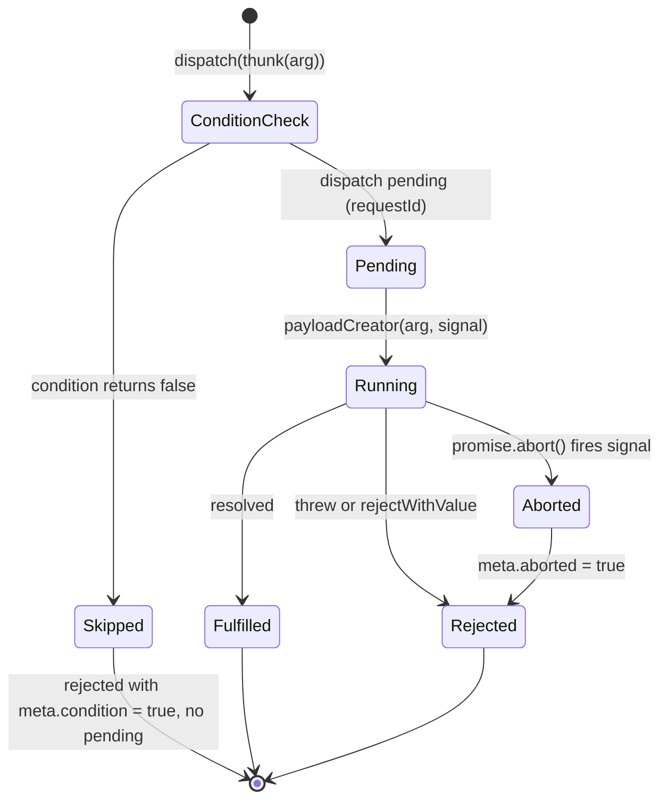
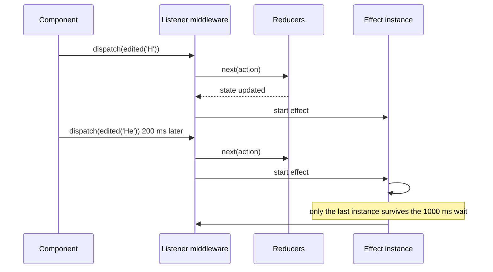

## Bối cảnh & vấn đề

Màn hình báo cáo của một app nội bộ có bộ lọc theo quý. Người dùng bấm Q3, rồi đổi ngay sang Q4 trước khi Q3 tải xong. Request Q4 nhanh hơn (dữ liệu ít hơn), về trước; request Q3 về sau và **ghi đè** kết quả. Màn hình hiển thị nhãn "Q4" nhưng số liệu của Q3. Một tuần sau, bug khác: người dùng rời màn hình báo cáo sang màn hình tổng quan, request báo cáo về muộn và set `loading: false` trong slice mà màn hình tổng quan cũng đang dùng, spinner biến mất trước khi dữ liệu tổng quan tải xong.

Cả hai lỗi đều là lỗi **side effect**: code bất đồng bộ tác động vào store mà không kiểm soát thứ tự và vòng đời. Reducer phải thuần và đồng bộ (xem [Redux Toolkit core](/tracks/state-management/learn/redux-toolkit-core)), nên mọi thứ "bẩn" (fetch, timer, WebSocket, localStorage, analytics) phải sống ở chỗ khác. Redux có câu trả lời chính thức: **middleware**. Câu hỏi thật là chọn loại middleware nào cho loại side effect nào, và cách huỷ, dedupe, chống race.

Bài này đi qua bốn lựa chọn trong hệ sinh thái Redux: `createAsyncThunk`, listener middleware, RTK Query và redux-saga; các cơ chế huỷ và chống race; rồi áp dụng vào bài toán senior hay gặp: migrate một app mà mọi response API đều được lưu vào Redux bằng thunk.

**Interview angle:** "side effect nên sống ở đâu?" là câu so sánh medium; câu trả lời tốt phân loại theo **loại việc**: data fetching → RTK Query; một luồng async gắn với một hành động → thunk; phản ứng với action → listener.

## Khái niệm

### Middleware

**Middleware** là hàm bọc quanh `dispatch`, có dạng `store => next => action => ...`. Nó thấy mọi action **trước** reducer, có thể chặn, biến đổi, trì hoãn, dispatch thêm action, hoặc chạy side effect rồi gọi `next(action)` để chuyển tiếp. Vì middleware có `getState` và `dispatch`, nó là nơi tự nhiên cho logic "khi X xảy ra thì làm Y".

Mọi công cụ side effect của Redux đều là middleware: `redux-thunk` (cho phép dispatch function), listener middleware, RTK Query middleware, redux-saga. Điểm khác nhau là **mô hình lập trình** chúng đưa cho bạn.

```ts
const logger: Middleware = (api) => (next) => (action) => {
  const result = next(action);
  console.log(action.type, api.getState());
  return result;
};
```

**Interview angle:** viết được signature middleware ba tầng và giải thích `next` khác `dispatch` (next đi tiếp trong chuỗi, dispatch bắt đầu lại từ đầu) là điểm cộng.

### Thunk và createAsyncThunk

**Thunk** là function được dispatch thay cho action object: `dispatch((dispatch, getState) => {...})`. Thunk middleware gọi function đó với `dispatch` và `getState`. Đây là cách đơn giản nhất để viết logic async cần truy cập store.

**`createAsyncThunk(type, payloadCreator, options)`** chuẩn hoá một luồng async thành ba action: `type/pending`, `type/fulfilled`, `type/rejected`, mỗi action mang `meta.requestId` (id duy nhất của lần gọi), `meta.arg` (tham số), và với `rejected` thì `meta.aborted`, `meta.condition`. Payload creator nhận `thunkAPI` gồm `dispatch`, `getState`, `signal` (một `AbortSignal`), `rejectWithValue`, `extra`.

Ba tính năng quan trọng thường bị bỏ qua. **`signal`**: truyền vào `fetch(url, { signal })` để request thật sự bị huỷ ở tầng mạng khi thunk bị abort. **`promise.abort()`**: `dispatch(thunk(arg))` trả về một promise có method `abort()`, gọi trong cleanup của `useEffect` khi component unmount hoặc tham số đổi. **`condition`**: hàm chạy **trước** khi thunk bắt đầu; trả `false` thì thunk bị bỏ qua hoàn toàn (không có `pending`), dùng để tránh request trùng khi đang loading hoặc đã có dữ liệu.

```ts
export const fetchReport = createAsyncThunk(
  "report/fetch",
  async (filters: Filters, { signal }) => (await fetch(url(filters), { signal })).json(),
  { condition: (_f, { getState }) => (getState() as RootState).report.status !== "loading" },
);
```

`dispatch(thunk()).unwrap()` biến kết quả thành promise resolve với payload hoặc reject với error, tiện cho `try/catch` trong event handler.

**Interview angle:** câu "component dispatch thunk rồi unmount thì sao?" có đáp án gồm ba ý: thunk vẫn chạy tới hết, `fulfilled` vẫn cập nhật store, và cách huỷ bằng `promise.abort()` + `signal`.

### Chống race bằng requestId

Khi hai lần gọi cùng thunk chạy chồng nhau, kết quả về theo thứ tự **mạng quyết định**, không phải thứ tự bạn gọi. Mẫu chống race chuẩn: reducer `pending` lưu `state.requestId = action.meta.requestId`; reducer `fulfilled`/`rejected` bỏ qua action nếu `action.meta.requestId !== state.requestId`. Chỉ kết quả của request **mới nhất** được ghi. Kết hợp với abort request cũ khi tham số đổi, bạn vừa tiết kiệm băng thông vừa không bao giờ hiển thị dữ liệu cũ.

**Interview angle:** interviewer có thể hỏi "nếu không abort được (API không hỗ trợ), làm sao vẫn đúng?"; requestId là câu trả lời, vì nó không phụ thuộc vào việc huỷ thành công.

### Listener middleware

**`createListenerMiddleware`** cho phép đăng ký "khi action khớp điều kiện thì chạy effect": `startListening({ actionCreator | matcher | predicate, effect })`. Effect chạy **sau khi** reducer đã xử lý action, nhận `listenerApi` với `getState`, `getOriginalState`, `dispatch`, `signal`, và các công cụ điều phối: `cancelActiveListeners()` (huỷ các instance khác của cùng listener đang chạy), `delay(ms)` (chờ, tự ném lỗi nếu bị huỷ), `take(predicate)` (chờ một action khác), `condition(predicate)`, `fork()` (chạy tác vụ con có thể huỷ).

Với các công cụ đó, listener thay thế được phần lớn use case của saga với API dựa trên `async/await` quen thuộc: debounce autosave, "khi `cartUpdated` thì lưu localStorage", "khi `loggedOut` thì đóng socket", "khi người dùng bấm Start thì poll cho tới khi bấm Stop". Listener là cách đúng để phản ứng với action của **slice khác** mà không để hai slice import nhau.

**Interview angle:** câu follow-up "viết autosave 1 giây sau lần sửa cuối bằng listener" có đáp án ba dòng: `cancelActiveListeners()`, `await delay(1000)`, dispatch save.

### Redux-saga

**Redux-saga** dùng generator function (`function*`) và các effect mô tả như `take`, `put`, `call`, `fork`, `race`, `takeLatest`, `debounce`. Vì effect là object mô tả (không thực thi ngay), saga rất dễ test từng bước, và có primitive mạnh cho luồng phức tạp: race giữa hai sự kiện, channel cho event stream, huỷ cả cây task.

Cái giá là đường cong học tập (generator, effect creator, cách debug), bundle thêm, và phần lớn nhu cầu thực tế giờ đã được RTK Query và listener middleware đáp ứng. Redux docs hiện không khuyến nghị saga cho code mới trừ khi thật sự cần các primitive điều phối phức tạp.

**Interview angle:** trả lời "saga mạnh cho race/cancel/channel, nhưng listener + RTK Query đủ cho hầu hết trường hợp" cho thấy bạn cân nhắc chi phí team, không chỉ khả năng kỹ thuật.

### Root reducer reset và action dùng chung

**`createAction`** tạo action creator độc lập với slice, ví dụ `export const loggedOut = createAction('auth/loggedOut')`. Mọi slice có thể lắng nghe nó trong `extraReducers` mà không import nhau. Để reset toàn bộ store khi logout, bọc root reducer: khi gặp `loggedOut`, gọi reducer gốc với `state = undefined`, mọi slice trả về initial state của nó, kể cả slice thêm sau này.

```ts
const rootReducer: typeof appReducer = (state, action) =>
  appReducer(loggedOut.match(action) ? undefined : state, action);
```

**Interview angle:** đây là đáp án gọn cho "hai slice cần phản ứng với `userLoggedOut`" và là một mảnh của câu hỏi logout leak ở bài [SSR và multi-tenant](/tracks/state-management/learn/ssr-security-multitenant).

## Cơ chế hoạt động

Vòng đời của một `createAsyncThunk` với `condition`, `signal` và abort:



Diễn giải. `condition` chạy **đồng bộ** ngay khi dispatch; nếu nó trả `false`, không có action `pending` nào được dispatch, và promise trả về resolve với một action `rejected` có `meta.condition = true` (mặc định action đó không được dispatch vào store, verify option `dispatchConditionRejection`). Nếu đi tiếp, `pending` được dispatch cùng `requestId` mới. Khi gọi `promise.abort()`, `signal` được kích hoạt; nếu payload creator đã truyền `signal` vào `fetch`, request bị huỷ ở tầng mạng; dù payload creator có tôn trọng signal hay không, thunk vẫn kết thúc bằng `rejected` với `meta.aborted = true` và `error.name = 'AbortError'`.

Listener middleware nằm ở vị trí khác trong luồng: nó thấy action **sau** reducer.



Mỗi action khớp tạo một **instance** effect mới. `cancelActiveListeners()` trong instance mới đánh dấu các instance cũ đã bị huỷ, và `delay()` đang chờ trong instance cũ ném lỗi, nên chỉ instance cuối cùng đi tới bước lưu. Đó chính là debounce, viết bằng `async/await` thường.

## Ví dụ thực tế

### Abort, condition, requestId, debounce và reset khi logout

```ts
const fetchReport = createAsyncThunk("report/fetch",
  async (filters: { range: string }, { signal }) => {
    await new Promise<void>((res, rej) => {
      const id = setTimeout(res, 100);                         // simulated network
      signal.addEventListener("abort", () => { clearTimeout(id); rej(new DOMException("Aborted", "AbortError")); });
    });
    return `report for ${filters.range}`;
  },
  { condition: (_f, { getState }) => (getState() as any).report.status !== "loading" },
);
const loggedOut = createAction("auth/loggedOut");
const report = createSlice({
  name: "report",
  initialState: { status: "idle", data: null as string | null, requestId: null as string | null },
  reducers: {},
  extraReducers: (b) => b
    .addCase(fetchReport.pending,   (s, a) => { s.status = "loading"; s.requestId = a.meta.requestId; })
    .addCase(fetchReport.fulfilled, (s, a) => { if (a.meta.requestId !== s.requestId) return; s.status = "idle"; s.data = a.payload; })
    .addCase(fetchReport.rejected,  (s, a) => { if (a.meta.requestId !== s.requestId) return; s.status = a.meta.aborted ? "idle" : "failed"; }),
});
const draft = createSlice({ name: "draft", initialState: { text: "", savedAt: null as string | null },
  reducers: { edited(s, a: PayloadAction<string>) { s.text = a.payload; }, saved(s, a: PayloadAction<string>) { s.savedAt = a.payload; } } });

const listener = createListenerMiddleware();
let saves = 0;
listener.startListening({
  actionCreator: draft.actions.edited,
  effect: async (_action, api) => {
    api.cancelActiveListeners();
    await api.delay(1000);
    saves++;
    console.log(`${ms()} autosave #${saves}: "${(api.getState() as any).draft.text}"`);
    api.dispatch(draft.actions.saved(`t+${Date.now() - t0}`));
  },
});
const appReducer = combineReducers({ report: report.reducer, draft: draft.reducer });
const rootReducer: typeof appReducer = (state, action) => appReducer(loggedOut.match(action) ? undefined : state, action);
const store = configureStore({ reducer: rootReducer, middleware: (g) => g().prepend(listener.middleware) });

const p = store.dispatch(fetchReport({ range: "Q3" }));
const dup = store.dispatch(fetchReport({ range: "Q3" }));   // condition -> skipped
await sleep(20);
p.abort();                                                   // what an effect cleanup does on unmount
const r1 = await p; const r2 = await dup;
console.log(`${ms()} aborted: type=${r1.type} aborted=${r1.meta.aborted} error=${r1.error?.name}`);
console.log(`${ms()} duplicate: type=${r2.type} condition=${r2.meta.condition}`);
console.log(`${ms()} state:`, JSON.stringify(store.getState().report));
console.log(`${ms()} unwrap ->`, await store.dispatch(fetchReport({ range: "Q4" })).unwrap());

for (const t of ["H", "He", "Hel", "Hell", "Hello"]) { store.dispatch(draft.actions.edited(t)); await sleep(200); }
await sleep(1100);
console.log(`${ms()} saves: ${saves}`);
store.dispatch(loggedOut());
console.log(`${ms()} after logout:`, JSON.stringify(store.getState()));
```

Output thật (Node 24, `@reduxjs/toolkit` 2.13.0; `requestId` là chuỗi ngẫu nhiên, khác mỗi lần chạy):

```text
  25ms aborted: type=report/fetch/rejected aborted=true error=AbortError
  25ms duplicate: type=report/fetch/rejected condition=true
  25ms state: {"status":"idle","data":null,"requestId":"IXJXI4cTfizKVWkPSxjue"}
 126ms unwrap -> report for Q4
1935ms autosave #1: "Hello"
2235ms saves: 1
2236ms after logout: {"report":{"status":"idle","data":null,"requestId":null},"draft":{"text":"","savedAt":null}}
```

Đọc output. Lần dispatch thứ hai bị **`condition`** chặn vì lần đầu đang `loading`: kết quả là `rejected` với `condition=true` và không hề có `pending`. Lần đầu bị abort ở 20 ms, kết thúc bằng `rejected` với `aborted=true`, `error.name = AbortError`, và reducer đưa status về `idle` (không phải `failed`, vì huỷ không phải lỗi người dùng cần thấy). `unwrap()` trả thẳng payload. Năm lần sửa cách nhau 200 ms chỉ tạo **một** lần autosave, 1 giây sau lần sửa cuối, với nội dung cuối cùng. Cuối cùng, `loggedOut` qua root reducer đưa **mọi** slice về initial state.

Trong component, abort gắn vào cleanup của effect:

```ts
useEffect(() => {
  const promise = dispatch(fetchReport(filters));
  return () => promise.abort();   // unmount or filters changed
}, [dispatch, filters]);
```

Chú ý StrictMode ở dev mount → unmount → mount lại, nên bạn sẽ thấy một request bị abort ngay lập tức trong Network tab. Đó là hành vi mong đợi, không phải bug.

### Kế hoạch migrate "mọi response vào Redux"

Bối cảnh: 40 slice, mỗi slice có `data`, `loading`, `error`, thunk fetch tự viết, không có cache, không dedupe. Kế hoạch theo kiểu **strangler** (thay từng phần, hệ thống cũ và mới chạy song song):

1. **Kiểm kê**: phân loại mỗi slice là server state hay client state thật. Thường 80% là server state. Ghi lại màn hình nào đọc slice nào (grep selector).
2. **Chọn đích**: đã dùng Redux nặng thì **RTK Query** (cache nằm trong store, DevTools quen thuộc, không đổi mental model); nếu muốn tách hẳn server state khỏi Redux thì TanStack Query. Tiêu chí chi tiết ở bài [RTK Query](/tracks/state-management/learn/rtk-query).
3. **Guardrails trước**: lint rule cấm thêm `createAsyncThunk` gọi API mới; convention đặt tên tag/query key; một API slice gốc dùng `injectEndpoints` theo feature.
4. **Migrate từng endpoint**: feature mới dùng ngay hook sinh ra; endpoint cũ chuyển khi có việc chạm vào. Nếu nhiều nơi còn đọc selector cũ, viết selector adapter tạm đọc từ `api.endpoints.x.select()` để component cũ không phải đổi cùng lúc.
5. **Xoá slice cũ** khi không còn reader. Không bao giờ để cùng một dữ liệu tồn tại ở cả slice cũ và cache mới quá một release, vì đó là hai nguồn sự thật.
6. **Đo**: số dòng code bị xoá, số request trùng trên màn hình chính (trước/sau), số bug "stale data" mỗi quý, thời gian implement một màn hình CRUD mới.

Để thuyết phục team trước khi có lợi ích người dùng thấy được, mang **số liệu**: đếm dòng code loading/error lặp lại, đưa ra Network tab của một màn hình gọi cùng endpoint nhiều lần, và làm một màn hình pilot để so sánh.

**Interview angle:** câu senior này chấm khả năng lập kế hoạch có rủi ro thấp: incremental, có guardrail, có metric, và có chiến lược cho giai đoạn chuyển tiếp.

## Trade-offs & lựa chọn thay thế

| Công cụ | Mô hình | Mạnh | Yếu | Dùng cho |
| --- | --- | --- | --- | --- |
| RTK Query | Khai báo endpoint | Cache, dedupe, tags, polling, hooks sinh sẵn | Chỉ cho data fetching | Mặc định cho server state trong app Redux |
| `createAsyncThunk` | Hàm async + 3 action | Đơn giản, `signal`, `condition`, `unwrap` | Không cache, tự lo race | Một workflow gắn với một hành động (submit, multi-step) |
| Listener middleware | Phản ứng theo action | Debounce, cancel, `take`, `fork`, `async/await` | Logic phân tán nếu lạm dụng | "Khi X xảy ra thì làm Y", cross-slice, autosave |
| redux-saga | Generator + effect | Race, channel, cancel cây task, test từng bước | Học khó, bundle, ít được khuyến nghị cho code mới | Luồng điều phối rất phức tạp đã có sẵn |
| Effect trong component | `useEffect` | Không cần gì thêm | Gắn vào vòng đời UI, khó test, dễ race | Side effect thuần UI (focus, scroll) |

Khi nào chọn cái nào. Dữ liệu từ API: RTK Query trước tiên, vì cache, dedupe và invalidation là thứ thunk không bao giờ có. Hành động của người dùng dẫn tới một chuỗi bước async (submit chuyển tiền: validate → gọi API → đợi OTP → xác nhận): `createAsyncThunk`, với `unwrap()` để component hiển thị lỗi. Phản ứng với sự kiện, đặc biệt khi nhiều slice liên quan hoặc cần debounce/cancel: listener. Saga chỉ khi codebase đã có và nhu cầu điều phối thật sự vượt quá listener. Không đặt side effect trong reducer, và hạn chế đặt trong component nếu logic đó có ý nghĩa nghiệp vụ.

## Edge cases & failure modes

- **`fulfilled` sau khi unmount**: thunk không biết component đã rời đi. Nếu slice dùng chung giữa màn hình, kết quả cũ ghi đè trạng thái màn hình mới. Abort trong cleanup và kiểm tra `requestId`.
- **Abort không huỷ request thật**: nếu payload creator không truyền `signal` vào `fetch`/axios, `abort()` chỉ làm thunk kết thúc sớm bằng `rejected`; request vẫn chạy tới server. Với mutation (POST chuyển tiền), abort phía client **không** đảm bảo server không xử lý; cần idempotency key.
- **`condition` dựa trên state chưa cập nhật**: `condition` chạy đồng bộ lúc dispatch; nếu hai dispatch xảy ra trước khi `pending` của lần đầu được reduce (thực tế `pending` dispatch đồng bộ nên thường ổn), logic phải dựa trên field được set trong `pending`.
- **Listener vòng lặp**: effect lắng nghe `cartUpdated` rồi dispatch `cartUpdated` tạo vòng lặp vô hạn. Dispatch action khác loại hoặc dùng predicate chặt.
- **Listener lỗi nuốt im lặng**: lỗi trong effect được báo qua `onError` của middleware (mặc định log console), không làm crash app nhưng cũng dễ bị bỏ qua. Cấu hình `onError` gửi lên error tracking.
- **Thunk retry bão**: tự viết retry trong thunk không có backoff và không giới hạn, khi server 503 thì mọi client dồn retry. Dùng RTK Query `retry` hoặc backoff có jitter.
- **Tách logout reset theo từng slice**: slice mới thêm quên `extraReducers` cho `loggedOut`, dữ liệu user trước còn lại. Reset ở root reducer.

## Pitfalls

- ❌ Fetch trong `useEffect` rồi `dispatch(setData())` → ✅ RTK Query hoặc ít nhất `createAsyncThunk` có abort, vì effect trần không có dedupe, cache hay chống race.
- ❌ Bỏ qua `signal` trong payload creator → ✅ truyền `signal` vào `fetch`, để abort thật sự huỷ request.
- ❌ Ghi kết quả mọi request vào state → ✅ so `meta.requestId` với request mới nhất, vì thứ tự response do mạng quyết định.
- ❌ Dùng saga cho mọi side effect trong code mới → ✅ RTK Query cho fetch, listener cho phản ứng theo action, saga chỉ khi thật sự cần.
- ❌ Slice A import action của slice B để reset → ✅ `createAction` dùng chung và `extraReducers`, hoặc reset ở root reducer.
- ❌ Migrate "big bang" 40 slice trong một PR → ✅ strangler theo endpoint, guardrail lint, xoá slice cũ khi không còn reader.
- ❌ Coi abort phía client là "huỷ giao dịch" → ✅ idempotency key và trạng thái xác nhận từ server.

## Tóm tắt

- Side effect sống trong **middleware**; reducer thuần và đồng bộ.
- **`createAsyncThunk`**: pending/fulfilled/rejected, `signal` cho abort thật, `promise.abort()` trong cleanup, `condition` để bỏ qua request trùng, `unwrap()` cho handler.
- Chống race bằng **`meta.requestId`**: chỉ ghi kết quả của request mới nhất.
- **Listener middleware** chạy sau reducer; `cancelActiveListeners` + `delay` là debounce; thay thế nhẹ cho saga.
- **Saga** mạnh cho race/channel nhưng ít được khuyến nghị cho code mới; RTK Query là mặc định cho data fetching.
- Reset khi logout bằng **root reducer** nhận `state = undefined`, action dùng chung bằng `createAction`.
- Migrate từ thunk-fetch theo kiểu **strangler**, có guardrail và metric.
