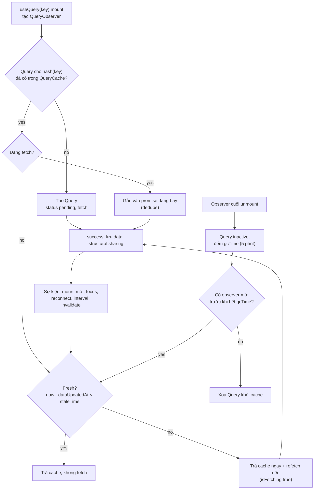

## Bối cảnh & vấn đề

Một team vừa chuyển từ "fetch trong `useEffect` + Redux" sang TanStack Query. Tuần đầu, hai loại phàn nàn xuất hiện cùng lúc và trông mâu thuẫn nhau. Loại thứ nhất: "App gọi API liên tục, mỗi lần tôi chuyển tab trình duyệt rồi quay lại là Network tab lại có request mới." Loại thứ hai, tệ hơn nhiều: "Tôi đổi filter từ `paid` sang `open`, danh sách vẫn là đơn `paid`." Và một ticket bảo mật: "Sau khi đổi tenant ở header, tôi thấy đơn hàng của tenant trước trong vài giây."

Loại thứ nhất là **hành vi mặc định** được thiết kế có chủ ý: `staleTime: 0` và `refetchOnWindowFocus: true`. Loại thứ hai và ticket bảo mật là cùng một bug: **query key thiếu biến**. Cả hai chỉ có thể hiểu đúng khi bạn nắm mô hình bên trong của TanStack Query: một **cache** các query định danh bằng key, mỗi query có trạng thái fresh/stale, được quan sát bởi các component (observer), và bị dọn khi không còn ai quan sát.

Bài này mô tả mô hình đó bằng chính thư viện chạy thật trong Node (`@tanstack/query-core` 5.104, cùng lõi mà `@tanstack/react-query` dùng). Mutation và invalidation ở bài [mutation và invalidation](/tracks/state-management/learn/mutations-invalidation); SSR và hydration ở bài [SSR và multi-tenant](/tracks/state-management/learn/ssr-security-multitenant). Vì sao server state cần thư viện riêng đã được giải thích ở bài [phân loại state](/tracks/state-management/learn/state-taxonomy).

**Interview angle:** câu "`staleTime` và `gcTime` là gì, mặc định bao nhiêu" là câu easy xuất hiện ở gần như mọi buổi phỏng vấn frontend có React Query; follow-up luôn là "user phàn nàn app gọi API mỗi lần chuyển tab".

## Khái niệm

### QueryClient, QueryCache, Query và Observer

**`QueryClient`** là đối tượng trung tâm, giữ một **`QueryCache`**: một map từ **query hash** (chuỗi được tạo từ query key) tới một **`Query`**. Mỗi `Query` giữ dữ liệu, lỗi, thời điểm cập nhật, và trạng thái fetch của một tài nguyên. Mỗi component gọi `useQuery` tạo một **`QueryObserver`** đăng ký vào `Query` tương ứng; observer tính ra object kết quả (`data`, `status`, `isFetching`...) và báo component render khi kết quả đổi.

Nhờ tách Query khỏi Observer, mười component dùng cùng key chỉ có **một** Query và **một** request, dù có mười observer. Query có observer gọi là **active**; không còn observer thì là **inactive**, và đồng hồ `gcTime` bắt đầu đếm.

`QueryClientProvider` gọi `queryClient.mount()`, bước này đăng ký lắng nghe sự kiện focus và online của trình duyệt. Không mount thì refetch khi focus không xảy ra; đây cũng là lý do bạn cần provider chứ không chỉ tạo `new QueryClient()`.

**Interview angle:** giải thích được "một Query, nhiều Observer" là nền để trả lời câu dedupe và câu "vì sao 6 request trùng".

### Query key

**Query key** là một mảng serializable định danh cache entry: `['orders', { status: 'paid', page: 1 }]`, `['order', 42]`. TanStack Query hash key bằng `JSON.stringify` có sắp xếp key của object, nên **thứ tự thuộc tính trong object không quan trọng**, nhưng **thứ tự phần tử mảng có quan trọng**: `['orders', 'paid', 1]` khác `['orders', 1, 'paid']`.

Quy tắc số một: **mọi biến mà `queryFn` dùng phải nằm trong key**. Key là "dependency array" của query. Nếu `queryFn` dùng `status` mà key không có, hai lời gọi với status khác nhau dùng chung một cache entry, và khi đổi status, key không đổi nên không có fetch mới. Plugin `@tanstack/eslint-plugin-query` có rule `exhaustive-deps` bắt đúng lỗi này.

Key nên **phân cấp** từ tổng quát tới cụ thể (`['orders', 'list', filters]`, `['orders', 'detail', id]`), vì các API như `invalidateQueries({ queryKey: ['orders'] })` so khớp theo **prefix**. Dùng **query key factory** (object tập trung sinh key) hoặc `queryOptions()` để không ai gõ tay lệch.

```ts
export const orderKeys = {
  all: (tenantId: string) => ["t", tenantId, "orders"] as const,
  lists: (tenantId: string) => [...orderKeys.all(tenantId), "list"] as const,
  list: (tenantId: string, f: Filters) => [...orderKeys.lists(tenantId), f] as const,
  detail: (tenantId: string, id: number) => [...orderKeys.all(tenantId), "detail", id] as const,
};
```

**Interview angle:** interviewer thích hỏi "user đổi tenant và thấy đơn của tenant trước một giây, key sai ở đâu?"; tenant phải là phần đầu của mọi key.

### staleTime: fresh và stale

**`staleTime`** là khoảng thời gian dữ liệu được coi là **fresh** kể từ lần fetch thành công gần nhất. Khi fresh, TanStack Query **không** refetch khi có component mới mount, khi focus lại cửa sổ hay khi mạng reconnect; nó chỉ trả cache. Khi hết `staleTime`, dữ liệu thành **stale**: vẫn được hiển thị ngay, nhưng các sự kiện trên sẽ kích hoạt refetch nền.

Mặc định **`staleTime: 0`**: dữ liệu stale ngay sau khi về. Lựa chọn này ưu tiên tính đúng: nếu bạn không nói gì, thư viện giả định dữ liệu có thể đã đổi và refetch ở mọi cơ hội. Đó là nguồn của phàn nàn "gọi API mỗi lần chuyển tab". Cách chỉnh đúng là đặt `staleTime` theo **loại dữ liệu**: danh mục sản phẩm vài phút, cấu hình tenant hàng giờ (hoặc `Infinity` nếu chỉ đổi khi bạn invalidate), giá và tồn kho vài giây hoặc 0.

**Interview angle:** nói rõ "stale không có nghĩa là bị xoá; stale vẫn hiển thị, chỉ là đủ điều kiện refetch" giúp phân biệt với `gcTime`.

### gcTime: dọn cache khi không còn ai dùng

**`gcTime`** (garbage collection time, ở v4 tên là `cacheTime`) là thời gian một query **inactive** (không còn observer) được giữ trong cache trước khi bị xoá. Mặc định **5 phút** trên client. Nếu người dùng quay lại màn hình trong 5 phút, dữ liệu cũ hiển thị ngay (kèm refetch nền nếu stale); quá 5 phút thì bắt đầu từ trạng thái `pending`.

`staleTime` và `gcTime` **độc lập**: một query có thể stale nhưng vẫn trong cache (trường hợp phổ biến nhất), hoặc fresh và active. Trên server (không có `window`), `gcTime` mặc định là `Infinity` để tránh timer rò rỉ trong SSR, và bạn nên tạo QueryClient mới cho mỗi request (verify).

**Interview angle:** lỗi thường gặp là đặt `gcTime` nhỏ hơn `staleTime` rồi thắc mắc vì sao cache "mất"; `gcTime` chỉ đếm khi inactive.

### Status flags: isPending, isFetching, isLoading

TanStack Query v5 có hai trục trạng thái độc lập. **`status`** trả lời "có dữ liệu chưa": `pending` (chưa có data), `success`, `error`. **`fetchStatus`** trả lời "có đang gọi `queryFn` không": `fetching`, `paused` (muốn fetch nhưng offline), `idle`. Các boolean suy ra từ đó: `isPending = status === 'pending'`, `isFetching = fetchStatus === 'fetching'`, và **`isLoading = isPending && isFetching`** (lần tải đầu tiên thật sự). Ở v4, `isLoading` mang nghĩa của `isPending` hiện nay; v5 đổi tên (verify khi đọc code cũ).

Hệ quả cho UI: dùng `isPending` để hiện skeleton (chưa có gì để hiển thị), dùng `isFetching` để hiện một chỉ báo nhỏ "đang làm mới" trong khi vẫn hiển thị dữ liệu cũ. Nhầm hai cái này là nguyên nhân của spinner nhấp nháy mỗi lần refetch nền.

**Interview angle:** câu hỏi medium: "`isLoading` khác `isFetching` thế nào?"; nêu công thức `isPending && isFetching`.

### placeholderData và initialData

Khi đổi trang (`page: 1 → 2`), key đổi, entry mới chưa có data, nên status là `pending` và bảng bị thay bằng spinner, gây nhảy layout. **`placeholderData: keepPreviousData`** (v5 thay option `keepPreviousData: true` của v4) giữ data của key trước để hiển thị trong lúc tải key mới; kết quả có `status: 'success'` và **`isPlaceholderData: true`**, dùng để làm mờ bảng và disable nút Next.

**`placeholderData`** khác **`initialData`** ở chỗ: placeholder **không được ghi vào cache**, chỉ là giá trị hiển thị tạm ở observer; `initialData` **được ghi vào cache** như dữ liệu thật, tuân theo `staleTime` (cùng `initialDataUpdatedAt` để biết nó cũ bao nhiêu). Dùng `initialData` khi bạn có dữ liệu đầy đủ và đáng tin (ví dụ lấy item từ list query cho detail query), dùng `placeholderData` khi dữ liệu chỉ là tạm hoặc không đầy đủ.

**Interview angle:** follow-up "placeholderData khác initialData thế nào về caching và staleness" là câu phân loại ứng viên đọc docs kỹ.

### Retry và refetch mặc định

Trên client, query lỗi được **retry 3 lần** (tổng 4 lần gọi) với delay mặc định `min(1000 × 2^failureCount, 30000)` ms, tức 1 s, 2 s, 4 s. Mutation mặc định **không retry**. Trên server, retry mặc định là 0 để SSR không treo. Query refetch khi stale và có một trong các sự kiện: observer mới mount (`refetchOnMount`), cửa sổ focus (`refetchOnWindowFocus`), mạng reconnect (`refetchOnReconnect`), cộng thêm `refetchInterval` nếu bạn bật.

Nên override khi: lỗi 4xx (401, 403, 404, 422) không bao giờ tự khỏi, nên retry chỉ làm chậm thông báo lỗi 7 giây; dùng `retry: (count, err) => err.status >= 500 && count < 3`. Tắt focus refetch cho màn hình form hoặc màn hình tốn tài nguyên. Bật `refetchInterval` cho dashboard. Trong test, tạo QueryClient với `retry: false` để lỗi hiện ngay.

Với 401 do token hết hạn, đừng để mỗi query tự refresh token: ba query retry ba lần là chín lần gọi refresh song song. Refresh nên nằm ở **API client** (một promise refresh dùng chung, các request chờ nó rồi gửi lại), còn query chỉ thấy kết quả cuối.

**Interview angle:** câu "401 gây ba lần retry và ba lần refresh token thất bại, thiết kế lại thế nào?" chấm việc bạn đặt refresh ở tầng API client, không ở tầng query.

### Structural sharing

Khi refetch trả về dữ liệu mới, TanStack Query so sánh sâu với dữ liệu cũ và **giữ nguyên reference** cho mọi phần không đổi (`replaceEqualDeep`). Nếu response giống hệt, `data` giữ nguyên reference, và component dùng `select` hoặc `memo` không render lại. Đây là lý do refetch nền thường không gây render tốn kém, và là lý do bạn không nên tự clone `data`.

## Cơ chế hoạt động



Diễn giải theo từng nhánh. Khi một component mount, observer tính hash của key và tìm Query. Chưa có thì tạo mới ở trạng thái `pending` và fetch. Đã có và **đang fetch** thì observer chỉ gắn vào promise hiện tại: đây là **dedupe**, lý do hai component mount cùng lúc chỉ tạo một request. Đã có và không fetch thì so tuổi dữ liệu với `staleTime`: fresh thì trả cache; stale thì trả cache **ngay** (người dùng thấy dữ liệu, không thấy spinner) và refetch nền, chính là **stale-while-revalidate**.

Sau khi có dữ liệu, mỗi sự kiện (mount mới, focus, reconnect, interval, invalidate) quay lại bước kiểm tra fresh/stale. Khi observer cuối cùng unmount, Query thành inactive và đồng hồ `gcTime` chạy; có observer mới trước khi hết giờ thì Query sống tiếp, không thì bị xoá. Hai tham số điều khiển hai câu hỏi khác nhau: `staleTime` quyết định **khi nào refetch**, `gcTime` quyết định **khi nào quên**.

## Ví dụ thực tế

### Dedupe, stale-while-revalidate, focus refetch và hashing

Chạy `@tanstack/query-core` trong Node với `environmentManager.setIsServer(() => false)` để có hành vi của trình duyệt, và `focusManager.setFocused()` để giả lập chuyển tab:

```ts
import { QueryClient, QueryObserver, environmentManager, hashKey, focusManager } from "@tanstack/query-core";
environmentManager.setIsServer(() => false); // behave like a browser
let calls = 0;
const fetchOrders = async (status: string) => {
  calls++; console.log(`${ms()}ms  fetch #${calls} status=${status}`);
  await new Promise((r) => setTimeout(r, 50));
  return [{ id: 1, status }];
};
const qc = new QueryClient();
qc.mount(); // QueryClientProvider does this: subscribes to focus/online events
const key = ["orders", { status: "paid", page: 1 }];
const a = new QueryObserver(qc, { queryKey: key, queryFn: () => fetchOrders("paid") });
const b = new QueryObserver(qc, { queryKey: key, queryFn: () => fetchOrders("paid") });
a.subscribe(log("A")); b.subscribe(log("B"));                 // two components mount together
await sleep(100); console.log("calls after 2 concurrent mounts:", calls);
const c = new QueryObserver(qc, { queryKey: key, queryFn: () => fetchOrders("paid") });
c.subscribe(log("C"));                                         // a third component mounts later
await sleep(100); console.log("calls after late mount (staleTime 0):", calls);
focusManager.setFocused(false); focusManager.setFocused(true); // user switches tabs and back
await sleep(100); console.log("calls after focus:", calls);
const d = new QueryObserver(qc, { queryKey: ["catalog"], queryFn: () => fetchOrders("catalog"), staleTime: 60_000 });
d.subscribe(() => {}); await sleep(100);
focusManager.setFocused(false); focusManager.setFocused(true);
await sleep(100); console.log("calls after focus with staleTime 60s on catalog:", calls);
console.log(hashKey(["orders", { status: "paid", page: 1 }]) === hashKey(["orders", { page: 1, status: "paid" }]));
console.log(hashKey(["orders", "paid", 1]) === hashKey(["orders", 1, "paid"]));
```

Output thật (Node 24, query-core 5.104.0; các dòng log observer lặp lại, như của B và của các lần refetch sau, được lược bớt):

```text
   1ms  [A] status=pending fetchStatus=fetching isPending=true isLoading=true isFetching=true data=undefined
   2ms  fetch #1 status=paid
  54ms  [A] status=success fetchStatus=idle isPending=false isLoading=false isFetching=false data=[{"id":1,"status":"paid"}]
calls after 2 concurrent mounts: 1
 103ms  [A] status=success fetchStatus=fetching isPending=false isLoading=false isFetching=true data=[{"id":1,"status":"paid"}]
 103ms  [C] status=success fetchStatus=fetching isPending=false isLoading=false isFetching=true data=[{"id":1,"status":"paid"}]
 103ms  fetch #2 status=paid
 154ms  [C] status=success fetchStatus=idle isPending=false isLoading=false isFetching=false data=[{"id":1,"status":"paid"}]
calls after late mount (staleTime 0): 2
 204ms  fetch #3 status=paid
calls after focus: 3
 305ms  fetch #4 status=catalog
 406ms  fetch #5 status=paid
calls after focus with staleTime 60s on catalog: 5
true
false
```

Đọc output. Hai observer mount cùng lúc chỉ tạo **1** request (dedupe). Lần tải đầu có `isLoading=true` vì vừa `pending` vừa `fetching`. Component C mount sau khi dữ liệu đã về: vì `staleTime: 0`, dữ liệu đã stale, nên C **nhận data ngay** (`status=success`) trong khi request #2 chạy nền (`isFetching=true`, `isLoading=false`); chú ý observer A cũng thấy `isFetching=true`, vì trạng thái fetch thuộc về Query, không thuộc observer. Focus tạo request #3 cho `orders`. Lần focus thứ hai chỉ refetch `orders` (#5), còn `catalog` với `staleTime: 60s` vẫn fresh nên không bị gọi lại (#4 là lần tải đầu của nó). Cuối cùng, hai key chỉ khác thứ tự thuộc tính object có cùng hash, còn đổi thứ tự phần tử mảng cho hash khác.

### Retry có backoff, predicate bỏ qua 4xx, và gcTime

```ts
const failing = new QueryObserver(qc, { queryKey: ["flaky"],
  queryFn: async () => { attempts++; console.log(`attempt ${attempts} at ${secs()}s`); throw Object.assign(new Error("503"), { status: 503 }); } });
// ... wait for status "error"
const noRetry4xx = new QueryObserver(qc, { queryKey: ["me"],
  retry: (count, err: any) => err.status >= 500 && count < 3,
  queryFn: async () => { attempts++; throw Object.assign(new Error("401"), { status: 401 }); } });
// ...
const short = new QueryObserver(qc, { queryKey: ["short"], queryFn: async () => "x", gcTime: 200 });
const u = short.subscribe(() => {}); await sleep(20); u();
console.log("inactive, still cached:", qc.getQueryData(["short"]));
await sleep(250);
console.log("after gcTime:", qc.getQueryData(["short"]), "entry exists:", !!qc.getQueryCache().find({ queryKey: ["short"] }));
```

Output thật:

```text
attempt 1 at 0s
attempt 2 at 1s
attempt 3 at 3s
attempt 4 at 7s
error after 4 attempts, failureCount=4
401: gave up after 1 attempt(s)
inactive, still cached: x
after gcTime: undefined entry exists: false
```

"Retry 3 lần" nghĩa là **4 lần gọi**, cách nhau 1 s, 2 s, 4 s: người dùng chờ **7 giây** mới thấy lỗi. Với 401, predicate dừng ngay sau lần đầu. Query inactive vẫn còn trong cache cho tới khi hết `gcTime`, rồi biến mất hoàn toàn.

### Debug: kết quả filter của người khác sau khi back

```ts
export function useOrders(filters: { status: string; page: number }) {
  const { tenantId } = useTenant();
  return useQuery({
    queryKey: ["orders", filters.page],
    queryFn: () => api.get("/orders", { params: { ...filters, tenantId } }),
    staleTime: 5 * 60_000,
  });
}
```

Tái hiện bằng query-core, gọi lần lượt với `acme/paid` rồi `globex/open`, cùng `page: 1`:

```text
acme paid  : acme/paid/p1#1
globex open: acme/paid/p1#1 <- wrong tenant, no fetch
requests: [ 'acme/paid/p1' ]
```

Key chỉ có `page`, nên cả hai lời gọi trỏ vào cùng entry `['orders', 1]`. Với `staleTime` 5 phút, entry vẫn fresh, TanStack Query trả cache ngay và **không fetch**: người dùng tenant `globex` thấy đơn của `acme`. Sửa: `queryKey: orderKeys.list(tenantId, filters)`, bật rule `exhaustive-deps`, và khi đổi tenant thì dọn cache của tenant cũ. Quan trọng không kém: server phải lấy tenant từ **token/session**, không tin `tenantId` do client gửi; tham số đó sửa được cache nhưng là một lỗ hổng IDOR tiềm tàng.

### Chẩn đoán dashboard gọi 40 request, 6 lần cùng endpoint

Quy trình, theo thứ tự rẻ tới đắt:

1. **Network tab + React Query Devtools**: cùng URL nhưng devtools hiện **nhiều key khác nhau** → key không ổn định (một `new Date()` hay object filter tạo khác nhau trong key, ví dụ `['stats', { from: new Date() }]` đổi mỗi render). Sửa bằng key factory và giá trị chuẩn hoá (ISO date đã làm tròn).
2. **Một key nhưng nhiều request cách nhau vài trăm ms**: các widget mount lệch thời điểm với `staleTime: 0`, mỗi mount là một refetch. Đặt `staleTime` hợp lý (30–60 s cho dashboard).
3. **Request không đi qua cache**: widget cũ vẫn fetch trong `useEffect`. Chuyển sang `useQuery` với cùng key.
4. **Chỉ ở dev**: StrictMode mount hai lần; kiểm tra trên production build trước khi kết luận.
5. **Fan-out thật sự**: 40 widget cần 40 tài nguyên khác nhau. Cân nhắc endpoint gộp (BFF) hoặc prefetch ở route/server; đổi lại, một endpoint gộp làm cache kém chi tiết và một widget chậm kéo cả dashboard.

Sau khi sửa, đo lại: số request lúc load, thời gian tới khi dữ liệu đầy đủ, và số refetch mỗi phút khi màn hình mở.

## Trade-offs & lựa chọn thay thế

| Cấu hình | Lợi | Hại | Hợp với |
| --- | --- | --- | --- |
| `staleTime: 0` (mặc định) | Luôn cố lấy dữ liệu mới nhất | Nhiều request, cảm giác "gọi API liên tục" | Dữ liệu đổi liên tục, lúc mới bắt đầu |
| `staleTime` 30 s – 5 phút | Ít request, điều hướng tức thì | Có thể thấy dữ liệu cũ tới khi hết hạn | Danh sách, dashboard, catalog |
| `staleTime: Infinity` + invalidate | Request tối thiểu, bạn toàn quyền | Quên invalidate là dữ liệu cũ mãi | Cấu hình, danh mục tĩnh, dữ liệu có socket đẩy |
| `gcTime` dài | Quay lại màn hình thấy dữ liệu ngay | Tốn bộ nhớ | Màn hình hay quay lại |
| `gcTime` ngắn | Ít bộ nhớ, ít dữ liệu nhạy cảm tồn đọng | Hay thấy trạng thái `pending` | Dữ liệu lớn, dữ liệu nhạy cảm |
| `retry` mặc định 3 | Chịu được lỗi mạng thoáng qua | Lỗi 4xx hiện chậm 7 s | Lỗi 5xx, mạng yếu |
| `retry` theo predicate | Lỗi rõ ràng hiện ngay | Thêm code | Mọi app có auth |

Khi nào chọn cái nào. Đặt `staleTime` mặc định toàn app ở mức hợp lý (ví dụ 30–60 s), rồi override theo query cho dữ liệu nhạy thời gian. Giữ `gcTime` mặc định trừ khi có lý do đo được. Luôn cấu hình retry bỏ qua 4xx. Với dữ liệu có kênh realtime đẩy cập nhật, `staleTime` cao và patch cache từ socket hiệu quả hơn refetch (xem bài [real-time](/tracks/state-management/learn/realtime-sync-offline)).

## Edge cases & failure modes

- **Key chứa giá trị không ổn định**: `new Date()`, `Math.random()`, object class, hàm trong key làm mỗi render là một query mới; cache không bao giờ trúng và request tăng vô hạn theo render.
- **Key thiếu biến**: dữ liệu sai tham số, sai tenant, sai user; nguy hiểm nhất khi `staleTime` cao vì không có refetch nào sửa lại.
- **Offline**: với `networkMode: 'online'` (mặc định), query không fetch khi offline mà chuyển `fetchStatus: 'paused'`, status vẫn `pending` nếu chưa có data. UI chỉ dựa vào `isLoading` sẽ không hiện spinner cũng không hiện lỗi; hiển thị trạng thái offline riêng.
- **Refetch focus trên form**: màn hình edit dựa trên `data` làm giá trị input; focus refetch trả dữ liệu mới và ghi đè thứ người dùng đang gõ nếu form đọc thẳng từ `data`. Khởi tạo draft một lần, hoặc tắt `refetchOnWindowFocus` cho query đó.
- **Retry che giấu sự cố**: 4 lần gọi mỗi query × 20 query trên một trang khi backend sập = 80 request dồn vào backend đang chết. Backoff giúp, nhưng cân nhắc circuit breaker hoặc giảm retry khi phát hiện lỗi hàng loạt.
- **Dữ liệu SSR stale ngay**: hydrate dữ liệu từ server với `staleTime: 0` thì client refetch ngay sau mount, tức gọi API hai lần cho cùng dữ liệu; đặt `staleTime` > 0 khi dùng SSR.
- **`select` trả object mới**: `select: (d) => d.filter(...)` chạy lại khi data đổi; nếu hàm `select` là inline và đắt, ổn định nó bằng `useCallback` hoặc định nghĩa ngoài component.

## Pitfalls

- ❌ Key thiếu biến mà `queryFn` dùng (`['orders', page]`) → ✅ `orderKeys.list(tenantId, filters)` + rule `exhaustive-deps`, vì cache trả nhầm dữ liệu và không refetch.
- ❌ Tắt `refetchOnWindowFocus` toàn app vì "gọi API nhiều quá" → ✅ đặt `staleTime` hợp lý, vì focus refetch chỉ chạy khi dữ liệu stale.
- ❌ Hiện spinner theo `isFetching` → ✅ skeleton theo `isPending`, chỉ báo nhỏ theo `isFetching`, để refetch nền không làm nhấp nháy.
- ❌ Dùng `initialData` với dữ liệu tạm → ✅ `placeholderData`, vì `initialData` được ghi vào cache như dữ liệu thật.
- ❌ Để retry mặc định cho 401/403/404 → ✅ predicate chỉ retry 5xx và lỗi mạng.
- ❌ Refresh token trong từng query → ✅ refresh một lần ở API client, request khác chờ promise refresh.
- ❌ Đặt `new Date()` vào key → ✅ giá trị chuẩn hoá (ngày ISO, làm tròn phút).

## Tóm tắt

- Một **Query** mỗi key hash, nhiều **Observer**; request đồng thời cùng key được **dedupe**.
- Key là mảng serializable, **chứa mọi biến queryFn dùng**, phân cấp để invalidate theo prefix; thứ tự thuộc tính object không quan trọng, thứ tự mảng có.
- **`staleTime`** (mặc định 0) quyết định khi nào refetch; **`gcTime`** (mặc định 5 phút, server `Infinity`) quyết định khi nào xoá query inactive.
- Stale vẫn hiển thị ngay, refetch nền khi mount, focus, reconnect, interval, invalidate.
- `isPending` = chưa có data, `isFetching` = đang gọi, `isLoading = isPending && isFetching`.
- `placeholderData: keepPreviousData` chống nhảy khi phân trang (`isPlaceholderData`); `initialData` được ghi vào cache.
- Client retry 3 lần (4 lần gọi, backoff 1/2/4 s), mutation không retry; bỏ retry cho 4xx.
