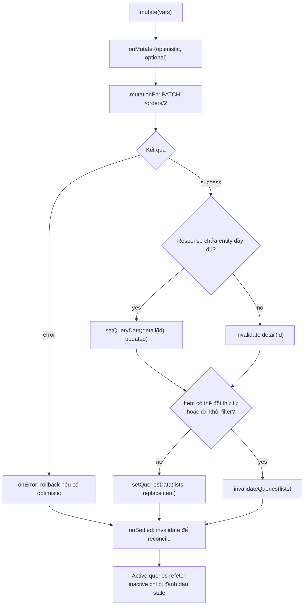

## Bối cảnh & vấn đề

Trang quản lý đơn có ba view cùng dữ liệu: danh sách "Tất cả", danh sách "Đang mở" và panel chi tiết. Người dùng bấm "Thanh toán" cho đơn #2 trong panel chi tiết. API trả `200` kèm đơn đã cập nhật. Panel vẫn ghi "open". Danh sách "Đang mở" vẫn còn đơn #2. Người dùng bấm lại, API trả `409 Already paid`, và support nhận ticket "hệ thống trừ tiền hai lần?".

Code mutation chỉ thiếu một bước: **nói cho cache biết** dữ liệu đã đổi. TanStack Query không biết `PATCH /orders/2` liên quan tới `['orders', 'list', { status: 'open' }]`; nó cache theo query, không theo entity, và không normalize (khác với entity adapter ở bài [Redux Toolkit core](/tracks/state-management/learn/redux-toolkit-core)). Sau mỗi mutation, bạn phải chọn: đánh dấu stale để refetch, ghi thẳng response vào cache, hay xoá. Chọn sai thì hoặc dữ liệu cũ, hoặc một cơn mưa request.

Bài này đi qua `useMutation`, năm API thao tác cache sau mutation và khi nào dùng từng cái, cách giữ list/detail nhất quán mà không refetch mọi thứ, infinite query, và cuối cùng là bài toán rộng hơn: khi một retailer đổi giá mà khách vẫn thấy giá cũ, dữ liệu cũ đang nằm ở tầng cache nào. Nền tảng về query key và `staleTime` ở bài [TanStack Query cache](/tracks/state-management/learn/tanstack-query-cache).

**Interview angle:** câu so sánh `invalidateQueries` vs `refetchQueries` vs `setQueryData` vs `resetQueries` là câu medium tách ứng viên đã dùng thật với ứng viên chỉ biết `invalidateQueries`.

## Khái niệm

### useMutation và thứ tự callback

**Mutation** là thao tác ghi (POST/PUT/PATCH/DELETE) hoặc bất kỳ side effect nào lên server. `useMutation({ mutationFn, onMutate, onSuccess, onError, onSettled })` trả về `mutate`/`mutateAsync` và trạng thái `isPending`, `isError`, `data`, `variables`. Khác với query, mutation **không** chạy tự động, **không** dedupe, **không** cache kết quả theo key, và mặc định **không retry** (retry một POST không idempotent có thể tạo hai đơn).

Thứ tự callback: `onMutate` (trước khi gọi API, nơi làm optimistic update) → `mutationFn` → `onSuccess` hoặc `onError` → `onSettled` (luôn chạy). Nếu callback trả về promise, mutation **chờ** promise đó; `onSettled: () => qc.invalidateQueries(...)` với `return` làm `isPending` giữ `true` cho tới khi refetch xong, nên UI không nhấp nháy giữa "đã lưu" và "dữ liệu mới". Callback khai báo trong `useMutation` luôn chạy; callback truyền vào `mutate(vars, { onSuccess })` chỉ chạy nếu component còn mount và chỉ cho lần gọi cuối.

```ts
const pay = useMutation({
  mutationFn: (id: number) => api.pay(id),
  onSuccess: (updated) => qc.setQueryData(orderKeys.detail(updated.id), updated),
  onSettled: () => qc.invalidateQueries({ queryKey: orderKeys.lists() }), // returned promise is awaited
});
```

**Interview angle:** biết "return promise trong `onSettled` để giữ `isPending`" và "mutation không retry mặc định vì idempotency" là hai điểm cộng nhỏ nhưng thực chiến.

### invalidateQueries

**`invalidateQueries(filters)`** đánh dấu mọi query khớp filter là **stale**, rồi **refetch ngay** những query đang **active** (có observer); query inactive chỉ bị đánh dấu, và sẽ refetch khi có component dùng lại. Filter mặc định khớp theo **prefix** của key (`exact: true` để khớp chính xác), và có thêm `type: 'active' | 'inactive' | 'all'`, `predicate`, `refetchType`.

Đây là lựa chọn mặc định an toàn sau mutation: bạn không cần biết shape dữ liệu, không cần biết item có còn thuộc filter hay không; server là nguồn sự thật và trả về đúng kết quả. Cái giá là một round-trip cho mỗi query active khớp filter.

**Interview angle:** câu hay bị trả lời sai: "invalidate có refetch query inactive không?"; không, chỉ đánh dấu stale.

### refetchQueries

**`refetchQueries(filters)`** fetch **ngay** mọi query khớp filter, bất kể fresh hay stale, và mặc định `type: 'all'` nên **cả query inactive** cũng bị gọi lại. Nó ít khi là lựa chọn đúng sau mutation: nó tốn request cho những màn hình người dùng không xem. Dùng khi bạn cần dữ liệu mới ngay lập tức vì một lý do ngoài luồng (ví dụ nút "Làm mới" thủ công) và biết rõ phạm vi.

**Interview angle:** phân biệt "invalidate = stale + refetch active" với "refetch = fetch ngay, kể cả inactive".

### setQueryData và setQueriesData

**`setQueryData(key, updater)`** ghi tay vào cache của một key, không có request. Hợp nhất khi server trả về **entity đã cập nhật** trong response của mutation: ghi response vào detail query là miễn phí và chính xác. Updater phải trả về dữ liệu **mới** (immutable), vì TanStack Query so sánh reference; mutate trực tiếp object trong cache làm observer không được báo.

**`setQueriesData(filters, updater)`** áp updater lên **mọi** query khớp filter, tiện để thay một item trong tất cả các list đang cache. Rủi ro của cả hai: bạn phải biết đúng **shape** của từng query (list phân trang, infinite `{ pages, pageParams }`, list đã sắp xếp theo field vừa đổi), và bạn đang đoán thay server xem item có còn thuộc filter không.

**Interview angle:** interviewer hỏi "khi nào `setQueryData` thay được invalidate?"; khi response chứa đủ dữ liệu và shape query đơn giản.

### resetQueries và removeQueries

**`resetQueries(filters)`** đưa query về trạng thái ban đầu: xoá data (hoặc về `initialData` nếu có), rồi refetch những query active. Người dùng thấy lại trạng thái `pending`. **`removeQueries(filters)`** xoá query khỏi cache, **không** refetch; observer đang mount không được báo ngay, nên dùng cho query không còn hiển thị. **`clear()`** xoá toàn bộ cache.

Hai API này dành cho các sự kiện "dữ liệu cũ không còn hợp lệ trong bất kỳ trường hợp nào": logout, đổi tenant, đổi ngôn ngữ nội dung. Hiển thị dữ liệu stale (như `invalidateQueries` làm) trong những trường hợp đó là **rò dữ liệu**, không chỉ là UX kém.

**Interview angle:** câu follow-up "sau logout phải làm gì với query cache?" có đáp án `queryClient.clear()` và lý do là bảo mật, không phải bộ nhớ.

### Key hierarchy cho invalidation chính xác

Vì invalidation khớp theo prefix, **cấu trúc key** quyết định độ chính xác. Với `['orders', 'list', filters]` và `['orders', 'detail', id]`, bạn có ba mức: `['orders']` (mọi thứ về orders), `['orders', 'list']` (mọi list, giữ detail), `['orders', 'detail', 7]` (một item). Key phẳng như `['ordersList', status]` và `['order', id]` buộc bạn liệt kê từng loại.

### initialData từ list cho detail

Khi người dùng bấm vào một dòng, list đã có dữ liệu của item đó. Đặt `initialData` cho detail query bằng item tìm trong các list query (`getQueriesData`) để panel hiển thị ngay, và `initialDataUpdatedAt` bằng thời điểm list được fetch để TanStack Query biết dữ liệu đó cũ bao nhiêu: còn trong `staleTime` thì không fetch, hết thì refetch nền. Nếu item trong list chỉ là bản rút gọn (thiếu field), dùng `placeholderData` thay vì `initialData` để không ghi dữ liệu thiếu vào cache.

### Infinite query

**`useInfiniteQuery`** quản lý danh sách nhiều trang trong **một** cache entry có shape `{ pages: TPage[], pageParams: unknown[] }`. Bạn khai báo `queryFn: ({ pageParam }) => fetchPage(pageParam)`, `initialPageParam` (bắt buộc ở v5), và `getNextPageParam: (lastPage) => lastPage.nextCursor ?? undefined` (trả `undefined` hoặc `null` nghĩa là hết trang). Kết quả có `fetchNextPage()`, `hasNextPage`, `isFetchingNextPage`. UI thường gắn `fetchNextPage` với một sentinel ở cuối danh sách qua `IntersectionObserver`, và dùng virtualization khi có hàng nghìn item.

Hai điểm then chốt. Thứ nhất, API nên dùng **cursor pagination** (`?after=<id>`), vì với offset (`?page=3`), một item mới chèn vào đầu làm mọi trang dịch đi một vị trí và item bị lặp giữa hai trang. Thứ hai, khi infinite query refetch (invalidate, focus), TanStack Query refetch **tuần tự mọi trang đã tải** từ trang đầu, dùng `getNextPageParam` để tính cursor mới cho từng trang, nhằm đảm bảo các trang nhất quán với nhau. 20 trang đã tải là 20 request nối tiếp. **`maxPages`** giới hạn số trang giữ trong cache (khi vượt, trang cũ nhất bị bỏ), nên cũng giới hạn chi phí refetch.

**Interview angle:** câu follow-up "user tạo item mới, invalidate cả infinite list hay chèn vào trang đầu?" đo hiểu biết về chi phí refetch mọi trang.

## Cơ chế hoạt động

Luồng sau một mutation, với ba nhánh quyết định cách đồng bộ cache:



Diễn giải. Detail query là trường hợp dễ: nếu response chứa entity đầy đủ, ghi thẳng bằng `setQueryData`, không tốn request. List query khó hơn vì mutation có thể làm item **đổi thứ tự** (list sắp theo `updatedAt`) hoặc **rời khỏi filter** (đơn từ `open` sang `paid` không còn thuộc list "Đang mở"). Patch tay trong trường hợp đó nghĩa là bạn phải tự cài lại logic lọc và sắp xếp của server ở client; invalidate an toàn hơn. `onSettled` với invalidate là lưới an toàn cuối cùng: dù bạn patch đúng hay sai, dữ liệu sẽ được **reconcile** với server.

Chi phí của invalidate được giới hạn bởi hai yếu tố: chỉ query **active** refetch ngay, và key hierarchy cho phép chọn đúng phạm vi. Query inactive sẽ refetch khi người dùng quay lại màn hình đó.

## Ví dụ thực tế

### Năm API trên cùng một cache

Ba query: list `paid` (active), list `open` (đã unmount, inactive), detail 7 (active); `staleTime` mặc định 60 s để thấy rõ tác động của từng API:

```ts
const keys = {
  all: ["orders"] as const,
  lists: () => [...keys.all, "list"] as const,
  list: (f: { status: string }) => [...keys.lists(), f] as const,
  detail: (id: number) => [...keys.all, "detail", id] as const,
};
// list paid (active), list open (unsubscribed -> inactive), detail 7 (active)
await qc.invalidateQueries({ queryKey: keys.lists() });
await qc.refetchQueries({ queryKey: keys.lists() });
qc.setQueryData(keys.detail(7), "detail-7@fromMutationResponse");
await qc.resetQueries({ queryKey: keys.all });
qc.removeQueries({ queryKey: keys.lists() });
console.log("prefix match:", qc.getQueryCache().findAll({ queryKey: ["orders"] }).length,
  " exact match:", qc.getQueryCache().findAll({ queryKey: ["orders"], exact: true }).length);
```

Output thật (query-core 5.104.0; `#n` là số thứ tự request):

```text
initial requests: [ 'list-paid', 'list-open', 'detail-7' ]
invalidateQueries(lists) -> [ 'list-paid' ] 
  ["orders","list",{"status":"paid"}] obs=1 stale=false data=list-paid#4
  ["orders","list",{"status":"open"}] obs=0 stale=true data=list-open#2
  ["orders","detail",7] obs=1 stale=false data=detail-7#3
refetchQueries(lists) -> [ 'list-paid', 'list-open' ]
setQueryData(detail 7) -> [] detail-7@fromMutationResponse
resetQueries(all) -> [ 'list-paid', 'detail-7' ] 
  ["orders","list",{"status":"paid"}] obs=1 stale=false data=list-paid#7
  ["orders","list",{"status":"open"}] obs=0 stale=true data=undefined
  ["orders","detail",7] obs=1 stale=false data=detail-7#8
removeQueries(lists) -> [] remaining: [ '["orders","detail",7]' ]
prefix match: 1  exact match: 0
```

Đọc output. `invalidateQueries(lists)` chỉ refetch list `paid` (active); list `open` bị đánh dấu `stale=true` nhưng không có request; detail không bị chạm vì không khớp prefix `['orders','list']`. `refetchQueries` gọi **cả hai** list, kể cả list inactive. `setQueryData` không tạo request nào. `resetQueries(all)` xoá data của mọi query về `undefined` và refetch những query active (list `paid`, detail 7); list `open` inactive giữ `data=undefined`. `removeQueries(lists)` xoá cả list `paid` dù nó còn observer, một cái bẫy: component đó sẽ không được báo cho tới lần render sau. Dòng cuối cho thấy filter mặc định là prefix: `['orders']` khớp detail, còn `exact: true` không khớp gì.

### Giữ list và detail nhất quán sau "Thanh toán"

```ts
const detail = watch(keys.detail(2), () => api.detail(2), {
  initialData: () => qc.getQueriesData<Order[]>({ queryKey: keys.lists() })
    .flatMap(([, d]) => d ?? []).find((o) => o.id === 2),
  initialDataUpdatedAt: () => qc.getQueryState(keys.list("all"))?.dataUpdatedAt,
});
console.log("detail from list cache:", detail.getCurrentResult().data, "requests:", calls.splice(0));

const pay = new MutationObserver(qc, {
  mutationFn: (id: number) => api.pay(id),
  onMutate: () => { order.push("onMutate"); },
  onSuccess: (updated: Order) => {
    order.push("onSuccess");
    qc.setQueryData(keys.detail(updated.id), updated);                      // detail from the response
    qc.setQueriesData<Order[]>({ queryKey: keys.lists() },
      (old) => old?.map((o) => (o.id === updated.id ? updated : o)));      // patch every list now
  },
  onError: () => order.push("onError"),
  onSettled: () => { order.push("onSettled"); return qc.invalidateQueries({ queryKey: keys.lists() }); },
});
await pay.mutate(2);
```

Output thật:

```text
detail from list cache: { id: 2, status: 'open', total: 250 } requests: [ 'GET /orders?status=all', 'GET /orders?status=open' ]
callbacks: onMutate -> onSuccess -> onSettled
requests: [
  'PATCH /orders/2',
  'GET /orders?status=all',
  'GET /orders?status=open'
]
detail: { id: 2, status: 'paid', total: 250 }
open list: [ '1:open' ] (item 2 left the filter after refetch)
all list : [ '1:open', '2:paid', '3:paid' ]
```

Detail hiển thị ngay từ cache của list, **không có** `GET /orders/2`, vì `initialDataUpdatedAt` cho biết dữ liệu còn trong `staleTime`. Sau mutation, detail được ghi từ response (không request), mọi list được patch tức thì để UI phản hồi ngay, rồi `onSettled` invalidate list để reconcile. Kết quả cuối: đơn #2 **biến mất** khỏi list "Đang mở", thứ mà patch tay bằng `map` không làm được, vì patch chỉ thay item chứ không lọc lại.

### Infinite query: chi phí refetch và maxPages

```ts
const feed = (maxPages?: number) => new InfiniteQueryObserver(qc, {
  queryKey: ["feed", maxPages ?? "all"],
  initialPageParam: 0 as number,
  queryFn: async ({ pageParam }) => { calls.push(`cursor=${pageParam}`); return { items: [pageParam * 10, pageParam * 10 + 1], nextCursor: pageParam + 1 }; },
  getNextPageParam: (last) => last.nextCursor,
  maxPages,
});
// load first page + 4 x fetchNextPage, then invalidate
```

Output thật:

```text
maxPages=none: pages in cache=5 params=[0,1,2,3,4]
  invalidate -> requests: cursor=0, cursor=1, cursor=2, cursor=3, cursor=4
maxPages=3: pages in cache=3 params=[2,3,4]
  invalidate -> requests: cursor=2, cursor=3, cursor=4
```

Không giới hạn, invalidate gọi lại **cả 5 trang tuần tự**. Với `maxPages: 3`, cache chỉ giữ 3 trang gần nhất (trang 0 và 1 bị bỏ), và refetch chỉ tốn 3 request. Khi người dùng tạo item mới: nếu list sắp xếp mới nhất lên đầu và item chắc chắn thuộc list, chèn vào `pages[0]` bằng `setQueryData` rẻ hơn nhiều so với refetch 20 trang; nếu thứ tự hoặc filter phức tạp, `resetQueries` về trang đầu (người dùng thường đang ở đầu list sau khi tạo) rồi để họ cuộn lại.

### Giá cũ: đi qua các tầng cache

Retailer đổi giá, khách vẫn thấy giá cũ. Dữ liệu có thể cũ ở bất kỳ tầng nào; kiểm tra từ gần người dùng ra xa:

| Tầng | Kiểm tra | Cách bắt |
| --- | --- | --- |
| Query cache trên browser | React Query Devtools: `dataUpdatedAt`, stale? | `staleTime` quá cao, thiếu invalidate theo event |
| Router cache của framework | Điều hướng client-side có gọi server không | Next.js client router cache giữ RSC payload (verify theo version) |
| HTTP cache / service worker | Network tab: "from disk cache", header `Cache-Control`, `Age` | `max-age` quá dài cho API giá |
| CDN | Header `x-cache: HIT`, `Age` | Purge theo tag/URL khi đổi giá |
| Cache server của framework | Data cache/`use cache` của Next.js | `revalidateTag` khi đổi giá (verify API theo version) |
| Redis | `GET price:<tenant>:<sku>`, TTL | Cache-aside không xoá key khi ghi |
| Database | Truy vấn trực tiếp | Replica lag nếu đọc từ read replica |

Nguyên tắc: **key có tenant ở mọi tầng**; dữ liệu public (catalog) cache lâu và invalidate theo event (`price.updated` → purge CDN tag, xoá Redis key, `revalidateTag`); dữ liệu cá nhân (cart) không cache chung, `Cache-Control: private`, refetch khi focus. Khi debug, so sánh `updatedAt` của response ở từng tầng để biết tầng nào giữ bản cũ.

**Interview angle:** câu CV về cache nhiều tầng chấm việc bạn có phương pháp "đi từ ngoài vào trong, so `updatedAt`/`Age`" thay vì "xoá cache thử xem".

## Trade-offs & lựa chọn thay thế

| API | Request | Dữ liệu cũ hiển thị? | Rủi ro | Dùng khi |
| --- | --- | --- | --- | --- |
| `invalidateQueries` | Refetch query active khớp | Có, tới khi refetch xong | Nhiều request nếu filter rộng | Mặc định sau mutation |
| `refetchQueries` | Fetch mọi query khớp, kể cả inactive | Có | Lãng phí cho màn hình không xem | Nút "Làm mới", cần ngay |
| `setQueryData` | 0 | Không (ghi ngay) | Sai shape, bỏ qua logic lọc/sắp xếp của server | Response chứa entity đầy đủ |
| `setQueriesData` | 0 | Không | Như trên, trên nhiều query | Thay item trong nhiều list, kèm invalidate |
| `resetQueries` | Refetch query active | Không (về `pending`) | UI nhảy về skeleton | Logout, đổi tenant, đổi locale |
| `removeQueries` / `clear` | 0 | Không | Observer đang mount không được báo | Dọn dữ liệu nhạy cảm |

Khi nào chọn cái nào. Mặc định là `setQueryData` cho detail từ response + `invalidateQueries` cho list. Chỉ patch list bằng tay khi bạn chắc item không đổi vị trí hay filter, và vẫn invalidate trong `onSettled`. Dùng `resetQueries`/`clear` khi dữ liệu cũ là **sai về mặt quyền truy cập**. Khi có nhiều view cùng **sửa** entity ở client và invalidate trở nên đắt (editor, kanban), normalize bằng entity store (Redux entity adapter) là lựa chọn đáng cân nhắc hơn là patch hàng chục query.

## Edge cases & failure modes

- **Mutation dồn dập cùng item**: người dùng bấm 5 lần; mỗi `onSettled` invalidate, và response của lần 2 có thể về sau lần 5, UI nhảy qua lại. Chỉ invalidate khi không còn mutation cùng key đang chạy (`queryClient.isMutating({ mutationKey })` bằng 1 trong `onSettled`), hoặc disable nút theo `isPending`.
- **`setQueryData` mutate object cũ**: `old.items.push(x); return old` trả cùng reference, observer không render. Luôn trả object mới.
- **Invalidate quá rộng**: `invalidateQueries()` không filter refetch **mọi** query active trên trang, có thể hàng chục request sau mỗi lần lưu.
- **Infinite query với offset**: item mới làm trùng item giữa các trang, xoá item làm mất item; chuyển sang cursor.
- **Refetch infinite 20 trang**: mỗi focus hay invalidate là 20 request nối tiếp, trang cuối về sau vài giây; dùng `maxPages`, tăng `staleTime`, hoặc reset về trang đầu.
- **Unmount trước khi mutation xong**: callback truyền vào `mutate(vars, { onSuccess })` không chạy nếu component đã unmount; logic cache quan trọng phải đặt trong `useMutation({ onSuccess })`.
- **Response mutation không đầy đủ**: API trả `{ ok: true }`; `setQueryData` với dữ liệu đoán sẽ lệch server. Invalidate thay vì đoán.

## Pitfalls

- ❌ Mutation xong không làm gì với cache → ✅ `setQueryData` cho detail + `invalidateQueries` cho list, vì TanStack Query không biết PATCH liên quan tới query nào.
- ❌ Dùng `refetchQueries` sau mọi mutation → ✅ `invalidateQueries`, vì refetch gọi cả query inactive.
- ❌ Patch list bằng `map` khi item có thể rời filter → ✅ invalidate list, vì patch không lọc/sắp xếp lại.
- ❌ `invalidateQueries` khi logout → ✅ `clear()`/`resetQueries`, vì invalidate vẫn hiển thị dữ liệu cũ của user trước.
- ❌ Key phẳng `['ordersList']`, `['order', id]` → ✅ key phân cấp `['orders', 'list', f]`, `['orders', 'detail', id]` để invalidate theo prefix.
- ❌ Infinite scroll với offset pagination → ✅ cursor + `maxPages`.
- ❌ Retry mutation POST không có idempotency key → ✅ không retry mặc định; nếu cần retry thì gửi idempotency key.

## Tóm tắt

- Mutation không tự cập nhật cache; bạn chọn **ghi** (`setQueryData`), **đánh dấu stale** (`invalidateQueries`), hoặc **xoá** (`reset`/`remove`/`clear`).
- `invalidateQueries`: stale + refetch **active**; inactive refetch khi dùng lại. `refetchQueries`: fetch ngay, mặc định cả inactive.
- Thứ tự callback: `onMutate` → `mutationFn` → `onSuccess`/`onError` → `onSettled`; return promise để mutation chờ refetch.
- Detail từ response, list bằng invalidate; patch list chỉ khi item không đổi vị trí/filter, và vẫn reconcile.
- `initialData` + `initialDataUpdatedAt` từ list cho detail hiển thị ngay mà không request.
- Infinite query refetch **mọi trang tuần tự**; dùng cursor và `maxPages`.
- Giá cũ: đi qua từng tầng cache (browser, router, HTTP, CDN, server cache, Redis, DB), key có tenant ở mọi tầng.
