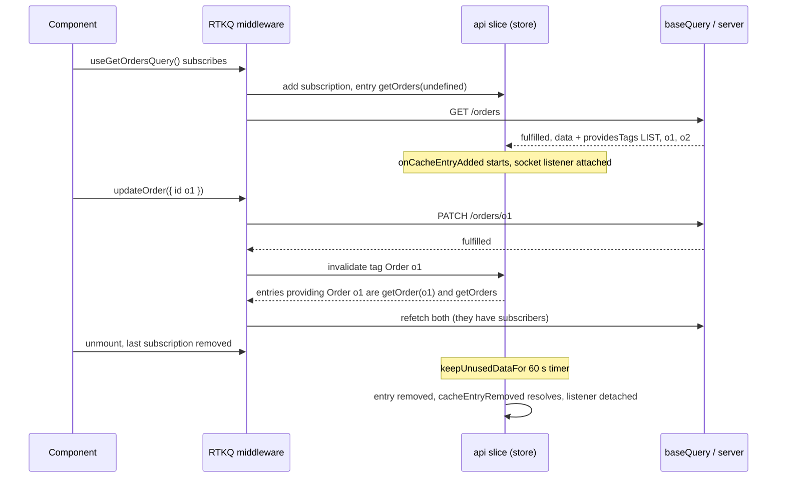

## Bối cảnh & vấn đề

Một app ngân hàng đã dùng Redux Toolkit được hai năm: session, tài khoản đang chọn, workflow chuyển tiền nhiều bước, hàng đợi thông báo. Phần dữ liệu API thì vẫn là `createAsyncThunk` + slice tự viết: 30 slice, mỗi slice có `data`, `status`, `error`, và không slice nào có cache hay dedupe. Màn hình tổng quan gọi `GET /accounts` bốn lần khi load vì bốn widget cùng dispatch thunk. Sau khi chuyển tiền, số dư ở widget "Tài khoản" cập nhật, còn widget "Tổng tài sản" thì không, vì không ai nhớ dispatch lại thunk của nó.

Team cân nhắc TanStack Query, nhưng mọi người đã quen với DevTools của Redux và muốn cache nằm cùng chỗ với state còn lại. **RTK Query** là câu trả lời có sẵn trong Redux Toolkit: một lớp data fetching và caching được xây trên chính Redux store (cache là một slice, request là thunk, invalidation là middleware), với API khai báo tập trung và hook sinh tự động.

Bài này giải thích mô hình của RTK Query (API slice, subscription, tags), cách nó xử lý streaming update từ WebSocket, và cách chọn giữa RTK Query và TanStack Query. Nền về Redux ở bài [Redux Toolkit core](/tracks/state-management/learn/redux-toolkit-core); khái niệm cache server state chung (stale, dedupe) ở bài [TanStack Query cache](/tracks/state-management/learn/tanstack-query-cache). Optimistic update với `updateQueryData` được đào sâu ở bài [optimistic updates](/tracks/state-management/learn/optimistic-updates).

**Interview angle:** câu "tags trong RTK Query hoạt động thế nào" gần như luôn kèm yêu cầu "viết `providesTags` và `invalidatesTags` cho list và detail".

## Khái niệm

### createApi và endpoint definition

**`createApi`** tạo một **API slice**: một object chứa reducer (cache), middleware (quản lý subscription, invalidation, polling), và các endpoint. Bạn khai báo tất cả endpoint của một backend ở **một chỗ**: `build.query` cho đọc, `build.mutation` cho ghi. Mỗi endpoint có `query` (mô tả request, chạy qua `baseQuery`) hoặc `queryFn` (tự viết logic). `fetchBaseQuery` là `baseQuery` mặc định, một wrapper nhỏ quanh `fetch` với `baseUrl` và `prepareHeaders` (gắn token).

RTK Query **sinh hook** cho từng endpoint: `useGetOrdersQuery`, `useUpdateOrderMutation`, `useLazyGetOrderQuery`. Cache key của một query là **tên endpoint + tham số đã serialize**: `getOrder("o1")` và `getOrder("o2")` là hai entry khác nhau, và bạn không bao giờ tự viết key như ở TanStack Query. Điều này loại bỏ hẳn lớp bug "key thiếu biến", nhưng đổi lại, mọi thứ ảnh hưởng tới response phải là **tham số** của endpoint.

```ts
export const api = createApi({
  reducerPath: "api",
  baseQuery: fetchBaseQuery({ baseUrl: "/api", prepareHeaders: (h, { getState }) => {
    const token = (getState() as RootState).auth.token;
    if (token) h.set("authorization", `Bearer ${token}`);
    return h;
  } }),
  tagTypes: ["Order"],
  endpoints: (build) => ({
    getOrders: build.query<Order[], void>({ query: () => "/orders" }),
    getOrder: build.query<Order, string>({ query: (id) => `/orders/${id}` }),
  }),
});
export const { useGetOrdersQuery, useGetOrderQuery } = api;
```

Trong app lớn, dùng **một** API slice gốc cho mỗi backend và `api.injectEndpoints({ endpoints })` ở từng feature để tách code và lazy load; tạo nhiều `createApi` cho cùng backend làm mất khả năng invalidate chéo giữa chúng.

**Interview angle:** "RTK Query định nghĩa API tập trung, TanStack Query định nghĩa tại chỗ" là khác biệt mô hình đầu tiên interviewer muốn nghe.

### Subscription và keepUnusedDataFor

Mỗi component gọi `useGetOrderQuery("o1")` tạo một **subscription** vào cache entry `getOrder("o1")`. Nhiều subscription vào cùng entry chỉ tạo **một** request (dedupe). Khi subscription cuối cùng biến mất, entry được giữ thêm **`keepUnusedDataFor`** giây (mặc định **60**) rồi bị xoá; đây là tương đương của `gcTime` bên TanStack Query, nhưng mặc định ngắn hơn (60 giây so với 5 phút).

Khác biệt lớn thứ hai: RTK Query **không có khái niệm `staleTime`** theo nghĩa của TanStack Query. Mặc định, nếu cache đã có dữ liệu cho tham số đó, mount mới **không** refetch; `refetchOnMountOrArgChange` (boolean hoặc số giây), `refetchOnFocus`, `refetchOnReconnect` (hai cái sau cần gọi `setupListeners(store.dispatch)`) là opt-in. Nói cách khác, mặc định của RTK Query nghiêng về **ít request**, mặc định của TanStack Query nghiêng về **dữ liệu mới** (verify khi so sánh version).

**Interview angle:** câu bẫy: "RTK Query refetch khi focus mặc định không?"; không, phải bật `refetchOnFocus` và gọi `setupListeners`.

### Tags: providesTags và invalidatesTags

**Tag** là nhãn gắn cho dữ liệu trong cache, dạng `'Order'` hoặc `{ type: 'Order', id: 'o1' }`. Query khai báo **`providesTags`**: "dữ liệu này thuộc các tag nào". Mutation khai báo **`invalidatesTags`**: "sau khi tôi chạy, các tag này không còn đúng". Khi mutation hoàn tất, middleware tìm mọi cache entry cung cấp tag bị invalidate: entry đang có subscription thì **refetch**, entry không có subscription thì bị xoá để lần sau fetch lại.

Tag là **lớp gián tiếp** giữa mutation và query: mutation không cần biết query nào tồn tại, chỉ cần biết nó làm đổi dữ liệu loại gì. Đây là điểm khác chính với TanStack Query, nơi mutation phải biết query key để invalidate.

Pattern chuẩn cho list và detail:

- List cung cấp `{ type: 'Order', id: 'LIST' }` **và** `{ type: 'Order', id }` cho từng item.
- Detail cung cấp `{ type: 'Order', id }`.
- Tạo mới invalidate `{ type: 'Order', id: 'LIST' }` (list phải refetch để thấy item mới, detail không bị chạm).
- Sửa item invalidate `{ type: 'Order', id }` (detail của item đó refetch, và list cũng refetch vì list có cung cấp tag của item).
- Xoá item invalidate `{ type: 'Order', id }` (list chứa nó refetch).

Invalidate cả loại `['Order']` là **quá rộng**: mọi query liên quan tới Order đều refetch.

**Interview angle:** giải thích vì sao list phải cung cấp **cả** `LIST` và từng id (để "tạo mới" và "sửa một item" đều làm list refetch) là câu trả lời interviewer chờ.

### Lỗi mutation và invalidation

Theo source của RTK 2.13, invalidation chạy khi mutation **fulfilled** hoặc **rejected with value** (server trả response lỗi mà `baseQuery` chuyển thành `error`), không chạy khi thunk bị lỗi ngoại lệ khác (verify). Nghĩa là một PATCH trả `500` vẫn làm list refetch. Thường đó là điều bạn muốn (server có thể đã ghi một phần), nhưng hãy biết để không ngạc nhiên trong Network tab. `invalidatesTags` dạng function nhận `(result, error, arg)`, nên bạn có thể trả `[]` khi `error` nếu muốn bỏ qua. RTK 2 cũng thêm `invalidationBehavior: 'delayed'` (mặc định) để trì hoãn invalidation cho tới khi các query đang pending xong, tránh refetch chồng (verify).

### Cập nhật cache thủ công: updateQueryData, upsertQueryData

**`api.util.updateQueryData(endpoint, arg, recipe)`** là thunk sửa một cache entry bằng recipe kiểu Immer (được "mutate" draft). Nó trả về object **patch result** có `undo()` để hoàn tác, là nền của optimistic update trong RTK Query (trong `onQueryStarted`: patch trước, `await queryFulfilled`, lỗi thì `patch.undo()`). **`upsertQueryData`** ghi đè hoặc tạo entry từ dữ liệu có sẵn (ví dụ response của mutation). **`api.util.resetApiState()`** xoá toàn bộ cache, dùng khi logout.

### onCacheEntryAdded: streaming updates

**`onCacheEntryAdded(arg, api)`** là lifecycle callback của query endpoint, chạy **một lần khi cache entry được tạo** và kết thúc khi entry bị xoá. Nó nhận `cacheDataLoaded` (promise resolve khi lần fetch đầu xong), `cacheEntryRemoved` (promise resolve khi entry bị dọn), và `updateCachedData(recipe)` để patch chính entry đó. Pattern: chờ `cacheDataLoaded`, đăng ký listener trên WebSocket để patch cache mỗi khi có message, rồi `await cacheEntryRemoved` và huỷ listener.

Vì vòng đời listener gắn với vòng đời cache entry (không phải với component), bạn không mở một socket subscription cho mỗi component, và không quên huỷ khi không còn ai xem: 60 giây sau khi subscription cuối biến mất, entry bị xoá và listener được dọn.

**Interview angle:** câu CV "bạn sẽ mô hình lại luồng Socket.IO bằng RTK Query thế nào?" có đáp án chính là `onCacheEntryAdded`.

## Cơ chế hoạt động

Vòng đời một cache entry trong RTK Query, kèm tag invalidation:



Diễn giải. Hook đăng ký subscription qua middleware; nếu entry chưa có dữ liệu, middleware dispatch thunk gọi `baseQuery`. Kết quả được lưu vào slice cùng danh sách tag mà `providesTags` trả về; middleware duy trì một **chỉ mục tag → cache entry**. Khi mutation xong, middleware tra chỉ mục đó với các tag trong `invalidatesTags`, và refetch những entry còn subscription. Không có mutation nào gọi tên query; mọi liên kết đi qua tag. Khi subscription cuối biến mất, đồng hồ `keepUnusedDataFor` chạy, entry bị xoá, và `cacheEntryRemoved` resolve để `onCacheEntryAdded` dọn listener.

Vì tất cả nằm trong Redux, mọi bước đều là action hiển thị trong Redux DevTools (`api/executeQuery/pending`, `api/executeMutation/fulfilled`, `api/internalSubscriptions/...`), và cache có thể đọc bằng selector `api.endpoints.getOrders.select()(state)`.

## Ví dụ thực tế

### Tags, dedupe, optimistic undo, streaming và reset

Một HTTP server nhỏ trong cùng process, API slice với tags, optimistic update qua `onQueryStarted`, và `onCacheEntryAdded` lắng nghe một `EventEmitter` đóng vai socket:

```ts
const api = createApi({
  reducerPath: "api",
  baseQuery: fetchBaseQuery({ baseUrl: `http://localhost:${port}` }),
  tagTypes: ["Order"],
  keepUnusedDataFor: 60,
  endpoints: (build) => ({
    getOrders: build.query<Order[], void>({
      query: () => "/orders",
      providesTags: (result = []) => [{ type: "Order", id: "LIST" }, ...result.map(({ id }) => ({ type: "Order" as const, id }))],
      async onCacheEntryAdded(_arg, { updateCachedData, cacheDataLoaded, cacheEntryRemoved }) {
        await cacheDataLoaded;
        const onMsg = (o: Order) => updateCachedData((draft) => { const i = draft.findIndex((x) => x.id === o.id); if (i >= 0) draft[i] = o; });
        socket.on("order", onMsg);
        await cacheEntryRemoved; socket.off("order", onMsg);
        console.log("  (socket listener removed with the cache entry)");
      },
    }),
    getOrder: build.query<Order, string>({ query: (id) => `/orders/${id}`, providesTags: (_r, _e, id) => [{ type: "Order", id }] }),
    addOrder: build.mutation<Order, Omit<Order, "id">>({ query: (body) => ({ url: "/orders", method: "POST", body }),
      invalidatesTags: [{ type: "Order", id: "LIST" }] }),
    updateOrder: build.mutation<Order, Pick<Order, "id"> & Partial<Order>>({
      query: ({ id, ...patch }) => ({ url: `/orders/${id}`, method: "PATCH", body: patch }),
      invalidatesTags: (_r, _e, { id }) => [{ type: "Order", id }],
      async onQueryStarted({ id, ...patch }, { dispatch, queryFulfilled }) {
        const p = dispatch(api.util.updateQueryData("getOrders", undefined, (draft) => {
          const o = draft.find((x) => x.id === id); if (o) Object.assign(o, patch); }));
        console.log("  optimistic list:", JSON.stringify(api.endpoints.getOrders.select()(store.getState()).data));
        try { await queryFulfilled; } catch { p.undo(); console.log("  PATCH failed -> patch.undo()"); }
      },
    }),
  }),
});
const store = configureStore({ reducer: { [api.reducerPath]: api.reducer }, middleware: (g) => g().concat(api.middleware) });

const subList = store.dispatch(api.endpoints.getOrders.initiate());
store.dispatch(api.endpoints.getOrder.initiate("o1"));
store.dispatch(api.endpoints.getOrder.initiate("o2"));
store.dispatch(api.endpoints.getOrder.initiate("o1"));      // same arg -> deduped
console.log("initial:", await flush());
await store.dispatch(api.endpoints.updateOrder.initiate({ id: "o1", status: "paid" }));
console.log("update o1 invalidates {Order,o1}:", await flush());
await store.dispatch(api.endpoints.addOrder.initiate({ status: "open" }));
console.log("add invalidates {Order,LIST}:", await flush());
failPatch = true;                                           // server now answers 500
await store.dispatch(api.endpoints.updateOrder.initiate({ id: "o2", status: "cancelled" }));
console.log("  list after undo:", JSON.stringify(api.endpoints.getOrders.select()(store.getState()).data?.map((o) => o.status)));
console.log("failed PATCH ->", await flush());
failPatch = false;
socket.emit("order", { id: "o2", status: "shipped" });
console.log("after socket event:", JSON.stringify(api.endpoints.getOrders.select()(store.getState()).data?.map((o) => `${o.id}:${o.status}`)), "requests:", await flush());
subList.unsubscribe();
console.log("unsubscribed list; cached data still there:", !!api.endpoints.getOrders.select()(store.getState()).data);
store.dispatch(api.util.resetApiState());
console.log("resetApiState -> queries in cache:", Object.keys(store.getState().api.queries).length);
```

Output thật (Node 24, `@reduxjs/toolkit` 2.13.0; `flush()` chờ 80 ms rồi in danh sách request server nhận được):

```text
initial: GET /orders, GET /orders/o1, GET /orders/o2
  optimistic list: [{"id":"o1","status":"paid"},{"id":"o2","status":"open"}]
update o1 invalidates {Order,o1}: PATCH /orders/o1, GET /orders/o1, GET /orders
add invalidates {Order,LIST}: POST /orders, GET /orders
  optimistic list: [{"id":"o1","status":"paid"},{"id":"o2","status":"cancelled"},{"id":"o3","status":"open"}]
  PATCH failed -> patch.undo()
  list after undo: ["paid","open","open"]
failed PATCH -> PATCH /orders/o2, GET /orders/o2, GET /orders
after socket event: ["o1:paid","o2:shipped","o3:open"] requests: (none)
unsubscribed list; cached data still there: true
  (socket listener removed with the cache entry)
resetApiState -> queries in cache: 0
```

Đọc output từng khối. **Dedupe**: bốn subscription nhưng chỉ ba request, `getOrder("o1")` thứ hai dùng lại request đang bay. **Sửa o1**: invalidate `{Order, o1}` làm refetch cả detail o1 **và** list (vì list cung cấp tag của từng item), nhưng detail o2 không bị chạm. **Tạo mới**: invalidate `LIST` chỉ refetch list; không detail nào refetch. **PATCH lỗi**: UI thấy `cancelled` ngay (optimistic), server trả 500, `patch.undo()` đưa về `open`; và vì lỗi đến dưới dạng response lỗi, tags **vẫn bị invalidate**: detail o2 và list refetch. **Socket**: message patch cache trực tiếp qua `updateCachedData`, **không request nào**. **Unsubscribe**: dữ liệu vẫn còn (đang trong 60 giây `keepUnusedDataFor`); `resetApiState` xoá toàn bộ cache, entry bị dọn, và listener socket được gỡ.

### So sánh cùng tính năng ở hai thư viện

```ts
// RTK Query: invalidation via tags, declared on the endpoint
updateOrder: build.mutation<Order, OrderPatch>({
  query: ({ id, ...patch }) => ({ url: `/orders/${id}`, method: "PATCH", body: patch }),
  invalidatesTags: (_r, _e, { id }) => [{ type: "Order", id }],
}),

// TanStack Query: invalidation via key prefixes, declared at the call site
const updateOrder = useMutation({
  mutationFn: ({ id, ...patch }: OrderPatch) => api.patch(`/orders/${id}`, patch),
  onSuccess: (o) => qc.setQueryData(orderKeys.detail(o.id), o),
  onSettled: () => qc.invalidateQueries({ queryKey: orderKeys.lists() }),
});
```

RTK Query đặt quan hệ "mutation này làm cũ dữ liệu nào" **cạnh endpoint**, một lần cho cả app. TanStack Query đặt nó **tại chỗ gọi**, linh hoạt hơn nhưng dễ bị quên ở chỗ gọi thứ hai.

## Trade-offs & lựa chọn thay thế

| Tiêu chí | RTK Query | TanStack Query |
| --- | --- | --- |
| Cache nằm ở đâu | Trong Redux store (một slice) | `QueryClient` riêng |
| Định nghĩa | API slice tập trung, hook sinh sẵn | Tại chỗ, hoặc `queryOptions` |
| Cache key | Tên endpoint + arg serialize | Query key tự viết |
| Invalidation | Tags (`providesTags`/`invalidatesTags`) | Key prefix (`invalidateQueries`) |
| Mặc định refetch | Ít: không refetch khi mount nếu có cache, focus/reconnect opt-in | Nhiều: `staleTime: 0`, refetch khi mount/focus/reconnect |
| Giữ entry không dùng | `keepUnusedDataFor` 60 s | `gcTime` 5 phút |
| Infinite query | Có `build.infiniteQuery` từ RTK 2.6 (verify) | Rất mạnh, lâu đời |
| Streaming | `onCacheEntryAdded` | Tự patch bằng `setQueryData` |
| DevTools | Redux DevTools (action log) | React Query Devtools |
| Framework | React (hook), core dùng được ngoài React | React, Vue, Solid, Svelte, Angular |
| Bundle | Cần Redux + RTK | Chỉ thư viện này |

Khi nào chọn cái nào. Đã dùng Redux cho client state đáng kể, cần DevTools với action log cho debug và audit, hoặc muốn một nơi tập trung định nghĩa API cho team lớn: **RTK Query**, vì nó tích hợp tự nhiên và mental model không đổi. Không dùng Redux, hoặc chỉ cần server state, hoặc cần infinite query và SSR hydration trưởng thành, hoặc dùng framework khác React: **TanStack Query**. Tuyệt đối **không** dùng cả hai cho cùng dữ liệu: hai cache, hai lịch refetch, hai nguồn sự thật.

Với kế hoạch migrate từ thunk (xem bài [side effects](/tracks/state-management/learn/redux-side-effects)), RTK Query có lợi thế: endpoint mới cùng store, selector cũ có thể đọc từ `api.endpoints.x.select()` làm adapter trong giai đoạn chuyển tiếp, và DevTools vẫn một chỗ.

## Edge cases & failure modes

- **Tham số không serialize ổn định**: truyền object tạo mới mỗi render (`useGetOrdersQuery({ from: new Date() })`) làm arg đổi mỗi render, tạo entry và request mới liên tục. Chuẩn hoá tham số (ISO date làm tròn) và memo object.
- **Nhiều `createApi` cho cùng backend**: mutation ở API slice A không invalidate được tag ở API slice B. Một API slice + `injectEndpoints`.
- **Invalidate tag loại (`['Order']`)**: refetch mọi query cung cấp bất kỳ tag Order nào, kể cả danh sách 20 trang không liên quan.
- **List thiếu tag của từng item**: sửa item không làm list refetch, list hiển thị giá trị cũ; chỉ tạo mới mới refresh list.
- **`onCacheEntryAdded` không chờ `cacheDataLoaded`**: message socket tới trước khi có dữ liệu ban đầu, `updateCachedData` không có gì để patch và message bị mất. Luôn `await cacheDataLoaded` (và cân nhắc buffer message trong lúc chờ).
- **Streaming và refetch**: tag invalidation refetch list và **ghi đè** các patch từ socket bằng response có thể cũ hơn event vừa nhận; dùng version/`updatedAt` khi merge (xem bài [real-time](/tracks/state-management/learn/realtime-sync-offline)).
- **Quên `setupListeners`**: `refetchOnFocus: true` không có tác dụng nếu không gọi `setupListeners(store.dispatch)`.
- **Logout không reset**: cache vẫn chứa dữ liệu user trước tới 60 giây sau khi unsubscribe; dispatch `api.util.resetApiState()` khi logout.

## Pitfalls

- ❌ `providesTags: ['Order']` cho list → ✅ `LIST` + từng `{ type, id }`, để cả tạo mới lẫn sửa item đều refresh đúng.
- ❌ `invalidatesTags: ['Order']` cho mọi mutation → ✅ invalidate chính xác theo id hoặc `LIST`.
- ❌ Nhiều API slice cho một backend → ✅ một slice gốc + `injectEndpoints` theo feature.
- ❌ Dùng RTK Query và TanStack Query cho cùng dữ liệu → ✅ chọn một, vì hai cache lệch nhau.
- ❌ Mở socket trong component rồi `dispatch` vào slice riêng → ✅ `onCacheEntryAdded` gắn vòng đời listener với cache entry.
- ❌ Kỳ vọng refetch khi focus như TanStack Query → ✅ bật `refetchOnFocus` và gọi `setupListeners`.
- ❌ Giữ slice thunk cũ và RTK Query cùng chứa một dữ liệu lâu dài → ✅ adapter tạm, rồi xoá slice cũ.

## Tóm tắt

- `createApi` tạo **API slice** (reducer + middleware + endpoints) và hook sinh sẵn; cache key là endpoint + arg.
- Subscription dedupe request; entry không còn subscription giữ **`keepUnusedDataFor`** (mặc định 60 s).
- Mặc định **không** refetch khi mount nếu có cache; focus/reconnect là opt-in qua `setupListeners`.
- **Tags**: query `providesTags`, mutation `invalidatesTags`; pattern list = `LIST` + từng id, create → `LIST`, update/delete → id.
- Mutation lỗi dạng response vẫn invalidate tags (RTK 2.13, verify); `updateQueryData` + `patch.undo()` cho optimistic.
- **`onCacheEntryAdded`** gắn listener streaming với vòng đời cache entry.
- Đã dùng Redux → RTK Query; không Redux hoặc cần infinite/SSR mạnh → TanStack Query; không dùng cả hai cho cùng dữ liệu.
