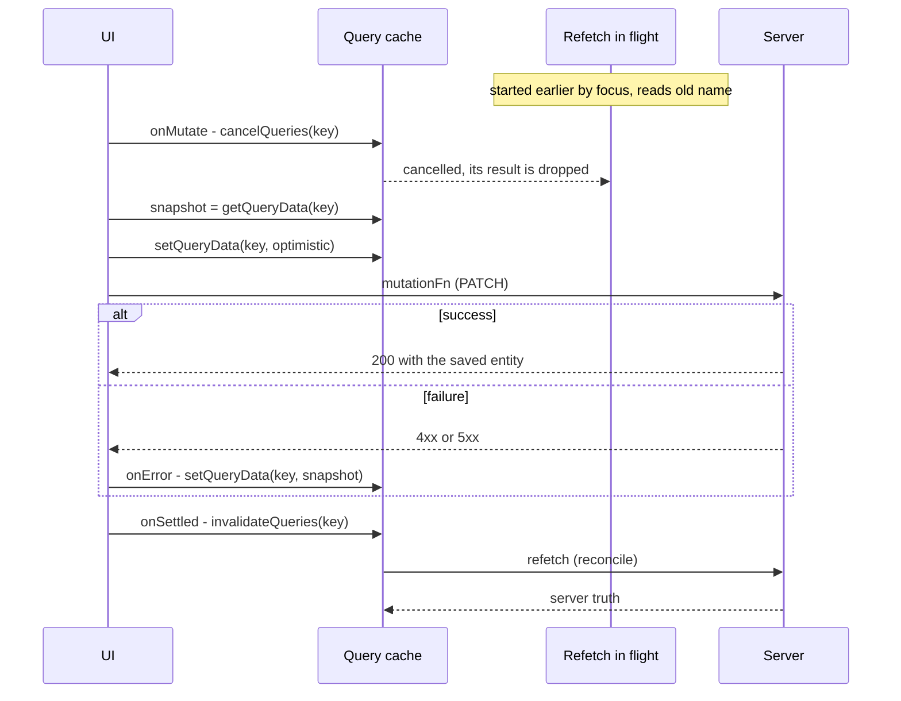

## Bối cảnh & vấn đề

Nút "Đổi tên project" trong một app quản lý dự án. Người dùng gõ tên mới, bấm Lưu. Code set tên mới vào cache ngay để UI phản hồi tức thì, rồi gọi API. Nhưng người dùng thấy một hiện tượng lạ: tên mới hiện lên, rồi **tên cũ nhảy lại** trong khoảng nửa giây, rồi tên mới xuất hiện lần nữa. Ở một màn hình khác, nút "Yêu thích" bị bấm liên tục bốn lần; UI cuối cùng hiện ♥ trong khi người dùng muốn ♡, và server cũng lưu ♥.

**Optimistic update** là kỹ thuật cập nhật UI **trước khi** server xác nhận, dựa trên giả định "request này gần như chắc chắn thành công". Nó làm app cảm giác nhanh như native: không spinner cho thao tác nhỏ như like, kéo thả, đổi tên. Nhưng khi bạn ghi vào cache trước server, bạn đang tạo ra một **trạng thái tạm** cạnh tranh với ba thứ khác: refetch đang bay, các mutation khác trên cùng dữ liệu, và kết quả thật từ server. Mỗi cái đều có thể ghi đè trạng thái tạm vào lúc sai.

Bài này đi qua công thức chuẩn bốn bước với TanStack Query, lý do từng bước tồn tại (bằng thí nghiệm chạy thật), race khi bấm liên tục, cách làm tương đương trong RTK Query, và hai lựa chọn mới của React 19: `useOptimistic` và Server Actions. Cuối bài là xung đột thật sự giữa hai người dùng. Nền về cache ở bài [mutation và invalidation](/tracks/state-management/learn/mutations-invalidation) và [RTK Query](/tracks/state-management/learn/rtk-query).

**Interview angle:** "implement optimistic toggle favourite, bước nào chống flicker hoặc kẹt trạng thái sai?" là câu design medium; câu debug "tên cũ nhảy lại" là phiên bản hard của cùng kiến thức.

## Khái niệm

### Optimistic vs pessimistic update

**Pessimistic update** chờ server trả lời rồi mới cập nhật UI: đúng tuyệt đối, nhưng người dùng thấy độ trễ mạng (100–500 ms) cho mọi thao tác. **Optimistic update** cập nhật ngay, rồi hoặc giữ nguyên (thành công), hoặc hoàn tác (thất bại). Chọn optimistic khi thao tác **nhỏ, hay thành công, dễ hoàn tác và hậu quả sai thấp** (like, đánh dấu đã đọc, sắp xếp). Chọn pessimistic khi thao tác **quan trọng hoặc có nhiều khả năng bị từ chối** (chuyển tiền, đặt hàng, thao tác cần server validate phức tạp); ở đó, hiển thị trạng thái "đang xử lý" trung thực hơn.

**Interview angle:** interviewer thường hỏi "có nên optimistic cho nút chuyển tiền không?"; không, vì hậu quả của việc hiển thị "đã chuyển" rồi hoàn tác là mất niềm tin.

### Công thức bốn bước của TanStack Query

1. **`onMutate`**: `await queryClient.cancelQueries({ queryKey })` để huỷ refetch đang bay; lưu **snapshot** `getQueryData(queryKey)`; ghi giá trị optimistic bằng `setQueryData`; `return { previous }` làm **context**.
2. **`mutationFn`**: gọi API.
3. **`onError(err, vars, context)`**: **rollback** bằng `setQueryData(queryKey, context.previous)` và báo lỗi cho người dùng.
4. **`onSettled`**: `invalidateQueries({ queryKey })` để **reconcile**: dù thành công hay thất bại, lấy lại sự thật từ server.

Mỗi bước chống một lỗi cụ thể. Thiếu `cancelQueries`: một refetch đang bay (do focus, mount, hay invalidate trước đó) mang dữ liệu **cũ** về sau khi bạn đã ghi optimistic, ghi đè nó, gây "flash" giá trị cũ. Thiếu snapshot + rollback: khi API lỗi, UI kẹt ở giá trị sai cho tới lần refetch tiếp theo, có thể vài phút nếu `staleTime` cao. Thiếu reconcile: server có thể đã chuẩn hoá dữ liệu (trim khoảng trắng, sinh `updatedAt`, tính lại tổng), và UI giữ bản của client mãi.

```ts
const toggle = useMutation({
  mutationFn: (id: string) => api.toggleFavourite(id),
  onMutate: async (id) => {
    await qc.cancelQueries({ queryKey: productKeys.lists() });
    const previous = qc.getQueriesData<Product[]>({ queryKey: productKeys.lists() });
    qc.setQueriesData<Product[]>({ queryKey: productKeys.lists() },
      (old) => old?.map((p) => (p.id === id ? { ...p, favourite: !p.favourite } : p)));
    return { previous };
  },
  onError: (_err, _id, ctx) => ctx?.previous.forEach(([key, data]) => qc.setQueryData(key, data)),
  onSettled: () => qc.invalidateQueries({ queryKey: productKeys.lists() }),
});
```

Bản trên dùng `getQueriesData`/`setQueriesData` để cập nhật **mọi** list chứa item (list theo từng filter), và snapshot từng list để rollback đúng từng cái. Nếu có detail query, patch nó theo cùng cách hoặc chấp nhận để `onSettled` invalidate.

**Interview angle:** thứ tự "cancel → snapshot → set → return context" và lý do của `cancelQueries` là phần phân loại ứng viên rõ nhất.

### Optimistic qua variables (không đụng cache)

TanStack Query v5 có cách đơn giản hơn cho trường hợp chỉ một chỗ hiển thị: không ghi cache, mà render giá trị tạm từ **`mutation.variables`** khi `mutation.isPending`. Ví dụ danh sách todo hiển thị thêm một dòng mờ với `variables.title` trong lúc thêm. Nếu lỗi, `isError` và bạn hiển thị nút thử lại; không có gì để rollback vì cache chưa bị chạm. Có thể đọc trạng thái mutation từ component khác bằng `useMutationState({ filters: { mutationKey } })`. Giới hạn: chỉ những component chủ động đọc variables mới thấy giá trị tạm.

### Race khi mutation chồng nhau và mutation scope

Khi người dùng bấm nhiều lần, nhiều mutation chạy **song song**. Hai vấn đề xuất hiện. Thứ nhất, `onSettled` của mutation đầu invalidate và refetch trong khi mutation sau còn chưa xong, mang về trạng thái trung gian và làm UI nhảy. Cách giảm: chỉ invalidate khi đây là mutation cuối cùng đang chạy trên dữ liệu đó (`queryClient.isMutating({ mutationKey }) === 1` trong `onSettled`).

Thứ hai, nghiêm trọng hơn: **server nhận các request theo thứ tự mạng**, không theo thứ tự bấm. Nếu request #1 chậm nhất, nó ghi đè kết quả của #4, và trạng thái cuối trên server là của lần bấm đầu tiên. Không có kỹ thuật cache nào sửa được lỗi này; bạn phải **tuần tự hoá** các mutation. TanStack Query v5 có option **`scope: { id }`**: các mutation cùng scope id chạy **nối tiếp** (verify version). Các cách khác: debounce thao tác (chỉ gửi trạng thái cuối sau 300 ms), gửi **giá trị tuyệt đối** thay vì "toggle", hoặc để server từ chối write cũ bằng version.

**Interview angle:** follow-up "user toggle cùng item 5 lần nhanh, cái gì hỏng?" có đáp án đầy đủ gồm cả flicker phía client lẫn **thứ tự ghi phía server**.

### RTK Query: onQueryStarted, updateQueryData, patch.undo

Trong RTK Query, optimistic update nằm trong **`onQueryStarted(arg, { dispatch, queryFulfilled })`** của mutation endpoint: dispatch `api.util.updateQueryData(endpoint, arg, recipe)` để patch cache (recipe kiểu Immer), giữ lại **patch result**, `await queryFulfilled`, và gọi `patchResult.undo()` trong `catch`. `undo` áp dụng **inverse patch** do Immer sinh ra, nên chỉ hoàn tác đúng thay đổi của bạn, không ghi đè thay đổi khác xảy ra trong lúc chờ (khác với rollback bằng snapshot toàn bộ). Kết hợp với `invalidatesTags` để reconcile. Kiểu **pessimistic** là cùng API nhưng patch **sau** `await queryFulfilled` bằng dữ liệu server trả về.

### React 19 useOptimistic

**`useOptimistic(state, updateFn)`** trả về `[optimisticState, addOptimistic]`. Bên trong một **transition** (Action), gọi `addOptimistic(value)` để hiển thị ngay giá trị tạm; khi transition kết thúc, React **tự động** bỏ lớp optimistic và hiển thị lại `state` thật. Nếu action thành công và bạn đã cập nhật `state` (hoặc server trả UI mới), giá trị thật trùng với giá trị tạm; nếu thất bại mà không cập nhật `state`, UI tự quay về giá trị cũ, **không cần viết rollback**.

Điểm khác cốt lõi so với TanStack: `useOptimistic` là **cục bộ trong một component** và chỉ sống trong thời gian transition. Nó không cập nhật cache dùng chung, nên component khác hiển thị cùng dữ liệu không thấy thay đổi tạm.

### Server Actions và revalidation

Với Next.js App Router, **Server Action** (Server Function) là hàm `'use server'` chạy trên server, gọi từ form hoặc từ client. Sau khi ghi, action gọi API revalidate của framework (như `revalidatePath`, `revalidateTag`, hoặc các API mới hơn như `updateTag`/`refresh` tuỳ version; đọc docs trong `node_modules/next/dist/docs/` trước khi dùng, verify), và response của action mang về RSC payload mới trong **cùng một round-trip**. Server là nguồn sự thật; không có cache client để patch. Để có phản hồi tức thì, kết hợp với `useOptimistic` trong Client Component.

**Interview angle:** câu so sánh `useMutation` + cache, `useOptimistic`, và Server Actions chấm việc bạn chọn theo **kiến trúc** (cache client hay RSC-first) chứ không theo sở thích.

### Xung đột giữa nhiều người dùng

Optimistic update giả định **bạn** là người duy nhất sửa dữ liệu. Khi hai quản lý cùng sửa một lịch ca, giả định đó sai. Cách chuẩn là **optimistic concurrency control**: mỗi entity có `version` (hoặc `updatedAt`/ETag); client gửi kèm version đã đọc (`If-Match: "v7"` hoặc field `version: 7`); server chỉ ghi nếu version còn khớp, không thì trả **`409 Conflict`** hoặc **`412 Precondition Failed`**. Client khi đó rollback, lấy bản mới nhất, và cho người dùng thấy thay đổi của người kia để chọn: giữ của mình (ghi lại với version mới), lấy của họ, hoặc merge.

## Cơ chế hoạt động



Diễn giải. Refetch nền có thể đã chạy trước khi người dùng bấm (ví dụ vì vừa focus cửa sổ), và nó đọc **giá trị cũ** trên server. `cancelQueries` huỷ promise đó và đảm bảo kết quả của nó không bao giờ được ghi vào cache; nếu request đã tới server, server vẫn xử lý, nhưng response bị bỏ. Snapshot phải được lấy **sau** khi cancel, để nó phản ánh trạng thái đã ổn định. Sau khi ghi optimistic, mutation chạy; lỗi thì ghi lại snapshot. `onSettled` luôn invalidate, và vì query đang active nên refetch ngay, đưa cache về đúng sự thật của server.

Lỗi "tên cũ nhảy lại" chính là trường hợp bỏ bước cancel: refetch cũ về sau khi optimistic đã ghi, ghi đè tên mới bằng tên cũ, rồi refetch của `onSettled` mang tên mới trở lại.

## Ví dụ thực tế

### Tái hiện flicker và rollback

Query chậm 100 ms đọc giá trị server tại thời điểm bắt đầu. Ngay trước khi mutation, một invalidate (giả lập focus) khởi động refetch; sau đó mutation đổi tên, với và không có `cancelQueries`:

```ts
async function run(withCancel: boolean) {
  const qc = new QueryClient(); qc.mount();
  let serverName = "Old name";
  const key = ["project", 1];
  const obs = new QueryObserver(qc, { queryKey: key,
    queryFn: async () => { const snap = serverName; await sleep(100); return { id: 1, name: snap }; } });
  const seen: string[] = [];
  obs.subscribe((r) => { const n = r.data?.name; if (n && seen.at(-1) !== n) seen.push(n); });
  await sleep(150);
  qc.invalidateQueries({ queryKey: key });   // e.g. window focus: a refetch starts and reads "Old name"
  await sleep(10);
  const m = new MutationObserver(qc, {
    mutationFn: async (name: string) => { await sleep(150); serverName = name; return { id: 1, name }; },
    onMutate: async (name) => {
      if (withCancel) await qc.cancelQueries({ queryKey: key });
      const previous = qc.getQueryData(key);
      qc.setQueryData(key, (p: any) => ({ ...p, name }));
      return { previous };
    },
    onError: (_e, _v, ctx: any) => qc.setQueryData(key, ctx.previous),
    onSettled: () => qc.invalidateQueries({ queryKey: key }),
  });
  await m.mutate("New name");
  await sleep(200);
  console.log(`${withCancel ? "with cancelQueries   " : "without cancelQueries"}: ${seen.join(" -> ")}`);
}
await run(false);
await run(true);
// plus: a mutation that fails with 409 and rolls back "Alpha" -> "Beta" -> "Alpha"
```

Output thật (query-core 5.104.0):

```text
without cancelQueries: Old name -> New name -> Old name -> New name
with cancelQueries   : Old name -> New name
onError: 409 Conflict -> rolled back
rollback trail: Beta -> Alpha
```

Không có `cancelQueries`, người dùng thấy đúng bug trong ticket: **New → Old → New**. Có `cancelQueries`, chỉ một chuyển đổi duy nhất. Với mutation lỗi `409`, cache chuyển sang "Beta" rồi được rollback về "Alpha" (trail bắt đầu từ lần thay đổi đầu tiên nên không in giá trị khởi tạo).

### Bấm liên tục: flicker không phải vấn đề lớn nhất

Bốn lần bấm "Yêu thích" cách nhau 15 ms (♡ → ♥ → ♡ → ♥ → ♡, người dùng muốn **♡**), với độ trễ API cố định 150, 30, 60, 20 ms (lần bấm đầu chậm nhất). Ba chế độ: invalidate ở mọi `onSettled`; chỉ invalidate khi `isMutating === 1`; và thêm `scope: { id: 'fav-1' }` để tuần tự hoá:

```ts
const mk = () => new MutationObserver(qc, {
  mutationKey: ["toggleFav", 1],
  scope: mode === "guard+scope" ? { id: "fav-1" } : undefined,
  mutationFn: async (next: boolean) => { await sleep(delays[i++]); server = next; },
  onMutate: async (next) => { await qc.cancelQueries({ queryKey: key }); const prev = qc.getQueryData(key); qc.setQueryData(key, { fav: next }); return { prev }; },
  onError: (_e, _v, ctx: any) => qc.setQueryData(key, ctx.prev),
  onSettled: () => { if (mode === "naive" || qc.isMutating({ mutationKey: ["toggleFav", 1] }) === 1) return qc.invalidateQueries({ queryKey: key }); },
});
```

Output thật:

```text
naive      : after last click ♡ -> ♥ | final UI=♥ server=♥
guard      : after last click ♡ -> ♥ | final UI=♥ server=♥
guard+scope: after last click ♡ | final UI=♡ server=♡
```

Kết quả đáng chú ý nhất: ở hai chế độ đầu, **server** lưu ♥, trái với ý người dùng. Request của lần bấm đầu (♥) chậm nhất, tới server sau cùng và ghi đè. Guard `isMutating` chỉ giảm số lần refetch; nó không thể sửa thứ tự ghi trên server, và reconcile cuối cùng trung thành mang ♥ sai về UI. Chỉ khi các mutation chạy **nối tiếp** bằng `scope`, trạng thái cuối mới đúng. Bài học: với thao tác toggle, hoặc tuần tự hoá, hoặc gửi giá trị tuyệt đối kèm version, hoặc debounce.

### useOptimistic trong React 19

```tsx
function LikeButton() {
  const [likes, setLikes] = useState(10);                          // confirmed value
  const [optimistic, addOptimistic] = useOptimistic(likes, (cur, delta: number) => cur + delta);
  like = (fail) => startTransition(async () => {
    addOptimistic(1);                                              // instant +1 during the transition
    await sleep(50);                                               // Server Action / fetch
    if (!fail) startTransition(() => setLikes((l) => l + 1));      // commit the real value
  });
  trail.push(`render likes=${likes} shown=${optimistic}`);
  return <b>{optimistic}</b>;
}
```

Output thật (React 19.3, jsdom):

```text
success: render likes=10 shown=10 | render likes=10 shown=11 | render likes=11 shown=11
failure: render likes=11 shown=12 | render likes=11 shown=11
```

Khi thành công: UI hiện 11 ngay (`likes` vẫn 10), rồi khi transition xong, `likes` thật thành 11. Khi thất bại: hiện 12 ngay, và khi transition kết thúc mà không cập nhật `likes`, React **tự bỏ** lớp optimistic, UI về 11 mà không có dòng rollback nào.

### Xung đột lịch ca: version và 409

Hai quản lý mở cùng lịch tuần (version 7). Quản lý A kéo ca của Lan từ 08:00 sang 10:00: UI cập nhật ngay (optimistic), request gửi `{ shiftId, start: "2026-10-05T10:00:00+07:00", version: 7 }`. Server ghi, version thành 8. Quản lý B, vẫn thấy version 7, kéo cùng ca sang 09:00. Server so version (7 ≠ 8) và trả:

```http
HTTP/1.1 409 Conflict
Content-Type: application/json

{ "code": "VERSION_CONFLICT", "current": { "shiftId": "s42", "start": "2026-10-05T10:00:00+07:00", "version": 8, "updatedBy": "manager-a" } }
```

Client của B rollback ca về vị trí cũ, patch cache bằng `current` từ response, và hiển thị: "Quản lý A vừa dời ca này sang 10:00. Giữ thay đổi của bạn (09:00)?". Nếu B chọn giữ, request gửi lại với `version: 8`. Validation chồng ca chạy ở cả hai nơi: client để phản hồi nhanh khi kéo, server là nguồn sự thật cuối cùng. Thời gian gửi và lưu ở dạng ISO 8601 có offset, và ca qua nửa đêm được biểu diễn bằng thời điểm bắt đầu/kết thúc tuyệt đối thay vì "ngày + giờ".

## Trade-offs & lựa chọn thay thế

| Tiêu chí | TanStack `useMutation` + cache | TanStack optimistic qua `variables` | RTK Query `onQueryStarted` | React 19 `useOptimistic` | Server Action + revalidate |
| --- | --- | --- | --- | --- | --- |
| Nguồn sự thật phía client | Query cache | Query cache (không bị chạm) | Redux store | State của component | Server (RSC payload) |
| Phạm vi hiển thị tạm | Mọi màn hình dùng key | Chỉ component đọc variables | Mọi màn hình dùng endpoint | Một component | Một component (kèm `useOptimistic`) |
| Rollback | Tự viết (snapshot) | Không cần | `patch.undo()` (inverse patch) | Tự động khi transition xong | Tự động (kèm `useOptimistic`) |
| Reconcile | `invalidateQueries` | `invalidateQueries` | `invalidatesTags` | Cập nhật state thật | Revalidate trong cùng round-trip |
| Hợp với | SPA, client cache nặng | Thêm item vào list, một chỗ hiển thị | App Redux | Form, nút trong RSC app | Next.js RSC-first |

Khi nào chọn cái nào. App SPA hoặc client-heavy dùng TanStack Query: công thức bốn bước, hoặc optimistic qua variables khi chỉ một chỗ cần thấy. App Redux: `onQueryStarted` + `patch.undo()`. App Next.js RSC-first: Server Action + `useOptimistic` cho phản hồi tức thì. Trộn TanStack Query với Server Actions cho **cùng dữ liệu** nghĩa là hai cache (query cache và router/RSC cache) phải được đồng bộ bằng tay: sau action, vừa revalidate phía server vừa `invalidateQueries` phía client; tốt hơn là chọn một nguồn cho mỗi loại dữ liệu.

## Edge cases & failure modes

- **Refetch đang bay ghi đè optimistic**: triệu chứng "flash giá trị cũ"; thiếu `await cancelQueries`.
- **Rollback bằng snapshot ghi đè thay đổi hợp lệ khác**: hai mutation trên hai field của cùng entity; mutation 1 lỗi, rollback về snapshot chụp trước mutation 2, xoá mất thay đổi của mutation 2. Inverse patch (RTK Query) hoặc reconcile bằng invalidate giảm rủi ro.
- **Thứ tự ghi trên server**: request chậm tới sau ghi đè trạng thái mới hơn; tuần tự hoá (`scope`), debounce, hoặc version.
- **Optimistic item mới không có id**: item tạo tạm cần id client (`crypto.randomUUID()`), và code phải thay bằng id server khi response về, nếu không `key` của React và link chi tiết sẽ sai.
- **Mutation lỗi sau khi người dùng rời màn hình**: rollback vẫn phải chạy; đặt logic trong `useMutation({ onError })`, không trong callback của `mutate()` (không chạy khi đã unmount).
- **Optimistic trên list có sắp xếp/lọc**: patch item đổi status nhưng item vẫn nằm trong list lọc theo status cũ tới khi reconcile; chấp nhận vài trăm ms hoặc tự lọc lại khi patch.
- **Xung đột đa người dùng**: không có version thì last-write-wins âm thầm; người dùng A mất thay đổi mà không biết.

## Pitfalls

- ❌ `setQueryData` optimistic mà không `await cancelQueries` → ✅ cancel trước, vì refetch đang bay mang giá trị cũ về sau.
- ❌ Không snapshot, không `onError` → ✅ snapshot trong `onMutate`, rollback bằng context, vì lỗi sẽ để UI kẹt ở giá trị sai.
- ❌ Bỏ `onSettled` invalidate vì "đã có response" → ✅ luôn reconcile, vì server có thể chuẩn hoá dữ liệu khác bản client.
- ❌ Gửi "toggle" song song không kiểm soát → ✅ `scope` tuần tự, debounce, hoặc gửi giá trị tuyệt đối kèm version.
- ❌ Optimistic cho chuyển tiền, đặt hàng → ✅ pessimistic với trạng thái "đang xử lý" trung thực.
- ❌ Dùng `useOptimistic` rồi kỳ vọng màn hình khác cũng thấy → ✅ nó chỉ cục bộ; dùng cache dùng chung nếu nhiều nơi cần thấy.
- ❌ Last-write-wins im lặng khi nhiều người sửa → ✅ version/ETag, `409`/`412`, và UI cho người dùng chọn.

## Tóm tắt

- Optimistic cho thao tác **nhỏ, hay thành công, dễ hoàn tác**; pessimistic cho thao tác quan trọng.
- Công thức TanStack: **cancel → snapshot → set → context**, rollback ở `onError`, **reconcile** ở `onSettled`.
- Thiếu `cancelQueries` gây flash giá trị cũ; thiếu rollback để UI kẹt; thiếu reconcile giữ bản client sai.
- Mutation chồng nhau: guard `isMutating` giảm flicker, nhưng chỉ **tuần tự hoá** (`scope`), debounce hoặc version mới sửa được thứ tự ghi trên server.
- RTK Query: `onQueryStarted` + `updateQueryData` + `patch.undo()` (inverse patch).
- React 19 `useOptimistic`: lớp tạm cục bộ trong transition, tự bỏ khi transition xong; kết hợp Server Actions cho app RSC-first.
- Xung đột đa người dùng: version/ETag, `409`/`412`, rollback và cho người dùng chọn.
