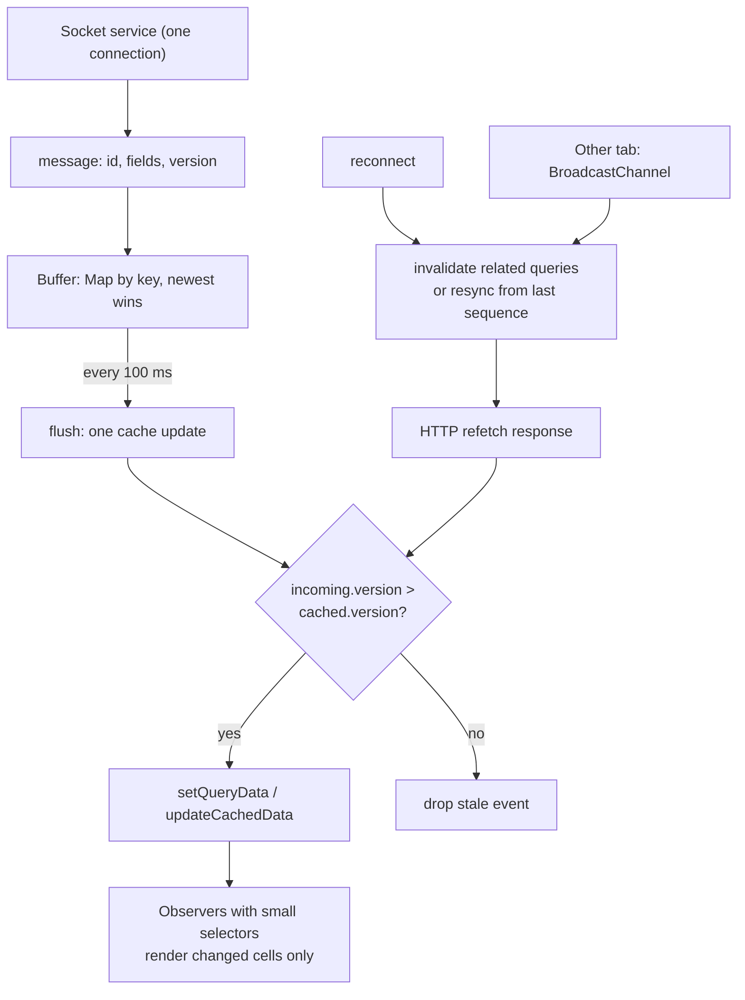
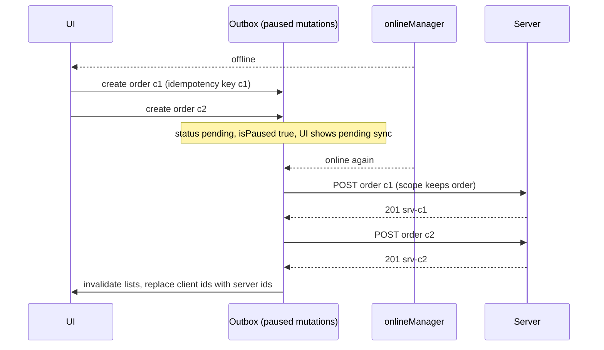

## Bối cảnh & vấn đề

Một nền tảng giao dịch hiển thị bảng giá của 50 mã, cập nhật qua Socket.IO. Phiên bản đầu: mỗi message `price` được `dispatch` vào Redux ngay khi nhận. Vào giờ mở cửa, server đẩy khoảng 1.000 message mỗi giây. Mỗi message là một action, mỗi action chạy lại mọi selector và làm vài chục ô render; tab trình duyệt ăn 100% một core và người dùng không bấm được nút "Đặt lệnh". Cùng lúc, một bug khác: trạng thái lệnh đôi khi hiển thị "Đã khớp một phần" **sau khi** đã "Khớp hoàn toàn", vì hai event đến sai thứ tự sau một lần reconnect.

Real-time chỉ là một trong nhiều cách dữ liệu thay đổi **ngoài** luồng request/response thông thường. Người dùng mở hai tab và sửa giỏ ở một tab. Người dùng đóng trình duyệt và mở lại, mong thấy trạng thái cũ (persist). Nhân viên bán hàng đi vào vùng không có sóng và vẫn phải tạo đơn (offline). Cả bốn tình huống có chung một câu hỏi: **khi dữ liệu thay đổi ở nơi khác, làm sao đưa nó vào state phía client một cách đúng thứ tự, không làm ngập UI, và không tạo ra nguồn sự thật thứ hai?**

Bài này xử lý từng tình huống với cơ chế chạy thật: patch hay invalidate cache khi nhận event, chống out-of-order bằng version, buffer để giảm số lần cập nhật, `BroadcastChannel` cho đa tab, persist có version và migrate, và outbox cho offline. Nền về cache ở bài [TanStack Query cache](/tracks/state-management/learn/tanstack-query-cache) và [RTK Query](/tracks/state-management/learn/rtk-query) (streaming bằng `onCacheEntryAdded`).

**Interview angle:** câu design "đưa WebSocket event vào TanStack/RTK Query cache thế nào" là câu medium phổ biến; điểm cao nằm ở out-of-order, reconnect và throttle, không ở việc gọi `setQueryData`.

## Khái niệm

### Push vs pull, và vai trò của cache

**Pull** là client hỏi server (fetch, polling). **Push** là server chủ động gửi (WebSocket, Socket.IO, Server-Sent Events). Với một thư viện data fetching, push không thay thế cache mà **nuôi** cache: query vẫn là nơi component đọc dữ liệu, và socket chỉ là một nguồn cập nhật cache ngoài refetch. Nhờ đó, component không cần biết dữ liệu đến từ HTTP hay socket.

Hệ quả thiết kế: **một kết nối dùng chung** cho cả app (một module service hoặc provider), không phải mỗi component một socket. Component đăng ký "quan tâm" (subscribe room/topic) thông qua vòng đời query, và service ánh xạ message vào đúng query key.

**Interview angle:** câu hỏi mở đầu thường là "đặt socket ở đâu?"; câu trả lời là một service ngoài store/cache, store chỉ giữ trạng thái kết nối.

### Patch vs invalidate khi nhận event

Có hai chiến lược. **Patch**: message mang đủ dữ liệu (`{ id, status, version }`), bạn ghi thẳng vào cache bằng `setQueryData` (TanStack) hoặc `updateCachedData`/`updateQueryData` (RTK Query). Không có request nào; độ trễ thấp nhất. **Invalidate**: message chỉ báo "có thay đổi" (`{ type: 'order.updated', id }`), bạn gọi `invalidateQueries` cho key liên quan và để thư viện refetch. Tốn một request nhưng không bao giờ sai shape, và server có thể áp dụng quyền truy cập cho dữ liệu trả về.

Chọn patch khi payload đầy đủ, tần suất cao (giá, trạng thái), và bạn kiểm soát được thứ tự. Chọn invalidate khi payload mỏng, dữ liệu có quyền truy cập phức tạp, hoặc event hiếm. Khi socket giữ dữ liệu luôn tươi, `staleTime` có thể tăng cao (thậm chí `Infinity`) để tránh refetch thừa.

### Out-of-order và version

Message có thể đến **sai thứ tự**: qua nhiều server (load balancer), qua reconnect (Socket.IO mặc định giao "at most once", message trong lúc mất kết nối có thể mất, verify), hoặc vì một refetch HTTP chậm về sau một event mới hơn. Nếu bạn ghi đè vô điều kiện, trạng thái cũ thắng.

Cách chống: mỗi entity có **version** tăng đơn điệu (hoặc `updatedAt`, hoặc sequence number của stream). Khi patch, chỉ ghi nếu `incoming.version > cached.version`. Áp dụng **cùng** quy tắc cho response HTTP: nếu refetch trả về version cũ hơn cái socket vừa đẩy, giữ bản socket. Khi reconnect, event trong lúc mất kết nối đã bị lỡ, nên **invalidate** các query liên quan (hoặc lấy snapshot + delta từ sequence cuối đã nhận) để bắt kịp.

**Interview angle:** follow-up "dữ liệu đã patch bởi socket, rồi refetch trả về response cũ hơn thì sao?" đòi hỏi bạn áp version cho cả hai nguồn.

### Buffer và batch để không làm ngập React

Mỗi lần ghi vào cache hoặc store kích hoạt listener, selector, và có thể render. 1.000 message mỗi giây mà ghi từng cái là 1.000 lượt như vậy. Kỹ thuật chuẩn: **buffer** message vào một `Map` theo key (message mới đè message cũ cùng mã, vì chỉ giá mới nhất có ý nghĩa), rồi **flush** định kỳ (100 ms, hoặc mỗi animation frame) bằng **một** lần cập nhật. Người dùng không phân biệt được cập nhật 10 lần/giây với 1.000 lần/giây, nhưng CPU thì có.

Ở tầng component: mỗi ô subscribe bằng selector nhỏ (chỉ giá của mã đó), để một lần flush chỉ render những ô đổi giá. Với code class component cũ, `PureComponent`/`shouldComponentUpdate` và tách component theo ô là tương đương (xem bài [selectors](/tracks/state-management/learn/selectors-rerenders)).

### Đồng bộ đa tab

Mỗi tab là một JS context riêng với cache riêng. Có ba mức đồng bộ. **Refetch khi focus**: nguồn sự thật ở server, tab kia refetch khi người dùng quay lại (mặc định của TanStack Query khi dữ liệu stale); đơn giản nhất và thường đủ. **`BroadcastChannel`**: API trình duyệt cho các context cùng origin gửi message cho nhau; tab vừa sửa gửi `{ type: 'cart-updated' }`, tab kia invalidate hoặc patch cache ngay lập tức. **`storage` event**: khi một tab ghi `localStorage`, các tab **khác** nhận sự kiện `storage`; hữu ích nếu state vốn được persist ở đó. Real-time đa **thiết bị** cần server push.

Logout là trường hợp đặc biệt: tab khác phải phản ứng **ngay**, không chờ focus, vì còn dữ liệu nhạy cảm trên màn hình. Broadcast `logout` và cho mọi tab xoá cache, reset store, rồi chuyển về trang đăng nhập.

### Persist: redux-persist, persistQueryClient, Zustand persist

**Persist** là lưu state xuống storage (localStorage, sessionStorage, IndexedDB) để khôi phục sau reload. Công cụ: `redux-persist` cho Redux, `persistQueryClient` (với `createSyncStoragePersister` hoặc async persister) cho TanStack Query, middleware `persist` cho Zustand (có `partialize` để chọn field, `version` + `migrate`, `skipHydration` cho SSR).

Persist có sáu rủi ro chính. **Schema drift**: app v2 đọc state của v1 khác shape và crash; cần `version` + `migrate`, hoặc xoá khi version đổi (TanStack persister có `buster`). **Dữ liệu cũ**: hiển thị giá, quyền từ tuần trước; cần `maxAge` và revalidate khi khởi động. **Bảo mật**: localStorage đọc được bởi mọi script cùng origin, nên một lỗ XSS là lộ hết; không lưu token, PII, dữ liệu tài chính; máy dùng chung giữ dữ liệu sau khi người dùng rời đi. **SSR hydration**: server không có localStorage, render ra trạng thái mặc định, client rehydrate ra trạng thái khác, gây hydration mismatch; rehydrate sau mount và gate UI. **Hiệu năng**: `JSON.stringify` state lớn sau mỗi thay đổi chặn main thread; throttle và chỉ whitelist slice cần. **Multi-tab**: hai tab ghi đè bản persist của nhau; lắng nghe `storage` event hoặc lưu theo field có timestamp.

**Interview angle:** câu "phần nào của app ngân hàng bạn không bao giờ persist?" có đáp án cụ thể: token, số dư, lịch sử giao dịch, thông tin người nhận; chỉ persist preference UI (theme, ngôn ngữ, cột đã ẩn).

### Offline-first và outbox

**Offline-first** là thiết kế trong đó UI đọc từ **store cục bộ** (thường IndexedDB, qua Dexie hay tương tự) và server là nguồn sự thật cuối cùng được đồng bộ khi có mạng. Ghi khi offline đi vào **outbox**: hàng đợi mutation có id phía client và **idempotency key**, được xử lý **tuần tự** khi online lại; UI hiển thị từng bản ghi ở trạng thái "chờ đồng bộ".

Khi đồng bộ, **conflict** là chuyện bình thường: người khác đã sửa cùng bản ghi, hoặc giá đã đổi. Các chiến lược: last-write-wins theo field (đơn giản, mất dữ liệu âm thầm), version + merge có luật, hỏi người dùng cho dữ liệu quan trọng, hoặc CRDT cho cộng tác thời gian thực. Chiều đọc dùng **delta sync** (`GET /changes?since=<cursor>`) thay vì tải lại toàn bộ.

TanStack Query có nền tảng cho việc này: `networkMode`, query **paused** khi offline, mutation **paused** và tự **resume** khi online, `setMutationDefaults` để mutation được khôi phục sau reload (vì function không persist được), và persister để lưu cả cache lẫn mutation đang chờ.

## Cơ chế hoạt động

Luồng từ socket vào cache, có version, buffer và reconnect:



Diễn giải. Một service duy nhất giữ kết nối và nhận message. Message không đi thẳng vào cache mà vào **buffer** theo key, nơi message mới đè message cũ của cùng key. Mỗi 100 ms, buffer được flush thành **một** lần cập nhật cache. Trước khi ghi, mỗi entity đi qua **cổng version**: chỉ bản mới hơn được ghi. Cùng cổng đó áp dụng cho response HTTP, nên refetch chậm không thể mang dữ liệu cũ đè lên event mới. Khi reconnect, các event lỡ trong lúc mất kết nối không bao giờ tới, nên hệ thống invalidate (hoặc đồng bộ lại từ sequence cuối) để bắt kịp. Message từ tab khác qua `BroadcastChannel` đi cùng đường invalidate.

Luồng offline với outbox:



## Ví dụ thực tế

### Out-of-order, buffer, đa tab và migrate khi persist

```ts
type Order = { id: string; status: string; version: number };
// 1) socket events arrive out of order; guard with version
qc.setQueryData<Order>(["order", "o1"], { id: "o1", status: "paid", version: 3 });
const naive   = (e: Order) => qc.setQueryData<Order>(["order", e.id], e);
const guarded = (e: Order) => qc.setQueryData<Order>(["order", e.id], (old) => (old && old.version >= e.version ? old : e));
const events: Order[] = [{ id: "o1", status: "shipped", version: 5 }, { id: "o1", status: "packed", version: 4 }]; // v4 late
for (const e of events) naive(e);   console.log("naive   :", qc.getQueryData(["order", "o1"]));
qc.setQueryData<Order>(["order", "o1"], { id: "o1", status: "paid", version: 3 });
for (const e of events) guarded(e); console.log("guarded :", qc.getQueryData(["order", "o1"]));

// 2) 1000 ticks: one cache write per message vs a 100 ms buffer
for (let i = 0; i < 1000; i++) qc.setQueryData<Record<string, number>>(["ticker"], (old) => ({ ...old, [`S${i % 50}`]: i }));
const buffer = new Map<string, number>();
const flush = () => { if (!buffer.size) return; const patch = Object.fromEntries(buffer); buffer.clear();
  qc.setQueryData<Record<string, number>>(["ticker"], (old) => ({ ...old, ...patch })); };
const timer = setInterval(flush, 100);
// ... for 1 second: buffer.set(`S${random}`, Date.now()) every ~1 ms

// 3) two tabs via BroadcastChannel
const tabA = new BroadcastChannel("cart"); const tabB = new BroadcastChannel("cart");
tabB.onmessage = (ev) => { console.log("tab B got:", ev.data); qcB.invalidateQueries({ queryKey: ["cart"] });
  console.log("tab B cart stale:", qcB.getQueryCache().find({ queryKey: ["cart"] })!.isStale()); };
tabA.postMessage({ type: "cart-updated", at: "2026-09-30T10:00:00Z" });

// 4) persisted state with a version + migrate
const persisted = JSON.stringify({ version: 1, state: { cart: [{ sku: "A", qty: 2 }] } });  // written by app v1
const CURRENT = 2;
const migrations: Record<number, (s: any) => any> = { 2: (s) => ({ cart: { lines: s.cart, currency: "VND" } }) };
function load(raw: string | null) {
  if (!raw) return undefined;
  let { version, state } = JSON.parse(raw);
  while (version < CURRENT) { const m = migrations[version + 1]; if (!m) return undefined; state = m(state); version++; }
  return state;
}
console.log("migrated:", JSON.stringify(load(persisted)));
```

Output thật (Node 24, query-core 5.104.0; `BroadcastChannel` có sẵn trong Node nên hai "tab" là hai channel trong cùng process):

```text
naive   : { id: 'o1', status: 'packed', version: 4 }
guarded : { id: 'o1', status: 'shipped', version: 5 }
observer notifications: per-message=1000, buffered 100ms=10
tab B got: { type: 'cart-updated', at: '2026-09-30T10:00:00Z' }
tab B cart stale: true
migrated: {"cart":{"lines":[{"sku":"A","qty":2}],"currency":"VND"}}
v2 code reading v1 state without migrate -> Cannot read properties of undefined (reading 'length')
```

Đọc output. Không có cổng version, event v4 đến muộn **ghi đè** v5: đơn quay từ `shipped` về `packed`. Có cổng version, v4 bị bỏ. Ghi từng message tạo **1.000** lần thông báo cho observer; buffer 100 ms chỉ tạo **10** lần trong một giây, mà dữ liệu cuối cùng như nhau (mỗi mã giữ giá mới nhất). Tab B nhận message và đánh dấu cache giỏ hàng là stale để refetch. Cuối cùng, code v2 đọc state v1 mà không migrate ném `TypeError` ngay khi khởi động, loại crash chỉ xảy ra với người dùng cũ và rất khó tái hiện ở máy dev; với migrate, state được nâng cấp đúng shape.

### Outbox offline với mutation paused và scope

```ts
qc.setMutationDefaults(["createOrder"], {
  mutationFn: async (o: { clientId: string; sku: string }) => { sent.push(`POST /orders idem=${o.clientId}`); return { id: `srv-${o.clientId}` }; },
  scope: { id: "outbox" },                 // replay in creation order
});
onlineManager.setOnline(false);
const q = new QueryObserver(qc, { queryKey: ["orders"], queryFn: async () => { sent.push("GET /orders"); return []; } });
q.subscribe(() => {});
console.log("offline query:", q.getCurrentResult().status, q.getCurrentResult().fetchStatus);
for (const [i, sku] of ["A", "B", "C"].entries())
  new MutationObserver(qc, { mutationKey: ["createOrder"] }).mutate({ clientId: `c${i + 1}`, sku }).catch(() => {});
console.log("while offline:", qc.getMutationCache().getAll()
  .map((m) => `${(m.state.variables as any).clientId}:${m.state.status}/paused=${m.state.isPaused}`).join(" "), "sent:", sent.length);
onlineManager.setOnline(true);
console.log("back online, sent:", sent);
```

Output thật:

```text
offline query: pending paused
while offline: c1:pending/paused=true c2:pending/paused=true c3:pending/paused=true sent: 0
back online, sent: [
  'POST /orders idem=c1',
  'POST /orders idem=c2',
  'POST /orders idem=c3',
  'GET /orders'
]
mutations: c1:success c2:success c3:success
```

Khi offline, query ở `pending` + `fetchStatus: 'paused'` (UI nên hiển thị "đang offline", không phải spinner vô tận), và cả ba mutation **paused**, không request nào đi ra. Khi online lại, mutation được resume **theo thứ tự tạo** (nhờ `scope` dùng chung), rồi query refetch. `setMutationDefaults` cho phép mutation khôi phục từ persister sau reload, vì bản thân `mutationFn` không serialize được. Mỗi POST mang idempotency key `clientId`, nên nếu mạng rớt giữa chừng và outbox gửi lại, server không tạo đơn trùng.

Tình huống khó nhất: giá thay đổi trên server trong lúc nhân viên tạo đơn offline. Khi đồng bộ, server **không** dùng giá client gửi; nó tính lại theo giá hiện hành và bảng quy tắc (giữ giá đã báo nếu trong X giờ, hoặc đánh dấu đơn "cần xác nhận lại giá"). Client nhận kết quả, cập nhật đơn, và hiển thị chênh lệch để nhân viên xác nhận với khách.

## Trade-offs & lựa chọn thay thế

| Cách | Độ trễ | Request thêm | Rủi ro | Hợp khi |
| --- | --- | --- | --- | --- |
| Patch cache từ event | Thấp nhất | 0 | Sai shape, out-of-order nếu không có version | Payload đầy đủ, tần suất cao |
| Invalidate khi có event | Một round-trip | 1 mỗi query active | Bão refetch khi event dồn dập | Payload mỏng, quyền phức tạp |
| Polling (`refetchInterval`) | Bằng chu kỳ | Liên tục | Tốn tài nguyên khi không đổi | Không có kênh push, dữ liệu đổi chậm |
| Refetch khi focus (đa tab) | Khi quay lại tab | 1 | Tab đang mở không cập nhật | Mặc định cho hầu hết dữ liệu |
| `BroadcastChannel` | Tức thì | 0–1 | Chỉ cùng origin, cùng trình duyệt | Giỏ hàng, logout đa tab |
| Persist localStorage | N/A | 0 | XSS, schema drift, dữ liệu cũ | Preference UI |
| IndexedDB + outbox | Tức thì (local) | Khi đồng bộ | Conflict, phức tạp | App field/offline thật sự |

Khi nào chọn cái nào. Bắt đầu từ refetch khi focus và `staleTime` hợp lý. Thêm `BroadcastChannel` cho vài luồng cần tức thì giữa tab (giỏ, logout). Thêm socket khi yêu cầu nghiệp vụ là thời gian thực (giá, trạng thái lệnh, chat), và khi đó patch có version + buffer, invalidate khi reconnect. Chỉ persist những gì an toàn và vô hại khi cũ. Offline-first là quyết định kiến trúc lớn (store cục bộ, outbox, conflict), chỉ chọn khi người dùng thật sự làm việc không có mạng.

## Edge cases & failure modes

- **Mỗi component một socket**: 30 widget mở 30 kết nối, server tính 30 client; khi logout quên đóng một cái, nó tiếp tục nhận dữ liệu với token cũ.
- **Reconnect lỡ event**: trong 20 giây mất sóng, 200 event bị bỏ; nếu chỉ tiếp tục nghe mà không invalidate/resync, UI lệch vĩnh viễn cho tới lần refetch sau.
- **Refetch về sau event**: response HTTP phản ánh trạng thái lúc server đọc DB, có thể cũ hơn event socket vừa nhận; không có cổng version thì dữ liệu cũ thắng.
- **Bão invalidate**: event `order.updated` 50 lần/giây, mỗi event invalidate list, list refetch 50 lần/giây. Debounce invalidate hoặc patch.
- **Resubscribe theo tenant/room**: đổi tenant mà không unsubscribe room cũ, event của tenant cũ tiếp tục patch vào cache (với key mới có tenant thì bị bỏ qua, với key thiếu tenant thì rò).
- **Persist chặn main thread**: state 5 MB được `JSON.stringify` sau mỗi action; mỗi lần gõ phím trễ 50 ms. Throttle persist (ví dụ 1 lần/giây) và chỉ whitelist slice nhỏ.
- **Hydration mismatch**: Zustand `persist` đọc localStorage đồng bộ trên client lần render đầu; server render trạng thái mặc định; React báo lỗi mismatch. Dùng `skipHydration` và gọi `rehydrate()` trong effect, hoặc render placeholder tới khi hydrate xong.
- **Outbox gửi lại tạo đơn trùng**: request thành công nhưng response mất; outbox gửi lại. Idempotency key phía server là bắt buộc.

## Pitfalls

- ❌ `dispatch` mỗi message socket vào store → ✅ buffer theo key và flush 10 lần/giây, vì mỗi action chạy lại mọi selector.
- ❌ Ghi đè cache bằng event vô điều kiện → ✅ cổng version cho cả event lẫn response HTTP.
- ❌ Chỉ lắng nghe tiếp sau reconnect → ✅ invalidate hoặc resync từ sequence cuối, vì event trong lúc mất kết nối đã mất.
- ❌ Lưu token, số dư, PII vào localStorage → ✅ chỉ persist preference UI; dữ liệu nhạy cảm để server và cookie `HttpOnly`.
- ❌ Persist không có version → ✅ `version` + `migrate` (hoặc `buster`) và `maxAge`, vì app mới đọc state cũ sẽ crash.
- ❌ Đồng bộ logout đa tab bằng refetch khi focus → ✅ broadcast ngay và xoá cache ở mọi tab.
- ❌ Outbox không idempotency key → ✅ id client + idempotency key, xử lý tuần tự.

## Tóm tắt

- Socket **nuôi** cache, không thay thế nó; một kết nối dùng chung cho cả app.
- **Patch** khi payload đầy đủ và tần suất cao, **invalidate** khi payload mỏng; `staleTime` có thể cao khi socket giữ dữ liệu tươi.
- **Version** cho mọi nguồn cập nhật (event và HTTP); invalidate/resync khi reconnect.
- **Buffer** theo key và flush định kỳ: 1.000 message/giây thành 10 lần cập nhật; component dùng selector nhỏ.
- Đa tab: refetch khi focus là mặc định, `BroadcastChannel` cho luồng tức thì (giỏ, logout).
- Persist: `version`/`migrate`, `maxAge`, không dữ liệu nhạy cảm, rehydrate sau mount cho SSR, throttle.
- Offline: store cục bộ + **outbox** tuần tự với idempotency key; TanStack Query có mutation paused/resume và `scope`.
