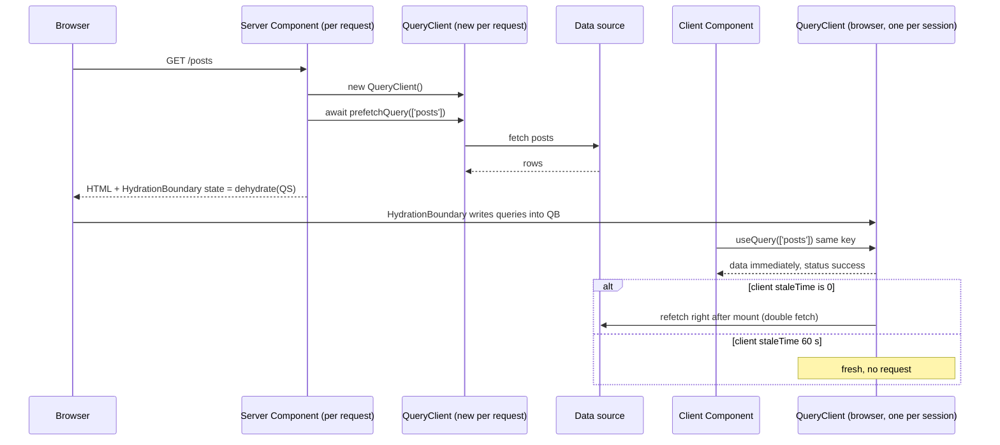
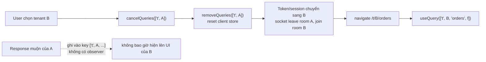

## Bối cảnh & vấn đề

Một team chuyển app React sang Next.js App Router. Họ giữ nguyên file `store.ts` quen thuộc: `export const store = configureStore({ reducer })`, và dispatch dữ liệu user trong lúc render phía server. Staging chạy ổn với một tester. Ngày lên production, một khách hàng báo: "Trang profile hiện tên của người khác trong một giây rồi mới đổi thành tên tôi." Log cho thấy hai request gần như đồng thời của hai user khác nhau.

Ở một app admin khác, bug tương tự nhưng xảy ra hoàn toàn trên trình duyệt: nhân viên hỗ trợ đổi tenant ở header, bảng đơn hàng vẫn hiện đơn của tenant cũ vài giây. Và ở app thứ ba: sau khi user A logout trên máy dùng chung, user B login và thấy thông báo, giỏ hàng và danh sách giao dịch gần đây của A.

Ba bug có chung bản chất: **state bị chia sẻ vượt ranh giới mà nó thuộc về**: ranh giới request trên server, ranh giới tenant, ranh giới phiên đăng nhập. Trên trình duyệt, một user một tab thì một store singleton là đúng. Trên server, một process phục vụ hàng nghìn user, nên singleton là rò dữ liệu. Bài này giải thích vì sao, cách làm đúng với Redux Toolkit và TanStack Query trong Next.js App Router, rồi liệt kê mọi nơi state có thể sống sót sau logout, và cách thiết kế cache khi user đổi tenant không reload. Nền về query key ở bài [TanStack Query cache](/tracks/state-management/learn/tanstack-query-cache), về `clear`/`reset` ở bài [mutation và invalidation](/tracks/state-management/learn/mutations-invalidation).

**Interview angle:** câu "vì sao phải tạo Redux store hoặc QueryClient per request trong Next.js App Router?" là câu gotcha medium; câu logout leak là câu scenario hard mà interviewer dùng để đo độ bao quát.

## Khái niệm

### Module scope trên server được dùng chung

Trong Node.js, một module được evaluate **một lần** cho mỗi process và được cache; mọi request sau đó dùng chung cùng một instance. Một biến ở module scope (`export const store = ...`, `const queryClient = new QueryClient()`) vì vậy là **biến toàn cục của server**, dùng chung giữa mọi request, mọi user, cho tới khi process restart. Trên trình duyệt, module scope chỉ thuộc về một user trong một tab, nên cùng dòng code đó vô hại.

Khi render có `await` (fetch dữ liệu), hai request có thể **xen kẽ**: request của Alice ghi `user = Alice` vào store, rồi chờ fetch; trong lúc đó request của Bob ghi `user = Bob`; khi Alice tiếp tục render, store đọc ra Bob. Đây không phải lý thuyết: Node xử lý hàng trăm request đồng thời trên một thread bằng cách xen kẽ ở mỗi `await`.

**Interview angle:** interviewer muốn nghe "module JS trên server được chia sẻ giữa mọi request" thay vì "SSR hay bị lỗi".

### Store per request với Redux Toolkit

Redux docs cho Next.js khuyến nghị ba điều. Thứ nhất, export **`makeStore()`** (factory) thay vì instance. Thứ hai, tạo store trong một **Client Component provider**, giữ bằng `useRef` để chỉ tạo **một lần** cho mỗi request khi render trên server và một lần cho mỗi phiên trên trình duyệt. Thứ ba, **Server Components không đọc store**: chúng không có hook và không có context; dữ liệu phía server lấy trực tiếp (fetch, DAL) và truyền xuống bằng props, hoặc dùng để khởi tạo store.

```tsx
"use client";
export function StoreProvider({ user, children }: { user: User; children: React.ReactNode }) {
  const storeRef = useRef<AppStore | null>(null);
  if (!storeRef.current) {
    storeRef.current = makeStore();
    storeRef.current.dispatch(sessionStarted(user));   // initialise from server data once
  }
  return <Provider store={storeRef.current}>{children}</Provider>;
}
```

Muốn store có dữ liệu từ Server Component mà không refetch trên client, truyền dữ liệu làm props vào provider và dispatch **một lần** khi tạo store (như trên), hoặc dùng `preloadedState`. Đặt provider càng sâu càng tốt (trong layout cần nó) để phần còn lại của cây vẫn là Server Components.

**Interview angle:** follow-up "làm sao pre-populate store bằng dữ liệu từ Server Component mà không fetch lại ở client?" có đáp án: props vào provider, khởi tạo trong lúc tạo store.

### QueryClient per request và hydration

Với TanStack Query, mô hình tương tự nhưng có thêm bước **dehydrate/hydrate**. Trên server, trong Server Component, tạo một `QueryClient` **mới** cho request, `await queryClient.prefetchQuery({ queryKey, queryFn })`, rồi render `<HydrationBoundary state={dehydrate(queryClient)}>` bao quanh Client Component. `dehydrate` chuyển cache thành object JSON; `HydrationBoundary` ghi nó vào QueryClient của trình duyệt. Client Component gọi `useQuery` với **cùng key** và nhận dữ liệu ngay từ cache, không có trạng thái `pending`.

Trên trình duyệt, QueryClient phải là **một instance ổn định** trong suốt phiên: tạo trong `useState(() => new QueryClient())` của provider, hoặc theo pattern `getQueryClient()` của docs: server luôn tạo mới, browser tạo một lần rồi dùng lại (để React Suspense không làm mất client khi component suspend lần đầu). Tạo `new QueryClient()` trực tiếp trong thân component làm mất cache mỗi lần render.

Hai chi tiết thực tế. `staleTime` phía client nên **lớn hơn 0** (ví dụ 60 s) khi dùng SSR; với `staleTime: 0`, dữ liệu hydrate là stale ngay và client refetch ngay sau mount, tức gọi API hai lần. Và TanStack Query v5 hỗ trợ **streaming**: prefetch không `await`, cấu hình `shouldDehydrateQuery` để dehydrate cả query đang `pending`, và promise được stream xuống client (verify theo version).

**Interview angle:** câu "khi nào bỏ hẳn TanStack Query và chỉ truyền dữ liệu từ Server Component xuống bằng props?" có đáp án: khi dữ liệu chỉ đọc, không cần refetch nền, không có mutation hay optimistic phía client.

### Mọi nơi state có thể rò sau logout

Logout không phải "xoá token". State của user có thể nằm ở ít nhất tám nơi:

| Nơi | Ví dụ | Cách dọn |
| --- | --- | --- |
| Query cache | TanStack `QueryClient`, RTK Query | `queryClient.clear()`, `dispatch(api.util.resetApiState())` |
| Client store | Redux, Zustand | Root reducer reset khi `loggedOut`; Zustand `setState(initial, true)` |
| Persisted storage | localStorage, sessionStorage, IndexedDB | Xoá key của user, hoặc key theo user id; persister `removeClient()` |
| HTTP cache, service worker | Response API cá nhân | `Cache-Control: private, no-store` cho API cá nhân; SW không cache API có auth |
| Router cache của framework | Next.js client cache (RSC payload) | Logout bằng Server Action xoá cookie (cookie đổi làm client cache bị invalidate), `router.refresh()`, hoặc hard navigation |
| Kết nối realtime | Socket vẫn mở với token cũ | `socket.disconnect()`, huỷ subscription |
| Timer, request đang bay | Polling, refetch interval, mutation chưa xong | `cancelQueries`, dừng interval, abort controller |
| Tab khác | Tab thứ hai vẫn hiển thị dữ liệu | `BroadcastChannel` báo logout |

Cách an toàn nhất cho app nhạy cảm (ngân hàng, y tế) là **full page reload** tới trang đăng nhập sau khi server huỷ session: mọi state trong memory biến mất, và header **`Clear-Site-Data: "cache", "storage"`** trên response logout có thể yêu cầu trình duyệt xoá cache và storage của origin (verify hỗ trợ trình duyệt). Với SPA muốn logout mượt, bạn phải dọn tất cả các mục trên, và nên có một hàm `logout()` duy nhất làm việc đó.

### Multi-tenant: tenant là phần đầu của mọi key

Trong app admin mà user đổi tenant không reload, **tenant id phải là phần tử đầu tiên của mọi query key**: `['t', tenantId, 'orders', filters]`. Khi đó, dữ liệu của hai tenant **không thể** trùng entry, và invalidate hay xoá theo tenant chỉ cần prefix `['t', tenantId]`. Khi switch: `cancelQueries` + `removeQueries({ queryKey: ['t', oldTenant] })` (hoặc `clear()` nếu đơn giản), reset client store theo tenant, đổi socket room, và **đưa tenant lên URL** (`/t/:tenantId/orders`) để deep link và reload giữ đúng tenant.

Quyền (permission) khác nhau theo tenant, nên quyền cũng là server state theo tenant (`['t', tenantId, 'me', 'permissions']`), một hook `useCan('order:refund')` đọc từ đó, và UI ẩn chức năng; nhưng **server vẫn là nơi chặn**. Tương tự, API client lấy tenant từ **session/token** của tenant đang active; server không bao giờ tin `tenantId` do client gửi trong param mà phải kiểm tra user có quyền trên tenant đó, nếu không đây là lỗ hổng **IDOR** (Insecure Direct Object Reference).

**Interview angle:** follow-up "request của tenant A về sau khi user đã chuyển sang tenant B, làm sao đảm bảo nó không bao giờ hiện lên UI?" có đáp án: tenant trong key làm response rơi vào entry của A (đã bị xoá hoặc không có observer), cộng thêm cancel khi switch.

## Cơ chế hoạt động

Luồng SSR với TanStack Query trong Next.js App Router:



Diễn giải. Mỗi request tạo một QueryClient **riêng** trên server, nên không có cách nào dữ liệu của request này lọt vào request khác. Server prefetch, dehydrate cache thành JSON, và gửi kèm HTML. Trên trình duyệt, `HydrationBoundary` ghi dữ liệu vào QueryClient **của phiên**, và Client Component đọc cùng key nhận dữ liệu ngay. Nhánh cuối cho thấy vì sao `staleTime` quan trọng: dữ liệu hydrate mang `dataUpdatedAt` của lúc server fetch; với `staleTime: 0` nó đã stale và observer refetch khi mount.

Luồng switch tenant an toàn:



Response muộn của tenant A (nếu không bị cancel kịp) chỉ có thể ghi vào entry có key `['t', A, ...]`, entry mà không component nào của tenant B quan sát. Tenant trong key biến lỗi race thành vô hại.

## Ví dụ thực tế

### Store ở module scope vs per request, và hydration

```ts
// 1) module-scope store on the server: two overlapping requests
const user = createSlice({ name: "user", initialState: { name: "" }, reducers: { set: (s, a: PayloadAction<string>) => { s.name = a.payload; } } });
const sharedStore = configureStore({ reducer: { user: user.reducer } });   // ❌ module scope
const makeStore = () => configureStore({ reducer: { user: user.reducer } }); // ✅ factory
async function render(req: string, delay: number, perRequest: boolean) {
  const store = perRequest ? makeStore() : sharedStore;
  store.dispatch(user.actions.set(req));
  await sleep(delay);                               // awaiting data during render
  return `${req} sees: Hello ${store.getState().user.name}`;
}
console.log("module scope:", await Promise.all([render("alice", 50, false), render("bob", 10, false)]));
console.log("per request :", await Promise.all([render("alice", 50, true), render("bob", 10, true)]));

// 2) dehydrate on the server, hydrate on the client
environmentManager.setIsServer(() => true);
const serverQc = new QueryClient();
await serverQc.prefetchQuery({ queryKey: ["posts"], queryFn: async () => ["p1", "p2"] });
const payload = JSON.parse(JSON.stringify(dehydrate(serverQc)));      // what travels in the HTML
console.log("dehydrated:", JSON.stringify(payload.queries.map((q: any) => ({ key: q.queryKey, status: q.state.status, data: q.state.data }))));
environmentManager.setIsServer(() => false);
for (const staleTime of [0, 60_000]) {
  const clientQc = new QueryClient({ defaultOptions: { queries: { staleTime } } }); clientQc.mount();
  hydrate(clientQc, payload);
  let fetches = 0;
  const o = new QueryObserver(clientQc, { queryKey: ["posts"], queryFn: async () => { fetches++; return ["p1", "p2"]; } });
  const first = o.getOptimisticResult(o.options);
  o.subscribe(() => {}); await sleep(20);
  console.log(`client staleTime=${staleTime}: first render status=${first.status} data=${JSON.stringify(first.data)}, refetches on mount=${fetches}`);
}
```

Output thật (Node 24, `@reduxjs/toolkit` 2.13.0, query-core 5.104.0):

```text
module scope: [ 'alice sees: Hello bob', 'bob sees: Hello bob' ]
per request : [ 'alice sees: Hello alice', 'bob sees: Hello bob' ]
dehydrated: [{"key":["posts"],"status":"success","data":["p1","p2"]}]
client staleTime=0: first render status=success data=["p1","p2"], refetches on mount=1
client staleTime=60000: first render status=success data=["p1","p2"], refetches on mount=0
```

Với store ở module scope, request của Alice bắt đầu trước nhưng chờ lâu hơn; trong lúc chờ, request của Bob ghi đè, và **Alice thấy "Hello bob"**. Với factory per request, mỗi request có store riêng. Phần hydration: payload dehydrate là JSON thuần (có thể nhúng vào HTML); render đầu tiên ở client có `status=success` và dữ liệu ngay, không spinner. Với `staleTime: 0`, client vẫn **refetch một lần** ngay sau mount; với `staleTime` 60 s thì không.

Trong Next.js, code tương ứng:

```tsx
// app/posts/page.tsx (Server Component)
export default async function PostsPage() {
  const queryClient = new QueryClient();                       // per request
  await queryClient.prefetchQuery({ queryKey: ["posts"], queryFn: getPosts });
  return (
    <HydrationBoundary state={dehydrate(queryClient)}>
      <Posts />                                                {/* Client Component: useQuery(["posts"]) */}
    </HydrationBoundary>
  );
}
```

### Switch tenant khi request cũ còn đang bay

```ts
const key = (t: string) => ["t", t, "orders"];
const obs = new QueryObserver(qc, { queryKey: key("acme"), queryFn: () => fetchOrders("acme", 100) }); // slow
obs.subscribe((r) => r.data && shown.push(r.data));
await sleep(20);
// user switches to globex while the acme request is still in flight
await qc.cancelQueries({ queryKey: ["t", "acme"] });
qc.removeQueries({ queryKey: ["t", "acme"] });
obs.setOptions({ queryKey: key("globex"), queryFn: () => fetchOrders("globex", 30) });
await sleep(150);
console.log(`UI showed ${JSON.stringify(shown)}; cache keys=${JSON.stringify(qc.getQueryCache().getAll().map((q) => q.queryKey))}`);
```

Output thật:

```text
tenant in key=true: UI showed ["globex orders"]; cache keys=[["t","globex","orders"]]
```

UI **chỉ** từng hiển thị dữ liệu của `globex`, và cache không còn dấu vết của `acme`. So với bug ở bài [TanStack Query cache](/tracks/state-management/learn/tanstack-query-cache#sec-vi-du-thuc-te), nơi key `['orders', page]` làm tenant thứ hai nhận nguyên cache của tenant đầu, khác biệt chỉ là vị trí của `tenantId` trong key.

### Test tự động cho logout leak

Một test E2E (Playwright) cho câu "làm sao test được?":

1. Login user A, mở các màn hình có dữ liệu cá nhân, ghi lại vài giá trị đặc trưng (tên, số đơn gần nhất).
2. Logout bằng UI.
3. Login user B **trong cùng browser context**.
4. Assert không giá trị nào của A xuất hiện trong DOM, trong `localStorage`/`IndexedDB`, và trong response được phục vụ từ cache (kiểm tra header `Cache-Control` của API cá nhân).
5. Lặp lại với hai tab mở cùng lúc: logout ở tab 1, assert tab 2 chuyển về trang đăng nhập.

Ở mức unit, kiểm tra hàm `logout()` gọi đủ: `queryClient.clear`, reset store, xoá persisted key, `socket.disconnect`. Một test như vậy sẽ bắt được regression khi ai đó thêm một nơi lưu state mới mà quên dọn.

### Behavioral: kể một bug stale-data

Khung STAR cho câu "kể một bug stale data hoặc state sync bạn đã gặp":

- **Situation**: màn hình, triệu chứng (dữ liệu cũ, dữ liệu user/tenant khác, UI nhảy), ai phát hiện (khách, QA, monitoring), mức ảnh hưởng.
- **Task/Action**: cách tái hiện (hai tenant song song, pool nhỏ, mạng chậm giả lập), cách xác định **tầng** giữ dữ liệu sai (query key, store, HTTP cache, server cache), bản sửa.
- **Result**: con số (số ticket giảm, thời gian tới khi fix) và **convention** thêm vào: key factory, rule `exhaustive-deps`, `logout()` duy nhất, test E2E ở trên.
- **Reflection**: vì sao review và test không bắt được trước đó (không có test hai user, staging chỉ một tester), và automated check nào sẽ bắt sớm hơn.

## Trade-offs & lựa chọn thay thế

| Cách lấy dữ liệu trong App Router | Refetch/mutation phía client | Rò dữ liệu giữa request | Double fetch | Hợp khi |
| --- | --- | --- | --- | --- |
| Server Component truyền props | Không (dùng `router.refresh`/revalidate) | Không có store | Không | Dữ liệu chỉ đọc, trang nội dung |
| TanStack prefetch + `HydrationBoundary` | Có (refetch nền, optimistic) | Không nếu QueryClient per request | Nếu `staleTime: 0` | Dashboard, màn hình tương tác nhiều |
| Redux store per request + props | Có (qua store/RTK Query) | Không nếu `makeStore` per request | Tuỳ | App đã dùng Redux nặng |
| Store ở module scope | Có | **Có** | N/A | Không bao giờ trên server |

| Chiến lược logout | Độ an toàn | UX | Chi phí |
| --- | --- | --- | --- |
| Full reload + `Clear-Site-Data` | Cao nhất | Chớp trang | Thấp |
| SPA: `logout()` dọn từng nơi | Cao nếu đầy đủ | Mượt | Phải duy trì danh sách |
| Chỉ xoá token | Thấp | Mượt | Bug rò dữ liệu |

Khi nào chọn cái nào. Với App Router, mặc định lấy dữ liệu trong Server Component và truyền props; chỉ dùng TanStack Query khi cần hành vi client (refetch nền, infinite, optimistic, polling). App nhạy cảm dùng full reload khi logout; app thường có thể logout mượt nhưng phải có một hàm dọn duy nhất và test E2E. Multi-tenant luôn đặt tenant trong key, trong URL, và trong session phía server.

## Edge cases & failure modes

- **Singleton ẩn**: store không ở module scope nhưng một thư viện (API client có interceptor lưu user, logger có context) giữ state theo module; cùng loại rò rỉ. Audit mọi `let` ở module scope trong code chạy trên server.
- **QueryClient tạo trong thân component**: `const qc = new QueryClient()` trong component làm mỗi render có cache mới; dữ liệu hydrate biến mất và mọi query refetch.
- **Hydrate dữ liệu của user khác**: prefetch trong layout được cache ở server (static rendering hoặc server cache chung) rồi dehydrate cho mọi user; dữ liệu cá nhân phải đi qua route động và không vào cache chung.
- **`staleTime: 0` với SSR**: mỗi trang gọi API hai lần (server và client); với 20 query/trang là 20 request thừa.
- **Logout trong lúc mutation đang bay**: `onSuccess` của mutation ghi dữ liệu user cũ vào cache **sau** `clear()`. Cancel/đợi mutation trước khi clear, hoặc reload.
- **Request muộn sau switch tenant với key thiếu tenant**: response của tenant A ghi vào key dùng chung và hiện lên UI của B; chỉ tenant trong key mới loại bỏ được lớp lỗi này một cách cấu trúc.
- **Tab khác sau logout**: tab thứ hai vẫn hiện dữ liệu và socket vẫn mở; cần broadcast logout.
- **Tin `tenantId` từ client**: sửa param là xem dữ liệu tenant khác (IDOR); server phải kiểm tra quyền từ session.

## Pitfalls

- ❌ `export const store = configureStore(...)` trong app SSR → ✅ `makeStore()` + provider `useRef`, vì module scope dùng chung giữa mọi request.
- ❌ `new QueryClient()` ở module scope cho server, hoặc trong thân component → ✅ per request trên server, một instance ổn định (`useState`) trên browser.
- ❌ Đọc Redux store trong Server Component → ✅ lấy dữ liệu trực tiếp trên server và truyền props hoặc khởi tạo store.
- ❌ Hydrate với `staleTime: 0` → ✅ `staleTime` > 0 phía client để tránh double fetch.
- ❌ Logout chỉ xoá token → ✅ một hàm `logout()` dọn cache, store, storage, socket, tab khác; hoặc full reload.
- ❌ `['orders', filters]` trong app multi-tenant → ✅ `['t', tenantId, 'orders', filters]` và dọn prefix tenant cũ khi switch.
- ❌ Server lấy `tenantId` từ query param → ✅ từ session/token, kiểm tra quyền mỗi request.

## Tóm tắt

- Module scope trên server **dùng chung giữa mọi request**; store/QueryClient singleton trên server là rò dữ liệu.
- Redux: `makeStore()` + Client Component provider giữ store bằng `useRef`; Server Components không đọc store, dữ liệu đi qua props.
- TanStack: QueryClient mới mỗi request, `prefetchQuery` + `dehydrate` + `HydrationBoundary`, cùng key ở client; `staleTime` > 0 để tránh double fetch.
- Logout phải dọn **mọi tầng**: query cache, store, persisted storage, HTTP/SW cache, router cache, socket, request đang bay, tab khác; app nhạy cảm dùng full reload.
- Multi-tenant: tenant là phần đầu của mọi key, dọn prefix khi switch, tenant trên URL, socket đổi room.
- Server luôn lấy tenant và quyền từ session, không tin tham số client.
- Viết test E2E hai user cùng browser để bắt regression rò state.
