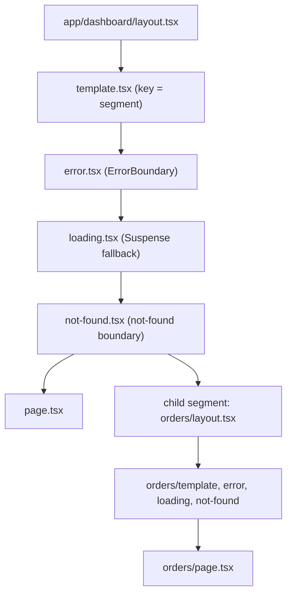
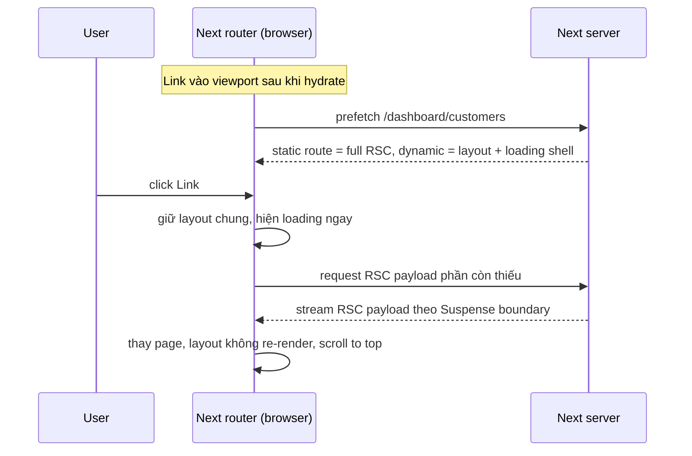

## Bối cảnh & vấn đề

Hãy hình dung một dashboard viết bằng **Pages Router** (thư mục `pages/`, có từ Next.js 9). Mỗi file trong `pages/` là một trang. Muốn có sidebar dùng chung, bạn phải tự viết pattern `getLayout()` trong `_app.tsx`. Mỗi trang lấy dữ liệu bằng `getServerSideProps`, và toàn bộ component của trang được ship xuống browser để hydrate, kể cả phần chỉ hiển thị chữ tĩnh. Khi user chuyển từ `/dashboard/orders` sang `/dashboard/customers`, sidebar vẫn giữ được vì `_app` không unmount. Nhưng mọi dữ liệu của trang mới phải chờ `getServerSideProps` chạy xong. Không có cách nào hiển thị ngay khung trang rồi đổ dần phần chậm vào sau.

Ba vấn đề lặp lại ở các codebase Pages Router lớn:

- **Bundle phình to**: component nào của trang cũng thành JavaScript ở client, kể cả những component chỉ render markdown hay bảng dữ liệu.
- **Data fetching gắn với trang, không gắn với component**: `getServerSideProps` phải lấy dữ liệu cho cả cây rồi truyền props xuống nhiều tầng (prop drilling), vì component con không thể tự lấy dữ liệu trên server.
- **Layout lồng nhau là tự chế**: layout theo từng nhánh URL (`/dashboard/*` có sidebar, `/dashboard/settings/*` có thêm tab) phải viết tay và dễ sai.

**App Router** (thư mục `app/`, ổn định từ Next 13.4) giải quyết bằng cách lấy **cây thư mục làm cây route** và cho mỗi cấp (segment) những file đặc biệt: `layout`, `page`, `loading`, `error`… Component mặc định là **React Server Component** (chạy trên server, không ship JS, xem [Server & Client Components](/tracks/nextjs/learn/server-client-components)). Streaming và Suspense là cơ chế sẵn có chứ không phải thứ gắn thêm.

Cái giá là một mô hình tư duy mới. Bài này dạy phần nền móng: cây segment, thứ tự lồng của các file đặc biệt, cách navigation và prefetch hoạt động, parallel và intercepting routes. Cuối bài là chiến lược migrate từ Pages Router mà không phải viết lại một lần.

## Khái niệm

### Route segment và cây thư mục

Trong `app/`, **mỗi thư mục là một route segment**, tương ứng với một đoạn của URL path. `app/dashboard/orders/` là segment `orders` nằm trong segment `dashboard`. Thư mục chỉ thành route **public** khi có file `page.tsx` (UI) hoặc `route.ts` (HTTP endpoint). Nhờ vậy bạn đặt được component, test hay util ngay trong thư mục route (colocation) mà không vô tình tạo URL mới. Chỉ nội dung do `page` hoặc `route` trả về mới tới client.

Ngoài thư mục thường còn vài dạng đặc biệt:

| Dạng | Ý nghĩa | Ví dụ |
| --- | --- | --- |
| `[slug]` | dynamic segment | `app/blog/[slug]/page.tsx` → `/blog/hello` |
| `[...slug]` | catch-all | `/shop/a/b/c` |
| `[[...slug]]` | optional catch-all | `/docs` và `/docs/a/b` |
| `(group)` | route group, không xuất hiện trong URL | `app/(marketing)/page.tsx` → `/` |
| `_folder` | private folder, bị loại khỏi routing | `app/blog/_components/Post.tsx` |
| `@slot` | parallel route slot | `app/@modal/...` |
| `(.)x`, `(..)x`, `(...)x` | intercepting route | `app/@modal/(.)photo/[id]` |

Route group đáng nhớ vì nó cho phép **nhiều layout khác nhau ở cùng cấp URL**: `(shop)/cart` và `(marketing)/about` đều nằm dưới `/` nhưng mỗi nhóm có layout riêng, thậm chí có root layout riêng.

**Interview angle:** câu hỏi mở đầu hay là "thư mục nào trong `app/` là public?". Câu trả lời đúng: chỉ thư mục có `page` hoặc `route`, và chỉ output của hai file đó đi xuống client.

### layout và page

**`page.tsx`** là UI riêng của một route. **`layout.tsx`** là UI bao quanh mọi route con của segment đó. Layout nhận `children`, và điểm quan trọng nhất: **layout được giữ nguyên khi navigate giữa các route con**. Nó không re-render, không mất state, không chạy lại data fetching của nó. Next gọi đây là **partial rendering**: khi đi từ `/dashboard/orders` sang `/dashboard/customers`, chỉ phần `page` thay đổi, còn `app/dashboard/layout.tsx` đứng yên.

**Root layout** (`app/layout.tsx`) là bắt buộc và phải render `<html>` cùng `<body>`. Nó thay thế cả `_app.tsx` lẫn `_document.tsx` của Pages Router.

```tsx
// app/dashboard/layout.tsx (Server Component)
export default function DashboardLayout({ children }: { children: React.ReactNode }) {
  return (
    <div className="grid grid-cols-[240px_1fr]">
      <Sidebar />      {/* rendered once, kept across child navigations */}
      <main>{children}</main>
    </div>
  );
}
```

Hệ quả của "layout không re-render" rất hay bị hỏi trong phỏng vấn: đặt **auth check trong layout là không an toàn**, vì nó không chạy lại khi user chuyển sang trang con khác (chi tiết ở [Auth & data security](/tracks/nextjs/learn/auth-data-security)).

**Interview angle:** "layout có re-render khi navigate không?" Không, trừ khi chính segment của nó (hoặc dynamic param của nó) đổi. Muốn remount thì dùng `template`.

### template: layout nhưng remount

**`template.tsx`** trông giống layout nhưng được Next gán một **`key` riêng theo segment**. Khi segment ở cấp đó đổi (kể cả dynamic param), template **remount**: state của Client Component con bị reset, `useEffect` chạy lại, DOM tạo mới. Search params không làm template remount. Theo docs, template nằm giữa `layout` và `error` của cùng segment: nó bọc `error`, `loading`, `not-found` và `page`, nhưng không bọc layout cùng cấp.

Dùng template khi bạn **muốn** reset: form feedback phải trống ở mỗi trang, analytics page-view dựa vào effect, hoặc muốn Suspense fallback hiện lại mỗi lần navigate (trong layout, Suspense fallback chỉ hiện ở lần tải đầu).

```tsx
// app/blog/template.tsx
export default function Template({ children }: { children: React.ReactNode }) {
  return <div className="fade-in">{children}</div>; // remounts on /blog/a -> /blog/b
}
```

**Interview angle:** interviewer muốn nghe "template = layout có key", tức bạn hiểu cơ chế reconciliation của React chứ không học thuộc tên file.

### loading, error, not-found

**`loading.tsx`** tự động bọc `page` trong `<Suspense fallback={<Loading/>}>`. Khi user navigate, fallback hiện ngay, layout vẫn tương tác được và navigation có thể bị ngắt. Với route dynamic, `loading.tsx` còn cho phép **prefetch một phần**: client tải trước layout và skeleton.

**`error.tsx`** là React error boundary cho segment. Nó **phải là Client Component** (`'use client'`), vì error boundary cần state để retry. **`global-error.tsx`** bắt lỗi của root layout và phải tự render `<html><body>`, vì khi nó hiện thì root layout đã hỏng. **`not-found.tsx`** hiển thị khi bạn gọi `notFound()` hoặc URL không khớp route nào. Chi tiết xử lý lỗi nằm ở bài [Server Actions & error handling](/tracks/nextjs/learn/server-actions).

### route và default

**`route.ts`** là Route Handler: export các hàm `GET`, `POST`… nhận `Request` và trả `Response`. Nó không được nằm cùng segment với `page.tsx`, vì một URL không thể vừa là trang vừa là API. **`default.tsx`** là fallback cho một parallel route slot khi Next không biết slot đó nên hiển thị gì (xem phần parallel routes bên dưới). Next 16 yêu cầu mọi slot phải có `default` tường minh. Thực tế khi chạy thử 16.3.7 có một điểm đáng chú ý, mô tả ở phần Ví dụ thực tế.

### Pages Router và App Router

Hai router khác nhau ở triết lý chứ không chỉ ở tên thư mục:

| Tiêu chí | Pages Router (`pages/`) | App Router (`app/`) |
| --- | --- | --- |
| Component mặc định | Client Component được SSR rồi hydrate toàn bộ | Server Component, chỉ phần `'use client'` hydrate |
| Data fetching | `getServerSideProps` / `getStaticProps` / `getStaticPaths` ở cấp trang | `async` component fetch ở bất kỳ đâu, `generateStaticParams` |
| Layout | `_app` + pattern `getLayout` tự chế | `layout.tsx` lồng nhau theo segment |
| Loading/streaming | không có sẵn | `loading.tsx`, `<Suspense>`, streaming HTML |
| Mutation | API route + fetch từ client | Server Actions (hoặc Route Handler) |
| API | `pages/api/*` | `app/**/route.ts` |
| Router hooks | `next/router` (`useRouter` có `query`, `asPath`) | `next/navigation` (`useRouter`, `usePathname`, `useSearchParams`, `useParams`) |
| Error/404 | `_error`, `404.tsx` | `error.tsx`, `global-error.tsx`, `not-found.tsx` theo segment |

Hai router **cùng tồn tại** được trong một project: docs nói rõ `app/` được thiết kế để chạy song song với `pages/` nhằm migrate từng trang. Có hai lưu ý. Thứ nhất, cùng một URL không được định nghĩa ở cả hai nơi. Thứ hai, **navigation giữa một route của Pages Router và một route của App Router là hard navigation** (tải lại toàn trang), và `next/link` không prefetch xuyên router. Pages Router vẫn được hỗ trợ, nhưng tính năng mới (Cache Components, Server Actions, streaming) chỉ có ở App Router.

**Interview angle:** câu follow-up kinh điển là "khi chuyển một trang có `getServerSideProps` và Redux store global sang App Router, cái gì vỡ?". Store không còn đặt ở `_app` được: phải bọc bằng một provider Client Component, và tạo store **per request** chứ không ở module scope. `getServerSideProps` biến thành fetch trong Server Component. Component đọc store phải là Client Component.

### Client-side navigation và prefetch

Layout và page được render trên server thành **RSC payload** (dạng serialize của cây Server Component, xem bài 2). Có hai kiểu server rendering: **prerender** (lúc build hoặc revalidate, kết quả được cache) và **dynamic rendering** (lúc request). Vì client phải chờ server, Next dùng ba kỹ thuật để navigation vẫn nhanh:

1. **Prefetch**: `<Link>` tự tải trước route khi link vào viewport (hoặc khi hover). Route **static** được prefetch đầy đủ. Route **dynamic** thì bỏ qua prefetch, hoặc chỉ prefetch một phần (layout + `loading.tsx`) nếu có `loading.tsx`.
2. **Streaming**: server gửi phần sẵn sàng trước, phần chậm stream vào sau.
3. **Client-side transition**: không reload trang, giữ layout chung, chỉ thay phần khác nhau, và tự scroll lên đầu.

Next 16 đại tu hệ thống này (theo upgrade guide): **layout deduplication**, tức khi prefetch nhiều URL chung một layout thì layout chỉ tải một lần, và **incremental prefetching**, tức chỉ prefetch phần chưa có trong cache. Vì vậy bạn sẽ thấy **nhiều request prefetch hơn nhưng tổng dung lượng nhỏ hơn**.

Prefetch chỉ chạy ở production. Ngoài ra `<Link>` là Client Component nên **phải hydrate xong mới prefetch được**: bundle JS lớn làm chậm hydration và chậm luôn prefetch.

**Interview angle:** trả lời "static thì prefetch đủ, dynamic thì partial nếu có `loading.tsx`" và nhắc Next 16 dedupe layout là đủ ghi điểm. Nói thêm rằng prefetch route dynamic tốn **server render** là dấu hiệu bạn đã vận hành thật.

### Parallel routes và intercepting routes

**Parallel route** dùng **slot** `@name`: thư mục `app/@modal/` tạo prop `modal` cho layout cùng cấp, render song song với `children` (bản thân `children` là một slot ngầm). Slot **không phải segment**, nên không ảnh hưởng URL: `app/@analytics/views/page.tsx` ứng với `/views`. Mỗi slot có loading/error riêng và stream độc lập.

**Intercepting route** dùng tiền tố `(.)` (cùng cấp), `(..)` (lên một cấp), `(..)(..)` (lên hai cấp), `(...)` (từ root). Nó cho phép **một navigation client-side tới URL X được render bằng một route khác** trong layout hiện tại. Quy ước này tính theo **route segment chứ không theo file system**, nên thư mục `@slot` không được tính.

Kết hợp hai thứ này ta có mẫu **modal có URL riêng**: click ảnh trong feed thì URL đổi thành `/photo/123` và ảnh hiện trong modal phủ lên feed. Refresh hoặc mở link đã share thì không có intercept, và trang `/photo/123` đầy đủ được render. Back thì modal đóng, forward thì modal mở lại.

Slot có một bẫy: Next **nhớ trạng thái active của từng slot** khi soft navigation. Nếu bạn điều hướng sang một URL mà slot không khớp, slot **vẫn giữ nội dung cũ**. Vì vậy modal "tự hiện lại" nếu bạn không cho slot khớp vào một page trả về `null` (`@modal/[...catchAll]/page.tsx`, hoặc `@modal/page.tsx` cho `/`). Khi hard navigation (refresh), Next không khôi phục được trạng thái đó và render `default.tsx` của slot.

**Interview angle:** follow-up "đóng modal rồi navigate đi chỗ khác, modal hiện lại" có đáp án: thiếu catch-all trả `null` trong slot, hoặc thiếu `default.tsx`.

## Cơ chế hoạt động

### Thứ tự lồng của file đặc biệt trong một segment

Docs mô tả component hierarchy của một segment như sau (ngoài vào trong): `layout` → `template` → `error` (error boundary) → `loading` (Suspense boundary) → `not-found` (boundary cho "not found") → `page` hoặc layout của segment con. Segment con lồng **bên trong** các component của segment cha.



Thứ tự này giải thích nhiều hành vi thường bị hỏi. `error.tsx` nằm **bên trong** layout cùng segment, nên nó **không bắt được lỗi do layout cùng cấp ném ra**: lỗi đó bay lên error boundary của segment cha, hoặc `global-error.tsx` nếu là root layout. `loading.tsx` bọc `page` nhưng **không bọc layout cùng cấp**, nên nếu layout đó await dữ liệu chậm thì navigation bị chặn trước cả khi skeleton hiện (xem [Rendering & streaming](/tracks/nextjs/learn/rendering-streaming)). `not-found` nằm trong `loading`, nên `notFound()` gọi từ page được bắt ngay trong segment.

### Vòng đời một client-side navigation



Giải thích từng bước. Sau khi trang đầu hydrate, mỗi `<Link>` lọt vào viewport sẽ khởi động prefetch. Với route static, server trả toàn bộ RSC payload (thường từ cache prerender). Với route dynamic có `loading.tsx`, client chỉ nhận phần layout và skeleton. Khi user click, router không tải lại document: nó so cây segment hiện tại với cây đích, giữ nguyên layout chung và hiện ngay loading state đã prefetch. Sau đó nó xin server phần còn thiếu, server stream về theo từng Suspense boundary, và React ghép vào cây. Không có `loading.tsx` thì bước "hiện ngay" biến mất: user click rồi thấy trang đứng yên cho đến khi server trả xong, cảm giác như app treo.

## Ví dụ thực tế

### Route table thật và bẫy `default.tsx` ở Next 16.3.7

Chạy thử trên một scratch app Next 16.3.7 có feed ảnh, modal intercept, blog với `generateStaticParams` và một dashboard đọc cookie:

```text
app/
├── layout.tsx                    # RootLayout({ children, modal })
├── page.tsx                      # feed: <Link href="/photo/1">…
├── photo/[id]/page.tsx           # full photo page
├── @modal/(.)photo/[id]/page.tsx # intercepted modal
├── blog/[slug]/page.tsx          # generateStaticParams → hello, world
└── dashboard/page.tsx            # await cookies()
```

Chưa có `app/@modal/default.tsx`, `next build` (Turbopack, mặc định ở v16) vẫn **pass**:

```text
Route (app)
┌ ○ /
├ ○ /_not-found
├ ƒ /(.)photo/[id]
├   /blog/[slug]
│ ├ ● /blog/hello
│ └ ● /blog/world
├ ƒ /dashboard
└ ƒ /photo/[id]

○  (Static)   prerendered as static content
●  (SSG)      prerendered as static HTML (uses generateStaticParams)
ƒ  (Dynamic)  server-rendered on demand
```

Nhưng `next start` rồi curl thì **mọi trang đều 404**, vì slot `@modal` không khớp URL nào và không có fallback:

```bash
for u in / /photo/1 /blog/hello /dashboard; do curl -s -o /dev/null -w "%{http_code} $u\n" localhost:3100$u; done
```

```text
404 /
404 /photo/1
404 /blog/hello
404 /dashboard
```

Build lại cùng code với `next build --webpack` thì build **fail** đúng như upgrade guide mô tả:

```text
Missing required default.js file for parallel route at app/@modal
The parallel route slot "@modal" is missing a default.js file. When using parallel routes, each slot must have a default.js file to serve as a fallback.

Create a default.js file at: app/@modal/default.js
> Build failed because of webpack errors
```

Nghĩa là ở 16.3.7, kiểm tra "build fail khi thiếu default" chỉ nằm trong loader của webpack. Với Turbopack, lỗi chỉ lộ ra lúc chạy dưới dạng 404 toàn site (verify lại khi nâng version). Thêm một dòng là sửa xong:

```tsx
// app/@modal/default.tsx
export default function Default() {
  return null; // slot renders nothing when it has no match
}
```

```text
200 /
200 /photo/1
200 /blog/hello
200 /blog/new-post
200 /dashboard
```

Để ý `/blog/new-post` (không có trong `generateStaticParams`) vẫn trả 200: mặc định param lạ được render lúc request (xem bài 3). Ký hiệu `ƒ` cho `/dashboard` là do `cookies()` khiến route thành dynamic.

### Modal ảnh hoàn chỉnh

```tsx
// app/@modal/(.)photo/[id]/page.tsx  — used on client-side navigation from the feed
import { Modal } from '@/app/ui/modal';
export default async function PhotoModal({ params }: PageProps<'/photo/[id]'>) {
  const { id } = await params;
  return <Modal><Photo id={id} /></Modal>; // Photo stays a Server Component
}

// app/@modal/[...catchAll]/page.tsx — closes the modal on any other navigation
export default function CatchAll() { return null; }

// app/ui/modal.tsx
'use client';
import { useRouter } from 'next/navigation';
export function Modal({ children }: { children: React.ReactNode }) {
  const router = useRouter();
  return (
    <dialog open onClose={() => router.back()}>
      <button onClick={() => router.back()}>Close</button>
      {children}
    </dialog>
  );
}
```

Hành vi mong đợi (minh hoạ):

```text
Click "Photo 1" trong feed   → URL /photo/1, modal hiện trên feed (intercepted)
Refresh tại /photo/1          → trang "Full photo page 1" (không intercept)
Back                          → modal đóng, về feed
Link sang /settings           → @modal khớp [...catchAll] → null, modal biến mất
```

`Modal` là Client Component nhỏ; nội dung (`Photo`) vẫn là Server Component nhờ pattern `children` (bài 2).

## Trade-offs & lựa chọn thay thế

| Quyết định | Lựa chọn A | Lựa chọn B | Khi nào chọn |
| --- | --- | --- | --- |
| Router | App Router: RSC, streaming, layout lồng, Cache Components | Pages Router: mô hình quen, hệ sinh thái lib client cũ ổn định | Project mới: App. App cũ ổn định, ít đầu tư: giữ Pages, migrate dần |
| Shared UI | `layout` (giữ state, không re-render) | `template` (remount mỗi navigation) | Mặc định layout; template khi cần reset state/effect |
| Modal | parallel + intercepting route (có URL, share được, back đóng được) | modal state thuần client | URL có ý nghĩa (ảnh, sản phẩm, login) → route; confirm dialog → state |
| Prefetch | mặc định (viewport) | `prefetch={false}` hoặc prefetch khi hover | Danh sách hàng trăm link dynamic (bảng vô hạn) → hover/tắt |
| Tổ chức code | colocate trong `app/` (private `_folder`) | để ngoài `app/` (`src/components`, `lib`) | Chọn một kiểu và nhất quán |

Chọn thế nào. Với project mới, App Router là lựa chọn mặc định vì mọi tính năng mới đều ở đó. Với app Pages Router lớn đang chạy tốt, **không có lý do kinh doanh để viết lại một lần**: migrate từng route theo giá trị (trang nặng JS, trang cần streaming). Về prefetch, đừng tắt toàn cục. Chỉ tắt ở nơi số link lớn và phần lớn là route dynamic, vì mỗi prefetch route dynamic có thể là một lần render trên server.

### Chiến lược migrate Pages → App không big-bang

1. Nâng Next, tạo `app/layout.tsx` (thay `_app` + `_document`) với provider Client Component bọc `children` (Redux, theme). Store tạo **per request** trong provider.
2. Chọn route đầu tiên ít phụ thuộc state client: trang marketing, trang chi tiết read-only. Đo JS gửi xuống và LCP trước/sau.
3. `getServerSideProps` → async Server Component gọi DAL. `getStaticProps` → cache (`'use cache'` hoặc fetch cache) + `generateStaticParams` thay `getStaticPaths`.
4. `pages/api/*` giữ nguyên (vẫn chạy); mutation mới dùng Server Actions khi hợp lý.
5. Component dùng chung giữa hai router: `next/compat/router` cho `useRouter` trong giai đoạn chuyển tiếp.
6. Guardrails: lint cấm import module server vào client (`server-only`), E2E cho các flow chính. Chấp nhận hard navigation giữa hai router trong thời gian chuyển.

Những trang nên **cố ý để lại** Pages Router: trang phụ thuộc thư viện CSS-in-JS runtime chưa hỗ trợ RSC, hoặc trang ít traffic mà chi phí migrate lớn hơn lợi ích.

## Edge cases & failure modes

- **Thiếu `default.tsx` cho slot**: webpack build fail; Turbopack build pass nhưng route không khớp slot trả 404 (đã chạy thật ở 16.3.7). Luôn tạo `default.tsx` cho mọi `@slot`, và cho `children` khi cần.
- **Slot "dính" sau soft navigation**: slot giữ subpage active cũ khi URL mới không khớp → modal hiện lại. Dùng catch-all trả `null`.
- **Slot dynamic kéo cả cấp**: docs nói không thể có slot prerender và slot dynamic ở cùng một cấp segment; một slot dynamic làm mọi slot cùng cấp dynamic.
- **Layout await dữ liệu chậm**: `loading.tsx` cùng segment không bọc layout, nên navigation bị chặn. Đẩy fetch xuống page hoặc bọc Suspense riêng.
- **Conditional slot không phải authorization**: layout trả `role === 'admin' ? admin : user` thì **cả hai slot vẫn render trên server** và output của `@admin` vẫn có trong response. Phải authorize trong page của slot hoặc DAL.
- **Cross-router navigation**: link từ trang App sang trang Pages là hard reload, mất state client và không prefetch được. Trong thời gian migrate, nhóm các trang liên quan để cùng một router.
- **Prefetch tăng tải server**: bảng vô hạn với 500 link tới route dynamic có `loading.tsx` khiến mỗi link vào viewport là một request render shell. CPU server tăng mà user không click. Dùng hover prefetch.
- **Mạng chậm**: prefetch chưa xong khi user click, nên fallback cũng chưa có. `useLinkStatus` cho phản hồi tức thì (spinner nhỏ, có delay ~100 ms để không nháy).

## Pitfalls

- ❌ Kiểm tra quyền trong `layout.tsx` và coi như mọi trang con được bảo vệ → ✅ kiểm tra ở DAL/page/action, vì layout không re-render khi navigate giữa các con.
- ❌ Dùng `useRouter` từ `next/router` trong `app/` → ✅ `next/navigation` (`useRouter`, `usePathname`, `useSearchParams`, `useParams`); `router.query`/`asPath` không còn.
- ❌ Đặt `page.tsx` và `route.ts` cùng một thư mục → ✅ tách API sang `app/api/...`.
- ❌ Quên `default.tsx` cho `@modal` vì "build vẫn pass" → ✅ luôn thêm; Turbopack không chặn lúc build ở 16.3.7 nhưng runtime trả 404.
- ❌ Dùng `template` cho mọi layout "cho chắc" → ✅ chỉ khi thật sự cần reset, vì remount làm mất state và tốn render.
- ❌ Viết modal bằng `useState` cho nội dung có URL (ảnh, sản phẩm) → ✅ parallel + intercepting route để share link, back/forward đúng.
- ❌ Migrate cả app sang App Router trong một PR → ✅ từng route, đo trước/sau, giữ `pages/api` chạy song song.
- ❌ Tắt prefetch toàn cục vì server bận → ✅ tắt/hover-prefetch ở danh sách lớn, giữ prefetch cho navigation chính.

## Tóm tắt

- Trong `app/`, thư mục = segment; chỉ `page`/`route` làm route public, nên colocation an toàn. `(group)`, `_private`, `@slot`, `(.)intercept` là các dạng đặc biệt.
- Thứ tự lồng: `layout` → `template` → `error` → `loading` → `not-found` → `page`. Vì vậy `error`/`loading` không bọc layout cùng cấp.
- Layout giữ state và không re-render khi navigate giữa các con (partial rendering); `template` có key nên remount.
- `<Link>` prefetch khi vào viewport sau hydrate: static prefetch đủ, dynamic prefetch một phần nếu có `loading.tsx`. Next 16 dedupe layout và prefetch incremental.
- Parallel (`@slot`) + intercepting (`(.)x`) = modal có URL; refresh render trang đầy đủ; catch-all trả `null` để đóng modal khi đi nơi khác.
- Next 16 yêu cầu `default.tsx` cho mọi slot; ở 16.3.7 webpack build fail, Turbopack build pass nhưng runtime 404 (verify).
- Pages và App Router cùng tồn tại; navigation giữa hai router là hard navigation. Migrate từng route, không big-bang.
