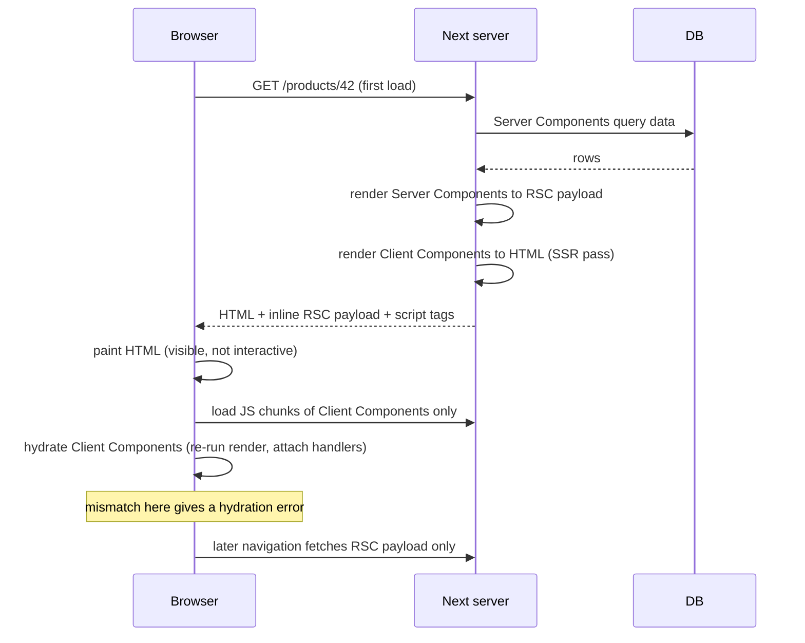
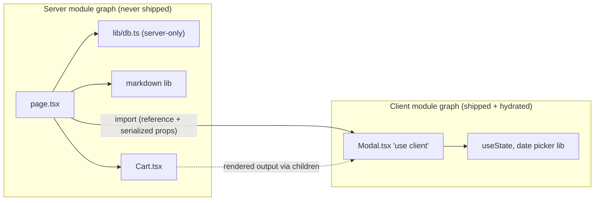

## Bối cảnh & vấn đề

Một team migrate trang chi tiết sản phẩm sang App Router. Header của trang có một ô search nhỏ dùng `useState`, nên ai đó thêm `'use client'` vào đầu `layout.tsx` để "cho chạy được". Build pass, trang chạy. Hai tuần sau, Lighthouse báo JavaScript tăng 180 KB. Thư viện render markdown, bộ syntax highlighter và cả client của ORM đều bị kéo vào bundle browser, vì mọi thứ layout import đều thành code client. Một bug khác xuất hiện cùng lúc: user ở Việt Nam thấy lỗi hydration trên danh sách đơn hàng, user ở Mỹ thì không.

Hai sự cố có chung một gốc: không hiểu **ranh giới Server/Client** thật sự là gì. Trong App Router, mặc định mọi component là **Server Component**: code chạy trên server, không bao giờ tới browser. **Client Component** là component có code **cũng** chạy ở browser (sau khi đã chạy trên server để tạo HTML). Chọn sai phía thì trả giá bằng bundle to, lộ dữ liệu, hoặc lỗi hydration.

Bài này giả định bạn đã quen state, effect, Suspense và reconciliation của React (xem [track React](/tracks/react)). Nó giải thích ranh giới đó theo cách compiler nhìn nó: ranh giới **module graph** và ranh giới **dữ liệu serialize**. Ta sẽ xem một **RSC payload thật** để thấy chính xác cái gì đi xuống browser.

## Khái niệm

### Server Component

**Server Component** là component React chỉ chạy trên server, lúc build (prerender) hoặc lúc request. Nó có thể là `async`, đọc database, filesystem hay secret trực tiếp trong lúc render mà không cần một API route trung gian. Code của nó **không bao giờ ship xuống browser**: thư viện nặng mà nó import (markdown, date-fns, SDK) không làm tăng bundle.

Đổi lại, Server Component **không có state, không có effect, không có event handler**: không `useState`, `useEffect`, `onClick`, không đọc `window`. Muốn cập nhật UI của nó thì phải render lại trên server (navigation, refresh, revalidate) và gửi RSC payload mới.

```tsx
// app/orders/page.tsx — Server Component (default)
import { db } from '@/lib/db';
export default async function OrdersPage() {
  const orders = await db.order.findMany({ take: 20 }); // runs on the server only
  return <ul>{orders.map((o) => <li key={o.id}>{o.code}</li>)}</ul>;
}
```

### Client Component

**Client Component** là component nằm trong client module graph, thường do một file có `'use client'` ở đầu mở ra. Hiểu lầm lớn nhất là nghĩ "Client Component chỉ chạy ở client". Thực tế, ở lần tải đầu nó **chạy hai lần**: một lần trên server để tạo HTML (SSR hoặc prerender), rồi một lần nữa ở browser khi **hydrate**. Hydrate là bước React gắn event handler vào HTML có sẵn và kiểm tra output có khớp không. Khi navigation client-side, nó chỉ render ở browser dựa trên RSC payload.

Vì chạy trên server lúc prerender, Client Component **không được** đụng vào `window` hay `localStorage` ngay trong thân render. Phải đưa vào `useEffect`, event handler, hoặc lazy initializer có kiểm tra `typeof window`.

| | Chạy trên server | Chạy trong browser |
| --- | --- | --- |
| Server Component | Có | Không |
| Client Component | Có (tạo HTML) | Có (hydrate + cập nhật) |

**Interview angle:** câu "Client Component có được SSR không?" là bẫy. Có, nó vẫn có HTML ở lần tải đầu. "Client" nghĩa là code **cũng** chạy ở browser.

### `'use client'` là ranh giới module graph

`'use client'` đặt ở đầu file đánh dấu **điểm vào** của nhánh client. Theo docs, khi một file có directive này, **mọi module nó import và mọi component nó render trực tiếp** đều vào client bundle. Vì vậy bạn **không cần** thêm `'use client'` vào từng component con, chỉ cần ở entry point. Đây là lý do `'use client'` trên `layout.tsx` kéo cả thư viện markdown vào bundle.

Có một ngoại lệ quan trọng: directive **không áp dụng cho Server Component được truyền vào qua `children` hoặc prop JSX**. Những component đó không được import vào module graph của Client Component, mà được render trên server rồi truyền xuống dưới dạng kết quả đã render.

Đừng nhầm với **`'use server'`**: nó đánh dấu **Server Function** (Server Action), tức hàm có thể gọi từ client qua POST, **không phải** "Server Component". Server Component không cần directive nào.

Thư viện bên thứ ba dùng `useState` mà không có `'use client'` (ví dụ một carousel cũ) sẽ báo lỗi khi dùng thẳng trong Server Component, vì Next không biết nó cần client. Cách sửa là bọc lại:

```tsx
// app/ui/carousel.tsx
'use client';
export { Carousel as default } from 'acme-carousel';
```

**Interview angle:** interviewer muốn nghe chữ "module graph", tức `'use client'` là ranh giới **import**, không phải ranh giới **render tree**.

### RSC payload

**RSC payload** là dạng serialize gọn của cây Server Component đã render. Theo docs, nó chứa ba thứ: (1) kết quả render của Server Components, (2) **placeholder** cho chỗ đặt Client Component kèm tham chiếu tới file JS của chúng, (3) **mọi props được truyền từ Server Component xuống Client Component**. Ở lần tải đầu, payload được **inline trong HTML**. Khi navigation, client fetch payload riêng (response `Content-Type: text/x-component`).

Hệ quả bảo mật: **mọi prop truyền xuống Client Component là public**, xem được bằng View Source hay DevTools, dù component chỉ hiển thị một field. Phần Ví dụ thực tế cho thấy điều này trên payload thật.

### Props qua ranh giới phải serializable

Dữ liệu đi qua ranh giới bằng props, nên props phải **serializable bởi React**: primitive, plain object/array, `Date`, `Map`, `Set`, `BigInt`, typed array, `Promise` (client đọc bằng `use()`), React element đã render (JSX), và **Server Function** (`'use server'`), được truyền dưới dạng tham chiếu. Không qua được: function thường (event handler, callback), class instance có method, Symbol không đăng ký.

Truyền `onClick` từ Server Component xuống sẽ throw ngay lúc prerender, như lỗi thật ở phần Ví dụ. Muốn "truyền handler", có hai cách: đưa logic handler vào chính Client Component (nhận dữ liệu thay vì nhận hàm), hoặc truyền một **Server Action**. TypeScript plugin của Next chấp nhận prop kiểu function nếu tên là `action` hoặc kết thúc bằng `Action`, còn các prop function khác thì bị cảnh báo.

**Interview angle:** trả lời "`Date`, `Map`, `Set`, Promise qua được; function thì chỉ Server Action" là đúng trọng tâm. Nói thêm "props nằm trong payload nên phải là DTO" là điểm cộng.

### Children slot: Server Component bên trong Client Component

Client Component **không import được** Server Component: import vào client graph thì nó thành client. Nhưng nó **nhận được** Server Component qua `children` hay prop JSX. Docs gọi hai vai trò này là **owner** và **parent**. Component viết JSX của con là owner. Component chứa con trong cây render là parent. Nếu `Page` (server) viết `<Modal><Cart/></Modal>` thì `Page` là owner của `Cart`, nên `Cart` render trên server. `Modal` (client) chỉ là parent: nó nhận **output** của `Cart` để đặt vào slot, không bao giờ thấy code của `Cart`.

```tsx
// app/page.tsx (Server Component)
import Modal from './ui/modal'; // 'use client'
import Cart from './ui/cart';   // Server Component, reads DB
export default function Page() {
  return <Modal title={<h2>Your cart</h2>}><Cart /></Modal>;
}
```

Vì `Cart` đã render xong trước khi tới `Modal`, **`Modal` không thể truyền props vào `Cart`**. Muốn `Cart` phụ thuộc state của modal thì hoặc chuyển state lên URL (search params) để server render lại, hoặc để phần phụ thuộc state thành client.

Compound component có một bẫy liên quan: `Menu.Item` (static property) của một Client Component, khi dùng từ Server Component, sẽ là `undefined`, vì server chỉ nhận **client reference** chứ không nhận object function. Kết quả là lỗi "Element type is invalid". Giải pháp là export `MenuItem` thành named export.

### Context provider trong App Router

Server Component **không dùng được React Context**. Cách chuẩn là tạo provider là một Client Component nhận `children`, rồi render nó trong `layout` (Server Component). Theo docs, nên đặt provider **càng sâu càng tốt**, bọc `{children}` thay vì cả `<html>`, để phần tĩnh của Server Components dễ tối ưu.

Instance mutable như QueryClient hay Redux store phải tạo **bên trong** provider (`useState(() => new QueryClient())`), **không** ở module scope. Lý do: module của Client Component cũng được load trên server để SSR, và một biến module-scope trên server sống qua **mọi request** của process. Nếu store được tạo ở module scope, cache của user A có thể rò sang HTML render cho user B.

```tsx
// app/providers.tsx
'use client';
import { QueryClient, QueryClientProvider } from '@tanstack/react-query';
import { useState } from 'react';
export function Providers({ children }: { children: React.ReactNode }) {
  const [client] = useState(() => new QueryClient()); // one per browser tab / per SSR request
  return <QueryClientProvider client={client}>{children}</QueryClientProvider>;
}
```

Dữ liệu server cần đưa vào provider thì fetch ở layout rồi truyền props, hoặc truyền **promise** để Client Component đọc bằng `use()` bên trong Suspense.

**Interview angle:** câu "vì sao QueryClient không được tạo ở module scope?" kiểm tra bạn có hiểu Client Component cũng chạy trên server, trong một process dùng chung giữa các request, hay không.

### Hydration mismatch

**Hydration mismatch** là khi HTML server tạo ra khác với output lần render đầu ở browser. React phát hiện, báo lỗi, rồi render lại phía client từ error/Suspense boundary gần nhất. User thấy nháy, và mọi chỉnh sửa DOM trước đó trong boundary bị mất. Nguyên nhân kinh điển là giá trị **phụ thuộc môi trường**: `toLocaleString()` hay `Intl.DateTimeFormat` dùng timezone/locale của server (thường UTC), còn browser dùng của user; `Date.now()`, `Math.random()`, `typeof window` trong render; HTML không hợp lệ (`<div>` trong `<p>`); extension trình duyệt (Google Translate) sửa DOM trước khi React hydrate.

## Cơ chế hoạt động



Diễn giải. Khi request tới, server chạy **Server Components** trước: chúng query dữ liệu và tạo RSC payload, trong đó Client Component chỉ là placeholder kèm props đã serialize. Tiếp theo, server dùng payload cùng code của Client Components để render ra **HTML** cho lần tải đầu. Browser nhận HTML nên hiển thị ngay (FCP sớm), nhưng chưa bấm được gì. Sau đó browser tải **chỉ JS của Client Components** (không có code của Server Components) và hydrate: React chạy lại render của Client Components ở browser và so với DOM. Nếu output khác (ví dụ ngày format theo timezone khác), đó là hydration error. Ở các navigation sau, browser chỉ xin RSC payload, và Client Components render hoàn toàn ở browser mà không cần HTML từ server.

Ranh giới module graph trông như sau:



`page.tsx` import `Modal`, nhưng thứ server nhận được chỉ là **client reference**. Props của `Modal` được serialize vào payload. `Cart` đi vào `Modal` qua đường chấm (output đã render), không qua import, nên thư viện của `Cart` không bao giờ vào bundle.

## Ví dụ thực tế

### Xem props thật trong RSC payload

Scratch app Next 16.3.7, một Server Component truyền nguyên "record DB" xuống Client Component chỉ hiển thị tên:

```tsx
// app/rsc/page.tsx (Server Component)
import ProfileCard from './card'; // 'use client'
export default function Page() {
  const user = {
    name: 'An', passwordHash: '$2b$10$abcHASH', internalNote: 'VIP - do not refund',
    joined: new Date('2024-03-01T00:00:00Z'), tags: new Set(['b2b', 'beta']),
  };
  return <ProfileCard user={user} />;
}

// app/rsc/card.tsx
'use client';
export default function ProfileCard({ user }: { user: { name: string; joined: Date; tags: Set<string> } }) {
  return <p>{user.name} · joined {user.joined.getUTCFullYear()} · {user.tags.size} tags</p>;
}
```

Sau `next build && next start`, lấy RSC payload như router làm khi navigate:

```bash
curl -s -L -H "RSC: 1" localhost:3100/rsc | grep -a -o '\["\$","\$L5".\{0,170\}'
curl -s -D - -o /dev/null -L -H "RSC: 1" localhost:3100/rsc | grep -i "content-type\|vary"
```

```text
["$","$L5",null,{"user":{"name":"An","passwordHash":"$$2b$10$abcHASH","internalNote":"VIP - do not refund","joined":"$D2024-03-01T00:00:00.000Z","tags":"$W6"}}]
Vary: rsc, next-router-state-tree, next-router-prefetch, next-router-segment-prefetch, Accept-Encoding
Content-Type: text/x-component
```

Đọc output: `$L5` là **placeholder** cho Client Component `ProfileCard` (lazy reference tới chunk JS). Props được serialize nguyên vẹn, **kể cả `passwordHash` và `internalNote`** mà component không hề dùng. `Date` được mã hoá thành `$D…`, `Set` thành tham chiếu `$W6`, nên chúng qua được ranh giới. HTML của lần tải đầu cũng chứa đúng chuỗi này trong script inline. Sửa bằng DTO:

```tsx
return <ProfileCard user={{ name: user.name, joined: user.joined, tags: user.tags }} />;
```

### Truyền function qua ranh giới: lỗi thật lúc build

```tsx
// app/fn/page.tsx (Server Component)
import Btn from './btn'; // 'use client', props: { onPick: () => void }
export default function Page() {
  return <Btn onPick={() => console.log('picked')} />;
}
```

```text
Error occurred prerendering page "/fn". Read more: https://nextjs.org/docs/messages/prerender-error
Error: Event handlers cannot be passed to Client Component props.
  {onPick: function onPick}
           ^^^^^^^^^^^^^^^
If you need interactivity, consider converting part of this to a Client Component.
Export encountered an error on /fn/page: /fn, exiting the build.
```

Trang này static nên lỗi lộ ngay khi prerender lúc build. Với trang dynamic, cùng lỗi đó xảy ra lúc request.

### Hydration error "chỉ ở một số quốc gia"

Danh sách đơn hàng là Client Component (có filter) và render `new Date(order.createdAt).toLocaleDateString('en-US')`. Server chạy UTC. Cùng một timestamp cho ra kết quả khác nhau theo timezone (chạy thật bằng Node):

```bash
for tz in UTC Asia/Ho_Chi_Minh America/Los_Angeles; do
  TZ=$tz node -e "const d=new Date('2026-06-15T23:30:00Z'); console.log(process.env.TZ.padEnd(20), d.toLocaleDateString('en-US'))"
done
```

```text
UTC                  6/15/2026
Asia/Ho_Chi_Minh     6/16/2026
America/Los_Angeles  6/15/2026
```

Đơn tạo lúc 23:30 UTC hiển thị "6/15" trong HTML của server. Browser ở Việt Nam (UTC+7) hydrate ra "6/16", nên bị mismatch. Browser ở Mỹ ra "6/15", trùng với server, nên không lỗi. Vì vậy bug chỉ xuất hiện "ở một số quốc gia" và chỉ với những đơn gần nửa đêm UTC. Tiền tệ cũng vậy: `1234.5` định dạng thành `1.234,50 €` (de-DE) hay `€1,234.50` (en-US).

Các cách sửa, theo thứ tự ưu tiên:

1. **Format trên server với timezone của user** (lưu trong profile/cookie) và truyền **chuỗi đã format** xuống, để hai phía chắc chắn giống nhau.
2. **Inline script + `suppressHydrationWarning`** trên đúng node thời gian (theo guide "preventing flash"): script chạy đồng bộ trước lần paint đầu và sửa text theo locale browser, còn React chấp nhận DOM. Dùng `<time dateTime=...>` cho SEO.
3. **Chỉ render ở client sau mount** (`useEffect`): hết lỗi nhưng có nháy.

Tái hiện ở local: `TZ=UTC LANG=ja_JP.UTF-8 next dev` và đổi timezone browser trong DevTools › Sensors. React 19 in diff chi tiết của mismatch trong console dev.

## Trade-offs & lựa chọn thay thế

| Tiêu chí | Server Component | Client Component |
| --- | --- | --- |
| JS gửi xuống | 0 cho code của nó | code + mọi thứ nó import |
| Dữ liệu | đọc DB/secret trực tiếp, gần nguồn | qua props/Server Action/fetch API |
| Tương tác | chỉ HTML thuần (`<form action>`, `<details>`) | state, effect, event, browser API |
| Cập nhật UI | cần round-trip server (navigate/refresh/revalidate) | tức thì ở client |
| Rủi ro | truyền dữ liệu nhạy cảm xuống client qua props | bundle to, hydration mismatch, không có secret |

Chọn thế nào: **Server mặc định, `'use client'` ở lá**. Ba ví dụ Server: trang đọc DB, bài viết markdown có syntax highlight, trang SEO (sản phẩm, blog). Ba ví dụ Client: nút Like có state, ô search-as-you-type, bản đồ hay chart tương tác, component đọc `localStorage` hay geolocation. Khi layout có một phần tương tác nhỏ, tách phần đó thành component client riêng thay vì đánh dấu cả layout. Khi một Client Component cần hiển thị nội dung server, dùng `children` thay vì import.

### Tiêu chí thực tế khi migrate một màn hình SPA

Khi chuyển một màn hình React SPA hay Pages Router sang App Router, đi theo từng component:

- Có `useState`/`useEffect`/event/browser API/custom hook → **client**. Tách phần nhỏ nhất có tương tác (nút, input) thành lá client.
- Chỉ hiển thị dữ liệu → **server**, và chuyển data fetching từ `useEffect` + API lên component server.
- Thư viện chỉ chạy client (chart, editor) → bọc wrapper `'use client'`, có thể lazy load.
- Global store → provider client, store per request.
- CSS-in-JS runtime (styled-components, emotion) → cần registry cho SSR hoặc chuyển sang CSS Modules/Tailwind.
- Guardrail: `import 'server-only'` trong module DB/secret để import nhầm vào client thành **lỗi build**. Đo JS gửi xuống và LCP trước/sau để chứng minh lợi ích.

## Edge cases & failure modes

- **`'use client'` ở layout gốc**: toàn bộ cây con thành client (trừ phần đi qua `children`), bundle phình. Tìm bằng bundle analyzer; đẩy directive xuống lá.
- **Module-scope singleton trong Client Component**: sống qua mọi request SSR của process → rò state giữa user. Tạo trong `useState`/`useRef`.
- **Truy cập `window` trong render của Client Component**: crash lúc prerender (`window is not defined`). Đưa vào effect hoặc dynamic import `ssr: false` trong một Client Component.
- **Serialize object lớn**: truyền mảng 5.000 sản phẩm xuống client làm payload và HTML rất nặng (payload inline trong HTML), tăng TTFB và bộ nhớ. Chỉ truyền trang hiện tại.
- **Class instance mất method**: `Decimal`, `Money` hay model ORM qua ranh giới bị lỗi hoặc thành plain object. Chuyển sang string/number trước.
- **Compound component** `Menu.Item` từ Server Component → `undefined` → "Element type is invalid". Dùng named export.
- **Hydration mismatch lan rộng**: không có `suppressHydrationWarning` thì React render lại từ boundary gần nhất; mọi sửa DOM bằng inline script trong boundary đó bị mất.
- **Extension dịch trang**: Google Translate thay text node → lỗi hydration hoặc `removeChild` crash ở cập nhật sau. Không sửa được từ code phía bạn; ghi nhận và lọc trong error tracking.

## Pitfalls

- ❌ Thêm `'use client'` vào layout vì có một ô search → ✅ tách `Search` thành component client, layout vẫn là server.
- ❌ Nghĩ `'use server'` đánh dấu Server Component → ✅ nó đánh dấu Server Function (action); Server Component là mặc định, không cần directive.
- ❌ Truyền nguyên record DB xuống Client Component → ✅ DTO chỉ gồm field cần hiển thị, vì props nằm nguyên trong RSC payload.
- ❌ Truyền `onClick` từ Server Component → ✅ để handler trong Client Component, hoặc truyền Server Action.
- ❌ Import Server Component vào Client Component → ✅ nhận qua `children`/prop JSX từ owner là server.
- ❌ `const queryClient = new QueryClient()` ở module scope → ✅ `useState(() => new QueryClient())` trong provider.
- ❌ `toLocaleDateString()` trong Client Component render ở cả hai phía → ✅ format ở server theo timezone user, hoặc inline script + `suppressHydrationWarning` trên đúng node.
- ❌ Rải `suppressHydrationWarning` lên container lớn để "tắt lỗi" → ✅ chỉ đặt trên node text thực sự khác (nó chỉ có tác dụng một cấp).

## Tóm tắt

- Server Component chạy chỉ trên server, không ship JS, đọc DB/secret trực tiếp; không state/effect/event.
- Client Component chạy trên server (tạo HTML) **và** trong browser (hydrate); `'use client'` là ranh giới **module graph**: file đó và mọi thứ nó import vào client bundle.
- RSC payload chứa output server, placeholder client (`$L…`) và **mọi props** truyền xuống; payload thật cho thấy field thừa như `passwordHash` bị lộ.
- Props phải serializable: primitive, object, `Date` (`$D`), `Map`/`Set`, Promise, JSX, Server Action; function thường thì throw "Event handlers cannot be passed to Client Component props".
- Children slot: owner là server thì con render trên server; Client Component chỉ đặt output vào slot và không truyền props vào con được.
- Provider là Client Component bọc `children`, đặt sâu nhất có thể; store/QueryClient tạo per instance, không module scope.
- Hydration mismatch theo timezone/locale: format ở server theo timezone user, hoặc inline script + `suppressHydrationWarning`; tái hiện bằng `TZ=UTC` + DevTools Sensors.
