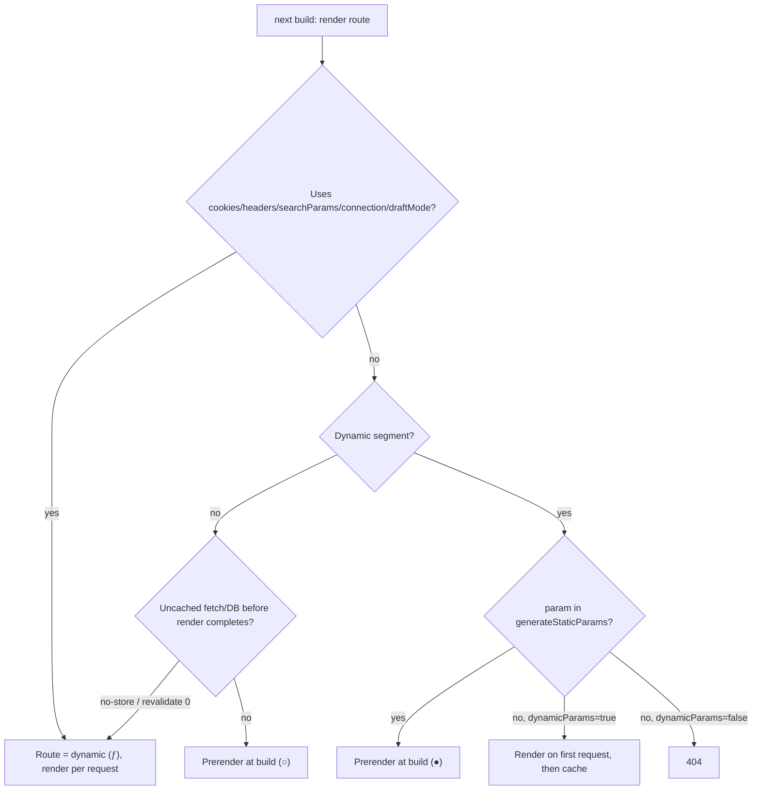
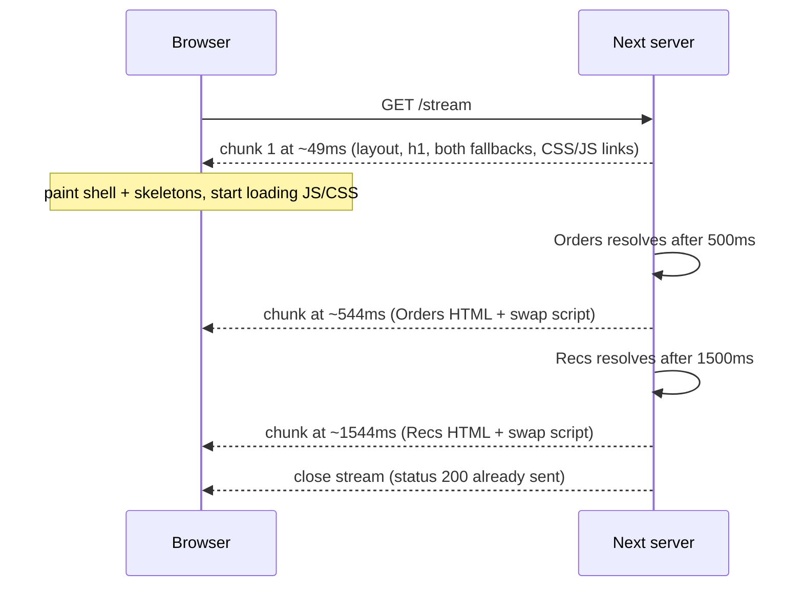

## Bối cảnh & vấn đề

Trang dashboard của một user mất **1,8 giây** mới có byte đầu tiên, dù mỗi query chỉ tốn khoảng 600 ms. Người review code nhìn vào page và thấy ba dòng `await` nối tiếp nhau. Một trang khác, trang chi tiết sản phẩm, bị báo là "chậm như SSR" dù team tin rằng nó được prerender, vì build output ghi `ƒ` (dynamic) thay vì `○`. Nguyên nhân: layout gọi `await cookies()` để lấy tên user hiển thị ở header.

Cả hai đều là câu hỏi về **khi nào và bằng cách nào HTML được tạo ra**. Next.js có hai thời điểm render trên server: **prerender** (lúc build hoặc khi revalidate, kết quả được cache) và **dynamic rendering** (mỗi request). Kết hợp với **streaming**, tức gửi HTML thành nhiều chunk theo `<Suspense>` boundary, chúng quyết định TTFB, LCP và tải server.

Bài này dạy mô hình rendering chung cho mọi phiên bản Next 15/16, không phụ thuộc Cache Components: cái gì làm route dynamic, vì sao request API ở Next 16 là async, `generateStaticParams`, cách streaming hoạt động (đo bằng timing chunk thật), waterfall, và metadata cho SEO và bot. Phần static shell/PPR của Cache Components nằm ở [bài 5](/tracks/nextjs/learn/cache-components).

## Khái niệm

### Prerender (static rendering)

**Prerender** là render route trước khi có request, lúc `next build` hoặc khi revalidate, rồi lưu HTML và RSC payload vào cache để phục vụ lại. Trong build output nó hiện là `○` (static) hoặc `●` (SSG, từ `generateStaticParams`). Response của route prerender có thể cache ở CDN: bản chạy thật trả `Cache-Control: s-maxage=31536000` và `x-nextjs-cache: HIT`.

Lợi ích rất rõ: TTFB gần như bằng thời gian đọc file, server không tốn CPU cho mỗi request. Cái giá là dữ liệu cũ tới khi revalidate, và không có gì phụ thuộc request (cookie, header).

### Dynamic rendering

**Dynamic rendering** là render lúc request vì route cần dữ liệu chỉ có khi đó. Route bị đánh dấu `ƒ`. Theo docs và upgrade guide, những thứ khiến rendering phải chờ request (gọi là **Request-time APIs**) gồm: `cookies()`, `headers()`, `draftMode()`, `searchParams`, `connection()`. Thêm vào đó là `params` của segment không có trong `generateStaticParams` (hoặc không có hàm này), `fetch`/DB không được cache, và giá trị không xác định như `Math.random()` hay `Date.now()` khi bật Cache Components.

Ở mô hình **không bật Cache Components** (mặc định Next 15/16), ranh giới nằm ở **cấp route**: chỉ cần một component trong cây gọi `cookies()` là **cả route** thành dynamic. Với Cache Components, ranh giới hạ xuống **cấp component**: phần trong `<Suspense>` là dynamic, phần còn lại vẫn vào static shell. Docs gọi đây là "static và dynamic là một phổ, không phải nhị phân".

Cách biết một route static hay dynamic: xem ký hiệu trong output `next build` (`○ ● ƒ`), hoặc dùng Next.js DevTools indicator khi `next dev`. Response header cũng giúp: route dynamic trả `Cache-Control: private, no-cache, no-store...`.

**Interview angle:** interviewer hay hỏi "một `cookies()` trong layout ảnh hưởng gì?". Trả lời: không có Cache Components thì cả route và mọi trang con dùng layout đó thành dynamic; có Cache Components thì build báo lỗi blocking route nếu không có Suspense bao quanh.

### Async Request APIs ở Next 16

Next 15 chuyển `params`, `searchParams`, `cookies()`, `headers()`, `draftMode()` sang **Promise**, nhưng vẫn cho truy cập đồng bộ tạm thời (có warning). **Next 16 xoá hẳn truy cập đồng bộ**: chỉ còn `await` (hoặc `use()` trong Client Component). Danh sách trong upgrade guide gồm `params` trong `layout`, `page`, `route`, `default`, và các image function `opengraph-image`, `twitter-image`, `icon`, `apple-icon`; `searchParams` trong `page`. Cũng ở Next 16, `id` của image function và của `sitemap` (từ `generateSitemaps`) trở thành Promise.

**Vì sao đổi?** Khi request data là Promise, framework có thể render mọi thứ **không cần** request data trước, và chỉ dừng lại ở đúng chỗ bạn `await`. Đọc request data càng sâu trong cây thì phần prerender được càng lớn. Đó là nền tảng của streaming và PPR. Nếu `params` là object đồng bộ, framework phải có sẵn request trước khi render bất kỳ thứ gì.

```tsx
// app/blog/[slug]/page.tsx — Next 16
export default async function Page(props: PageProps<'/blog/[slug]'>) {
  const { slug } = await props.params;
  const { page = '1' } = await props.searchParams;
  return <Post slug={slug} page={Number(page)} />;
}
```

`PageProps`, `LayoutProps`, `RouteContext` là type helper toàn cục do `next typegen` sinh ra (có từ 15.5). Codemod: `npx @next/codemod@canary next-async-request-api .`. Lưu ý là codemod `upgrade` **không** chạy codemod này, phải gọi riêng.

**Interview angle:** câu "tại sao `params` là Promise?" cần trả lời bằng cơ chế ("để defer, render phần không phụ thuộc request trước") chứ không phải "vì Next đổi API".

### `generateStaticParams` và `dynamicParams`

`generateStaticParams` trả về danh sách params để **prerender lúc build** cho dynamic segment. Nó thay `getStaticPaths` của Pages Router và dùng được ở page, layout và cả Route Handler. Params **không có** trong danh sách: mặc định (`dynamicParams = true`) được render lúc request lần đầu rồi cache (hành vi kiểu ISR). Đặt `export const dynamicParams = false` thì chúng trả **404**. Hàm phải trả về một mảng; trả mảng rỗng nghĩa là "không prerender gì lúc build, render lần đầu lúc request". Không prerender hết một triệu sản phẩm, chỉ top N, phần còn lại render theo nhu cầu.

Với **Cache Components** có các khác biệt: `dynamicParams` không còn được hỗ trợ (dùng `notFound()` cho param không hợp lệ), `generateStaticParams` phải trả **ít nhất một** param (mảng rỗng là build error), và URL chưa biết được phục vụ bằng App Shell rồi nâng cấp dần. Chi tiết ở bài 5.

### Streaming, `loading.tsx` và `<Suspense>`

**Streaming** gửi response theo **chunked transfer encoding**: server gửi phần đã sẵn sàng trước, rồi mỗi `<Suspense>` boundary khi resolve sẽ gửi thêm một chunk chứa HTML hoàn chỉnh cùng một inline script để thay fallback. Browser thay ngay mà không cần chờ JS bundle hay hydration.

**`loading.tsx`** là cách đơn giản nhất: Next bọc `page` của segment trong `<Suspense fallback={<Loading/>}>`. Nó nằm **trong** `layout` cùng segment, nên layout render ngay, còn skeleton hiện như fallback. Ưu điểm riêng của `loading.tsx`: fallback của nó **được prefetch** khi navigate. `<Suspense>` thủ công thì không được prefetch mặc định, nhưng chi tiết hơn: mỗi phần chậm stream riêng, các boundary anh em không chặn nhau.

**Khi nào `loading.tsx` không đủ?** Khi **layout** của chính segment đó await dữ liệu request-time hoặc dữ liệu chậm. Layout nằm **ngoài** boundary của `loading`, nên nó chặn cả response lẫn navigation trước khi skeleton kịp hiện. Cách sửa là bọc phần dynamic trong layout bằng `<Suspense>` riêng, hoặc chuyển fetch xuống page.

Streaming cần mọi tầng giữa server và browser **không buffer** (nginx `X-Accel-Buffering: no`, xem [bài 11](/tracks/nextjs/learn/self-hosting-production)).

**Interview angle:** câu mạnh là "`loading.tsx` = Suspense bọc page, prefetch được; không bọc layout cùng cấp nên layout chậm vẫn chặn".

### HTTP contract khi đã stream

Chunk đầu tiên gửi đi cùng status và header, nên **sau khi stream bắt đầu, status code không đổi được nữa**. Nếu `notFound()` xảy ra giữa stream, Next không thể đổi 200 thành 404; nó chèn `<meta name="robots" content="noindex">`. `redirect()` giữa stream thành client-side redirect. Muốn có 404 thật thì gọi `notFound()` **trước** mọi `await` chậm hoặc Suspense boundary (một existence check nhanh), hoặc chặn từ proxy. Lỗi xảy ra giữa stream được `error.tsx` gần nhất thay thế tại chỗ, phần còn lại của trang giữ nguyên.

### Metadata và bot

`export const metadata` (tĩnh) hoặc `export async function generateMetadata({ params })` (động) đặt title, description, Open Graph… Metadata được **merge theo cây** (con ghi đè cha, có `title.template`). `fetch` trong `generateMetadata` được **memoize** cùng với page, layout và `generateStaticParams` trong cùng một render. Nếu không dùng `fetch` (ví dụ ORM) thì bọc hàm bằng `React.cache` để page và metadata chỉ query một lần.

Từ Next 15.2 có **streaming metadata**: với browser và bot chạy JavaScript (Googlebot), Next **không chờ** `generateMetadata`; nó gửi UI trước rồi append thẻ metadata vào `<body>` khi resolve. Với **HTML-limited bot** (nhận diện theo user agent: `facebookexternalhit`, `Twitterbot`, `Slackbot`, `Bingbot`…), metadata **chặn render** và nằm trong `<head>`. Option `htmlLimitedBots` override danh sách. Phần ví dụ đo điều này bằng chạy thật.

File-based metadata: `opengraph-image.tsx`, `icon`, `sitemap.ts`, `robots.ts`. Chúng mặc định static.

## Cơ chế hoạt động

Quyết định static hay dynamic ở mô hình không có Cache Components diễn ra lúc build, cho từng route:



Build chạy từng route. Nếu gặp request-time API, route bị đánh dấu dynamic và bỏ qua prerender. Với dynamic segment, `generateStaticParams` quyết định những URL nào được render sẵn; URL còn lại render lần đầu khi có request (mặc định) hoặc trả 404. Fetch được đánh dấu no-store hay `revalidate: 0` cũng làm route dynamic.

Khi một request tới route dynamic có Suspense, dòng thời gian như sau:



Chunk đầu chứa mọi thứ render được mà không phải chờ: layout, heading, hai fallback, và thẻ `<link>`/`<script>`. Browser vẽ ngay và bắt đầu tải CSS/JS trong lúc server còn đang làm việc (early resource discovery). Mỗi boundary resolve độc lập và gửi chunk riêng, kèm script đổi fallback thành nội dung thật. Mỗi boundary cũng là một đơn vị **selective hydration**: React hydrate từng phần và ưu tiên phần user đang tương tác, tốt cho INP. Toàn bộ timing trong sơ đồ là số đo thật ở phần dưới.

## Ví dụ thực tế

Tất cả số liệu dưới đây chạy thật trên scratch app Next 16.3.7 (Turbopack, `next build && next start`, không bật Cache Components).

### Build output: route nào static, route nào dynamic

```text
Route (app)
┌ ○ /
├   /blog/[slug]
│ ├ ● /blog/hello
│ └ ● /blog/world
├ ƒ /dashboard          # await cookies()
├ ƒ /search             # await searchParams
├ ƒ /stream             # connection() inside Suspense
├   /strict/[slug]      # dynamicParams = false
│ └ ● /strict/a
└ ƒ /waterfall

○  (Static)   prerendered as static content
●  (SSG)      prerendered as static HTML (uses generateStaticParams)
ƒ  (Dynamic)  server-rendered on demand
```

```bash
for u in /strict/a /strict/b /blog/new-post; do curl -s -o /dev/null -w "%{http_code} $u\n" localhost:3100$u; done
curl -s -D - -o /dev/null localhost:3100/blog/hello | grep -i "x-nextjs\|cache-control"
curl -s -D - -o /dev/null localhost:3100/dashboard  | grep -i "cache-control"
```

```text
200 /strict/a
404 /strict/b
200 /blog/new-post
x-nextjs-cache: HIT
x-nextjs-prerender: 1
x-nextjs-stale-time: 300
Cache-Control: s-maxage=31536000
Cache-Control: private, no-cache, no-store, max-age=0, must-revalidate
```

`/strict/b` bị 404 vì `dynamicParams = false`. `/blog/new-post` không có trong danh sách nhưng vẫn 200 (render theo nhu cầu). Trang prerender được CDN cache vô hạn (`s-maxage=31536000`), còn trang đọc cookie thì `private, no-store`.

### Debug: 1,8 s vì waterfall

```tsx
// app/waterfall/page.tsx — each helper sleeps 600 ms
export default async function Page() {
  await connection();
  const user = await getUser('1');
  const orders = await getOrders('1');   // waits for getUser although independent
  const recs = await getRecs('1');       // waits for getOrders
  return <Dashboard user={user} orders={orders} recs={recs} />;
}

// app/parallel/page.tsx — start all three, then await
const [user, orders, recs] = await Promise.all([getUser('1'), getOrders('1'), getRecs('1')]);
```

```bash
curl -s -o /dev/null -w "/waterfall total=%{time_total}s\n" localhost:3100/waterfall
curl -s -o /dev/null -w "/parallel  total=%{time_total}s\n" localhost:3100/parallel
```

```text
/waterfall total=1.824662s
/parallel  total=0.609074s
```

Ba `await` nối tiếp tạo **waterfall tuần tự**: 3 × 600 ms. `Promise.all` khởi động cả ba cùng lúc nên tổng thời gian bằng query chậm nhất. Nếu một query có thể fail (recommendations lỗi 5%), dùng `Promise.allSettled` hoặc tốt hơn là tách thành component riêng trong `<Suspense>` với `error.tsx`/`catchError` riêng, để lỗi chỉ ảnh hưởng một ô. Cách tốt nhất cho UX là **mỗi component tự fetch dữ liệu của nó trong Suspense riêng**: phần nhanh hiện trước, recommendations stream sau. Nếu nhiều component cùng cần `getUser(id)`, bọc bằng `React.cache` để chỉ query một lần mỗi request.

### Đo streaming theo chunk

Một script Node nhỏ đọc response theo chunk và in thời điểm:

```ts
// stream-probe.mjs
const t0 = Date.now();
const res = await fetch(process.argv[2], { headers: process.argv[3] ? { 'user-agent': process.argv[3] } : {} });
console.log(`status ${res.status} headers after ${Date.now() - t0}ms`);
let i = 0;
for await (const chunk of res.body) console.log(`chunk ${++i} +${Date.now() - t0}ms ${chunk.length}B`);
```

Trang `/stream` có hai boundary 500 ms và 1.500 ms:

```text
status 200 headers after 47ms, transfer-encoding=chunked
chunk 1 +  49ms   1060B Dashboard shell | Loading orders… | Loading recs…
chunk 2 +  49ms   5096B
chunk 3 + 544ms    122B
chunk 4 + 545ms    944B      <- Orders swapped in
chunk 5 +1544ms    121B
chunk 6 +1545ms    114B      <- Recs swapped in
chunk 7 +1546ms     14B
```

TTFB là 47 ms, không phải 1,5 s. Nếu cùng trang này đi qua nginx đang buffer, bạn sẽ thấy một chunk duy nhất ở ~1.550 ms.

### Metadata chậm: browser, Googlebot và bot HTML-limited

Trang `/meta` có `generateMetadata` chờ 800 ms và một boundary 1.500 ms. Chạy probe với ba user agent:

```text
--- UA=browser
status 200 headers after 106ms
chunk 1 + 108ms  Dashboard shell | Loading recs…
chunk 4 + 883ms  <title>Product 42 | Shop</title>      (appended later, streaming metadata)
chunk 5 +1577ms  Reviews ready
--- UA=facebookexternalhit/1.1
status 200 headers after 849ms
chunk 1 + 853ms  <title>Product 42 | Shop</title> | Dashboard shell | Loading recs…
chunk 3 +1537ms  Reviews ready
--- UA=Googlebot/2.1
status 200 headers after 38ms
chunk 1 +  39ms  Dashboard shell | Loading recs…
chunk 4 + 838ms  <title>Product 42 | Shop</title>
chunk 5 +1535ms  Reviews ready
```

Kết luận từ số đo thật: browser và Googlebot (bot chạy JS, Next gọi là "DOM bot") nhận shell ngay, và `<title>` được stream vào sau. `facebookexternalhit` (HTML-limited) phải chờ metadata nên TTFB là 849 ms, `<title>` nằm trong chunk đầu (trong `<head>`), **nhưng phần nội dung sau đó vẫn stream**. Như vậy câu "bot luôn nhận trang render xong, không stream" **không chính xác** ở 16.3.7: bot HTML-limited chỉ bị chặn cho tới khi metadata xong.

## Trade-offs & lựa chọn thay thế

| Cách | TTFB | Độ tươi dữ liệu | Tải server | Dùng khi |
| --- | --- | --- | --- | --- |
| Prerender (`○`/`●`) | thấp nhất, từ CDN | cũ tới khi revalidate | gần 0 | marketing, blog, docs, catalog |
| Prerender top N + on-demand | thấp với URL phổ biến | như trên | render lần đầu mỗi URL lạ | sản phẩm long-tail |
| Dynamic không stream | = phần chậm nhất | luôn mới | mỗi request | trang nhỏ, dữ liệu nhanh |
| Dynamic + `loading.tsx` | thấp (skeleton cả trang) | luôn mới | mỗi request | trang không có gì hiển thị khi thiếu dữ liệu |
| Dynamic + nhiều `<Suspense>` | thấp, nội dung thật sớm | luôn mới | mỗi request | dashboard nhiều widget độc lập |

Chọn thế nào. Mặc định cố gắng prerender, và chỉ trả giá dynamic cho phần thật sự cần request data. Khi phải dynamic, ưu tiên `<Suspense>` **gần chỗ truy cập dữ liệu** thay vì một `loading.tsx` ở cao: `loading.tsx` ở cao là boundary hợp lệ nhưng làm cả trang rơi về skeleton. Đặt phần tử LCP (heading, ảnh hero) **ngoài** Suspense để nó vào chunk đầu. Với `generateStaticParams`, chọn N theo traffic thật (top 1.000 sản phẩm chiếm phần lớn lượt xem). Prerender một triệu trang làm build từ 3 phút lên 40 phút mà không cải thiện gì cho phần đuôi dài.

## Edge cases & failure modes

- **Build time bùng nổ**: `generateStaticParams` trả mọi sản phẩm → build hàng chục phút, và API nguồn bị dội request lúc build. Chỉ trả top N; phần còn lại render theo nhu cầu.
- **`notFound()` sau khi đã stream**: status vẫn 200, chỉ có `noindex`. Check tồn tại trước boundary nếu SEO cần 404 thật.
- **Layout await cookies**: mọi trang con thành dynamic (mô hình cũ) hoặc build lỗi blocking route (Cache Components); `loading.tsx` cùng cấp không giúp được.
- **LCP trong Suspense**: ảnh hero nằm trong boundary phải chờ swap, LCP tệ dù TTFB tốt. Đưa ra ngoài và dùng `preload` trên `next/image`.
- **CLS do skeleton sai kích thước**: fallback thấp hơn nội dung thật làm trang giật khi swap. Skeleton phải đúng kích thước, hoặc container có `min-height`.
- **Suspense không cần thiết**: dưới mạng chậm hoặc CPU bận, React có thể dùng fallback kể cả khi không cần. Đừng thêm boundary vô ích.
- **Bot HTML-limited với `generateMetadata` chậm**: TTFB của chúng bằng thời gian metadata (849 ms trong ví dụ). Preview link trên Slack/Facebook có thể timeout nếu metadata gọi API chậm. Cache dữ liệu metadata.
- **Shell phụ thuộc dữ liệu chỉ có lúc build** (Cache Components): theo docs, bot HTML-limited bỏ qua shell và render lại lúc request, nên trang chạy tốt với người nhưng lỗi với bot đó. Dữ liệu của shell phải truy cập được cả lúc runtime (bài 5).
- **Buffering ở proxy**: toàn bộ lợi ích streaming biến mất; kiểm tra bằng `curl -N` hoặc probe theo chunk.

## Pitfalls

- ❌ `await` tuần tự các query độc lập → ✅ `Promise.all`, hoặc tách component với Suspense riêng.
- ❌ Truy cập `params`/`cookies()` đồng bộ theo code cũ → ✅ `await` (Next 16 đã xoá sync); chạy codemod `next-async-request-api` riêng vì `upgrade` không chạy nó.
- ❌ Await `params`/`cookies()` ở đầu layout → ✅ truyền promise xuống component con và await bên trong `<Suspense>`.
- ❌ Chỉ dựa vào `loading.tsx` khi layout chậm → ✅ Suspense quanh phần chậm trong layout, hoặc chuyển fetch xuống page.
- ❌ Gọi `notFound()` sau một `await` chậm và mong có HTTP 404 → ✅ kiểm tra tồn tại nhanh trước mọi boundary.
- ❌ Fetch sản phẩm hai lần (metadata + page) bằng ORM → ✅ bọc `getProduct` bằng `React.cache` (fetch GET thì đã tự memoize).
- ❌ Test SEO bằng một curl không user agent → ✅ test với UA thật (`facebookexternalhit`, Googlebot) vì hành vi khác nhau.
- ❌ Prerender toàn bộ catalog → ✅ top N + render theo nhu cầu, đo build time.

## Tóm tắt

- Prerender = render lúc build/revalidate rồi cache (`○`, `●`, `s-maxage=31536000`); dynamic = render mỗi request (`ƒ`, `private, no-store`).
- Request-time APIs (`cookies`, `headers`, `searchParams`, `connection`, `draftMode`), param không prerender, fetch không cache làm route dynamic; không có Cache Components thì ranh giới là cả route.
- Next 16 chỉ còn async `params`/`searchParams`/`cookies()`/`headers()`/`draftMode()`; lý do là defer để render phần không cần request trước. Dùng `PageProps<'/x/[y]'>`.
- `generateStaticParams` prerender top N; param lạ render theo nhu cầu (mặc định) hoặc 404 với `dynamicParams = false` (đã chạy thật).
- Streaming gửi chunk theo Suspense: đo thật TTFB 47 ms rồi chunk ở 544 ms và 1.544 ms; `loading.tsx` bọc page, không bọc layout cùng cấp.
- Waterfall: 3 `await` nối tiếp = 1,82 s, `Promise.all` = 0,61 s; tốt hơn nữa là Suspense riêng từng phần.
- Stream đã bắt đầu thì status không đổi được (`notFound` giữa stream → `noindex`).
- Streaming metadata: browser và Googlebot nhận `<title>` sau; bot HTML-limited chờ metadata rồi nội dung vẫn stream (đo thật ở 16.3.7).
