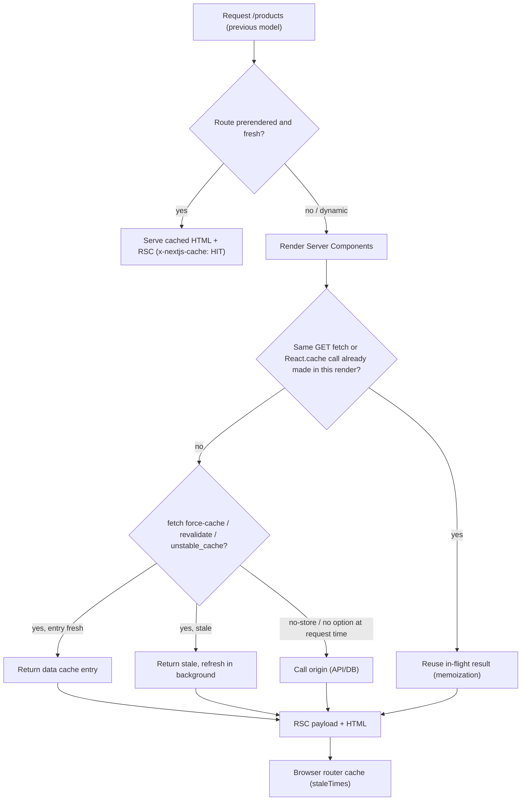

## Bối cảnh & vấn đề

Một team nâng một app từ Next 14 lên 15. Không có lỗi build, test pass. Hai ngày sau, CPU database tăng gấp ba. Nguyên nhân là ở Next 14, `fetch` trong Server Component được **cache mặc định** (`force-cache`), nên hàng trăm trang gọi cùng một API danh mục mà gần như không tốn gì. Next 15 **đảo ngược mặc định**: `fetch` không còn được cache, GET Route Handler cũng không. Mọi request bây giờ đi thẳng tới backend.

Chiều ngược lại cũng xảy ra. Ở Next 14, lời phàn nàn phổ biến nhất là "sửa dữ liệu mà trang không cập nhật": fetch bị cache vô hạn, router cache ở client giữ trang dynamic 30 giây. Người mới không hiểu vì sao.

Vì vậy caching là chủ đề hay bị hỏi nhất về Next.js, và cũng là nơi câu trả lời **phụ thuộc version nhiều nhất**. Bài này dựng bản đồ các tầng cache, cách defaults thay đổi qua 14 → 15 → 16, và mô hình cũ (fetch options, `unstable_cache`, segment config), mô hình vẫn là mặc định ở Next 16 khi **không** bật `cacheComponents`. Mô hình mới `'use cache'` nằm ở [bài 5](/tracks/nextjs/learn/cache-components), còn revalidation ở [bài 6](/tracks/nextjs/learn/revalidation-strategy).

## Khái niệm

### Bốn tầng cache

Nói "Next cache" là mơ hồ. Có ít nhất bốn thứ khác nhau, mỗi thứ có scope và vòng đời riêng:

1. **Request memoization**: trong **một lần render** (một request, hoặc một lần prerender), các lời gọi giống nhau được gộp lại. Xong request là mất.
2. **Data cache (server)**: kết quả `fetch` có `force-cache` hoặc `revalidate`, kết quả `unstable_cache`, hoặc (mô hình mới) kết quả `'use cache'`. Sống **qua nhiều request**, có thời hạn và tag.
3. **Prerender / full route cache**: HTML và RSC payload của route static, tạo lúc build hoặc revalidate. Chính là `○`/`●` trong build output.
4. **Client cache (router cache)**: trong browser, RSC payload của route đã visit hoặc prefetch, dùng cho navigation và back/forward.

Ngoài bốn tầng của Next còn có CDN (tôn trọng `Cache-Control`), HTTP cache của browser và cache ở backend (Redis). Bug "dữ liệu cũ" luôn phải hỏi: **cũ ở tầng nào?**

**Interview angle:** câu trả lời mạnh liệt kê được các tầng, nói scope của từng tầng, rồi mới nói defaults theo version.

### Fetch memoization (tầng 1)

`fetch` **GET** cùng URL và options được **memoize tự động trong một server render pass**. Nếu layout, page, `generateMetadata` và ba component con cùng gọi `fetch('/api/user/1')`, Next chỉ gọi một lần. Đây **không phải** cache giữa request: request sau lại fetch. Memoization không áp dụng trong Route Handler (không thuộc cây React). Muốn tắt thì truyền `signal` của `AbortController`.

### `React.cache` (tầng 1 cho mọi hàm)

ORM hay SDK không dùng `fetch` thì không được memoize tự động. **`React.cache(fn)`** memoize **theo request** cho hàm bất kỳ: nhiều component gọi `getUser('1')` thì chỉ query một lần. Cache key là arguments (so sánh theo giá trị với primitive, theo reference với object). Nó **không chia sẻ giữa các request**, nên an toàn để bọc hàm đọc session hay cookie. Pattern hay dùng là `preload(id)` gọi `void getItem(id)` sớm để khởi động query trước khi render tới component cần nó.

```ts
import { cache } from 'react';
import 'server-only';
export const getUser = cache(async (id: string) => db.user.findUnique({ where: { id } }));
```

### `fetch` cache options và `unstable_cache` (tầng 2, mô hình cũ)

Không bật Cache Components, dữ liệu được cache qua request bằng:

- `fetch(url, { cache: 'force-cache' })`: tìm trong data cache theo URL, method, header và body; chỉ response **200** được lưu.
- `fetch(url, { next: { revalidate: 3600 } })`: cache tối đa 3.600 giây (time-based, kiểu stale-while-revalidate). `revalidate: 0` nghĩa là không cache.
- `fetch(url, { next: { tags: ['products'] } })`: gắn tag để invalidate on-demand bằng `revalidateTag`.
- `unstable_cache(fn, keyParts, { tags, revalidate })`: cache kết quả hàm async bất kỳ (DB query). Theo docs, nó **lưu qua nhiều request và cả qua deploy**. Ở Next 16, docs ghi API này "đã được thay bằng `'use cache'`" và khuyên chuyển khi bật Cache Components.

**Một gotcha hay bị bỏ sót**: "fetch không cache mặc định" **không có nghĩa là luôn lấy mới**. Theo docs của `options.cache`, mặc định (`auto no cache`) nghĩa là fetch mỗi request **ở dev**, nhưng **chỉ fetch một lần lúc `next build`** nếu route được prerender static (không có request-time API). Kết quả bị "đóng băng" vào HTML cho tới khi revalidate. Phần Ví dụ thực tế chứng minh điều này.

### Route segment config (mô hình cũ)

Export từ `page`, `layout` hoặc `route`:

- `export const dynamic = 'auto' | 'force-dynamic' | 'error' | 'force-static'`. `force-dynamic` ép render mỗi request. `force-static` ép prerender và cho `cookies()`/`headers()` trả rỗng. `error` biến mọi dynamic access thành lỗi build.
- `export const revalidate = false | 0 | number`: chu kỳ revalidate mặc định của segment. Giá trị **nhỏ nhất** trong các layout/page của route quyết định cả route. Giá trị phải phân tích tĩnh được (`600` được, `60 * 10` không).
- `export const fetchCache = ...`: override mặc định `cache` của mọi fetch (option nâng cao).

Ở Next 16 khi **bật** `cacheComponents`, các segment config `dynamic`, `revalidate`, `fetchCache` gây lỗi build và phải thay bằng `'use cache'` + `cacheLife` hoặc Suspense (bài 5).

### Route Handler caching

Từ Next 15, **GET Route Handler không cache mặc định** (version history ghi "15.0.0-RC: default caching for GET handlers changed from static to dynamic"). Method khác GET **không bao giờ** được cache, kể cả khi nằm cạnh một GET có cache trong cùng file. Mô hình cũ opt-in bằng `export const dynamic = 'force-static'` (kèm `revalidate` nếu cần). Với Cache Components, GET handler theo **mô hình prerender giống page**: không đụng dữ liệu runtime hay uncached thì prerender lúc build, đọc `request.headers`/`cookies()`/DB không cache thì chạy lúc request. `'use cache'` **không đặt thẳng trong thân handler được**, phải tách ra helper function.

### Client cache và `staleTimes`

Router cache trong browser giữ RSC payload để navigation nhanh. Next 14 giữ page dynamic **30 giây**, nên user sửa dữ liệu xong quay lại vẫn thấy bản cũ. Next 15 đổi `staleTimes.dynamic` mặc định thành **0** (không tái dùng page segment khi navigate bằng `<Link>`), còn `static` mặc định **5 phút**. Layout và loading state vẫn được tái dùng, back/forward vẫn dùng cache để giữ scroll. `experimental.staleTimes` cho phép chỉnh. Với Cache Components, client cache dùng `stale` của `cacheLife` (bài 5).

## Cơ chế hoạt động



Đọc sơ đồ từ trên xuống. Đầu tiên Next xem route có bản prerender còn hạn không. Nếu có, nó trả luôn HTML/RSC đã lưu, và toàn bộ code của bạn không chạy. Nếu route dynamic hoặc bản prerender đã hết hạn, Server Components được render. Trong lần render đó, lời gọi trùng được gộp (memoization). Mỗi lần fetch hay hàm cache được hỏi data cache: còn hạn thì trả luôn, hết hạn (có `revalidate`) thì trả bản cũ và làm mới ở nền, không opt-in cache thì gọi origin. Kết quả là RSC payload và HTML, và browser giữ payload trong router cache theo `staleTimes`.

Điểm mấu chốt: "có cache hay không" được quyết định ở **nhiều tầng độc lập**. Một trang có thể "không cache fetch" nhưng vẫn phục vụ HTML đã đóng băng từ lúc build, vì tầng prerender ở trên chặn trước cả khi fetch có cơ hội chạy.

### So sánh defaults theo version

| | Next 14 | Next 15 | Next 16 (không cacheComponents) | Next 16 + cacheComponents |
| --- | --- | --- | --- | --- |
| `fetch` mặc định | `force-cache` | không cache (nhưng route static thì fetch một lần lúc build) | như 15 | không cache; dùng `'use cache'` |
| GET Route Handler | static mặc định | dynamic mặc định | như 15 | mô hình prerender như page |
| Router cache page dynamic | 30 s | 0 s | 0 s | theo `cacheLife.stale` |
| Request APIs | sync | async + sync compat | chỉ async | chỉ async |
| Cache hàm non-fetch | `unstable_cache` | `unstable_cache` | `unstable_cache` | `'use cache'` + `cacheLife`/`cacheTag` |
| Segment config `dynamic`/`revalidate` | có | có | có | lỗi build |
| `revalidateTag(tag)` | 1 arg | 1 arg | cần arg 2 (`'max'`), 1 arg deprecated | như vậy |

## Ví dụ thực tế

Scratch app Next 16.3.7, không bật Cache Components. Một upstream HTTP nhỏ ở `:4000` trả số lần bị gọi (`hit`), để đếm chính xác khi nào Next thật sự fetch.

```ts
// app/f-default/page.tsx — no cache option, no request-time API
export default async function P() {
  const d = await (await fetch('http://localhost:4000/a')).json();
  return <p>default hit={d.hit}</p>;
}
// app/f-nostore/page.tsx
const d = await (await fetch('http://localhost:4000/b', { cache: 'no-store' })).json();
// app/f-force/page.tsx — dynamic route (cookies) but cached fetch
await cookies();
const d = await (await fetch('http://localhost:4000/c', { cache: 'force-cache' })).json();
```

Build output:

```text
├ ○ /f-default
├ ƒ /f-force
├ ƒ /f-nostore
├ ƒ /api/time
├ ○ /api/time-static
```

Gọi mỗi trang ba lần:

```text
default hit=1   nostore hit=2   force hit=3
default hit=1   nostore hit=4   force hit=3
default hit=1   nostore hit=5   force hit=3
```

Diễn giải. `/f-default` **luôn hit=1**: fetch "không cache" nhưng route không dùng request API nên được prerender, và fetch chạy đúng **một lần lúc build**. Giá trị bị đóng băng. `/f-nostore` tăng mỗi request vì `no-store` ép dynamic. `/f-force` là route dynamic (đọc cookie) nhưng fetch `force-cache` được lưu trong data cache sau lần đầu (hit=3) và tái dùng.

Route Handler, gọi hai lần cách nhau một giây:

```bash
curl -s localhost:3100/api/time; curl -s localhost:3100/api/time-static
```

```text
{"now":1790734625013}   {"now":1790734619400}
{"now":1790734626091}   {"now":1790734619400}
```

GET không cấu hình thì chạy mỗi request. `dynamic = 'force-static'` thì trả con số lúc build.

`React.cache` dedupe trong một request: bốn component A, B (gọi `getUser` đã bọc `cache`) và C, D (gọi `getUserRaw` không bọc), đếm số lần hàm thật chạy:

```tsx
const getUser = cache(async (id: string) => { calls++; return { id, name: 'An' }; });
const getUserRaw = async (id: string) => { calls++; return { id, name: 'An' }; };
```

```text
calls=3
```

A và B chỉ tốn một lần gọi, C và D mỗi cái một lần. Request tiếp theo lại đếm từ đầu, vì `React.cache` không sống qua request.

### Debug "nâng 14 → 15, DB tải gấp ba"

Checklist khi review một upgrade:

```ts
// Next 14: implicitly cached. Next 15/16: NOT cached; runs per request on dynamic routes
const categories = await fetch(`${API}/categories`);

// Fix 1 (previous model): opt in explicitly
const categories = await fetch(`${API}/categories`, { next: { revalidate: 3600, tags: ['categories'] } });

// Fix 2 (root layout default, previous model)
export const fetchCache = 'default-cache';

// Fix 3 (Next 16 + cacheComponents): cache the data function
async function getCategories() { 'use cache'; cacheLife('hours'); cacheTag('categories'); return db.category.findMany(); }
```

Tìm các fetch bị ảnh hưởng: grep `fetch(` trong Server Components không có `cache`/`next`, đo số request tới backend theo route trước và sau. Chiều ngược lại (trang không cập nhật ở Next 14) thì kiểm tra `revalidate` và tag có được gọi sau mutation không, cùng `staleTimes` của router cache.

## Trade-offs & lựa chọn thay thế

| Công cụ | Scope | Qua request? | Qua deploy? | Invalidate | Dùng cho |
| --- | --- | --- | --- | --- | --- |
| Fetch memoization | một render pass | không | không | tự hết | dedupe fetch GET giữa layout/page/metadata |
| `React.cache` | một request | không | không | tự hết | dedupe ORM/DB, `getCurrentUser()` |
| `fetch` `force-cache`/`revalidate` | server, per instance mặc định | có | có (data cache trên disk) | `revalidateTag`, `revalidatePath`, thời gian | API ngoài dùng chung |
| `unstable_cache` | server | có | có (theo docs) | tags, `revalidate` | DB query ở mô hình cũ |
| `'use cache'` (bài 5) | server (in-memory LRU mặc định) | có | không (key chứa build id) | `cacheTag` + `revalidateTag`/`updateTag`, `cacheLife` | mô hình Cache Components |
| SWR/TanStack Query | browser | trong tab | không | mutation, refetch on focus | dữ liệu đổi theo tương tác |

Chọn thế nào. Cần dedupe **trong** một request (nhiều component cùng cần user hiện tại) thì dùng `React.cache`. Nó không bao giờ rò dữ liệu giữa user. Dữ liệu **dùng chung** giữa nhiều request và chấp nhận cũ vài phút thì dùng data cache: `fetch` options hoặc `unstable_cache` ở mô hình cũ, `'use cache'` ở mô hình mới. Dữ liệu **per user** (giỏ hàng, thông báo) **không** được vào cache server dùng chung, trừ khi key chứa user id và bạn chấp nhận số entry lớn.

### Khi nào vẫn fetch ở client

App Router không xoá nhu cầu fetch ở client. Dùng SWR hay TanStack Query khi:

- Dữ liệu **đổi liên tục theo tương tác** trên cùng màn hình: polling, infinite scroll, autocomplete, dashboard realtime.
- Dữ liệu chỉ client biết: vị trí, state chưa lên URL.
- Cần cache browser lâu, refetch on focus, optimistic update phức tạp, offline.

Pattern kết hợp theo docs: Server Component cung cấp dữ liệu ban đầu (`<HydrationBoundary>` với TanStack, `<SWRConfig fallback>` với SWR), rồi thư viện client tiếp quản. Guide TanStack của Next tạo **QueryClient mới cho mỗi lần render trên server** và **một** client dùng lại ở browser. Nếu chỉ cần đọc dữ liệu server một lần, truyền Promise và `use()` là đủ, không cần thư viện.

Anti-pattern: **Server Component gọi Route Handler của chính app** (`fetch('/api/products')`). Theo guide Backend-for-Frontend, việc này thêm một round-trip HTTP vô ích khi render theo request, và **làm fail build** với trang prerender, vì lúc build không có server nào lắng nghe. Gọi thẳng DAL.

## Edge cases & failure modes

- **Fetch đóng băng lúc build**: trang không có request API, fetch không option, nên dữ liệu lúc build mãi mãi (hit=1 ở ví dụ). Muốn mới thì `no-store`, `revalidate`, hoặc `connection()`.
- **Cache per instance**: data cache mặc định nằm trên disk/memory của **từng** instance. 4 pod thì `revalidateTag` chỉ xoá trên pod nhận request (bài 11).
- **Hai fetch cùng URL, `revalidate` khác nhau**: giá trị nhỏ hơn thắng; `{ revalidate: 3600, cache: 'no-store' }` mâu thuẫn nên cả hai bị bỏ qua (dev in warning).
- **Chỉ response 200 được cache**: upstream trả 500 thì không bị cache (tốt), nhưng lỗi tạm thời sẽ bị gọi lại liên tục; cần retry/backoff ở tầng khác.
- **`force-cache` với header `authorization`**: fetch vẫn cache (caching là opt-in, kể cả POST hay có cookie). Nếu URL giống nhau nhưng header khác, key khác nhau, nhưng rất dễ vô tình cache dữ liệu theo user. Không `force-cache` dữ liệu cá nhân.
- **Draft Mode bỏ qua cache hoàn toàn** (không đọc, không ghi); preview CMS luôn mới.
- **Router cache sau mutation**: Next 15+ `dynamic` = 0 nên ít gặp hơn, nhưng back/forward vẫn dùng bản cũ; mutation qua Server Action + revalidate để router nhận payload mới.
- **Module-scope cache tự chế** (`const cache = new Map()` ở module server): sống qua request, không invalidate theo tag, không chia sẻ giữa pod; rò dữ liệu nếu key thiếu user/tenant.

## Pitfalls

- ❌ Nói "Next cache fetch mặc định" như chân lý → ✅ nói rõ version: 14 cache, 15/16 không cache (mô hình cũ), 16 + cacheComponents dùng `'use cache'`.
- ❌ Nghĩ fetch không option = luôn mới → ✅ route static thì fetch một lần lúc build; cần `no-store`/`connection()`/`revalidate`.
- ❌ Dùng `React.cache` để "cache giữa request" → ✅ nó chỉ sống một request; cần data cache hoặc `'use cache'`.
- ❌ Bọc `getCurrentUser` (đọc cookie) bằng cache dùng chung → ✅ `React.cache` (per request) là đúng; cache chung sẽ rò user.
- ❌ Server Component `fetch('/api/...')` của chính app → ✅ gọi thẳng DAL; tránh hop thừa và lỗi build.
- ❌ Đặt `'use cache'` trực tiếp trong thân GET handler → ✅ tách helper function có `'use cache'`.
- ❌ Mong POST handler được cache vì có `force-static` → ✅ chỉ GET được cache.
- ❌ Đặt `export const revalidate = 60 * 10` → ✅ phải là literal `600`.

## Tóm tắt

- Bốn tầng: request memoization, data cache, prerender (full route), client router cache; bug stale luôn hỏi "tầng nào".
- Next 14 cache `fetch` và GET handler mặc định, router cache giữ page dynamic 30 s; Next 15 đảo lại (không cache, `staleTimes.dynamic` = 0); Next 16 giữ mô hình đó và thêm Cache Components opt-in.
- "Fetch không cache" không có nghĩa luôn mới: route static thì fetch một lần lúc build (đo thật: hit=1 mãi).
- Fetch GET được memoize trong một render; `React.cache` dedupe hàm bất kỳ per request (đo thật: 4 lời gọi → 3).
- Mô hình cũ: `force-cache`, `next.revalidate`, `next.tags`, `unstable_cache` (qua cả deploy), segment config `dynamic`/`revalidate`/`fetchCache`.
- GET Route Handler dynamic mặc định từ 15; `force-static` opt-in; method khác GET không bao giờ cache; với Cache Components thì theo mô hình prerender, `'use cache'` phải ở helper.
- Vẫn fetch ở client cho dữ liệu đổi theo tương tác; kết hợp dữ liệu ban đầu từ server; không gọi `/api` của chính app từ Server Component.
