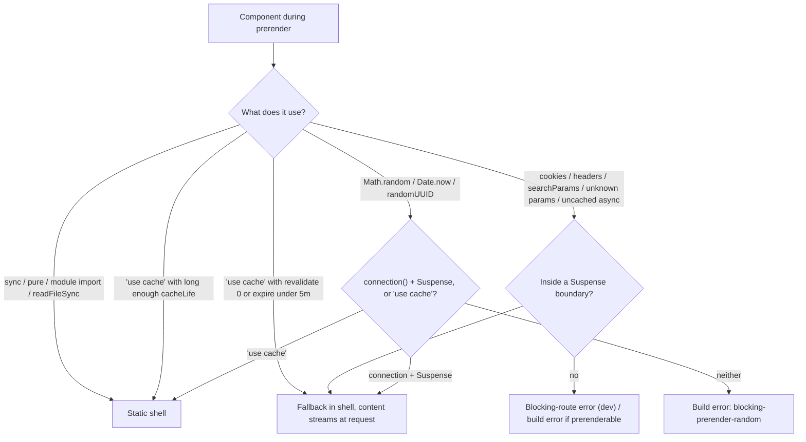
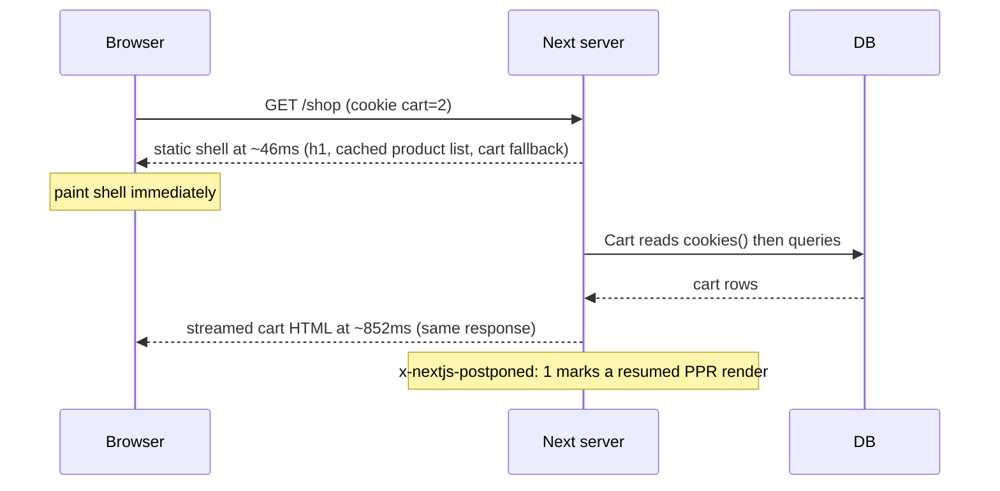

## Bối cảnh & vấn đề

Trang category của một shop có ba phần: header và menu (giống nhau cho mọi người), danh sách sản phẩm (giống nhau, đổi vài lần mỗi ngày) và giỏ hàng (theo từng user, đọc cookie). Ở mô hình cũ, chỉ riêng việc giỏ hàng đọc `cookies()` đã làm **cả route** thành dynamic. Mỗi request đều render lại header lẫn danh sách sản phẩm, TTFB bằng thời gian render toàn trang, và CDN không cache được gì. Muốn giữ trang static thì phải chuyển giỏ hàng sang fetch ở client sau khi hydrate, kèm spinner và thêm một API route.

**Cache Components** (Next 16, bật bằng `cacheComponents: true`) giải quyết bằng cách hạ ranh giới static/dynamic xuống **cấp component**. Mỗi route được prerender lúc build thành một **static shell**: phần thuần tĩnh, phần đã cache bằng `'use cache'`, và fallback của các `<Suspense>`. Phần phụ thuộc request (giỏ hàng) là một "lỗ" (dynamic hole) được stream vào **trong cùng response**. Cách render này gọi là **Partial Prerendering (PPR)**, và nó là hành vi mặc định khi bật Cache Components.

Mô hình mới cũng đặt ra yêu cầu: framework **bắt bạn chọn tường minh** cho mọi truy cập dữ liệu không xác định trước (cache hay stream), và báo lỗi nếu bạn không chọn. Bài này dạy các quy tắc đó, cơ chế cache key, những lỗi thật mà 16.3.7 in ra, và cách rollout cho một codebase đang dùng mô hình cũ ([bài 4](/tracks/nextjs/learn/caching-models)).

## Khái niệm

### Static shell, dynamic hole và PPR

**Static shell** là phần HTML (và RSC payload) của route được tạo **lúc build**, trước khi có bất kỳ request nào. Nó phục vụ được thẳng từ CDN. **Dynamic hole** là vùng trong `<Suspense>` mà nội dung chỉ có lúc request: fallback của nó nằm trong shell, còn nội dung thật được stream vào sau. **PPR** là một response gồm shell gửi ngay, cộng với các lỗ được điền dần.

Trong build output, route PPR được đánh dấu `◐ (Partial Prerender)`. Next 16 **bỏ** flag `experimental.ppr` và route config `experimental_ppr`; muốn có PPR thì bật `cacheComponents`. PPR ở Next 16 cũng hoạt động khác bản canary của Next 15 (theo upgrade guide).

Khi prerender, mỗi component được xử lý theo thứ nó dùng:

- **Predictable** (module import, tính toán thuần, `fs.readFileSync`, đọc DB đồng bộ): chạy xong lúc prerender và vào shell tự động.
- **`'use cache'`** (lifetime đủ dài): kết quả cache vào shell.
- **Runtime data** (`cookies()`, `headers()`, `searchParams`, `params` không có trong `generateStaticParams`) hoặc **async không cache** (fetch, DB async): phải nằm trong `<Suspense>`. Không thì báo lỗi "blocking route".
- **Giá trị không xác định** (`Math.random()`, `Date.now()`, `new Date()`, `crypto.randomUUID()`): phải chọn "mỗi request" (`await connection()` + Suspense) hoặc "cache một giá trị" (`'use cache'`).

**Interview angle:** câu "PPR là gì, bật thế nào ở 16?" có đáp án gọn: shell prerender + lỗ stream trong một response; bật `cacheComponents: true`; flag `experimental.ppr` đã bị xoá.

### `'use cache'` và cache key

`'use cache'` đặt ở đầu một hàm async, một component async, hoặc đầu file (mọi export đều cache) sẽ **cache giá trị trả về**. Kết quả được serialize thành RSC payload. Dùng được ở **mức dữ liệu** (`getProducts()`) và **mức UI** (component, page, layout).

Theo docs, **cache key** gồm: (1) **build ID** (hoặc `deploymentId` nếu cấu hình), (2) **function ID** là hash vị trí và chữ ký hàm, (3) **arguments đã serialize** (props với component), cộng với mọi **biến closure** được tự động bắt thành argument, và (4) HMR hash (chỉ ở dev). Vì vậy input khác cho ra entry khác, và **deploy mới là cache mới**: entry cũ không mang sang, kể cả với `'use cache: remote'`. Dữ liệu cần sống qua deploy thì dùng `fetch` cache hoặc `unstable_cache` (theo docs).

**Children và JSX slot đi xuyên qua** (pass-through) mà không vào key, **miễn là bạn không đọc chúng** trong thân hàm. Một layout có `'use cache'` không cache `children` của nó. Server Action cũng có thể pass-through.

Argument phải serializable: primitive, plain object, array, `Date`, `Map`, `Set`, typed array. Class instance, function (trừ pass-through), Symbol và `URL` không qua được. Return value thì có thể là JSX.

```ts
import { cacheLife, cacheTag } from 'next/cache';

export async function getProduct(tenantId: string, slug: string) {
  'use cache';
  cacheLife('hours');
  cacheTag(`product:${tenantId}:${slug}`);
  return db.product.findUnique({ where: { tenantId_slug: { tenantId, slug } } });
}
```

**Interview angle:** trả lời "key = build id + function id + args + closure" và nói ngay hệ quả: tenant phải là argument, nếu không mọi tenant dùng chung entry.

### `cacheLife`: stale, revalidate, expire

Mỗi scope `'use cache'` nên gọi `cacheLife`. Profile có ba thời gian:

- **`stale`**: client router dùng bản cache **không hỏi server** trong khoảng này. Server gửi giá trị qua header `x-nextjs-stale-time`, và router **ép tối thiểu 30 giây**.
- **`revalidate`**: quá thời gian này, request tiếp theo nhận bản cũ và server làm mới ở nền (stale-while-revalidate, giống ISR).
- **`expire`**: quá thời gian này mà **không có request nào**, request kế tiếp phải **chờ** bản mới. `expire` phải lớn hơn `revalidate`.

| Profile | stale | revalidate | expire |
| --- | --- | --- | --- |
| `default` (khi không gọi `cacheLife`) | 5 phút | 15 phút | never |
| `seconds` | 30 s | 1 s | 1 phút |
| `minutes` | 5 phút | 1 phút | 1 giờ |
| `hours` | 5 phút | 1 giờ | 1 ngày |
| `days` | 5 phút | 1 ngày | 1 tuần |
| `weeks` | 5 phút | 1 tuần | 30 ngày |
| `max` | 5 phút | 30 ngày | 1 năm |

Lifetime ngắn thay đổi vị trí nội dung: `revalidate: 0` hoặc `expire` dưới 5 phút thì **bị loại khỏi prerender** (thành dynamic hole). `stale` dưới 30 giây cũng bị loại. `stale` từ 30 giây tới dưới 5 phút thì vào prerender nhưng **không vào App Shell**. Trong các preset, chỉ `seconds` rơi vào nhóm bị loại. Có thể định nghĩa profile riêng hoặc ghi đè preset trong `next.config.ts` (`cacheLife: { biweekly: {...} }`).

### `cacheTag`

`cacheTag('products')` gắn tag vào entry để invalidate on-demand bằng `revalidateTag(tag, profile)` hoặc `updateTag(tag)` ([bài 6](/tracks/nextjs/learn/revalidation-strategy)). Tag theo entity (`product:${tenant}:${slug}`) cho phép invalidate chính xác thay vì xoá cả nhóm.

### Runtime data không được vào `'use cache'`

Scope `'use cache'` **không được** gọi `cookies()`, `headers()`, `searchParams` hay `connection()`, và quy tắc này **đi theo call stack**: helper mà hàm cache gọi cũng không được. Lỗi là `next-request-in-use-cache`. Có hai lý do. Thứ nhất, kỹ thuật: một entry dùng chung không thể phụ thuộc request của một người. Thứ hai, an toàn: nếu được phép, cache key không chứa tenant, và **mọi tenant sẽ thấy banner của tenant đầu tiên**.

Pattern chuẩn: đọc runtime value **bên ngoài** (một component không cache, nằm trong `<Suspense>`), rồi truyền nó làm **argument**, để nó trở thành một phần của key. `draftMode().isEnabled` là ngoại lệ đọc được bên trong.

### `'use cache: private'` và `'use cache: remote'`

**`'use cache: private'`** cho phép đọc `cookies()`/`headers()`/`searchParams` bên trong. Kết quả **không lưu ở server cache** giữa request, chỉ dedupe trong một request và giữ trong **browser memory** theo `stale` (dùng được cho prefetch). Dùng khi không refactor được, hoặc khi dữ liệu cá nhân bắt buộc không được nằm trong cache server. Không cấu hình cache handler được cho nó.

**`'use cache: remote'`** lưu vào **cache handler dùng chung** (Redis, KV) cấu hình qua `cacheHandlers`, thay vì memory của từng instance. Nó đáng tiền khi nội dung nằm **ngoài** shell (sau Suspense, chạy mỗi request), upstream bị rate limit hoặc chậm, và hit rate cao. Không đáng khi key gần như unique mỗi request, dữ liệu đổi từng giây, hoặc upstream đã nhanh (dưới 50 ms).

Lưu trữ mặc định của `'use cache'` lúc runtime là **in-memory LRU per instance**. Self-host server chạy lâu thì entry sống qua request (giới hạn bằng `cacheMaxMemorySize`). Trên **serverless**, entry thường không sống qua request. Build-time caching thì hoạt động bình thường ở cả hai.

### Giá trị không xác định và `connection()`

`Math.random()`, `Date.now()`, `crypto.randomUUID()` khác nhau mỗi lần chạy. Nếu Next âm thầm prerender chúng, một giá trị lúc build sẽ bị bake vào shell cho mọi user. Nên Next bắt chọn: **mỗi request** thì `await connection()` trước khi tạo giá trị và bọc trong `<Suspense>`; **dùng chung** thì đặt trong `'use cache'` (mọi user thấy cùng giá trị tới khi revalidate); hoặc render ở Client Component. `performance.now()` được coi là telemetry nên không bị chặn. `connection()` (từ `next/server`) nghĩa là "chờ tới khi có request thật".

### Activity: route cũ bị ẩn, không unmount

Khi bật Cache Components, Next **không unmount** trang khi navigate đi (về `<Activity>` và vòng đời effect, xem [track React](/tracks/react)). Nó ẩn trang bằng React **`<Activity mode="hidden">`** (`display: none`) và **giữ tối đa 3 route**. State React và DOM được giữ nguyên: input đang gõ, scroll, `<details>` đang mở, dropdown đang mở. Effect vẫn được cleanup khi ẩn và chạy lại khi hiện. Đây là thay đổi UX có chủ đích (quay lại nhanh, không mất công việc), nhưng code cũ ngầm dựa vào unmount để reset sẽ đổi hành vi.

## Cơ chế hoạt động

Quyết định từng component vào shell hay thành lỗ lúc build:



Next đi qua cây component lúc build. Phần thuần và phần đã cache đủ lâu vào shell. Khi gặp runtime data hoặc async không cache, nó đi ngược lên cây tìm `<Suspense>` gần nhất. Có thì fallback vào shell và nội dung thành lỗ; không có thì báo lỗi. Giá trị không xác định phải được đánh dấu rõ. Kết quả là HTML shell cho lần tải đầu và RSC payload cho navigation.

Lúc request:



Shell được gửi ngay (46 ms trong lab), rồi server "resume" phần bị hoãn: đọc cookie, chạy query giỏ hàng, và stream kết quả vào cùng response. Header `x-nextjs-postponed: 1` đánh dấu response PPR có phần được resume. Response vẫn là `Cache-Control: private, no-store` vì chứa dữ liệu per-user. Muốn phục vụ shell từ CDN thì cần platform hỗ trợ lưu shell riêng và resume (docs có PPR Platform Guide).

## Ví dụ thực tế

Tất cả dưới đây chạy thật trên scratch app Next 16.3.7 với `cacheComponents: true`.

### Trang shop PPR và build output

```tsx
// app/shop/page.tsx
async function getProducts() {
  'use cache';
  cacheLife('hours');
  cacheTag('products');
  await sleep(300);
  return [{ id: 1, name: 'Shoe', price: 100 }];
}
async function ProductList() { const items = await getProducts(); return <ul>{/* … */}</ul>; }
async function Cart() {
  const n = (await cookies()).get('cart')?.value ?? '0';
  await sleep(800);
  return <p>Cart items: {n}</p>;
}
export default function Shop() {
  return (
    <main>
      <h1>Shop shell</h1>
      <ProductList />
      <Suspense fallback={<p>Loading cart…</p>}><Cart /></Suspense>
    </main>
  );
}
```

```text
Route (app)          Revalidate  Expire
┌ ○ /
├ ◐ /random                 15m      1y
├ ◐ /shop                    1h      1d
└   /store/[slug]
  ├ ◐ /store/[slug]
  └ ○ /store/nike

○  (Static)             prerendered as static content
◐  (Partial Prerender)  prerendered as static HTML with dynamic server-streamed content
```

Cột Revalidate/Expire của `/shop` lấy từ `cacheLife('hours')` (1h/1d). `/store/[slug]` có App Shell cho slug chưa biết, còn `/store/nike` được prerender đầy đủ. Đo response theo chunk:

```text
status 200 headers after 44ms, transfer-encoding=chunked
chunk 1 +  46ms   1068B Shop shell | call 1 | Loading cart…
chunk 5 + 854ms    917B Cart items: 0
x-nextjs-stale-time: 300
x-nextjs-prerender: 1
x-nextjs-postponed: 1
Cache-Control: private, no-cache, no-store, max-age=0, must-revalidate
```

Danh sách sản phẩm (300 ms) **không** làm chậm TTFB vì nó đã nằm trong shell từ lúc build. Chỉ giỏ hàng (800 ms) là stream.

### Lỗi thật: `Math.random()` khi prerender

```tsx
export default function Page() { return <p>Lucky: {Math.random()}</p>; }
```

```text
Error: Route "/random": Next.js encountered the unstable value `Math.random()` while prerendering.
This value can change between renders, so it must be either prerendered or computed later.
Ways to fix this:
  - [dynamic] Render at request time by adding a dynamic data access (e.g. `await connection()`) before this call
  - [cache] Prerender and cache the value with `"use cache"`
  - [client] Render the value on the client with `"use client"`
Learn more: https://nextjs.org/docs/messages/blocking-prerender-random
```

Sửa bằng hai cách cùng lúc để so sánh:

```tsx
async function Lucky() { await connection(); return <p>Lucky: {Math.random().toFixed(4)}</p>; }
async function CachedLucky() { 'use cache'; return <p>Cached lucky: {Math.random().toFixed(4)}</p>; }
export default function Page() {
  return <main><CachedLucky /><Suspense fallback={<p>…</p>}><Lucky /></Suspense></main>;
}
```

```text
request 1: Cached lucky: 0.9928   Lucky: 0.2988
request 2: Cached lucky: 0.9928   Lucky: 0.4000
```

Giá trị cache giống nhau cho mọi request (tới khi revalidate theo profile `default`, 15m trong bảng build); giá trị qua `connection()` đổi mỗi request.

### Debug: `cookies()` trong `'use cache'` — build pass, runtime lỗi

```tsx
async function getTenant() {
  const tenantId = (await cookies()).get('tenant')?.value ?? 'none';
  return { name: `Tenant ${tenantId}` };
}
async function TenantBanner() {
  'use cache';
  const tenant = await getTenant();     // runtime API reached through a helper
  return <p>Banner: {tenant.name}</p>;
}
async function Dashboard() { await connection(); return <TenantBanner />; } // route is dynamic here
```

Khi `TenantBanner` nằm trong phần được prerender, **build fail** ngay. Khi nó chỉ được render **sau** một runtime access (như `Dashboard` ở trên), build **pass** (`◐ /tenant`), và lỗi chỉ lộ ra ở `next start`:

```bash
curl -s -o /tmp/t.html -w "%{http_code}\n" --cookie "tenant=acme" localhost:3200/tenant
```

```text
200
⨯ Error: Route /tenant used `cookies()` inside "use cache". Accessing Dynamic data sources inside a cache scope is not supported. If you need this data inside a cached function use `cookies()` outside of the cached function and pass the required dynamic data in as an argument. See more info here: https://nextjs.org/docs/messages/next-request-in-use-cache
```

Status vẫn là 200 (stream đã bắt đầu) nhưng banner không có trong HTML. Bản sửa:

```tsx
async function TenantBannerSlot() {
  const tenantId = (await cookies()).get('tenant')?.value ?? 'none'; // outside cache
  return <TenantBanner tenantId={tenantId} />;
}
async function TenantBanner({ tenantId }: { tenantId: string }) {
  'use cache';
  cacheLife('hours');
  cacheTag(`tenant:${tenantId}`);
  const tenant = await db.tenant.findUnique({ where: { id: tenantId } }); // key includes tenantId
  return <Banner name={tenant?.name} />;
}
// <Suspense fallback={<BannerSkeleton/>}><TenantBannerSlot /></Suspense>
```

Chú ý: đừng đưa **session id** vào key của cache dùng chung cho dữ liệu không thật sự theo session. Mỗi user sẽ tạo một entry, hit rate gần 0, bộ nhớ phình ra, và dữ liệu cá nhân nằm trong cache server.

### Layout await `params`: build xanh, dev báo đỏ

```tsx
// app/store/[slug]/layout.tsx — BEFORE
export default async function Layout({ children, params }: LayoutProps<'/store/[slug]'>) {
  const { slug } = await params;
  return <div><nav>Sidebar</nav><h1>{slug}</h1>{children}</div>;
}
```

`next build` pass. Nhưng `next dev`, khi mở một slug chưa prerender, in ra:

```text
Error: Route "/store/[slug]": Next.js encountered runtime data during prerendering.
`cookies()`, `headers()`, `params`, or `searchParams` accessed outside of `<Suspense>` prevents the route from being prerendered, blocking the page load and leading to a slower user experience.
Ways to fix this:
  - [stream] Provide a placeholder with `<Suspense fallback={...}>` around the data access
  - [block] Set `export const instant = false` to allow a blocking route
Learn more: https://nextjs.org/docs/messages/blocking-prerender-runtime
```

Theo docs của migration guide, insight kiểu này **không** hiện trong HTTP response (vẫn 200), chỉ có trong dev overlay và log. Tức là CI chỉ chạy `next build` sẽ không bắt được. Bản sửa đẩy dynamic access xuống:

```tsx
// AFTER — layout is not async; only the heading waits for params
export default function Layout({ children, params }: LayoutProps<'/store/[slug]'>) {
  return (
    <div>
      <Sidebar />                                   {/* static / cached: in shell */}
      <Suspense fallback={<h1>Loading…</h1>}>
        {params.then(({ slug }) => <ShopHeading slug={slug} />)}
      </Suspense>
      <Suspense fallback={<AvatarSkeleton />}><UserMenu /></Suspense> {/* reads session */}
      {children}
    </div>
  );
}
```

Category tree dùng chung thì `'use cache'` + `cacheLife('days')`. Kết quả là shell gồm sidebar, footer và các fallback, chỉ vài ô stream. Kiểm tra shell chứa gì bằng cách xem chunk đầu của response (probe ở trên), hoặc Next DevTools.

### Các lỗi build khác khi bật flag

```text
Error: Route segment config "dynamicParams" is not compatible with `nextConfig.cacheComponents`. Please remove it.
Error: When using Cache Components, all `generateStaticParams` functions must return at least one result.
```

## Trade-offs & lựa chọn thay thế

| Lựa chọn | Nằm ở đâu | Tươi? | Chi phí | Dùng khi |
| --- | --- | --- | --- | --- |
| Không làm gì (sync/pure) | shell | cố định theo build | 0 | nội dung tĩnh |
| `'use cache'` + `cacheLife` dài | shell + memory per instance | theo profile/tag | rủi ro stale, invalidation | dữ liệu dùng chung (catalog, CMS) |
| `'use cache'` với arg runtime | ngoài shell, memory | theo profile | entry theo số giá trị arg | dữ liệu theo tenant/locale |
| `'use cache: remote'` | cache handler dùng chung | theo profile | network hop, hạ tầng | nhiều instance, upstream chậm/rate-limited, hit rate cao |
| `'use cache: private'` | browser memory | theo stale | chạy mỗi request ở server | dữ liệu cá nhân, không được vào cache server |
| `<Suspense>` + không cache | lỗ stream | luôn mới | server mỗi request | giỏ hàng, giá realtime, checkout |

Chọn thế nào. Cache khi dữ liệu **dùng chung** và chấp nhận cũ trong một khoảng rõ ràng. Stream khi dữ liệu **theo user** hoặc phải tươi. Luôn gọi `cacheLife` tường minh (docs khuyên vậy). Chỉ dùng `remote` khi đo thấy hit rate cao và upstream đang bị đè.

### Có nên bật Cache Components sau khi lên 16?

Lên 16 **không bắt buộc** bật `cacheComponents`. Mô hình cũ (fetch options, `unstable_cache`, segment config) vẫn chạy. Bật là **đổi mô hình**, không phải rename: `dynamic`/`revalidate`/`fetchCache` gây lỗi, `dynamicParams` không hỗ trợ, `generateStaticParams` rỗng gây lỗi, `runtime = 'edge'` không hỗ trợ, và trang giữ state bằng Activity. Lợi ích: PPR mặc định (shell tức thì), cache tường minh theo hàm/component, prefetch và instant navigation tốt hơn.

Kế hoạch rollout gợi ý:

1. Nâng lên 16 trước (async APIs, proxy, Turbopack), để chạy ổn định vài tuần.
2. Bật flag trên một nhánh. Thay segment config theo migration guide. Codemod `cache-components-instant-false` thêm `export const instant = false` cho mọi segment để cả app build được, rồi gỡ dần từng route. Lưu ý: `instant = false` **không** gỡ được lỗi `Math.random`/`Date.now`, những lỗi đó phải sửa trực tiếp.
3. Map `unstable_cache` sang `'use cache'` + `cacheLife`/`cacheTag` (bỏ mảng key parts, key tự suy từ args). `fetch` `force-cache` + `next.revalidate/tags` sang một hàm `'use cache'`. `revalidateTag(tag)` thêm profile `'max'`; cân nhắc `updateTag` cho read-your-writes.
4. Self-host: cấu hình `cacheHandlers` nếu dùng `'use cache: remote'`; nhớ cache không sống qua deploy.
5. QA các flow nhạy với Activity (dropdown, form, wizard). Đo TTFB/LCP, số lần render server, bug stale trước và sau.

Trang hưởng lợi **ít nhất**: trang hoàn toàn per-user (dashboard cá nhân, checkout) và trang vốn đã static.

## Edge cases & failure modes

- **Runtime API gián tiếp trong cache**: helper sâu gọi `cookies()` → `next-request-in-use-cache`; trên route dynamic thì build pass và lỗi chỉ ở runtime (đã chạy thật).
- **Promise runtime truyền vào hàm cache**: truyền `cookies()` chưa await làm prop cho component `'use cache'` → build treo 50 giây rồi báo "Filling a cache during prerender timed out". Await bên ngoài, truyền giá trị.
- **`React.cache` bị cô lập**: giá trị lưu qua `React.cache` bên ngoài không thấy được bên trong scope `'use cache'`. Truyền dữ liệu bằng argument.
- **Cache ngắn lồng trong cache không có `cacheLife`** → build fail (nested short-lived caches). Luôn đặt `cacheLife` ở scope ngoài.
- **Serverless**: `'use cache'` in-memory gần như không hit giữa request; nếu upstream bị đè thì cân nhắc `remote`.
- **Deploy xoá cache**: mọi entry mất sau deploy vì key có build id → một đợt miss sau deploy (thundering herd tới DB). Warm-up hoặc remote handler + prerender các trang nóng.
- **Bot HTML-limited bỏ qua shell**: chạy thật thấy `facebookexternalhit` nhận byte đầu sau 345 ms (shell render lại, hàm cache chạy lại vì memory chưa có) trong khi browser và Googlebot nhận shell sau khoảng 40 ms; request bot thứ hai 36 ms (entry đã ấm). Nếu shell phụ thuộc dữ liệu chỉ có lúc build (file trong CI, API nội bộ chặn từ runtime), trang **chạy tốt với người nhưng lỗi với bot đó**. Dữ liệu của shell phải truy cập được lúc runtime.
- **Activity giữ state**: dropdown vẫn mở, form giữ input và thông báo cũ, dialog có effect "focus khi mở" không chạy lại. Tối đa 3 route được giữ, route cũ hơn bị evict và render mới.

### Sửa các lỗi do Activity

```tsx
'use client';
function SettingsDropdown() {
  const [open, setOpen] = useState(false);
  useLayoutEffect(() => () => setOpen(false), []); // close when the route is hidden
  return <Menu open={open} onToggle={() => setOpen((o) => !o)} />;
}
```

- Form "tạo mới" phải trống mỗi lần: reset state trong submit handler thành công.
- Dialog có effect khởi tạo: lấy trạng thái mở từ URL (`?edit=true`) thay vì state.
- Muốn remount cả subtree khi push/replace (vẫn giữ khi back/forward): `<Fragment key={useRouter().bfcacheId}>`, chủ yếu dùng khi migrate.
- Component dễ lỗi nhất: popover/dropdown, toast, wizard, form tạo mới, player media, component đo "đã xem" bằng mount.

## Pitfalls

- ❌ Bật `cacheComponents` như một flag "cho nhanh" → ✅ coi là migration mô hình; theo migration guide, dùng `instant = false` để rollout từng route.
- ❌ Đọc `cookies()` trong hàm `'use cache'` (kể cả qua helper) → ✅ đọc bên ngoài, truyền giá trị làm argument.
- ❌ Quên tenant/locale trong argument → ✅ mọi giá trị phân biệt dữ liệu phải là arg; tag cũng có tenant.
- ❌ Bỏ `cacheLife` → ✅ luôn khai báo; `default` là 5m/15m/never, dễ gây hiểu nhầm.
- ❌ Dùng `cacheLife('seconds')` rồi thắc mắc sao không vào shell → ✅ `expire` < 5 phút bị loại khỏi prerender.
- ❌ `Date.now()` trong render để hiển thị "cập nhật 3 phút trước" trên trang cache → ✅ cache timestamp gốc (ISO string), tính "x phút trước" ở Client Component hoặc sau `connection()`.
- ❌ Chỉ chạy `next build` trong CI để bắt lỗi blocking → ✅ một số insight chỉ có ở dev; kiểm tra dev overlay/log (hoặc MCP `get_errors`) cho route quan trọng.
- ❌ Dựa vào unmount để reset UI → ✅ reset tường minh (cleanup `useLayoutEffect`, state từ URL, `key`).

## Tóm tắt

- `cacheComponents: true` bật PPR mặc định: static shell prerender + dynamic hole stream trong một response (`◐`); `experimental.ppr` đã bị xoá.
- Vào shell: code thuần/predictable và `'use cache'` đủ dài; runtime data và async không cache phải trong `<Suspense>`; `Math.random`/`Date.now` cần `connection()` hoặc `'use cache'` (lỗi build thật: blocking-prerender-random).
- Cache key = build id (hoặc `deploymentId`) + function id + args/closure; children pass-through không vào key; deploy mới = cache mới.
- `cacheLife`: stale (client, tối thiểu 30 s) / revalidate (SWR server) / expire (chờ); `default` = 5m/15m/never; cache quá ngắn thành lỗ.
- Không đọc `cookies()`/`headers()` trong `'use cache'`, kể cả gián tiếp; trên route dynamic, build pass nhưng runtime lỗi `next-request-in-use-cache` (đã chạy thật).
- `'use cache: private'` cho dữ liệu cá nhân (chỉ browser), `'use cache: remote'` cho cache dùng chung nhiều instance; mặc định là LRU in-memory per instance.
- Đẩy await `params`/`cookies()` xuống trong Suspense để shell lớn; dev báo blocking-prerender-runtime mà build vẫn xanh.
- Activity giữ tối đa 3 route ẩn với state/DOM; reset tường minh cho dropdown, form, dialog.
