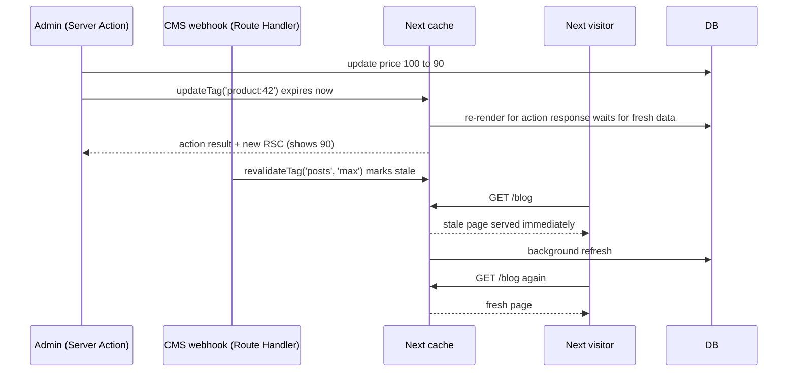
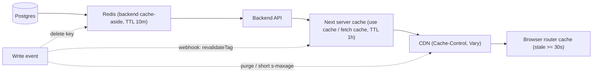

## Bối cảnh & vấn đề

Một admin sửa giá sản phẩm từ 100 thành 90 rồi bấm Lưu. Ngay sau đó chính admin thấy trang vẫn ghi 100 và tưởng lưu thất bại, nên bấm Lưu thêm hai lần. Trong khi đó, khách hàng ở trang category thấy giá mới sau vài phút, còn trang chi tiết sản phẩm giữ giá cũ tới tận hôm sau. Cả ba triệu chứng xuất phát từ cùng một nguyên nhân: team dùng sai hàm invalidation, và không biết dữ liệu đang được cache ở **tầng nào**.

Ở Next 16 có bốn công cụ trông giống nhau nhưng khác hẳn về ngữ nghĩa: `revalidateTag`, `updateTag`, `revalidatePath` và `refresh`. Chọn sai thì hoặc user không thấy thay đổi của chính mình, hoặc server bị dội tải vì invalidate quá rộng. Bài này dạy từng công cụ (có số đo thật), cách revalidation lan truyền qua tag, cách xếp chồng các tầng cache như Redis và CDN, rồi áp dụng để chọn chiến lược cho từng loại trang.

Kiến thức nền: `'use cache'`, `cacheLife`, `cacheTag` ở [bài 5](/tracks/nextjs/learn/cache-components) và mô hình cũ ở [bài 4](/tracks/nextjs/learn/caching-models).

## Khái niệm

### Revalidation theo thời gian và on-demand

**Revalidation** là làm mới dữ liệu đã cache. Có hai kiểu. **Time-based**: `cacheLife` (hoặc `next.revalidate` ở mô hình cũ) cho phép phục vụ bản cache tới khi quá `revalidate`, sau đó request tiếp theo nhận bản cũ và server làm mới ở nền (stale-while-revalidate). **On-demand**: sau một sự kiện (mutation, webhook CMS), bạn gọi hàm invalidation. Hai kiểu thường đi cùng nhau: nội dung CMS dùng `cacheLife('max')` + `cacheTag` và chỉ invalidate khi webhook báo có thay đổi, tránh revalidate định kỳ vô ích.

### `revalidateTag(tag, profile)`: stale-while-revalidate

`revalidateTag` **đánh dấu stale** mọi entry có tag đó. Request **tiếp theo** vẫn được phục vụ bản cũ trong khi revalidation chạy nền. Tham số thứ hai (**bắt buộc** ở Next 16; dạng một tham số đã deprecated và TypeScript báo lỗi) quy định bản cũ được phục vụ tối đa bao lâu:

- `'max'` (khuyến nghị): cửa sổ một năm, nên gần như luôn là SWR.
- Profile khác hoặc `{ expire: n }`: sau `n` giây kể từ khi đánh dấu, request phải chờ bản mới.
- `{ expire: 0 }`: không bao giờ phục vụ bản cũ; request tiếp theo là cache miss chặn (blocking). Đây là cách "xoá ngay" từ **Route Handler**, nơi `updateTag` không dùng được.
- Không có tham số thứ hai (deprecated): hành xử như `{ expire: 0 }`.

Theo docs, revalidation được **kích hoạt bởi request**, không phải bởi lời gọi `revalidateTag`: các trang dùng tag sẽ làm mới dần khi có người truy cập, chứ không cùng lúc. Gọi được trong Server Action **và** Route Handler (webhook), không gọi được trong Client Component hay proxy. Khi gọi trong Server Action với profile SWR, response của action **không** kèm re-render ngay: trang chỉ phản ánh thay đổi ở lần đọc sau.

**Interview angle:** "vì sao admin không thấy giá mới ngay sau khi Lưu?". Vì action dùng `revalidateTag(tag, 'max')`, nên chính request re-render phục vụ bản stale. Dùng `updateTag` trong Server Action.

### `updateTag(tag)`: read-your-own-writes

`updateTag` **hết hạn ngay** entry có tag, và request tiếp theo (kể cả lần re-render kèm theo response của action) **chờ** dữ liệu mới. User thấy thay đổi của chính mình ngay trong response. Nó **chỉ** gọi được trong Server Action. Gọi trong Route Handler sẽ throw (xem Ví dụ thực tế). Cái giá là request đó chậm hơn vì phải chờ query.

### `revalidatePath(path, type?)`

`revalidatePath('/blog/post-1')` invalidate một path cụ thể; `revalidatePath('/product/[slug]', 'page')` invalidate mọi trang khớp pattern (bắt buộc có `type` khi dùng dynamic segment); `revalidatePath('/', 'layout')` invalidate layout và mọi thứ bên dưới. Nó hoạt động qua **soft tag** mà Next tự sinh theo route (`_N_T_/layout`, `_N_T_/blog/layout`, `_N_T_/blog/hello`). Hai lưu ý. Với rewrite, phải truyền path **đích** (file route thật), không phải URL user thấy. `revalidatePath('/blog')` không làm mới trang khác dùng chung dữ liệu (trang `/dashboard` dùng tag `posts` vẫn stale). Trong Server Function, docs ghi rằng hiện tại nó còn làm mọi trang đã visit refresh khi navigate lại (hành vi tạm thời). Docs khuyên **ưu tiên tag** hơn path vì chính xác hơn, tránh over-invalidate.

### `refresh()`

`refresh()` (từ `next/cache`, chỉ trong Server Action) **refetch RSC payload của route hiện tại mà không invalidate cache nào**. Dùng khi view phụ thuộc state nằm ngoài cache mà action vừa đổi, ví dụ số thông báo chưa đọc lấy thẳng từ DB. Theo docs `cacheLife`, khi bất kỳ hàm revalidation nào (kể cả `refresh`) được gọi từ Server Action, **toàn bộ client router cache bị xoá ngay**, bỏ qua `stale`.

### Thứ tự với `redirect()`

`redirect()` hoạt động bằng cách **throw**, nên code sau nó không chạy. Luôn gọi `updateTag`/`revalidatePath` **trước** `redirect()` nếu trang đích cần dữ liệu mới. `updateTag`, `revalidateTag`, `revalidatePath`, `refresh` thì không throw, nên action vẫn return giá trị được.

### Revalidation trên nhiều instance

Mặc định mọi sự kiện revalidate là **local** với instance nhận request: chạy 4 pod thì `revalidateTag` chỉ tác động một pod. Muốn đồng bộ thì cache handler dùng chung phải implement `updateTags()` (ghi sự kiện invalidate vào Redis/DB) và `refreshTags()` (đọc trước mỗi request). Chi tiết ở [bài 11](/tracks/nextjs/learn/self-hosting-production). Một revalidation tạo lại **cả HTML lẫn RSC payload** trong cùng entry. CDN phải cache hai thứ này cùng TTL và tôn trọng header `Vary`, nếu không navigation client-side sẽ thấy nội dung lệch với lần tải đầu.

## Cơ chế hoạt động



Hai luồng song song trong sơ đồ minh hoạ khác biệt cốt lõi. Luồng admin dùng `updateTag` trong Server Action: entry hết hạn ngay, lần re-render đi kèm response phải chờ DB, và admin thấy giá 90 ngay trong cùng round-trip. Luồng webhook dùng `revalidateTag(…, 'max')` từ Route Handler (nơi duy nhất có thể là SWR hoặc `{ expire: 0 }`): entry chỉ bị đánh dấu stale, visitor đầu tiên vẫn nhận bản cũ ngay (nhanh) và kích hoạt refresh nền, visitor sau nhận bản mới.

Một cách hình dung các tầng cache khi dữ liệu đi từ DB tới mắt user:



Mỗi tầng có TTL riêng, và độ cũ tối đa **cộng dồn**. Nếu Next cache 1 giờ lên trên dữ liệu Redis đã cache 10 phút, thì trong trường hợp xấu nhất user thấy dữ liệu cũ tới khoảng 70 phút. Ghi dữ liệu mà chỉ xoá key Redis là chưa đủ: Next vẫn phục vụ bản cũ tới khi hết `revalidate`. Sự kiện ghi phải lan truyền tới **mọi** tầng: xoá hoặc cập nhật key Redis, gọi webhook để `revalidateTag`, và purge CDN (hoặc để CDN TTL ngắn).

## Ví dụ thực tế

### Đo SWR của `revalidateTag` với `'max'` và `{ expire: 0 }`

Scratch app Next 16.3.7, `cacheComponents: true`. Trang `/shop` có `getProducts()` với `'use cache'` + `cacheTag('products')`, trả timestamp lúc render (`at …`). Route Handler invalidate:

```ts
// app/api/revalidate/route.ts
import { revalidateTag } from 'next/cache';
import type { NextRequest } from 'next/server';
export async function POST(req: NextRequest) {
  const tag = req.nextUrl.searchParams.get('tag') ?? 'products';
  if (req.nextUrl.searchParams.get('mode') === 'expire0') revalidateTag(tag, { expire: 0 });
  else revalidateTag(tag, 'max');
  return Response.json({ revalidated: tag });
}
```

```text
initial:
t=0.893s at 2026-09-30T02:24:56.482Z
t=0.813s at 2026-09-30T02:24:56.482Z
POST /api/revalidate?tag=products            -> {"revalidated":"products","mode":"max"}
after revalidateTag max:
t=0.809s at 2026-09-30T02:24:56.482Z   <- stale served, refresh starts in background
t=0.816s at 2026-09-30T02:25:02.368Z   <- fresh
t=0.808s at 2026-09-30T02:25:02.368Z
POST /api/revalidate?tag=products&mode=expire0
after expire 0:
t=1.131s at 2026-09-30T02:25:05.992Z   <- blocking miss, waits for getProducts (300 ms)
t=0.810s at 2026-09-30T02:25:05.992Z
```

(Tổng thời gian khoảng 0,8 s vì trang còn một phần giỏ hàng stream 800 ms; điều cần nhìn là timestamp và request bị chậm thêm.)

Với `'max'`, request đầu sau invalidate vẫn nhận timestamp cũ, request thứ hai mới có bản mới: đúng SWR. Với `{ expire: 0 }`, request đầu **chặn** thêm khoảng 300 ms để chạy lại hàm cache, rồi trả bản mới ngay.

### `updateTag` trong Route Handler: lỗi thật

```ts
// app/api/update/route.ts
import { updateTag } from 'next/cache';
export async function POST() { updateTag('products'); return Response.json({ ok: true }); }
```

```text
update route status 500
⨯ Error: updateTag can only be called from within a Server Action. To invalidate cache tags in Route Handlers or other contexts, use revalidateTag instead.
```

Đây là đáp án cho câu follow-up "CMS webhook gọi Route Handler thì dùng gì?": `revalidateTag(tag, 'max')` nếu chấp nhận vài giây stale, `revalidateTag(tag, { expire: 0 })` nếu phải mới ngay. Webhook cũng phải **xác thực chữ ký** (HMAC header của CMS), vì endpoint này public.

### Server Action sửa giá: dùng đúng hàm

```ts
'use server';
import { updateTag, revalidateTag } from 'next/cache';
import { redirect } from 'next/navigation';

export async function updatePrice(productId: string, formData: FormData) {
  const session = await requireAdmin();                 // authz inside the action
  const price = PriceSchema.parse(formData.get('price'));
  await db.product.update({ where: { id: productId, tenantId: session.tenantId }, data: { price } });
  updateTag(`product:${session.tenantId}:${productId}`); // admin sees 90 in this response
  revalidateTag(`category:${session.tenantId}`, 'max');   // listings refresh lazily
  redirect(`/admin/products/${productId}`);              // last: redirect throws
}
```

Hai tag hai ngữ nghĩa: chi tiết sản phẩm cần read-your-writes, còn trang danh mục chấp nhận SWR để không dồn render cùng lúc.

## Trade-offs & lựa chọn thay thế

| API | Gọi ở đâu | Ngữ nghĩa | Response của action có UI mới? | Dùng khi |
| --- | --- | --- | --- | --- |
| `updateTag(tag)` | chỉ Server Action | hết hạn ngay, request sau chờ | có | user sửa và phải thấy ngay (profile, giá, bài viết của mình) |
| `revalidateTag(tag, 'max')` | Server Action, Route Handler | đánh dấu stale, SWR | không | CMS webhook, catalog, blog, cập nhật hàng loạt |
| `revalidateTag(tag, { expire: 0 })` | Server Action, Route Handler | miss chặn ở request sau | không (bản thân nó) | webhook cần xoá ngay mà không dùng được `updateTag` |
| `revalidatePath(path, type?)` | Server Action, Route Handler | invalidate theo route (soft tag) | có (trong action) | không có tag, một route bị ảnh hưởng; dễ over-invalidate |
| `refresh()` | chỉ Server Action | refetch RSC route hiện tại, không đụng cache | có | view phụ thuộc dữ liệu không cache (notification count) |

Chọn thế nào. Trong Server Action, mặc định dùng `updateTag` cho entity user vừa sửa và `revalidateTag('max')` cho các danh sách phụ. Từ hệ thống ngoài (webhook), chỉ có `revalidateTag`. Thiết kế tag theo entity + tenant (`product:${tenant}:${id}`, `category:${tenant}:${slug}`) thay vì một tag khổng lồ `products`: flash sale 10.000 sản phẩm lúc 12:00:00 invalidate một tag `category:*` là cả nghìn trang render lại cùng lúc khi có traffic. Tag nhỏ hơn cộng với SWR giúp tải rải đều.

### Chiến lược cho từng trang e-commerce

| Trang | Rendering | Cache | Invalidate |
| --- | --- | --- | --- |
| Home | static shell + Suspense cho phần cá nhân hoá ("Xin chào An", gợi ý) | `'use cache'` + `cacheLife('hours')` cho banner/collection từ CMS | webhook `revalidateTag('home', 'max')` |
| Category | shell + product grid cache theo `(tenant, category, page)` | `cacheLife('hours')`, tag `category:${t}:${slug}` | khi sản phẩm đổi danh mục/giá |
| Product detail | `generateStaticParams` top N, còn lại App Shell + ISR | mô tả/ảnh `cacheLife('days')`; **giá/tồn kho** cache ngắn hoặc stream | `updateTag` từ admin, webhook ERP `revalidateTag` |
| Search | dynamic theo `searchParams`, đọc sâu trong Suspense | `'use cache'` theo args với `cacheLife('minutes')` cho query phổ biến; không cache long tail | ít cần |
| Cart | per user: stream, không cache chung | không (hoặc `'use cache: private'`) | action mutate cart + `refresh()`/`updateTag` |
| Checkout | luôn dynamic, không cache | không | Server Action có idempotency key; tính giá ở server |

Lý lẽ quan trọng hơn bảng. Trang có SEO và traffic cao, dữ liệu dùng chung, thì đưa vào shell. Dữ liệu per user thì stream. Dữ liệu đổi nhanh và ảnh hưởng tiền (giá, tồn kho) thì không để TTL dài: cache ngắn, stream, hoặc invalidate bằng sự kiện. Checkout không bao giờ tin giá từ client.

### Trang kết quả search trên Elasticsearch

- **URL là nguồn state**: `/search?q=giày&category=nam&page=2`, nên share link, back/forward và prefetch đều hoạt động.
- Server Component nhận `searchParams` (Promise) và **await sâu trong `<Suspense>`**, để header và facet tĩnh vẫn vào shell.
- Service search nhận `tenantId` từ context server (không từ query string), trả DTO (id, title, price, ảnh), không trả nguyên document ES.
- Cache: `'use cache'` với args `(tenant, q, filters, page)` + `cacheLife('minutes')` hợp cho top query. Long tail gần như không hit, nên không cache (theo docs `use cache: remote`, key gần unique thì hit rate gần 0).
- Ô search là Client Component: debounce khoảng 250 ms, cập nhật URL bằng `router.replace` trong `startTransition` (không spam history), input vẫn mượt trong lúc kết quả mới stream (transition giữ UI cũ cho tới khi có payload mới).
- SEO: `noindex` cho trang kết quả tuỳ ý, canonical về trang category; chặn crawl tổ hợp facet vô hạn (`robots`), sitemap chỉ chứa category.

```tsx
// app/search/page.tsx (Cache Components)
export default function SearchPage(props: PageProps<'/search'>) {
  return (
    <>
      <SearchBox />                                   {/* 'use client' */}
      <Suspense fallback={<ResultsSkeleton />}>
        <Results searchParams={props.searchParams} />
      </Suspense>
    </>
  );
}
async function Results({ searchParams }: Pick<PageProps<'/search'>, 'searchParams'>) {
  const { q = '', page = '1' } = await searchParams;
  const tenantId = await currentTenantId();           // from host/session on the server
  const hits = await searchProducts(tenantId, String(q), Number(page));
  return <ResultList hits={hits} />;
}
async function searchProducts(tenantId: string, q: string, page: number) {
  'use cache';
  cacheLife('minutes');
  cacheTag(`search:${tenantId}`);
  return es.search({ tenantId, q, page }); // returns DTOs only
}
```

### Trả lời câu hỏi CV: storefront multi-tenant

Khi được hỏi "storefront của bạn render thế nào", khung trả lời mạnh:

1. Nói **đúng version và router** của dự án thật (ví dụ Next 13 Pages Router với `getStaticProps` + ISR). Đừng mô tả tính năng Next 16 nếu dự án không dùng.
2. Từng loại trang dùng gì (SSG/ISR/SSR/CSR) và vì sao (SEO, dữ liệu theo tenant, giá đổi nhanh).
3. Tenant nằm ở đâu trong routing và **trong mọi cache key/tag**; invalidate khi retailer sửa dữ liệu thế nào.
4. Số liệu thật: TTFB/LCP, cache hit rate, tải server (điền của bạn).
5. Nếu làm lại với Next 16: PPR cho trang sản phẩm (shell + giá stream), `'use cache'` theo tenant, `updateTag` cho admin.

Nếu hai tenant dùng chung một entry do key thiếu tenant, đó là **rò dữ liệu giữa khách hàng** (giá, sản phẩm, branding của retailer A hiện cho B). Guardrail: helper `tenantTag(t, …)` bắt buộc, test tự động render hai tenant song song và so output, lint cấm `'use cache'` không có tham số tenant trong module storefront.

### Redis backend + Next cache: invalidate ở đâu khi ghi

Luồng ghi đúng cho "retailer cập nhật tồn kho":

1. Backend ghi DB, rồi **xoá** key Redis `stock:${tenant}:${sku}` (cache-aside) trong cùng use case.
2. Backend phát event (outbox → Kafka hoặc webhook) → Route Handler của Next xác thực chữ ký → `revalidateTag('stock:…', { expire: 0 })` vì tồn kho ảnh hưởng việc đặt hàng.
3. CDN không cache HTML chứa tồn kho quá vài giây (hoặc phần tồn kho là một Suspense hole không cache).
4. Nút "Thêm vào giỏ" **luôn kiểm tra tồn kho ở server** (Server Action), vì mọi cache đều có thể cũ.

Nếu khách vẫn thêm được hàng hết kho trong vài phút, sửa theo thứ tự: kiểm tra ở action trước (chặn lỗi nghiệp vụ), rồi tới tầng có TTL dài nhất trong chuỗi.

## Edge cases & failure modes

- **Admin không thấy thay đổi của mình**: action dùng `revalidateTag('max')` (không kèm re-render) → dùng `updateTag`.
- **`revalidateTag` một tham số**: TypeScript lỗi ở 16; nếu ép chạy, nó hành xử như `{ expire: 0 }` (miss chặn), có thể dội tải khi gọi hàng loạt.
- **Code sau `redirect()`**: `updateTag` đặt sau redirect không bao giờ chạy → trang đích stale.
- **Rewrite + `revalidatePath`**: truyền URL nguồn thì không khớp entry nào; phải dùng path đích.
- **Tag quá 256 ký tự**: không bao giờ được gán, nên revalidate không có tác dụng và không có lỗi. Giữ tag ngắn (hash id dài).
- **Đa instance**: invalidate chỉ trên một pod → user thấy giá khác nhau theo pod (bài 11).
- **Thundering herd sau invalidate lớn**: `expire: 0` trên tag dùng bởi hàng nghìn trang cộng traffic cao → nhiều render chặn cùng lúc tới DB. Ưu tiên `'max'` cho tag rộng, tag hẹp cho entity.
- **Double caching**: Redis 10 phút + Next 1 giờ + CDN 5 phút → cũ tới 75 phút. Viết ra TTL của từng tầng và tổng độ cũ tối đa.
- **HTML và RSC lệch trên CDN**: cache HTML 1 giờ nhưng RSC 5 phút → tải trang đầu thấy giá cũ, navigate thấy giá mới. Cache cùng policy, tôn trọng `Vary`.

## Pitfalls

- ❌ `updateTag` trong webhook Route Handler → ✅ `revalidateTag(tag, 'max')` hoặc `{ expire: 0 }`; `updateTag` chỉ trong Server Action.
- ❌ `revalidateTag('posts')` một tham số theo code cũ → ✅ `revalidateTag('posts', 'max')` hoặc `updateTag('posts')`.
- ❌ `revalidatePath('/', 'layout')` sau mọi mutation "cho chắc" → ✅ tag theo entity, vì path rộng làm cả site render lại.
- ❌ Gọi revalidate sau `redirect()` → ✅ revalidate trước, redirect cuối cùng.
- ❌ Dùng `refresh()` và mong cache được xoá → ✅ `refresh()` chỉ refetch RSC; dữ liệu cache vẫn cũ nếu không invalidate.
- ❌ Chỉ xoá key Redis khi ghi → ✅ lan truyền tới Next cache (webhook + tag) và CDN.
- ❌ Cache giá/tồn kho với TTL giờ và tin nó ở checkout → ✅ kiểm tra lại ở server trong action.
- ❌ Tag không có tenant → ✅ mọi tag và key chứa tenant; invalidate một retailer không đụng retailer khác.

## Tóm tắt

- `revalidateTag(tag, 'max')` = đánh dấu stale, SWR (đo thật: request đầu nhận bản cũ, request sau bản mới); dùng được trong Server Action và Route Handler; tham số hai bắt buộc ở 16.
- `revalidateTag(tag, { expire: 0 })` = miss chặn ở request sau; là cách "xoá ngay" từ webhook.
- `updateTag(tag)` = hết hạn ngay, read-your-own-writes, response của action có UI mới; chỉ Server Action (Route Handler → 500 "updateTag can only be called from within a Server Action").
- `revalidatePath` dựa trên soft tag theo route, dễ over-invalidate; `refresh()` refetch RSC mà không xoá cache.
- Revalidate trước `redirect()`; revalidation mặc định local theo instance; HTML và RSC phải cache cùng nhau.
- Tầng cache xếp chồng cộng dồn độ cũ; sự kiện ghi phải lan tới Redis, Next và CDN; tiền và tồn kho luôn được kiểm tra lại ở server.
- Chiến lược trang: shell + cache cho nội dung chung, stream cho dữ liệu cá nhân, không cache checkout; tenant có mặt trong mọi key và tag.
