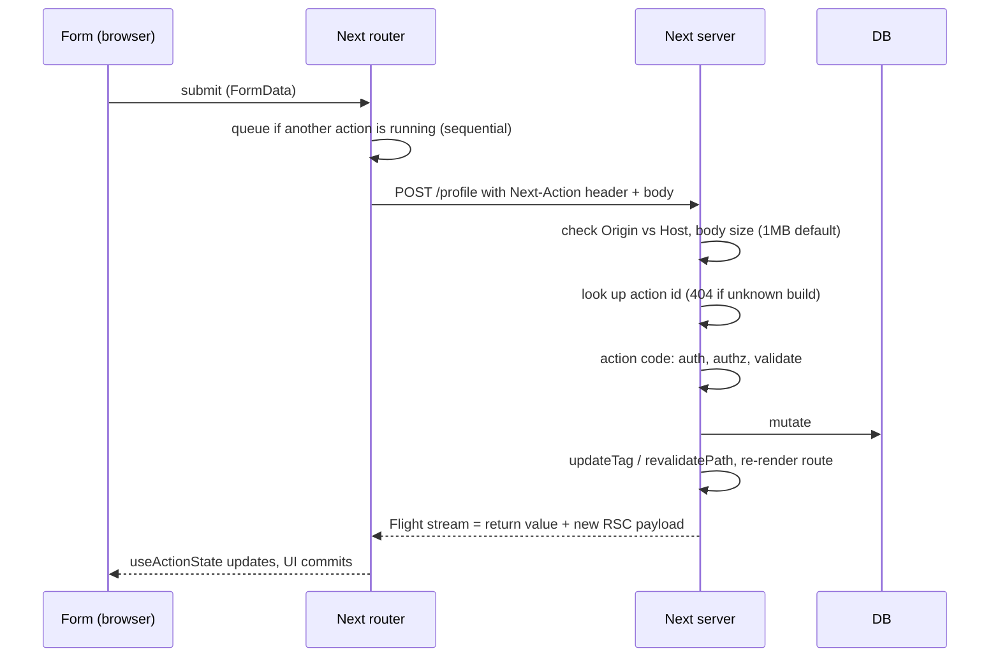

## Bối cảnh & vấn đề

Trước App Router, một form "cập nhật profile" trong Next cần bốn mảnh: một API route `pages/api/profile.ts`, một `fetch('/api/profile', { method: 'POST' })` ở client, state loading/error viết tay, rồi refetch hoặc `router.replace` để trang hiển thị dữ liệu mới. Mỗi form lặp lại cùng một boilerplate, và form không hoạt động khi JavaScript chưa tải.

**Server Actions** gom việc này lại: bạn viết một hàm `async` có `'use server'`, gắn vào `<form action={fn}>`, và Next lo phần transport (POST), serialize dữ liệu, pending state, re-render trang sau mutation, tất cả trong **một round-trip**. Form còn chạy được trước khi hydrate (progressive enhancement).

Nhưng sự tiện lợi này che mất một sự thật mà review bảo mật nào cũng tìm ra: **mỗi Server Action là một HTTP endpoint public**. Bài này giải thích cơ chế, cách viết một action đúng (auth, validate, return lỗi), cách xử lý lỗi trong App Router, bẫy `redirect()` trong `try/catch`, vì sao action chạy tuần tự, và khi nào nên dùng Route Handler thay thế. Phần bảo mật sâu hơn ở [bài 9](/tracks/nextjs/learn/auth-data-security).

## Khái niệm

### Server Function và Server Action

**Server Function** là hàm async chạy trên server, được đánh dấu bằng `'use server'` (ở đầu file, hoặc đầu thân hàm khi định nghĩa inline trong Server Component). Khi được gọi qua cơ chế action của React (`<form action>`, `<button formAction>`, hay trong `startTransition`), nó được gọi là **Server Action**. Lúc build, compiler **thay thân hàm trong client bundle bằng một tham chiếu**: một **action ID** cộng với dispatcher gửi POST về server. Code thật vẫn ở server.

Docs nói thẳng: "the route is reachable to anyone who can send the same POST. Treat every action as an untrusted entry point." Phần Ví dụ thực tế gọi thẳng một action bằng curl, chỉ cần header `Next-Action`.

### Một response mang cả dữ liệu lẫn UI

Khi action gọi `updateTag`, `revalidatePath`, `refresh`, sửa cookie qua `cookies()`, hoặc `redirect`, Next chạy action rồi **re-render route hiện tại ngay trong cùng request**. Response là một Flight stream gồm (1) giá trị return (cho `useActionState`) và (2) RSC payload mới của route. Client không cần fetch thêm. Ngoại lệ là `revalidateTag` với profile SWR: nó chỉ đánh dấu stale nên **không** kèm re-render. Action không làm gì trong số đó thì chỉ trả return value ([bài 6](/tracks/nextjs/learn/revalidation-strategy)).

### `useActionState` và progressive enhancement

`useActionState(action, initialState)` trả về `[state, formAction, isPending]`. Action nhận thêm `prevState` làm tham số đầu. Truyền `formAction` vào `<form action>`: khi submit, React gọi action với `FormData`, `isPending` bật trong lúc chờ, và `state` là giá trị action trả về.

**Progressive enhancement**: HTML của form do Server Component hoặc Client Component render đã chứa các input ẩn (`$ACTION_ID_…` hoặc `$ACTION_REF_1`, `$ACTION_1:0`, `$ACTION_KEY`). Trước khi JS tải xong, browser submit form như form HTML thường (multipart POST), và server vẫn chạy action. `redirect()` khi đó trả **303** để browser GET trang đích. Theo docs, với form trong Client Component, submission được **xếp hàng** nếu JS chưa tải và được ưu tiên hydrate; sau hydrate thì không reload trang khi submit.

### Lỗi mong đợi và lỗi bất ngờ

Docs chia lỗi thành hai loại:

- **Lỗi mong đợi** (validation fail, email trùng, hết hàng): là một phần của luồng bình thường, nên **return** thành giá trị (`{ errors }`) và hiển thị qua `useActionState`. Không throw.
- **Lỗi bất ngờ** (DB sập, bug): **throw**, để error boundary gần nhất (`error.tsx`) hiển thị fallback.

Lý do: throw từ action nghĩa là error boundary thay cả segment bằng màn hình lỗi, trong khi user chỉ gõ sai email. Còn return thì form giữ nguyên input và hiện message ngay cạnh field.

### `error.tsx`, `global-error.tsx`, `catchError`

**`error.tsx`** là error boundary của segment. Nó **phải là Client Component** và nhận `error` (có `digest`) cùng `retry()`. Ở **16.3**, prop `retry` đã stable (16.2 là `unstable_retry`): nó re-fetch và re-render phần con của boundary. `reset()` vẫn còn nhưng chỉ xoá state lỗi mà không re-fetch, nên không phục hồi được lỗi của Server Component. Docs khuyên dùng `retry`.

`error.tsx` của segment **không bắt lỗi của `layout` cùng segment**, vì layout nằm ngoài boundary ([bài 1](/tracks/nextjs/learn/app-router-routing)). Lỗi đó đi lên boundary của cha. Lỗi ở root layout đi tới **`global-error.tsx`**, file phải tự render `<html><body>` vì nó thay thế cả root layout.

**`catchError`** (`next/error`, stable từ **16.3**) tạo error boundary ở cấp component, bọc bất kỳ phần nào của cây. Khác với boundary React tự viết, nó **để `redirect()`/`notFound()` đi qua** (không nuốt), và tự xoá state lỗi khi navigate sang route khác.

Error boundary **không bắt lỗi trong event handler** hay code async sau render: phải tự `try/catch` và đưa vào state. Lỗi chưa xử lý trong `startTransition` thì đi lên boundary. Ở production, message lỗi từ Server Component bị **ẩn** (chỉ hiện message chung kèm `digest`) để không lộ chi tiết. `digest` là chuỗi để tra log server.

### `redirect()`, `notFound()` là control-flow exception

`redirect()`, `permanentRedirect()`, `notFound()`, `forbidden()`, `unauthorized()` hoạt động bằng cách **throw** một error đặc biệt để framework bắt và xử lý. Hệ quả: code sau chúng không chạy, và một `try/catch` bao quanh sẽ **nuốt** chúng. Docs yêu cầu gọi `redirect` **ngoài** khối `try`. Nếu bắt buộc phải bắt lỗi chung, gọi `unstable_rethrow(err)` đầu khối `catch`, nó ném lại các error nội bộ của Next.

### Sequential dispatch

Next **dispatch Server Actions tuần tự trên mỗi client**: action thứ hai chờ action thứ nhất xong. Lý do là mỗi action có thể trả về một cây RSC mới; chạy tuần tự giữ UI nhất quán với đúng kết quả đã tạo ra nó. Hệ quả: `Promise.all([a(), b(), c()])` từ client vẫn chạy **nối tiếp**. Docs gọi đây là đặc tính của dispatcher phía client (có thể đổi trong tương lai); ở server, mỗi action là một request riêng.

## Cơ chế hoạt động



Diễn giải từng bước. Khi form submit, router kiểm tra xem có action nào đang chạy không; nếu có thì xếp hàng. Request là một POST tới **chính URL của trang** với header `Next-Action: <id>`. Trước khi code của bạn chạy, framework làm vài kiểm tra: so `Origin` với `Host` (hoặc `X-Forwarded-Host`) để chống CSRF, giới hạn body 1 MB mặc định, và tìm action theo ID. ID không tồn tại (client đang chạy build cũ) trả 404 "Failed to find Server Action". Sau đó **code của bạn** chạy, và đây là nơi duy nhất có auth, phân quyền và validate. Framework không tự làm những việc đó. Mutation xong, lời gọi `updateTag` hay `revalidatePath` khiến route được re-render trong cùng request, và client nhận một stream gồm cả return value lẫn payload mới.

## Ví dụ thực tế

Các output dưới đây chạy thật trên scratch app Next 16.3.7.

### Gọi thẳng một Server Action bằng curl

```tsx
// app/admin/page.tsx — only renders the form for admins
async function Admin() {
  const role = (await cookies()).get('role')?.value;
  if (role !== 'admin') redirect('/');
  return <form action={deleteAllRecords}><button>Delete all</button></form>;
}
// app/admin/actions.ts
'use server';
export async function deleteAllRecords() { console.log('[action] deleteAllRecords called'); /* db.record.deleteMany() */ }
```

Action ID nằm trong build artifact (và trong JS gửi cho mọi admin):

```bash
node -e "const m=require('./.next/server/server-reference-manifest.json'); for (const [id,v] of Object.entries(m.node)) console.log(id, Object.keys(v.workers)[0], v.exportedName)"
```

```text
00312e7e69b8ffc6f1c74e15c3a470539f7935d933 app/admin/page deleteAllRecords
60df258c3d21fa057375c6bee0c2a71564235b55fb app/orders/page createOrder
```

Không có cookie admin, gửi POST thẳng:

```bash
curl -s -D - -X POST localhost:3200/admin \
  -H "Next-Action: 00312e7e69b8ffc6f1c74e15c3a470539f7935d933" \
  -H "Content-Type: text/plain;charset=UTF-8" --data '[]'
```

```text
HTTP/1.1 200 OK
Content-Type: text/x-component
0:{"a":"$@1","f":"","q":"","i":false,"b":"VKr4UxK6MR_1xQu18vJXv"}
server log: [action] deleteAllRecords called, records before = 3
```

Trang `/admin` redirect người không phải admin, nhưng action vẫn chạy. Kiểm tra ở page chỉ quyết định **UI nào được render**, không bảo vệ endpoint. Hai kiểm tra framework thì có hoạt động:

```text
Origin: https://evil.example   -> 500, log: `x-forwarded-host` header with value `localhost:3200` does not match `origin` header with value `evil.example` from a forwarded Server Actions request. Aborting the action.
Next-Action: 00deadbeef…        -> 404, log: Failed to find Server Action "00deadbeef…". This request might be from an older or newer deployment.
```

Kiểm tra `Origin` chặn CSRF từ browser của nạn nhân, nhưng **không** chặn kẻ tấn công tự gửi request (curl không có `Origin`, hoặc đặt `Origin` đúng host).

### Action "update profile" chuẩn

```ts
// app/profile/actions.ts
'use server';
import { z } from 'zod';
import { updateTag } from 'next/cache';
import { verifySession } from '@/lib/dal'; // server-only, redirects to /login if no session

const Schema = z.object({ displayName: z.string().trim().min(2).max(50) });
export type State = { errors?: Record<string, string[]>; ok?: boolean };

export async function updateProfile(_prev: State, formData: FormData): Promise<State> {
  const session = await verifySession();                        // 1. authenticate
  const parsed = Schema.safeParse({ displayName: formData.get('displayName') });
  if (!parsed.success) return { errors: parsed.error.flatten().fieldErrors }; // 2. expected error → return
  await db.user.update({ where: { id: session.userId }, data: parsed.data }); // 3. id from session, not form
  updateTag(`user:${session.userId}`);                          // 4. read-your-writes
  return { ok: true };                                          // 5. minimal return value
}
```

```tsx
// app/profile/form.tsx
'use client';
import { useActionState } from 'react';
import { updateProfile, type State } from './actions';
export function ProfileForm({ name }: { name: string }) {
  const [state, action, pending] = useActionState<State, FormData>(updateProfile, {});
  return (
    <form action={action}>
      <input name="displayName" defaultValue={name} aria-invalid={!!state.errors?.displayName} />
      {state.errors?.displayName && <p role="alert">{state.errors.displayName[0]}</p>}
      <button disabled={pending}>{pending ? 'Saving…' : 'Save'}</button>
      {state.ok && <p>Saved</p>}
    </form>
  );
}
```

Output minh hoạ khi submit `displayName = "A"`:

```text
state = { errors: { displayName: ["String must contain at least 2 character(s)"] } }
```

Điểm mấu chốt: `userId` lấy từ **session**, không lấy từ form. Nếu đọc `formData.get('userId')`, user A sửa được profile của B (IDOR). Schema chỉ kiểm tra **hình dạng** dữ liệu, không kiểm tra quyền sở hữu.

### Debug: toast hiện "NEXT_REDIRECT"

```ts
'use server';
export async function createOrder(_: State, formData: FormData): Promise<State> {
  try {
    const id = String(formData.get('sku')) + '-1';
    redirect(`/orders/${id}`);          // throws a control-flow error…
  } catch (err) {
    return { error: String(err) };      // …which is caught here
  }
}
```

Submit form **không JS** (progressive enhancement, gửi đúng các input ẩn lấy từ HTML):

```bash
curl -s -X POST localhost:3200/orders -F '$ACTION_REF_1=' \
  -F '$ACTION_1:0={"id":"60df25…","bound":"$@1"}' -F '$ACTION_1:1=[{}]' \
  -F '$ACTION_KEY=k497e…' -F 'sku=A1' | grep -o 'role="alert">[^<]*'
```

```text
role="alert">Error: NEXT_REDIRECT
```

Bản sửa đưa `redirect` ra ngoài `try`:

```ts
export async function createOrder(_: State, formData: FormData): Promise<State> {
  let id: string;
  try {
    id = (await orders.create(parse(formData))).id;
  } catch (err) {
    console.error(err);                            // log details server-side
    return { error: 'Could not create order' };    // never String(err) to the client
  }
  updateTag('orders');                             // before redirect
  redirect(`/orders/${id}`);
}
```

```text
HTTP/1.1 303 See Other
Location: /orders/A1-1
```

Không có JS thì redirect của action là **303** (browser follow bằng GET); có JS thì là navigation client-side. Cùng bẫy này xuất hiện ở data helper trong Server Component (`notFound()` bên trong `try` của `getPost`) và ở middleware tự viết bọc mọi thứ trong `try/catch`. Nếu không tách được, dùng `unstable_rethrow(err)` đầu `catch`.

### Tránh ghi trùng khi double-click

Sequential dispatch nghĩa là hai lần bấm "Save" tạo **hai request xếp hàng**, và cả hai đều chạy. Phòng thủ nhiều lớp:

```tsx
<button disabled={pending}>Save</button>              {/* UI: disable while pending */}
<input type="hidden" name="idempotencyKey" value={key} /> {/* key = crypto.randomUUID() per form mount */}
```

```ts
// server: unique constraint on (userId, idempotencyKey) → second insert is a no-op
await db.order.upsert({ where: { userId_idem: { userId, idem } }, create: {...}, update: {} });
```

## Trade-offs & lựa chọn thay thế

| Tiêu chí | Server Action | Route Handler (`route.ts`) |
| --- | --- | --- |
| Gọi từ | UI của chính app (form, button, transition) | bất kỳ HTTP client: webhook, mobile, đối tác, cron |
| HTTP | luôn POST tới URL trang, body do framework định dạng | mọi method, bạn kiểm soát status, header, format |
| Tích hợp UI | `useActionState`, pending, progressive enhancement, re-render trong một round-trip | tự fetch, tự refetch/`router.refresh()` |
| Song song | tuần tự mỗi client | song song thoải mái |
| Cache HTTP | không (POST) | GET có thể cache (CDN, `force-static`, prerender) |
| Ổn định giữa build | ID đổi theo build (và tối đa mỗi 14 ngày) → version skew | URL ổn định, versioning bằng path |
| Bảo mật | tự auth/authz/validate; có kiểm tra Origin và body limit sẵn | tự auth, CSRF (nếu dùng cookie), rate limit, verify chữ ký webhook |

Chọn thế nào. **Server Action** cho mutation khởi phát từ UI của chính app: form, nút like, thao tác admin. **Route Handler** cho endpoint cần hợp đồng HTTP ổn định: webhook payment/CMS, API cho mobile hay đối tác, OAuth callback, file download, stream (SSE), GET cần cache. Cả hai phải tự xác thực và validate. Mô hình hybrid tốt nhất: **logic nghiệp vụ nằm trong service/DAL dùng chung**, còn action và handler chỉ là lớp adapter mỏng.

**Không dùng Server Action để đọc dữ liệu cho render**: nó là POST (không cache), chạy tuần tự (xếp hàng sau mutation), và không stream vào Suspense tự nhiên như Server Component. Đọc dữ liệu ở Server Component (song song, cache được), hoặc bằng GET Route Handler nếu client phải tự fetch (search-as-you-type). Nếu một mutation cần nhiều việc song song, làm `Promise.all` **bên trong** một action.

### Checkout: action hay handler?

Với flow cart → address → shipping → payment → confirm:

- **Submit đơn hàng từ UI**: Server Action hợp lý (form, pending state, `updateTag('cart')` + redirect sang trang xác nhận trong một round-trip). Bắt buộc: auth, tính lại giá ở server, **idempotency key**, kiểm tra tồn kho, bắt lỗi "Failed to find Server Action" nếu deploy đúng lúc user đang thanh toán (UI mời reload, không mất giỏ).
- **Webhook của payment provider**: **Route Handler** (URL ổn định, verify chữ ký, trả status code đúng, idempotent theo event id).
- **Race "webhook tới trước khi action ghi xong order"**: tạo order ở trạng thái `pending_payment` **trước** khi redirect sang cổng thanh toán; webhook chỉ chuyển trạng thái (upsert theo payment intent id); cả hai đường cùng đi qua một state machine trong service dùng chung, với unique constraint.

## Edge cases & failure modes

- **Action không auth**: page có check nhưng action gọi thẳng được (đã chạy thật). Mỗi action tự `verifySession()` + phân quyền.
- **IDOR qua FormData**: nhận `userId`/`orderId` sở hữu từ client. Chỉ nhận id của đối tượng muốn thao tác, rồi kiểm tra quyền sở hữu bằng session.
- **Return nguyên record DB**: return value được serialize xuống client như props. Chỉ trả những gì UI cần.
- **Body > 1 MB** (upload ảnh qua action): bị từ chối; tăng `serverActions.bodySizeLimit` có chủ đích, hoặc upload thẳng lên storage bằng presigned URL.
- **Sau reverse proxy/CDN khác domain**: kiểm tra Origin fail → cấu hình `serverActions.allowedOrigins`.
- **Version skew sau deploy**: ID cũ → 404 "Failed to find Server Action"; nhiều instance với encryption key khác nhau → lỗi giải mã closure ([bài 11](/tracks/nextjs/learn/self-hosting-production)).
- **Lỗi trong event handler**: error boundary không bắt; phải `try/catch` + state (hoặc chạy trong `startTransition` để lỗi đi lên boundary).
- **Lỗi ở layout**: `error.tsx` cùng segment không bắt; cần boundary ở segment cha hoặc `global-error.tsx`.
- **`digest` production**: user chỉ thấy message chung; log server phải in `digest` để đối chiếu (và dùng `onRequestError` trong `instrumentation.ts`).

## Pitfalls

- ❌ Check quyền ở page và coi action trong page được bảo vệ → ✅ auth + authz trong từng action (tốt nhất trong DAL).
- ❌ Tin rằng action ID bí mật nên không ai gọi được → ✅ ID có trong JS/HTML gửi cho mọi user được render form; mã hoá ID chỉ giảm rủi ro.
- ❌ Throw cho lỗi validation → ✅ return `{ errors }` cho `useActionState`; throw cho lỗi bất ngờ.
- ❌ `redirect()` trong `try` → ✅ gọi sau `try/catch`, hoặc `unstable_rethrow(err)` trong `catch`.
- ❌ `return { error: String(err) }` → ✅ log chi tiết ở server, trả message thân thiện + mã lỗi.
- ❌ `Promise.all` nhiều action từ client để "chạy song song" → ✅ song song bên trong một action, hoặc đọc dữ liệu ở Server Component.
- ❌ Dùng action để load dữ liệu cho widget → ✅ Server Component, hoặc GET Route Handler.
- ❌ Dùng `reset()` trong `error.tsx` để thử lại lỗi server → ✅ `retry()` (stable từ 16.3) re-fetch phần con.

## Tóm tắt

- Server Action = Server Function gọi qua form/transition; client chỉ giữ action ID, request là POST với header `Next-Action`; gọi thẳng được bằng curl (đã chạy thật).
- Framework chỉ kiểm tra Origin/Host (CSRF), body limit 1 MB và tồn tại của ID (404 khi ID lạ); auth, authz, validate là việc của bạn trong từng action.
- Một round-trip: return value + RSC mới khi dùng `updateTag`/`revalidatePath`/`refresh`/cookies/`redirect`; `revalidateTag('max')` thì không kèm re-render.
- Lỗi mong đợi → return cho `useActionState`; lỗi bất ngờ → throw → `error.tsx` (Client Component, `retry` stable 16.3) / `global-error.tsx` / `catchError` (stable 16.3).
- `redirect()`/`notFound()` throw: đặt ngoài `try`, hoặc `unstable_rethrow`; bản lỗi hiện "Error: NEXT_REDIRECT", bản đúng trả 303 khi không có JS.
- Action được dispatch tuần tự mỗi client: không dùng để đọc dữ liệu hay song song hoá; chống ghi trùng bằng `pending` + idempotency key.
- Route Handler cho webhook, API ngoài, GET cần cache; logic nghiệp vụ dùng chung trong service/DAL.
