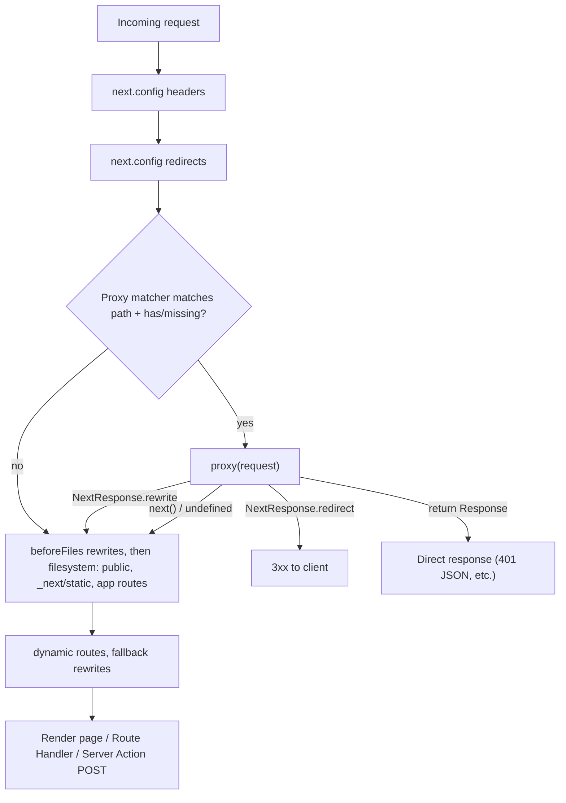

## Bối cảnh & vấn đề

Tháng 3/2025, một lỗ hổng mức Critical (CVSS 9.1) được công bố cho Next.js: **CVE-2025-29927**. Chỉ cần gửi thêm một header nội bộ, `x-middleware-subrequest`, kẻ tấn công khiến Next **bỏ qua hoàn toàn middleware**. Rất nhiều ứng dụng self-host đặt toàn bộ kiểm tra đăng nhập trong `middleware.ts`: "không có cookie session thì redirect `/login`". Với những app đó, lỗ hổng này nghĩa là mọi trang admin mở toang.

Bài học không chỉ là "patch nhanh". Middleware (ở Next 16 gọi là **proxy**) là một lớp chạy **trước** routing, nhìn thấy request và quyết định rewrite, redirect hay gắn header. Nó rất tiện cho những việc ở tầng mạng. Nhưng nó ở **xa dữ liệu**, không biết Server Action nào được gọi, không chạy lại khi layout được giữ, và có thể bị matcher bỏ qua mà không ai để ý. Next 16 đổi tên file thành `proxy.ts` một phần để nói rõ điều đó: đây là một "proxy" ở biên mạng, **không phải** chỗ đặt authorization.

Bài này dạy proxy làm được gì, chạy ở đâu trong chuỗi xử lý, các lỗi matcher (có hai lỗi chạy thật đáng sợ), cách rewrite cho storefront multi-tenant, và vì sao kiểm tra thật phải nằm ở [DAL](/tracks/nextjs/learn/auth-data-security).

## Khái niệm

### `proxy.ts` ở Next 16

**Proxy** là code chạy trên server **trước khi request được hoàn tất**. Dựa trên request, nó có thể rewrite (hiển thị URL khác mà không đổi URL của user), redirect, sửa request/response header, set cookie, hoặc trả response trực tiếp. Next 16 **đổi tên** file `middleware.ts` thành `proxy.ts` và export `middleware` thành `proxy`. Tên cũ bị deprecated nhưng vẫn chạy. Flag cấu hình cũng đổi tên (`skipMiddlewareUrlNormalize` thành `skipProxyUrlNormalize`). Codemod: `npx @next/codemod@canary middleware-to-proxy .`.

Theo upgrade guide, runtime của proxy là **`nodejs` và không cấu hình được**: đặt `runtime` trong file proxy sẽ throw. Muốn tiếp tục dùng edge runtime thì tạm giữ `middleware.ts`. Mỗi project chỉ có **một** file proxy, đặt ở root (hoặc trong `src/`), cùng cấp với `app/`. Nó export đúng một hàm (default hoặc named `proxy`) và tùy chọn `config.matcher`.

Vì sao đổi tên? Theo docs, "middleware" dễ bị hiểu nhầm là middleware kiểu Express (một chuỗi xử lý bạn gắn logic nghiệp vụ vào), và việc tính năng này quá mạnh khuyến khích lạm dụng. "Proxy" gợi ý đúng bản chất: một **ranh giới mạng đứng trước app**, có thể chạy tách khỏi runtime chính của ứng dụng. Next khuyên chỉ dùng nó "as a last resort".

**Interview angle:** câu "tại sao đổi tên thành proxy?" muốn nghe: tránh nhầm với Express middleware, nhấn mạnh vai trò network boundary, và thông điệp "đừng đặt logic nghiệp vụ hay authorization ở đây".

### Proxy dùng cho gì, không dùng cho gì

**Nên dùng** cho: rewrite theo host hay header (multi-tenant, A/B test theo cookie), redirect theo request (locale, domain cũ), gắn header (CSP nonce, correlation id), **optimistic auth check** (không có cookie session thì redirect `/login` sớm cho UX), CORS cho `/api`, chặn bot hay IP xấu.

**Không nên dùng** cho: data fetching chậm (proxy chạy trên mọi request khớp, kể cả prefetch), session management hay authorization đầy đủ, và cache (docs: `fetch` với `cache`, `next.revalidate`, `next.tags` **không có tác dụng** trong proxy). `revalidateTag`/`revalidatePath` cũng không gọi được trong proxy. Docs cũng dặn không dựa vào module dùng chung hay global, vì trong trường hợp tối ưu proxy có thể được deploy riêng ra CDN.

### Thứ tự thực thi

Theo docs, với mỗi request: (1) `headers` trong `next.config`, (2) `redirects` trong `next.config`, (3) **proxy**, (4) `beforeFiles` rewrites, (5) filesystem routes (`public/`, `_next/static/`, `app/`…), (6) `afterFiles` rewrites, (7) dynamic routes, (8) `fallback` rewrites. Như vậy proxy chạy **trước** cả việc phục vụ file tĩnh, và đó là lý do matcher quan trọng.

**Server Function không phải route riêng** trong chuỗi này: action được gửi dạng POST tới **route nơi nó được dùng**. Matcher loại trừ path đó thì action gọi trên path đó cũng **không qua proxy**. Refactor chuyển action sang trang khác có thể âm thầm làm mất coverage.

### Matcher

`config.matcher` giới hạn path mà proxy chạy. Không có matcher thì proxy chạy trên **mọi request**, kể cả `_next/static`, `_next/image`, file `public/`. Matcher nhận string, mảng, hoặc object `{ source, has, missing, locale }`. `source` theo cú pháp path-to-regexp (`/about/:path*`, regex trong ngoặc, negative lookahead). Giá trị matcher phải là **hằng số phân tích tĩnh được lúc build**: biến bị bỏ qua. Một điểm hay: kể cả khi loại `_next/data` bằng negative matcher, proxy **vẫn chạy** cho `_next/data` (Pages Router) để bạn không quên bảo vệ data route của trang đã bảo vệ.

### Unit test proxy

Từ Next 15.1 có `next/experimental/testing/server`: `unstable_doesProxyMatch({ config, nextConfig, url })` kiểm tra proxy có chạy cho URL không, còn `isRewrite`/`getRewrittenUrl`/`getRedirectUrl` kiểm tra kết quả của hàm proxy. Nên có test cho các path quan trọng (`/admin`, `/_next/static/x.css`, action endpoint).

### CVE-2025-29927

Next dùng header nội bộ **`x-middleware-subrequest`** để phát hiện vòng lặp đệ quy (middleware gọi lại chính app). Bản lỗi tin header này cả khi nó đến **từ bên ngoài**. Kẻ tấn công gửi header với giá trị phù hợp thì middleware bị bỏ qua. Theo GitHub Advisory: ảnh hưởng 12.0.0–12.3.4, 13.0.0–13.5.8, 14.0.0–14.2.24, 15.0.0–15.2.2; bản vá **12.3.5, 13.5.9, 14.2.25, 15.2.3**; CVSS 9.1. Workaround khi chưa nâng được: **chặn mọi request bên ngoài có header `x-middleware-subrequest`** ở reverse proxy hoặc WAF. Deployment trên Vercel được bảo vệ tự động.

## Cơ chế hoạt động



Request đi qua `headers` và `redirects` tĩnh trong config trước. Sau đó matcher quyết định proxy có chạy không. Nếu chạy, proxy có bốn lối ra: redirect (trả 3xx ngay), trả response trực tiếp (ví dụ 401 JSON cho `/api`), rewrite (tiếp tục routing với URL đích, user vẫn thấy URL cũ), hoặc cho đi tiếp. Chỉ sau đó mới tới file tĩnh và route của app. Hai hệ quả thực tế: proxy không có matcher sẽ chặn cả file CSS/JS/ảnh, và mọi thứ proxy làm đều nằm trên đường nóng của **mọi** request khớp, nên phải nhanh.

## Ví dụ thực tế

Scratch app Next 16.3.7 (không bật Cache Components). Proxy làm hai việc: rewrite theo host cho storefront, và redirect `/login` khi thiếu cookie `session`.

```ts
// proxy.ts
import { NextResponse, type NextRequest } from 'next/server';
const TENANTS: Record<string, string> = { 'acme.localhost': 'acme', 'shoes.localhost': 'shoes' };

export function proxy(request: NextRequest) {
  const host = request.headers.get('host')?.split(':')[0] ?? '';
  const tenant = TENANTS[host];
  if (tenant) {
    const url = request.nextUrl.clone();
    url.pathname = `/sites/${tenant}${url.pathname === '/' ? '' : url.pathname}`;
    return NextResponse.rewrite(url);            // user still sees acme.localhost/
  }
  if (!request.cookies.has('session')) {
    return NextResponse.redirect(new URL('/login', request.url)); // optimistic check only
  }
}
```

Build output có thêm một dòng `ƒ Proxy (Middleware)`.

### Lỗi 1: không có matcher, CSS và favicon bị redirect

```bash
for u in /account /_next/static/chunks/1r9pxrlejbj15.css /favicon.ico; do
  curl -s -o /dev/null -w "%{http_code} %{redirect_url} $u\n" localhost:3100$u; done
curl -s -H "Host: acme.localhost" localhost:3100/ | grep -o "Storefront of [a-z]*"
```

```text
307 http://localhost:3100/login /account
307 http://localhost:3100/login /_next/static/chunks/1r9pxrlejbj15.css
307 http://localhost:3100/login /favicon.ico
Storefront of acme
```

User chưa đăng nhập vào `/login` sẽ thấy trang **không có CSS**, vì chính file CSS cũng bị redirect về `/login`. Thêm matcher theo mẫu trong docs:

```ts
export const config = {
  matcher: [
    {
      source: '/((?!api|_next/static|_next/image|favicon.ico|sitemap.xml|robots.txt).*)',
      missing: [
        { type: 'header', key: 'next-router-prefetch' },
        { type: 'header', key: 'purpose', value: 'prefetch' },
      ],
    },
  ],
};
```

```text
307 http://localhost:3100/login /account
200  /_next/static/chunks/1r9pxrlejbj15.css
404  /favicon.ico
200  /api/time
```

### Lỗi 2: bỏ qua prefetch trong matcher làm lộ nội dung

Mẫu `missing: next-router-prefetch` ở trên có mặt trong docs để proxy không chạy cho prefetch (giảm tải). Nhưng nếu proxy **là lớp auth duy nhất**, chạy thật cho thấy:

```bash
# unauthenticated, but pretends to be a router prefetch
curl -s -H "Next-Router-Prefetch: 1" -H "RSC: 1" "localhost:3100/account?_rsc=HEAvJdHAQJrUAe2K" | grep -a -o "Account (secret)"
curl -s -o /dev/null -w "%{http_code} %{redirect_url}\n" -H "RSC: 1" "localhost:3100/account?_rsc=HEAvJdHAQJrUAe2K"
```

```text
Account (secret)
307 http://localhost:3100/login
```

Request thường bị redirect, nhưng chỉ cần thêm header `Next-Router-Prefetch: 1` là proxy không chạy, và server trả nguyên RSC payload của trang "được bảo vệ". Header do client tự đặt thì không phải cơ chế bảo mật. Đây là minh chứng rõ nhất cho nguyên tắc: **trang có dữ liệu nhạy cảm phải tự kiểm tra session** (DAL, page, action), proxy chỉ là lớp UX.

### CVE header trên bản đã vá

```bash
curl -s -o /dev/null -w "%{http_code} %{redirect_url}\n" \
  -H "x-middleware-subrequest: middleware:middleware:middleware:middleware:middleware" localhost:3100/account
```

```text
307 http://localhost:3100/login
```

Ở 16.3.7 header bị bỏ qua và proxy vẫn chạy. Kiểm tra môi trường đang chạy bằng đúng request này (và các biến thể giá trị header) là một bài test hồi quy tốt. Thêm vào đó, reverse proxy nên **strip** mọi header nội bộ có tiền tố `x-middleware-` / `x-nextjs-` từ client.

### Storefront multi-tenant trên một deployment

Kiến trúc tổng quát (docs có Platforms Starter Kit làm tham khảo):

```text
acme.shop.com/products/shoe   --proxy rewrite-->  /sites/acme/products/shoe
shoes.localhost/              --proxy rewrite-->  /sites/shoes
unknown.shop.com              --proxy-->          404 (or marketing page)
```

1. **Proxy** đọc `host` và map domain/subdomain sang `tenantSlug`. Bảng mapping nằm trong config, hoặc KV đọc nhanh với cache ngắn **trong bộ nhớ của proxy** (fetch cache không có tác dụng ở đây). Proxy **rewrite** nội bộ sang `/sites/[tenant]/…`, URL user không đổi. `NextResponse.rewrite` tự lan truyền header RSC cần thiết. Domain lạ thì trả 404 hoặc trang giới thiệu.
2. **Cây `app/sites/[tenant]/…`**: tenant là một phần của route, nên prerender và cache tự tách theo tenant (`generateStaticParams` cho tenant lớn, còn lại render theo nhu cầu).
3. **Data layer** lấy tenant từ `params` hoặc từ host phía server, **không bao giờ** từ input client, và kiểm tra lại (tenant tồn tại và active). Mọi cache key và tag chứa tenant.
4. **Branding** qua CSS variables từ config tenant; **SEO** riêng (canonical theo domain thật, sitemap và robots per tenant qua `sitemap.ts` đọc host).
5. **Auth**: cookie scope theo domain; custom domain cần TLS tự động (cert per domain ở LB/CDN).
6. **Đổi custom domain**: cập nhật mapping trong proxy (cache ngắn), invalidate tag của tenant (canonical, sitemap), redirect 308 domain cũ sang domain mới, cập nhật cert và cookie domain.

Khi dùng `revalidatePath` với rewrite, phải truyền path **đích** (`/sites/acme/...`), không phải URL user thấy.

## Trade-offs & lựa chọn thay thế

| Việc cần làm | Proxy | `next.config` redirects/rewrites/headers | Trong route (page/DAL/action) | Reverse proxy/CDN |
| --- | --- | --- | --- | --- |
| Redirect cố định (domain cũ) | được | **tốt nhất** (tĩnh, nhanh) | không | tốt |
| Rewrite theo host/cookie | **tốt nhất** | hạn chế (`has`) | không | được nhưng tách khỏi code |
| Optimistic auth redirect | **tốt** (UX) | không | cũng làm | không |
| Authorization thật | **không** | không | **bắt buộc** | không |
| Data fetch/cache | không (fetch cache vô tác dụng) | không | có | CDN cache |
| Header bảo mật (CSP nonce) | tốt (nonce per request) | tốt (header tĩnh) | không | tốt |
| Chặn header nội bộ, rate limit | được | không | không | **tốt nhất** |

Chọn thế nào. Cái gì tĩnh (redirect cố định, header không đổi) thì để `next.config`, vì rẻ và không có code chạy mỗi request. Cái gì phụ thuộc request nhưng không cần dữ liệu (host, cookie có tồn tại không, locale) thì dùng proxy. Cái gì cần dữ liệu hoặc quyết định quyền truy cập thì đặt ở route, DAL và action. Hạ tầng (WAF, nginx) lo lọc header nội bộ, rate limit và body size.

## Edge cases & failure modes

- **Không có matcher**: auth redirect chặn CSS/JS/ảnh (đã chạy thật: `.css` trả 307) và tốn CPU cho mọi request tài nguyên.
- **Matcher bỏ qua prefetch** + proxy là lớp auth duy nhất: payload trang bảo vệ lộ ra với header `Next-Router-Prefetch: 1` (đã chạy thật). Chỉ bỏ qua prefetch khi trang tự kiểm tra quyền.
- **Matcher dùng biến**: `matcher: PROTECTED_PATHS` bị bỏ qua vì không phân tích tĩnh được → proxy chạy ở chỗ không mong muốn, hoặc không chạy.
- **Server Action ngoài matcher**: action POST tới path bị loại → không qua proxy; chuyển action sang trang khác cũng làm mất coverage mà không có cảnh báo.
- **Layout được giữ khi navigate**: proxy vẫn chạy cho request RSC của trang con, nhưng proxy không nhìn thấy dữ liệu và không biết quyền chi tiết, nên kiểm tra chi tiết vẫn phải ở route.
- **Header request quá lớn**: gắn JWT to vào request header trong proxy có thể gây `431 Request Header Fields Too Large` ở server phía sau.
- **Nhầm `NextResponse.next({ headers })`** với `NextResponse.next({ request: { headers } })`: dạng đầu gửi header xuống **client** (có thể lộ thông tin), dạng sau mới truyền lên route.
- **Rewrite tự làm bằng `fetch`**: mất header RSC, navigation client-side hỏng; dùng `NextResponse.rewrite` hoặc bật `skipProxyUrlNormalize` và tự forward.
- **Proxy gọi DB/API chậm**: mọi request khớp (kể cả prefetch nếu không loại) chịu thêm độ trễ; lỗi DB làm sập toàn site thay vì một trang.

## Pitfalls

- ❌ Đặt toàn bộ auth trong proxy → ✅ proxy chỉ optimistic redirect; `verifySession()` + phân quyền trong DAL, page nhạy cảm, mọi action và handler.
- ❌ Proxy không matcher → ✅ negative lookahead loại `_next/static`, `_next/image`, file metadata.
- ❌ Bỏ qua prefetch trong matcher rồi tin proxy bảo vệ trang → ✅ trang tự kiểm tra; bỏ qua prefetch chỉ để giảm tải.
- ❌ Giữ `middleware.ts` + export `middleware` khi lên 16 mà không lý do → ✅ codemod `middleware-to-proxy`; chỉ giữ tên cũ nếu thật sự cần edge runtime.
- ❌ `export const runtime = 'edge'` trong `proxy.ts` → ✅ proxy luôn là Node.js; đặt runtime sẽ throw.
- ❌ Dùng `fetch(..., { next: { revalidate } })` trong proxy để cache mapping tenant → ✅ vô tác dụng; dùng cache trong bộ nhớ có TTL hoặc KV nhanh.
- ❌ Chỉ patch Next khi có CVE → ✅ patch + strip header nội bộ ở reverse proxy + test hồi quy bypass + dependency update tự động.
- ❌ Lấy tenant từ query string hay body → ✅ từ host (proxy) hoặc params phía server, kiểm tra tồn tại.

## Tóm tắt

- Next 16 đổi `middleware.ts` → `proxy.ts` (export `proxy`), runtime cố định Node.js, một file mỗi project; codemod `middleware-to-proxy`.
- Proxy chạy sau `headers`/`redirects` của config và **trước** filesystem routes; dùng cho rewrite, redirect, header, optimistic auth; không dùng cho data fetching hay authorization (fetch cache vô tác dụng).
- Không matcher = chạy mọi request, kể cả CSS (đã chạy thật: 307 cho file `.css`); matcher phải là hằng số.
- Server Action là POST tới route nơi nó được dùng: matcher loại route đó thì action cũng không qua proxy.
- Bỏ qua prefetch trong matcher: request tự đặt `Next-Router-Prefetch: 1` lấy được payload trang "bảo vệ" (đã chạy thật).
- CVE-2025-29927: header `x-middleware-subrequest` bypass middleware; vá ở 12.3.5 / 13.5.9 / 14.2.25 / 15.2.3; bài học defense in depth.
- Multi-tenant: proxy map host → tenant và rewrite sang `/sites/[tenant]`; tenant trong mọi key, tag, canonical và sitemap.
