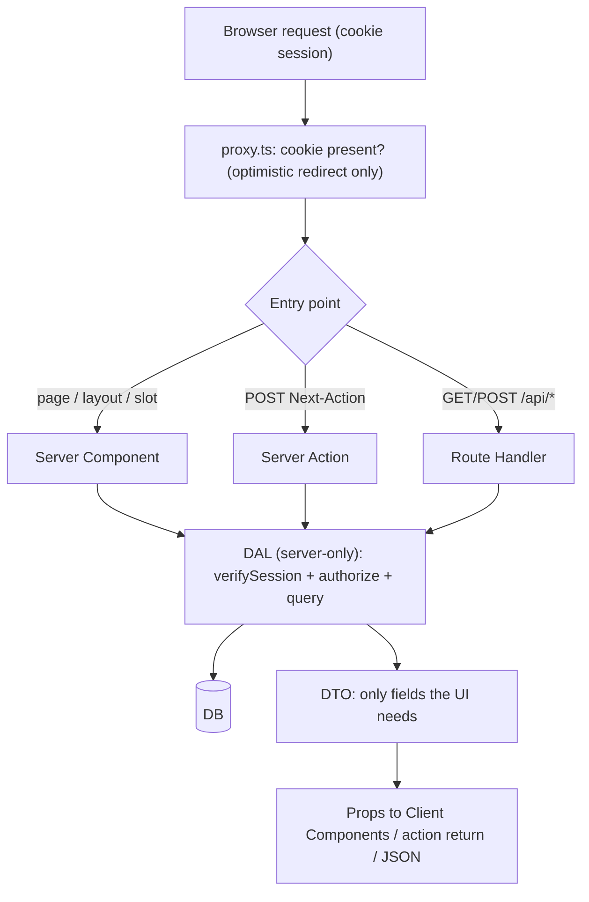
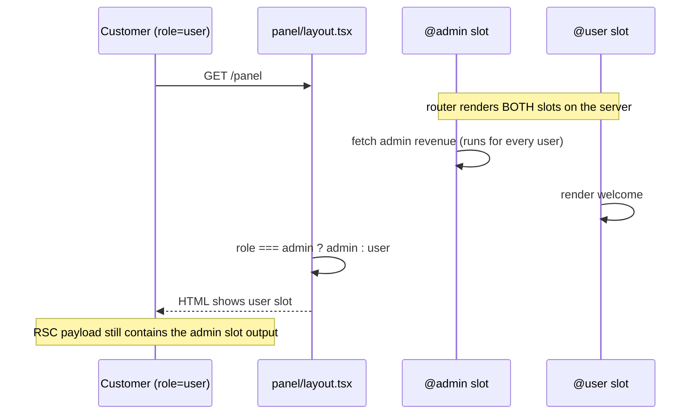

## Bối cảnh & vấn đề

Một buổi pentest trước ngày launch trả về ba finding:

1. "Bất kỳ user đã đăng nhập nào cũng xoá được toàn bộ bản ghi". Trang `/admin` redirect người không phải admin, nhưng Server Action `deleteAllRecords` không kiểm tra gì.
2. "View source trang profile công khai chứa `passwordHash` và `internalNote`". Server Component truyền nguyên record DB xuống Client Component.
3. "Widget doanh thu dành cho admin xuất hiện trong response của khách hàng". Layout chọn giữa slot `@admin` và `@user` theo role, nhưng cả hai slot đều render.

Không finding nào do thư viện auth hỏng. Cả ba đều do đặt kiểm tra **sai chỗ**. App Router có nhiều "cửa" vào dữ liệu: Server Component, Server Action, Route Handler, slot, metadata. Và nhiều thứ trông giống lớp bảo vệ nhưng không phải: layout, proxy, việc "không render form". Bài này dựng kiến trúc mà docs Next khuyến nghị (session cookie, **Data Access Layer**, DTO), chạy thật hai trong ba lỗ hổng trên, so sánh DAL trực tiếp với API riêng, và kết thúc bằng checklist review. Hai lỗ hổng còn lại đã có trong bài [Server Components](/tracks/nextjs/learn/server-client-components) (payload) và [Server Actions](/tracks/nextjs/learn/server-actions) (gọi action bằng curl).

## Khái niệm

### Authentication, session và authorization

**Authentication** là xác định bạn là ai (đăng nhập). **Session** là cách nhớ trạng thái đó qua các request. **Authorization** là xác định bạn được làm gì với tài nguyên nào. Hầu hết lỗ hổng thực tế nằm ở authorization: đã đăng nhập, nhưng không được sửa đơn hàng của người khác.

Docs chia authorization thành hai loại. **Optimistic check** đọc session từ cookie (không đụng DB) để quyết định UI nhanh: ẩn menu, redirect `/login`. **Secure check** đọc session hoặc quyền từ database, dùng trước mọi thao tác trên dữ liệu nhạy cảm.

### Session: stateless và database

- **Stateless session**: dữ liệu session (userId, role, hạn) được **mã hoá/ký** (JWE/JWS, ví dụ bằng `jose` hay `iron-session`) và nằm trong cookie. Không cần tra DB, nhưng **khó thu hồi** trước khi hết hạn.
- **Database session**: cookie chỉ chứa **session id** ngẫu nhiên; dữ liệu nằm trong DB/Redis. Thu hồi tức thì (xoá row), đổi lại mỗi lần kiểm tra tốn một lần tra cứu.

Cookie session theo docs: `HttpOnly` (JS không đọc được, chống XSS đánh cắp token), `Secure` (chỉ HTTPS), `SameSite=Lax` (chống phần lớn CSRF), `Expires`/`Max-Age`, `Path=/`. **Không** lưu token trong `localStorage`: mọi script trên trang (kể cả script bên thứ ba bị chèn) đều đọc được.

### Data Access Layer (DAL)

**DAL** là một thư viện nội bộ, chạy chỉ trên server (`import 'server-only'`), kiểm soát **cách** và **khi nào** dữ liệu được lấy, và **cái gì** được đưa vào render context. Docs khuyến nghị DAL cho project mới. Nó thường có:

- `verifySession()`: đọc và giải mã cookie, redirect `/login` nếu không hợp lệ, bọc `React.cache` để nhiều component trong một request chỉ kiểm tra một lần.
- Các hàm lấy dữ liệu **tự kiểm tra quyền** trước khi truy vấn (`getOrder(id)` kiểm tra order thuộc user hoặc tenant) và trả **DTO**.
- Chỉ DAL được import client DB và đọc biến môi trường chứa secret.

```ts
// lib/dal.ts
import 'server-only';
import { cache } from 'react';
import { cookies } from 'next/headers';
import { redirect } from 'next/navigation';
import { decrypt } from './session';

export const verifySession = cache(async () => {
  const token = (await cookies()).get('session')?.value;
  const session = await decrypt(token);            // null if invalid/expired
  if (!session?.userId) redirect('/login');
  return { userId: session.userId as string, role: session.role as 'user' | 'admin', tenantId: session.tenantId as string };
});

export async function getOrderForViewer(orderId: string) {
  const s = await verifySession();
  const order = await db.order.findFirst({ where: { id: orderId, tenantId: s.tenantId, ownerId: s.userId } });
  if (!order) return null;                          // not found OR not yours: same answer
  return { id: order.id, total: order.total, status: order.status }; // DTO
}
```

Lợi ích cốt lõi: **ở đâu gọi `getOrderForViewer`, ở đó có kiểm tra quyền**, nên developer không thể "quên check" ở một trang mới.

### DTO và `server-only`

**DTO (Data Transfer Object)** là object chỉ chứa field mà nơi nhận cần. Vì props của Client Component và return value của Server Action được serialize xuống browser, DTO là cách chính để không lộ `passwordHash`, `email` của người khác hay ghi chú nội bộ. `import 'server-only'` biến việc import nhầm module server vào Client Component thành **lỗi build**.

### Taint API

Lớp phòng thủ thêm (experimental): bật `experimental.taint`, rồi `experimental_taintObjectReference(message, obj)` để React **throw** nếu object đó đi qua ranh giới server/client, và `experimental_taintUniqueValue(message, lifetimeObj, value)` cho một giá trị (token, key). Bật flag này cũng taint luôn `process.env` (object). Giới hạn theo docs: chỉ theo dõi **theo reference**; bản copy (`{...user}`) và giá trị dẫn xuất không được bảo vệ. Docs cảnh báo không dùng taint làm cơ chế duy nhất.

### Vì sao layout và proxy không phải lớp bảo mật

- **Layout không re-render khi navigate** giữa các trang con (partial rendering), nên kiểm tra trong layout không chạy lại khi session hết hạn hay role bị thu hồi.
- **Layout không kiểm soát việc render của phần còn lại**: segment con và parallel slot được **router** render, nên layout "ẩn" hay "đổi" chúng không ngăn chúng chạy, cũng không ngăn output của chúng có mặt trong RSC payload (docs nói đúng như vậy, và phần Ví dụ chạy thật).
- **Layout await auth ở top-level** còn chặn streaming của cả segment.
- **Proxy** chỉ là optimistic check: chạy trên mọi route khớp (kể cả prefetch nên không được tra DB), có thể bị matcher bỏ qua, không thấy Server Action ngoài matcher, và từng bị bypass hoàn toàn (CVE-2025-29927, [bài 8](/tracks/nextjs/learn/proxy)).

Quy tắc: kiểm tra **gần dữ liệu** (DAL), ở **component render dữ liệu nhạy cảm** (page, leaf component, từng slot), và ở **mỗi Server Action và Route Handler**. Layout chỉ nên lấy user để hiển thị (avatar), qua DAL.

## Cơ chế hoạt động



Mọi cửa vào (trang, slot, action, handler) đều đi qua **một** lớp DAL. Proxy đứng trước chỉ để redirect sớm cho trải nghiệm tốt hơn: gỡ nó đi, hệ thống vẫn an toàn. DAL là nơi duy nhất nói chuyện với DB, luôn kiểm tra session và quyền **trước** khi truy vấn, và luôn trả DTO. Kết quả DAL trả về mới được phép thành props, return value hay JSON. Nhờ vậy khi audit, reviewer chỉ cần đọc DAL và kiểm tra rằng không có chỗ nào import DB ở ngoài nó.



Sơ đồ thứ hai giải thích lỗ hổng slot. Layout nhận `admin` và `user` là **kết quả đã render**, không phải hàm được gọi có điều kiện. Router đã chạy cả hai slot trước khi layout quyết định hiển thị cái nào, và output của cả hai nằm trong payload gửi xuống.

## Ví dụ thực tế

### Slot `@admin` lộ trong response của khách hàng (chạy thật, Next 16.3.7)

```tsx
// app/panel/layout.tsx
export default async function Layout({ admin, user }: { admin: React.ReactNode; user: React.ReactNode; children: React.ReactNode }) {
  const role = (await cookies()).get('role')?.value;
  return <section>{role === 'admin' ? admin : user}</section>;
}
// app/panel/@admin/page.tsx
export default async function AdminSlot() {
  console.log('[slot] @admin rendered');
  return <p>Revenue today: $98,765 (ADMIN ONLY)</p>;
}
```

```bash
curl -s -b role=user localhost:3100/panel | grep -o "Revenue today[^<\\]*\|Welcome, customer" | sort -u
```

```text
Revenue today: $98,765 (ADMIN ONLY)
Welcome, customer
server log: [slot] @admin rendered
```

Khách hàng chỉ **thấy** "Welcome, customer" trên màn hình, nhưng chuỗi doanh thu có trong RSC payload inline của HTML, và query admin chạy cho mọi request. Bản sửa: slot tự authorize qua DAL.

```tsx
// app/panel/@admin/page.tsx
import { getAdminStats } from '@/lib/dal'; // throws/forbidden() if not admin
export default async function AdminSlot() {
  const stats = await getAdminStats();
  return <Stats stats={stats} />;
}
```

### Taint chặn object nhạy cảm (chạy thật)

```tsx
// next.config.ts: experimental: { taint: true }
async function getUser() {
  const user = { name: 'An', passwordHash: '$2b$10$abc', apiToken: 'sk_live_123456789' };
  experimental_taintObjectReference('Do not pass the whole user object to the client. Pick fields.', user);
  experimental_taintUniqueValue('Do not pass API tokens to the client.', user, user.apiToken);
  return user;
}
export default async function Page() { const u = await getUser(); return <Card user={u} />; } // Card is 'use client'
```

```text
GET /taint -> 500
⨯ Error: Do not pass the whole user object to the client. Pick fields.
```

Sửa bằng `<Card user={{ name: u.name }} />`. Taint là lưới an toàn; DTO là thiết kế đúng.

### Debug: admin page redirect nhưng user thường vẫn xoá được

```tsx
// app/admin/page.tsx
export default async function AdminPage() {
  const session = await auth();
  if (!session?.user?.isAdmin) redirect('/login');
  return <form action={deleteAllRecords}><button>Delete all</button></form>;
}
// app/admin/actions.ts
'use server';
export async function deleteAllRecords() { await db.record.deleteMany(); }
```

Ở bài 7, action này được gọi thẳng bằng curl với header `Next-Action` mà không cần cookie admin, và nó đã chạy. Action ID có trong JS gửi cho mọi admin, và có thể lộ qua HTML, log, extension. Việc ID được mã hoá hay khó đoán chỉ giảm rủi ro, không phải cơ chế bảo mật. Bản sửa:

```ts
'use server';
import { requireAdmin } from '@/lib/dal';
import { z } from 'zod';
const Confirm = z.object({ confirm: z.literal('DELETE') });

export async function deleteAllRecords(formData: FormData) {
  const admin = await requireAdmin();                         // authn + authz (role from DB, not cookie)
  Confirm.parse({ confirm: formData.get('confirm') });        // explicit confirmation
  await rateLimit(`danger:${admin.userId}`, { max: 3, per: '1h' });
  await audit.log({ actor: admin.userId, action: 'records.deleteAll' });
  await db.record.deleteMany({ where: { tenantId: admin.tenantId } });
}
```

Test tự động chứng minh action từ chối non-admin: gọi trực tiếp hàm action trong integration test với session giả (mock `cookies()`, hoặc tầng DAL nhận session qua tham số), assert throw `Forbidden` và DB không đổi. E2E thì gửi POST có header `Next-Action` với cookie user thường và assert trạng thái lỗi.

### OAuth/JWT: token ở đâu, SSR kiểm tra thế nào, refresh ra sao

Khung trả lời mạnh cho câu CV về Google OAuth + JWT:

- **Flow**: `/login` redirect sang Google với `state` (chống CSRF) và **PKCE** (`code_challenge`); callback là **Route Handler** `app/api/auth/callback/route.ts`, kiểm tra `state`, đổi code lấy token ở server, rồi tạo **session nội bộ** (không đưa access token của Google xuống browser).
- **Lưu trữ**: cookie `HttpOnly; Secure; SameSite=Lax` chứa session id (database session) hoặc JWT ngắn hạn đã ký; refresh token (nếu có) chỉ ở server/DB, **rotation** mỗi lần dùng.
- **SSR**: Server Component gọi `verifySession()` (DAL), và khi gọi backend API thì forward identity (bearer token nội bộ hoặc mTLS), không forward nguyên cookie browser tới hệ thống bên ngoài.
- **Refresh race**: hai request song song cùng thấy access token hết hạn và cùng refresh. Với rotation, refresh token thứ hai đã bị vô hiệu, nên một request thất bại, hoặc tệ hơn server phát hiện "reuse" và thu hồi cả family. Giải pháp: khoá theo session (single-flight: request đầu refresh, các request khác chờ kết quả), grace window ngắn cho token cũ, hoặc refresh chủ động trước hạn trong một chỗ duy nhất. Lưu ý Server Component **không set được cookie**: việc ghi cookie mới phải ở Server Action, Route Handler hoặc proxy.
- **Logout**: xoá cookie + revoke session/refresh token ở server.
- (Điền chi tiết thật của bạn: thư viện, thời hạn token, sự cố gặp phải.)

## Trade-offs & lựa chọn thay thế

| Tiêu chí | DAL trực tiếp trong Next | API riêng (Node/Nest) + Next làm BFF |
| --- | --- | --- |
| Latency | ít hop nhất (Server Component → DB) | thêm một hop mạng mỗi request |
| Nhiều loại client (mobile, đối tác) | phải dựng thêm Route Handler/API | dùng chung một API |
| Tổ chức team | hợp team full-stack nhỏ | hợp team backend riêng, ngôn ngữ khác |
| Scale và deploy | scale cùng web | scale/deploy độc lập |
| Authorization | nằm trong DAL của Next | nằm ở API; Next áp dụng zero trust |
| Rủi ro chính | logic nghiệp vụ lẫn vào UI; quên DAL | logic nhân đôi ở hai nơi; forward identity sai |

Docs nêu ba cách tiếp cận: HTTP API riêng (cho tổ chức lớn, có sẵn), DAL (cho project mới), truy cập dữ liệu ở cấp component (chỉ cho prototype). Và khuyên **chọn một cách và nhất quán** để dev lẫn auditor biết phải kỳ vọng gì. Với một nền tảng B2B2C có mobile app, đối tác tích hợp và team backend riêng, API domain riêng là hợp lý. Next khi đó là **BFF**: Server Components gọi API bằng `fetch` với cache tag, forward identity an toàn, và tuân theo **zero trust**: không tin rằng request đã qua Next là hợp lệ, API tự xác thực. Với một sản phẩm web-only và team nhỏ, DAL trực tiếp nhanh và đơn giản hơn. Dù chọn gì: **authorization và luật multi-tenant chỉ nằm ở một nơi**.

Truyền identity từ Next sang API riêng: token nội bộ ngắn hạn do Next ký (hoặc token exchange từ session), gửi qua header `Authorization`, API verify chữ ký và audience; hoặc mTLS/service mesh kèm header user đã ký. Không truyền user id dạng plain header mà API tin mù quáng.

## Edge cases & failure modes

- **Layout check + trang con**: session hết hạn nhưng navigate giữa các trang con vẫn chạy (layout không re-render); trang con không có check riêng thì lộ dữ liệu.
- **Conditional slot**: cả hai slot render và có trong payload (đã chạy thật). Authorize trong từng slot.
- **`generateMetadata` lấy dữ liệu nhạy cảm**: `<title>` "Hợp đồng của khách X" lộ dù body có check. Metadata cũng phải qua DAL.
- **Return value của action**: trả nguyên record sau update → lộ như props. Trả DTO.
- **IDOR**: `getOrder(params.id)` không kiểm tra owner hay tenant → đổi id trên URL là xem được đơn người khác. Folder `[param]` là input của user.
- **Cache dùng chung dữ liệu per user**: `'use cache'` hay CDN cache trang có thông tin cá nhân → user B thấy dữ liệu của A. Không cache chung; `Cache-Control: private`.
- **Stateless JWT không thu hồi được**: user bị khoá vẫn truy cập tới khi JWT hết hạn. Hạn ngắn + danh sách thu hồi, hoặc database session.
- **CSRF trên Route Handler dùng cookie**: Server Action có kiểm tra Origin sẵn, Route Handler POST thì không; tự kiểm tra Origin hoặc CSRF token.
- **`NEXT_PUBLIC_` chứa secret**: bị inline vào bundle, ai cũng đọc được ([bài 10](/tracks/nextjs/learn/config-env-toolchain)).
- **SSRF qua `next/image`**: `remotePatterns` quá rộng hoặc bật `dangerouslyAllowLocalIP` → server tải URL nội bộ.

## Pitfalls

- ❌ Chặn ở layout và coi cả nhánh được bảo vệ → ✅ DAL + check ở page/leaf/slot/action.
- ❌ Tin proxy matcher phủ `/admin` → ✅ proxy chỉ để redirect sớm; action và handler tự kiểm tra.
- ❌ "Action ID bí mật nên an toàn" → ✅ coi mọi action là public POST endpoint.
- ❌ Kiểm tra authentication rồi quên authorization → ✅ kiểm tra quyền trên **đúng tài nguyên** (owner, tenant, role từ DB).
- ❌ Truyền record DB xuống Client Component → ✅ DTO; `server-only` cho DAL; taint làm lưới an toàn.
- ❌ Token trong `localStorage` → ✅ cookie `HttpOnly; Secure; SameSite=Lax`.
- ❌ Trộn ba cách data fetching trong một codebase → ✅ chọn một (DAL hoặc API) và nhất quán để dễ audit.
- ❌ Refresh token song song không khoá → ✅ single-flight theo session khi dùng rotation.

## Checklist security review trước launch

- **Server Actions**: mỗi action có authn + authz + validate (zod) + trả DTO; không nhận ownership từ client (IDOR); rate limit thao tác đắt/nguy hiểm; `bodySizeLimit` hợp lý; `allowedOrigins` khi đứng sau proxy khác domain.
- **Data exposure**: props xuống Client Components là DTO; `server-only` cho DAL và module secret; DB client chỉ import trong DAL; taint cho object nhạy cảm; `NEXT_PUBLIC_*` không có secret.
- **Auth**: cookie `HttpOnly/Secure/SameSite`; không dựa vào layout/proxy; session hết hạn và thu hồi được; logout revoke ở server.
- **Routing**: mọi `[param]` được validate; slot tự authorize; `generateMetadata` qua DAL.
- **Cache**: không `'use cache'`/CDN cache dữ liệu per user; key và tag có tenant; `Cache-Control: private` cho trang cá nhân.
- **Headers**: CSP (nonce sinh trong proxy), HSTS, `frame-ancestors`/`X-Frame-Options`, `poweredByHeader: false`.
- **Route Handlers & webhooks**: verify chữ ký (HMAC), kiểm tra CSRF với POST dùng cookie, idempotency.
- **Dependencies & infra**: Next đã vá advisory (CVE-2025-29927 và các bản sau); strip header nội bộ ở reverse proxy; `remotePatterns` chặt, không bật `dangerouslyAllowLocalIP` bừa.

Mục bị bỏ sót nhiều nhất trên thực tế: **authorization trong từng Server Action** và **DTO cho props/return value**.

## Tóm tắt

- Session nằm trong cookie `HttpOnly; Secure; SameSite=Lax` (stateless JWE/JWS hoặc session id); không dùng `localStorage`.
- DAL `server-only` với `verifySession()` (bọc `React.cache`) và các hàm tự kiểm tra quyền, trả DTO, là lớp bảo mật thật; mọi page, slot, action, handler đi qua nó.
- Proxy = optimistic check; layout không re-render khi navigate và không chặn render của segment con/slot (chạy thật: slot `@admin` có trong payload của khách).
- Server Action là public POST: authn + authz + validate + DTO trong từng action; ID không phải bí mật.
- Taint (`experimental.taint`) chặn object/giá trị nhạy cảm qua ranh giới (chạy thật: 500 kèm message), nhưng chỉ theo reference, là lưới an toàn chứ không thay DTO.
- DAL trực tiếp cho web-only/team nhỏ; API riêng + Next BFF (zero trust, forward identity đã ký) cho nhiều client và team backend riêng; authorization chỉ ở một nơi.
- OAuth: PKCE + `state`, callback ở Route Handler, session nội bộ, refresh rotation với single-flight.
