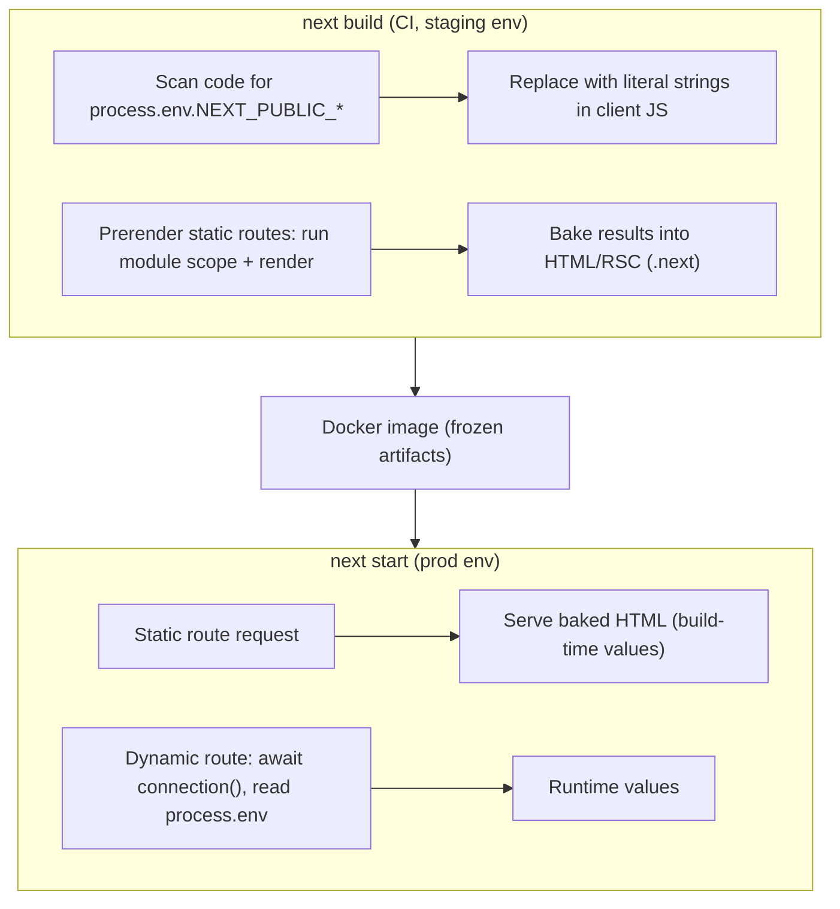

## Bối cảnh & vấn đề

Pipeline CI của một team build Docker image **một lần** ở staging, rồi promote đúng image đó lên production. Đây là best practice ("build once, deploy many"). Sau lần deploy đầu tiên, hai bug xuất hiện: browser ở production gọi `https://api.staging.example`, và cờ `FEATURE_NEW_CHECKOUT=true` đặt trong môi trường production không có tác dụng. Trang checkout vẫn hiện bản cũ. Không có lỗi nào trong log.

Cả hai đến từ cùng một nguyên nhân: nhiều giá trị trong Next.js được **quyết định lúc `next build`**, không phải lúc `next start`. Biến `NEXT_PUBLIC_*` được thay thẳng bằng chuỗi trong JS bundle. Code ở module scope của trang prerender chạy một lần lúc build và kết quả nằm trong HTML tĩnh. Hiểu "cái gì bị bake lúc build" là chìa khoá cho env vars, image và cả toolchain.

Bài này gom các chủ đề cấu hình và toolchain hay bị hỏi: env vars và runtime config, `next/image` và `next/font` (kèm các default đổi ở v16), Turbopack mặc định, `next lint` bị xoá, `output: 'export'`, và cách làm việc với AI assistant khi Next 16 đổi nhiều API.

## Khái niệm

### Env vars mặc định chỉ có ở server

Next nạp biến từ `.env`, `.env.local`, `.env.production`, `.env.development` và môi trường process. Mặc định **biến chỉ có ở server**: Server Components, Route Handlers, Server Actions đọc `process.env.X` bình thường. Nếu code client tham chiếu một biến không có prefix, Next **thay bằng chuỗi rỗng**. Secret không bị lộ, nhưng code client chạy sai một cách âm thầm. Theo docs, `@next/env` cho phép nạp cùng quy tắc này ngoài runtime Next (config ORM, test runner).

### `NEXT_PUBLIC_` bị inline lúc build

Biến có prefix `NEXT_PUBLIC_` được Next **inline** vào JS bundle lúc `next build`: mọi `process.env.NEXT_PUBLIC_X` được thay bằng giá trị cứng. Docs viết rõ: sau khi build, app **không còn phản ứng** với thay đổi của các biến này; build một Docker image rồi deploy ra nhiều môi trường thì mọi `NEXT_PUBLIC_` bị **đóng băng** ở giá trị lúc build. Lookup động (`process.env[name]`) không được inline. Mọi thứ đã inline thì **ai cũng đọc được** trong bundle, nên tuyệt đối không đặt secret ở đây.

### Đọc env lúc runtime: `connection()`

Ở App Router, một Server Component đọc `process.env` **trong lúc render** thì giá trị lấy tại thời điểm render. Nhưng nếu trang được **prerender** lúc build, "lúc render" chính là lúc build. Docs (và upgrade guide v16) khuyên gọi `await connection()` trước khi đọc `process.env` để ép đọc lúc request, cho phép **một image đi qua nhiều môi trường**. Next 16 **xoá** `serverRuntimeConfig`/`publicRuntimeConfig` (`next/config`), nên runtime config chỉ còn là env đọc ở server.

Để đưa config runtime xuống client không tốn request thêm: đọc ở một Server Component dynamic (root layout đã `await connection()` hoặc trong Suspense), rồi truyền xuống qua props hoặc context provider. Hoặc in ra một `<script>` JSON nhỏ (chỉ giá trị public). Hoặc dùng endpoint `/config` có cache ngắn nếu cần.

**Interview angle:** câu "staging image hiện URL production trong browser, vì sao?" có đáp án: `NEXT_PUBLIC_` inline lúc build. Đi kèm là thiết kế lại: build một lần, config đọc ở server lúc request rồi truyền xuống.

### `next/image`

`<Image>` làm cho bạn: resize và chuyển định dạng (WebP/AVIF) theo thiết bị qua endpoint `/_next/image`, sinh `srcset`/`sizes`, **lazy load** mặc định, chống **CLS** bằng `width`/`height` bắt buộc (hoặc `fill` + container có kích thước). Ảnh remote phải khai báo `images.remotePatterns` (whitelist host, path) để chống việc dùng server của bạn làm proxy ảnh tuỳ ý (SSRF, tốn CPU).

Thay đổi ở **Next 16** (upgrade guide và version history):

- `priority` **deprecated**, thay bằng `preload` (chèn `<link rel="preload">` vào `<head>`). Docs cũng gợi ý phần lớn trường hợp dùng `loading="eager"` hoặc `fetchPriority="high"` cho ảnh LCP.
- `minimumCacheTTL` mặc định **4 giờ** (14.400 s), trước là 60 s.
- `qualities` mặc định chỉ `[75]`; `quality` khác bị ép về giá trị gần nhất trong danh sách.
- `16` bị bỏ khỏi `imageSizes` mặc định.
- **Chặn optimize IP local** mặc định (`dangerouslyAllowLocalIP` chỉ bật cho mạng nội bộ và phải hiểu rủi ro SSRF).
- `maximumRedirects` mặc định **3**.
- `images.domains` deprecated → `remotePatterns`; `next/legacy/image` deprecated.
- Ảnh local có query string cần `images.localPatterns.search`.

### `next/font`

`next/font/google` và `next/font/local` **self-host font lúc build**: file font được tải về và phục vụ từ cùng domain, không gọi Google Fonts lúc runtime (tốt cho privacy và latency). Next tự tính **fallback font với `size-adjust`** để kích thước chữ fallback gần giống font thật, giảm layout shift khi font tải xong, và preload font. Dùng qua `className` hoặc CSS variable.

### Turbopack mặc định

Next 16: **Turbopack là mặc định cho cả `next dev` và `next build`** (không cần `--turbopack`). Nếu project có **custom `webpack` config** (kể cả do plugin thêm vào mà bạn không biết), `next build` **fail** để tránh cấu hình sai. Ba lựa chọn: migrate sang option `turbopack`, chạy `--webpack` để giữ webpack, hoặc `--turbopack` để bỏ qua webpack config. Các thay đổi khác: `experimental.turbopack` → top-level `turbopack`; `resolve.fallback` (để im lỗi `Can't resolve 'fs'`) → `turbopack.resolveAlias` (nhưng nên sửa import thì hơn); Sass import dạng `~pkg` không hỗ trợ. Filesystem cache của Turbopack bật mặc định cho dev và build. `next dev` và `next build` dùng thư mục output riêng (`.next/dev`) nên chạy song song được.

### `next lint` bị xoá và các yêu cầu tối thiểu

Next 16 **xoá lệnh `next lint`**, và `next build` **không lint nữa**. Option `eslint` trong `next.config` cũng bị xoá. Dùng ESLint CLI (flat config, `@next/eslint-plugin-next` mặc định flat) hoặc Biome; codemod `next-lint-to-eslint-cli`. Yêu cầu tối thiểu: **Node.js 20.9+**, **TypeScript 5.1+**; trình duyệt Chrome/Edge/Firefox 111+, Safari 16.4+. Output của `next build` **bỏ cột `size` và `First Load JS`** vì không chính xác với RSC; đo bằng Lighthouse hay RUM.

### `output: 'export'`

Static export tạo HTML/CSS/JS tĩnh trong `out/`, host được ở S3/CDN bất kỳ, không cần Node server. Server Components vẫn chạy **lúc build**. Theo docs, những gì cần server lúc request đều **không được hỗ trợ**: dynamic route có `dynamicParams: true` hoặc không có `generateStaticParams`, Route Handler dựa vào `Request`, `cookies()`, rewrites/redirects/headers trong config, **proxy**, ISR, image optimization với loader mặc định (cần custom loader), Draft Mode, **Server Actions**, intercepting routes. `'use cache'` cũng không hỗ trợ static export. Hợp cho docs, marketing, SPA thuần client gọi API riêng.

### AI assistant và docs đúng version

Từ **16.2**, docs của đúng version được đóng gói trong `node_modules/next/dist/docs/`. `AGENTS.md` ở root trỏ agent tới đó (codemod `npx @next/codemod@canary agents-md`). Từ **16.3**, `next dev` **tự sinh** `AGENTS.md` và `CLAUDE.md` khi phát hiện AI agent (tắt bằng `agentRules: false`). Mục tiêu là để agent đọc docs khớp version thay vì dựa vào dữ liệu huấn luyện cũ.

## Cơ chế hoạt động



Lúc build, hai thứ bị "đóng băng" vào artifact: biến `NEXT_PUBLIC_*` được thay bằng chuỗi trong JS client, và mọi route static được render một lần với env **của môi trường build**. Image sau đó chứa các artifact đã đóng băng. Lúc chạy, route static chỉ phục vụ lại HTML đã build, nên env production không bao giờ được đọc. Chỉ route dynamic (có `connection()` hoặc request API) mới đọc `process.env` của môi trường đang chạy. Muốn một image cho nhiều môi trường thì mọi giá trị phụ thuộc môi trường phải đi con đường bên phải.

## Ví dụ thực tế

### Chạy thật: build với env staging, chạy với env production

```ts
// lib/config.ts
export const API_URL = process.env.NEXT_PUBLIC_API_URL!;
export const NEW_CHECKOUT = process.env.FEATURE_NEW_CHECKOUT === 'true';

// app/checkout/page.tsx (static)      — renders NEW_CHECKOUT and <ApiUrl/> ('use client', shows API_URL)
// app/checkout-rt/page.tsx (dynamic)
export default async function Page() {
  await connection();
  return <p>runtime NEW_CHECKOUT={String(process.env.FEATURE_NEW_CHECKOUT === 'true')}</p>;
}
```

```bash
NEXT_PUBLIC_API_URL=https://api.staging.example FEATURE_NEW_CHECKOUT=false next build
grep -rl "api.staging.example" .next/static
NEXT_PUBLIC_API_URL=https://api.example FEATURE_NEW_CHECKOUT=true next start
```

```text
├ ○ /checkout
├ ƒ /checkout-rt
.next/static/chunks/2_y-4boqdyd7e.js            <- staging URL is a literal in the client bundle
server NEW_CHECKOUT=false                        <- /checkout, env at runtime says true
client API_URL=https://api.staging.example       <- /checkout, env at runtime says api.example
runtime NEW_CHECKOUT=true                        <- /checkout-rt reads env per request
```

Cả hai bug của phần mở đầu được tái hiện chính xác. Thiết kế lại:

```tsx
// app/layout.tsx — read public runtime config on the server, per request
import { connection } from 'next/server';
import { Suspense } from 'react';
async function ConfigProvider({ children }: { children: React.ReactNode }) {
  await connection();
  const publicConfig = { apiUrl: process.env.PUBLIC_API_URL!, sentryDsn: process.env.PUBLIC_SENTRY_DSN! };
  return <RuntimeConfigProvider value={publicConfig}>{children}</RuntimeConfigProvider>; // 'use client' context
}
```

Lưu ý đánh đổi: đặt `connection()` ở root làm mọi trang dynamic (mất prerender). Với Cache Components, bọc provider trong `<Suspense>` và chỉ các phần cần config chờ; hoặc chỉ đọc config ở những component cần nó. Feature flag nên đến từ **flag service** (đọc ở server, cache ngắn) thay vì env, để bật tắt không cần deploy. `NEXT_PUBLIC_*` chỉ giữ cho giá trị thật sự cố định theo build (commit SHA, version).

### Chạy thật: webpack config dưới Turbopack

```ts
// next.config.ts
const c: NextConfig = { webpack: (config) => config };
```

```text
▲ Next.js 16.3.7 (Turbopack)
⨯ ERROR: This build is using Turbopack, with a `webpack` config and no `turbopack` config.
   This may be a mistake.
   As of Next.js 16 Turbopack is enabled by default and
   custom webpack configurations may need to be migrated to Turbopack.
   NOTE: your `webpack` config may have been added by a configuration plugin.
```

### Chạy thật: `next lint` không còn

```bash
npx next lint
```

```text
Invalid project directory provided, no such directory: /private/tmp/claude-502/next16-lab/lint
```

Next 16 hiểu `lint` là tên thư mục. CI từng dựa vào `next build` để fail khi lint lỗi thì phải thêm bước riêng:

```json
{ "scripts": { "lint": "eslint .", "typecheck": "tsc --noEmit", "build": "next build" } }
```

Pipeline: `npm run lint && npm run typecheck && npm run build`.

### Chạy thật: `output: 'export'` với intercepting route

```text
> Build error occurred
Error: Page "/(.)photo/[id]" is missing "generateStaticParams()" so it cannot be used with "output: export" config.
```

Build export dừng ở route dynamic đầu tiên không liệt kê được lúc build. SPA export cần redirect theo user sau login thì logic nằm ở **client** (router guard sau khi đọc session từ API) hoặc ở CDN edge function, vì không có proxy hay server.

### Ảnh LCP bị lazy-load

```tsx
// ❌ LCP 4 s: hero is lazy by default, discovered late
<Image src="/hero.jpg" width={1600} height={900} alt="" />
// ✅ Next 16: eager + high priority (or preload for a <link> in <head>)
<Image src="/hero.jpg" width={1600} height={900} alt="" loading="eager" fetchPriority="high" sizes="100vw" />
```

Đặt ảnh LCP **ngoài** Suspense boundary để nó nằm trong chunk đầu ([bài 3](/tracks/nextjs/learn/rendering-streaming)), khai báo `sizes` đúng để browser không tải ảnh 3.840 px cho màn 390 px.

## Trade-offs & lựa chọn thay thế

| Nhu cầu | `NEXT_PUBLIC_*` | Env đọc ở server lúc request | Endpoint `/config` | Flag service |
| --- | --- | --- | --- | --- |
| Một image nhiều môi trường | không | có | có | có |
| Không thêm request | có | có (qua props/context) | không | tuỳ SDK |
| Giữ prerender | có | mất ở phần đọc env (trừ khi Suspense + Cache Components) | có | có (client) |
| Đổi không cần deploy | không | cần restart | cần restart | có |
| Rủi ro | lộ nếu nhầm là secret | ép route dynamic | cache sai | phụ thuộc bên ngoài |

| Toolchain | Chọn khi |
| --- | --- |
| Turbopack (mặc định) | mọi project mới, project không có webpack config đặc thù |
| `next build --webpack` | plugin/loader webpack chưa có tương đương; tạm thời trong lúc migrate |
| `output: 'export'` | docs, marketing, SPA gọi API riêng; không cần proxy, action, ISR |
| `output: 'standalone'` + Node | cần bất kỳ tính năng server nào ([bài 11](/tracks/nextjs/learn/self-hosting-production)) |

Chọn thế nào. Giá trị theo môi trường thì đọc ở server lúc request. Giá trị theo build (version, SHA) thì `NEXT_PUBLIC_` ổn. Toolchain thì ở lại Turbopack trừ khi có lý do cụ thể. Static export chỉ khi chắc chắn không cần server, vì chỉ cần một nhu cầu dynamic là phải bỏ nó hoặc tự lách vụng về.

## Edge cases & failure modes

- **Secret trong `NEXT_PUBLIC_`**: nằm trong bundle mãi mãi (kể cả sau khi đổi, bản cũ còn trên CDN cache). Rotate secret ngay.
- **Biến không prefix trong code client**: thành chuỗi rỗng, code chạy sai im lặng. Dùng `server-only` cho module config server.
- **Module scope trong trang static**: đọc env ở module scope của trang prerender → bake lúc build. Đọc trong render sau `connection()`.
- **Plugin âm thầm thêm `webpack`**: build fail sau khi nâng 16 dù bạn không viết webpack config; kiểm tra `withX(nextConfig)`.
- **`Can't resolve 'fs'` ở client**: module client import thứ dùng Node API; sửa import, chỉ dùng `turbopack.resolveAlias` như biện pháp tạm.
- **Image 400 sau khi nâng 16**: ảnh từ IP nội bộ hoặc split-horizon DNS bị chặn (local IP restriction). Chỉ bật `dangerouslyAllowLocalIP` khi hiểu SSRF.
- **Image không update**: `minimumCacheTTL` mặc định 4 giờ; upstream thiếu `cache-control` thì ảnh mới xuất hiện chậm. Đổi tên file (content hash) thay vì ghi đè.
- **`quality={90}` không có tác dụng**: bị ép về 75 vì `qualities` mặc định `[75]`.
- **Symlink `node_modules` ra ngoài project**: Turbopack báo "Symlink [project]/node_modules is invalid, it points out of the filesystem root" (gặp thật khi thử). Monorepo cần cấu hình `turbopack.root`.
- **Code AI sinh theo API cũ**: `middleware.ts`, `cookies()` sync, `revalidateTag(tag)` một arg, `experimental.ppr`, `next lint`, `getServerSideProps` trong `app/`.

## Pitfalls

- ❌ Build image riêng cho từng môi trường để "fix" `NEXT_PUBLIC_` → ✅ build một lần, config runtime đọc ở server; image staging và prod phải là **cùng một** artifact (điều kiện cho skew protection và reproducibility).
- ❌ Đọc feature flag ở module scope → ✅ đọc trong render sau `connection()`, hoặc dùng flag service.
- ❌ Dựa vào `next build` để lint → ✅ thêm `eslint .` và `tsc --noEmit` vào CI.
- ❌ Giữ `priority` trên ảnh LCP như Next 15 → ✅ `preload` (hoặc `loading="eager"`/`fetchPriority="high"`).
- ❌ `images.domains` → ✅ `remotePatterns` chặt (protocol, hostname, pathname).
- ❌ Chọn `output: 'export'` rồi cố lách để có proxy/action → ✅ chuyển sang Node server/standalone.
- ❌ Để AI tự sửa hàng loạt khi nâng version → ✅ chạy codemod chính thức (`upgrade`, `next-async-request-api`, `middleware-to-proxy`), rồi review diff như PR.
- ❌ Tin output AI khi nó không nói nó dựa vào version nào → ✅ đặt `AGENTS.md` trỏ tới `node_modules/next/dist/docs/`, nêu version trong prompt, verify bằng type-check + build + E2E.

## Tóm tắt

- Env mặc định chỉ ở server; `NEXT_PUBLIC_*` bị inline lúc build (chạy thật: URL staging nằm trong chunk JS, không đổi khi chạy với env prod).
- Trang prerender bake cả giá trị server lúc build; `await connection()` trước khi đọc `process.env` để đọc lúc request; Next 16 xoá `serverRuntimeConfig`/`publicRuntimeConfig`.
- `next/image` ở 16: `preload` thay `priority`, `minimumCacheTTL` 4 giờ, `qualities` `[75]`, chặn IP local, tối đa 3 redirect, `remotePatterns` thay `domains`.
- `next/font` self-host lúc build, fallback có `size-adjust` chống layout shift.
- Turbopack mặc định; webpack config làm `next build` fail (chạy thật) → migrate, `--webpack`, hoặc `--turbopack`.
- `next lint` bị xoá (chạy thật: bị hiểu là thư mục `lint`); Node ≥ 20.9, TS ≥ 5.1; build output bỏ `First Load JS`.
- `output: 'export'` mất proxy, Server Actions, ISR, cookies, image optimization mặc định, intercepting routes, route dynamic chưa liệt kê.
- AI: docs đúng version trong `node_modules/next/dist/docs/` + `AGENTS.md` (16.3 tự sinh khi chạy `next dev`); verify bằng codemod, type-check, build, E2E.
