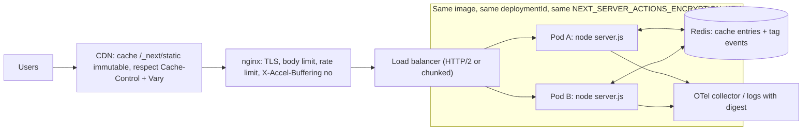
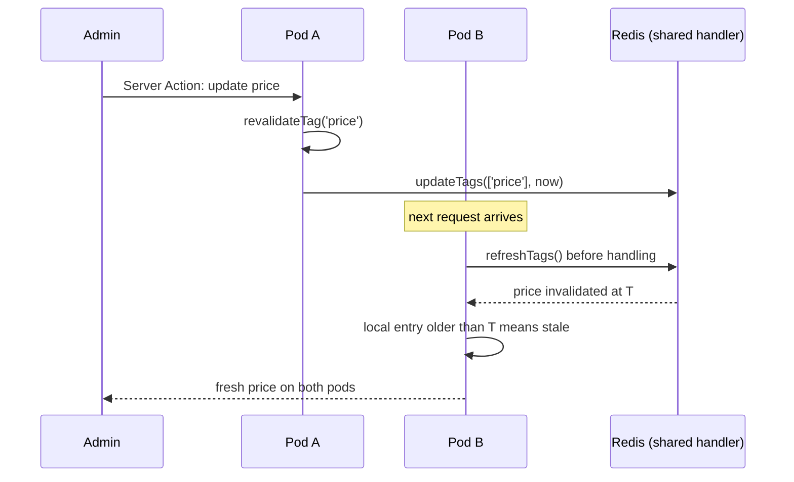

## Bối cảnh & vấn đề

Một team chuyển app Next từ Vercel sang Kubernetes để giảm chi phí: 4 pod sau một load balancer, trước nữa là nginx và CDN. Tuần đầu tiên xuất hiện bốn loại ticket:

1. Admin sửa giá; một số khách thấy giá mới, số khác thấy giá cũ, và tình trạng kéo dài hàng giờ.
2. Ngay sau mỗi lần deploy, một đợt lỗi "Failed to find Server Action", vài đơn hàng submit thất bại.
3. Trang dashboard có skeleton ở local, nhưng ở production thì trắng 3 giây rồi hiện hết một lúc.
4. Email "cảm ơn" gửi qua `after()` thỉnh thoảng biến mất, đúng những lúc có rolling update.

Trên Vercel, bốn thứ này được nền tảng lo sẵn: cache dùng chung giữa các instance, skew protection, hạ tầng streaming, và thời gian drain cho background work. Self-host thì mỗi thứ là một việc cấu hình. Docs Next gọi đây là cái giá của mô hình rendering cấp component: độ phức tạp chuyển từ code ứng dụng sang hạ tầng.

Bài này đi qua từng vấn đề với số liệu chạy thật (2 pod standalone, một proxy buffer mô phỏng nginx, SIGTERM thật), rồi tổng hợp thành checklist deployment và cách debug theo tầng.

## Khái niệm

### `output: 'standalone'`

`output: 'standalone'` tạo thư mục `.next/standalone` gồm `server.js` tối giản, `package.json` và **chỉ những file trong `node_modules` thực sự cần** (Next tự trace dependency). Deploy thư mục này mà không cần `npm install`. Theo docs, `server.js` **không** tự copy `public/` và `.next/static` vì lý tưởng là CDN phục vụ chúng. Muốn server tự phục vụ thì copy vào `standalone/public` và `standalone/.next/static`. Trong lab, standalone nặng 42 MB so với 352 MB `node_modules` đầy đủ, nên image Docker nhỏ hơn hẳn.

Một nguyên tắc gắn liền: **build một lần, promote cùng artifact** qua staging lên production. Build lại cho mỗi môi trường tạo build ID, action ID và encryption key khác nhau, và phá skew protection.

### Cache mặc định là per-instance

Theo docs self-hosting, ISR và dữ liệu cache (mô hình cũ) nằm trong **server cache của Next**, mặc định trên **filesystem cục bộ** của từng instance (cộng một lớp in-memory, mặc định 50 MB). Kết quả của `'use cache'` nằm trong **in-memory LRU per process**. Trên Kubernetes, **mỗi pod có bản cache riêng**. Và mọi sự kiện revalidate là **local**: `revalidateTag` chạy trên pod nhận request, các pod khác tiếp tục phục vụ entry cũ tới khi nó tự hết hạn. Load balancer chia request nên các user thấy dữ liệu khác nhau.

### Cache handler dùng chung

Có hai option, cho hai lớp cache khác nhau:

- **`cacheHandler`** (số ít): server cache của ISR, route cache và `fetch`/`unstable_cache` ở mô hình cũ (và on-demand ISR của Pages Router). Kết hợp `cacheMaxMemorySize: 0` để tắt in-memory, tránh lệch giữa các pod.
- **`cacheHandlers`** (số nhiều): backend cho directive `'use cache'` (`default`) và `'use cache: remote'` (`remote`), có thể thêm handler tên riêng (`'use cache: sessions'`). `'use cache: private'` không dùng handler.

Handler dùng chung (Redis, S3, DynamoDB) phải lo **đồng bộ tag**. `updateTags()` được gọi khi `revalidateTag()` chạy, và phải ghi sự kiện invalidate vào store dùng chung. `refreshTags()` được gọi **trước mỗi request** (và định kỳ), đọc sự kiện mới để cập nhật trạng thái tag cục bộ. `getExpiration()` trả timestamp revalidate mới nhất của một nhóm tag (kể cả soft tag của `revalidatePath`).

Docs yêu cầu handler **phòng thủ**: `get()` lỗi thì bắt và trả `undefined` (cache miss), vì framework không bọc `get()` trong try/catch, nên exception sẽ thành lỗi render. `refreshTags()` lỗi phải bắt, nếu không request fail. `set()` lỗi thì response vẫn được phục vụ, chỉ mất entry. Hệ thống ưu tiên **availability hơn strict consistency**.

### Version skew, `deploymentId` và encryption key

**Version skew** là khi browser đang chạy JS của build cũ nói chuyện với server của build mới. Hậu quả: asset cũ không còn (404 JS/CSS), prefetch cũ không tương thích, và **Server Action ID cũ không tồn tại**. ID đổi theo build, và Next rotate chúng tối đa mỗi 14 ngày kể cả khi code không đổi. Đó là nguồn của "Failed to find Server Action".

**`deploymentId`** trong `next.config` bật skew protection: asset có query `?dpl=<id>`, navigation client-side gửi header `x-deployment-id`, server so với id của nó, và nếu khác thì client **hard navigation** (tải lại toàn trang) để lấy build mới. Khi có `deploymentId`, build ID cố định và `generateBuildId` không còn tác dụng. `deploymentId` cũng thay build ID trong cache key của `'use cache'`.

**Encryption key**: Next mã hoá biến closure của Server Function trước khi gửi xuống client, với key **sinh mới mỗi build**. Nhiều instance mà key khác nhau (mỗi instance tự build, hoặc build lại) thì instance này không giải mã được reference của instance kia, và lỗi cũng hiện ra dạng "Failed to find Server Action", **kể cả khi không deploy**. Đặt `NEXT_SERVER_ACTIONS_ENCRYPTION_KEY` (base64, AES 16/24/32 byte; Next sinh 32 byte mặc định). Theo docs self-hosting, key được **embed vào build output** khi đặt lúc `next build`, nên phải có trong môi trường build, và nhất quán giữa các build của cùng một release.

### Streaming sau reverse proxy

Mọi tầng giữa Node và browser phải **không buffer**. nginx mặc định bật `proxy_buffering`, gom chunk rồi mới gửi. Tắt bằng header response `X-Accel-Buffering: no` (có thể set qua `headers()` trong `next.config`) hoặc `proxy_buffering off;` cho location đó. Load balancer phải hỗ trợ chunked hoặc HTTP/2 streaming; docs lấy ví dụ AWS ALB + Lambda có thể buffer mặc định. Compression ở tầng trung gian cũng có thể gom chunk. Không có streaming thì app **vẫn chạy đúng** (docs gọi là functional fidelity), nhưng mất TTFB sớm và mất ưu thế static shell của PPR.

### `after()` và graceful shutdown

`after(callback)` (`next/server`) chạy việc **sau khi response đã gửi xong**: log, analytics, sync nhẹ, trong Server Component (kể cả `generateMetadata`), Server Action, Route Handler, proxy. Nó chạy cả khi response lỗi, `notFound()` hay `redirect()`. Nó không làm route thành dynamic; ở trang static thì callback chạy lúc build hoặc revalidate. Trong Server Component không đọc được `cookies()`/`headers()` bên trong callback (đọc trước rồi truyền vào); trong Route Handler và Server Action thì đọc được.

`after` vẫn nằm trong **vòng đời của server process**: trên serverless cần nền tảng hỗ trợ `waitUntil`; self-host `next start` hỗ trợ đầy đủ. Khi dừng server, gửi **SIGTERM/SIGINT và chờ**: Next hoàn tất request đang chạy và các callback `after` còn pending rồi mới thoát. Docs khuyên cho thời gian drain 10–30 giây. Kill ngay (SIGKILL, hết `terminationGracePeriodSeconds`) là mất việc. Vì vậy `after` **không thay được job queue**: không retry, không bền khi crash, không giới hạn concurrency. Việc quan trọng (email thanh toán) đi qua outbox hoặc queue bền vững.

### Observability

**`instrumentation.ts`** ở root export `register()`, được gọi **một lần** khi server khởi động (trước khi nhận request). Đây là nơi khởi tạo OpenTelemetry (`@vercel/otel` hoặc Node SDK). Export `onRequestError` bắt **lỗi server** (render, action, handler) để đẩy về Sentry hay hệ thống log tập trung. **`instrumentation-client.ts`** chạy ở browser trước khi app tương tác, dùng cho monitoring client (Web Vitals, lỗi JS). Khi bật OTel, Next tự tạo span như `[http.method] [next.route]` (root span), `render route (app) [next.route]`, `fetch [method] [url]`, `executing api route (app) [next.route]`, với attribute `next.route` và `next.rsc`. `NEXT_OTEL_VERBOSE=1` để thấy nhiều span hơn. Propagate `traceparent` sang API và DB để trace đi xuyên hệ thống. Lỗi Server Component ở production chỉ có `digest`; log server phải ghi `digest` để đối chiếu.

## Cơ chế hoạt động



Mỗi hộp tương ứng một việc mà nền tảng managed thường làm hộ. CDN phục vụ asset bất biến và chỉ cache HTML/RSC khi header cho phép (cùng policy cho cả hai). nginx lo phần "hygiene" (request lỗi, slowloris, body size, rate limit) và **không được buffer** response. Mọi pod chạy **cùng một image**, cùng `deploymentId` và encryption key. Cache entry và sự kiện invalidate tag đi qua Redis để `revalidateTag` ở pod nào cũng lan tới pod khác (qua `updateTags`/`refreshTags`). Trace và lỗi đổ về một chỗ để debug xuyên tầng.



Không có handler dùng chung, bước `updateTags`/`refreshTags` không tồn tại, và pod B phục vụ entry cũ tới khi hết hạn, đúng như ticket số 1.

## Ví dụ thực tế

Tất cả chạy thật với Next 16.3.7, `output: 'standalone'`, `deploymentId: 'rel-2026-09-30'`.

### Hai pod, `revalidateTag` chỉ tác dụng một pod

Trang `/tagged` fetch giá với `cache: 'force-cache', next: { tags: ['price'] }`; `POST /api/rt` gọi `revalidateTag('price', { expire: 0 })`. Hai bản copy của `.next/standalone` chạy ở port 3101 (pod A) và 3102 (pod B), mỗi pod có disk và memory riêng như trên Kubernetes.

```bash
PORT=3101 node podA/server.js & PORT=3102 node podB/server.js &
curl -s localhost:3101/tagged; curl -s localhost:3102/tagged        # twice
curl -s -X POST localhost:3101/api/rt                               # revalidate on pod A only
curl -s localhost:3101/tagged; curl -s localhost:3102/tagged        # twice
```

```text
A: hit=6  B: hit=7
A: hit=6  B: hit=7
{"revalidated":"price","pid":49899}
A: hit=8  B: hit=7
A: hit=8  B: hit=7
```

Hai pod đã có giá trị khác nhau ngay từ đầu (mỗi pod tự fetch và tự cache). Sau khi revalidate trên A, chỉ A lấy giá mới (hit=8), còn B tiếp tục phục vụ hit=7. Sửa bằng handler dùng chung. Khung một handler Redis cho `'use cache'` (rút gọn):

```ts
// cache-handlers/redis.ts (sketch)
import { createClient } from 'redis';
const redis = createClient({ url: process.env.REDIS_URL });
let tagTs = new Map<string, number>(); // local view of tag invalidation times

export default {
  async get(cacheKey: string, softTags: string[]) {
    try {
      const raw = await redis.get(`entry:${cacheKey}`);
      if (!raw) return undefined;
      const entry = deserialize(raw);
      const latest = Math.max(0, ...[...entry.tags, ...softTags].map((t) => tagTs.get(t) ?? 0));
      return latest > entry.timestamp ? undefined : entry;   // invalidated after it was written
    } catch { return undefined; }                             // never throw from get()
  },
  async set(cacheKey: string, pending: Promise<CacheEntry>) {
    try { await redis.set(`entry:${cacheKey}`, serialize(await pending), { EX: 86_400 }); } catch { /* lose entry */ }
  },
  async updateTags(tags: string[]) {                          // called by revalidateTag on this pod
    const now = Date.now();
    await redis.hSet('tags', Object.fromEntries(tags.map((t) => [t, String(now)])));
    for (const t of tags) tagTs.set(t, now);
  },
  async refreshTags() {                                       // called before each request on every pod
    try { tagTs = new Map(Object.entries(await redis.hGetAll('tags')).map(([k, v]) => [k, Number(v)])); }
    catch { /* keep last known state, serve possibly stale */ }
  },
  async getExpiration(tags: string[]) { return Math.max(0, ...tags.map((t) => tagTs.get(t) ?? 0)); },
};
```

(Minh hoạ; interface đầy đủ và kiểu `CacheEntry` có stream nằm trong docs `cacheHandlers` và ví dụ `cache-handler-redis`.) Khi Redis sập: `get` trả miss (render mới, tải DB tăng), `refreshTags` giữ trạng thái cũ (có thể stale), user vẫn thấy trang. Cần alert và circuit breaker để DB không bị dội.

### Version skew: đúng những header mà client dùng

```bash
curl -s localhost:3102/tagged | grep -o '_next/static/[^"]*dpl=[^"]*' | head -2
curl -s -D - -o /dev/null -H "RSC: 1" -H "x-deployment-id: rel-OLD" "localhost:3102/tagged?_rsc=1" | grep -i deployment
curl -s -D - -o /dev/null -X POST localhost:3102/tagged -H "Next-Action: 00deadbeef…" -H "Content-Type: text/plain;charset=UTF-8" --data '[]' | grep -i "^HTTP\|action"
```

```text
_next/static/chunks/1r9pxrlejbj15.css?dpl=rel-2026-09-30
_next/static/chunks/310vm2bl3xxpt.js?dpl=rel-2026-09-30
x-nextjs-deployment-id: rel-2026-09-30
HTTP/1.1 404 Not Found
x-nextjs-action-not-found: 1
```

Server gắn id deployment vào asset và response. Client mang id cũ sẽ nhận ra lệch và hard reload. Action ID không tồn tại trả `404` với `x-nextjs-action-not-found: 1` (log server: "Failed to find Server Action … This request might be from an older or newer deployment"). Giảm thiểu trong rolling deploy:

- `deploymentId` cố định theo release (git SHA hoặc tag); build **một lần** và promote.
- `NEXT_SERVER_ACTIONS_ENCRYPTION_KEY` giống nhau cho mọi instance của release (đặt lúc build).
- Rolling update với `maxUnavailable: 0`; giữ asset build cũ trên CDN/bucket một thời gian (asset có hash nên không đụng nhau).
- UI bắt lỗi action (không phải 200) và mời "Trang đã được cập nhật, tải lại để tiếp tục", giữ dữ liệu form ở URL hoặc localStorage.

### Streaming bị proxy nuốt

nginx không có trên máy lab, nên dùng một reverse proxy Node 20 dòng mô phỏng `proxy_buffering on` (gom toàn bộ body) và một bản pass-through, cả hai đứng trước trang `/stream` (hai boundary 500 ms và 1.500 ms):

```text
--- buffering proxy:
status 200 headers after 1591ms
chunk 1 +1594ms   8359B Dashboard shell | Orders | Recs
--- pass-through proxy:
status 200 headers after 48ms
chunk 1 +  50ms   1353B Dashboard shell
chunk 3 + 548ms    122B Orders
chunk 5 +1544ms    121B Recs
```

Qua proxy buffer, TTFB từ 48 ms nhảy lên 1.591 ms và skeleton không bao giờ hiện, đúng triệu chứng "trắng 3 giây rồi hiện hết". Cấu hình nginx:

```nginx
location / {
  proxy_pass http://next_upstream;
  proxy_http_version 1.1;
  proxy_buffering off;          # or let Next send X-Accel-Buffering: no
  proxy_set_header Connection "";
}
```

```ts
// next.config.ts — alternatively send the header from Next
async headers() { return [{ source: '/:path*', headers: [{ key: 'X-Accel-Buffering', value: 'no' }] }]; }
```

Kiểm tra từng tầng bằng `curl -N` hoặc script probe theo chunk, **gọi trực tiếp vào pod, vào nginx, vào LB, vào CDN**, rồi xem tầng nào gom chunk. Test bằng user agent browser thường để không nhầm với hành vi bot.

### `after()` và SIGTERM

```ts
// app/api/after/route.ts
export async function GET() {
  const t0 = Date.now();
  after(async () => { await sleep(3000); console.log(`[after] done ${Date.now() - t0}ms after request start`); });
  return Response.json({ sentAt: Date.now() - t0 });
}
```

```text
{"sentAt":1} total=0.015402s
[after] done 3003ms after request start
# new request, then immediately: kill -TERM <pid>
process exited 3s after SIGTERM
[after] done 3001ms after request start
```

Response trả sau 15 ms, callback chạy 3 giây sau đó. Khi nhận SIGTERM giữa chừng, server **chờ** callback xong (thoát sau 3 giây). Trên Kubernetes, `terminationGracePeriodSeconds` phải lớn hơn thời gian drain (khuyến nghị 10–30 giây), và readiness probe phải chuyển sang fail ngay khi bắt đầu shutdown để LB ngừng gửi request mới. Nếu container runtime gửi SIGKILL trước khi callback xong, email trong `after` mất, đúng ticket số 4.

### Debug một trang chậm theo tầng (khung trả lời behavioral)

Câu CV "kể một trang Next chậm hoặc hỏng và cách bạn tìm ra tầng lỗi" nên theo STAR, và phần Action chia theo tầng:

1. **Browser**: Performance panel, network waterfall. TTFB cao hay LCP cao sau TTFB tốt? JS lớn làm hydrate chậm?
2. **CDN/proxy**: response có cache hit không, có bị buffer không (probe theo chunk)?
3. **Next server**: trace `render route (app) /products/[slug]`, span `fetch` nào dài, cache hit hay miss (`NEXT_PRIVATE_DEBUG_CACHE=1` khi debug), có waterfall `await` không?
4. **API/backend**: trace tiếp qua `traceparent`, latency theo endpoint.
5. **DB/cache**: slow query log, `EXPLAIN ANALYZE`, hit rate Redis, index thiếu.

Loại trừ giả thuyết từng tầng, sửa ở gốc, đo lại (điền số thật: p95 trước/sau). Phần reflection: thứ telemetry nào đã có thể rút ngắn nửa thời gian điều tra (thường là trace liên tục từ route tới query, hoặc log có `digest` và trace id).

## Trade-offs & lựa chọn thay thế

| Việc | Vercel/managed | Self-host tối thiểu | Self-host production |
| --- | --- | --- | --- |
| Cache giữa instance | có sẵn | per-instance (stale giữa pod) | `cacheHandler` + `cacheHandlers` Redis/S3, `updateTags`/`refreshTags` |
| Skew protection | có sẵn | không | `deploymentId`, build once, giữ asset cũ |
| Encryption key | tự quản | mỗi build một key | `NEXT_SERVER_ACTIONS_ENCRYPTION_KEY` cố định theo release |
| Streaming | có sẵn | tuỳ proxy | tắt buffering ở mọi tầng |
| Image optimization | có sẵn | sharp trong pod (tốn RAM/CPU) | loader ngoài hoặc giới hạn memory (glibc allocator) |
| Background work | `waitUntil` | `after` + SIGTERM drain | `after` cho việc nhẹ, queue cho việc quan trọng |
| PPR shell từ edge | có | shell từ origin | cần adapter/CDN hỗ trợ resume |

Chọn thế nào. Một instance với disk bền thì cấu hình mặc định là đủ, và docs xác nhận nó "hoạt động tự động". Từ hai instance trở lên, hoặc compute ephemeral, hoặc có CDN phía trước, thì bốn thứ bắt buộc: cache handler dùng chung kèm tag sync, `deploymentId`, encryption key chung, streaming end-to-end. Nếu team không muốn vận hành các thành phần này, một nền tảng có adapter chính thức là lựa chọn hợp lý hơn tự viết.

## Edge cases & failure modes

- **Pod khác nhau, dữ liệu khác nhau**: cache per-instance + revalidate local (đã chạy thật: A=8, B=7 sau revalidate).
- **Redis sập**: handler phải trả miss và giữ trạng thái tag cũ; nếu `get()` throw thì toàn site lỗi render. Thêm circuit breaker để không dội DB.
- **Build lại cho từng môi trường**: build ID, action ID, encryption key khác nhau giữa staging và prod → skew, lỗi action, cache key lệch.
- **Rolling update không giữ asset cũ**: user đang mở tab cũ tải chunk JS đã bị xoá → `ChunkLoadError`; giữ asset theo hash trên bucket/CDN.
- **CDN cache HTML và RSC khác TTL**, hoặc bỏ qua `Vary: rsc, next-router-state-tree…` → trang tải đầu và navigation lệch nhau, hoặc tệ hơn trả RSC payload cho request HTML.
- **CDN cache response `private`** do cấu hình "cache everything" → rò dữ liệu user. Tôn trọng `Cache-Control`.
- **Proxy buffer**: TTFB bằng thời gian render toàn trang (đã đo: 48 ms → 1.591 ms).
- **SIGKILL sớm**: mất `after` và request đang chạy; `terminationGracePeriodSeconds` phải ≥ drain.
- **Image optimization ăn RAM**: sharp trên glibc có thể phình bộ nhớ; theo docs cần cấu hình allocator, hoặc dùng loader ngoài.
- **Không có `onRequestError`**: user báo lỗi kèm `digest` mà log không có để đối chiếu.

## Pitfalls

- ❌ Chạy nhiều pod với cache mặc định → ✅ cache handler dùng chung + `cacheMaxMemorySize: 0` (mô hình cũ) + `cacheHandlers` cho `'use cache'`, có `updateTags`/`refreshTags`.
- ❌ Handler `get()` throw khi Redis lỗi → ✅ bắt lỗi, trả `undefined`.
- ❌ Build lại image cho mỗi môi trường → ✅ build một lần, promote cùng artifact, `deploymentId` theo release.
- ❌ Mỗi pod một encryption key → ✅ `NEXT_SERVER_ACTIONS_ENCRYPTION_KEY` chung (base64, 16/24/32 byte) đặt lúc build.
- ❌ Để nginx mặc định rồi thắc mắc Suspense không hiện → ✅ `proxy_buffering off` hoặc `X-Accel-Buffering: no`, kiểm tra LB và CDN.
- ❌ Gửi email thanh toán trong `after()` → ✅ outbox/queue bền vững; `after` cho log và analytics.
- ❌ Kill pod ngay khi deploy → ✅ SIGTERM + drain 10–30 s, readiness fail sớm.
- ❌ Expose `next start` thẳng ra internet → ✅ reverse proxy lo request lỗi, slowloris, body size, rate limit.

## Tóm tắt

- `output: 'standalone'` → `server.js` + dependency đã trace (lab: 42 MB so với 352 MB), tự copy `public` và `.next/static` hoặc đưa lên CDN; build một lần, promote cùng artifact.
- Cache mặc định per-instance và revalidate là local (chạy thật: pod B vẫn hit=7 sau khi revalidate ở pod A); cần `cacheHandler`/`cacheHandlers` dùng chung với `updateTags` + `refreshTags`, và `get` lỗi phải trả miss.
- Version skew: `deploymentId` (asset `?dpl=`, header `x-nextjs-deployment-id`, hard reload khi lệch); action ID lạ → 404 `x-nextjs-action-not-found`; encryption key chung cho mọi instance.
- Streaming cần mọi tầng không buffer (đo: TTFB 48 ms → 1.591 ms qua proxy buffer); `X-Accel-Buffering: no` / `proxy_buffering off`.
- `after()` chạy sau response (15 ms trả, callback 3 s sau), SIGTERM chờ callback xong; không thay queue.
- Observability: `instrumentation.ts` (`register`, `onRequestError`), OTel span theo route/render/fetch, `traceparent` sang backend, log `digest`; debug theo tầng browser → CDN → Next → API → DB.
