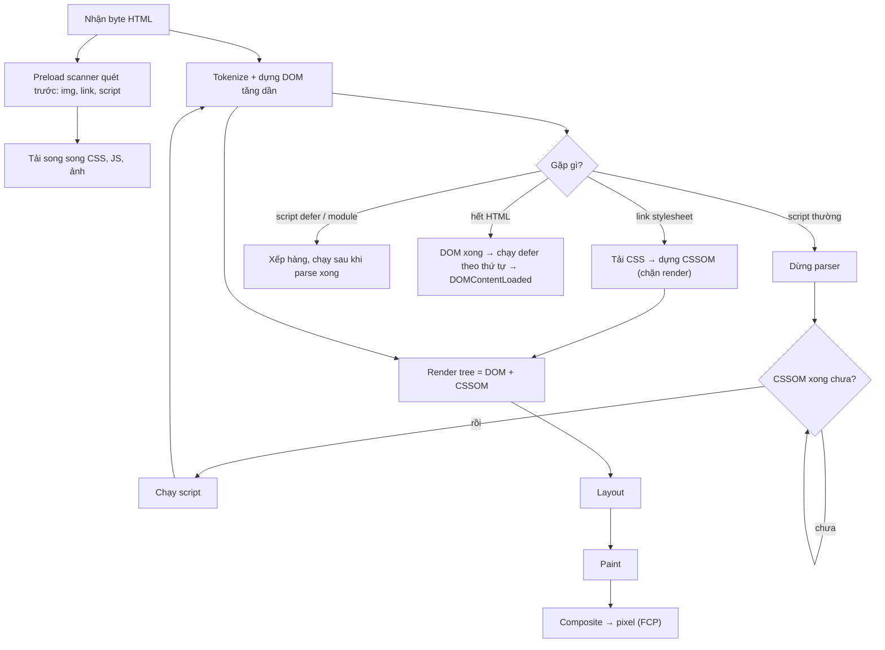
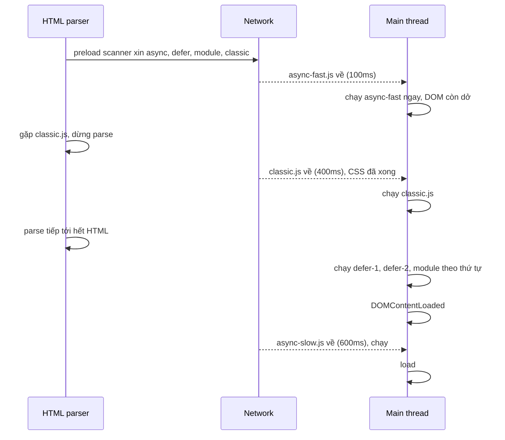

## Bối cảnh & vấn đề

Một trang landing có HTML chỉ 14 KB, server trả byte đầu tiên sau 80 ms, nhưng trên điện thoại màn hình vẫn trắng tới giây thứ 2,5. Mở tab Network ra, thủ phạm không phải HTML mà là ba thứ trong `<head>`: một file CSS 180 KB từ CDN của UI kit, một `<script src="analytics.js">` không có `async`, và một Google Font. Trình duyệt đã có đủ HTML để vẽ tiêu đề từ rất sớm, nhưng nó **không được phép vẽ** cho tới khi CSS về, và **không được phép parse tiếp** cho tới khi script chạy xong.

Chuỗi bước trình duyệt phải đi qua để biến byte HTML, CSS, JS thành pixel gọi là **critical rendering path (CRP)**. "Critical" vì chỉ những tài nguyên nằm trên đường này mới quyết định lúc người dùng thấy nội dung đầu tiên (**First Contentful Paint, FCP**) và nội dung chính (**LCP**, xem [bài Core Web Vitals](/tracks/browser-web-perf/learn/core-web-vitals)). Hiểu CRP giúp bạn trả lời câu hỏi mở màn của gần như mọi buổi phỏng vấn frontend performance: "chuyện gì xảy ra từ lúc nhận HTML tới lúc có pixel?", và quan trọng hơn là biết **cái gì đang chặn** trang của mình.

Bài này đi theo thứ tự trình duyệt làm việc: parse HTML thành DOM, parse CSS thành CSSOM, ghép render tree, rồi layout, paint, composite (ba bước cuối được mổ xẻ ở [bài rendering pipeline](/tracks/browser-web-perf/learn/rendering-pipeline)). Sau đó là hai công cụ bạn điều khiển trực tiếp: thuộc tính của `<script>` và resource hints.

**Interview angle:** interviewer không cần bạn kể tên từng bước cho đủ, họ muốn nghe bạn chỉ ra **chỗ nào bị chặn và vì sao**: CSS chặn render, script chặn parser, script chờ CSS.

## Khái niệm

### DOM và parse tăng dần

**DOM (Document Object Model)** là cây object mà trình duyệt dựng từ HTML. Parser HTML chạy **tăng dần** (incremental): byte về tới đâu, token hoá và tạo node tới đó, không cần chờ tải hết file. Vì vậy server nên **flush sớm** phần `<head>` (streaming SSR làm đúng việc này), để trình duyệt bắt đầu tải CSS và font trong lúc server còn đang render phần thân.

Parser HTML có một điểm dừng quan trọng: gặp `<script>` thường (không `async`/`defer`/`module`), nó phải **dừng lại**, tải và chạy script, rồi mới parse tiếp. Lý do lịch sử: script có thể gọi `document.write()` chèn thêm HTML vào đúng vị trí đó, nên parser không thể đoán trước phần sau.

### CSSOM và vì sao CSS là render-blocking

**CSSOM (CSS Object Model)** là cấu trúc trình duyệt dựng từ mọi stylesheet. Khác với DOM, CSSOM **không dùng được khi mới có một nửa**: một rule ở cuối file có thể ghi đè rule ở đầu (cascade), nên trình duyệt phải có đủ CSS mới tính được style cuối cùng. Nếu vẽ sớm với CSS dở dang, người dùng sẽ thấy trang "nháy" từ không style sang có style (**FOUC**, flash of unstyled content).

Vì vậy `<link rel="stylesheet">` trong `<head>` là **render-blocking**: trình duyệt không paint gì cho tới khi mọi stylesheet chặn render đã tải và parse xong. Stylesheet có `media` không khớp (ví dụ `media="print"`) vẫn được tải nhưng không chặn render.

### Parser-blocking script và "script chờ CSS"

**Parser-blocking** nghĩa là chặn việc dựng DOM. Script thường chặn parser. Điều ít người để ý: script thường còn **phải chờ CSSOM** trước khi chạy, vì script có thể đọc style (`getComputedStyle(el).color`, `el.offsetWidth`). Hệ quả là một file CSS chậm gián tiếp chặn luôn JS và phần HTML phía sau script đó.

Ví dụ đo thật ở phần dưới: CSS tốn 800 ms, script inline-body chỉ tốn 100 ms để tải, nhưng script **chạy ở 872 ms**, tức là đã tải xong từ lâu mà vẫn phải đợi CSS.

### Render tree

**Render tree** ghép DOM với CSSOM và chỉ giữ các node **được hiển thị**: bỏ `<head>`, `<script>`, và node có `display: none`. Node `visibility: hidden` vẫn có mặt vì nó vẫn chiếm chỗ trong layout. Từ render tree, trình duyệt tính **layout** (vị trí, kích thước), **paint** (vẽ pixel vào các layer) và **composite** (ghép layer, thường trên GPU).

### Preload scanner

Nếu parser chính dừng ở mỗi script, tải tài nguyên sẽ thành chuỗi tuần tự rất chậm. Trình duyệt giải quyết bằng **preload scanner** (còn gọi speculative parser): một parser phụ nhẹ, quét trước phần HTML **chưa được parse** để tìm `src`/`href` của ``, `<script>`, `<link>` và bắt đầu tải sớm. Đây là tối ưu mạnh nhất mà bạn "được miễn phí", với điều kiện tài nguyên **nằm trong HTML ban đầu**.

Preload scanner không thấy: ảnh chèn bằng JS, `background-image` trong CSS, font khai báo trong `@font-face`, `import()` động. Những thứ này chỉ được phát hiện muộn, và đó là lý do các resource hint như `preload` tồn tại.

**Interview angle:** "vì sao ảnh hero render bằng JS/CSS background làm LCP tệ?" Vì preload scanner không thấy nó, request bắt đầu muộn. Bài [LCP](/tracks/browser-web-perf/learn/lcp-images) có số đo thật.

### async, defer và type="module"

Ba thuộc tính này đều làm script **không chặn parser khi tải**, khác nhau ở **lúc chạy** và **thứ tự**:

- **Script thường**: dừng parse, tải (nếu chưa có), chờ CSSOM, chạy, rồi parse tiếp.
- **`async`**: tải song song với parse, **chạy ngay khi tải xong**, có thể chen vào giữa lúc parse (khi chạy nó vẫn chiếm main thread). Không đảm bảo thứ tự giữa các script async. Hợp với script độc lập như analytics.
- **`defer`**: tải song song, chạy **sau khi parse xong DOM**, **trước `DOMContentLoaded`**, và **đúng thứ tự** xuất hiện trong HTML. Hợp với app bundle.
- **`type="module"`**: mặc định hành xử như `defer` (kể cả với inline module). Thêm `async` thì chạy ngay khi module và toàn bộ dependency của nó tải xong.

`defer` và `async` **không có tác dụng với inline script** (không có `src`). Riêng `<script type="module" async>` inline thì có tác dụng.

### Resource hints và Fetch Priority

- **`<link rel="preload" href as>`**: "tài nguyên này chắc chắn cần cho trang hiện tại, tải ngay với ưu tiên cao". Bắt buộc có `as` (`image`, `font`, `style`, `script`, `fetch`) để trình duyệt đặt đúng ưu tiên và dùng lại được response. Font preload phải có `crossorigin`.
- **`<link rel="prefetch">`**: "có thể cần cho **điều hướng tiếp theo**", tải ưu tiên thấp lúc rảnh, đưa vào HTTP cache.
- **`<link rel="preconnect">`**: mở trước DNS + TCP + TLS tới một origin (tiết kiệm 1–3 RTT). Mỗi kết nối tốn tài nguyên, nên chỉ dùng cho 2–4 origin quan trọng thật sự.
- **`<link rel="dns-prefetch">`**: chỉ phân giải DNS, rất rẻ, dùng cho nhiều origin phụ hoặc làm fallback.
- **`fetchpriority="high|low|auto"`** (Fetch Priority API): chỉnh ưu tiên tương đối của một request, ví dụ tăng ưu tiên cho ảnh LCP, hạ ưu tiên cho ảnh carousel ẩn. Theo MDN browser-compat-data, `fetchpriority` trên `` có ở Chrome 101+, Firefox 132+, Safari 17.2+ (verify).
- **Speculation Rules API** (`<script type="speculationrules">`): prefetch hoặc **prerender** cả trang tiếp theo; hiện chủ yếu là Chromium (Chrome 109+), Safari có sau cờ (verify).

**Interview angle:** câu follow-up kinh điển "bạn preload năm font và LCP tệ đi, vì sao?" Preload là ưu tiên cao, năm font tranh băng thông với CSS và ảnh LCP, trong khi có khi chỉ một font thực sự dùng above-the-fold.

## Cơ chế hoạt động

Sơ đồ dưới là đường đi của một trang điển hình có một stylesheet, một script thường ở giữa `<body>` và một script `defer`:



Luồng có hai nhánh song song. Nhánh parser chính dựng DOM và có thể bị dừng bởi script thường. Nhánh preload scanner đi trước để tải tài nguyên, đó là lý do một script thường ở giữa body không làm ảnh phía sau nó bắt đầu tải muộn. Điểm nghẽn thứ nhất là nút "CSSOM xong chưa?": script thường phải chờ CSS. Điểm nghẽn thứ hai là render tree: không có CSSOM thì không có paint, dù DOM đã có hàng trăm node.

`DOMContentLoaded` bắn khi DOM đã parse xong **và** mọi script `defer`/module đã chạy. Sự kiện `load` bắn khi mọi tài nguyên con (ảnh, iframe, script async) đã tải xong. FCP không gắn cứng với event nào: nó xảy ra ngay khi render tree đủ để vẽ nội dung đầu tiên, có thể trước cả `DOMContentLoaded`.

### Thứ tự chạy script trong thực tế



Sequence này là tóm tắt của lần chạy thật ở phần Ví dụ. Chú ý `defer-2` tải xong ở 50 ms nhưng vẫn chờ `defer-1` (500 ms) để giữ đúng thứ tự, còn `async-slow` chạy **sau** `DOMContentLoaded` vì nó về muộn.

## Ví dụ thực tế

### Đo thứ tự chạy của script thường, async, defer, module

Trang thử nghiệm có một server Node trả tài nguyên với độ trễ cố định (`/slow/<ms>/<file>`). Mỗi script chỉ ghi log thời điểm chạy và kiểm tra thẻ `<p id="p3">` ở cuối body đã được parse chưa.

```html
<head>
  <script>/* logger + DOMContentLoaded/load listeners */</script>
  <link rel="stylesheet" href="/slow/300/s.css">
  <script async src="/slow/100/async-fast.js"></script>
  <script async src="/slow/600/async-slow.js"></script>
  <script defer src="/slow/500/defer-1.js"></script>
  <script defer src="/slow/50/defer-2.js"></script>
  <script type="module" src="/slow/200/mod.js"></script>
</head>
<body>
  <p>para 1</p>
  <script src="/slow/400/classic.js"></script>
  <p id="p2">para 2</p>
  <script>log('inline body after classic; p2 exists? ' + !!document.getElementById('p2'))</script>
  <p id="p3">para 3</p>
</body>
```

Output thật, Chrome 154 headless qua Puppeteer 25:

```text
48ms inline head
155ms async-fast.js ran; p3 parsed? false
456ms classic.js ran; p3 parsed? false
457ms inline body after classic; p2 exists? true
562ms defer-1.js ran; p3 parsed? true
562ms defer-2.js ran; p3 parsed? true
562ms mod.js ran; p3 parsed? true
563ms DOMContentLoaded
656ms async-slow.js ran; p3 parsed? true
656ms load
```

Đọc kết quả: `async-fast` chạy lúc DOM còn dở (`p3` chưa có). `classic.js` dừng parser tới 456 ms, trong lúc đó `p2`, `p3` chưa tồn tại. Ba script defer/module chạy liền nhau **sau khi parse xong**, đúng thứ tự HTML, dù `defer-2` về sớm nhất. `async-slow` về sau `DOMContentLoaded` nên chạy sau, và `load` chờ nó.

### CSS chậm chặn luôn script

```html
<head>
  <link rel="stylesheet" href="/slow/800/s.css">
</head>
<body>
  <h1>Hello</h1>
  <script src="/slow/100/classic.js"></script>
  <p id="p3">after</p>
</body>
```

Output thật (cùng môi trường):

```text
872ms classic.js ran; p3 parsed? false
927ms paint: first-paint
927ms paint: first-contentful-paint
```

`classic.js` về ở khoảng 100 ms nhưng chạy ở 872 ms: nó chờ CSSOM. Và `<h1>Hello</h1>` đã có trong DOM từ những mili-giây đầu nhưng FCP ở 927 ms, vì CSS chặn render. Sửa: inline phần **critical CSS** (CSS cho nội dung above-the-fold) vào `<head>`, tải phần còn lại không chặn, và giảm kích thước CSS (bỏ rule không dùng).

### Resource hints cho một trang sản phẩm

```html
<head>
  <!-- Origin ảnh sản phẩm: mở kết nối sớm -->
  <link rel="preconnect" href="https://img.shop-cdn.example" crossorigin>
  <!-- Nhiều origin phụ: chỉ DNS -->
  <link rel="dns-prefetch" href="https://reviews.widget.example">
  <!-- Font chính dùng cho tiêu đề above-the-fold: preload (bắt buộc crossorigin) -->
  <link rel="preload" href="/fonts/brand-vn.woff2" as="font" type="font/woff2" crossorigin>
  <link rel="stylesheet" href="/assets/app.3f9a1c.css">
  <script type="module" src="/assets/main.7FRZVSFC.js"></script>
</head>
<body>
  
  <!-- Route người dùng hay đi tiếp: prefetch chunk ưu tiên thấp -->
  <link rel="prefetch" href="/assets/checkout-AYSIBZA6.js" as="script">
</body>
```

Mỗi hint có một lý do: preconnect vì ảnh LCP nằm ở origin khác, preload font vì font chỉ được phát hiện sau khi CSS parse xong, `fetchpriority="high"` vì ảnh hero cạnh tranh với ảnh thumbnail, prefetch vì checkout là bước tiếp theo phổ biến. Không có `preload` cho ảnh hero vì nó **đã nằm trong HTML**, preload scanner tự thấy.

## Trade-offs & lựa chọn thay thế

| Cách tải script | Chặn parser? | Lúc chạy | Thứ tự | Dùng cho |
|---|---|---|---|---|
| `<script src>` trong `<head>` | Có (và chờ CSS) | Ngay khi tải xong | Theo HTML | Gần như không bao giờ; chỉ polyfill bắt buộc chạy trước mọi thứ |
| `async` | Không khi tải, có khi chạy | Ngay khi tải xong | Không đảm bảo | Analytics, script độc lập |
| `defer` | Không | Sau parse, trước DOMContentLoaded | Theo HTML | App bundle classic |
| `type="module"` | Không | Như defer | Theo HTML | Bundle ESM hiện đại |
| `module async` | Không | Khi module + deps tải xong | Không đảm bảo | Module độc lập |
| Inject sau `load` / khi tương tác | Không | Do bạn quyết định | Tuỳ | Chat widget, video player, tag không quan trọng |

| Hint | Ưu tiên | Phạm vi | Rủi ro khi lạm dụng |
|---|---|---|---|
| `preload` | Cao | Trang hiện tại | Tranh băng thông với CSS/ảnh LCP; cảnh báo "preloaded but not used" |
| `prefetch` | Thấp nhất | Điều hướng tiếp theo | Tốn data di động nếu đoán sai |
| `preconnect` | N/A | Kết nối | Mỗi socket + TLS tốn CPU; bị đóng sau khoảng 10 giây nếu không dùng |
| `dns-prefetch` | N/A | Chỉ DNS | Gần như không |
| `fetchpriority` | Điều chỉnh tương đối | Một request | Đặt `high` cho mọi thứ = không có gì high |
| Speculation Rules prerender | Tải + render trang sau | Điều hướng tiếp theo | Tốn CPU/RAM, chạy analytics hai lần nếu không xử lý |

Khi chọn: mặc định app bundle là `type="module"` hoặc `defer`, và gần như không bao giờ đặt script thường trong `<head>`. Third-party độc lập dùng `async`, còn thứ không cần cho lần hiển thị đầu (chat, feedback widget) nên tải **sau `load` hoặc khi người dùng tương tác** (facade: hiện nút giả, click mới tải widget thật). Với hint, nguyên tắc là "đúng thứ, ít thứ": preload tối đa 1–2 tài nguyên bị phát hiện muộn và thật sự quyết định LCP, preconnect 2–4 origin, còn lại dùng dns-prefetch.

## Edge cases & failure modes

- **`document.write` từ script async/defer bị bỏ qua**: Chrome còn chặn `document.write` chèn script cross-origin trên mạng 2G. Script cũ dựa vào nó sẽ hỏng khi bạn thêm `async`.
- **Script async phụ thuộc lẫn nhau**: `async` A dùng biến global của `async` B, chạy được trên máy dev (B tải nhanh) nhưng lỗi `ReferenceError` ngẫu nhiên trên mạng thật. Dùng `defer` hoặc bundle chung.
- **`@import` trong CSS**: tạo chuỗi tải tuần tự CSS → CSS, preload scanner không thấy file thứ hai. Mỗi `@import` thêm ít nhất một round-trip vào CRP.
- **Preload sai `as` hoặc thiếu `crossorigin`**: trình duyệt tải hai lần (một lần cho preload, một lần cho request thật vì cache key khác), lãng phí đúng tài nguyên bạn muốn tăng tốc.
- **Preload quá nhiều**: tài nguyên preload không dùng trong khoảng 3 giây sau `load` sinh cảnh báo console, và mỗi byte preload chiếm băng thông của CSS/ảnh LCP.
- **Chặn render vì font**: text dùng web font có thể bị ẩn (FOIT) tới 3 giây ở chế độ `font-display: block`/`auto`. Xem [bài CLS & font](/tracks/browser-web-perf/learn/cls-fonts).
- **HTML streaming bị buffer**: proxy/CDN hoặc middleware nén (gzip) buffer toàn bộ response thì trình duyệt không nhận được `<head>` sớm, mất lợi ích flush sớm.

## Pitfalls

- ❌ Đặt `<script src="vendor.js">` thường trong `<head>` "cho chắc" → ✅ `defer`/`type="module"`; script thường vừa chặn parser vừa chờ CSS.
- ❌ Nghĩ `async` luôn tốt hơn `defer` → ✅ `async` chạy lúc nào xong lúc đó, có thể chen vào giữa parse và làm chậm FCP; app bundle cần thứ tự thì dùng `defer`.
- ❌ Ảnh hero là `background-image` hoặc render bằng JS → ✅ `` trong HTML ban đầu để preload scanner thấy, hoặc `preload` nếu buộc phải dùng CSS.
- ❌ Preload mọi font, mọi weight → ✅ preload 1–2 file thật sự dùng above-the-fold, có `crossorigin`.
- ❌ `preconnect` tới 10 origin → ✅ 2–4 origin quan trọng nhất; còn lại `dns-prefetch`.
- ❌ Một file CSS 300 KB cho mọi trang → ✅ critical CSS inline + phần còn lại tách theo route, xoá CSS không dùng (Coverage tab).

## Tóm tắt

- CRP: HTML → DOM (tăng dần), CSS → CSSOM (cần đủ), DOM + CSSOM → render tree → layout → paint → composite.
- CSS là **render-blocking**; script thường là **parser-blocking** và còn **chờ CSSOM** trước khi chạy, nên CSS chậm gián tiếp chặn cả JS (đo thật: script tải xong ở 100 ms, chạy ở 872 ms).
- Preload scanner tải sớm tài nguyên có trong HTML ban đầu; ảnh CSS background, font, `import()` bị phát hiện muộn.
- `async`: chạy ngay khi tải xong, không thứ tự. `defer`: sau parse, trước `DOMContentLoaded`, đúng thứ tự. `type="module"`: như defer.
- `preload` cho trang hiện tại (ưu tiên cao, cần `as`, font cần `crossorigin`); `prefetch` cho điều hướng sau; `preconnect` mở kết nối; `dns-prefetch` chỉ DNS.
- `fetchpriority` chỉnh ưu tiên tương đối; Speculation Rules prerender trang tiếp theo (chủ yếu Chromium).
- Third-party không cần cho hiển thị đầu: tải sau `load` hoặc khi tương tác.
