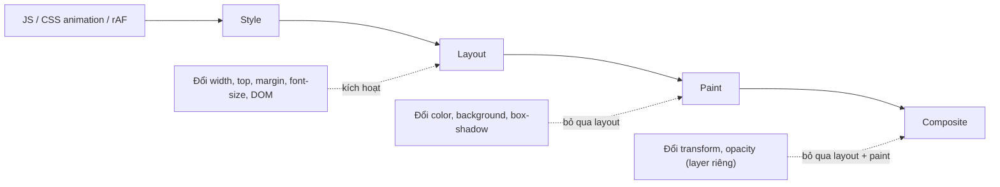
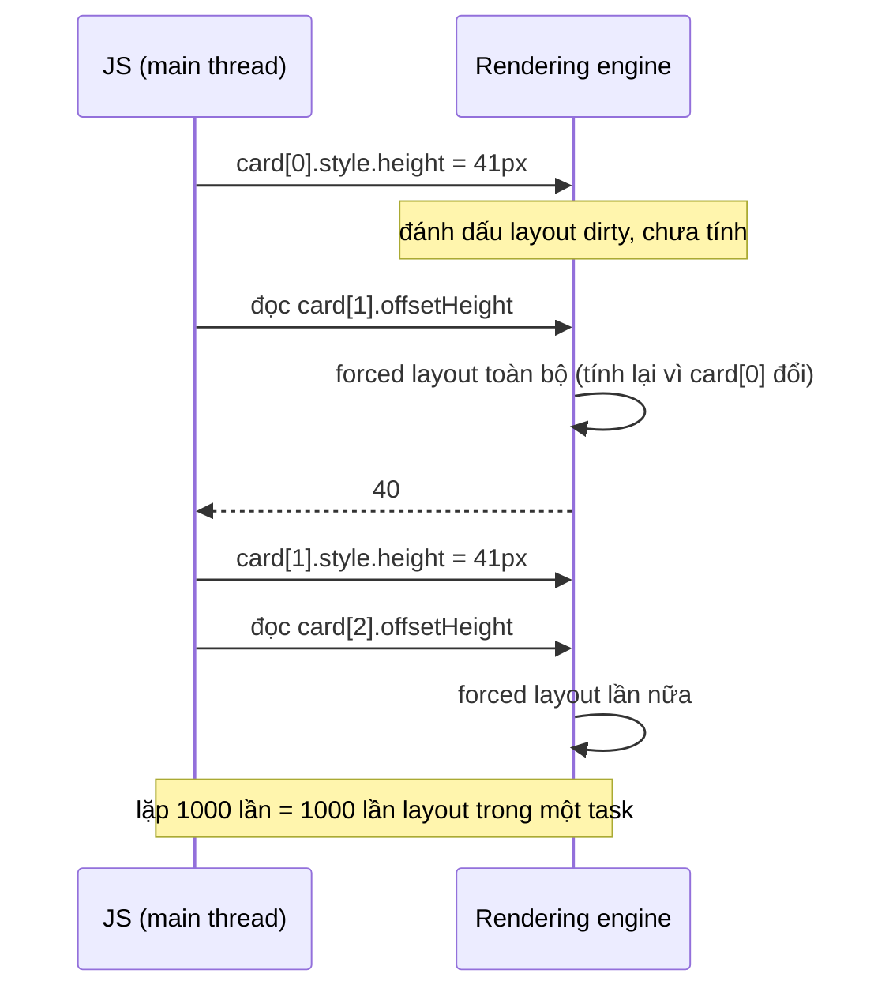

## Bối cảnh & vấn đề

Một trang danh sách sản phẩm có hiệu ứng "card cao dần khi scroll". Trên MacBook nó mượt, trên điện thoại Android tầm trung nó giật tới mức người dùng nghĩ trang bị treo. Đoạn code trông vô hại:

```ts
window.addEventListener('scroll', () => {
  document.querySelectorAll('.card').forEach((card) => {
    const h = (card as HTMLElement).offsetHeight;      // đọc layout
    (card as HTMLElement).style.height = `${h + 1}px`; // ghi style
  });
});
```

Với 1.000 card, đo thật trong Chrome: một lần chạy vòng lặp này tốn **207 ms**, và **907 ms** khi giả lập CPU chậm 4 lần. Một frame chỉ có **16,7 ms** ở 60 Hz. Cùng công việc, sắp xếp lại thứ tự đọc/ghi, chỉ tốn **2,6 ms**. Khác biệt 80 lần không nằm ở thuật toán mà ở chỗ code đã ép trình duyệt tính lại **layout** 1.000 lần.

Bài [critical rendering path](/tracks/browser-web-perf/learn/critical-rendering-path) dừng ở chỗ "render tree → layout → paint → composite". Bài này mở ba bước đó ra: mỗi bước làm gì, thay đổi CSS nào kích hoạt bước nào, và vì sao đọc `offsetHeight` sai chỗ có thể đắt hơn cả một thuật toán O(n²).

**Interview angle:** câu hỏi "reflow vs repaint vs composite" gần như luôn đi kèm follow-up "vậy animation nào mượt?" và một đoạn code layout thrashing để bạn debug.

## Khái niệm

### Frame budget và event loop

Màn hình 60 Hz làm mới 60 lần mỗi giây, nên mỗi **frame** có khoảng **16,7 ms** (màn 120 Hz chỉ còn 8,3 ms). Trong khoảng đó, main thread phải chạy JS của bạn, rồi trình duyệt còn cần thời gian cho style, layout, paint. Thực tế bạn chỉ nên dùng khoảng **10 ms** cho JS trong một frame.

Theo HTML Standard, event loop chạy một **task** (một callback của `setTimeout`, một event click, một message), xử lý microtask (Promise), rồi **có thể** thực hiện bước "update the rendering": chạy `requestAnimationFrame` callbacks, tính style, layout, paint. Trình duyệt chỉ render khi có cơ hội và khi cần. Một task chạy 200 ms nghĩa là 12 frame bị bỏ: người dùng thấy giật (**jank**) và click không có phản hồi (xem [INP](/tracks/browser-web-perf/learn/inp-long-tasks)).

### Style (recalculate style)

Bước **style** tính **computed style** cho mỗi element: selector nào khớp, cascade, kế thừa. Chi phí tỉ lệ với số element bị ảnh hưởng nhân với độ phức tạp của selector. Đổi một class trên `<body>` có thể buộc tính lại style cho cả cây.

### Layout (reflow)

**Layout** (Firefox gọi là **reflow**) tính **hình học**: vị trí và kích thước của mọi box. Layout thường lan rộng: đổi chiều cao một card đẩy mọi thứ phía sau xuống, đổi độ rộng container làm text wrap lại. Thuộc tính kích hoạt layout: `width`, `height`, `top`/`left` (khi positioned), `margin`, `padding`, `border-width`, `font-size`, `display`, thêm/xoá node, đổi nội dung text.

### Paint

**Paint** vẽ pixel: text, màu, border, shadow, ảnh, vào một hoặc nhiều **layer**. Thuộc tính chỉ cần paint mà không cần layout: `color`, `background-color`, `background-image`, `box-shadow`, `outline`, `visibility`. Paint tốn theo diện tích và độ phức tạp: `box-shadow` blur lớn hay `filter: blur()` trên vùng rộng rất đắt.

### Composite và layer

**Composite** ghép các layer đã paint thành hình cuối cùng, thường do **compositor thread** và GPU làm, tách khỏi main thread. Nếu một element nằm trên layer riêng, đổi **`transform`** hoặc **`opacity`** chỉ cần compositor dịch chuyển hoặc làm mờ layer đó: **không layout, không paint**. Vì chạy ngoài main thread, animation composite-only vẫn mượt kể cả khi JS đang bận.

**Promote** (đưa lên layer riêng) xảy ra khi có animation transform/opacity, `will-change: transform`, video, canvas, `position: fixed` trong một số trường hợp. Mỗi layer tốn bộ nhớ GPU (khoảng rộng × cao × 4 byte), nên hàng trăm layer lớn trên điện thoại gây **layer explosion**: tốn RAM, compositor chậm, thậm chí crash tab.

### Forced synchronous layout và layout thrashing

Trình duyệt làm layout **lười**: bạn ghi `el.style.height = '100px'`, nó chỉ đánh dấu "layout bẩn" và chờ tới frame sau. Nhưng nếu ngay sau đó bạn **đọc** một giá trị hình học (`offsetHeight`, `getBoundingClientRect()`, `scrollTop`, `getComputedStyle(el).width`), trình duyệt buộc phải tính layout **ngay lập tức, đồng bộ** để trả số đúng. Đó là **forced synchronous layout** (DevTools gọi là "Forced reflow").

**Layout thrashing** là khi việc đó lặp lại trong vòng lặp: ghi → đọc → ghi → đọc. Mỗi lần đọc đều tính lại layout cho thay đổi vừa ghi, nên N phần tử tốn N lần layout thay vì 1. Cách chữa luôn là **gom đọc trước, ghi sau** (batch reads, then writes), hoặc tách đọc và ghi ra hai frame bằng `requestAnimationFrame`.

**Interview angle:** interviewer muốn nghe cụm "đọc sau khi ghi buộc layout đồng bộ" và cách sửa "batch reads/writes", không phải "dùng debounce".

### content-visibility và observer

**`content-visibility: auto`** cho phép trình duyệt bỏ qua style/layout/paint của phần tử ngoài màn hình cho tới khi nó gần viewport, rất hiệu quả với trang dài hàng nghìn block (cần `contain-intrinsic-size` để giữ chỗ, tránh thanh cuộn nhảy). Theo MDN BCD, có ở Chrome 85+, Firefox 125+, Safari 18+ (verify).

**`IntersectionObserver`** báo khi element vào/ra viewport, **`ResizeObserver`** báo khi kích thước đổi. Cả hai được trình duyệt tính sẵn trong pipeline, không buộc layout đồng bộ, nên thay thế tốt cho việc gọi `getBoundingClientRect()` trong scroll handler.

## Cơ chế hoạt động

Mỗi frame, pipeline chạy theo thứ tự cố định. Điều quan trọng là **bước nào bị kích hoạt** phụ thuộc vào loại thay đổi:



Thay đổi hình học chạy đủ bốn bước. Thay đổi màu bỏ qua layout nhưng vẫn phải paint lại vùng đó. Thay đổi `transform`/`opacity` trên layer riêng chỉ chạy composite, thường trên compositor thread, nên không cạnh tranh với JS trên main thread.

### Vì sao đọc sau ghi lại đắt



Trong phiên bản đã sửa, vòng lặp thứ nhất chỉ **đọc** (layout tính một lần ở lần đọc đầu, các lần đọc sau dùng kết quả cache vì không có gì bẩn), vòng lặp thứ hai chỉ **ghi**, và layout được tính **một lần** ở cuối (hoặc ở frame kế tiếp).

### Lịch chạy trong một frame

`requestAnimationFrame(cb)` chạy `cb` **ngay trước** bước style/layout của frame kế tiếp. Đây là chỗ đúng để ghi style cho animation bằng JS: mọi thay đổi trong rAF được gom lại và render một lần. Đọc hình học ở đầu rAF (trước khi ghi) là rẻ vì layout của frame trước còn hợp lệ. Scroll event trong trình duyệt hiện đại cũng được căn theo frame (tối đa một lần mỗi frame), nhưng handler nặng vẫn làm trễ frame đó.

## Ví dụ thực tế

### Đo layout thrashing: 207 ms → 2,6 ms

Trang có 1.000 `.card`. Hai hàm làm cùng một việc (tăng chiều cao mỗi card 1px):

```ts
function thrash(): number {
  const t = performance.now();
  document.querySelectorAll<HTMLElement>('.card').forEach((card) => {
    const h = card.offsetHeight;          // read → forced layout
    card.style.height = `${h + 1}px`;     // write → layout dirty
  });
  return performance.now() - t;
}

function batched(): number {
  const t = performance.now();
  const cards = [...document.querySelectorAll<HTMLElement>('.card')];
  const heights = cards.map((c) => c.offsetHeight);            // all reads
  cards.forEach((c, i) => (c.style.height = `${heights[i] + 1}px`)); // all writes
  document.body.offsetHeight; // ép layout 1 lần để đo công bằng
  return performance.now() - t;
}
```

Output thật, median 5 lần, Chrome 154 headless trên Apple Silicon, rồi giả lập CPU chậm 4 lần bằng `Emulation.setCPUThrottlingRate`:

```text
no throttle     { thrash_ms: '207.5', batched_ms: '2.6' }
4x CPU throttle { thrash_ms: '907.2', batched_ms: '9.1' }
```

Trên thiết bị yếu, phiên bản thrash tốn gần 1 giây cho **một** scroll event. Phiên bản batched vừa trong một frame.

### Sửa đoạn scroll handler cho production

```ts
let scheduled = false;

window.addEventListener(
  'scroll',
  () => {
    if (scheduled) return;          // tối đa 1 lần mỗi frame
    scheduled = true;
    requestAnimationFrame(() => {
      scheduled = false;
      const cards = [...document.querySelectorAll<HTMLElement>('.card')];
      const heights = cards.map((c) => c.offsetHeight);   // đọc
      cards.forEach((c, i) => {
        c.style.transform = `scaleY(${1 + heights[i] / 4000})`; // ghi, composite-only
      });
    });
  },
  { passive: true },                // không chặn scroll vì preventDefault
);
```

Ba thay đổi: gom đọc/ghi trong `requestAnimationFrame`, dùng `transform` thay vì `height` để không kích hoạt layout, và `{ passive: true }` để trình duyệt biết listener không gọi `preventDefault()`, từ đó scroll trên compositor mà không chờ JS. Tốt hơn nữa: nếu hiệu ứng phụ thuộc việc card vào viewport, dùng `IntersectionObserver` và không làm gì trong scroll handler.

### Đo animation: left vs transform

Cùng một box chạy CSS animation trong 2 giây, đếm số lần layout bằng CDP `Performance.getMetrics`:

```css
@keyframes byLeft      { from { left: 0 } to { left: 400px } }
@keyframes byTransform { from { transform: translateX(0) } to { transform: translateX(400px) } }
```

Output thật (Chrome 154 headless):

```text
left      LayoutCount +121 RecalcStyleCount +121
color     LayoutCount +0 RecalcStyleCount +2
transform LayoutCount +1 RecalcStyleCount +2
```

Animation `left` tính layout ở **mỗi frame** (khoảng 60 lần/giây). Animation `transform` gần như không chạm main thread: style và layout chỉ chạy lúc animation bắt đầu. Animation `background-color` cũng không layout; trên Chrome bản này nó còn không recalc style mỗi frame, gợi ý Chrome đã tối ưu được kiểu animation này, nhưng đừng coi đó là đảm bảo trên mọi trình duyệt (verify).

## Trade-offs & lựa chọn thay thế

| Thay đổi | Style | Layout | Paint | Composite | Ví dụ |
|---|---|---|---|---|---|
| Hình học | Có | Có | Có | Có | `width`, `height`, `top`, `margin`, `font-size`, thêm node |
| Chỉ hình thức | Có | Không | Có | Có | `color`, `background`, `box-shadow`, `visibility` |
| Composite-only | Có (một lần) | Không | Không | Có | `transform`, `opacity` trên layer riêng |

| Kỹ thuật | Lợi ích | Cái giá |
|---|---|---|
| `transform`/`opacity` animation | Mượt, ngoài main thread | Cần layer; text scale có thể mờ |
| `will-change: transform` | Tạo layer sẵn, tránh giật lúc bắt đầu | Mỗi layer tốn RAM GPU; lạm dụng = layer explosion |
| Batch đọc/ghi, rAF | Một layout mỗi frame | Code phức tạp hơn; thư viện như fastdom giúp |
| `IntersectionObserver`/`ResizeObserver` | Không forced layout, callback theo frame | Bất đồng bộ, không có giá trị tức thì |
| `content-visibility: auto` | Bỏ qua render phần ngoài màn hình | Cần `contain-intrinsic-size`; tìm kiếm Ctrl+F và anchor cần kiểm tra |
| Virtualization (chỉ render phần nhìn thấy) | DOM nhỏ, layout rẻ | Phức tạp, ảnh hưởng accessibility và find-in-page |

Chọn thế nào: với animation và hiệu ứng tương tác, mặc định dùng `transform`/`opacity`; chỉ dùng `will-change` cho vài element **sắp** animate và gỡ sau đó. Với trang dài, thử `content-visibility: auto` trước khi viết virtualization, vì nó gần như miễn phí về code. Với logic phụ thuộc vị trí, dùng observer thay vì đo trong scroll/resize handler. Khi buộc phải đo, gom mọi phép đo vào đầu frame.

## Edge cases & failure modes

- **Đọc ẩn trong thư viện**: gọi `el.focus()`, `scrollIntoView()`, `innerText` (khác `textContent`) hay nhiều hàm của thư viện UI cũng ép layout. DevTools Performance đánh dấu "Forced reflow" kèm stack trace, luôn kiểm tra ở đó thay vì đoán.
- **Layout trên cây quá lớn**: DOM 15.000 node với flex/grid lồng nhau làm mỗi lần layout tốn chục ms dù không thrashing. Lighthouse cảnh báo "Avoid an excessive DOM size" khi DOM lớn (khoảng 1.400 node trở lên) (verify).
- **Layer explosion**: `will-change: transform` trên mỗi item của list 500 phần tử làm tab dùng hàng trăm MB GPU memory trên mobile và có thể bị kill. Xem Layers panel.
- **Scroll listener không passive**: `touchstart`/`wheel` listener không passive buộc trình duyệt chờ JS trước khi scroll. Chrome mặc định coi listener trên `window`/`document` là passive cho `touchstart`/`wheel`, nhưng listener trên element khác thì không.
- **Font và ảnh tải xong gây layout**: ảnh không có kích thước làm layout chạy lại khi ảnh về (và gây CLS, xem [bài CLS](/tracks/browser-web-perf/learn/cls-fonts)).
- **Animation composite bị "rơi" về main thread**: animate `transform` trên element mà trình duyệt không promote được (ví dụ một số trường hợp với SVG) sẽ quay về paint mỗi frame. Paint flashing trong DevTools Rendering tab cho thấy ngay.

## Pitfalls

- ❌ Trong vòng lặp: đọc `offsetHeight` rồi ghi `style.height` → ✅ đọc hết vào mảng, rồi ghi hết; ghi trong `requestAnimationFrame`.
- ❌ Animate `top`/`left`/`height` cho hiệu ứng trượt → ✅ `transform: translate/scale`; `opacity` cho fade.
- ❌ Rải `will-change: transform` khắp stylesheet "cho mượt" → ✅ chỉ đặt trên element sắp animate, gỡ khi xong.
- ❌ Đo vị trí bằng `getBoundingClientRect()` trong scroll handler để lazy-load hay sticky → ✅ `IntersectionObserver`, `position: sticky`.
- ❌ "Debounce là xong" → ✅ debounce giảm số lần chạy nhưng mỗi lần chạy vẫn thrash; sửa thứ tự đọc/ghi mới giải quyết gốc.
- ❌ Tin cảm giác trên máy dev → ✅ CPU throttling 4x–6x trong DevTools, đo bằng Performance panel.

## Tóm tắt

- Mỗi frame có khoảng 16,7 ms (60 Hz); JS, style, layout, paint phải vừa trong đó, còn composite chạy trên compositor thread.
- Layout (reflow) tính hình học và thường lan rộng; paint vẽ pixel; composite ghép layer. `transform`/`opacity` chỉ cần composite.
- Đọc hình học ngay sau khi ghi style gây **forced synchronous layout**; lặp lại trong vòng lặp là **layout thrashing** (đo thật 207 ms → 2,6 ms, 4x CPU: 907 ms → 9,1 ms).
- Sửa: gom đọc trước, ghi sau; ghi trong `requestAnimationFrame`; listener `{ passive: true }`.
- Animation `left` chạy layout mỗi frame (+121 layout/2 s), `transform` gần như không (+1).
- `will-change` tạo layer nhưng tốn bộ nhớ; dùng có chừng mực.
- Thay đo trong scroll bằng `IntersectionObserver`/`ResizeObserver`; trang dài dùng `content-visibility: auto` hoặc virtualization.
