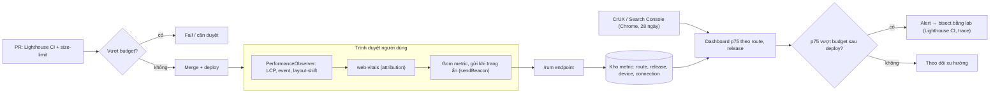

## Bối cảnh & vấn đề

Team frontend của một shop online ăn mừng vì Lighthouse chấm trang chủ **92 điểm** trên laptop của tech lead. Hai tuần sau, Search Console báo trang sản phẩm "Poor" về LCP trên mobile, còn team marketing gửi dashboard: người dùng Android bỏ trang ở bước giỏ hàng nhiều gấp đôi iOS. Không ai sai về số liệu. Họ chỉ đang nhìn **hai thứ khác nhau**: một lần chạy giả lập trên máy mạnh, và trải nghiệm thật của hàng trăm nghìn người dùng trên máy yếu, mạng chập chờn.

Trước **Core Web Vitals (CWV)**, "performance" là một mớ chỉ số: `DOMContentLoaded`, `load`, TTI, Speed Index, mỗi team tối ưu một thứ. Google đề xuất CWV năm 2020 như một tập nhỏ, lấy người dùng làm trung tâm, trả lời ba câu hỏi: nội dung chính **hiện ra nhanh không** (LCP), trang **phản hồi nhanh không** khi tương tác (INP), và layout có **đứng yên không** (CLS). Chúng được đo từ trình duyệt của người dùng thật, và được dùng làm tín hiệu xếp hạng trong Google Search.

Bài này là nền cho các bài [LCP](/tracks/browser-web-perf/learn/lcp-images), [CLS](/tracks/browser-web-perf/learn/cls-fonts) và [INP](/tracks/browser-web-perf/learn/inp-long-tasks): định nghĩa chính xác, cách đo ở lab và field, và cách biến chúng thành quy trình của cả tổ chức.

**Interview angle:** câu mở đầu dễ ("CWV là gì, ngưỡng bao nhiêu"), nhưng điểm phân loại ứng viên là câu "lab và field lệch nhau, bạn tin cái nào?" và "bạn thiết lập RUM thế nào để biết component nào gây INP tệ?".

## Khái niệm

### LCP: Largest Contentful Paint

**LCP** là thời điểm (tính từ lúc bắt đầu điều hướng) phần tử nội dung **lớn nhất nhìn thấy trong viewport** được render xong. Ứng viên gồm ``, `<image>` trong SVG, poster của `<video>`, element có `background-image` qua `url()`, và block chứa text. Trình duyệt phát ra nhiều entry LCP khi phần tử lớn hơn xuất hiện, và **dừng ghi nhận khi người dùng tương tác** (click, gõ phím, scroll). Ngưỡng: **good ≤ 2,5 s**, **poor > 4 s**.

Ví dụ: trang sản phẩm có ảnh hero 1000×667 px. Ảnh thumbnail logo vẽ ở 300 ms là LCP tạm, rồi ảnh hero vẽ ở 1,2 s trở thành LCP cuối cùng.

### INP: Interaction to Next Paint

**INP** đo độ trễ từ lúc người dùng **click, tap hoặc nhấn phím** tới khi trình duyệt vẽ **frame tiếp theo** phản ánh tương tác đó, lấy trên **toàn bộ phiên** của trang. Giá trị báo cáo là tương tác tệ nhất, nhưng khi có nhiều tương tác thì bỏ bớt outlier (khoảng một tương tác tệ nhất cho mỗi 50 tương tác). Scroll và hover không tính. Ngưỡng: **good ≤ 200 ms**, **poor > 500 ms**.

INP **thay FID** làm Core Web Vital từ **12/03/2024**. **FID (First Input Delay)** chỉ đo **input delay** của **tương tác đầu tiên**: không tính thời gian chạy handler, không tính thời gian vẽ, và bỏ qua mọi tương tác sau. Một SPA có handler "Add to cart" 400 ms vẫn có FID đẹp nếu click đầu tiên rơi vào lúc main thread rảnh. Thư viện `web-vitals` từ v5 đã bỏ hẳn `onFID` (verify).

### CLS: Cumulative Layout Shift

**CLS** đo mức độ **dịch chuyển bất ngờ** của nội dung đang hiển thị. Mỗi **layout shift** có điểm = impact fraction × distance fraction. Các shift gần nhau được gom thành **session window** (các shift cách nhau dưới 1 s, cửa sổ tối đa 5 s), và CLS là **tổng điểm của session window lớn nhất**. Shift xảy ra trong 500 ms sau input của người dùng không bị tính. Ngưỡng: **good ≤ 0,1**, **poor > 0,25**. Chi tiết ở [bài CLS](/tracks/browser-web-perf/learn/cls-fonts).

### Percentile 75 và "đạt" Core Web Vitals

Một trang **đạt** khi **cả ba** chỉ số ở mức good tại **percentile 75 (p75)** của lượt xem trang, tách riêng mobile và desktop. Vì sao p75? Median (p50) che mất một nửa người dùng tệ hơn; p95 thì bị kéo bởi thiết bị và mạng ngoài tầm kiểm soát. p75 nghĩa là "3/4 lượt xem có trải nghiệm ít nhất là tốt".

Ví dụ: 1.000 lượt xem, sắp xếp LCP tăng dần, giá trị thứ 750 là 2,3 s → LCP ở p75 là 2,3 s, đạt.

### Lab data và field data

**Lab data** là một lần đo trong môi trường **kiểm soát**: thiết bị, mạng, CPU giả lập, cache lạnh, không có người dùng. Công cụ: Lighthouse, WebPageTest, DevTools Performance panel. Lab tái hiện được, so sánh được giữa hai commit, nên dùng để **debug và chặn regression**.

**Field data** (còn gọi **RUM, real user monitoring**) là dữ liệu từ **người dùng thật**: thiết bị thật, mạng thật, cache ấm/lạnh lẫn lộn, tương tác thật. Nguồn: **CrUX (Chrome UX Report)** của Google (dữ liệu từ người dùng Chrome đã opt-in, cửa sổ 28 ngày, hiển thị trong PageSpeed Insights và Search Console) hoặc RUM của chính bạn.

Lab **không đo được INP** vì không có người tương tác. Lighthouse dùng **TBT (Total Blocking Time)**, tổng phần vượt 50 ms của mọi long task giữa FCP và lúc trang ổn định, làm proxy.

### Thư viện web-vitals và attribution

**`web-vitals`** là thư viện nhỏ của Google Chrome team, cài đặt đúng định nghĩa các chỉ số (session window, bfcache restore, prerender, trang ẩn) mà tự viết `PerformanceObserver` rất dễ sai. Bản **attribution** (`web-vitals/attribution`) kèm thông tin chẩn đoán: LCP chia 4 phần và element nào; INP chia 3 phase, element nào, script nào (qua Long Animation Frames); CLS element nào dịch chuyển nhiều nhất.

Theo MDN browser-compat-data, API nền (`LargestContentfulPaint`, `PerformanceEventTiming`) đã có ở Firefox và Safari 26.2+, còn `LayoutShift` vẫn chỉ Chromium (verify). Tức là CLS chỉ đo được trên Chromium, còn LCP/INP bắt đầu đo được đa trình duyệt; CrUX thì luôn chỉ là Chrome.

**Interview angle:** nói được "INP không đo được trong lab, TBT chỉ là proxy" và "CrUX chỉ có Chrome, 28 ngày trượt, nên fix hôm nay phải chờ vài tuần mới thấy trong Search Console" là dấu hiệu bạn đã làm thật.

## Cơ chế hoạt động

Luồng dữ liệu của một chương trình đo lường đầy đủ, từ trình duyệt người dùng tới quyết định của team:



Có hai vòng lặp. Vòng **phòng ngừa** chạy trước khi merge: lab data trong CI chặn PR làm bundle phình hoặc LCP lab tệ đi. Vòng **phát hiện** chạy sau deploy: RUM gửi metric của người dùng thật, gắn với **release**, **route**, loại thiết bị và kết nối; dashboard tính p75 và alert khi một release làm xấu đi. Khi alert, team dùng attribution (element nào, script nào) và lab để tái hiện, rồi sửa.

Chú ý bước "gửi khi trang ẩn". CLS và INP **thay đổi suốt vòng đời trang**, nên giá trị cuối chỉ biết khi người dùng rời đi. `web-vitals` gọi callback khi `visibilitychange` sang `hidden` (không phải `unload`, vì `unload` không đáng tin trên mobile và làm hỏng bfcache). Request phải dùng `navigator.sendBeacon` hoặc `fetch(..., { keepalive: true })` để không bị huỷ khi trang đóng.

### Vì sao lab và field lệch nhau

| Yếu tố | Lab (Lighthouse mặc định) | Field (người dùng thật) |
|---|---|---|
| Thiết bị | Máy bạn + CPU slowdown 4x | Từ flagship tới Android 3 triệu đồng |
| Mạng | Mô phỏng RTT 150 ms, ~1,6 Mbps | 5G, Wi-Fi quán cà phê, 3G vùng xa |
| Cache | Lạnh | Phần lớn là lượt xem lặp lại, cache ấm |
| Tương tác | Không có (không INP) | Có, suốt phiên |
| Nội dung | Trang public, không đăng nhập | Sau đăng nhập, A/B test, consent banner, cá nhân hoá |
| Third-party | Tuỳ vùng máy chạy | Ads, tag theo quốc gia, theo consent |

## Ví dụ thực tế

### Lab: chạy Lighthouse 13 thật

Chạy Lighthouse trên trang thử nghiệm có ảnh hero là CSS background được gắn bởi một script `defer` (tức ảnh bị phát hiện muộn):

```bash
CHROME_PATH=$(node -e "console.log(require('puppeteer').executablePath())") \
  npx lighthouse@13 http://localhost:8123/lcp-cssbg.html \
  --only-categories=performance --output=json --output-path=lh.json
```

Output thật (trích từ `lh.json`):

```text
lighthouse 13.5.0 | formFactor mobile | throttling simulate {"rttMs":150,"throughputKbps":1638.4,"requestLatencyMs":562.5,"downloadThroughputKbps":1474.56,"uploadThroughputKbps":675,"cpuSlowdownMultiplier":4}
first-contentful-paint     0.9 s
largest-contentful-paint   3.3 s
total-blocking-time        0 ms
cumulative-layout-shift    0
speed-index                2.0 s
score 92
lcp-breakdown-insight: TTFB 13.6ms, resource load delay 818.7ms, resource load duration 411.7ms, element render delay 17.6ms
```

Hai điều đáng học. Thứ nhất, **điểm 92 nhưng LCP 3,3 s** (tức "needs improvement"): điểm Lighthouse là trung bình có trọng số của nhiều chỉ số lab, không phải CWV. Thứ hai, `throttling simulate` nghĩa là Lighthouse tải trang **không giới hạn** rồi **mô phỏng** (thuật toán Lantern) thời gian trên mạng chậm. Bảng breakdown là số quan sát thật (unthrottled), còn 3,3 s là số mô phỏng. Dù vậy breakdown vẫn chỉ đúng bệnh: **resource load delay 819 ms**, ảnh bị phát hiện muộn.

### Field: gửi Web Vitals kèm attribution về backend

```ts
// rum.ts: chạy trên mọi trang, import sớm nhưng không chặn render
import { onCLS, onINP, onLCP, onTTFB, type MetricWithAttribution } from 'web-vitals/attribution';

const queue = new Set<Record<string, unknown>>();

function toRecord(m: MetricWithAttribution) {
  const base = {
    name: m.name, value: Math.round(m.name === 'CLS' ? m.value * 1000 : m.value),
    rating: m.rating, id: m.id, navigationType: m.navigationType,
    route: window.__ROUTE_ID__, release: window.__RELEASE__,
    effectiveType: (navigator as any).connection?.effectiveType,
  };
  switch (m.name) {
    case 'LCP': return { ...base, target: m.attribution.target,
      loadDelay: m.attribution.resourceLoadDelay, renderDelay: m.attribution.elementRenderDelay };
    case 'INP': return { ...base, target: m.attribution.interactionTarget,
      inputDelay: m.attribution.inputDelay, processing: m.attribution.processingDuration,
      presentation: m.attribution.presentationDelay };
    case 'CLS': return { ...base, target: m.attribution.largestShiftTarget };
    default: return base;
  }
}

function flush() {
  if (!queue.size) return;
  navigator.sendBeacon('/rum', JSON.stringify([...queue]));
  queue.clear();
}

[onLCP, onINP, onCLS, onTTFB].forEach((on) => on((m) => queue.add(toRecord(m as MetricWithAttribution))));
addEventListener('visibilitychange', () => { if (document.visibilityState === 'hidden') flush(); });
```

Một bản ghi nhận được ở backend trông như sau (minh hoạ, cùng dạng với số thật của các bài sau):

```json
[
  { "name": "LCP", "value": 1244, "rating": "good", "route": "/p/[slug]", "release": "2026.09.29-3",
    "target": "#hero", "loadDelay": 814, "renderDelay": 26 },
  { "name": "INP", "value": 368, "rating": "needs-improvement", "route": "/p/[slug]",
    "target": "#add-to-cart", "inputDelay": 5, "processing": 358, "presentation": 5 }
]
```

Với dữ liệu này, câu hỏi "component nào gây INP tệ?" trở thành một câu SQL: nhóm theo `route, target`, tính p75 của `processing`. Nhìn cột `processing` chiếm 358/368 ms, bạn biết ngay phải sửa code handler chứ không phải hydration.

```sql
SELECT route, target,
       percentile_cont(0.75) WITHIN GROUP (ORDER BY value)      AS inp_p75,
       percentile_cont(0.75) WITHIN GROUP (ORDER BY processing) AS processing_p75,
       count(*) AS n
FROM rum_metrics
WHERE name = 'INP' AND ts > now() - interval '7 days' AND device = 'mobile'
GROUP BY route, target
HAVING count(*) > 200
ORDER BY inp_p75 DESC
LIMIT 5;
```

### Performance budget trong CI

```json
// lighthouserc.json (Lighthouse CI): assert trên số lab, chạy 3 lần lấy median
{
  "ci": {
    "collect": { "numberOfRuns": 3, "url": ["http://localhost:3000/", "http://localhost:3000/p/demo"] },
    "assert": {
      "assertions": {
        "largest-contentful-paint": ["error", { "maxNumericValue": 2500 }],
        "total-blocking-time": ["error", { "maxNumericValue": 200 }],
        "cumulative-layout-shift": ["error", { "maxNumericValue": 0.1 }],
        "resource-summary:script:size": ["warn", { "maxNumericValue": 180000 }]
      }
    }
  }
}
```

Kèm theo `size-limit` hoặc bundle diff trên mỗi PR ("PR này thêm 80 KB gzip vào route `/checkout`"), vì kích thước JS ổn định hơn nhiều so với thời gian lab vốn dao động theo máy CI.

## Trade-offs & lựa chọn thay thế

| Nguồn | Ưu | Nhược | Dùng để |
|---|---|---|---|
| Lighthouse / Lighthouse CI | Tái hiện được, chạy trên PR, có chẩn đoán | Một thiết bị giả lập, không INP, dao động giữa lần chạy | Chặn regression, debug |
| WebPageTest | Thiết bị/vị trí thật, filmstrip, waterfall chi tiết | Chậm, không phải mỗi PR | Điều tra sâu, so sánh đối thủ |
| DevTools Performance | Trace đầy đủ main thread | Thủ công, máy dev | Tìm long task, forced reflow |
| CrUX / PageSpeed Insights | Miễn phí, là số Google dùng | Chỉ Chrome, 28 ngày trượt, cần đủ traffic, không theo release | Mục tiêu và báo cáo SEO |
| RUM tự xây (`web-vitals`) | Theo route/release/thiết bị, có attribution, sau đăng nhập | Phải xây pipeline, lấy mẫu, bảo vệ privacy | Phát hiện và chẩn đoán regression |
| RUM thương mại (Datadog, Sentry, SpeedCurve...) | Có sẵn dashboard, alert | Chi phí, dữ liệu ở bên thứ ba | Team nhỏ, cần nhanh |

Chọn như thế nào: **field đặt mục tiêu, lab tìm nguyên nhân**. Mục tiêu viết theo p75 field của các trang quan trọng (home, danh mục, chi tiết sản phẩm, checkout), tách mobile/desktop. Lab dùng trong CI với budget chủ yếu dựa trên **kích thước** (ổn định) và vài chỉ số thời gian có ngưỡng rộng. Khi field xấu đi mà lab không đổi, nghi ngờ nguyên nhân chỉ có ở field: third-party theo vùng, A/B test, consent banner, thiết bị mới trong tập người dùng, cache CDN.

### Chương trình performance cho frontend lớn

1. **Mục tiêu**: p75 field cho từng trang quan trọng, tách mobile/desktop, gắn với chỉ số kinh doanh (conversion, bounce theo nhóm LCP).
2. **Budget**: JS/CSS theo route (gzip), số request, LCP/TBT lab; ai muốn vượt phải có lý do và được duyệt, không phải cấm tuyệt đối.
3. **CI gate**: Lighthouse CI + size-limit, comment diff lên PR.
4. **RUM**: `web-vitals` attribution, dashboard theo route/release, alert khi p75 xấu đi sau deploy.
5. **Third-party governance**: danh mục tag, owner, budget riêng, review trước khi thêm tag mới.
6. **Ownership**: mỗi route có team sở hữu; perf nằm trong definition-of-done; regression có post-mortem như sự cố.

Khi một PR thêm 80 KB JS cho tính năng quan trọng, quy trình không trả lời "không", mà hỏi: có lazy-load được không (chỉ tải khi mở tính năng)? có thư viện nhẹ hơn không? nếu vẫn cần, bù ở đâu (xoá dead code, bỏ polyfill)? và ghi nhận quyết định để đo lại sau release.

## Edge cases & failure modes

- **Trang SPA và soft navigation**: CWV gắn với **hard navigation**. Chuyển route trong SPA không tạo LCP mới, còn INP và CLS tiếp tục cộng dồn cho URL đầu tiên. RUM cần gắn metric với route đang hiển thị lúc tương tác; Chrome đang thử nghiệm Soft Navigations API (verify).
- **bfcache restore**: back/forward từ bfcache hiển thị tức thì; `web-vitals` báo một LCP mới với `navigationType: 'back-forward-cache'`. Đừng lọc nhầm, đó là trải nghiệm thật và rất tốt.
- **Prerender**: trang prerender bởi Speculation Rules có thể có LCP gần 0; `web-vitals` tính từ lúc kích hoạt (`activationStart`).
- **Tab mở trong nền**: LCP không được báo nếu trang được mở ở background tab (không có paint khi ẩn).
- **Beacon bị mất**: gửi trong `unload`, hoặc dùng `fetch` thường, mất phần lớn dữ liệu mobile. Dùng `visibilitychange` + `sendBeacon`.
- **Sai số lấy mẫu**: route ít traffic có p75 nhảy lung tung. Đặt ngưỡng số mẫu tối thiểu trước khi alert.
- **Lighthouse dao động**: cùng commit, điểm lệch 5–10 do CPU máy CI. Chạy 3–5 lần lấy median, cố định loại máy chạy.

## Pitfalls

- ❌ Lấy điểm Lighthouse làm KPI → ✅ KPI là p75 field của LCP/INP/CLS; Lighthouse là công cụ chẩn đoán (đo thật: điểm 92 nhưng LCP 3,3 s).
- ❌ Còn nói "Core Web Vitals gồm FID" → ✅ INP thay FID từ 12/03/2024; FID chỉ đo input delay của tương tác đầu.
- ❌ Báo cáo median → ✅ p75, tách mobile/desktop.
- ❌ Tự viết PerformanceObserver cho CLS/INP → ✅ dùng `web-vitals`; định nghĩa có nhiều chi tiết (session window, bfcache, prerender).
- ❌ Gửi metric trong `unload` → ✅ `visibilitychange` + `sendBeacon`.
- ❌ Chỉ đo trang public → ✅ RUM cả trang sau đăng nhập (checkout, dashboard), nơi CrUX và Lighthouse không thấy.
- ❌ RUM không gắn release → ✅ gắn release/commit để biết deploy nào gây regression.

## Tóm tắt

- LCP (tải) ≤ 2,5 s, INP (phản hồi) ≤ 200 ms, CLS (ổn định) ≤ 0,1; poor: > 4 s, > 500 ms, > 0,25. Đánh giá ở p75, tách mobile/desktop, cả ba phải đạt.
- INP thay FID từ 12/03/2024: đo cả processing và presentation, trên mọi tương tác của phiên.
- Lab (Lighthouse, simulated throttling: RTT 150 ms, ~1,6 Mbps, CPU 4x) để debug và chặn regression; không đo được INP (TBT là proxy).
- Field (CrUX: chỉ Chrome, 28 ngày; RUM của bạn) là trải nghiệm thật và là số dùng để đặt mục tiêu.
- `web-vitals/attribution` cho biết element, phase và script gây vấn đề; gửi bằng `sendBeacon` khi trang ẩn, gắn route/release/device.
- Chương trình perf: mục tiêu p75, budget kích thước JS trong CI, RUM + alert theo release, quản trị third-party, ownership theo route.
