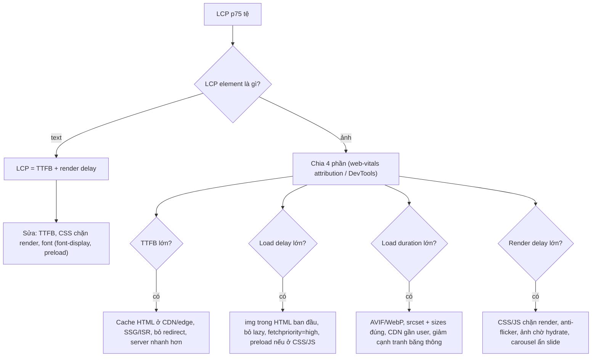
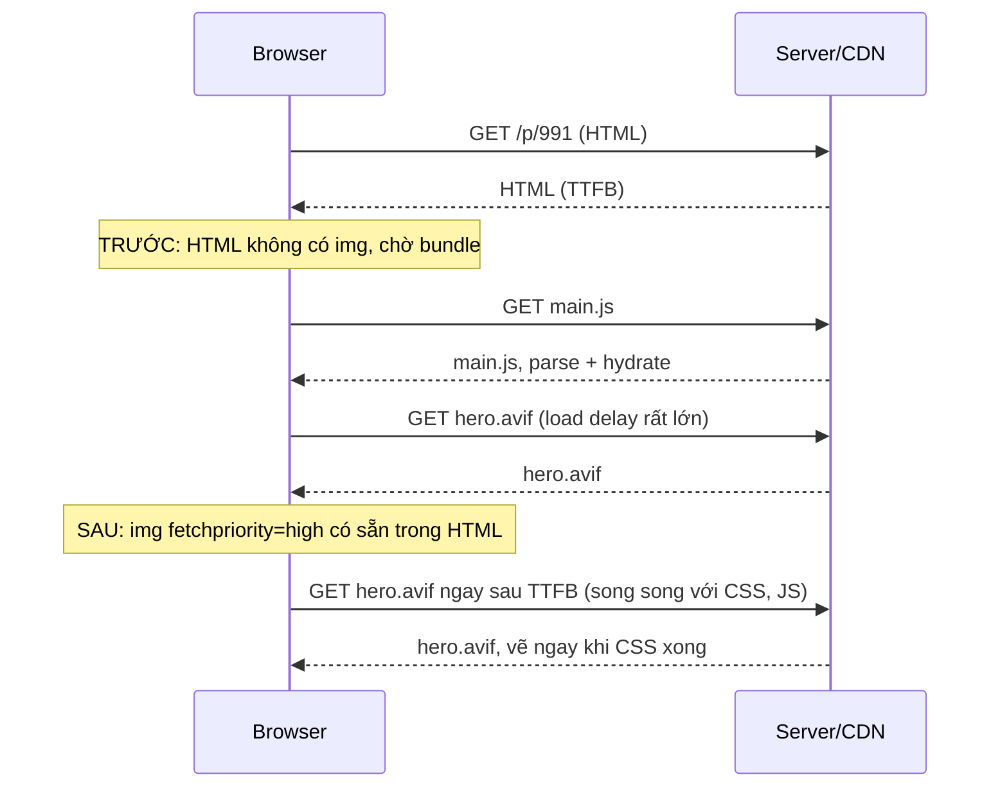

## Bối cảnh & vấn đề

Trang chi tiết sản phẩm (PDP) của một shop có LCP p75 trên mobile là 3,8 s. Team đã nén ảnh xuống 120 KB, bật CDN, nhưng LCP gần như không đổi. Mở DevTools ra mới thấy: ảnh sản phẩm chỉ **bắt đầu tải** ở giây 1,9, vì nó được render bởi một component React sau khi bundle tải và hydrate xong. Nén ảnh chỉ rút ngắn phần tải, còn phần lớn thời gian nằm ở chỗ **trình duyệt chưa biết ảnh tồn tại**.

Đây là sai lầm phổ biến nhất với **LCP (Largest Contentful Paint)**: coi nó là "ảnh to thì chậm" và chỉ tối ưu kích thước file. Thực tế LCP là tổng của **bốn khoảng thời gian** nối tiếp nhau, và mỗi khoảng có nguyên nhân và cách sửa riêng. Bài này dạy cách chia nhỏ LCP, đo từng phần, và các kỹ thuật ảnh, resource hint, rendering cho từng phần. Định nghĩa và ngưỡng LCP ở [bài Core Web Vitals](/tracks/browser-web-perf/learn/core-web-vitals); preload scanner ở [bài critical rendering path](/tracks/browser-web-perf/learn/critical-rendering-path).

**Interview angle:** "LCP tệ, bạn làm gì?" Câu trả lời mạnh bắt đầu bằng "tôi xem LCP element là gì và chia LCP thành 4 phần", không phải bằng danh sách mẹo.

## Khái niệm

### LCP element

**LCP element** là phần tử được trình duyệt chọn là "nội dung lớn nhất trong viewport". Ở trang thương mại điện tử thường là ảnh hero hoặc ảnh sản phẩm; ở trang bài viết thường là block text đầu tiên hoặc tiêu đề. Việc đầu tiên luôn là **xác định LCP element** (DevTools Performance panel, Lighthouse "LCP element", hoặc `attribution.target` của `web-vitals`), vì cách tối ưu ảnh và text khác nhau hoàn toàn.

### Bốn phần của LCP

web.dev chia LCP (khi LCP element là ảnh) thành:

1. **TTFB (Time to First Byte)**: từ lúc bắt đầu điều hướng tới khi nhận byte đầu của HTML. Gồm redirect, DNS, TCP, TLS, thời gian server xử lý.
2. **Resource load delay**: từ TTFB tới lúc trình duyệt **bắt đầu tải** ảnh LCP. Đây là "độ trễ phát hiện".
3. **Resource load duration**: thời gian tải ảnh.
4. **Element render delay**: từ lúc ảnh tải xong tới lúc nó thật sự được vẽ (bị chặn bởi CSS, JS, font, hydration, hoặc ảnh bị ẩn chờ JS).

Khuyến nghị của web.dev: TTFB và load duration mỗi phần khoảng 40%, còn load delay và render delay mỗi phần **dưới 10%**. Tức là hai phần "delay" nên gần bằng 0, vì chúng là thời gian lãng phí thuần tuý. Nếu LCP element là text, không có phần 2 và 3: LCP = TTFB + render delay (thường do CSS chặn render hoặc web font).

### Vì sao ảnh bị phát hiện muộn

Ảnh có trong HTML ban đầu dưới dạng `` được **preload scanner** thấy gần như ngay khi byte HTML về. Ảnh bị phát hiện muộn khi:

- Render bằng JS (component client-side, carousel khởi tạo sau hydrate).
- Là `background-image` trong CSS: phải chờ CSS tải, parse và style tính xong.
- Có `loading="lazy"`: trình duyệt phải chờ **layout** để biết ảnh có gần viewport không.
- Dùng `data-src` + thư viện lazy-load JS (kiểu cũ): phải chờ thư viện chạy.

### fetchpriority và preload cho ảnh

Mặc định Chrome coi ảnh là ưu tiên thấp tới khi layout cho thấy ảnh nằm trong viewport (lúc đó mới nâng ưu tiên). `fetchpriority="high"` trên `` báo trước "ảnh này quan trọng", nên nó được tải với ưu tiên cao ngay từ đầu, không phải chờ layout và không phải xếp hàng sau các ảnh khác. Với ảnh buộc phải ở CSS hoặc do JS render, dùng `<link rel="preload" as="image" fetchpriority="high" href>` (có `imagesrcset`/`imagesizes` cho ảnh responsive) để phát hiện sớm.

### Tối ưu kích thước ảnh

- **Định dạng**: AVIF thường nhỏ hơn WebP, WebP nhỏ hơn JPEG ở cùng chất lượng cảm nhận. Dùng `<picture>` với `<source type="image/avif">` hoặc để image CDN chọn theo header `Accept`.
- **Responsive**: `srcset` liệt kê nhiều bản theo chiều rộng (`400w`, `800w`, `1200w`), `sizes` nói ảnh sẽ **hiển thị** rộng bao nhiêu ở mỗi breakpoint. Trình duyệt nhân `sizes` với device pixel ratio để chọn bản nhỏ nhất đủ nét.
- **Kích thước khai báo**: luôn có `width`/`height` (hoặc `aspect-ratio`) để giữ chỗ, chống CLS.
- **`loading="lazy"`** cho ảnh **dưới fold**, **không bao giờ** cho ảnh LCP. **`decoding="async"`** cho phép decode ngoài luồng chính.

Ví dụ `sizes` sai: lưới 4 cột trên desktop, mỗi ô rộng khoảng 300 px, nhưng `sizes="100vw"`. Trên màn 1440 px, DPR 2, trình duyệt nghĩ ảnh rộng 1440 × 2 = 2880 px và tải bản lớn nhất cho **mỗi** ô 300 px, tức gấp khoảng 90 lần số pixel cần.

### Third-party, tag manager và anti-flicker

**Tag manager** (Google Tag Manager và tương tự) cho phép marketing thêm script mà không cần deploy. Công cụ **A/B testing phía client** (client-side experimentation) sửa DOM sau khi trang tải để hiển thị biến thể. Để người dùng không thấy bản gốc "nháy" sang biến thể, chúng thường kèm **anti-flicker snippet**: một đoạn CSS/JS trong `<head>` đặt `opacity: 0` cho `<html>` hoặc `<body>` tới khi script experiment tải xong, hoặc hết timeout (thường 2–4 giây). Trong lúc đó, **không có gì được vẽ**: LCP bị cộng thẳng thời gian tải script experiment.

**Interview angle:** câu hỏi scenario "LCP xấu đi ngay sau khi marketing thêm tag" gần như luôn có đáp án gốc là anti-flicker snippet hoặc script đồng bộ trong `<head>`.

## Cơ chế hoạt động

Sơ đồ chẩn đoán: bắt đầu từ LCP element, đo từng phần, sửa phần lớn nhất trước.



Luồng này buộc bạn sửa **đúng phần**. Nén ảnh (F3) vô ích nếu load delay là 1,5 s. Preload (F2) vô ích nếu TTFB là 2 s vì server render chậm. Thứ tự hay gặp nhất trên các trang React/SPA là: load delay lớn (ảnh do JS render) và render delay lớn (hydration, anti-flicker), trong khi team lại tập trung vào nén ảnh.

Timeline dưới đây minh hoạ một PDP trước và sau khi sửa (số tương đối, không phải số đo):



## Ví dụ thực tế

### Đo thật: cùng một ảnh, bốn cách nhúng

Trang thử nghiệm có 6 thumbnail trên header, một stylesheet chặn render mất 300 ms, một `app.js` `defer` mất 800 ms, và ảnh hero mà server luôn trả sau 400 ms. Chỉ khác cách nhúng hero:

```html
<!-- lazy -->    
<!-- cssbg -->   <div class="hero" id="hero"></div>  <!-- app.js gán style.backgroundImage -->
<!-- eager -->   
<!-- priority -->
```

LCP đo bằng `web-vitals` 6.2.2 bản attribution, median 3 lần, Chrome 154 headless, không giới hạn băng thông (độ trễ do server tạo):

```text
lazy      {"value":748,"el":"html>body>img.hero","ttfb":3,"loadDelay":318,"loadDuration":406,"renderDelay":21}
cssbg     {"value":1244,"el":"#hero","ttfb":2,"loadDelay":814,"loadDuration":403,"renderDelay":26}
eager     {"value":428,"el":"html>body>img.hero","ttfb":3,"loadDelay":14,"loadDuration":403,"renderDelay":9}
priority  {"value":432,"el":"html>body>img.hero","ttfb":2,"loadDelay":10,"loadDuration":405,"renderDelay":14}
```

Đọc số: **load duration gần như giống hệt** (khoảng 405 ms) ở cả bốn cách, vì ảnh giống nhau. Toàn bộ khác biệt nằm ở **load delay**: `lazy` chờ layout, mà layout chờ CSS (300 ms), nên delay 318 ms. `cssbg` chờ `app.js` (800 ms) mới biết URL ảnh, delay 814 ms, LCP gần gấp 3 lần. `eager` được preload scanner thấy ngay, delay 14 ms. `priority` không khác `eager` ở đây vì thí nghiệm **không có cạnh tranh băng thông**; trên mạng chậm với nhiều ảnh cùng tải, `fetchpriority="high"` mới tạo khác biệt (đó là chỗ nó được thiết kế cho).

### Ảnh LCP cho lưới sản phẩm, viết đúng

```html
<!-- Ảnh hero PDP: có trong HTML, ưu tiên cao, responsive -->
<picture>
  <source type="image/avif"
          srcset="/img/991-600.avif 600w, /img/991-900.avif 900w, /img/991-1200.avif 1200w"
          sizes="(min-width: 1024px) 560px, 100vw">
  
</picture>

<!-- Ảnh trong lưới 4 cột bên dưới: lazy, sizes khớp layout -->

```

Với Next.js, `next/image` sinh `srcset` và chọn format qua image optimizer. Bạn vẫn phải tự khai báo `sizes` đúng layout và đánh dấu ảnh LCP. Từ Next.js 16, prop `priority` bị deprecate và thay bằng `preload`, và docs của `next/image` khuyên trong đa số trường hợp nên dùng `loading="eager"` hoặc `fetchPriority="high"` thay vì `preload`.

### Tính `sizes` sai tốn bao nhiêu

Lưới 4 cột, container 1280 px, mỗi ô khoảng 300 px CSS, laptop DPR 2:

| `sizes` | Trình duyệt nghĩ ảnh rộng | Bản được chọn từ `srcset` 300w/600w/1200w/2400w |
|---|---|---|
| `100vw` (viewport 1440) | 1440 × 2 = 2880 px | 2400w (lớn nhất) |
| `25vw` | 360 × 2 = 720 px | 1200w |
| `(min-width:1024px) 300px` | 300 × 2 = 600 px | 600w |

Chọn 2400w thay vì 600w nghĩa là số pixel gấp 16 lần cho mỗi ô, nhân với 24 sản phẩm trên trang. Đây là bảng tính minh hoạ theo thuật toán chọn nguồn của HTML, không phải số đo.

### Scenario: LCP từ 2,1 s lên 3,8 s sau khi thêm tag A/B testing

Snippet mà marketing dán vào `<head>` trông như sau (dạng phổ biến, rút gọn):

```html
<style>.async-hide { opacity: 0 !important }</style>
<script>
  // ẩn trang tới khi experiment tải xong, tối đa 4 giây
  (function (a, s, y, n, c, h, i, d, e) {
    s.className += ' ' + y; h.start = 1 * new Date(); h.end = i = function () { s.className = s.className.replace(RegExp(' ?' + y), '') };
    (a[n] = a[n] || []).hide = h; setTimeout(function () { i(); h.end = null }, c); h.timeout = c;
  })(window, document.documentElement, 'async-hide', 'dataLayer', 4000, { 'GTM-XXXX': true });
</script>
<script src="https://experiments.vendor.example/loader.js"></script>
```

Điều tra: RUM trước/sau deploy theo thiết bị cho thấy **render delay** tăng vọt, còn load delay không đổi. Trace cho thấy ảnh hero đã tải xong từ 1,9 s nhưng `<html>` vẫn `opacity: 0` tới khi `loader.js` (đồng bộ, chặn parser) và cấu hình experiment về. Thêm long task khi script experiment chạy.

Thương lượng với marketing bằng dữ liệu: đưa ra biểu đồ conversion theo nhóm LCP từ RUM, và các phương án theo thứ tự ưu tiên: (1) chạy experiment **phía server/edge** (không flicker, không chặn); (2) nếu buộc client-side, chỉ chèn snippet trên **trang đang có experiment**, giảm timeout từ 4000 xuống khoảng 1000 ms, tải script `async`; (3) mọi tag khác tải sau `load` hoặc khi idle; (4) một **budget** cho third-party và quy trình review trước khi thêm tag.

## Trade-offs & lựa chọn thay thế

| Kỹ thuật | Tác động vào phần nào | Khi nào dùng | Rủi ro |
|---|---|---|---|
| CDN/edge cache HTML, SSG/ISR | TTFB | Trang ít cá nhân hoá | Stale data, cache key sai theo tenant/locale |
| `` trong HTML thay vì JS/CSS | Load delay | Luôn, với ảnh LCP | Cần SSR/HTML có sẵn ảnh |
| `fetchpriority="high"` | Load delay/duration khi có cạnh tranh | 1 ảnh LCP mỗi trang | Đặt cho nhiều ảnh thì mất tác dụng |
| `<link rel="preload" as="image">` | Load delay | Ảnh LCP ở CSS hoặc JS render | Preload sai ảnh (responsive) → tải 2 lần |
| AVIF/WebP, `srcset`/`sizes` | Load duration | Mọi ảnh | Encode AVIF chậm; cần image CDN |
| `preconnect` origin ảnh | Load duration (bỏ handshake) | Ảnh ở origin khác | Lạm dụng tốn socket |
| Bỏ anti-flicker, A/B phía server | Render delay | Có client-side experiment | Cần hạ tầng edge |
| Streaming SSR | TTFB tới FCP | Trang có dữ liệu chậm | Hydration vẫn tốn JS |

Chọn theo phần lớn nhất trong breakdown. Nếu TTFB chiếm phần lớn, không có trick front-end nào cứu được, phải cache HTML ở edge hoặc prerender. Nếu load delay lớn, sửa **cách nhúng** ảnh trước mọi thứ (rẻ nhất, hiệu quả nhất). Nếu load duration lớn, tối ưu byte ảnh và CDN. Nếu render delay lớn, tìm thứ đang chặn vẽ: CSS lớn, font, script đồng bộ, anti-flicker, hydration.

## Edge cases & failure modes

- **Carousel**: slide đầu là LCP nhưng thư viện khởi tạo bằng JS và ẩn mọi slide tới khi init → render delay lớn. Render slide đầu bằng HTML tĩnh, init carousel sau.
- **Ảnh chiếm toàn viewport**: Chrome có heuristic loại ảnh nền phủ toàn màn hình và ảnh "low-entropy" (ít thông tin trên mỗi pixel, như placeholder mờ) khỏi ứng viên LCP (verify). LCP có thể nhảy sang một element bạn không ngờ.
- **Placeholder blur**: ảnh placeholder nhỏ được phóng to có thể bị tính là LCP sớm hoặc bị loại vì low-entropy; đừng dựa vào nó để "ăn gian" LCP.
- **Preload responsive sai**: `<link rel="preload" href="hero-1200.jpg">` nhưng `` chọn `hero-600.jpg` trên mobile → tải hai ảnh. Dùng `imagesrcset`/`imagesizes` trên link preload.
- **LCP dừng khi tương tác**: người dùng scroll sớm thì LCP chốt ở element lúc đó; trang có nhiều người scroll nhanh sẽ có LCP "đẹp" giả.
- **Tab nền**: trang mở ở background tab không báo LCP; RUM sẽ thiếu mẫu, không phải lỗi.
- **Cookie consent banner**: banner text lớn có thể trở thành LCP element, và nếu nó được chèn bằng JS muộn thì LCP tệ đi dù ảnh sản phẩm nhanh.

## Pitfalls

- ❌ `loading="lazy"` cho mọi ảnh kể cả hero → ✅ lazy chỉ cho ảnh dưới fold; ảnh LCP eager + `fetchpriority="high"` (đo thật: lazy 748 ms vs eager 428 ms).
- ❌ Ảnh hero là `background-image` hoặc render sau hydrate → ✅ `` trong HTML ban đầu (đo thật: CSS bg 1.244 ms).
- ❌ Chỉ nén ảnh khi LCP tệ → ✅ xem breakdown trước; thường load delay hoặc render delay mới là phần lớn.
- ❌ `sizes="100vw"` cho ảnh trong lưới → ✅ `sizes` phản ánh chiều rộng hiển thị thật ở từng breakpoint.
- ❌ `fetchpriority="high"` cho cả lưới → ✅ một ảnh LCP; hạ `low` cho slide ẩn.
- ❌ Chấp nhận anti-flicker 4 giây "vì marketing cần" → ✅ A/B phía server, hoặc giới hạn trang và timeout, đo bằng RUM.
- ❌ Đo LCP chỉ trên desktop → ✅ LCP element và bố cục trên mobile thường khác, đo riêng.

## Tóm tắt

- Việc đầu tiên: xác định LCP element (ảnh hay text).
- LCP (ảnh) = TTFB + resource load delay + load duration + element render delay; hai phần "delay" nên gần 0.
- Load delay đến từ ảnh bị phát hiện muộn: JS render, CSS background, `loading="lazy"`. Đo thật: 14 ms (img trong HTML) vs 318 ms (lazy) vs 814 ms (CSS bg gắn bởi JS).
- `fetchpriority="high"` cho đúng một ảnh LCP; `preload` khi ảnh không nằm trong HTML.
- Giảm byte: AVIF/WebP, `srcset` + `sizes` đúng layout, CDN; `width`/`height` để chống CLS.
- Render delay: CSS/font/JS chặn vẽ, hydration, carousel, anti-flicker snippet của A/B test.
- Third-party governance: A/B phía server, tag async/sau load, budget và review, thuyết phục bằng RUM + conversion.
