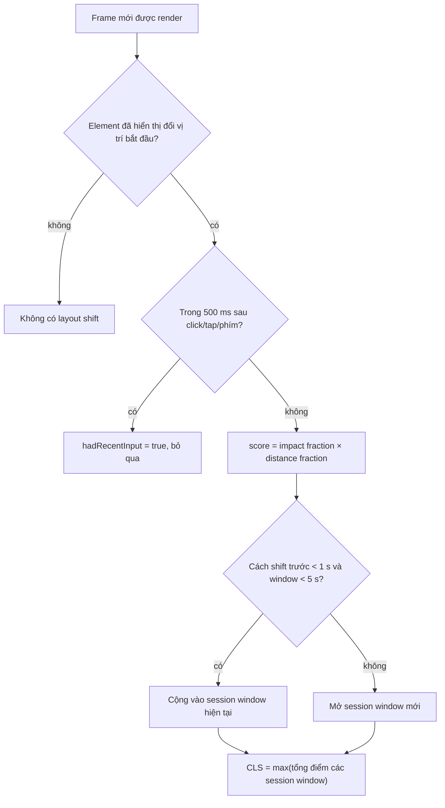
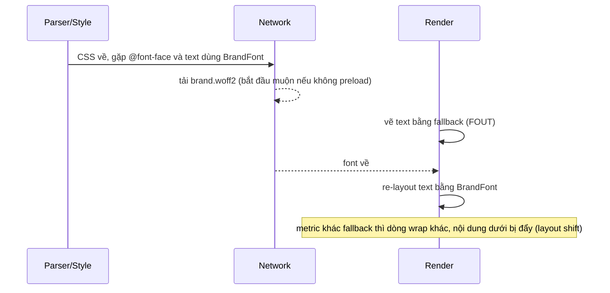

## Bối cảnh & vấn đề

Người dùng mở trang sản phẩm, đưa ngón tay định bấm "Mua ngay". Đúng lúc đó một banner "Miễn phí vận chuyển tuần này" được chèn phía trên, toàn bộ nội dung trượt xuống 60 px, và ngón tay rơi vào nút "Thêm vào danh sách yêu thích". Đó không chỉ là trải nghiệm khó chịu, mà là **click nhầm**: đặt nhầm hàng, bấm nhầm quảng cáo, rời trang vì tưởng trang lỗi.

**CLS (Cumulative Layout Shift)** là chỉ số đo đúng hiện tượng này: nội dung đang hiển thị bị **dịch chuyển mà người dùng không yêu cầu**. Khác với LCP và INP, CLS không phải là "nhanh hay chậm". Một trang tải trong 800 ms vẫn có thể có CLS 0,4 vì ảnh không khai báo kích thước. Trang thử nghiệm trong bài này, dựng lại đúng markup của một câu hỏi debug phổ biến, đo được **CLS 0,425** (poor), và về **0** sau ba thay đổi nhỏ.

Web font là nguồn CLS và LCP bị đánh giá thấp nhất, nên nằm chung bài: font tải muộn làm text vô hình (trễ LCP nếu LCP là text), rồi đổi metric khi swap (gây shift).

**Interview angle:** interviewer thường đưa một đoạn HTML và hỏi "cái gì shift?". Hãy đi từng element: có kích thước chưa, có được chèn muộn không, có đổi font không.

## Khái niệm

### Layout shift và điểm của nó

Một **layout shift** xảy ra khi một element **đã hiển thị** trong viewport đổi **vị trí bắt đầu** giữa hai frame (element mới được chèn thì không tính là shift, nhưng các element **bị nó đẩy đi** thì tính). Điểm của một shift:

```text
layout shift score = impact fraction × distance fraction
```

- **Impact fraction**: phần viewport bị ảnh hưởng, tức hợp vùng chiếm bởi các element không ổn định ở frame trước và frame sau, chia cho diện tích viewport.
- **Distance fraction**: quãng đường dịch chuyển lớn nhất (theo chiều ngang hoặc dọc) chia cho chiều lớn hơn của viewport.

Ví dụ: viewport 800×900. Một khối chiếm nửa trên viewport (impact 0,5) bị đẩy xuống 90 px (distance 90/900 = 0,1). Điểm shift = 0,5 × 0,1 = 0,05. Hai shift như vậy liên tiếp đã tới 0,1, chạm ngưỡng "good".

### Session window và CLS

Shift thường đến theo cụm (ảnh này về đẩy text, rồi banner về đẩy tiếp). CLS gom shift vào **session window**: các shift cách nhau **dưới 1 giây**, và cả cửa sổ **tối đa 5 giây**. **CLS là tổng điểm của session window lớn nhất** trong suốt vòng đời trang, không phải tổng mọi shift từ đầu tới cuối. Nhờ vậy một SPA mở suốt 3 giờ không bị CLS tăng vô hạn.

### Shift do người dùng gây ra không tính

Shift xảy ra trong **500 ms sau một input rời rạc** (click, tap, phím) được đánh dấu `hadRecentInput = true` và bị loại. Mở accordion khi click, hiện thông báo lỗi sau khi submit: không tính. Nhưng scroll **không** phải input loại này, và hover cũng không. Animation bằng `transform` không gây layout shift vì nó không đổi vị trí layout.

### Layout Instability API

Trình duyệt Chromium phát entry `layout-shift` qua `PerformanceObserver`, mỗi entry có `value`, `hadRecentInput`, và `sources`: danh sách tối đa 5 element bị dịch chuyển nhiều nhất cùng `previousRect`/`currentRect`. Đây là công cụ trả lời "cái gì đã shift?" ở field. Theo MDN BCD, `LayoutShift` chỉ có trên Chromium, Firefox và Safari chưa hỗ trợ (verify), nên CLS field chỉ đo được trên Chrome/Edge.

### Nguyên nhân phổ biến của CLS

- **Ảnh, video, iframe không có kích thước**: chiếm 0 px tới khi tải xong, rồi đẩy mọi thứ phía dưới.
- **Nội dung chèn muộn phía trên nội dung hiện có**: banner khuyến mãi, cookie consent, ads, "app install" bar, thông báo từ API.
- **Web font swap**: font thật có chiều rộng/chiều cao khác font fallback, text wrap khác đi.
- **Nội dung render sau hydration hoặc sau fetch**: skeleton khác kích thước với nội dung thật, hoặc không có skeleton.
- **Animation bằng thuộc tính layout** (`top`, `height`, `margin`) thay vì `transform`.

### Web font: FOIT và FOUT

Trình duyệt chỉ biết cần font khi CSS đã parse **và** có text dùng font đó được render. Trong lúc font tải, có hai hành vi:

- **FOIT (Flash of Invisible Text)**: text **ẩn** tới khi font về (hoặc hết thời gian chờ). Tệ cho LCP khi LCP element là text.
- **FOUT (Flash of Unstyled Text)**: text hiện ngay bằng **font fallback**, rồi đổi sang font thật. Tốt cho LCP, nhưng đổi font có thể gây shift.

### font-display

Thuộc tính `font-display` trong `@font-face` chọn hành vi qua ba giai đoạn: **block period** (text vô hình), **swap period** (dùng fallback, đổi khi font về), **failure period** (giữ fallback):

| Giá trị | Block | Swap | Hành vi |
|---|---|---|---|
| `auto` | Do trình duyệt (thường như `block`) | | Thường FOIT tới khoảng 3 s |
| `block` | Khoảng 3 s | Vô hạn | FOIT rồi swap |
| `swap` | Rất ngắn (khoảng 100 ms hoặc 0) | Vô hạn | FOUT: luôn swap khi font về |
| `fallback` | Khoảng 100 ms | Khoảng 3 s | Swap nếu font về trong 3 s, không thì giữ fallback |
| `optional` | Khoảng 100 ms | 0 | Chỉ dùng font nếu có gần như ngay (cache); **không bao giờ shift** |

### Fallback font khớp metric

Để `swap` không gây shift, chỉnh font fallback cho **cùng kích thước** với font thật bằng các descriptor của `@font-face`: **`size-adjust`** (co giãn toàn bộ glyph), **`ascent-override`**, **`descent-override`**, **`line-gap-override`** (chiều cao dòng). Các công cụ như `next/font`, Fontaine, Capsize tính sẵn các giá trị này từ file font. Theo MDN BCD, `size-adjust` có ở Chrome 92+, Firefox 92+, Safari 17+ (verify).

### Preload font và crossorigin

Font được phát hiện muộn (sau CSS), nên font dùng above-the-fold đáng được `preload`. Font **luôn được tải ở chế độ CORS** (anonymous), kể cả khi cùng origin. Nếu `<link rel="preload" as="font">` thiếu `crossorigin`, request preload là no-cors, không khớp cache key với request CORS thật, và font bị **tải hai lần**.

**Interview angle:** "vì sao preload font cần `crossorigin` dù cùng origin?" là câu kiểm tra bạn đã từng thấy font tải hai lần trong Network panel.

## Cơ chế hoạt động

CLS được tính theo luồng sau cho mỗi frame có dịch chuyển:



Hai nhánh loại trừ quan trọng: element **mới xuất hiện** không bị tính (chỉ element bị đẩy), và shift ngay sau input bị bỏ. Phần gom cửa sổ giải thích vì sao sửa một nguồn shift có khi không giảm CLS: nếu hai nguồn nằm ở hai cửa sổ khác nhau, CLS lấy cửa sổ lớn hơn, và bạn phải sửa cả hai mới thấy số đổi.

Vòng đời của font trong `swap` và nơi shift xảy ra:



Với `optional`, bước "re-layout bằng BrandFont" chỉ xảy ra nếu font về trong khoảng 100 ms đầu (thường là khi đã có trong cache), nên lần đầu người dùng thấy fallback và lần sau thấy font thật, không bao giờ shift. Với fallback đã chỉnh `size-adjust`, re-layout vẫn xảy ra nhưng kích thước gần như không đổi nên shift rất nhỏ.

## Ví dụ thực tế

### Đo thật: trang sản phẩm CLS 0,425 → 0

Markup ban đầu (dựa trên câu hỏi debug của track):

```html
<header style="height:60px">Shop</header>
<div id="promo-banner"></div>                                   <!-- JS điền sau khi gọi API -->
      <!-- không width/height -->
<h1>Mechanical Keyboard</h1>
<section id="details">...8 đoạn mô tả...</section>
<script>
  setTimeout(() => {
    document.getElementById('promo-banner').innerHTML =
      '<p style="padding:20px;margin:0">Free shipping this week!</p>';
  }, 700);
</script>
```

Đo bằng `PerformanceObserver({ type: 'layout-shift' })` và `onCLS` của `web-vitals` 6.2.2 (attribution), viewport 800×900, Chrome 154 headless:

```text
bad  {"CLS":{"value":0.425,"target":"#details","shifts":2},
      "shifts":[{"t":322,"v":0.367,"src":"details,H1"},{"t":722,"v":0.059,"src":"IMG,details,H1"}]}
good {"CLS":{"value":0,"shifts":0},"shifts":[]}
```

Shift thứ nhất ở 322 ms (0,367): ảnh hero về, từ 0 px thành khoảng 533 px, đẩy `h1` và `#details` xuống. Shift thứ hai ở 722 ms (0,059): banner được điền, đẩy cả ảnh, `h1`, `#details`. Hai shift cách nhau 400 ms nên cùng một session window: 0,367 + 0,059 = 0,425 (lệch 0,001 do làm tròn từng entry).

Bản sửa chỉ thay ba chỗ:

```html
<style>
  .hero { max-width: 100%; height: auto; display: block; }
  #promo-banner { min-height: 59px; }          /* giữ chỗ bằng chiều cao banner thật */
</style>
<div id="promo-banner"></div>

```

`width`/`height` cho trình duyệt tính **aspect ratio** (1200/800) và giữ đúng chỗ trước khi ảnh về, kể cả khi CSS co ảnh theo chiều rộng (`height: auto`). `min-height` giữ chỗ cho banner. `fetchpriority="high"` không liên quan CLS mà vì ảnh hero cũng là ứng viên LCP. Nếu chiều cao banner không cố định (text dài ngắn khác nhau), phương án tốt hơn là render banner từ server trong HTML, hoặc hiển thị nó dạng overlay/sticky ở đáy màn hình, không chen vào luồng nội dung.

### Tìm element gây shift ở field

```ts
// Gửi về RUM các element gây shift lớn nhất (Chromium)
new PerformanceObserver((list) => {
  for (const e of list.getEntries() as any[]) {
    if (e.hadRecentInput || e.value < 0.01) continue;
    const nodes = e.sources.map((s: any) => {
      const n = s.node as Element | null;
      return n ? n.tagName.toLowerCase() + (n.id ? `#${n.id}` : '') : '(removed)';
    });
    navigator.sendBeacon('/rum/cls', JSON.stringify({ value: e.value, t: e.startTime, nodes, url: location.pathname }));
  }
}).observe({ type: 'layout-shift', buffered: true });
```

Trong thực tế, dùng `onCLS` từ `web-vitals/attribution` sẽ tiện hơn: nó trả `largestShiftTarget` (selector của element dịch chuyển nhiều nhất trong session window lớn nhất), `largestShiftTime` và `loadState` (shift xảy ra lúc đang load hay sau đó).

### Tải web font đúng cách (minh hoạ)

```html
<head>
  <!-- chỉ preload font dùng above-the-fold; crossorigin là bắt buộc -->
  <link rel="preload" href="/fonts/brand-vietnamese.woff2" as="font" type="font/woff2" crossorigin>
  <style>
    @font-face {
      font-family: 'Brand';
      src: url('/fonts/brand-vietnamese.woff2') format('woff2');
      font-display: swap;
      unicode-range: U+0102-0103, U+0110-0111, U+0128-0129, U+0168-0169, U+01A0-01A1,
                     U+01AF-01B0, U+0300-0301, U+0303-0304, U+0308-0309, U+0323, U+0329,
                     U+1EA0-1EF9, U+20AB;   /* subset tiếng Việt, cùng dải Google Fonts dùng */
    }
    /* fallback chỉnh metric cho gần Brand; số lấy từ công cụ như Fontaine/next/font */
    @font-face {
      font-family: 'Brand Fallback';
      src: local('Arial');
      size-adjust: 104.5%;
      ascent-override: 92%;
      descent-override: 24%;
      line-gap-override: 0%;
    }
    h1 { font-family: 'Brand', 'Brand Fallback', system-ui, sans-serif; }
  </style>
</head>
```

Các con số `size-adjust`/`override` ở trên là minh hoạ, phải tính từ file font thật. Trong Next.js, `next/font` tự tải font lúc build, self-host, tạo fallback đã chỉnh metric và gắn `preload`, nên hầu như không còn phải viết tay đoạn này.

## Trade-offs & lựa chọn thay thế

| Vấn đề | Cách sửa | Ưu | Nhược |
|---|---|---|---|
| Ảnh/iframe không kích thước | `width`/`height` hoặc `aspect-ratio` | Rẻ, triệt để | Cần biết tỉ lệ trước (CMS phải lưu) |
| Banner/ads chèn muộn | `min-height` giữ chỗ | Đơn giản | Khoảng trắng nếu không có banner |
| | Render từ server | Không shift, không trống | Cần dữ liệu lúc SSR |
| | Overlay/sticky dưới đáy | Không đẩy nội dung | Che nội dung, cần UX cẩn thận |
| Font swap | `font-display: optional` | Không bao giờ shift | Lần đầu không thấy font thương hiệu |
| | `swap` + fallback chỉnh metric | Luôn thấy font, shift nhỏ | Phải tính override cho từng font |
| | `block` | Không FOUT | FOIT tới 3 s, hại LCP |
| Nội dung sau fetch | Skeleton đúng kích thước | Không shift | Phải biết kích thước; skeleton sai còn tệ hơn |
| Animation | `transform` | Không shift, mượt | Không đổi được layout thật |

Chọn thế nào: với ảnh, luôn khai báo kích thước, không có ngoại lệ. Với nội dung chèn muộn, ưu tiên theo thứ tự: render từ server > overlay > giữ chỗ. Với font, trang nội dung/thương mại thường chọn `swap` + fallback chỉnh metric (giữ thương hiệu, LCP tốt, shift gần 0); trang cần ổn định tuyệt đối hoặc font chỉ để trang trí chọn `optional`; tránh `block` cho text chính.

## Edge cases & failure modes

- **CLS field tệ hơn lab rất nhiều**: Lighthouse chỉ đo lúc tải, không scroll, không đăng nhập, không có ads theo vùng và consent banner. Shift do lazy-load ảnh khi scroll, ads, nội dung sau đăng nhập chỉ xuất hiện ở field.
- **Shift khi scroll với infinite list**: chèn item phía trên vị trí đang đọc (ví dụ tin mới) làm nội dung nhảy. Dùng **scroll anchoring** (mặc định trong Chrome/Firefox, `overflow-anchor`) hoặc chỉ chèn khi người dùng yêu cầu ("Có 5 tin mới").
- **bfcache restore**: trang khôi phục từ bfcache có thể chạy lại logic chèn banner, gây shift mới trong phiên mới; `web-vitals` reset CLS cho mỗi lần restore.
- **Font subset thiếu ký tự**: subset Latin không có dấu tiếng Việt khiến trình duyệt ghép glyph từ fallback cho chữ có dấu, chữ trông lộn xộn và dòng có thể đổi chiều cao.
- **`optional` trên mạng chậm**: người dùng lần đầu không bao giờ thấy font thương hiệu nếu font không về trong khoảng 100 ms; nếu thương hiệu quan trọng, preload font đó.
- **Skeleton sai kích thước**: skeleton cao 200 px nhưng nội dung thật 450 px vẫn tạo shift, đôi khi còn lớn hơn không có skeleton.
- **Hydration mismatch**: server render một phiên bản (ví dụ không biết viewport), client render phiên bản khác (menu mobile) → shift ngay sau hydrate. Dùng CSS media query thay vì JS để chọn layout.

## Pitfalls

- ❌ `` không `width`/`height` "vì CSS đã set width 100%" → ✅ luôn khai báo để trình duyệt biết aspect ratio (đo thật: shift 0,367 chỉ vì thiếu kích thước).
- ❌ Chèn banner/cookie bar vào đầu trang bằng JS → ✅ giữ chỗ, render từ server, hoặc overlay.
- ❌ Preload font thiếu `crossorigin` → ✅ luôn có `crossorigin`, nếu không font tải hai lần.
- ❌ Preload mọi font weight → ✅ 1–2 file dùng above-the-fold; ít weight, cân nhắc variable font.
- ❌ Subset font chỉ Latin cho trang tiếng Việt → ✅ subset có dải Vietnamese hoặc dùng `unicode-range` đúng.
- ❌ Animate `height`/`top` cho hiệu ứng mở rộng không do click → ✅ `transform`, hoặc chỉ đổi layout ngay sau input của người dùng.
- ❌ Chỉ tin Lighthouse CLS = 0 → ✅ theo dõi CLS field kèm `largestShiftTarget`.

## Tóm tắt

- Layout shift score = impact fraction × distance fraction; chỉ element đã hiển thị bị đẩy mới tính.
- CLS = tổng điểm session window lớn nhất (shift cách nhau < 1 s, cửa sổ ≤ 5 s); shift trong 500 ms sau input bị loại. Good ≤ 0,1, poor > 0,25.
- Nguyên nhân: ảnh/iframe không kích thước, nội dung chèn muộn phía trên, font swap, nội dung sau fetch/hydration, animation thuộc tính layout.
- Đo thật: thiếu kích thước ảnh + banner chèn muộn = CLS 0,425; thêm `width`/`height` + `min-height` = 0.
- Tìm thủ phạm bằng `layout-shift` entry `sources` hoặc `web-vitals` attribution `largestShiftTarget` (chỉ Chromium).
- Font: FOIT vs FOUT; `font-display: swap` + fallback chỉnh `size-adjust`/`ascent-override`, hoặc `optional` để không bao giờ shift.
- Preload 1–2 font quan trọng với `crossorigin`; self-host WOFF2, subset đúng tiếng Việt; `next/font` làm sẵn các việc này.
