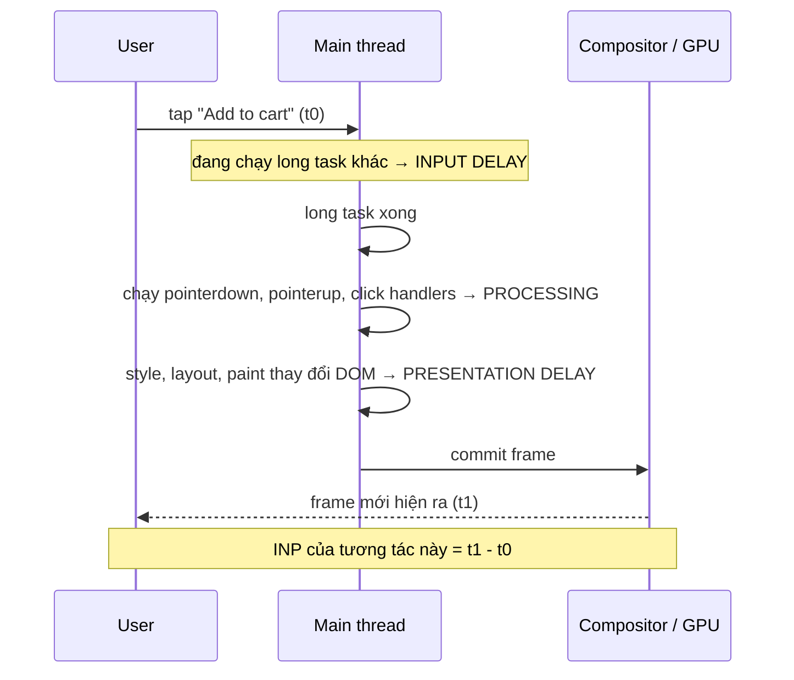
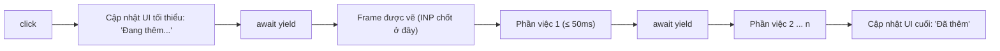

## Bối cảnh & vấn đề

Người dùng bấm "Thêm vào giỏ". Không có gì xảy ra. Họ bấm lần nữa. Nửa giây sau, giỏ hàng nhảy lên 2 sản phẩm. Trên dashboard RUM, tương tác này có **INP 450 ms**. Code handler trông ngắn: cập nhật state, tính lại tổng tiền, gửi analytics. Nhưng trên điện thoại tầm trung, ba việc đó cộng với việc React render lại cả trang đã giữ **main thread** gần nửa giây, và trong suốt thời gian đó trình duyệt không thể vẽ frame nào, kể cả cái spinner "Đang thêm...".

Main thread của trình duyệt là **một luồng duy nhất** chạy JS, tính style, layout, paint cho trang. Mọi thứ phải xếp hàng. **INP (Interaction to Next Paint)** đo đúng điều người dùng cảm nhận: từ lúc họ chạm tới lúc màn hình **có phản hồi đầu tiên**. Bài này giải thích INP chia làm ba phase, nguyên nhân của mỗi phase, và kỹ thuật cốt lõi để sửa: **chia nhỏ việc và nhường (yield) main thread**, cùng với khi nào nên đưa việc ra khỏi main thread hẳn (Web Worker). Phần React (memo, transition, virtualization) ở [bài React runtime performance](/tracks/browser-web-perf/learn/react-runtime-perf).

**Interview angle:** "INP gồm những phần nào, mỗi phần do đâu?" và "vì sao `setTimeout(0)` không phải cách yield tốt?" là hai câu phân biệt người đã thật sự debug INP.

## Khái niệm

### INP đo gì

Với mỗi **tương tác** (click, tap, nhấn phím; **không** tính scroll và hover), trình duyệt đo từ **lúc input xảy ra** tới **lúc frame kế tiếp được vẽ** sau khi mọi event handler của tương tác đó chạy xong. Một tương tác có thể gồm nhiều event (`pointerdown`, `pointerup`, `click`); độ trễ của tương tác là event dài nhất trong nhóm. INP của trang là tương tác **tệ nhất** trong phiên, trừ outlier khi có nhiều tương tác. Good ≤ 200 ms, poor > 500 ms (chi tiết ở [bài Core Web Vitals](/tracks/browser-web-perf/learn/core-web-vitals)).

Chú ý chữ "next paint": INP **không** đo tới khi công việc xong, mà tới khi **frame tiếp theo** hiện ra. Hiện "Đang thêm..." sau 30 ms rồi làm phần nặng sau đó là INP 30 ms, dù tổng công việc vẫn là 400 ms.

### Ba phase của một tương tác

1. **Input delay**: từ lúc input xảy ra tới lúc handler **bắt đầu chạy**. Lớn khi main thread đang bận việc khác: một long task từ hydration, một script third-party, một `JSON.parse` lớn, một timer.
2. **Processing duration**: thời gian **chạy các event handler** (và mọi thứ đồng bộ trong đó: setState, render đồng bộ, tính toán).
3. **Presentation delay**: từ khi handler xong tới khi frame được vẽ: style, layout, paint cho những thay đổi DOM vừa làm, cộng với các `requestAnimationFrame` callback. Lớn khi DOM khổng lồ hoặc thay đổi gây layout lớn.

Ví dụ đo thật ở phần dưới: handler chạy 350 ms → processing 358 ms. Handler rẻ nhưng rơi vào giữa một long task 300 ms → input delay 241 ms.

### Long task và TBT

**Long task** là task chiếm main thread **hơn 50 ms**. Con số 50 ms đến từ mô hình RAIL: để phản hồi trong 100 ms, việc đang chạy khi input tới phải xong trong khoảng 50 ms. **TBT (Total Blocking Time)** trong lab là tổng phần vượt 50 ms của mọi long task (task 120 ms đóng góp 70 ms), dùng làm proxy cho INP vì lab không có người tương tác.

**Long Animation Frames (LoAF)** là API mới hơn (Chrome 123+) đo theo **frame** thay vì task: một frame bị trễ quá 50 ms được báo kèm danh sách **script nào** (URL, hàm, thời gian) đã chạy trong đó. `web-vitals` attribution dùng LoAF để chỉ ra script gây INP tệ, kể cả script third-party (verify).

### Yield: nhường main thread

**Yield** là tạm dừng công việc của mình để trình duyệt có cơ hội xử lý input và vẽ frame, rồi tiếp tục. JS không có "preemption": một hàm chạy thì chạy tới hết, trình duyệt không cắt ngang được. Cách duy nhất để main thread rảnh giữa chừng là **kết thúc task hiện tại** và hẹn chạy phần còn lại ở một task sau, thường viết bằng `await`.

### setTimeout(0) và nhược điểm

Cách yield cổ điển: `await new Promise((r) => setTimeout(r, 0))`. Nó có hai nhược điểm:

- Phần tiếp theo của bạn (continuation) được xếp **cuối hàng đợi task**. Mọi task khác đã xếp hàng (script third-party, timer của thư viện) được chạy trước, nên công việc quan trọng của bạn bị trễ không kiểm soát được.
- HTML Standard quy định timer lồng nhau từ cấp thứ 5 trở đi bị **kẹp tối thiểu 4 ms**. Chia việc thành 200 phần bằng `setTimeout` lồng nhau lãng phí khoảng 800 ms chỉ để chờ.

### scheduler.yield()

**`scheduler.yield()`** (Prioritized Task Scheduling API) trả một Promise. Continuation sau `await scheduler.yield()` được xếp vào **đầu hàng đợi** với ưu tiên của task đang chạy, nên nó chạy **trước** các task khác đã xếp hàng, nhưng vẫn **sau** input và rendering đang chờ. Nói cách khác: nhường cho người dùng, không nhường cho người khác. Theo MDN BCD, có ở Chrome 129+ và Firefox 142+, Safari chưa hỗ trợ (verify), nên cần fallback về `setTimeout`.

Các API liên quan: **`requestIdleCallback`** chạy việc không gấp khi trình duyệt rảnh (analytics, prefetch); **`scheduler.postTask()`** xếp task với ưu tiên `user-blocking`/`user-visible`/`background`; **`navigator.scheduling.isInputPending()`** (chỉ Chromium) từng được dùng để hỏi "có input đang chờ không", nay được khuyên thay bằng yield định kỳ.

### Web Worker

**Web Worker** chạy JS trên **luồng riêng**, không có DOM, giao tiếp với trang qua `postMessage` (dữ liệu được copy bằng structured clone, hoặc chuyển quyền sở hữu bằng Transferable như `ArrayBuffer`). Việc tính toán nặng thật sự (parse CSV 50 MB, lọc 1 triệu bản ghi, mã hoá, xử lý ảnh) chuyển sang worker thì main thread hoàn toàn rảnh. Cái giá: chi phí copy dữ liệu qua lại, không truy cập DOM, code phức tạp hơn (Comlink giúp gọi worker như hàm async).

**Interview angle:** "khi nào dùng worker thay vì chia nhỏ?" Khi việc nặng **không cần DOM**, tổng thời gian lớn (hàng trăm ms trở lên) và dữ liệu vào/ra không quá lớn để copy. Chia nhỏ vẫn chiếm main thread, chỉ là chia sẻ nó công bằng hơn.

## Cơ chế hoạt động

Sơ đồ một tương tác đi qua main thread:



Mỗi phase có "thủ phạm" riêng và cách sửa riêng, nên attribution quan trọng hơn con số tổng. Input delay lớn: tìm **việc khác** đang chạy lúc đó (hydration, timer, third-party), chia nhỏ nó. Processing lớn: sửa **handler** (làm ít hơn, trì hoãn phần không cần cho frame kế tiếp). Presentation lớn: giảm **lượng DOM thay đổi** và kích thước DOM.

### Chia nhỏ một handler bằng yield



Nguyên tắc: **việc hiển thị trước, việc phụ sau**. Phản hồi thị giác (disable nút, spinner, số lượng giỏ hàng lạc quan) làm ngay trong handler, sau đó yield để trình duyệt vẽ. Phần tính toán, analytics, đồng bộ server chạy ở các task sau, mỗi task ngắn hơn 50 ms, xen kẽ yield để input mới vẫn được xử lý.

## Ví dụ thực tế

### Đo thật ba phase: blocking vs yielding vs input delay

Trang thử nghiệm có ba nút. `busy(ms)` là vòng lặp chiếm CPU mô phỏng công việc thật:

```ts
const busy = (ms: number) => { const end = performance.now() + ms; while (performance.now() < end); };
const status = document.getElementById('status')!;

// 1. Handler làm hết việc đồng bộ: 350 ms
document.getElementById('blocking')!.onclick = () => {
  status.textContent = 'Adding...';
  busy(250); // tính lại giỏ hàng
  busy(100); // analytics
  status.textContent = 'Added';
};

// 2. Cùng lượng việc, nhưng yield ngay sau khi cập nhật UI và giữa các phần
document.getElementById('yielding')!.onclick = async () => {
  status.textContent = 'Adding...';
  await scheduler.yield();                 // cho trình duyệt vẽ "Adding..."
  for (let i = 0; i < 7; i++) { busy(50); await scheduler.yield(); }
  status.textContent = 'Added';
};

// 3. Handler rẻ, nhưng click rơi vào giữa một long task 300 ms (vd hydration)
document.getElementById('cheap')!.onclick = () => { status.textContent = 'cheap'; };
```

Click thật bằng Puppeteer (CDP input events), INP đo bằng `onINP` của `web-vitals` 6.2.2 attribution, Chrome 154:

```text
blocking handler (350ms)           {"value":368,"inputDelay":5,"processing":358,"presentation":5}
yielding handler (7x50ms chunks)   {"value":8,"inputDelay":1,"processing":0,"presentation":7}
cheap click during 300ms long task {"value":248,"inputDelay":241,"processing":3,"presentation":4}
```

Handler 1: gần như toàn bộ là **processing**. Handler 2: cùng 350 ms công việc, nhưng INP chỉ 8 ms vì frame "Adding..." được vẽ ngay sau `await scheduler.yield()` đầu tiên; phần việc sau đó không còn tính vào INP của click này (nhưng nếu người dùng click tiếp trong lúc đó, click mới chỉ phải chờ tối đa một chunk 50 ms). Handler 3: handler rẻ (3 ms) nhưng INP 248 ms, gần hết là **input delay** vì main thread đang bận việc khác. Sửa trường hợp 3 bằng cách chia nhỏ **long task kia**, không phải sửa handler.

### Đo thật: setTimeout vs scheduler.yield

Xếp sẵn 3 task "của người khác" (mô phỏng third-party), rồi chạy một job 3 phần, yield giữa mỗi phần:

```ts
for (let i = 1; i <= 3; i++) setTimeout(() => out.push(`  other task ${i}`), 0);
await job('setTimeout-yield', () => new Promise((r) => setTimeout(r, 0)));

for (let i = 1; i <= 3; i++) setTimeout(() => out.push(`  other task ${i}`), 0);
await job('scheduler.yield', () => scheduler.yield());
```

Output thật (Chrome 154):

```text
setTimeout-yield chunk 1
  other task 1
  other task 2
  other task 3
setTimeout-yield chunk 2
setTimeout-yield chunk 3
---
scheduler.yield chunk 1
scheduler.yield chunk 2
scheduler.yield chunk 3
  other task 1
  other task 2
  other task 3
nested setTimeout(0) gaps ms: 0.0 0.0 0.0 0.0 0.0 4.7 4.5 4.5
```

Với `setTimeout`, cả ba task khác chen vào giữa chunk 1 và 2 của bạn. Với `scheduler.yield()`, job của bạn chạy liền mạch (vẫn nhường cho input và rendering nếu có), task khác chạy sau. Dòng cuối cho thấy clamp của HTML Standard: 5 lần lồng đầu gần 0 ms, từ lần thứ 6 trở đi mỗi lần khoảng 4,5 ms.

### Helper yield có fallback và deadline

```ts
function yieldToMain(): Promise<void> {
  const s = (globalThis as any).scheduler;
  if (s?.yield) return s.yield();                           // Chrome 129+, Firefox 142+
  return new Promise((resolve) => setTimeout(resolve, 0));  // fallback
}

// Chỉ yield khi đã chạy đủ lâu: tránh yield sau mỗi item (tốn overhead)
export async function processInChunks<T>(items: T[], fn: (t: T) => void, budgetMs = 40) {
  let deadline = performance.now() + budgetMs;
  for (const item of items) {
    fn(item);
    if (performance.now() >= deadline) {
      await yieldToMain();
      deadline = performance.now() + budgetMs;
    }
  }
}
```

### Khi đó là việc cho Web Worker

```ts
// search.worker.ts
self.onmessage = (e: MessageEvent<{ rows: string[]; q: string }>) => {
  const q = e.data.q.toLowerCase();
  const hits = e.data.rows.filter((r) => r.includes(q)).slice(0, 200);
  (self as unknown as Worker).postMessage(hits);
};

// main thread
const worker = new Worker(new URL('./search.worker.ts', import.meta.url), { type: 'module' });
worker.onmessage = (e) => renderResults(e.data);
input.addEventListener('input', () => worker.postMessage({ rows: searchIndex, q: input.value }));
```

Để tránh copy `searchIndex` mỗi phím, gửi nó **một lần** khi khởi tạo và chỉ gửi `q` sau đó. Với hàng chục nghìn bản ghi như danh sách giao dịch, thường **precompute key + virtualize** trên main thread là đủ (xem bài React), worker dành cho khối lượng lớn hơn nhiều.

## Trade-offs & lựa chọn thay thế

| Kỹ thuật | Main thread | Ưu | Nhược | Dùng khi |
|---|---|---|---|---|
| Làm ít hơn (precompute, cache, bỏ việc thừa) | Giảm tổng | Hiệu quả nhất | Cần hiểu code | Luôn là bước đầu |
| Cập nhật UI rồi yield | Chia sẻ | INP tốt ngay, đơn giản | Tổng việc không giảm | Handler có phần việc phụ |
| `setTimeout(0)` | Chia sẻ | Mọi trình duyệt | Bị task khác chen, clamp 4 ms | Fallback |
| `scheduler.yield()` | Chia sẻ | Giữ ưu tiên continuation | Chưa có Safari | Chia nhỏ việc quan trọng |
| `requestIdleCallback` / `postTask('background')` | Lúc rảnh | Không cạnh tranh input | Có thể trễ lâu | Analytics, prefetch, log |
| Debounce input | Giảm số lần | Rẻ | Trễ phản hồi cố ý | Search gọi API |
| Web Worker | Không dùng | Main thread rảnh hoàn toàn | Copy dữ liệu, không DOM | Tính toán nặng, dữ liệu lớn |
| Giảm DOM (virtualize, `content-visibility`) | Giảm presentation | Layout/paint rẻ | Phức tạp UI | Presentation delay lớn |

Cách chọn: đọc attribution trước. Input delay lớn → tìm và chia nhỏ **long task khác** (hydration, third-party, timer). Processing lớn → **làm ít hơn**, rồi "UI trước, yield, việc phụ sau". Presentation lớn → giảm DOM và thay đổi layout. Chỉ khi việc tính toán thuần tuý vẫn còn hàng trăm ms sau khi đã tối ưu, mới đưa sang worker.

## Edge cases & failure modes

- **Yield làm lộ trạng thái trung gian**: sau `await yield`, người dùng có thể click lần nữa hoặc state đã đổi. Handler phải idempotent hoặc disable nút, và kiểm tra lại điều kiện sau mỗi lần yield.
- **Yield quá dày**: yield sau mỗi item trong vòng 10.000 item thêm overhead lớn. Yield theo **deadline** (40–50 ms), không theo số item.
- **Hydration là long task lớn nhất**: SSR trang lớn, hydrate một lần 400 ms; click trong lúc đó có input delay lớn. React 18+ hydrate theo Suspense boundary và ưu tiên phần được tương tác (selective hydration), nhưng chỉ khi bạn chia boundary.
- **Third-party chiếm main thread**: tag manager, chat widget, A/B testing có long task riêng; LoAF attribution hiện URL script của chúng. Trì hoãn sau tương tác hoặc chạy trong worker (Partytown) (verify tính tương thích từng tag).
- **Presentation delay do DOM khổng lồ**: đổi một class trên container của 5.000 node tốn chục ms layout dù handler rẻ.
- **Worker và dữ liệu lớn**: `postMessage` một object 50 MB tốn structured clone trên cả hai luồng; dùng Transferable (`ArrayBuffer`) hoặc giữ dữ liệu ở worker.
- **Trình duyệt không có `scheduler.yield`**: fallback `setTimeout` vẫn đúng về chức năng, chỉ kém về thứ tự; đừng để thiếu API làm vỡ code (feature-detect).

## Pitfalls

- ❌ Làm mọi việc đồng bộ trong `onClick` rồi mới cập nhật UI → ✅ cập nhật UI (lạc quan) trước, yield, rồi làm việc phụ (đo thật: 368 ms → 8 ms).
- ❌ Chỉ tối ưu handler khi INP cao → ✅ xem attribution: input delay lớn nghĩa là thủ phạm là task khác (đo thật: handler 3 ms, INP 248 ms).
- ❌ `setTimeout(0)` lồng nhau cho hàng trăm chunk → ✅ `scheduler.yield()` có fallback, yield theo deadline.
- ❌ Gửi analytics đồng bộ trong handler → ✅ `requestIdleCallback`/sau yield, `sendBeacon`.
- ❌ Tin TBT = 0 trong Lighthouse nghĩa là INP tốt → ✅ TBT đo lúc load, không có tương tác thật; đo INP bằng RUM.
- ❌ Đưa mọi thứ vào Web Worker → ✅ worker cho tính toán nặng không cần DOM; phần lớn INP tệ là do render/DOM, worker không giúp.

## Tóm tắt

- INP = từ input tới frame kế tiếp, lấy tương tác gần tệ nhất trong phiên; click/tap/phím, không scroll/hover. Good ≤ 200 ms.
- Ba phase: input delay (main thread bận việc khác), processing (handler), presentation delay (style/layout/paint).
- Long task > 50 ms; TBT là proxy lab; LoAF cho biết script nào gây frame dài.
- Yield = kết thúc task, hẹn phần còn lại; "UI trước, yield, việc phụ sau" (đo thật 368 ms → 8 ms).
- `setTimeout(0)`: continuation xếp cuối hàng, bị task khác chen, clamp 4 ms từ cấp lồng thứ 5 (đo thật). `scheduler.yield()`: continuation được ưu tiên, Chrome 129+/Firefox 142+.
- `requestIdleCallback`/`postTask('background')` cho việc không gấp; Web Worker cho tính toán nặng không cần DOM.
- Luôn xem attribution trước khi sửa: sai phase là sửa sai chỗ.
