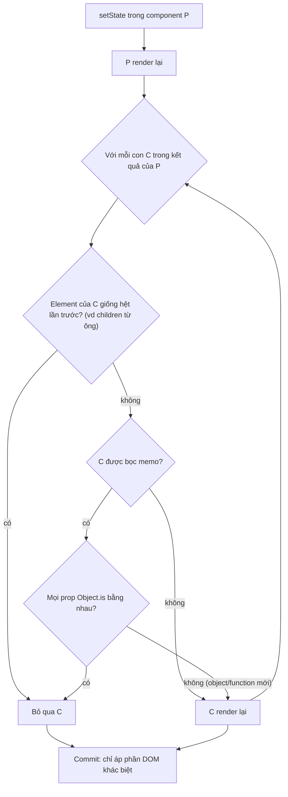
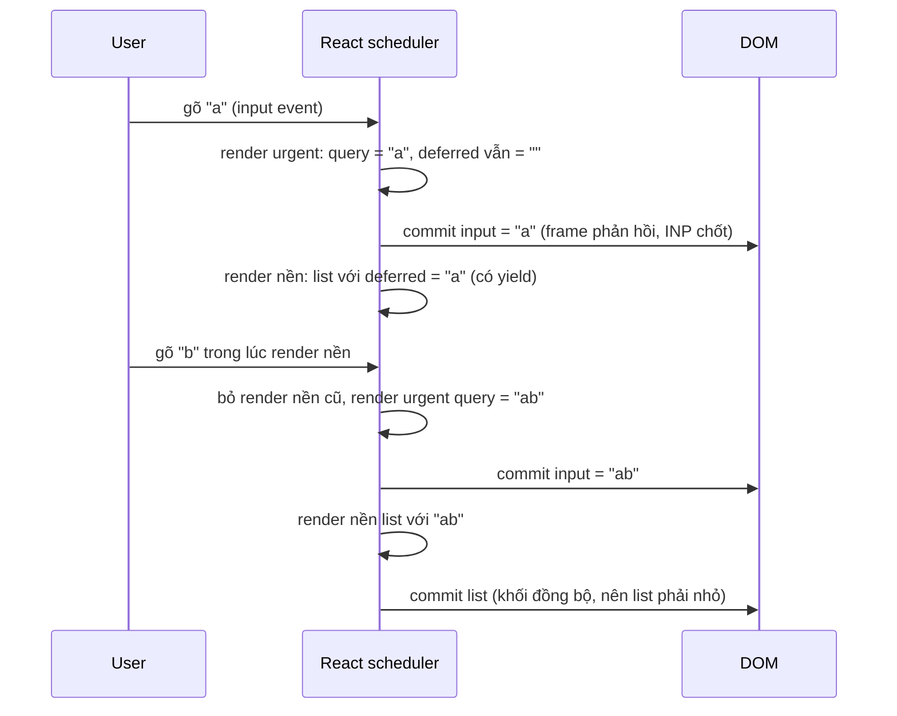

## Bối cảnh & vấn đề

Màn hình tìm giao dịch của một app ngân hàng: 10.000 giao dịch, một ô tìm kiếm. Trên laptop, gõ phím thấy mượt. Trên điện thoại Android tầm trung, mỗi phím gõ đứng hình nửa giây, INP ở RUM khoảng 600 ms. Code review trước đó đã "tối ưu" bằng cách bọc `useCallback` quanh mọi handler và `React.memo` quanh mọi component, nhưng không đổi gì.

Vấn đề không nằm ở thiếu memo. Mỗi phím gõ, component lọc 10.000 bản ghi bằng `JSON.stringify`, sort lại, rồi **render vài nghìn row** vào DOM. Đo trong Chrome với CPU chậm 4 lần: chỉ riêng việc tạo và layout 10.000 row đã tốn **878 ms**, 2.000 row tốn 200 ms, 20 row tốn 3 ms. Memo không làm số row ít đi.

Bài này đi qua mô hình render của React, khi nào memoization thật sự có ích và khi nào nó chỉ là tiếng ồn, các công cụ có tác động lớn hơn (tách state, `useDeferredValue`, virtualization), và một vấn đề runtime khác của SPA chạy lâu: **memory leak**. Nền về main thread và INP ở [bài INP](/tracks/browser-web-perf/learn/inp-long-tasks).

**Interview angle:** interviewer hỏi "useMemo/useCallback khi nào có ích" để xem bạn có hiểu **identity** và **chi phí render thật**, hay chỉ học thuộc "memo cho nhanh".

## Khái niệm

### Render và commit

Trong React, **render** là gọi component function để tính ra cây React element mới; **commit** là áp phần khác biệt vào DOM thật. Render xảy ra khi state của component đổi, khi **cha render lại** (mặc định mọi con đều render lại, bất kể props đổi hay không), hoặc khi context mà nó dùng đổi. Render tốn CPU (chạy function, tạo object, so sánh), còn commit tốn DOM (và kéo theo style/layout/paint).

Render lại không có nghĩa là DOM đổi: nếu kết quả giống cũ, commit không làm gì. Vì vậy re-render "thừa" chỉ là vấn đề khi **component đó đắt** hoặc **số lượng lớn**.

### React.memo

**`React.memo(Component)`** bỏ qua render khi mọi prop **bằng nhau theo `Object.is`** so với lần trước. Nó chỉ có ích khi prop thật sự ổn định. Một prop là object literal `{}` hay arrow function `() => {}` tạo mới ở mỗi render của cha luôn khác `Object.is`, nên memo so sánh xong rồi vẫn render: tốn thêm chi phí so sánh mà không được gì.

### useMemo và useCallback

**`useMemo(fn, deps)`** cache **kết quả** của `fn` tới khi `deps` đổi. **`useCallback(fn, deps)`** cache **chính function** (tương đương `useMemo(() => fn, deps)`). Chúng có hai mục đích khác nhau:

1. **Tránh tính lại việc đắt**: lọc/sort 10.000 phần tử, parse dữ liệu lớn.
2. **Giữ identity ổn định**: để prop truyền vào component đã `memo` không đổi, hoặc để dependency của `useEffect` không đổi mỗi render.

`useCallback` **một mình** gần như vô dụng: component con không `memo` vẫn render lại dù function ổn định. Chi phí của hook: lưu deps, so sánh mỗi render, giữ bộ nhớ, và rủi ro deps sai dẫn tới dữ liệu **stale** (dùng giá trị cũ).

### Tách state: move state down và children

Cách rẻ nhất để tránh re-render là **không để state ở chỗ quá cao**. Nếu chỉ ô input cần `query`, đưa state vào một component `SearchBox` riêng: gõ phím chỉ render `SearchBox`, component anh em (list nặng) không bị ảnh hưởng. Tương tự, component có state có thể nhận phần nặng qua **`children`**: `children` là element được tạo ở cha, nên khi state của wrapper đổi, `children` vẫn là cùng một object và React bỏ qua nó.

### useDeferredValue và startTransition

**`startTransition(() => setState(...))`** đánh dấu một update là **không khẩn cấp**. **`useDeferredValue(value)`** trả về một phiên bản "đi sau" của `value`. Cả hai dùng **concurrent rendering**: React render phần không khẩn cấp ở nền, **có thể ngắt** để xử lý input mới, và bỏ kết quả cũ nếu có giá trị mới hơn. Kết quả: ô input cập nhật ngay (urgent), list lọc cập nhật sau khi rảnh.

Nó không giảm tổng công việc. Nó giúp INP vì **frame phản hồi input** (ký tự mới trong ô) không phải chờ render list, và render list được chia thành các đơn vị nhỏ có yield giữa chừng. Nhưng phần **commit** vào DOM (tạo 5.000 node) vẫn là một khối đồng bộ không ngắt được. Vì vậy phải kết hợp với việc giảm số node.

### Virtualization

**Virtualization** (windowing) chỉ render các row **đang nhìn thấy** cộng một ít đệm (overscan), thay vì toàn bộ list. 10.000 giao dịch trên màn hình cao 800 px, row 56 px, chỉ cần khoảng 15 row + đệm, tức khoảng 30 node thay vì 10.000. Thư viện: TanStack Virtual, react-window, react-virtuoso. Cái giá: chiều cao row phải biết hoặc đo được, find-in-page (Ctrl+F) không thấy row ngoài màn hình, và accessibility cần chú ý (`aria-rowcount`, focus khi cuộn).

### React Compiler

**React Compiler** là công cụ build (Babel plugin) tự động chèn memoization ở cấp component và giá trị, dựa trên phân tích code tuân thủ Rules of React. Bản 1.0 được công bố stable vào cuối 2025 (verify). Với compiler, phần lớn `useMemo`/`useCallback`/`memo` viết tay trở nên thừa; bạn vẫn cần hiểu mô hình render để biết khi nào vấn đề là **lượng việc** chứ không phải re-render.

### Memory leak trong SPA

**Memory leak** trong SPA là khi object không còn cần nhưng vẫn còn **được tham chiếu** từ một gốc sống (global, `window` listener, timer, cache module), nên garbage collector không thu hồi được. Một tab dashboard mở 8 tiếng, mỗi lần mở/đóng modal rò 1 MB, sau vài trăm lần sẽ chậm dần (GC chạy nhiều hơn, mỗi lần lâu hơn) rồi crash.

**Detached DOM** là node đã bị gỡ khỏi document nhưng vẫn bị JS giữ. Thường do một closure trong event listener đăng ký trên `window` tham chiếu tới element của component đã unmount, kéo theo cả subtree và mọi state mà closure chạm tới.

**Interview angle:** "vì sao một closure trong listener giữ sống cả subtree React?" Vì listener trên `window` là gốc sống; closure giữ biến trong scope (element, state, props); element giữ cha của nó; nên cả cây không thu hồi được tới khi listener bị gỡ.

## Cơ chế hoạt động

Khi một state đổi, React quyết định component nào render lại như sau:



Sơ đồ cho thấy ba "lối thoát" khỏi re-render: element giống hệt (tách state xuống, hoặc truyền qua `children`), `memo` với prop ổn định, hoặc không để state thay đổi ở chỗ cao. `memo` chỉ là một trong ba, và chỉ hoạt động nếu **mọi** prop ổn định: một inline function là đủ phá hỏng.

Với update không khẩn cấp, `useDeferredValue` tách một phím gõ thành hai lượt render:



## Ví dụ thực tế

### Đếm render thật: memo, useCallback, move state down

```ts
function ListPlain({ items, onSelect }) { count('ListPlain'); /* ... */ }
const ListMemo  = memo(function ListMemo({ items, onSelect })  { count('ListMemo(inline fn)'); /* ... */ });
const ListMemo2 = memo(function ListMemo2({ items, onSelect }) { count('ListMemo(useCallback)'); /* ... */ });

function Page() {
  const [q, setQ] = useState('');
  const onSelectStable = useCallback((id: number) => console.log(id), []);
  return (
    <div>
      <input value={q} onChange={(e) => setQ(e.target.value)} />
      <ListPlain items={items} onSelect={(id) => console.log(id)} />
      <ListMemo  items={items} onSelect={(id) => console.log(id)} />
      <ListMemo2 items={items} onSelect={onSelectStable} />
    </div>
  );
}

// Move state down: input tự giữ state, list là anh em nên không bị ảnh hưởng
function SearchBox() { const [q, setQ] = useState(''); return <input value={q} onChange={(e) => setQ(e.target.value)} />; }
function Page2() { return <div><SearchBox /><ListStateDown /></div>; }
```

Chạy với React 19.3 + jsdom, mount rồi mô phỏng 5 lần gõ phím ở mỗi trang (output thật):

```text
renders after mount + 5 keystrokes: {
  ListPlain: 6,
  'ListMemo(inline fn)': 6,
  'ListMemo(useCallback)': 1,
  'List(state moved down)': 1
}
```

`memo` với inline function: 6 lần, **giống hệt** không memo. `memo` + `useCallback`: 1 lần (chỉ lúc mount). Và cách không dùng hook nào, đưa state xuống: cũng 1 lần.

### Sửa màn hình tìm giao dịch

Đo thành phần chi phí trước khi sửa. Lọc trong Node 24 (Apple Silicon, 10.000 giao dịch, output thật):

```text
per keystroke: stringify + filter + sort     median 3.36 ms
per keystroke: precomputed key, presorted    median 0.32 ms
matches: 220
```

Và render DOM trong Chrome 154 với CPU chậm 4 lần (output thật):

```text
10000 rows (4x CPU): 878 ms
2000 rows (4x CPU): 200 ms
20 rows (4x CPU): 3 ms
```

Trên máy nhanh, lọc chỉ 3 ms; trên điện thoại chậm hơn 10–20 lần nó thành vài chục ms. Nhưng **render row** mới là phần nặng. Bản sửa nhắm vào cả hai:

```tsx
import { memo, useDeferredValue, useMemo, useState } from 'react';
import { useVirtualizer } from '@tanstack/react-virtual';

type Tx = { id: string; date: string; amount: number; counterparty: string; note: string };

export function TransactionSearch({ transactions }: { transactions: Tx[] }) {
  const [q, setQ] = useState('');
  const deferredQ = useDeferredValue(q);               // input urgent, list deferred

  // Chỉ tính lại khi dữ liệu đổi, không phải mỗi phím
  const indexed = useMemo(
    () => [...transactions]
      .sort((a, b) => b.date.localeCompare(a.date))
      .map((t) => ({ t, key: `${t.counterparty} ${t.note} ${t.amount}`.toLowerCase() })),
    [transactions],
  );
  const filtered = useMemo(() => {
    const needle = deferredQ.trim().toLowerCase();
    return needle ? indexed.filter((x) => x.key.includes(needle)) : indexed;
  }, [indexed, deferredQ]);

  return (
    <>
      <input value={q} onChange={(e) => setQ(e.target.value)} aria-label="Tìm giao dịch" />
      <VirtualList rows={filtered} stale={q !== deferredQ} />
    </>
  );
}

const VirtualList = memo(function VirtualList({ rows, stale }: { rows: { t: Tx }[]; stale: boolean }) {
  const [el, setEl] = useState<HTMLDivElement | null>(null);
  const v = useVirtualizer({ count: rows.length, getScrollElement: () => el, estimateSize: () => 56, overscan: 8 });
  return (
    <div ref={setEl} style={{ height: 600, overflow: 'auto', opacity: stale ? 0.6 : 1 }}>
      <div style={{ height: v.getTotalSize(), position: 'relative' }}>
        {v.getVirtualItems().map((vi) => (
          <TxRow key={rows[vi.index].t.id} tx={rows[vi.index].t}
                 style={{ position: 'absolute', top: 0, transform: `translateY(${vi.start}px)`, height: vi.size }} />
        ))}
      </div>
    </div>
  );
});
```

Bốn thay đổi, theo thứ tự tác động: **virtualize** (10.000 node thành khoảng 30), **precompute** key và sort một lần, **`useDeferredValue`** để ô input không chờ list, `memo` cho `VirtualList` để render urgent (chỉ đổi `q`) không kéo theo list. Với dữ liệu lớn hơn nhiều (trăm nghìn bản ghi) hoặc tìm kiếm mờ, chuyển lọc sang Web Worker hoặc tìm phía server có debounce.

### Tìm memory leak: đo thật

Một "modal" đăng ký listener `resize` trên `window`, closure giữ element và một state lớn:

```ts
class ChartState { points = Array.from({ length: 100_000 }, (_, i) => i * 0.5); } // ~0,8 MB heap

function mountModal(leaky: boolean) {
  const el = document.createElement('div');
  el.innerHTML = '<canvas></canvas>'.repeat(3);
  document.getElementById('root')!.appendChild(el);
  const state = new ChartState();
  const onResize = () => { el.style.width = `${innerWidth}px`; state.points[0] = innerWidth; };
  window.addEventListener('resize', onResize);
  return () => { el.remove(); if (!leaky) window.removeEventListener('resize', onResize); };
}
```

Mở/đóng 50 lần, ép GC, đếm instance còn sống bằng `page.queryObjects()` (tương đương heap snapshot) trong Chrome 154 (output thật):

```text
leaky (no removeEventListener) | ChartState alive: 50 | detached div: 50 | JS heap used: 40.7 MB
fixed (cleanup on unmount)     | ChartState alive: 0 | detached div: 0 | JS heap used: 0.7 MB
```

Trong React, "cleanup on unmount" chính là hàm return của `useEffect`:

```tsx
useEffect(() => {
  const onResize = () => chart.resize();
  window.addEventListener('resize', onResize);
  const id = setInterval(refresh, 30_000);
  const unsub = store.subscribe(onChange);
  return () => {                   // thiếu dòng nào là rò dòng đó
    window.removeEventListener('resize', onResize);
    clearInterval(id);
    unsub();
    chart.destroy();               // thư viện chart/map thường giữ canvas, listener riêng
  };
}, [chart]);
```

Quy trình trong DevTools: lặp một hành động N lần (mở/đóng modal, đổi route), chụp **heap snapshot** trước và sau, chọn chế độ **Comparison**, sắp theo "# Delta", tìm constructor tăng tỉ lệ với N; lọc "Detached" để thấy DOM bị giữ; xem **Retainers** để biết ai đang giữ (thường là `listener` → `Window` hoặc một `Map` module).

## Trade-offs & lựa chọn thay thế

| Công cụ | Giải quyết | Chi phí | Khi nào dùng |
|---|---|---|---|
| Move state down / `children` | Re-render không cần thiết | Gần như không | Đầu tiên, luôn thử |
| `React.memo` + prop ổn định | Re-render component đắt | So sánh prop, dễ bị phá bởi inline prop | Component đắt, cha render thường xuyên |
| `useMemo` | Tính lại việc đắt | Bộ nhớ, deps sai → stale | Lọc/sort/parse lớn, giá trị dùng làm prop/deps |
| `useCallback` | Identity của function | Như trên | Chỉ khi truyền vào component `memo` hoặc deps |
| `useDeferredValue` / `startTransition` | Input chờ render nặng | Hiển thị dữ liệu cũ tạm thời | Filter/search/tab nặng |
| Virtualization | Quá nhiều DOM node | Phức tạp, a11y, find-in-page | List/table hàng trăm row trở lên |
| Web Worker | Tính toán nặng | Copy dữ liệu, không DOM | Hàng trăm ms tính toán thuần |
| React Compiler | Memo tự động | Phải tuân Rules of React, build step | Codebase mới hoặc dọn dẹp dần |

Chọn theo thứ tự: **đo bằng React Profiler** (flamegraph, "why did this render") và Performance panel trước. Nếu vấn đề là re-render lan rộng, tách state trước khi memo. Nếu vấn đề là **lượng DOM**, virtualize, vì không memo nào giảm được số node. Nếu vấn đề là input bị trễ bởi render, dùng `useDeferredValue`. `useMemo`/`useCallback` là công cụ nhắm đích, không phải mặc định.

## Edge cases & failure modes

- **Context value mới mỗi render**: `<Ctx.Provider value={{ user, setUser }}>` tạo object mới mỗi lần provider render, mọi consumer render lại. `useMemo` cho value, hoặc tách context theo tần suất đổi.
- **memo với children**: `<Card>{content}</Card>` với `Card` là `memo`: `children` là element mới mỗi render nên memo luôn thua.
- **Deps sai**: `useCallback(() => submit(form), [])` giữ `form` của lần render đầu, gửi dữ liệu cũ. ESLint `react-hooks/exhaustive-deps` bắt được.
- **`useDeferredValue` với list không virtualize**: render nền vẫn phải commit hàng nghìn node trong một khối, frame đó vẫn dài; INP của phím tiếp theo có thể rơi vào đúng lúc commit.
- **Virtualization và chiều cao động**: row cao khác nhau cần đo (`measureElement`), cuộn có thể giật khi ước lượng sai.
- **Leak qua cache module**: `const cache = new Map()` ở module scope, key theo id, không bao giờ xoá → tăng mãi. Dùng LRU có giới hạn hoặc `WeakMap` khi key là object.
- **StrictMode dev**: React chạy effect hai lần trong dev để lộ thiếu cleanup; đừng tắt StrictMode để "sửa" lỗi này.
- **Leak chỉ thấy trên production**: DevTools extension và HMR giữ tham chiếu trong dev; kiểm chứng leak trên build production.

## Pitfalls

- ❌ Bọc `useCallback` mọi handler "cho nhanh" → ✅ chỉ khi truyền vào component `memo` hoặc làm deps; nếu không, nó chỉ thêm chi phí (đo thật: memo + inline fn = 6 render, như không memo).
- ❌ `React.memo` mọi component → ✅ memo component đắt với prop ổn định; ưu tiên tách state.
- ❌ Render 10.000 row rồi tìm cách memo từng row → ✅ virtualize (đo thật: 878 ms vs 3 ms ở CPU 4x).
- ❌ Lọc bằng `JSON.stringify(t)` mỗi phím → ✅ precompute search key khi dữ liệu đổi.
- ❌ `useEffect` đăng ký listener/timer/subscription không return cleanup → ✅ luôn cleanup; `chart.destroy()` cho thư viện bên thứ ba.
- ❌ Tối ưu không đo → ✅ React Profiler + Performance panel, đo lại sau sửa, kể cả trường hợp "memo không giúp" để rút kinh nghiệm.

## Tóm tắt

- Cha render → mọi con render, trừ khi element giống hệt (state tách xuống, `children`) hoặc con `memo` với mọi prop `Object.is` bằng nhau.
- `memo` bị phá bởi inline object/function; `useCallback` chỉ có ý nghĩa đi cùng `memo` hoặc deps (đo thật: 6 vs 1 render).
- Move state down và `children` tránh re-render mà không cần hook.
- `useDeferredValue`/`startTransition`: input urgent, list nền có thể ngắt; không giảm tổng việc, commit vẫn đồng bộ.
- Lượng DOM là chi phí lớn nhất với list: virtualize (10.000 row: 878 ms; 20 row: 3 ms, CPU 4x).
- React Compiler tự memo hoá; vẫn phải đo bằng Profiler.
- Memory leak: listener/timer/subscription không cleanup giữ closure và detached DOM (đo thật: 50 instance, 40 MB); tìm bằng heap snapshot Comparison + Retainers.
