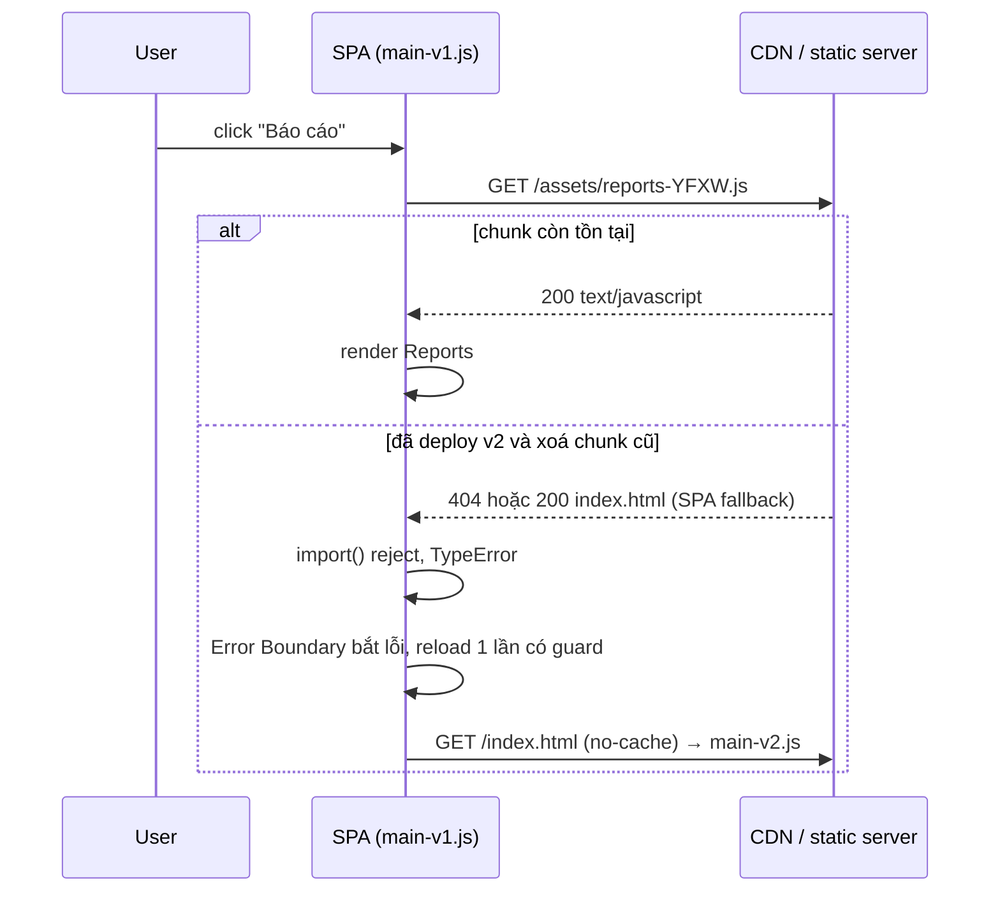
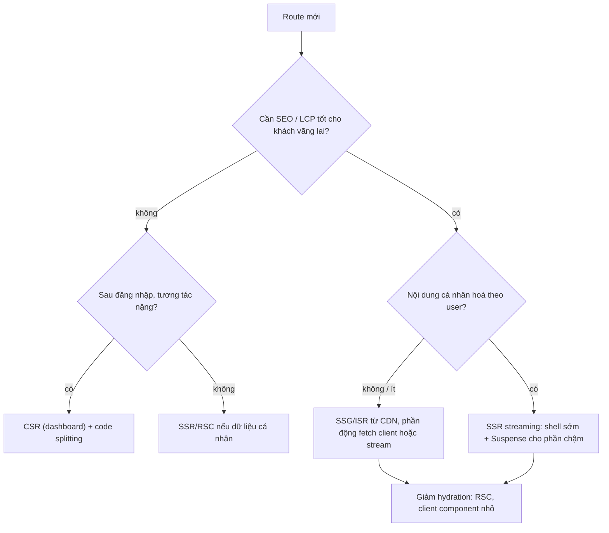

## Bối cảnh & vấn đề

Một SPA ngân hàng có bundle `main.js` 1,8 MB (gần 600 KB gzip). Màn hình đăng nhập chỉ cần một form, nhưng người dùng phải tải, parse và chạy cả thư viện chart của trang báo cáo, trình xem PDF sao kê, toàn bộ bản dịch 3 ngôn ngữ và `moment` kèm mọi locale. Trên điện thoại tầm trung, riêng parse + compile + execute JS mất hơn 2 giây sau khi tải xong, và trong thời gian đó nút "Đăng nhập" không phản hồi.

Byte JS **đắt hơn** byte ảnh cùng kích thước: ảnh chỉ cần decode (thường ngoài main thread), còn JS phải **parse, compile và execute** trên main thread. **Code splitting** chia bundle thành nhiều **chunk** và chỉ tải phần cần cho màn hình hiện tại. Nhưng splitting mang theo vấn đề mới: waterfall khi chuyển route, và lỗi **`ChunkLoadError`** khi deploy xoá chunk cũ mà tab đang mở vẫn cần.

Bài này đi từ cách bundler tạo chunk, cách split trong React, cách tìm vì sao bundle to, tới câu hỏi rộng hơn: chọn CSR, SSR, SSG/ISR hay streaming để bớt JS ngay từ kiến trúc. HTTP cache cho chunk ở [bài HTTP caching](/tracks/browser-web-perf/learn/http-caching-bfcache).

**Interview angle:** câu CV "bạn đã split thế nào và đo ra sao?" đòi số trước/sau và phương pháp đo; câu debug "blank page sau deploy" đòi hiểu cả cache header lẫn cách deploy.

## Khái niệm

### Chi phí của JavaScript

Một file JS đi qua bốn chi phí: **tải** (mạng), **parse** (đọc thành AST), **compile** (V8 tạo bytecode, lazy compile nhiều hàm), **execute** (chạy top-level code, khởi tạo module, render). Ba bước sau nằm trên main thread và tỉ lệ với **kích thước sau giải nén**, không phải kích thước gzip. Điện thoại tầm trung có thể chậm hơn laptop 4–6 lần ở các bước này. Vì vậy mục tiêu không chỉ là "tải nhanh" mà là "**gửi ít JS hơn**".

### Chunk, dynamic import và hash

**`import('./reports.js')`** (dynamic import) là ranh giới split: bundler tách module đó và các dependency riêng của nó thành một chunk, tải khi lời gọi `import()` chạy lần đầu. Module dùng chung giữa nhiều chunk được tách thành **shared chunk** để không trùng lặp. Mỗi file output mang **content hash** trong tên (`reports-YFXWWL2L.js`): nội dung đổi thì tên đổi, cho phép cache vĩnh viễn (`immutable`).

Hệ quả quan trọng: file entry (`main-*.js`) **chứa tên** các chunk nó import, nên khi `reports` đổi, hash của `main` cũng đổi. `index.html` trỏ tới `main` → `index.html` phải luôn mới nhất.

### Route-level và component-level splitting

- **Route-level**: mỗi route một chunk. Hiệu quả lớn nhất với ít công sức, vì người dùng chỉ ở một route tại một thời điểm. React Router + `lazy()`, Next.js App Router tự split theo route.
- **Component-level**: tách component nặng ít dùng: chart, rich text editor, bản đồ, trình xem PDF, modal hiếm mở. Next.js dùng `next/dynamic`.
- **Library-on-interaction**: import thư viện ngay khi người dùng cần (`const { jsPDF } = await import('jspdf')` trong handler "Xuất PDF").

### React.lazy, Suspense và Error Boundary

**`lazy(() => import('./Page'))`** tạo component tải chunk ở lần render đầu. Trong lúc tải, component "suspend" và `<Suspense fallback>` gần nhất hiển thị fallback. Nếu `import()` **reject** (mạng lỗi, chunk 404), lỗi được ném ra khi render, và chỉ **Error Boundary** bắt được. Thiếu Error Boundary, cả cây bị unmount: màn hình trắng.

### Waterfall

**Waterfall** là chuỗi request phải đợi nhau: tải chunk route → render → route lại lazy-load component con → render → component con mới fetch data. Mỗi mũi tên là một round-trip. Tránh bằng cách: không lazy-load component **luôn** cần ngay trong route chunk; tải data **song song** với chunk (router loader, React Query `prefetchQuery` khi điều hướng bắt đầu); **prefetch** chunk khi hover/focus link hoặc khi idle.

### ChunkLoadError sau deploy

Người dùng mở app lúc 9:00 (HTML v1 trỏ `main-7FRZ...`, biết chunk `reports-YFXW...`). Lúc 10:00 bạn deploy v2 và **xoá** thư mục cũ. Lúc 10:05 người dùng bấm "Báo cáo": trình duyệt xin `reports-YFXW...` đã không còn. Nếu server có **SPA fallback** (`try_files $uri /index.html`), request `.js` nhận về **HTML với status 200**, và lỗi trở nên khó hiểu: "Expected a JavaScript-or-Wasm module script but the server responded with a MIME type of text/html". webpack gọi là `ChunkLoadError`, Vite/ESM native là `Failed to fetch dynamically imported module`.

### Tree shaking và sideEffects

**Tree shaking** là loại bỏ export không được import, dựa trên cấu trúc **tĩnh** của ES module (`import`/`export`). Nó thất bại khi: thư viện chỉ có bản **CommonJS** (`require` động, không phân tích được); import cả namespace và dùng động (`lib[name]`); module có **side effect** ở top-level (sửa prototype, đăng ký global, import CSS) khiến bundler không dám bỏ. Trường **`"sideEffects": false`** trong `package.json` của thư viện (hoặc danh sách file có side effect) cho bundler phép bỏ cả module không dùng.

### Chiến lược rendering

- **CSR (client-side rendering)**: server gửi HTML rỗng + JS; mọi thứ render trên client. LCP phụ thuộc toàn bộ chuỗi tải JS → fetch data → render.
- **SSR (server-side rendering)**: server render HTML mỗi request; client **hydrate** (gắn event handler, dựng lại state) bằng cùng JS.
- **SSG / ISR**: HTML render lúc build (SSG) hoặc render lại định kỳ/khi revalidate (ISR), phục vụ từ CDN.
- **Streaming SSR**: gửi HTML thành nhiều phần; shell và phần nhanh gửi trước, phần chậm (trong `<Suspense>`) gửi sau.
- **React Server Components (RSC)**: component chỉ chạy trên server, **không gửi JS** của chúng xuống client; chỉ client component mới hydrate.

**Hydration** là chi phí ẩn của SSR: HTML hiện nhanh (LCP tốt) nhưng trang chưa tương tác được cho tới khi JS tải và hydrate xong, là nguồn input delay lớn (xem [bài INP](/tracks/browser-web-perf/learn/inp-long-tasks)).

## Cơ chế hoạt động

Luồng khi người dùng mở một route lazy lần đầu, và chỗ lỗi xảy ra sau deploy:



Nhánh lỗi cho thấy vì sao cần **cả hai phía**: hạ tầng (giữ chunk cũ, không SPA-fallback cho asset, `index.html` luôn revalidate) và client (Error Boundary + reload có kiểm soát). Chỉ sửa một phía thì lỗi vẫn xảy ra ở một nhóm người dùng.

Quyết định rendering theo từng route:



## Ví dụ thực tế

### Chunk thật do esbuild tạo

Ba module: `main.js` (hiển thị số dư, import `format.js`), `reports.js` (import `chart-lib.js` nặng khoảng 97 KB và `format.js`), được `main` gọi bằng `import()` khi bấm nút.

```ts
// src/main.js
import { formatMoney } from './format.js';
document.getElementById('balance').textContent = formatMoney(12500000);
document.getElementById('open').addEventListener('click', async () => {
  const { renderReports } = await import('./reports.js');
  renderReports(document.getElementById('out'));
});
```

```bash
npx esbuild src/main.js --bundle --splitting --format=esm --minify --outdir=dist/assets \
  --entry-names=[name]-[hash] --chunk-names=[name]-[hash]
npx esbuild src/main.js --bundle --format=esm --minify --outfile=nosplit.js
```

Output thật (esbuild 0.28.2, kích thước byte chưa nén):

```text
317 chunk-3L3VT5KG.js      ← format.js, dùng chung cho main và reports
415 main-7FRZVSFC.js       ← tải lúc đầu
97563 reports-YFXWWL2L.js  ← chỉ tải khi bấm "Báo cáo"
no splitting: 98244 nosplit.js
```

JS cần cho màn hình đầu giảm từ 98 KB xuống khoảng 0,7 KB (main + shared chunk). Sau khi sửa một dòng trong `chart-lib.js` và build lại, output mới là `main-KQPSMEZG.js`, `reports-AYSIBZA6.js`, còn `chunk-3L3VT5KG.js` **giữ nguyên hash**: shared chunk không đổi thì cache của người dùng vẫn dùng được, và `main` đổi hash vì nó chứa tên chunk `reports` mới.

### Tái hiện ChunkLoadError sau deploy

Mở app v1 trong Chrome, rồi "deploy" v2 kiểu `rm -rf /var/www/app/* && cp -r dist/*`, rồi bấm nút Báo cáo. Output thật (Chrome 154), hai cấu hình server:

```text
[spa-fallback (try_files ... /index.html)] TypeError: Failed to fetch dynamically imported module: http://localhost:8123/app/assets/reports-YFXWWL2L.js
   console: Failed to load module script: Expected a JavaScript-or-Wasm module script but the server responded with a MIME type of "text/html". Strict MIME type checking is enforced for module scripts per HTML spec.
[real 404 for /assets/] TypeError: Failed to fetch dynamically imported module: http://localhost:8123/app/assets/reports-YFXWWL2L.js
   console: Failed to load resource: the server responded with a status of 404 (Not Found)
```

Cùng một lỗi JS, nhưng với SPA fallback, console chỉ ra "MIME type text/html" làm người debug đi lạc sang cấu hình MIME. Với 404 thật, nguyên nhân rõ ngay.

Cấu hình nginx đúng:

```nginx
location /assets/ {
  # file hash: cache vĩnh viễn; thiếu file thì 404 thật, KHÔNG fallback index.html
  add_header Cache-Control "public, max-age=31536000, immutable";
  try_files $uri =404;
}
location / {
  add_header Cache-Control "no-cache";      # luôn revalidate để trỏ đúng main mới
  try_files $uri /index.html;
}
# deploy: upload asset mới TRƯỚC, đổi index.html SAU, giữ asset cũ vài ngày/vài bản
```

### Route-level splitting với retry và reload có guard

```tsx
import { lazy, Suspense, type ComponentType } from 'react';
import { ErrorBoundary } from 'react-error-boundary';

// Chunk lỗi: reload 1 lần để lấy index.html + main mới (deploy mới), có guard chống vòng lặp.
// Không retry cùng URL bằng import(): Chrome nhớ lỗi trong module map (xem output bên dưới).
function lazyWithReload<T extends ComponentType<any>>(load: () => Promise<{ default: T }>, key: string) {
  return lazy(async () => {
    try {
      return await load();
    } catch (err) {
      const flag = `chunk-reload:${key}`;
      if (!sessionStorage.getItem(flag)) {       // guard chống vòng lặp reload
        sessionStorage.setItem(flag, '1');
        location.reload();
        return new Promise<never>(() => {});     // chờ reload
      }
      throw err;                                  // đã reload rồi vẫn lỗi → Error Boundary
    }
  });
}

const Transfers = lazyWithReload(() => import('./routes/Transfers'), 'transfers');
export const prefetchTransfers = () => import('./routes/Transfers'); // gọi onMouseEnter/onFocus của link

export function TransfersRoute() {
  return (
    <ErrorBoundary fallbackRender={({ resetErrorBoundary }) => (
      <ChunkError onRetry={() => { sessionStorage.removeItem('chunk-reload:transfers'); resetErrorBoundary(); }} />
    )}>
      <Suspense fallback={<RouteSkeleton />}>
        <Transfers />
      </Suspense>
    </ErrorBoundary>
  );
}
```

Vì sao không "retry `import()` có backoff"? Thử thật trong Chrome 154: server trả 503 ở lần đầu và 200 ở các lần sau.

```text
/flaky.js -> TypeError: Failed to fetch dynamically imported module: http://localhost:8123/flaky.js
/flaky.js -> TypeError: Failed to fetch dynamically imported module: http://localhost:8123/flaky.js
/flaky.js?retry=1 -> ok 42
server hits: 2
```

Lần `import()` thứ hai cùng URL **không gửi request nào** (server chỉ thấy 2 hit: lần đầu và lần có `?retry=1`): lỗi fetch được lưu trong **module map** của trang, đúng như HTML Standard mô tả. Với ESM native (Vite, esbuild), retry chỉ có tác dụng khi đổi URL (query string) mà bundler thường không cho làm với import do nó sinh ra, nên cách thực tế là **reload có guard**. Runtime của webpack tự tải chunk bằng thẻ `<script>` và cho phép gọi lại sau lỗi, nên retry có backoff vẫn hữu ích ở đó (verify theo phiên bản bundler).

Với app ngân hàng, trước khi reload phải **lưu nháp form** an toàn (không lưu số tài khoản/OTP vào storage) hoặc hiển thị "Có phiên bản mới, lưu xong hãy tải lại" thay vì reload tự động giữa giao dịch. Vite phát sự kiện `vite:preloadError` trên `window` cho đúng tình huống này.

### Tìm vì sao bundle to

```bash
# Vite/Rollup
npx vite-bundle-visualizer            # treemap theo module
# webpack
npx webpack-bundle-analyzer dist/stats.json
# bất kỳ bundler nào có source map
npx source-map-explorer dist/assets/*.js
# Next.js 16 có analyzer tích hợp (Turbopack) hoặc @next/bundle-analyzer (verify)
```

Thủ phạm thường gặp và cách sửa:

| Thấy trong treemap | Nguyên nhân | Sửa |
|---|---|---|
| `moment` + `locale/*` | Import cả thư viện và mọi locale | `date-fns`/`dayjs`, hoặc `Intl.DateTimeFormat` |
| `lodash` nguyên khối | `import _ from 'lodash'` (CommonJS) | `lodash-es` + named import, hoặc code gốc |
| Icon pack 1 MB | Import barrel file | Import từng icon, plugin optimize imports |
| Hai bản `react` hoặc `date-fns` | Version conflict trong dependency | `npm dedupe`, `overrides`/`resolutions` |
| `core-js` lớn | Polyfill cho browser cũ không còn hỗ trợ | Cập nhật `browserslist` |
| JSON/translation lớn | Inline vào bundle | Tải theo locale bằng `import()` |
| Chart/editor/PDF trong main | Import tĩnh ở component dùng chung | `lazy`/`next/dynamic`, import khi tương tác |

Coverage tab của DevTools (Cmd+Shift+P → "Coverage") cho biết bao nhiêu phần trăm JS/CSS đã tải **không chạy** lúc load: con số 60–70% là tín hiệu rõ cho splitting.

## Trade-offs & lựa chọn thay thế

| Chiến lược split | Ưu | Nhược | Khi nào |
|---|---|---|---|
| Không split | Đơn giản, không waterfall | Bundle đầu to | App rất nhỏ |
| Theo route | Hiệu quả lớn, dễ | Độ trễ khi chuyển route | Mặc định cho SPA |
| Theo component nặng | Nhắm đúng phần đắt | Thêm loading state | Chart, editor, map, PDF |
| Split quá mịn | Initial rất nhỏ | Hàng trăm request, waterfall, overhead | Gần như không bao giờ |
| Prefetch khi hover/idle | Chuyển route gần tức thì | Tốn băng thông nếu đoán sai | Route hay đi tiếp |

| Rendering | LCP | INP / JS | Hạ tầng | Hợp với |
|---|---|---|---|---|
| CSR | Chậm (chờ JS + data) | JS nhiều, không hydration | Static hosting | Dashboard sau đăng nhập |
| SSR | Nhanh (HTML có sẵn) | Hydration toàn trang | Server mỗi request | Trang cá nhân hoá cần SEO |
| SSG/ISR | Nhanh nhất (CDN) | Hydration | Build/revalidate | PDP, danh mục, blog |
| Streaming SSR | Shell sớm, phần chậm sau | Hydration theo boundary | Server hỗ trợ stream | Trang có API chậm |
| RSC | Như SSR | Ít JS client nhất | Framework hỗ trợ (Next.js) | Trang nhiều nội dung tĩnh |

Chọn theo **từng route**, không phải cả app. Với storefront: trang chủ, danh mục, PDP dùng SSG/ISR (hoặc prerender với Cache Components) để HTML ra từ CDN, còn giá/tồn kho theo user tách thành phần động (stream hoặc fetch client). Checkout và tài khoản dùng SSR/RSC (dữ liệu cá nhân, không cache chung). Dashboard nội bộ dùng CSR với route splitting. Ở mọi lựa chọn có SSR, chi phí thật nằm ở **hydration**, nên giảm client component (RSC) và chia Suspense boundary để hydrate dần. Với multi-tenant, cache ở edge phải có cache key theo tenant/locale/currency, và tuyệt đối không cache HTML chứa dữ liệu cá nhân.

## Edge cases & failure modes

- **Deploy xoá chunk cũ**: tab mở lâu (app ngân hàng mở cả ngày) gọi chunk không còn. Giữ asset của vài bản deploy gần nhất (object storage theo hash, không `rm -rf`).
- **CDN cache `index.html`**: header đúng ở origin nhưng CDN có TTL mặc định 1 ngày; purge HTML khi deploy hoặc đặt TTL HTML ở CDN rất ngắn.
- **Reload vòng lặp**: reload khi gặp chunk error mà không guard, nếu lỗi do mạng (không phải deploy) thì trang reload liên tục. Guard bằng `sessionStorage` và giới hạn thời gian.
- **Service worker precache**: SW cache-first phục vụ `index.html` cũ trỏ chunk đã xoá → lỗi y hệt, kéo dài hơn (xem [bài service worker](/tracks/browser-web-perf/learn/service-worker-pwa)).
- **Shared chunk quá lớn**: bundler gom mọi thứ dùng chung vào một `vendor` khổng lồ, route nào cũng tải. Cấu hình `manualChunks`/`splitChunks` theo tần suất dùng.
- **Hydration mismatch**: HTML server khác kết quả render client (ngày giờ, `window`, random) → React render lại cả cây, mất lợi ích SSR và có thể gây CLS.
- **Bot/SEO với CSR**: crawler chạy JS được nhưng chậm và không đảm bảo; trang cần index không nên phụ thuộc CSR.

## Pitfalls

- ❌ "Lazy-load mọi component" → ✅ split theo route và vài component nặng; split quá mịn tạo waterfall và hàng trăm request.
- ❌ `lazy()` không có Error Boundary → ✅ Error Boundary quanh `Suspense`, reload có guard (retry cùng URL với ESM native vô ích: Chrome nhớ lỗi, đo thật).
- ❌ `try_files $uri /index.html` cho cả `/assets/` → ✅ 404 thật cho asset thiếu (đo thật: fallback biến lỗi thành "MIME type text/html").
- ❌ `rm -rf` thư mục cũ khi deploy → ✅ giữ asset cũ, upload asset trước, đổi HTML sau.
- ❌ Báo cáo "đã giảm bundle" không có số → ✅ số trước/sau: KB gzip của JS initial theo route, LCP/INP field p75, phương pháp đo.
- ❌ Chọn SSR cho cả app "vì SEO" → ✅ quyết định theo route; dashboard sau đăng nhập không cần SSR.
- ❌ Nghĩ SSR miễn phí → ✅ hydration vẫn tải và chạy JS; dùng RSC/giảm client component.

## Tóm tắt

- JS đắt vì parse/compile/execute trên main thread, tỉ lệ với kích thước chưa nén; mục tiêu là gửi ít JS hơn.
- `import()` là ranh giới chunk; tên file có content hash; module dùng chung thành shared chunk (esbuild thật: initial 98 KB → khoảng 0,7 KB).
- React: `lazy` + `Suspense` + **Error Boundary**; prefetch khi hover/idle; tải data song song để tránh waterfall.
- ChunkLoadError sau deploy: `index.html` phải `no-cache`, asset hash `immutable`, giữ chunk cũ, 404 thật cho asset, client reload có guard (retry `import()` cùng URL không gửi lại request ở ESM native).
- Tìm bundle to: analyzer/treemap, Coverage tab; thủ phạm: moment, lodash CJS, barrel icon, duplicate, polyfill, JSON lớn.
- Tree shaking cần ESM tĩnh và `sideEffects: false`; CommonJS và side effect top-level làm nó thất bại.
- Chọn rendering theo route: SSG/ISR cho trang công khai, streaming/RSC cho trang cá nhân hoá, CSR cho dashboard; hydration là chi phí ẩn.
