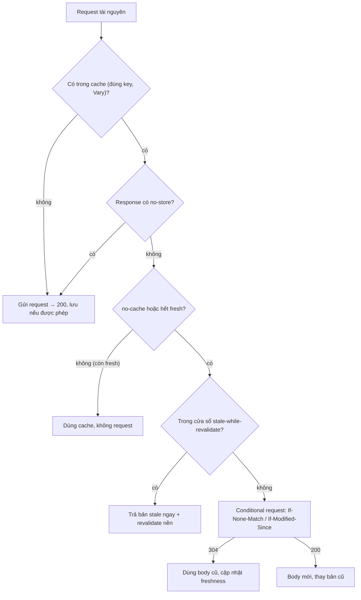
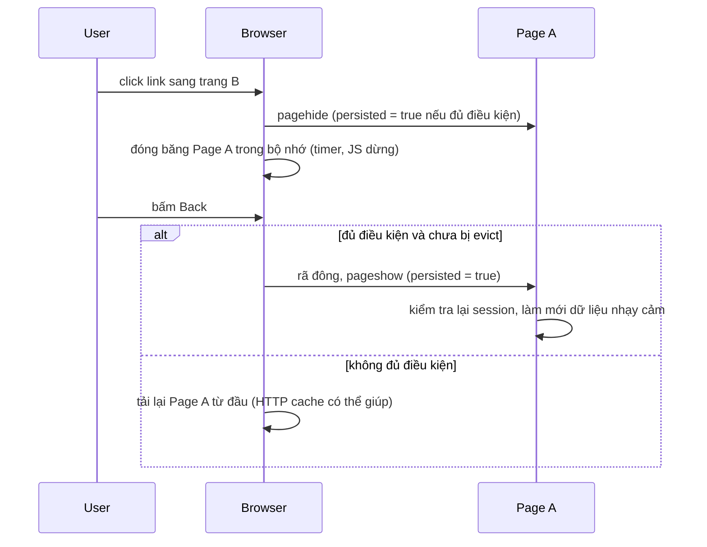

## Bối cảnh & vấn đề

Sau mỗi lần deploy, bộ phận hỗ trợ nhận vài chục ticket "trang trắng". Một nhóm khác than "sửa lỗi rồi mà tôi vẫn thấy lỗi cũ". Cùng lúc, trang sản phẩm tải lại toàn bộ 2 MB asset mỗi lần người dùng quay lại, vì ai đó đặt `no-cache` cho mọi thứ "để an toàn". Ba triệu chứng, một nguyên nhân: **header cache đặt theo cảm tính**.

HTTP cache là tối ưu hiệu năng rẻ nhất có thể: request không gửi đi thì không có độ trễ nào. Nhưng cache sai thì hoặc **mất lợi ích** (tải lại thứ không đổi), hoặc **phục vụ dữ liệu cũ/sai** (HTML cũ trỏ chunk đã xoá, dữ liệu cá nhân bị CDN cache chung). Bài này dạy mô hình freshness và validation của RFC 9111, ý nghĩa chính xác của từng directive hay bị nhầm, bộ header chuẩn cho một SPA, và một loại cache khác của trình duyệt ít người để ý nhưng ảnh hưởng lớn tới cả performance lẫn bảo mật: **back/forward cache (bfcache)**.

**Interview angle:** câu "`no-cache` nghĩa là gì?" là câu bẫy kinh điển. Câu thiết kế header cho SPA kiểm tra bạn có nối được cache header với cách deploy hay không.

## Khái niệm

### Private cache và shared cache

**Private cache** là cache của trình duyệt, phục vụ một người dùng. **Shared cache** là cache đứng giữa, phục vụ nhiều người: CDN, reverse proxy (Varnish, nginx), proxy doanh nghiệp. Sự phân biệt quan trọng vì response cá nhân (giỏ hàng, số dư) **không bao giờ** được nằm trong shared cache.

### Freshness

Một response đã lưu là **fresh** trong khoảng thời gian cho phép dùng lại **không cần hỏi server**. Tuổi tối đa lấy từ `Cache-Control: max-age=N` (giây), `s-maxage=N` (chỉ cho shared cache, ghi đè `max-age` ở đó), hoặc `Expires` (kiểu cũ). Nếu không có gì trong số đó nhưng có `Last-Modified`, cache được phép dùng **heuristic freshness** (RFC 9111 gợi ý khoảng 10% thời gian từ lần sửa cuối), nên "không đặt header" không có nghĩa là "không cache".

Ví dụ: `max-age=60` và response đã 45 giây tuổi → fresh, dùng luôn. 75 giây tuổi → **stale**, phải validate (hoặc dùng stale nếu có directive cho phép).

### Validation, ETag và 304

Khi response stale (hoặc bị bắt buộc validate), cache gửi **conditional request**: `If-None-Match: "<etag>"` (dùng **`ETag`**, một định danh phiên bản do server đặt) hoặc `If-Modified-Since: <date>` (dùng `Last-Modified`). Nếu tài nguyên không đổi, server trả **`304 Not Modified` không có body**; cache dùng lại body đã lưu và cập nhật thời gian freshness. Nếu đổi, server trả `200` với body mới.

304 tiết kiệm **băng thông và thời gian tải body**, nhưng **vẫn tốn một round-trip**. Trên mạng di động RTT 150 ms, 20 asset mỗi cái một 304 là rất nhiều thời gian chờ. Chỉ `max-age` (fresh) mới cho "không request nào".

ETag có hai loại: **strong** (`"abc"`, giống từng byte) và **weak** (`W/"abc"`, tương đương về ngữ nghĩa, ví dụ khác nhau chỉ do nén). ETag sinh từ inode/mtime của file khác nhau giữa các server sau load balancer làm validation liên tục thất bại (200 thay vì 304).

### Các directive hay bị hiểu nhầm

- **`no-cache`**: **được lưu**, nhưng **phải validate** với server trước **mỗi lần dùng**. Không phải "không cache". Kết hợp ETag, lần dùng lại chỉ tốn một 304.
- **`no-store`**: **không được lưu** ở bất kỳ cache nào. Dành cho dữ liệu nhạy cảm (số dư, sao kê).
- **`private`**: chỉ private cache (trình duyệt) được lưu; CDN/proxy không được. Dành cho response cá nhân hoá.
- **`public`**: shared cache được lưu, kể cả response có `Authorization` (mặc định là không).
- **`max-age=0`**: hết fresh ngay. Thực tế gần giống `no-cache`, khác ở chỗ RFC cho phép cache dùng response stale trong một số trường hợp (ví dụ mất kết nối tới origin) trừ khi có **`must-revalidate`**.
- **`immutable`**: "trong thời gian fresh, nội dung sẽ không bao giờ đổi", nên trình duyệt không cần revalidate kể cả khi người dùng bấm reload. Theo MDN BCD, Firefox và Safari hỗ trợ, Chrome không implement directive này nhưng từ lâu đã không revalidate subresource khi reload thường (verify).

### stale-while-revalidate

**`Cache-Control: max-age=60, stale-while-revalidate=600`**: trong 60 giây đầu response fresh. Từ giây 60 tới giây 660, cache được **trả ngay bản stale** và **revalidate ở nền**; request sau nhận bản mới. Sau 660 giây phải chờ network như thường. Định nghĩa ở RFC 5861. Theo MDN BCD, trình duyệt hỗ trợ từ Chrome 75, Firefox 68, Safari 14 (verify); phần lớn CDN lớn cũng hỗ trợ. Cùng ý tưởng ở tầng ứng dụng: SWR, TanStack Query, ISR của Next.js.

**`stale-if-error=N`** (cùng RFC) cho phép dùng bản stale khi origin lỗi 5xx; chủ yếu CDN/proxy dùng, trình duyệt gần như không (MDN BCD không có dữ liệu hỗ trợ trình duyệt) (verify).

### Vary

**`Vary: Accept-Encoding, Accept-Language`** nói với cache rằng response khác nhau theo các header request đó, nên cache key phải gồm chúng. Quên `Vary` khi server trả nội dung theo ngôn ngữ/thiết bị → CDN phục vụ bản tiếng Anh cho người Việt. `Vary: Cookie` hoặc `Vary: User-Agent` làm cache key gần như duy nhất cho mỗi người, tương đương không cache ở CDN.

### Back/forward cache (bfcache)

**bfcache** giữ **toàn bộ trang** (DOM, JS heap, trạng thái) trong bộ nhớ khi người dùng rời đi. Khi bấm Back/Forward, trang được **khôi phục tức thì**: không request, không parse, không chạy lại JS, LCP gần 0. Nó khác hẳn HTTP cache (lưu response). Trang khôi phục từ bfcache nhận sự kiện **`pageshow` với `event.persisted === true`**; khi vào bfcache nhận **`pagehide`** với `persisted === true`.

Những thứ thường làm trang **không đủ điều kiện**: listener **`unload`** (Chrome đang dần deprecate `unload`), kết nối đang mở (WebSocket, WebRTC), IndexedDB transaction dở, `window.opener` còn tham chiếu, và với `Cache-Control: no-store` thì hành vi đang đổi (xem phần Ví dụ). Chrome có API **`notRestoredReasons`** và panel DevTools **Application → Back/forward cache** để xem lý do.

**Interview angle:** "bfcache có phải vấn đề bảo mật với app ngân hàng không?" Có: trang số dư có thể được khôi phục sau khi người dùng đã đăng xuất ở tab khác. Cách xử lý là kiểm tra lại session ở `pageshow` persisted, không phải tắt bfcache cho mọi trang.

## Cơ chế hoạt động

Quyết định của cache trình duyệt cho một request:



Nhánh "còn fresh" là nhánh duy nhất không tốn network. Nhánh `no-cache` luôn đi qua validation, rẻ nhưng không miễn phí. Nhánh stale-while-revalidate đổi độ mới lấy tốc độ: người dùng lần này thấy bản cũ, lần sau thấy bản mới.

Với bfcache, luồng rời trang và quay lại:



## Ví dụ thực tế

### ETag và 304 bằng curl

Server trả `/data/config.js` với `Cache-Control: no-cache` và ETag là hash nội dung. Output thật:

```bash
curl -si http://localhost:8123/data/config.js
```

```text
HTTP/1.1 200 OK
cache-control: no-cache
etag: "70d47f861c"
```

```bash
curl -si -H 'If-None-Match: "70d47f861c"' http://localhost:8123/data/config.js
```

```text
HTTP/1.1 304 Not Modified
content-type: text/javascript
cache-control: no-cache
etag: "70d47f861c"
Date: Wed, 30 Sep 2026 03:02:44 GMT
Connection: keep-alive
Keep-Alive: timeout=5
```

### Trình duyệt thật: immutable vs no-cache

Trang có một CSS hash (`/assets/app.3f9a1c.css`, `public, max-age=31536000, immutable`) và một script không hash (`/data/config.js`, `no-cache` + ETag). Mở trang, rồi click link sang cùng trang. Output thật (Chrome 154 qua Puppeteer):

```text
200 (network)    /cache.html
200 (network)    /assets/app.3f9a1c.css
200 (network)    /data/config.js
200 (network)    /cache.html
200 (disk/memory cache) /assets/app.3f9a1c.css
304 (network)    /data/config.js
server saw: /cache.html | /data/config.js | /assets/app.3f9a1c.css | /cache.html?n=2 | /data/config.js [If-None-Match]
```

Lần hai: CSS hash lấy thẳng từ cache, **server không thấy request nào**. `config.js` gửi `If-None-Match` và nhận 304: không body, nhưng vẫn một round-trip.

### Bộ header cho SPA

```nginx
# 1. HTML: luôn revalidate để trỏ đúng bundle mới
location = /index.html { add_header Cache-Control "no-cache"; }

# 2. Asset có hash trong tên: cache vĩnh viễn, thiếu thì 404 thật
location /assets/ {
  add_header Cache-Control "public, max-age=31536000, immutable";
  try_files $uri =404;
}

# 3. Ảnh nội dung không hash (upload của CMS): cache vừa phải, làm mới ở nền
location /media/ { add_header Cache-Control "public, max-age=3600, stale-while-revalidate=86400"; }

# 4. SPA fallback cho route, KHÔNG cho asset
location / { add_header Cache-Control "no-cache"; try_files $uri /index.html; }
```

```ts
// 5. API: tuỳ dữ liệu
app.get('/api/products', (req, res) => {           // công khai, ít đổi: CDN cache ngắn
  res.set('Cache-Control', 'public, s-maxage=60, stale-while-revalidate=300');
  res.json(products);
});
app.get('/api/me/cart', (req, res) => {             // cá nhân: chỉ trình duyệt, luôn validate
  res.set('Cache-Control', 'private, no-cache');
  res.json(cart);
});
app.get('/api/accounts/:id/balance', (req, res) => { // nhạy cảm: không lưu ở đâu cả
  res.set('Cache-Control', 'no-store');
  res.json(balance);
});
```

Và quy trình deploy khớp với header: upload asset mới (tên hash mới) **trước**, đổi `index.html` **sau**, **giữ** asset cũ vài ngày hoặc vài bản deploy, purge `index.html` trên CDN. Đây là lời giải cho câu debug "blank page sau deploy" với cấu hình `max-age=86400` cho mọi thứ và deploy bằng `rm -rf`: HTML bị cache một ngày trỏ tới chunk đã bị xoá, còn `try_files` trả `index.html` 200 cho file `.js` không tồn tại (tái hiện thật ở [bài code splitting](/tracks/browser-web-perf/learn/code-splitting-bundles)).

### bfcache: đo cái gì chặn nó

Bốn trang giống nhau, chỉ khác một chi tiết. Mở trang, click sang trang khác, bấm Back, đọc `pageshow.persisted` và sự kiện CDP `Page.backForwardCacheNotUsed`. Output thật (Chrome 154 headless):

```text
plain          persisted=true
unload         persisted=false Circumstantial:BrowsingInstanceNotSwapped, PageSupportNeeded:UnloadHandlerExistsInMainFrame
nostore        persisted=true
nostorecookie  persisted=false PageSupportNeeded:CacheControlNoStoreHTTPOnlyCookieModified
broadcast      persisted=true
```

- `unload`: một listener rỗng `addEventListener('unload', () => {})` đủ làm mất bfcache.
- `nostore`: trang có `Cache-Control: no-store` **vẫn** được khôi phục ở Chrome bản này. Chrome đã cho phép trang CCNS (Cache-Control: no-store) vào bfcache, **trừ khi cookie thay đổi**.
- `nostorecookie`: cùng trang `no-store`, nhưng trang kế tiếp set một cookie `HttpOnly` (mô phỏng đăng nhập/đăng xuất) → Chrome **không** khôi phục, lý do `CacheControlNoStoreHTTPOnlyCookieModified`.
- `broadcast`: một `BroadcastChannel` mở không chặn bfcache ở bản này.

Hành vi này khác giữa các trình duyệt và thay đổi theo phiên bản; Firefox/Safari có thể vẫn loại trang `no-store` (verify). Cách viết code đúng cho mọi trình duyệt:

```ts
// Thay unload bằng pagehide/visibilitychange
addEventListener('pagehide', (e) => {
  flushAnalytics();                        // sendBeacon
  if (!e.persisted) closeConnections();    // trang thật sự bị huỷ
});

// Khi được khôi phục từ bfcache: làm mới dữ liệu nhạy cảm, kiểm tra session
addEventListener('pageshow', async (e) => {
  if (!e.persisted) return;
  const r = await fetch('/api/session', { cache: 'no-store', credentials: 'include' });
  if (r.status === 401) location.replace('/login');   // đã đăng xuất ở tab khác
  else refreshBalanceAndCart();
});
```

Với app ngân hàng: dùng `no-store` cho **response API** chứa dữ liệu tài khoản (để không nằm trên đĩa), khi đăng xuất thì xoá cookie session (Chrome sẽ evict các trang CCNS như output trên), và luôn có handler `pageshow` persisted. Không nên "tắt bfcache" cho mọi trang bằng `unload`: mất một tối ưu lớn mà không đảm bảo an toàn trên mọi trình duyệt.

## Trade-offs & lựa chọn thay thế

| Tài nguyên | Header | Vì sao | Rủi ro nếu sai |
|---|---|---|---|
| Asset có hash | `public, max-age=31536000, immutable` | Tên đổi khi nội dung đổi | Không hash mà cache 1 năm → kẹt bản cũ |
| `index.html` | `no-cache` (+ ETag) | Luôn trỏ đúng bundle | `max-age` dài → ChunkLoadError sau deploy |
| Ảnh nội dung không hash | `max-age` vừa + `stale-while-revalidate` | Nhanh, tự làm mới | Ảnh cập nhật chậm vài phút |
| API công khai | `public, s-maxage=60, stale-while-revalidate=300` | CDN gánh tải | Dữ liệu trễ tới vài phút |
| API cá nhân | `private, no-cache` | Không lên CDN, validate rẻ | Thiếu `private` → CDN cache chéo người dùng |
| API nhạy cảm | `no-store` | Không lưu ở đâu | Mất cache, luôn tải full |

| Cơ chế | Không request | Luôn mới | Chi phí |
|---|---|---|---|
| `max-age` (fresh) | Có | Không | Kẹt bản cũ nếu không hash |
| `no-cache` + ETag | Không (1 RTT) | Có | Round-trip mỗi lần |
| `stale-while-revalidate` | Có (lần này) | Lần sau | Một lần thấy bản cũ |
| `no-store` | Không | Có | Tải full mỗi lần, có thể ảnh hưởng bfcache |

Cách chọn: nội dung **có thể đặt tên theo hash** thì hash và cache vĩnh viễn, đó là trường hợp tốt nhất. Nội dung phải giữ URL cố định (HTML, API) thì chọn giữa "luôn mới" (`no-cache`) và "nhanh, chấp nhận cũ một chút" (`max-age` ngắn + SWR) tuỳ nghiệp vụ. Dữ liệu giá khi checkout, số dư, tồn kho lúc đặt hàng không được dùng SWR. Dữ liệu cá nhân không bao giờ `public`.

## Edge cases & failure modes

- **CDN bỏ qua header của origin**: nhiều CDN có "edge TTL" cấu hình riêng ghi đè `Cache-Control`; HTML bị cache ở edge 1 ngày dù origin trả `no-cache`. Kiểm tra header response thật từ edge (`age`, `x-cache`).
- **Set-Cookie trong response được cache**: response `public` kèm `Set-Cookie` session bị CDN cache → người sau nhận cookie của người trước. Nhiều CDN không cache response có `Set-Cookie`, nhưng đừng dựa vào đó.
- **ETag không ổn định sau load balancer**: mỗi server sinh ETag khác → 200 mọi lần. Dùng hash nội dung hoặc tắt ETag dựa trên inode.
- **Reload và hard reload**: reload thường revalidate tài nguyên chính (HTML); hard reload (Ctrl+Shift+R) bỏ qua cache hoàn toàn. Đừng kiểm tra cache bằng hard reload.
- **Service worker đứng trước HTTP cache**: SW `respondWith` từ Cache API bỏ qua mọi header HTTP; header đúng mà người dùng vẫn thấy bản cũ thì kiểm tra SW (xem [bài service worker](/tracks/browser-web-perf/learn/service-worker-pwa)).
- **bfcache giữ trạng thái cũ**: giỏ hàng, số dư, "đã đăng xuất" không cập nhật khi Back; timer đã dừng trong lúc đóng băng nên các countdown bị lệch.
- **Heuristic freshness bất ngờ**: file không có `Cache-Control` nhưng có `Last-Modified` 100 ngày trước có thể được cache 10 ngày.

## Pitfalls

- ❌ Nghĩ `no-cache` là "không cache" → ✅ `no-cache` = lưu nhưng validate mỗi lần; muốn không lưu dùng `no-store`.
- ❌ `max-age` dài cho `index.html` → ✅ `no-cache` cho HTML, cache dài chỉ cho asset có hash.
- ❌ `no-cache` cho asset hash "cho an toàn" → ✅ `immutable` một năm; hash đã đảm bảo tính mới (đo thật: 0 request lần hai).
- ❌ Response cá nhân không có `private` sau CDN → ✅ `private` (hoặc `no-store`), kiểm tra cache key của CDN.
- ❌ SWR cho giá lúc checkout → ✅ chỉ SWR cho dữ liệu chấp nhận cũ vài phút.
- ❌ Dùng `unload` để gửi analytics → ✅ `pagehide`/`visibilitychange` + `sendBeacon`; `unload` làm mất bfcache (đo thật).
- ❌ Dựa vào `no-store` để chặn hiển thị trang nhạy cảm khi Back → ✅ handler `pageshow` persisted kiểm tra session; xoá cookie khi logout.

## Tóm tắt

- Fresh (theo `max-age`/`s-maxage`) → dùng không request; stale → validate bằng ETag/`If-None-Match` → 304 (không body, vẫn 1 RTT) hoặc 200.
- `no-cache` = lưu nhưng luôn validate; `no-store` = không lưu; `private` = chỉ trình duyệt; `max-age=0` ≈ `no-cache` trừ khi mất kết nối; `immutable` = không revalidate khi reload.
- `stale-while-revalidate`: trả bản cũ ngay, làm mới nền; Chrome 75+, Firefox 68+, Safari 14+ theo MDN BCD; không cho dữ liệu phải mới tuyệt đối.
- SPA: asset hash `public, max-age=31536000, immutable`; HTML `no-cache`; API công khai `s-maxage` + SWR, cá nhân `private, no-cache`, nhạy cảm `no-store`; giữ chunk cũ khi deploy.
- `Vary` quyết định cache key; quên nó hoặc `Vary: Cookie` đều hỏng CDN cache.
- bfcache giữ cả trang trong bộ nhớ; `unload` chặn nó; Chrome 154 cho trang `no-store` vào bfcache trừ khi cookie HttpOnly đổi (đo thật).
- Luôn xử lý `pageshow` persisted để làm mới session và dữ liệu nhạy cảm.
