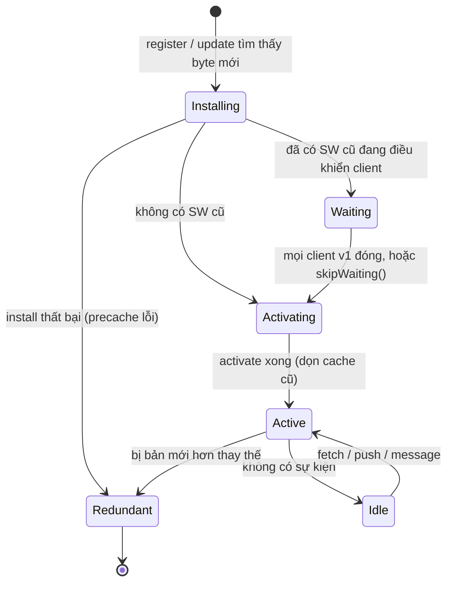
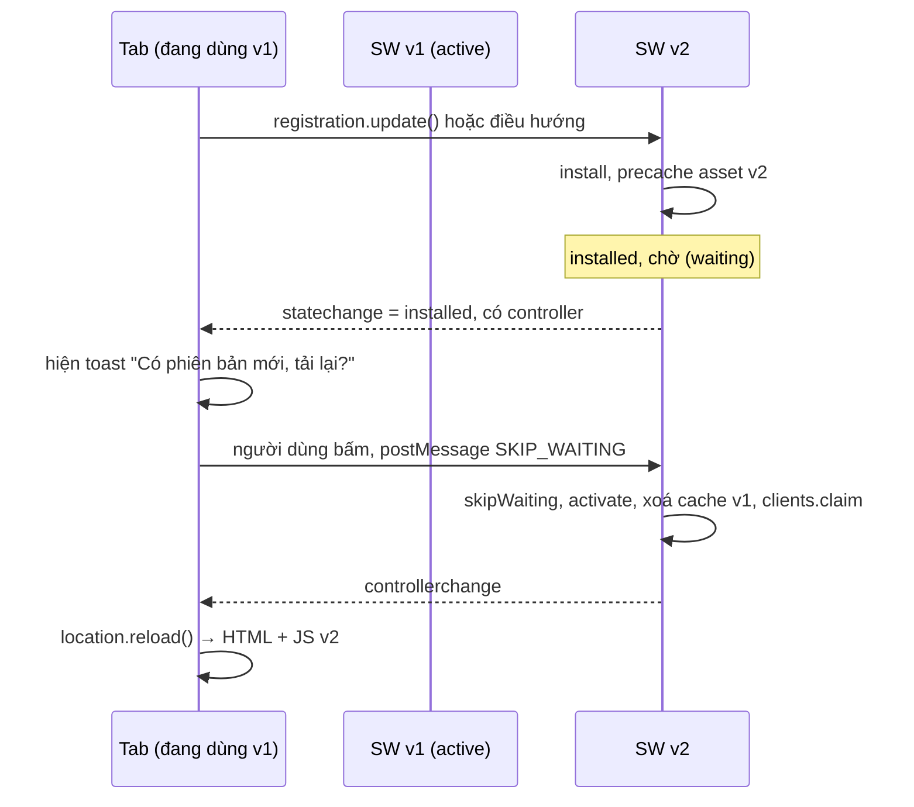

## Bối cảnh & vấn đề

Team ship PWA cho app đặt hàng: chạy offline, cài được lên màn hình chính, mở tức thì. Hai tuần sau có bug tính sai phí vận chuyển. Fix được deploy trong 20 phút. Ba ngày sau, vẫn có người dùng đặt hàng với phí sai. Họ không làm gì lạ: họ mở app từ icon trên màn hình chính, dùng, rồi vuốt nó xuống nền. App chưa bao giờ thật sự "đóng", nên **service worker cũ** vẫn điều khiển nó và phục vụ bundle cũ từ cache.

**Service worker (SW)** là công cụ mạnh nhất mà web có để làm app nhanh và chạy offline, và cũng là công cụ nguy hiểm nhất: một bug trong SW có thể khiến người dùng **kẹt ở phiên bản cũ** mà bạn không thể sửa bằng một lần deploy bình thường, vì chính SW quyết định người dùng nhận được file nào. Bài này dạy SW là gì, vòng đời của nó (đo thật trong Chrome), các chiến lược cache, và quan trọng nhất: **cách đưa bản cập nhật tới người dùng** an toàn. HTTP cache ở [bài HTTP caching](/tracks/browser-web-perf/learn/http-caching-bfcache); Cache API và IndexedDB ở [bài storage](/tracks/browser-web-perf/learn/storage-cookies).

**Interview angle:** "vì sao bug trong SW nguy hiểm hơn bug trong bundle?" là câu phân loại: câu trả lời đúng nói về việc SW đứng giữa người dùng và server, và lifecycle `waiting`.

## Khái niệm

### Service worker là gì

**Service worker** là một script JS chạy trong **luồng riêng**, tách khỏi trang, đăng ký theo **origin + scope**, hoạt động như một **proxy mạng lập trình được**: mọi request (điều hướng, script, ảnh, `fetch`) của các trang trong scope đều đi qua sự kiện `fetch` của nó, và nó quyết định trả response từ cache, từ network, hay tự tạo ra.

Những gì SW làm được mà JS trong trang không làm được: chặn và trả lời request (kể cả request điều hướng tải HTML), chạy khi **không có tab nào mở** để nhận **push** (Web Push) hoặc **background sync**, và phục vụ app khi offline. Những gì SW **không** có: DOM, `localStorage`/`sessionStorage` (API đồng bộ), `XMLHttpRequest`. Nó dùng **Cache API** và **IndexedDB**, giao tiếp với trang qua `postMessage`.

### Secure context và scope

SW chỉ đăng ký được trên **HTTPS** (hoặc `localhost` khi dev), vì một proxy có thể sửa mọi response sẽ là cửa hậu hoàn hảo cho kẻ tấn công man-in-the-middle. **Scope** mặc định là thư mục chứa file SW: `/sw.js` điều khiển toàn site, `/js/sw.js` chỉ điều khiển `/js/*` (mở rộng được bằng header `Service-Worker-Allowed`).

### Vòng đời: install, waiting, activate

1. **Register**: trang gọi `navigator.serviceWorker.register('/sw.js')`. Trình duyệt tải script.
2. **Install**: sự kiện `install` chạy một lần cho mỗi phiên bản SW. Thường dùng để **precache** asset (app shell). Nếu `event.waitUntil()` reject, bản này bị bỏ.
3. **Waiting**: nếu đang có một SW cũ **điều khiển** trang nào đó (gọi là **client**), bản mới đã cài xong sẽ **chờ**. Nó chỉ được kích hoạt khi **không còn client nào** dùng bản cũ (mọi tab trong scope đóng hoặc điều hướng ra ngoài), hoặc khi gọi `self.skipWaiting()`.
4. **Activate**: sự kiện `activate` chạy khi bản mới lên thay. Chỗ đúng để **dọn cache cũ**. Sau activate, SW điều khiển các **điều hướng tiếp theo**; muốn điều khiển ngay các tab đang mở thì gọi `self.clients.claim()`.
5. **Idle / terminated**: trình duyệt tắt SW khi không có sự kiện, và khởi động lại khi có `fetch`, `push`, `message`. Vì vậy **không được giữ state trong biến global** của SW.

Vì sao có `waiting`? Để một trang **không bị hai phiên bản SW phục vụ** trong cùng một vòng đời: HTML và JS của v1 đang chạy, nếu v2 lập tức kiểm soát và trả asset v2 cho các lazy import tiếp theo, trang sẽ trộn hai phiên bản code.

### Kiểm tra cập nhật

Trình duyệt kiểm tra SW có bản mới khi: có **điều hướng** vào scope, khi có sự kiện chức năng (`push`, `sync`) mà lần kiểm tra gần nhất đã quá 24 giờ, và khi code gọi **`registration.update()`**. Nó tải lại script SW và so sánh **từng byte** (cả các file `importScripts`). Theo spec, mặc định `updateViaCache: 'imports'`: script SW chính **bỏ qua HTTP cache** khi kiểm tra, còn script import thì có thể dùng HTTP cache. Dù vậy, CDN có thể vẫn trả bản cũ của `sw.js` nếu edge cache nó, nên luôn đặt `Cache-Control: no-cache` cho `sw.js`.

### Chiến lược cache

- **Cache-first**: tìm trong cache trước, không có mới ra network. Nhanh nhất, chạy offline. Dành cho asset có version/hash (precache lúc install).
- **Network-first**: gọi network trước, lỗi hoặc quá timeout mới dùng cache. Luôn mới khi online. Dành cho HTML và API cần mới.
- **Stale-while-revalidate**: trả cache ngay (nếu có) và đồng thời gọi network để cập nhật cache cho lần sau. Dành cho avatar, ảnh sản phẩm, dữ liệu chấp nhận cũ.
- **Network-only / cache-only**: request không bao giờ cache (thanh toán, API nhạy cảm) hoặc chỉ từ precache.

**Workbox** (của Google) đóng gói các chiến lược này, precache có revision, cleanup và routing; dùng nó thay vì tự viết là lời khuyên mặc định.

### Manifest và installability

**Web App Manifest** (`manifest.webmanifest`) mô tả app cho hệ điều hành: `name`, `short_name`, `icons` (192 và 512 px), `start_url`, `display: standalone`, `theme_color`. Trình duyệt dùng nó cho "Cài đặt ứng dụng"/"Thêm vào màn hình chính". Tiêu chí installability thay đổi theo trình duyệt và theo thời gian: Chrome đã **bỏ yêu cầu phải có service worker với fetch handler** để cài app **từ menu** (Chrome 108 trên mobile, 112 trên desktop), và tự hiển thị trang offline mặc định cho app không có SW; theo bài công bố, lời mời cài đặt tự động (`beforeinstallprompt`) lúc đó vẫn còn dựa vào fetch handler (verify hiện trạng). Nói cách khác, "PWA = phải có SW" không còn là điều kiện kỹ thuật để cài, dù SW vẫn là thứ làm app chạy offline thật sự. Lighthouse cũng đã **bỏ hẳn category PWA** từ Lighthouse 12 (2024); kiểm tra installability bằng DevTools → Application → Manifest.

**Interview angle:** nói được "waiting tồn tại để một trang không bị hai phiên bản phục vụ" chứng tỏ bạn hiểu lý do thiết kế, không chỉ tên các trạng thái.

## Cơ chế hoạt động

Vòng đời khi deploy phiên bản mới trong lúc người dùng đang mở app:



Trạng thái `Waiting` là nơi phần lớn sự cố "người dùng kẹt bản cũ" xảy ra: PWA cài trên điện thoại hiếm khi có "mọi client đóng", nên v2 có thể chờ nhiều ngày. Mũi tên `skipWaiting()` là lối tắt, nhưng đi lối này trong lúc tab v1 còn chạy nghĩa là tab đó sẽ được v2 phục vụ cho các request tiếp theo.

Luồng update an toàn: hỏi người dùng rồi mới chuyển.



## Ví dụ thực tế

### Đo thật: bản mới đứng ở waiting, reload không đủ

Trang đăng ký `/sw.js`; server sinh nội dung SW theo biến `version`. Trình tự: cài v1 → đổi thành v2 → `reg.update()` → reload trang → gửi `SKIP_WAITING`. Output thật (Chrome 154 headless, Puppeteer 25):

```text
page got: controller is v1
updatefound: installing
new worker state: installed (waiting, old SW still controls this tab)
--- reload
after reload: waiting=true, controller asks...
page got: controller is v1
user clicks "Tải lại để cập nhật" -> SKIP_WAITING
controllerchange -> now controlled by http://localhost:8123/sw.js
page got: controller is v2
```

Điểm đáng nhớ: **reload một tab duy nhất không kích hoạt v2**. Khi reload, trang mới được tạo trước khi trang cũ biến mất hẳn, nên luôn có một client v1 tồn tại; sau reload, trang vẫn do v1 điều khiển. Chỉ khi đóng mọi tab (hoặc điều hướng ra ngoài scope) hoặc gọi `skipWaiting()`, v2 mới lên.

Code SW dùng trong thí nghiệm (rút gọn):

```ts
// sw.js (version do build chèn vào)
const V = 'v2';
self.addEventListener('install', (e: any) => {
  e.waitUntil(caches.open(`app-${V}`).then((c) => c.addAll(['/pwa.html'])));
});
self.addEventListener('activate', (e: any) => {
  e.waitUntil(
    caches.keys()
      .then((keys) => Promise.all(keys.filter((k) => k !== `app-${V}`).map((k) => caches.delete(k))))
      .then(() => (self as any).clients.claim()),
  );
});
self.addEventListener('message', (e: any) => {
  if (e.data === 'SKIP_WAITING') (self as any).skipWaiting();
});
```

### Update flow ở phía trang

```ts
export async function registerSW(showUpdateToast: (apply: () => void) => void) {
  if (!('serviceWorker' in navigator)) return;
  const reg = await navigator.serviceWorker.register('/sw.js');

  const promptIfWaiting = () => {
    if (reg.waiting && navigator.serviceWorker.controller) {
      showUpdateToast(() => reg.waiting!.postMessage('SKIP_WAITING'));
    }
  };
  promptIfWaiting();                                   // bản mới đã chờ từ phiên trước
  reg.addEventListener('updatefound', () => {
    reg.installing?.addEventListener('statechange', promptIfWaiting);
  });

  let reloaded = false;
  navigator.serviceWorker.addEventListener('controllerchange', () => {
    if (reloaded) return;                              // tránh reload lặp
    reloaded = true;
    location.reload();
  });

  // PWA mở lâu: chủ động kiểm tra khi app quay lại foreground và định kỳ
  document.addEventListener('visibilitychange', () => {
    if (document.visibilityState === 'visible') reg.update();
  });
  setInterval(() => reg.update(), 60 * 60 * 1000);
}
```

Với bug nghiêm trọng (phí vận chuyển sai), có thể bỏ bước hỏi và kích hoạt ngay ở lần app quay lại foreground, nhưng chỉ khi đã chắc asset v1 và v2 không trộn được (hoặc reload ngay sau khi `controllerchange`).

### Chiến lược theo loại request

```ts
self.addEventListener('fetch', (event: any) => {
  const req: Request = event.request;
  const url = new URL(req.url);
  if (req.method !== 'GET' || url.pathname.startsWith('/api/payments')) return; // network-only

  if (req.mode === 'navigate') {                        // HTML: network-first có timeout
    event.respondWith(networkFirst(req, 3000));
  } else if (url.pathname.startsWith('/assets/')) {     // asset hash: cache-first
    event.respondWith(caches.match(req).then((hit) => hit ?? fetchAndCache(req, 'assets')));
  } else if (req.destination === 'image') {             // ảnh: stale-while-revalidate
    event.respondWith(staleWhileRevalidate(req, 'images'));
  }
});

async function networkFirst(req: Request, timeoutMs: number) {
  const cache = await caches.open('pages');
  try {
    const res = await Promise.race([
      fetch(req),
      new Promise<never>((_, rej) => setTimeout(() => rej(new Error('timeout')), timeoutMs)),
    ]);
    if (res.ok) cache.put(req, res.clone());            // không cache 4xx/5xx
    return res;
  } catch {
    return (await cache.match(req)) ?? (await caches.match('/offline.html'))!;
  }
}
```

Timeout quan trọng vì "mạng chập chờn" (lie-fi) không làm `fetch` reject ngay mà treo rất lâu; không có timeout, network-first trên mạng yếu còn tệ hơn không có SW.

### Kill switch

Khi SW đang chạy bị lỗi nặng (cache-first cho HTML hỏng, vòng lặp reload), deploy **cùng URL** `sw.js` với nội dung:

```ts
// sw.js "kill switch": gỡ chính nó và dọn cache
self.addEventListener('install', () => (self as any).skipWaiting());
self.addEventListener('activate', (event: any) => {
  event.waitUntil((async () => {
    for (const key of await caches.keys()) await caches.delete(key);
    await (self as any).registration.unregister();
    const clients = await (self as any).clients.matchAll({ type: 'window' });
    clients.forEach((c: any) => c.navigate(c.url));     // tải lại trang không còn SW
  })());
});
```

Điều kiện để kill switch hoạt động: URL của SW **không được đổi** (không đặt hash vào tên `sw.js`), và `sw.js` không bị CDN cache lâu. Đây là lý do tên file SW luôn cố định.

## Trade-offs & lựa chọn thay thế

| Chiến lược | Tốc độ | Độ mới | Offline | Dùng cho |
|---|---|---|---|---|
| Cache-first (precache) | Nhanh nhất | Theo version | Có | Asset có hash, app shell |
| Network-first + timeout | Phụ thuộc mạng | Mới nhất | Fallback | HTML, API cần mới |
| Stale-while-revalidate | Nhanh | Lần sau mới | Có (nếu đã cache) | Ảnh, avatar, dữ liệu ít nhạy cảm |
| Network-only | Mạng | Mới | Không | Thanh toán, dữ liệu nhạy cảm |

| Cách update | Ưu | Nhược |
|---|---|---|
| Chờ tự nhiên (đóng mọi tab) | An toàn nhất | PWA mobile có thể kẹt nhiều ngày |
| Toast + `SKIP_WAITING` + reload | Người dùng kiểm soát, không trộn version | Cần UI, người dùng có thể bỏ qua |
| `skipWaiting()` vô điều kiện + `clients.claim()` | Nhanh | Tab đang chạy v1 bị v2 phục vụ lazy chunk → lỗi, mất state |
| Kill switch | Thoát hiểm | Mất offline tạm thời |
| Không dùng SW, chỉ HTTP cache đúng header | Đơn giản, không rủi ro kẹt version | Không offline, không push |

Chọn: nếu app không cần offline/push, **HTTP cache đúng** thường đủ và ít rủi ro hơn nhiều. Nếu cần PWA: precache app shell có hash, network-first cho HTML, SWR cho ảnh, network-only cho thứ nhạy cảm, update flow có toast, và chuẩn bị sẵn kill switch trước khi cần nó.

## Edge cases & failure modes

- **Cache-first cho HTML không có update flow**: người dùng kẹt bản cũ "mãi mãi", vì HTML cũ trỏ bundle cũ vẫn nằm trong precache.
- **`skipWaiting` vô điều kiện**: tab mở v1 lazy-load chunk, v2 đã xoá cache v1 ở `activate` → chunk không có trong cache và có thể không còn trên server → ChunkLoadError (xem [bài code splitting](/tracks/browser-web-perf/learn/code-splitting-bundles)).
- **Precache một file lỗi**: `cache.addAll` là all-or-nothing; một URL 404 làm cả install thất bại, v2 không bao giờ lên. Kiểm tra log install.
- **Cache response lỗi**: cache 500 hoặc trang lỗi, rồi offline luôn thấy lỗi. Chỉ cache `res.ok`.
- **Opaque response**: request `no-cors` tới origin khác trả response "opaque" (status 0, không đọc được); cache chúng tốn quota lớn (Chrome tính mỗi opaque response khá nặng, verify) và không biết có lỗi không.
- **Quên `event.waitUntil()`**: SW bị tắt giữa chừng, precache dở dang.
- **Storage eviction**: Cache API có thể bị trình duyệt xoá khi thiếu dung lượng (best-effort), trừ khi `navigator.storage.persist()` được cấp.
- **Lần truy cập đầu**: SW chỉ được cài sau lần tải đầu, nên lần đầu luôn cần mạng; trang đầu tiên không bị SW điều khiển (trừ khi `clients.claim()`).
- **Safari/iOS**: Web Push cho PWA trên iOS chỉ từ iOS 16.4 và chỉ khi đã "Add to Home Screen"; storage của PWA có thể bị xoá sau thời gian không dùng (verify chính sách hiện tại).

## Pitfalls

- ❌ Đặt hash vào tên `sw.js` → ✅ URL SW cố định, `Cache-Control: no-cache`; nếu không, không thể deploy bản sửa hay kill switch.
- ❌ Cache-first cho `index.html` → ✅ network-first có timeout, fallback cache/offline page.
- ❌ `self.skipWaiting()` trong `install` "cho nhanh" → ✅ toast hỏi người dùng, `SKIP_WAITING` qua message, reload một lần khi `controllerchange`.
- ❌ Tin rằng reload là đủ để lên bản mới → ✅ reload không kích hoạt SW waiting (đo thật); cần skipWaiting hoặc đóng mọi tab.
- ❌ Giữ state trong biến global của SW → ✅ SW bị tắt khi idle; dùng IndexedDB.
- ❌ Tự viết routing và precache → ✅ Workbox, trừ khi rất đơn giản.
- ❌ Cache API thanh toán/tài khoản → ✅ network-only cho dữ liệu nhạy cảm.

## Tóm tắt

- SW là proxy mạng chạy nền theo origin + scope, chỉ trên HTTPS/localhost; không có DOM, không có Web Storage; dùng Cache API/IndexedDB.
- Lifecycle: install (precache) → waiting (khi còn client dùng bản cũ) → activate (dọn cache) → điều khiển điều hướng sau (hoặc ngay nếu `clients.claim()`).
- Reload một tab không kích hoạt bản waiting (đo thật); cần đóng mọi tab hoặc `skipWaiting()`.
- Update check: khi điều hướng, khi có push/sync quá 24 giờ, khi gọi `registration.update()`; so byte; `sw.js` luôn `no-cache` và URL cố định.
- Chiến lược: cache-first cho asset hash, network-first + timeout cho HTML/API, SWR cho ảnh, network-only cho dữ liệu nhạy cảm.
- Update an toàn: toast → `SKIP_WAITING` → `controllerchange` → reload một lần; `update()` khi app quay lại foreground.
- Chuẩn bị kill switch; dùng Workbox; cài từ menu không còn bắt buộc SW ở Chrome (108 mobile / 112 desktop), Lighthouse đã bỏ category PWA.
