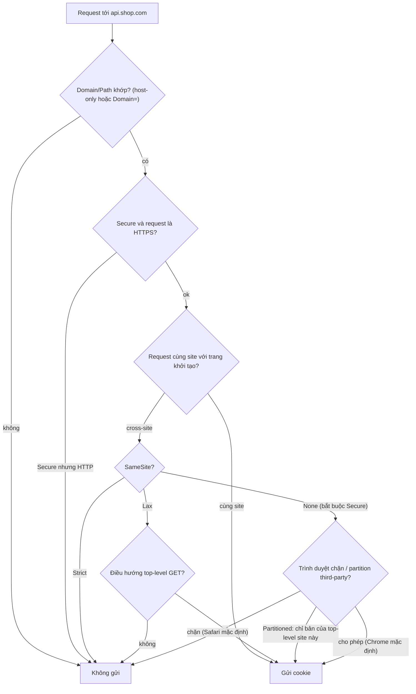
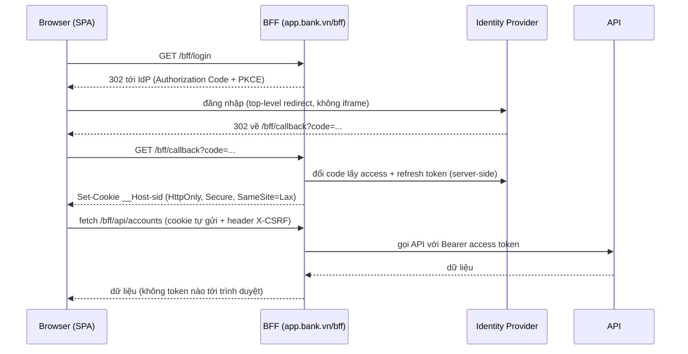

## Bối cảnh & vấn đề

Một SPA ngân hàng lưu access token JWT trong `localStorage` vì "dễ, sống qua reload". Một ngày, thư viện date picker bên thứ ba bị chèn mã độc qua supply chain. Đoạn mã chỉ có một dòng: gửi `localStorage` về server của kẻ tấn công. Trong vài giờ, hàng nghìn token hợp lệ bị dùng từ máy khác. Cùng thời điểm, team khác của công ty đang vật lộn vì luồng đăng nhập bằng iframe ẩn (silent renew) ngừng hoạt động trên Safari, vì cookie của identity provider trong iframe bị coi là **third-party** và bị chặn.

Hai sự cố xoay quanh một câu hỏi: **trình duyệt lưu gì, ai đọc được, và khi nào nó được gửi đi?** Bài này so sánh các cơ chế lưu trữ phía client (cookie, Web Storage, IndexedDB, Cache API), giải thích từng thuộc tính cookie ảnh hưởng bảo mật thế nào (chạy thật trong Chrome), trả lời câu hỏi kinh điển "SPA nên giữ token ở đâu", và cập nhật tình trạng third-party cookie tới 2025 cùng cách thiết kế không phụ thuộc vào nó. XSS là mối đe doạ nền ở đây, chi tiết ở [bài XSS trong React](/tracks/browser-web-perf/learn/xss-react).

**Interview angle:** câu "token để đâu?" không có đáp án duy nhất; interviewer chấm cách bạn nêu mối đe doạ (XSS, CSRF), trade-off và giới hạn của từng lựa chọn.

## Khái niệm

### Origin và site

**Origin** = scheme + host + port (`https://app.shop.com:443`). **Site** = scheme + **registrable domain** (eTLD+1, ví dụ `https://shop.com`). `app.shop.com` và `api.shop.com` là **khác origin nhưng cùng site**. Web Storage, IndexedDB, Cache API cô lập theo **origin**; cookie gắn với **domain** (và `SameSite` xét theo **site**). Nhầm hai khái niệm này là nguồn của nhiều bug CORS và cookie.

### Cookie và các thuộc tính

**Cookie** là cặp tên-giá trị server đặt qua `Set-Cookie` (hoặc JS qua `document.cookie`), trình duyệt **tự gửi kèm** trong header `Cookie` của request tới domain phù hợp. Mỗi cookie khoảng 4 KB. Vì tự gửi, cookie hợp cho **session/auth**, và cũng vì tự gửi mà có CSRF.

- **`HttpOnly`**: JS không đọc được qua `document.cookie`. Giảm hậu quả XSS (không lấy trộm được giá trị), nhưng XSS vẫn **gửi request nhân danh người dùng** được vì trình duyệt tự đính cookie.
- **`Secure`**: chỉ gửi qua HTTPS (localhost được coi là secure).
- **`SameSite=Strict`**: không gửi với request bắt nguồn từ site khác, kể cả khi người dùng click link từ site khác vào. **`Lax`**: gửi với **điều hướng top-level bằng GET** từ site khác (click link), không gửi với POST cross-site, iframe, `fetch` cross-site. **`None`**: luôn gửi, **bắt buộc `Secure`**; cần cho cookie dùng trong ngữ cảnh cross-site (iframe nhúng, widget). Chrome coi cookie không khai báo SameSite là `Lax`.
- **`Domain`**: không đặt → cookie **host-only** (chỉ đúng host đó). Đặt `Domain=shop.com` → gửi cho **mọi subdomain**, kể cả `evil-tenant.shop.com` trong hệ thống multi-tenant.
- **`Path`**: giới hạn theo đường dẫn; không phải ranh giới bảo mật (trang khác path cùng origin vẫn đọc được qua iframe).
- **Prefix `__Host-`**: trình duyệt chỉ chấp nhận khi có `Secure`, `Path=/`, **không có `Domain`** → cookie không bị subdomain ghi đè hay đọc. **`__Secure-`**: chỉ yêu cầu `Secure`.
- **`Partitioned`** (CHIPS): cookie third-party được lưu **tách theo top-level site** (xem dưới).

### Web Storage: localStorage và sessionStorage

**`localStorage`**: key-value chuỗi, khoảng 5 MB mỗi origin, **bền** qua phiên, chia sẻ giữa mọi tab cùng origin (có sự kiện `storage` báo thay đổi cho tab khác). **`sessionStorage`**: cùng API, nhưng gắn với **một tab** (top-level browsing context): sống qua reload, mất khi đóng tab; duplicate tab thì tab mới nhận bản sao.

Cả hai là API **đồng bộ**: mỗi `getItem`/`setItem` chặn main thread, và phải `JSON.stringify`/`parse` thủ công. Cả hai đọc được bởi **mọi script** chạy trên origin, kể cả script third-party và payload XSS.

### IndexedDB

**IndexedDB** là database object phía client: lưu object có cấu trúc (qua structured clone, không cần JSON), có index, transaction, API **bất đồng bộ**, dung lượng lớn (theo quota, thường hàng trăm MB tới GB). Dùng cho dữ liệu offline lớn (giỏ hàng offline, danh sách sản phẩm, hàng đợi thao tác). API gốc khá rườm rà, thường dùng qua thư viện `idb` hoặc Dexie.

### Cache API

**Cache API** (`caches.open()`) lưu cặp **Request/Response** HTTP. Chủ yếu dùng từ service worker để phục vụ offline (xem [bài service worker](/tracks/browser-web-perf/learn/service-worker-pwa)), nhưng trang cũng gọi được.

### Quota và eviction

Trình duyệt cấp quota **theo origin** (hoặc theo site), chia sẻ giữa IndexedDB, Cache API, OPFS; `navigator.storage.estimate()` cho biết usage/quota. Dữ liệu mặc định là **best-effort**: có thể bị xoá khi máy thiếu dung lượng (LRU theo origin), trừ khi `navigator.storage.persist()` được cấp. Safari có chính sách xoá dữ liệu script-writable của site không được tương tác trong 7 ngày khi ITP bật (với trang không cài như app) (verify).

### Third-party cookie và storage partitioning

**Third-party cookie** là cookie của một site khác với site trên thanh địa chỉ, ví dụ cookie của `idp.example` khi trang `shop.com` nhúng iframe `idp.example`. Chúng là nền tảng của tracking quảng cáo xuyên site, nên các trình duyệt dần hạn chế:

- **Safari** (ITP) chặn third-party cookie mặc định từ 2020. **Firefox** (Total Cookie Protection) **partition** cookie theo top-level site mặc định từ 2022.
- **Chrome** dự định bỏ third-party cookie từ 2020, lùi nhiều lần; tháng 7/2024 đổi hướng sang "lựa chọn của người dùng", tháng 4/2025 thông báo không làm prompt riêng và **giữ nguyên** cách hiện tại (third-party cookie **vẫn bật mặc định**, người dùng tự chặn được, Incognito chặn), rồi ngày 17/10/2025 công bố retire phần lớn Privacy Sandbox APIs (Topics, Protected Audience, Attribution Reporting, Shared Storage...), deprecate từ Chrome 144 và dự kiến gỡ ở khoảng Chrome 150; các API như CHIPS, FedCM, Storage Access vẫn giữ (verify lịch gỡ).

**Storage partitioning**: ngoài cookie, localStorage, IndexedDB, Cache API... của một iframe third-party được **tách theo top-level site** ở cả ba trình duyệt lớn: widget `chat.example` nhúng trong `a.com` và trong `b.com` thấy hai kho khác nhau.

**CHIPS** (`Partitioned`): cách "hợp lệ" cho cookie trong iframe/embed: cookie vẫn là third-party nhưng mỗi top-level site có một bản riêng, nên không dùng để tracking xuyên site được. Theo MDN BCD, `Partitioned` có ở Chrome 114+, Firefox 141+, Safari 26.2+ (verify).

**Storage Access API** (`document.requestStorageAccess()`) cho iframe xin quyền dùng cookie chưa partition của nó, sau một cử chỉ người dùng; dành cho trường hợp thật sự cần (SSO nhúng, comment widget).

**Interview angle:** red flag là câu "Chrome đã chặn hoàn toàn third-party cookie từ 2024". Trả lời mạnh: "Safari/Firefox chặn hoặc partition mặc định; Chrome vẫn cho phép mặc định; nên thiết kế như thể không có".

## Cơ chế hoạt động

Trình duyệt quyết định có gửi cookie kèm một request hay không:



Hai điểm hay bị hiểu sai: `HttpOnly` không nằm trên sơ đồ, vì nó chỉ ảnh hưởng việc **JS đọc**, không ảnh hưởng việc **gửi**. Và "cùng site" được xét giữa **trang khởi tạo request** và **đích**, không phải giữa hai origin: `app.shop.com` gọi `api.shop.com` là cùng site nên cookie `Lax` vẫn được gửi (nếu request có `credentials: 'include'` và CORS cho phép).

Mô hình BFF (backend-for-frontend) cho SPA:



Trong mô hình này **không token OAuth nào tới trình duyệt**: JS chỉ có cookie session `HttpOnly` mà nó không đọc được. XSS vẫn có thể gọi API nhân danh người dùng khi họ đang mở trang, nhưng không mang token đi dùng ở nơi khác được, và session có thể thu hồi phía server.

## Ví dụ thực tế

### Cookie HttpOnly không đọc được từ JS

Server trả hai cookie khi vào `/login`:

```http
Set-Cookie: __Host-session=s3cr3t; Path=/; Secure; HttpOnly; SameSite=Lax
Set-Cookie: theme=dark; Path=/; SameSite=Lax
```

Output thật (Chrome 154 qua Puppeteer, trên `http://localhost`, được coi là secure context):

```text
document.cookie = "theme=dark"
browser cookie jar = __Host-session httpOnly=true secure=true sameSite=Lax | theme httpOnly=false secure=false sameSite=Lax
```

Cookie session có trong cookie jar và sẽ được gửi kèm request, nhưng `document.cookie` (thứ mà payload XSS đọc) chỉ thấy `theme`.

### localStorage: đồng bộ và có quota

Lưu 30.000 sản phẩm vào `localStorage` rồi đọc lại, CPU giả lập chậm 4 lần; sau đó thử ghi thêm 5 triệu ký tự. Output thật (Chrome 154):

```text
payload 2.07 MB chars: stringify 27ms, setItem 9ms, getItem+parse 21ms (4x CPU, all on main thread)
QuotaExceededError: Failed to execute 'setItem' on 'Storage': Setting the value of 'more' exceeded the quota.
navigator.storage.estimate(): quota ≈ 10.7 GB
```

Khoảng 57 ms main thread cho một lần ghi và một lần đọc, đủ để thành long task trên điện thoại thật; và giới hạn của `localStorage` (khoảng 5 MB) nhỏ hơn hàng nghìn lần so với quota của IndexedDB/Cache API trên cùng origin. Dữ liệu lớn nên nằm trong IndexedDB (bất đồng bộ, không cần JSON):

```ts
import { openDB } from 'idb';

const db = await openDB('shop', 1, {
  upgrade(db) { db.createObjectStore('products', { keyPath: 'id' }).createIndex('byCategory', 'category'); },
});
const tx = db.transaction('products', 'readwrite');
await Promise.all([...products.map((p) => tx.store.put(p)), tx.done]);
const keyboards = await db.getAllFromIndex('products', 'byCategory', 'keyboard');
```

### Chọn nơi giữ access token

```ts
// ❌ localStorage: bất kỳ script nào trên origin đọc được và gửi đi
localStorage.setItem('access_token', token);

// ⚠️ Memory + refresh token trong cookie HttpOnly: token mất khi reload, silent refresh qua cookie
let accessToken: string | null = null;
async function getAccessToken() {
  if (accessToken && !isExpiringSoon(accessToken)) return accessToken;
  const r = await fetch('/auth/refresh', { method: 'POST', credentials: 'include',
    headers: { 'X-CSRF': csrfToken } });           // refresh cookie: HttpOnly; Secure; SameSite=Strict; Path=/auth
  accessToken = (await r.json()).access_token;
  return accessToken;
}

// ✅ BFF: SPA không thấy token; gọi API qua BFF cùng site
await fetch('/bff/api/accounts', { credentials: 'include', headers: { 'X-CSRF': csrfToken } });
```

Cả hai phương án có cookie đều cần chống **CSRF** cho request thay đổi state: `SameSite=Lax/Strict` chặn phần lớn, cộng thêm CSRF token (double-submit hoặc synchronizer) hoặc kiểm tra header `Origin`/custom header (request cross-site có custom header buộc phải qua CORS preflight).

### Widget nhúng trong thế giới không có third-party cookie

```http
# Widget chat.example nhúng trên nhiều shop: cookie partition theo shop
Set-Cookie: __Host-chat_sid=abc; Path=/; Secure; HttpOnly; SameSite=None; Partitioned
```

Với SSO: thay vì iframe ẩn gọi IdP để "silent renew" (cần cookie của IdP trong ngữ cảnh third-party, bị chặn ở Safari), dùng **top-level redirect** (Authorization Code + PKCE) khi phiên hết hạn, refresh token rotation phía BFF, hoặc FedCM nếu IdP hỗ trợ.

### Kể lại về dự án thật (câu CV)

Khung trả lời câu "auth state trong banking SPA lưu thế nào, giờ bạn đổi gì?":

1. **Mô tả trung thực** cách làm lúc đó: token ở đâu, refresh thế nào, timeout phiên bao lâu (điền chi tiết thật của bạn).
2. **Phân tích rủi ro** của chính cách đó: XSS đọc Web Storage, CSRF nếu dùng cookie, token lọt vào URL/log.
3. **Cải tiến hôm nay**: BFF + cookie `__Host-` `HttpOnly`, CSP strict, step-up auth cho giao dịch, `no-store` cho dữ liệu tài khoản.
4. **Ràng buộc thực tế**: backend có sẵn, yêu cầu audit, cách migrate không đăng xuất mọi người (chạy song song: BFF chấp nhận token cũ một lần để đổi sang session cookie, rồi xoá token khỏi storage).

## Trade-offs & lựa chọn thay thế

| Cơ chế | Dung lượng | API | Gửi lên server | Phạm vi | JS đọc được | Dùng cho |
|---|---|---|---|---|---|---|
| Cookie | ~4 KB/cookie | Header / `document.cookie` | Tự động | Domain/Path, SameSite | Trừ `HttpOnly` | Session, auth |
| `localStorage` | ~5 MB/origin | Đồng bộ, chuỗi | Không | Origin, mọi tab | Có | Preference nhỏ |
| `sessionStorage` | ~5 MB/origin | Đồng bộ, chuỗi | Không | Origin + tab | Có | State tạm của một flow |
| IndexedDB | Theo quota (lớn) | Bất đồng bộ, object | Không | Origin | Có | Dữ liệu offline lớn |
| Cache API | Theo quota | Bất đồng bộ, Request/Response | Không | Origin | Có | Asset/response offline |

| Nơi giữ token | Chống XSS đánh cắp | Chống CSRF | Sống qua reload | Độ phức tạp |
|---|---|---|---|---|
| `localStorage` | Không | Không cần | Có | Thấp |
| Memory + refresh cookie `HttpOnly` | Access token ngắn hạn vẫn lộ trong phiên | Cần cho endpoint refresh | Qua silent refresh | Trung bình |
| BFF + session cookie `HttpOnly` | Không có token trên client | Cần (SameSite + CSRF token) | Có | Cao hơn (thêm server) |

Chọn: app nhạy cảm (ngân hàng, y tế, admin) dùng **BFF**; đây cũng là khuyến nghị của draft IETF "OAuth 2.0 for Browser-Based Applications". SPA thông thường có backend riêng cùng site có thể dùng memory + refresh cookie. `localStorage` chỉ chấp nhận khi token rất ngắn hạn, phạm vi hẹp và đã có CSP strict, và cần nói rõ đó là đánh đổi. Trong **mọi** lựa chọn, XSS vẫn làm được mọi việc người dùng làm được khi trang đang mở, nên CSP và sanitize là bắt buộc (xem [bài CSP](/tracks/browser-web-perf/learn/csp-security-baseline)).

## Edge cases & failure modes

- **`Domain=shop.com` trong multi-tenant**: tenant `evil.shop.com` (do khách hàng kiểm soát nội dung) nhận cookie session của `app.shop.com`, hoặc ghi đè cookie (cookie tossing). Dùng host-only + `__Host-`, tách nội dung người dùng sang registrable domain riêng (ví dụ `shopusercontent.com`).
- **SameSite=Lax và POST sau redirect**: luồng thanh toán/SSO trả về bằng **form POST** cross-site (ví dụ `response_mode=form_post`) không mang cookie `Lax` → mất session. Chrome có ngoại lệ tạm "Lax + POST" trong 2 phút cho cookie **không khai báo** SameSite (verify); đừng dựa vào nó.
- **Safari private mode / storage bị chặn**: `setItem` có thể ném lỗi; luôn bọc try/catch và có fallback.
- **`storage` event**: chỉ bắn ở **tab khác**, không bắn ở tab vừa ghi; `sessionStorage` không đồng bộ giữa tab.
- **Eviction**: IndexedDB/Cache bị xoá khi thiếu dung lượng; giỏ hàng offline không được coi là nguồn sự thật, phải sync về server.
- **Cookie quá lớn**: tổng header `Cookie` vượt giới hạn server/proxy (thường 8–16 KB) → lỗi 400/431 khó hiểu. JWT lớn trong cookie là thủ phạm hay gặp.
- **Iframe silent renew trên Safari**: cookie IdP bị chặn trong iframe → renew thất bại im lặng, người dùng bị đăng xuất ngẫu nhiên. Chuyển sang refresh token rotation hoặc top-level redirect.

## Pitfalls

- ❌ Access token/refresh token trong `localStorage` cho app ngân hàng → ✅ BFF + cookie `__Host-` `HttpOnly; Secure; SameSite`.
- ❌ Nghĩ `HttpOnly` chặn được XSS → ✅ nó chỉ chặn **đọc** cookie; XSS vẫn gọi API nhân danh người dùng. Cần CSP + sanitize.
- ❌ `Domain=` cho cookie session "để dùng chung subdomain" → ✅ host-only; chia sẻ phiên qua SSO, không qua cookie domain rộng.
- ❌ Lưu JSON vài MB vào `localStorage` → ✅ IndexedDB (bất đồng bộ, quota lớn); đo thật: khoảng 57 ms main thread cho 2 MB ở CPU 4x.
- ❌ "Chrome đã chặn third-party cookie" → ✅ Safari/Firefox chặn/partition; Chrome vẫn cho phép mặc định; vẫn thiết kế như thể không có.
- ❌ SSO bằng iframe ẩn → ✅ top-level redirect, Authorization Code + PKCE, `Partitioned` cho widget.
- ❌ Cookie cross-site thiếu `Secure` khi `SameSite=None` → ✅ trình duyệt từ chối cookie đó.

## Tóm tắt

- Origin (scheme+host+port) cô lập Web Storage/IndexedDB/Cache; site (eTLD+1) là đơn vị của SameSite và third-party.
- Cookie tự gửi theo request: `HttpOnly` chặn JS đọc (đo thật: `document.cookie` không thấy session), `Secure`, `SameSite` Strict/Lax/None (None cần Secure), host-only hoặc `__Host-` an toàn hơn `Domain=`.
- `localStorage` ~5 MB, đồng bộ, mọi tab; `sessionStorage` theo tab; IndexedDB bất đồng bộ, dữ liệu lớn; Cache API cho Request/Response. Tất cả JS đọc được: không lưu secret.
- Token: BFF + session cookie `HttpOnly` cho app nhạy cảm; memory + refresh cookie là trung gian; `localStorage` là đánh đổi lớn nhất. Cookie cần chống CSRF.
- Third-party cookie: Safari chặn, Firefox partition, Chrome vẫn bật mặc định (sau các quyết định 2024–2025); storage của iframe bị partition ở mọi trình duyệt lớn.
- Thiết kế không phụ thuộc third-party cookie: CHIPS (`Partitioned`) cho widget, top-level redirect cho SSO, Storage Access API khi thật cần.
