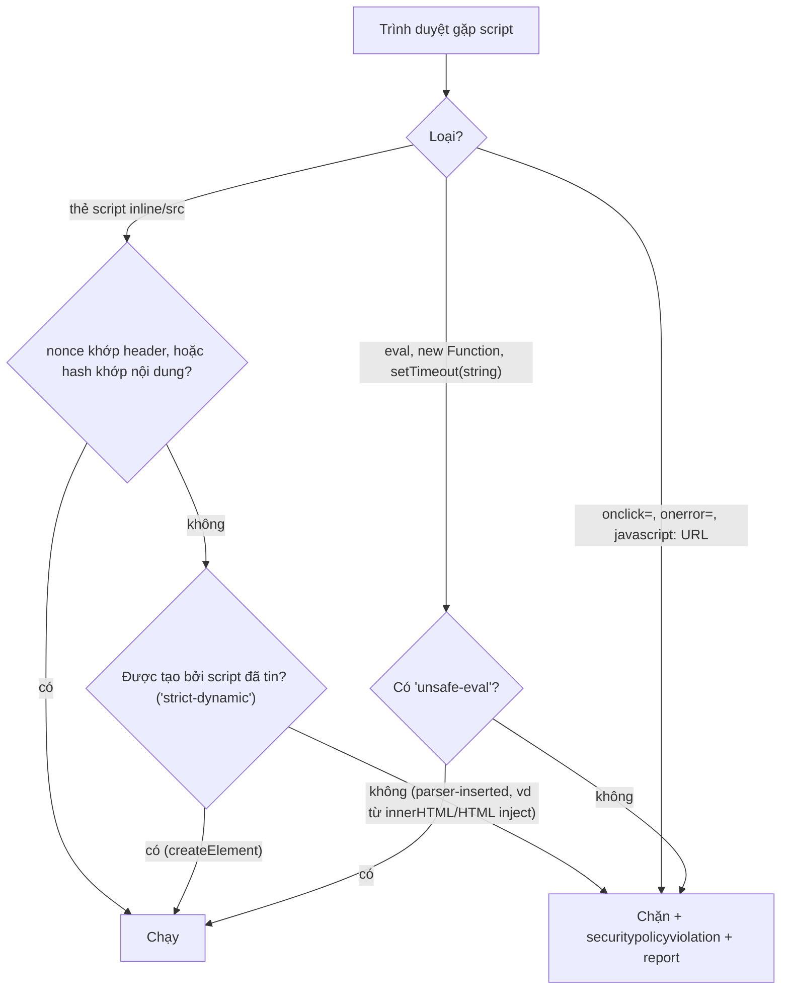
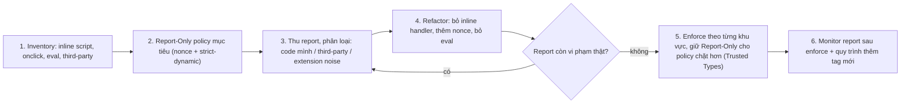

## Bối cảnh & vấn đề

Bài [XSS trong React](/tracks/browser-web-perf/learn/xss-react) kết thúc bằng một thực tế khó chịu: dù code cẩn thận tới đâu, một ngày nào đó sẽ có một lỗ hổng lọt qua: một dev mới dùng `dangerouslySetInnerHTML`, một thư viện chart render tooltip bằng `innerHTML`, một phiên bản DOMPurify cũ có bypass. Câu hỏi không còn là "làm sao không bao giờ có XSS" mà là "**khi có XSS, làm sao để payload không chạy được?**"

**Content Security Policy (CSP)** là lớp phòng thủ thứ hai đó: một header HTTP nói với trình duyệt **script nào được phép chạy** (và style, ảnh, kết nối, iframe nào được phép tải). Nhiều team đã có CSP, nhưng là loại **allowlist domain** kiểu `script-src 'self' cdn.example.com 'unsafe-inline'`, và nghiên cứu của Google trên hơn 1 tỉ hostname cho thấy phần lớn policy dạng này **không chặn được XSS** (khoảng 94% có thể bị bypass). Bài này dạy **strict CSP** dựa trên nonce/hash, **Trusted Types** để chặn DOM XSS, cách rollout trên một app lớn mà không làm vỡ production, và bộ security header hoàn chỉnh cho một banking SPA.

**Interview angle:** "vì sao allowlist domain yếu?" và "rollout CSP cho app lớn thế nào?" là hai câu senior thường gặp. Người trả lời tốt nói về JSONP/thư viện cũ trên domain được phép, và về `Report-Only`.

## Khái niệm

### CSP hoạt động thế nào

Server gửi header `Content-Security-Policy: <directive> <sources>; ...`. Trình duyệt kiểm tra **mọi** việc tải tài nguyên và **mọi** việc thực thi script với policy; vi phạm thì **chặn** và (nếu cấu hình) **báo cáo**. Các directive chính:

- **`script-src`**: nguồn script được chạy (kể cả inline, event handler, `eval`). Quan trọng nhất cho XSS. Có biến thể chi tiết hơn `script-src-elem` (thẻ `<script>`) và `script-src-attr` (inline handler như `onclick`).
- **`default-src`**: giá trị mặc định cho các `*-src` không khai báo.
- **`style-src`, `img-src`, `font-src`, `connect-src`** (fetch/XHR/WebSocket), **`frame-src`**.
- **`object-src 'none'`**: chặn `<object>`/`<embed>` (plugin cũ, vector bypass).
- **`base-uri 'none'`** (hoặc `'self'`): chặn `<base href>` bị inject để đổi đích của mọi script có đường dẫn tương đối.
- **`frame-ancestors`**: ai được nhúng trang này vào iframe (chống **clickjacking**), thay thế `X-Frame-Options`. Không dùng được trong thẻ `<meta>`.
- **`form-action`**: form được submit tới đâu.
- **`report-to`** (mới) / **`report-uri`** (cũ): gửi báo cáo vi phạm về endpoint.

### Vì sao allowlist domain yếu

`script-src 'self' https://cdn.jsdelivr.net https://www.google.com` nghe chặt, nhưng:

- **Domain được phép host thứ khác ngoài script của bạn**: CDN công cộng như jsDelivr/unpkg phục vụ **mọi** package npm, kể cả phiên bản cũ của AngularJS mà kẻ tấn công có thể dùng để chạy biểu thức template tuỳ ý.
- **JSONP endpoint**: `https://www.google.com/complete/search?callback=alert(1)//` trả về JS gọi hàm do kẻ tấn công chọn, từ một domain "tin cậy".
- **Open redirect** trên domain được phép (CSP cho phép theo đường dẫn chỉ trước redirect).
- **`'unsafe-inline'`** (thường phải thêm vì code cũ có inline script) vô hiệu hoá gần như toàn bộ: payload XSS chính là inline script.

### Strict CSP: nonce, hash và strict-dynamic

**Strict CSP** không dựa vào domain, mà vào việc **chứng minh script do chính server bạn đặt vào trang**:

- **Nonce**: server sinh một chuỗi ngẫu nhiên (ít nhất 128 bit) **mỗi response**, đặt vào header `script-src 'nonce-R4nd0m'` và vào thuộc tính `nonce="R4nd0m"` của từng thẻ `<script>` hợp lệ. Payload inject vào HTML không biết nonce nên không chạy. Nonce **không được tái sử dụng** giữa các response, vì vậy HTML có nonce không thể cache chung.
- **Hash**: `script-src 'sha256-<base64 của nội dung inline script>'`. Phù hợp trang **tĩnh** (không đổi giữa các request), vì hash tính lúc build.
- **`'strict-dynamic'`**: script đã được tin (qua nonce/hash) được phép **tải thêm script con** bằng `document.createElement('script')`. Nhờ vậy loader của Google Tag Manager, bundler chunk loader vẫn hoạt động mà không cần allowlist domain. Khi có `'strict-dynamic'`, trình duyệt hỗ trợ CSP3 **bỏ qua** allowlist domain và `'unsafe-inline'`, nên có thể thêm `https:` và `'unsafe-inline'` làm fallback cho trình duyệt rất cũ mà không làm yếu policy trên trình duyệt hiện đại.

Strict CSP không cho phép: **inline event handler** (`onclick="..."`), **`javascript:` URL**, **`eval`/`new Function`/`setTimeout(string)`** (trừ khi thêm `'unsafe-eval'`).

### Trusted Types

CSP chặn script **không được tin** chạy, nhưng không chặn được **DOM XSS**: code của chính bạn (đã được tin) đưa chuỗi độc vào `innerHTML`. **Trusted Types** giải quyết đúng lỗ này: với `Content-Security-Policy: require-trusted-types-for 'script'`, trình duyệt **từ chối chuỗi thường** ở mọi sink nguy hiểm (`innerHTML`, `outerHTML`, `insertAdjacentHTML`, `document.write`, `eval`, `script.src`...), chỉ nhận object **`TrustedHTML`/`TrustedScript`/`TrustedScriptURL`** tạo ra từ một **policy** được đặt tên. Directive **`trusted-types <tên>`** giới hạn những policy nào được phép tạo.

Lợi ích: mọi điểm có thể gây DOM XSS bị **gom về vài policy** dễ audit (thường một policy gọi DOMPurify), thay vì rải rác ở hàng trăm dòng `innerHTML`. Theo MDN BCD: Chrome 83+, Firefox 148+, Safari 26+ (verify).

### Report-Only

**`Content-Security-Policy-Report-Only`** áp dụng policy ở chế độ **chỉ báo cáo**: không chặn gì, nhưng gửi báo cáo cho mọi vi phạm. Có thể gửi đồng thời cả hai header: một policy đang enforce và một policy chặt hơn đang thử nghiệm. Đây là công cụ bắt buộc để rollout trên app đang chạy.

### Các security header khác

- **`Strict-Transport-Security: max-age=63072000; includeSubDomains; preload`** (HSTS): chỉ dùng HTTPS, chống SSL stripping.
- **`X-Content-Type-Options: nosniff`**: không đoán MIME type (chặn việc file upload bị hiểu là script/HTML).
- **`Referrer-Policy: strict-origin-when-cross-origin`** (hoặc chặt hơn): không lộ đường dẫn đầy đủ (có thể chứa token, id) sang site khác.
- **`Permissions-Policy: camera=(), microphone=(), geolocation=()`**: tắt API trình duyệt không dùng, kể cả cho iframe.
- **`Cross-Origin-Opener-Policy: same-origin`**: tách cửa sổ khỏi popup cross-origin.
- **Subresource Integrity** (`<script src integrity="sha384-...">`): trình duyệt từ chối file CDN bị sửa.

**Interview angle:** "CSP có thay thế sanitize không?" Không: CSP là defense in depth; nó còn có thể bị tắt nhầm, bị cấu hình sai, và không chặn được việc code đã-được-tin gọi API xấu.

## Cơ chế hoạt động

Trình duyệt quyết định một script có được chạy dưới strict CSP:



Điểm tinh tế của `'strict-dynamic'`: nó tin script được tạo **bằng API DOM** (`createElement` + `appendChild`) bởi script đã tin, nhưng **không** tin script "parser-inserted" (xuất hiện từ HTML được parse, ví dụ qua `innerHTML` hay `document.write`). Vì vậy nó giữ được tính tương thích với loader mà không mở cửa cho HTML injection.

Quy trình rollout cho một app lớn đang chạy:



## Ví dụ thực tế

### Strict CSP chạy thật trong Chrome

Server sinh nonce mới mỗi response và gửi:

```http
Content-Security-Policy: script-src 'nonce-{random}' 'strict-dynamic'; object-src 'none'; base-uri 'none'
```

Trang có: một inline script **có** nonce (đăng ký listener `securitypolicyviolation`), một inline script **không** nonce, một nút `onclick="..."`, và một script có nonce làm ba việc: tạo `<script src="/widget.js">` bằng `createElement`, gán `innerHTML` chứa ``, gọi `setTimeout("...")` bằng chuỗi. Sau đó Puppeteer click nút. Output thật (Chrome 154):

```text
nonce script ran
violation: script-src-elem blocked=inline
violation: script-src blocked=eval
violation: script-src-attr blocked=inline
widget.js loaded by trusted script
violation: script-src-attr blocked=inline
-- console errors:
Executing inline script violates the following Content Security Policy directive 'script-src 'nonce-cgAstCwBsTSOa1+S1shieA==' 'strict-dynamic''. Either the 'unsafe-inline' keyword, a hash ('sha256-24cDLSiiB6NOtMePotkmxul...
Evaluating a string as JavaScript violates the following Content Security Policy directive because 'unsafe-eval' is not an allowed source of script: "script-src 'nonce-cgAstCwBsTSOa1+S1shieA==' 'strict-dynamic'".
Executing inline event handler violates the following Content Security Policy directive 'script-src 'nonce-cgAstCwBsTSOa1+S1shieA==' 'strict-dynamic''. ...
```

Đọc kết quả: chỉ script có nonce chạy. Inline script không nonce bị chặn (`script-src-elem`). `setTimeout(string)` bị chặn (`eval`). Payload `onerror` trong HTML inject bị chặn (`script-src-attr`), và `onclick` của nút cũng bị chặn: đây chính là thứ sẽ **làm vỡ** app cũ khi bật strict CSP. `widget.js` được tạo bởi script đã tin nên chạy nhờ `'strict-dynamic'`. Console còn gợi ý luôn hash của inline script bị chặn, hữu ích khi chuyển sang CSP hash.

### Trusted Types chạy thật

```http
Content-Security-Policy: require-trusted-types-for 'script'; trusted-types app-html
```

```ts
try { el.innerHTML = '<b>hi</b>'; } catch (e) { log(e); }                     // chuỗi thường
const policy = trustedTypes.createPolicy('app-html', {
  createHTML: (s) => s.replace(/</g, '&lt;'),     // thực tế: (s) => DOMPurify.sanitize(s)
});
el.innerHTML = policy.createHTML('');           // qua policy
try { trustedTypes.createPolicy('evil', { createHTML: (s) => s }); } catch (e) { log(e); }
```

Output thật (Chrome 154):

```text
TypeError: Failed to set the 'innerHTML' property on 'Element': This document requires 'TrustedHTML' assignment.
via policy: &lt;img src=x onerror=alert(1)&gt;
TypeError: Failed to execute 'createPolicy' on 'TrustedTypePolicyFactory': Policy "evil" disallowed.
```

Gán chuỗi thường vào `innerHTML` bị từ chối **kể cả khi chuỗi vô hại**, nên mọi chỗ gán phải đi qua policy. Kẻ tấn công (hoặc một thư viện) cố tạo policy "cho qua" tên khác cũng bị chặn nhờ `trusted-types app-html`. DOMPurify hỗ trợ trả thẳng `TrustedHTML` (`RETURN_TRUSTED_TYPE: true`).

### Nonce trong Next.js 16

Next.js 16 đổi tên middleware thành **Proxy** (`proxy.ts`). Theo docs trong `node_modules/next/dist/docs` của bản cài:

```ts
// proxy.ts
import { NextResponse, type NextRequest } from 'next/server';

export function proxy(request: NextRequest) {
  const nonce = Buffer.from(crypto.randomUUID()).toString('base64');
  const isDev = process.env.NODE_ENV === 'development';
  const csp = `
    default-src 'self';
    script-src 'self' 'nonce-${nonce}' 'strict-dynamic'${isDev ? " 'unsafe-eval'" : ''};
    style-src 'self' 'nonce-${nonce}';
    img-src 'self' blob: data:;
    object-src 'none'; base-uri 'self'; form-action 'self'; frame-ancestors 'none';
    upgrade-insecure-requests;
  `.replace(/\s{2,}/g, ' ').trim();

  const requestHeaders = new Headers(request.headers);
  requestHeaders.set('x-nonce', nonce);
  requestHeaders.set('Content-Security-Policy', csp);
  const response = NextResponse.next({ request: { headers: requestHeaders } });
  response.headers.set('Content-Security-Policy', csp);
  return response;
}
```

Next.js đọc nonce từ header CSP của request và tự gắn vào script của framework. Cái giá, docs nói rõ: trang phải **render động** (mỗi request một nonce), mất static/ISR cho các trang đó. Next.js có tuỳ chọn **SRI (hash-based) experimental** để giữ static generation với CSP chặt. Với CDN cache HTML: nonce bị cache nghĩa là mọi người dùng nhận **cùng một nonce**, kẻ tấn công đọc được nonce từ HTML và dùng nó trong payload, CSP mất tác dụng. Vì vậy: không cache HTML có nonce ở shared cache, hoặc dùng hash cho trang tĩnh.

### Baseline header cho banking SPA (Express/NestJS)

```ts
import helmet from 'helmet';
import crypto from 'node:crypto';

app.use((req, res, next) => { res.locals.nonce = crypto.randomBytes(16).toString('base64'); next(); });
app.use(helmet({
  contentSecurityPolicy: {
    useDefaults: false,
    directives: {
      defaultSrc: ["'self'"],
      scriptSrc: [(req, res: any) => `'nonce-${res.locals.nonce}'`, "'strict-dynamic'"],
      styleSrc: ["'self'"],
      imgSrc: ["'self'", 'data:'],
      connectSrc: ["'self'", 'https://api.bank.vn'],
      objectSrc: ["'none'"], baseUri: ["'none'"], formAction: ["'self'"], frameAncestors: ["'none'"],
      requireTrustedTypesFor: ["'script'"], trustedTypes: ['app-html', 'dompurify'],
      reportTo: ['csp'],
    },
  },
  strictTransportSecurity: { maxAge: 63072000, includeSubDomains: true, preload: true },
  referrerPolicy: { policy: 'strict-origin-when-cross-origin' },
  xContentTypeOptions: true,        // nosniff
}));
app.use((req, res, next) => {
  res.setHeader('Permissions-Policy', 'camera=(), microphone=(), geolocation=(), payment=(self)');
  res.setHeader('Reporting-Endpoints', 'csp="https://bank.vn/csp-report"');
  next();
});
```

Header chỉ là một phần của baseline. Danh sách đầy đủ cho banking SPA:

1. **Headers**: như trên (CSP strict + Trusted Types, HSTS preload, nosniff, Referrer-Policy, `frame-ancestors 'none'`, Permissions-Policy).
2. **Auth**: không token trong Web Storage; BFF + cookie `__Host-` `HttpOnly; Secure; SameSite`; CSRF token; timeout phiên; **step-up auth** (OTP/biometric) cho giao dịch (xem [bài storage & cookie](/tracks/browser-web-perf/learn/storage-cookies)).
3. **Caching**: `no-store` cho response dữ liệu tài khoản; xử lý `pageshow` persisted (xem [bài HTTP caching & bfcache](/tracks/browser-web-perf/learn/http-caching-bfcache)).
4. **Dependencies**: lockfile, `npm audit`/Dependabot, SRI cho script từ CDN, hạn chế tối đa third-party trên trang giao dịch.
5. **Code**: lint cấm `dangerouslySetInnerHTML`/`innerHTML` ngoài module được duyệt, sanitize, validate URL.
6. **Monitoring**: CSP report, error tracking **không log PII/token**, alert khi vi phạm CSP tăng đột biến (có thể là tấn công).

Vì sao **không** đặt analytics third-party trên trang xác nhận chuyển tiền: mọi script third-party chạy với toàn quyền của origin, đọc được số tài khoản, số tiền, thậm chí sửa DOM để đổi số tài khoản người nhận hiển thị; một vendor bị xâm nhập là đủ.

## Trade-offs & lựa chọn thay thế

| Kiểu CSP | Chống XSS | Tương thích | Hợp với |
|---|---|---|---|
| Không có CSP | Không | Hoàn toàn | Không nên |
| Allowlist + `'unsafe-inline'` | Gần như không | Cao | Không nên (cảm giác an toàn giả) |
| Allowlist chặt, không `unsafe-inline` | Trung bình (JSONP, CDN chung bypass) | Trung bình | App cũ trong lúc chuyển đổi |
| Nonce + `'strict-dynamic'` | Cao | Cần bỏ inline handler, render động | SSR/app động |
| Hash + `'strict-dynamic'` | Cao | Trang tĩnh, inline script cố định | SSG, SPA static |
| + Trusted Types | Cao nhất (cả DOM XSS) | Thư viện dùng `innerHTML` phải qua policy | App nhạy cảm (banking) |

Chọn: trang render động (SSR, Next.js dynamic) dùng **nonce**; trang tĩnh (SPA build ra `index.html`, SSG) dùng **hash** (bundler plugin tính hash inline script, hoặc không có inline script nào và chỉ dùng `'self'` + `'strict-dynamic'` với hash của loader). Luôn kèm `object-src 'none'` và `base-uri 'none'`. Thêm Trusted Types sau khi CSP đã ổn định, cũng qua Report-Only trước. Với third-party (tag manager, chat), `'strict-dynamic'` cho phép loader của chúng hoạt động nếu chính loader có nonce, nhưng mỗi tag là một rủi ro cần review.

## Edge cases & failure modes

- **Inline event handler trong code cũ**: `onclick="..."` trong template, thư viện jQuery plugin cũ → vỡ khi enforce. Chuyển sang `addEventListener`.
- **Thư viện dùng `eval`/`new Function`**: một số template engine, lodash `template`, bản build dev của bundler (source map `eval`) cần `'unsafe-eval'`. Dùng bản build khác hoặc chỉ cho phép ở dev.
- **Style inline**: `style-src` với nonce chặn thuộc tính `style="..."` được thêm bởi HTML; CSS-in-JS runtime cần nonce. Nhiều team tạm để `style-src 'self' 'unsafe-inline'` vì rủi ro style injection thấp hơn script (nhưng vẫn có: CSS exfiltration).
- **Trusted Types và thư viện**: rich text editor, chart, một số UI kit gán `innerHTML` trực tiếp → TypeError. Tạo policy `default` làm cầu nối tạm (có log), hoặc cập nhật thư viện hỗ trợ TT.
- **Báo cáo nhiễu**: extension trình duyệt inject script tạo hàng nghìn report vô nghĩa (`blocked-uri: chrome-extension`); lọc trước khi alert.
- **Nonce bị cache**: CDN/proxy cache HTML → nonce lặp lại, mất tác dụng; kiểm tra `Cache-Control` của HTML có nonce.
- **CSP trong `<meta>`**: không hỗ trợ `frame-ancestors`, `report-to`, sandbox; và chỉ áp dụng cho nội dung **sau** thẻ meta. Dùng header.
- **Nhiều policy**: khi có hai header CSP, trình duyệt áp **cả hai** (giao nhau); thêm một policy lỏng không nới lỏng policy chặt.

## Pitfalls

- ❌ `script-src 'self' 'unsafe-inline' 'unsafe-eval' *.cdn.com` rồi coi là "đã có CSP" → ✅ nonce/hash + `'strict-dynamic'`, `object-src 'none'`, `base-uri 'none'`.
- ❌ Enforce thẳng trên production → ✅ `Content-Security-Policy-Report-Only` trước, thu và phân loại report, refactor, rồi enforce từng phần.
- ❌ Nonce cố định hoặc sinh một lần lúc build → ✅ ngẫu nhiên ≥ 128 bit **mỗi response**; không cache HTML có nonce ở shared cache.
- ❌ Chỉ có CSP, quên DOM XSS → ✅ Trusted Types `require-trusted-types-for 'script'` + policy gọi DOMPurify.
- ❌ Dùng `<meta http-equiv>` cho CSP và mong chống clickjacking → ✅ header HTTP, `frame-ancestors 'none'`.
- ❌ Middleware Next.js viết cho NestJS (hai framework khác nhau) → ✅ NestJS/Express dùng `helmet`; Next.js 16 dùng `proxy.ts`.
- ❌ Để marketing tự thêm tag trên trang giao dịch → ✅ quy trình review tag, không third-party trên trang chuyển tiền.

## Tóm tắt

- CSP là lớp phòng thủ thứ hai: trình duyệt chặn script không được tin; không thay thế sanitize.
- Allowlist domain yếu: CDN chung, JSONP, open redirect, và `'unsafe-inline'` vô hiệu hoá nó.
- Strict CSP: `script-src 'nonce-{random mỗi response}' 'strict-dynamic'; object-src 'none'; base-uri 'none'`; trang tĩnh dùng hash. Chặn inline script không nonce, `onclick`/`onerror`, `eval` (chạy thật); `'strict-dynamic'` cho script đã tin tải script con.
- Trusted Types (`require-trusted-types-for 'script'`, `trusted-types <policy>`) chặn chuỗi thường ở sink DOM (chạy thật); gom mọi `innerHTML` về policy gọi DOMPurify.
- Rollout: inventory → Report-Only → phân loại report → refactor → enforce dần → monitor.
- Next.js 16: nonce qua `proxy.ts`, trang phải render động; SRI experimental để giữ static; không cache HTML có nonce ở CDN.
- Baseline banking: CSP + TT, HSTS preload, nosniff, Referrer-Policy, `frame-ancestors 'none'`, Permissions-Policy, BFF + cookie `__Host-`, `no-store`, SRI, không third-party trên trang giao dịch.
