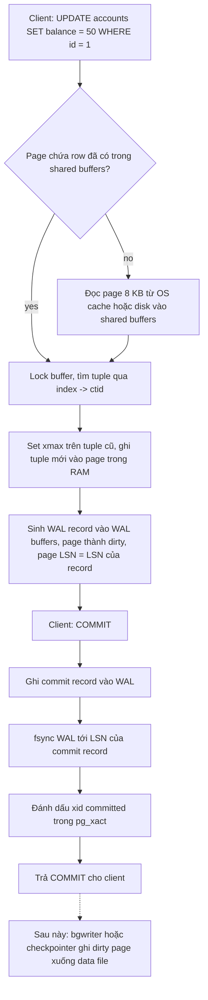
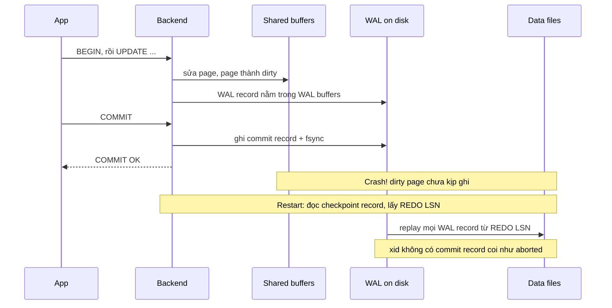

## Bối cảnh & vấn đề

Hãy tưởng tượng bạn tự viết một "database" đơn giản: mỗi lần user chuyển tiền, app mở file `accounts.dat`, tìm dòng của user, sửa số dư rồi ghi lại. Cách này vỡ ngay ở ba chỗ. Thứ nhất, nếu server mất điện giữa lúc đang ghi, file có thể còn nửa cũ nửa mới, tức là **torn write**. Thứ hai, nếu một giao dịch sửa hai dòng (trừ A, cộng B) và crash xảy ra giữa hai lần ghi, tiền "bốc hơi". Thứ ba, nếu muốn an toàn bằng cách gọi `fsync` sau mỗi lần sửa, mỗi commit phải chờ disk ghi xong một vị trí ngẫu nhiên, và throughput rơi xuống vài trăm giao dịch mỗi giây.

PostgreSQL giải quyết cả ba bằng một kiến trúc cụ thể: dữ liệu nằm trong các **page 8 KB**, page được sửa **trong RAM** (shared buffers), mọi thay đổi được ghi trước vào một log tuần tự gọi là **WAL** (Write-Ahead Log), và data file chỉ được ghi xuống disk "khi rảnh" tại các **checkpoint**. Khi crash, Postgres đọc lại WAL để dựng lại những gì chưa kịp ghi vào data file.

Hiểu tầng này là chìa khoá cho gần như mọi chủ đề sau: vì sao index trỏ vào `ctid`, vì sao `UPDATE` tạo row mới và cần VACUUM ([MVCC & VACUUM](/tracks/sql-postgres/learn/mvcc-vacuum)), vì sao replica đọc được WAL ([Replication](/tracks/sql-postgres/learn/replication-scaling)), và vì sao một người quen SQL Server hay mang theo mental model sai. Bài này giả định bạn **chưa từng học DB internals**: mọi thuật ngữ được định nghĩa khi xuất hiện lần đầu.

**Interview angle:** interviewer không cần bạn thuộc cấu trúc byte; họ muốn nghe bạn giải thích được "commit xong thì dữ liệu nằm ở đâu, và vì sao crash không làm mất nó".

## Khái niệm

### Cluster, database và file trên disk

Một **cluster** Postgres là một instance server quản lý một thư mục dữ liệu (`$PGDATA`). Trong đó mỗi database là một thư mục con `base/<oid>`, và mỗi table hay index là một hoặc nhiều **file** riêng, đặt tên theo `relfilenode`. File lớn hơn 1 GB được cắt thành các segment `12345`, `12345.1`, `12345.2`. Ngoài file dữ liệu chính (main fork), mỗi table còn có file `_fsm` (**free space map**: page nào còn chỗ trống) và `_vm` (**visibility map**: page nào mọi row đều visible với mọi transaction, dùng cho Index Only Scan và VACUUM).

Bạn có thể tự xem: `SELECT pg_relation_filepath('accounts');` trả về đường dẫn kiểu `base/16384/16390`. Điều quan trọng cần nhớ: **table và index là các file tách biệt**. Postgres không có kiểu "table nằm bên trong index" như SQL Server hay MySQL InnoDB.

**Interview angle:** câu "Postgres có clustered index không?" bắt đầu từ đây: không, table luôn là một file heap riêng.

### Page: đơn vị I/O 8 KB

Postgres không bao giờ đọc hay ghi một row riêng lẻ xuống disk. Đơn vị nhỏ nhất là **page** (còn gọi là block), mặc định **8 KB** (giá trị `BLCKSZ` chọn lúc compile, gần như không ai đổi). Muốn đọc một row 100 byte, Postgres đọc cả page 8 KB chứa nó vào RAM; muốn sửa một row, nó sửa page trong RAM và sau này ghi cả page xuống.

Một heap page có bố cục cố định. Đầu page là **page header** 24 byte (chứa LSN của WAL record cuối cùng sửa page này, checksum, con trỏ tới vùng trống). Tiếp theo là mảng **line pointer** (mỗi cái 4 byte, trỏ tới vị trí và độ dài của một tuple). Các **tuple** (row version) được xếp từ **cuối page ngược lên**, còn line pointer mọc từ đầu xuống; khoảng giữa là free space. Khi hai vùng gặp nhau, page đầy.

Vì sao cần lớp line pointer? Vì nó tạo ra **indirection**: index trỏ vào "page 7, line pointer số 3", chứ không trỏ vào byte offset. Khi Postgres dồn page để lấy lại chỗ trống (page pruning), nó có thể di chuyển tuple bên trong page mà chỉ cần sửa line pointer, không phải sửa mọi index.

### Heap và ctid

**Heap** nghĩa là "đống": row được đặt vào bất kỳ page nào còn chỗ, **không theo thứ tự nào** (không theo PK, không theo thời gian insert một cách đảm bảo). Địa chỉ vật lý của một row version là **`ctid`** = `(block_number, line_pointer_index)`, ví dụ `(0,1)` là page 0, slot 1.

Mọi index trong Postgres, **kể cả primary key**, đều là cấu trúc riêng lưu cặp `(key, ctid)`. Tra PK `id = 42` nghĩa là đi B-tree tìm ra `ctid = (7,3)` rồi đọc page 7 của heap. Hệ quả: `ctid` **không phải định danh ổn định**. Một `UPDATE` tạo row version mới ở `ctid` khác, `VACUUM FULL` hay `CLUSTER` viết lại toàn bộ table. Đừng bao giờ lưu `ctid` trong app.

**Interview angle:** "Index của Postgres trỏ tới gì?" → `ctid` trong heap, không phải PK. Đây là điểm khác cốt lõi với SQL Server.

### Tuple header: xmin, xmax, ctid, infomask

Mỗi tuple có một header khoảng **23 byte** trước dữ liệu. Các trường đáng nhớ:

- **`xmin`**: transaction ID (xid) đã tạo ra version này (INSERT hoặc UPDATE).
- **`xmax`**: xid đã xoá hoặc thay thế version này (DELETE/UPDATE), hoặc đang lock nó (`SELECT ... FOR UPDATE`). Bằng 0 nghĩa là chưa ai đụng tới.
- **`t_ctid`**: trỏ tới chính nó, hoặc tới version mới hơn nếu row đã bị UPDATE. Nhờ vậy Postgres có thể "đi theo chuỗi" để tìm version mới nhất.
- **`t_infomask`**: các bit trạng thái, trong đó có **hint bits** kiểu "xmin đã được xác nhận commit". Hint bit là cache: lần đầu kiểm tra, Postgres phải tra **commit log** (`pg_xact`), rồi ghi bit vào tuple để lần sau khỏi tra.

Chính `xmin`/`xmax` là nền của **MVCC** (Multi-Version Concurrency Control): một transaction nhìn thấy tuple nếu `xmin` đã commit trước snapshot của nó và `xmax` chưa commit (hoặc bằng 0). Row lock cũng nằm ngay trong `xmax`, nên Postgres không cần bảng lock trong RAM cho từng row, và vì thế **không có lock escalation**. Chi tiết visibility nằm ở [MVCC & VACUUM](/tracks/sql-postgres/learn/mvcc-vacuum).

Ví dụ, sau `INSERT` bởi xid 1001 rồi `UPDATE` bởi xid 1002, page chứa hai tuple: `(0,1) xmin=1001 xmax=1002 t_ctid=(0,2)` là version cũ, và `(0,2) xmin=1002 xmax=0` là version hiện tại.

### Fillfactor

**Fillfactor** là phần trăm page mà INSERT được phép lấp đầy; phần còn lại để dành cho UPDATE. Mặc định table là **100** (lấp đầy hoàn toàn), B-tree index là 90. Với table bị update nhiều, đặt `fillfactor = 80` hoặc `90` để version mới có chỗ nằm **cùng page** với version cũ. Khi đó, nếu không cột indexed nào thay đổi, Postgres làm **HOT update** (Heap-Only Tuple): không cần thêm entry vào index nào cả, vì index vẫn trỏ vào line pointer cũ và chuỗi HOT dẫn tới version mới.

```sql
ALTER TABLE sessions SET (fillfactor = 80);  -- áp dụng cho page mới ghi; VACUUM FULL/pg_repack để áp lên dữ liệu cũ
```

### TOAST: giá trị lớn không nằm trong page

Một tuple phải nằm gọn trong một page 8 KB, nhưng cột `text` hay `jsonb` có thể dài hàng MB. Postgres giải quyết bằng **TOAST** (The Oversized-Attribute Storage Technique). Khi tuple vượt ngưỡng khoảng **2 KB** (`TOAST_TUPLE_THRESHOLD`), Postgres lần lượt thử **nén** giá trị (pglz, hoặc lz4 từ PG 14) và nếu vẫn lớn thì **đẩy ra ngoài** (out-of-line) vào một table phụ `pg_toast.pg_toast_<oid>`, cắt thành các chunk khoảng 2 KB. Tuple chính chỉ giữ một con trỏ khoảng 18 byte. Giới hạn một giá trị là **1 GB**.

Hệ quả thực tế: `SELECT *` trên table có cột `jsonb` lớn phải đọc thêm TOAST table, nên chậm hơn nhiều so với chỉ chọn cột cần. Ngược lại, `UPDATE` không đụng cột TOAST thì version mới dùng lại con trỏ cũ, không copy lại MB dữ liệu. Mỗi cột có một **storage strategy**: `PLAIN`, `MAIN`, `EXTERNAL` (không nén, tiện cho `substring` nhanh), `EXTENDED` (mặc định: nén rồi out-of-line).

### Shared buffers và dirty page

**Shared buffers** là vùng RAM chung mà mọi backend process dùng để cache page (mặc định `128MB`, thường chỉnh lên khoảng 25% RAM). Khi cần một page, backend tìm trong shared buffers; nếu thiếu, nó đọc từ OS (có thể trúng **OS page cache**, có thể phải xuống disk thật). `EXPLAIN (ANALYZE, BUFFERS)` hiện `shared hit` (trúng shared buffers) và `shared read` (phải hỏi OS).

Khi một page trong shared buffers bị sửa, nó trở thành **dirty page**: bản trong RAM mới hơn bản trên disk. Dirty page **không** được ghi xuống ngay lúc commit. Chúng được ghi bởi **background writer** (ghi dần để luôn có buffer sạch), **checkpointer** (ghi tất cả tại checkpoint), hoặc chính backend nếu hết buffer sạch (dấu hiệu xấu, xem `pg_stat_io` từ PG 16 (verify)).

### WAL và LSN

**WAL** (Write-Ahead Log) là một log **chỉ append**, lưu trong thư mục `pg_wal/` dưới dạng các segment 16 MB. Mỗi thay đổi lên một page (insert tuple, set xmax, split B-tree page, commit) sinh ra một **WAL record** mô tả thay đổi đó. Vị trí trong WAL gọi là **LSN** (Log Sequence Number), ví dụ `0/3A1F2B8`; `SELECT pg_current_wal_lsn();` cho LSN hiện tại.

Quy tắc "write-ahead" chỉ có một câu: **WAL record mô tả một thay đổi phải nằm an toàn trên disk trước khi page bị thay đổi đó được ghi xuống data file**. Mỗi page lưu LSN của record cuối cùng sửa nó; trước khi flush page, Postgres đảm bảo WAL đã được flush ít nhất tới LSN đó.

### Commit log (pg_xact) và commit record

Mỗi xid có một trạng thái 2 bit trong **`pg_xact`** (trước PG 10 gọi là `clog`): in progress, committed, aborted, sub-committed. `COMMIT` nghĩa là: ghi một **commit record** vào WAL, flush WAL tới đó, rồi đánh dấu xid là committed trong `pg_xact`. `ROLLBACK` chỉ đánh dấu xid là aborted. Postgres **không cần "undo"** các tuple đã ghi: chúng vẫn nằm trong heap nhưng vô hình với mọi người vì `xmin` là một xid aborted, và VACUUM sẽ dọn sau.

**Interview angle:** "Rollback trong Postgres tốn bao nhiêu?" Gần như bằng 0 lúc rollback, nhưng để lại dead tuple cho VACUUM. Khác SQL Server, nơi rollback một transaction lớn phải chạy undo từ log và có thể lâu ngang thời gian đã chạy (trừ khi bật Accelerated Database Recovery, SQL Server 2019+).

### Checkpoint

**Checkpoint** là thời điểm Postgres đảm bảo mọi dirty page tính tới một điểm REDO đã được ghi xuống data file và `fsync`. Sau checkpoint, WAL trước điểm REDO không còn cần cho crash recovery (có thể recycle hoặc archive). Checkpoint được kích hoạt khi hết `checkpoint_timeout` (mặc định 5 phút) hoặc khi WAL sinh ra vượt `max_wal_size` (mặc định 1 GB). Để tránh "bão I/O", checkpointer rải việc ghi trong `checkpoint_completion_target` (mặc định 0.9 từ PG 14) của khoảng thời gian giữa hai checkpoint.

Đây là một trade-off: checkpoint thưa thì ít I/O data file hơn nhưng crash recovery phải replay nhiều WAL hơn (lâu hơn); checkpoint dày thì recovery nhanh nhưng nhiều full-page write hơn (xem dưới).

### full_page_writes và torn page

Page Postgres là 8 KB, nhưng OS và disk thường chỉ đảm bảo ghi nguyên tử 4 KB hoặc 512 byte. Nếu mất điện giữa lúc ghi một page, trên disk có thể là nửa page cũ nửa page mới: **torn page**. WAL record thường chỉ mô tả "delta" (thêm tuple ở slot 5), không thể áp delta lên một page đã hỏng.

Giải pháp: với `full_page_writes = on` (mặc định, **đừng tắt** trừ khi filesystem như ZFS đảm bảo atomic write), **lần đầu tiên** một page bị sửa sau mỗi checkpoint, Postgres ghi **toàn bộ ảnh page** (full-page image, FPI) vào WAL. Khi recovery, nó khôi phục page từ ảnh đầy đủ này rồi mới áp các delta tiếp theo. Đây là lý do lượng WAL tăng vọt ngay sau checkpoint.

## Cơ chế hoạt động

### Đường đi của một UPDATE từ lúc gửi tới lúc bền



Đọc sơ đồ từ trên xuống. Bước B–C cho thấy Postgres luôn làm việc trên page trong RAM; nếu page chưa có thì phải đọc cả 8 KB lên. Bước E–F là nơi thay đổi xảy ra: tuple mới được viết **ngay vào heap page trong shared buffers**, kể cả khi transaction chưa commit (người khác không thấy nó vì `xmin` chưa commit). Đồng thời một WAL record được đặt vào **WAL buffers** trong RAM.

Bước H–I là trái tim của Durability: khi commit, Postgres chỉ cần **ghi tuần tự** phần đuôi WAL và `fsync` một lần. Ghi tuần tự nhanh hơn rất nhiều so với ghi ngẫu nhiên hàng chục data page nằm rải rác, và nhiều transaction commit cùng lúc có thể chia chung một lần `fsync` (**group commit**). Mũi tên nét đứt L cho thấy data file được cập nhật **bất đồng bộ**, có thể vài phút sau. Nếu crash trước L, không sao: WAL đã có đủ thông tin để làm lại.

### Commit và crash recovery theo thời gian



Sequence diagram này cho thấy vì sao một commit "đã OK" không bao giờ mất dù data file chưa được cập nhật. Khi restart sau crash, Postgres đọc file `pg_control` để biết checkpoint gần nhất và **REDO point** của nó, rồi replay tuần tự mọi WAL record từ đó tới cuối WAL. Với mỗi record, nó so page LSN với LSN của record: nếu page đã mới hơn thì bỏ qua, nếu cũ hơn thì áp lại. Kết thúc replay, các page trở về đúng trạng thái ngay trước crash.

Còn transaction đang chạy dở lúc crash thì sao? Tuple của nó có thể đã được replay vào heap, nhưng không có commit record, nên xid của nó không bao giờ được đánh dấu committed và bị coi là aborted: tuple vô hình, VACUUM dọn sau. Vì vậy Postgres chỉ có pha **REDO**, không có pha **UNDO** như thuật toán ARIES mà SQL Server dùng. Đây là một hệ quả trực tiếp của MVCC.

### ACID được thực hiện bằng cơ chế nào

| Chữ | Nghĩa | Cơ chế trong Postgres |
|---|---|---|
| **A**tomicity | All-or-nothing | Một commit record duy nhất trong WAL + trạng thái xid trong `pg_xact`: mọi tuple của transaction cùng visible hoặc cùng vô hình |
| **C**onsistency | Constraint luôn đúng sau commit | PK, UNIQUE, FK, CHECK, NOT NULL, exclusion constraint; kiểm tra ngay hoặc `DEFERRABLE` tới commit |
| **I**solation | Transaction đồng thời không thấy trạng thái dở dang của nhau | MVCC snapshot + row lock trong tuple + SSI ở Serializable ([Isolation levels](/tracks/sql-postgres/learn/isolation-levels)) |
| **D**urability | Commit rồi thì sống qua crash | WAL flush (`fsync`) trước khi trả COMMIT, full-page writes, crash recovery |

Để ý chữ **C** hơi khác ba chữ còn lại: database chỉ đảm bảo những bất biến bạn **khai báo** thành constraint. "Tổng tiền hai tài khoản không đổi" là trách nhiệm của code transaction, DB chỉ giúp bằng A và I. Và WAL phục vụ chủ yếu **D**, đồng thời gián tiếp phục vụ **A** khi crash (commit record là ranh giới all-or-nothing).

**Interview angle:** câu `sql-postgres-002` hỏi "WAL chịu trách nhiệm phần nào?". Trả lời: Durability (và atomicity khi crash), kèm câu "data page ghi sau qua checkpoint, nên commit chỉ tốn một lần fsync WAL tuần tự".

### synchronous_commit: đổi durability lấy latency

`synchronous_commit` quyết định COMMIT chờ tới đâu. Mặc định `on`: chờ WAL flush xuống disk local (và, nếu có synchronous standby, chờ standby xác nhận). Đặt `off`: COMMIT trả về **trước** khi WAL được flush; **WAL writer** sẽ flush sau, tối đa khoảng 3 lần `wal_writer_delay` (mặc định 200 ms, nên cửa sổ rủi ro khoảng 600 ms). Nếu OS/server crash trong cửa sổ đó, những transaction đã báo "OK" cho client **bị mất**, nhưng database **không bị corrupt**: nó chỉ quay về một thời điểm nhất quán sớm hơn một chút.

Điểm hay là tuỳ chọn này đặt được **theo transaction**: `SET LOCAL synchronous_commit = off` cho việc ghi log analytics hay page view, giữ `on` cho thanh toán. Đừng nhầm với `fsync = off`: tắt `fsync` có thể **corrupt** cả cluster khi crash, không bao giờ dùng trên production.

## Ví dụ thực tế

Thí nghiệm sau chạy được trên Postgres 13+ bằng `psql`. Phần `pageinspect` cần quyền superuser (chạy trên Docker local là tiện nhất: `docker run -e POSTGRES_PASSWORD=pw -p 5432:5432 postgres:17`).

```sql
CREATE TABLE accounts (id int PRIMARY KEY, owner text, balance int);
INSERT INTO accounts VALUES (1, 'an', 150), (2, 'binh', 80);

SELECT ctid, xmin, xmax, * FROM accounts;
```

```text
 ctid  | xmin | xmax | id | owner | balance
-------+------+------+----+-------+---------
 (0,1) |  751 |    0 |  1 | an    |     150
 (0,2) |  751 |    0 |  2 | binh  |      80
```

Cả hai row do xid 751 tạo, nằm ở page 0 slot 1 và 2, chưa ai xoá (`xmax = 0`). Giờ update một row:

```sql
UPDATE accounts SET balance = 50 WHERE id = 1;
SELECT ctid, xmin, xmax, * FROM accounts;
```

```text
 ctid  | xmin | xmax | id | owner | balance
-------+------+------+----+-------+---------
 (0,2) |  751 |    0 |  2 | binh  |      80
 (0,3) |  752 |    0 |  1 | an    |      50
```

Row `id = 1` giờ ở `ctid (0,3)` với `xmin = 752`: đây là **version mới**, không phải sửa tại chỗ. Thứ tự trả về cũng đổi, minh hoạ rằng heap không có thứ tự: không có `ORDER BY` thì không có thứ tự đảm bảo. Version cũ vẫn còn trong page, chỉ là vô hình. Xem trực tiếp bằng `pageinspect`:

```sql
CREATE EXTENSION IF NOT EXISTS pageinspect;
SELECT lp, t_xmin, t_xmax, t_ctid
FROM heap_page_items(get_raw_page('accounts', 0));
```

```text
 lp | t_xmin | t_xmax | t_ctid
----+--------+--------+--------
  1 |    751 |    752 | (0,3)
  2 |    751 |      0 | (0,2)
  3 |    752 |      0 | (0,3)
```

Slot 1 là tuple cũ: `t_xmax = 752` (bị transaction 752 thay thế) và `t_ctid` trỏ sang `(0,3)`, chính là chuỗi version. Sau `VACUUM accounts`, slot 1 sẽ được dọn (thành line pointer rỗng hoặc redirect).

Cuối cùng, quan sát WAL và file vật lý:

```sql
SELECT pg_relation_filepath('accounts') AS file,
       pg_current_wal_lsn()              AS lsn_before;
INSERT INTO accounts SELECT g, 'u' || g, 100 FROM generate_series(3, 10002) g;
SELECT pg_current_wal_lsn() AS lsn_after,
       pg_size_pretty(pg_wal_lsn_diff(pg_current_wal_lsn(), '0/1A2B3C0')) AS wal_generated;
```

```text
       file       | lsn_before
------------------+------------
 base/5/16390     | 0/1A2B3C0

 lsn_after | wal_generated
-----------+---------------
 0/1B4E7A8 | 1161 kB
```

10.000 row ngắn sinh khoảng 1 MB WAL (thay `'0/1A2B3C0'` bằng `lsn_before` bạn nhận được; con số cụ thể sẽ khác). Nếu bạn chạy `CHECKPOINT;` rồi update lại một row trên mỗi page, WAL sẽ tăng mạnh hơn nhiều vì mỗi page bị sửa lần đầu sau checkpoint phải ghi full-page image.

## Trade-offs & lựa chọn thay thế

| Quyết định | Lựa chọn A | Lựa chọn B | Khi nào chọn gì |
|---|---|---|---|
| Tổ chức table | Heap + secondary index (Postgres) | Clustered index / index-organized table (SQL Server, InnoDB) | Heap: insert rẻ, index nhỏ (trỏ ctid 6 byte); clustered: range scan theo key rất nhanh, nhưng key rộng làm mọi index phình |
| Update | Tạo version mới (Postgres) | In-place + version store / undo log (SQL Server, InnoDB) | Version trong heap: reader không block, rollback tức thì; trả giá bằng bloat và VACUUM |
| `synchronous_commit` | `on` | `off` (per transaction) | `off` cho dữ liệu mất được vài trăm ms (log, metrics); `on` cho tiền, đơn hàng |
| Checkpoint | Thưa (`max_wal_size` lớn) | Dày | Thưa: ít FPI, ít I/O; dày: recovery nhanh, ít WAL giữ lại |
| `fillfactor` | 100 (mặc định) | 70–90 | Giảm khi table update nhiều cột không indexed để tận dụng HOT; giữ 100 cho table append-only |
| Giá trị lớn | Cột `text`/`jsonb` (TOAST) | Object storage (S3) + URL | TOAST ổn tới vài MB; file lớn hơn nên để ngoài DB |

Khi nào heap thắng? Workload OLTP ghi nhiều, nhiều index, PK là UUID hay giá trị không tăng dần: heap không bị page split theo thứ tự key, và index không phải mang theo một clustering key rộng. Khi nào clustered index thắng? Truy vấn range theo đúng một key (ví dụ `WHERE customer_id = ? ORDER BY created_at` trên table clustered theo `(customer_id, created_at)`) đọc các row nằm liền nhau, trong khi ở Postgres các row đó có thể nằm rải rác nhiều page. Postgres bù lại bằng covering index (`INCLUDE`), `CLUSTER` một lần, hoặc partition theo thời gian ([B-tree indexes](/tracks/sql-postgres/learn/btree-indexes)).

## So sánh với SQL Server

Phần này dành cho người đã quen SQL Server; nó cũng là nguyên liệu cho câu hỏi migrate (`sql-postgres-060`) và câu CV (`sql-postgres-066`).

### Clustered index so với heap + ctid

Trong SQL Server, **clustered index là chính table**: tầng lá (leaf) của B-tree chứa toàn bộ row, sắp theo clustering key (mặc định là PK). Các **nonclustered index** lưu clustering key làm "địa chỉ" của row, nên tra một nonclustered index xong phải đi thêm một lần vào clustered index (**key lookup**). Table không có clustered index thì là **heap** và nonclustered index trỏ bằng RID (file:page:slot), khá giống `ctid`.

Postgres thì **luôn** là heap. PK chỉ là một unique B-tree như mọi index khác. Lệnh `CLUSTER orders USING orders_created_at_idx` sắp xếp lại table **một lần** theo index, lấy `ACCESS EXCLUSIVE` lock trong suốt quá trình, và thứ tự **không được duy trì** cho các row insert/update sau đó. Độ "gần thứ tự" của heap theo một cột được đo bằng `correlation` trong `pg_stats`.

Hệ quả cho PK kiểu GUID: ở SQL Server, `NEWID()` làm clustered key thì mỗi insert rơi vào một page ngẫu nhiên → **page split**, phân mảnh, và mọi nonclustered index mang theo 16 byte key. Ở Postgres, UUIDv4 không làm heap phân mảnh (heap không có thứ tự), nhưng **B-tree của PK** vẫn bị insert ngẫu nhiên, gây nhiều page dirty và WAL (FPI) hơn; UUIDv7 (tăng theo thời gian) khắc phục phần lớn. Chi tiết ở [Data modeling](/tracks/sql-postgres/learn/data-modeling).

### Version store so với version trong heap

SQL Server mặc định update **in-place**. Chỉ khi bật `READ_COMMITTED_SNAPSHOT` (RCSI) hoặc `ALLOW_SNAPSHOT_ISOLATION`, bản cũ mới được copy vào **version store** trong `tempdb` (hoặc **Persistent Version Store** trong chính database khi bật Accelerated Database Recovery, SQL Server 2019+), và mỗi row có thêm 14 byte version pointer. Postgres để mọi version **ngay trong heap**: không có tempdb bị phình, nhưng có bloat trong table và cần VACUUM.

### Lock escalation

SQL Server giữ lock theo từng row trong bộ nhớ lock manager; khi một câu lệnh giữ quá khoảng **5.000 lock** trên một object, nó **escalate** lên table lock để tiết kiệm RAM, và bất ngờ block cả table. Postgres ghi row lock vào `xmax` của tuple nên số row bị lock không tốn RAM và **không bao giờ escalate** thành table lock. (Ngoại lệ nhỏ: predicate lock của Serializable có thể được gộp từ tuple lên page/relation, nhưng loại lock này không block ai.) Xem thêm [Locking](/tracks/sql-postgres/learn/locking-concurrency).

### Những gì vỡ khi migrate SQL Server sang Postgres

| Chủ đề | SQL Server | PostgreSQL | Triệu chứng khi migrate |
|---|---|---|---|
| So sánh chuỗi | Collation mặc định thường `..._CI_AS` (case-insensitive) | Collation mặc định **case-sensitive** | `WHERE email = 'An@x.com'` không còn khớp `an@x.com`; login/lookup vỡ |
| Tên identifier | Giữ nguyên hoa/thường, quote bằng `[Name]` | Tên không quote **fold về lowercase**; quote bằng `"Name"` | Table tạo bằng `"UserId"` (ORM quote) phải luôn quote; `SELECT UserId` báo `column "userid" does not exist` |
| Khoảng trắng cuối | So sánh `'a' = 'a '` là **true** (padding ANSI) | `text`/`varchar`: `'a' = 'a '` là **false** | Mã sản phẩm có trailing space bỗng không khớp |
| Chuỗi rỗng và NULL | `''` khác `NULL` | `''` khác `NULL` (giống nhau) | Không vỡ, nhưng `'a' + NULL` (SQL Server) và `'a' \|\| NULL` (Postgres) đều ra NULL; dùng `concat()` |
| Giới hạn row | `SELECT TOP 10` | `LIMIT 10` (cả hai có `OFFSET ... FETCH`) | Lỗi cú pháp, dễ sửa |
| Tự tăng | `IDENTITY(1,1)`, `SCOPE_IDENTITY()` | `GENERATED ... AS IDENTITY` hoặc `serial`; lấy id bằng `RETURNING id` | Code gọi `SCOPE_IDENTITY()` phải viết lại |
| Sequence | `SEQUENCE` (từ 2012), `NEXT VALUE FOR` | `nextval('seq')`; sequence **không transactional** | Cả hai đều có "lỗ" khi rollback; đừng dựa vào id liên tục |
| Thời gian | `datetime` (độ chính xác ~3 ms), `datetime2`, `datetimeoffset` lưu cả offset | `timestamp`, `timestamptz` lưu **instant UTC, không lưu offset** | Mất thông tin offset gốc; `now()` là thời điểm **bắt đầu transaction**, khác `GETDATE()` |
| Boolean, Unicode | `bit`, `NVARCHAR` | `boolean`, `text` (database UTF-8) | ORM map sai kiểu, `WHERE flag = 1` lỗi |
| NULL helper | `ISNULL(a, b)` | `COALESCE(a, b)` | Lỗi cú pháp |
| Isolation mặc định | Read Committed **lock-based** (trừ khi RCSI; Azure SQL Database bật RCSI sẵn) | Read Committed **MVCC** | Code dựa vào "SELECT bị block nên đọc đúng" thành race condition |
| Upsert | `MERGE` (cần `HOLDLOCK` để tránh race) | `INSERT ... ON CONFLICT`; `MERGE` có từ PG 15 | Upsert đồng thời hành xử khác |
| DDL trong transaction | Đa số DDL chạy trong transaction được | DDL transactional, **trừ** `CREATE INDEX CONCURRENTLY`, `VACUUM`, `CREATE DATABASE` | Migration tool bọc transaction làm `CONCURRENTLY` lỗi |
| Hint đọc bẩn | `WITH (NOLOCK)` | Không có (Read Uncommitted = Read Committed) | Hint phải xoá; không còn dirty read |
| Code phía server | T-SQL procedure, `@@ROWCOUNT`, `TRY/CATCH` | PL/pgSQL, `GET DIAGNOSTICS`, `EXCEPTION` | Viết lại toàn bộ |
| Vận hành | Query Store, SQL Agent, index rebuild | `pg_stat_statements`, `pg_cron`/scheduler ngoài, **VACUUM/autovacuum** | Team phải học theo dõi bloat, xid wraparound |

Cách xử lý case sensitivity phổ biến: expression index trên `lower(email)` và luôn query bằng `lower()`, hoặc kiểu `citext`, hoặc một **nondeterministic ICU collation** (PG 12+; `LIKE` trên collation này chỉ được hỗ trợ từ PG 18 (verify)). Với identifier, quy ước an toàn nhất là **snake_case không quote** ở mọi nơi.

**Interview angle:** câu "migrate thì vỡ gì ngoài cú pháp?" chấm điểm ở chỗ bạn nêu được hành vi (collation, concurrency, VACUUM, `now()`), không chỉ `TOP` → `LIMIT`. Với câu CV, hãy kể một bug thật, ví dụ lookup email case-sensitive, và bài học "test tích hợp trên đúng engine production".

## Edge cases & failure modes

- **Disk đầy ở `pg_wal`.** Nếu archiving hỏng (`archive_command` fail) hoặc một **replication slot** bị bỏ quên, WAL không được xoá và lấp đầy disk; khi không ghi được WAL, Postgres **PANIC và dừng**. Theo dõi `pg_replication_slots` (cột `wal_status`, `safe_wal_size`) và đặt `max_slot_wal_keep_size`.
- **Crash recovery lâu.** `max_wal_size` quá lớn cộng write-heavy nghĩa là sau crash phải replay hàng chục GB WAL; downtime có thể tính bằng phút. Cân bằng với `checkpoint_timeout`.
- **"checkpoints are occurring too frequently".** Log cảnh báo này nghĩa là `max_wal_size` quá nhỏ so với tốc độ ghi; checkpoint dày làm FPI tăng, WAL tăng, I/O tăng, tạo vòng xoáy. Tăng `max_wal_size`.
- **Disk/controller nói dối về fsync.** Cache ghi không có pin (battery-backed) báo "đã ghi" khi dữ liệu còn trong RAM của controller; mất điện là mất commit dù `synchronous_commit = on`. Durability chỉ mạnh bằng tầng lưu trữ; kiểm tra bằng `pg_test_fsync`.
- **Tuple quá rộng.** Nhiều cột nhỏ không TOAST được (ví dụ 1.600 cột `int`) vẫn có thể vượt 8 KB và báo lỗi `row is too big`. Giới hạn cứng là 1.600 cột mỗi table.
- **TOAST và UPDATE jsonb lớn.** Sửa một key trong `jsonb` 5 MB viết lại **toàn bộ** giá trị 5 MB (TOAST mới + WAL mới), vì `jsonb` là một giá trị nguyên khối. Thiết kế tách cột hay đổi thường xuyên ra khỏi blob lớn.
- **Bulk load.** Mỗi row nhỏ vẫn sinh WAL; load 100M row bằng `INSERT` từng câu vừa chậm vừa sinh hàng chục GB WAL, làm replica lag. Dùng `COPY`, batch, và cân nhắc `UNLOGGED` table cho staging (không WAL, nhưng **bị truncate sau crash** và không replicate).
- **Transaction chạy dở lúc crash.** Không cần undo, nhưng dead tuple của nó vẫn chiếm chỗ tới khi VACUUM.

## Pitfalls

- ❌ Nghĩ rằng COMMIT nghĩa là data file đã được ghi → ✅ COMMIT chỉ đảm bảo **WAL** đã flush; data page ghi sau tại checkpoint. Vì vậy thời gian commit phụ thuộc latency `fsync` của volume chứa `pg_wal`, hãy đặt nó trên disk nhanh.
- ❌ Tin rằng PK của Postgres "clustered" như SQL Server → ✅ mọi table là heap; PK là secondary index trỏ `ctid`. `CLUSTER` chỉ sắp một lần và lock table.
- ❌ Lưu `ctid` để "tra row nhanh" → ✅ `ctid` đổi sau mỗi UPDATE và sau `VACUUM FULL`; dùng PK.
- ❌ Tắt `fsync` hoặc `full_page_writes` để tăng tốc → ✅ dùng `synchronous_commit = off` cho transaction chấp nhận mất vài trăm ms; hai tuỳ chọn kia có thể **corrupt** dữ liệu.
- ❌ `SELECT *` trên table có cột `jsonb`/`text` lớn → ✅ chọn đúng cột; tránh đọc TOAST không cần thiết.
- ❌ Mang thói quen `WITH (NOLOCK)` và collation case-insensitive sang Postgres → ✅ xoá hint, rà mọi so sánh chuỗi, dùng `lower()` index / `citext` / ICU collation.
- ❌ Đặt `shared_buffers` bằng 80% RAM → ✅ khoảng 25% RAM; Postgres dựa vào OS page cache cho phần còn lại, và cần RAM cho `work_mem` của từng query.
- ❌ Dùng `now()` để đo thời gian trong một transaction dài → ✅ `now()` cố định tại lúc bắt đầu transaction; dùng `clock_timestamp()` khi cần thời gian thực.

## Tóm tắt

- Table là **heap** gồm các **page 8 KB**; row version (tuple) có header chứa `xmin`, `xmax`, `t_ctid`, infomask; địa chỉ vật lý là `ctid = (page, slot)`.
- Mọi index, kể cả PK, trỏ tới `ctid`; Postgres **không có clustered index** duy trì liên tục. SQL Server thì clustered index **là** table.
- Giá trị lớn hơn khoảng 2 KB được nén và/hoặc đẩy ra **TOAST** table; `SELECT *` có thể đắt vì vậy.
- Page được sửa trong **shared buffers**; mọi thay đổi ghi trước vào **WAL** tuần tự; **COMMIT = ghi commit record + fsync WAL**; dirty page được ghi sau bởi bgwriter/checkpointer.
- **Checkpoint** giới hạn lượng WAL cần replay; **full_page_writes** chống torn page bằng ảnh page đầy đủ sau mỗi checkpoint.
- Crash recovery chỉ có **REDO**; transaction không có commit record coi như aborted nhờ `pg_xact` và MVCC.
- ACID: A = commit record + `pg_xact`, C = constraint, I = MVCC + lock + SSI, D = WAL fsync. `synchronous_commit = off` đổi vài trăm ms dữ liệu lấy latency, không gây corrupt.
- Migrate từ SQL Server: collation case-sensitive, identifier lowercase, trailing space, `now()`, `IDENTITY`/`RETURNING`, MVCC thay cho lock-based RC, và VACUUM là việc vận hành mới.
