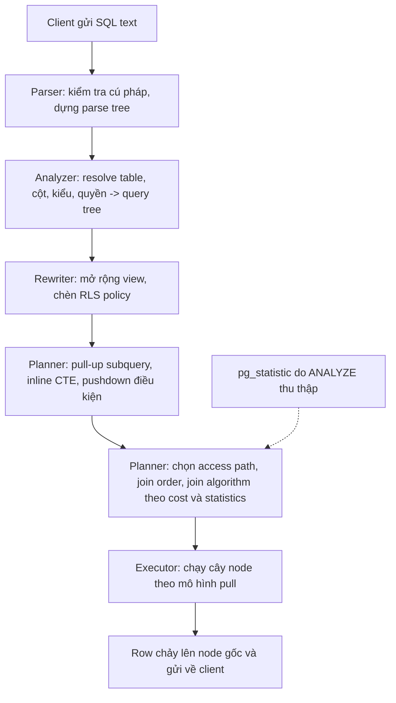
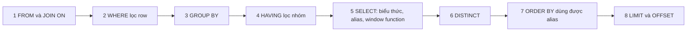
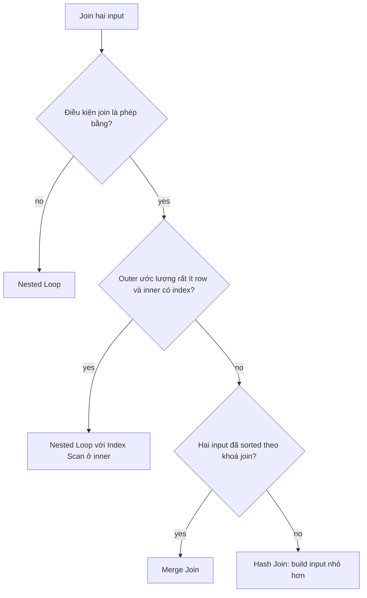

## Bối cảnh & vấn đề

Một developer mới viết câu sau và nhận lỗi ngay:

```sql
SELECT amount * 1.1 AS amount_with_tax
FROM orders
WHERE amount_with_tax > 100;
-- ERROR:  column "amount_with_tax" does not exist
```

Cùng developer đó sau đó viết `ORDER BY amount_with_tax` và nó chạy bình thường. Vì sao alias dùng được ở `ORDER BY` mà không dùng được ở `WHERE`? Một đồng nghiệp khác thì than: "Tôi thêm `LIMIT 10` mà query `GROUP BY` vẫn chạy 8 giây, `LIMIT` vô dụng à?". Một người nữa chuyển một subquery thành CTE cho "dễ đọc" trên Postgres 11 và query chậm đi 50 lần.

Cả ba câu chuyện có chung một gốc: **thứ tự bạn viết SQL không phải thứ tự SQL được hiểu, và thứ tự SQL được hiểu cũng không phải thứ tự nó được chạy**. SQL là ngôn ngữ **khai báo** (declarative): bạn mô tả kết quả muốn có, còn database tự chọn cách tính. Có ba lớp cần phân biệt: (1) cú pháp bạn viết, (2) **logical query processing order**, tức ngữ nghĩa chuẩn định nghĩa mệnh đề nào "thấy" được gì, và (3) **physical plan**, tức các thuật toán cụ thể mà planner chọn, có thể đảo thứ tự, gộp hay bỏ bước miễn là kết quả giống hệt.

Bài này đi qua pipeline bên trong Postgres, rồi logical order và hệ quả của nó, rồi các thuật toán join, rồi hai công cụ viết query mạnh nhất là **window function** và **CTE**. Cách đọc `EXPLAIN` chi tiết nằm ở [Planner & EXPLAIN](/tracks/sql-postgres/learn/planner-explain).

## Khái niệm

### Pipeline: parser, analyzer, rewriter, planner, executor

Khi một câu SQL tới server, backend process xử lý nó qua năm giai đoạn. **Parser** chỉ kiểm tra cú pháp và dựng **parse tree**; nó chưa biết table `orders` có tồn tại hay không. **Analyzer** (semantic analysis) tra system catalog để resolve tên table, cột, hàm, kiểu dữ liệu, kiểm tra quyền, và tạo ra **query tree**. Lỗi `column "amount_with_tax" does not exist` phát sinh ở đây.

**Rewriter** áp dụng **rule system**: mở rộng view thành định nghĩa của nó và chèn điều kiện của **row-level security** policy. Lưu ý: trong Postgres, các tối ưu như đẩy điều kiện `WHERE` xuống (predicate pushdown), kéo subquery lên thành join (subquery pull-up) hay inline CTE **không** nằm ở rewriter mà nằm ở planner. **Planner** (optimizer) sinh ra nhiều cách thực thi, ước lượng **cost** của mỗi cách dựa trên **statistics** (số row, phân bố giá trị do `ANALYZE` thu thập), và chọn cách rẻ nhất. **Executor** chạy plan đó.

Ví dụ: với view `active_orders AS SELECT * FROM orders WHERE status = 'active'`, câu `SELECT * FROM active_orders WHERE id = 42` sau rewriter trở thành một subquery trên `orders`, rồi planner kéo nó lên thành `SELECT * FROM orders WHERE status = 'active' AND id = 42` và chọn Index Scan theo PK.

**Interview angle:** biết rằng "planner là cost-based và phụ thuộc statistics" là nền để trả lời mọi câu "vì sao query chậm / vì sao không dùng index".

### Executor: cây node theo mô hình pull

Plan là một **cây node**. Lá là các node đọc dữ liệu (Seq Scan, Index Scan, Bitmap Heap Scan), các node bên trên kết hợp dữ liệu (Hash Join, Sort, Aggregate, Limit). Executor dùng mô hình **pull** (Volcano/iterator model): node gốc hỏi con "cho tôi row tiếp theo", con lại hỏi cháu, cứ thế xuống tới lá. Row chảy lên từng cái một.

Mô hình này giải thích vì sao `LIMIT` có thể **dừng sớm**: node `Limit` nhận đủ 10 row thì ngừng hỏi, và cả cây phía dưới ngừng theo. Nhưng một số node là **blocking**: `Sort` hay `HashAggregate` phải đọc **hết** input trước khi trả được row đầu tiên, vì row cuối cùng có thể là row nhỏ nhất hoặc thuộc về nhóm đầu tiên. Có `GROUP BY` hoặc `ORDER BY` mà không có index sẵn thứ tự thì `LIMIT` chỉ cắt output, không giảm công tính.

### Logical query processing order

Chuẩn SQL định nghĩa ngữ nghĩa của `SELECT` như thể nó được tính theo thứ tự sau:

1. `FROM` và `JOIN ... ON`: tạo tập row nguồn (tích các table, lọc theo điều kiện join).
2. `WHERE`: lọc **từng row**.
3. `GROUP BY`: gom row thành nhóm.
4. `HAVING`: lọc **từng nhóm**, dùng được aggregate.
5. `SELECT`: tính biểu thức output và **đặt alias**; window function được tính ở bước này.
6. `DISTINCT`: bỏ row trùng.
7. `ORDER BY`: sắp xếp, dùng được alias.
8. `LIMIT` / `OFFSET`: cắt.

Mỗi bước chỉ "thấy" những gì các bước trước tạo ra. Alias sinh ra ở bước 5, nên `WHERE` (bước 2) và `HAVING` (bước 4) không thấy alias, còn `ORDER BY` (bước 7) thì thấy. Window function tính ở bước 5, sau `WHERE`, nên **không thể lọc `WHERE row_number() ... = 1`**; phải bọc trong subquery hoặc CTE rồi lọc ở query ngoài.

Postgres có một mở rộng nhỏ: `GROUP BY` được phép dùng alias hoặc số thứ tự cột output (`GROUP BY 1`), dù chuẩn không cho. `HAVING` thì vẫn không dùng được alias. Và `ORDER BY` chỉ nhận alias **đứng một mình**: `ORDER BY total` được, `ORDER BY total * 2` thì báo lỗi vì biểu thức được resolve theo cột input.

**Interview angle:** đây là câu warm-up rất hay gặp; điểm cộng là nói thêm "đây là thứ tự logic, planner có thể chạy khác miễn kết quả giống".

### WHERE so với HAVING

`WHERE` lọc row **trước** khi gom nhóm, nên nó làm giảm lượng dữ liệu phải aggregate và có thể dùng index. `HAVING` lọc **sau** khi đã aggregate xong, nên chỉ dùng khi điều kiện phụ thuộc vào kết quả aggregate (`HAVING count(*) > 5`). Đặt điều kiện trên cột thường (`status = 'paid'`) vào `HAVING` vẫn cho kết quả đúng nhưng lãng phí; planner của Postgres thường tự đẩy những điều kiện không chứa aggregate từ `HAVING` xuống `WHERE`, nhưng đừng dựa vào điều đó để viết code khó đọc.

Cẩn thận: `HAVING sum(amount) > 100` và `WHERE amount > 100` **không tương đương**. Cái đầu giữ khách có tổng trên 100; cái sau chỉ đếm các đơn lẻ trên 100. Chỉ chuyển điều kiện từ `HAVING` sang `WHERE` khi nó không phụ thuộc aggregate.

### Access path: cách đọc một table

Với mỗi table, planner chọn một **access path**. **Seq Scan** đọc tuần tự mọi page của heap; rẻ khi table nhỏ hoặc khi lấy phần lớn row. **Index Scan** đi B-tree để lấy `ctid` rồi đọc từng row trong heap; tốt khi lấy ít row, nhưng mỗi row có thể là một lần đọc page ngẫu nhiên. **Bitmap Index Scan + Bitmap Heap Scan** gom mọi `ctid` khớp thành một bitmap theo page, rồi đọc heap **theo thứ tự page**, mỗi page một lần; đây là lựa chọn trung gian cho vài trăm tới vài chục nghìn row và kết hợp được nhiều index (`BitmapAnd`, `BitmapOr`). Khi bitmap quá lớn so với `work_mem`, nó trở thành "lossy" (chỉ nhớ page, không nhớ row), nên node heap có dòng `Recheck Cond` để kiểm tra lại điều kiện. **Index Only Scan** trả kết quả chỉ từ index, không đụng heap, khi index chứa đủ cột và page được đánh dấu all-visible trong visibility map.

**Interview angle:** câu `sql-postgres-019` yêu cầu đọc một plan có đủ các node này; hãy giải thích bằng "bao nhiêu row, đọc tuần tự hay ngẫu nhiên".

### Ba thuật toán join

**Nested Loop**: với mỗi row của input ngoài (outer), tìm row khớp trong input trong (inner). Nếu inner có index trên cột join, mỗi lần tìm là một lần tra B-tree, nên tổng chi phí khoảng `outer_rows × log(inner_rows)`. Rất tốt khi outer **ít row** (vài chục, vài trăm) và inner có index; thảm hoạ khi planner tưởng outer có 1 row mà thực tế có 500.000 (`loops=500000` trong `EXPLAIN ANALYZE`). Nested Loop là thuật toán duy nhất xử lý được join không phải phép bằng (`ON a.ts BETWEEN b.start AND b.end`).

**Hash Join**: đọc hết input nhỏ hơn (build side) và dựng **hash table** trong RAM theo khoá join, rồi quét input còn lại (probe side), mỗi row tra hash một lần. Chi phí khoảng `build + probe`, tuyến tính. Tốt cho join lớn không có index phù hợp, chỉ dùng cho điều kiện bằng. Hash table bị giới hạn bởi `work_mem × hash_mem_multiplier`; vượt quá thì chia batch và **spill ra disk** (`Batches: 8` trong plan).

**Merge Join**: cả hai input được sắp theo khoá join, rồi đi song song như trộn hai danh sách đã sort. Tốt khi cả hai phía **đã có thứ tự sẵn** (từ index, hoặc output cần sort theo khoá đó), hoặc khi hai input quá lớn cho hash. Nếu phải sort cả hai từ đầu thì thường thua Hash Join.

| Thuật toán | Cần gì | Thắng khi | Dấu hiệu xấu |
|---|---|---|---|
| Nested Loop | Index trên inner (thực tế) | Outer rất ít row | `loops` rất lớn ở inner |
| Hash Join | Điều kiện `=`, RAM cho build side | Join lớn, không index | `Batches > 1`, disk spill |
| Merge Join | Hai input sorted theo khoá | Input đã có thứ tự, rất lớn | Sort lớn trước merge |

**Interview angle:** interviewer hay hỏi tiếp "cùng query mà Nested Loop với loops=50000 thì sao?" Trả lời: estimate sai (statistics cũ, cột tương quan), fix bằng `ANALYZE`, extended statistics, hoặc viết lại query.

### Aggregation: HashAggregate và GroupAggregate

`GROUP BY` có hai cách chạy. **HashAggregate** giữ một hash table, mỗi nhóm một entry, đọc input một lượt; nhanh nhưng tốn RAM theo số nhóm (từ PG 13 có thể spill ra disk (verify)). **GroupAggregate** cần input đã sort theo khoá nhóm, rồi gom các row liền nhau; nếu input đến từ một index đúng thứ tự thì nó **stream** được, và khi đó `GROUP BY ... LIMIT 10` có thể dừng sau 10 nhóm. Không có thứ tự sẵn thì cả hai cách đều phải đọc toàn bộ input.

### Window function

**Window function** tính một giá trị cho **mỗi row** dựa trên một "cửa sổ" các row liên quan, mà **không gộp** các row lại. Cú pháp: `f(...) OVER (PARTITION BY ... ORDER BY ... frame)`. `PARTITION BY` chia row thành nhóm độc lập (giống `GROUP BY` nhưng không gộp); `ORDER BY` trong `OVER` sắp thứ tự bên trong partition; **frame** xác định row nào trong partition thuộc cửa sổ của row hiện tại.

Khác biệt cốt lõi với `GROUP BY`: `GROUP BY customer` trả **một row mỗi khách**; `sum(amount) OVER (PARTITION BY customer)` trả **mọi row đơn hàng**, mỗi row mang thêm tổng của khách đó. Dùng window khi bạn cần cả chi tiết lẫn giá trị tổng hợp trên cùng một row: running total, xếp hạng, top-N mỗi nhóm, so sánh với row trước (`lag`), phần trăm đóng góp.

Ba hàm xếp hạng khác nhau ở cách xử lý **tie** (giá trị bằng nhau): `row_number()` luôn đánh 1, 2, 3 (tie thì thứ tự tuỳ ý nếu không thêm khoá phụ); `rank()` cho tie cùng hạng và **nhảy số** (1, 1, 3); `dense_rank()` cho tie cùng hạng và **không nhảy** (1, 1, 2).

Frame mặc định khi có `ORDER BY` là `RANGE BETWEEN UNBOUNDED PRECEDING AND CURRENT ROW`: "từ đầu partition tới row hiện tại **và mọi row ngang hàng với nó**". Vì vậy running total theo ngày sẽ cộng gộp các đơn cùng ngày. Muốn cộng từng row một, viết rõ `ROWS BETWEEN UNBOUNDED PRECEDING AND CURRENT ROW`.

**Interview angle:** câu `sql-postgres-012` và follow-up về `ROW_NUMBER`/`RANK`/`DENSE_RANK` với tie; nêu thêm `DISTINCT ON` là điểm cộng Postgres.

### CTE: WITH query

**CTE** (Common Table Expression) là một subquery có tên, khai báo bằng `WITH name AS (...)`, dùng để chia query dài thành các bước dễ đọc. Câu hỏi hiệu năng là: planner xử lý CTE như một subquery bình thường (**inline**, tối ưu cùng query ngoài) hay tính nó riêng một lần rồi lưu kết quả tạm (**materialize**)?

Trước **PG 12**, Postgres **luôn materialize** CTE. Điều này biến CTE thành **optimization fence**: điều kiện ở query ngoài không được đẩy vào trong, nên `WITH x AS (SELECT * FROM orders) SELECT * FROM x WHERE id = 42` đọc cả table rồi mới lọc. Từ **PG 12**, CTE không đệ quy, không có side effect và chỉ được tham chiếu **một lần** sẽ được inline tự động. CTE tham chiếu **hai lần trở lên** vẫn materialize mặc định (để không tính lại). Bạn điều khiển bằng `WITH x AS MATERIALIZED (...)` hoặc `AS NOT MATERIALIZED (...)`.

CTE có `INSERT`/`UPDATE`/`DELETE` (**data-modifying CTE**) luôn chạy đúng một lần, bất kể được tham chiếu hay không. SQL Server thì khác: CTE luôn được inline, tham chiếu hai lần là tính hai lần, và không có hint materialize (phải dùng temp table).

### Recursive CTE

`WITH RECURSIVE` cho phép một CTE tham chiếu chính nó, dùng để duyệt cây và đồ thị: cây danh mục, sơ đồ tổ chức, chuỗi referral. Nó gồm một **anchor** (row khởi đầu), `UNION ALL`, và một **recursive term** join với kết quả của vòng trước. Postgres lặp tới khi recursive term không sinh thêm row nào. Dữ liệu có chu trình sẽ lặp vô hạn; phòng bằng cột `path` và điều kiện dừng, hoặc mệnh đề `CYCLE` từ PG 14.

## Cơ chế hoạt động

### Từ chuỗi SQL tới row trả về



Sơ đồ cho thấy lỗi xảy ra ở đâu. Lỗi cú pháp (`syntax error at or near`) đến từ Parser. Lỗi tên (`column ... does not exist`, `permission denied`) đến từ Analyzer. Hai hộp Planner là nơi quyết định hiệu năng: hộp đầu biến đổi cấu trúc query (đó là lý do một CTE được inline có thể nhanh như subquery), hộp sau dùng statistics (mũi tên nét đứt) để ước lượng số row của mỗi bước và chọn plan rẻ nhất. Statistics sai thì plan sai, dù SQL hoàn toàn đúng. Với **prepared statement**, bước Parser tới Rewriter chỉ chạy một lần; Planner có thể chạy lại cho từng bộ tham số (custom plan) hoặc dùng một **generic plan** chung sau vài lần thực thi.

### Logical order và cái mỗi bước thấy được



Đọc từ trái sang phải: mỗi hộp chỉ dùng được những gì các hộp bên trái tạo ra. Window function nằm ở hộp 5, tức là sau `WHERE`, `GROUP BY` và `HAVING`: nó thấy các row **đã được lọc và đã gom nhóm**. Điều này có hai hệ quả thực tế. Thứ nhất, bạn có thể dùng window trên kết quả aggregate, ví dụ `rank() OVER (ORDER BY sum(amount) DESC)` trong một query có `GROUP BY`. Thứ hai, muốn lọc theo kết quả window thì phải thêm một tầng query bọc ngoài.

Physical plan có thể khác hoàn toàn: planner có thể đọc index theo thứ tự `ORDER BY` rồi mới lọc, hoặc dừng sớm nhờ `LIMIT`. Nhưng kết quả **phải** giống như khi chạy theo thứ tự logic.

### Planner chọn join algorithm như thế nào



Đây là trực giác, không phải luật cứng: planner thực tế tính cost cho mọi phương án hợp lệ rồi chọn cái rẻ nhất. Điểm quan trọng nhất là nhánh thứ hai phụ thuộc vào **ước lượng** số row. Nếu ước lượng là 1 row mà thực tế là 480.000, planner vẫn đi nhánh Nested Loop và query chạy hàng chục giây. Đây là lỗi hiệu năng phổ biến nhất ở Postgres, và nó bắt nguồn từ statistics, không phải từ SQL.

## Ví dụ thực tế

Tạo một table nhỏ để chạy toàn bộ ví dụ:

```sql
CREATE TABLE orders (
  id         int PRIMARY KEY,
  customer   text NOT NULL,
  created_at date NOT NULL,
  amount     int  NOT NULL
);
INSERT INTO orders VALUES
  (1, 'an',   '2026-01-01', 100),
  (2, 'an',   '2026-01-03', 250),
  (3, 'an',   '2026-01-07', 250),
  (4, 'binh', '2026-01-02', 300),
  (5, 'binh', '2026-01-05',  50),
  (6, 'chi',  '2026-01-04', 400);
```

### GROUP BY, HAVING và lỗi alias

```sql
SELECT customer, count(*) AS n, sum(amount) AS total
FROM orders
GROUP BY customer
HAVING sum(amount) > 380
ORDER BY total DESC;
```

```text
 customer | n | total
----------+---+-------
 an       | 3 |   600
 chi      | 1 |   400
```

`binh` (tổng 350) bị `HAVING` loại. `ORDER BY total` dùng alias hợp lệ. Nếu viết `HAVING total > 380`, Postgres báo `ERROR: column "total" does not exist` vì `HAVING` chạy trước `SELECT`.

### Window: running total và ba hàm xếp hạng

```sql
SELECT customer, created_at, amount,
       sum(amount) OVER (PARTITION BY customer ORDER BY created_at) AS running_total,
       row_number() OVER w AS rn,
       rank()       OVER w AS rnk,
       dense_rank() OVER w AS drnk
FROM orders
WINDOW w AS (PARTITION BY customer ORDER BY amount DESC)
ORDER BY customer, created_at;
```

```text
 customer | created_at | amount | running_total | rn | rnk | drnk
----------+------------+--------+---------------+----+-----+------
 an       | 2026-01-01 |    100 |           100 |  3 |   3 |    2
 an       | 2026-01-03 |    250 |           350 |  1 |   1 |    1
 an       | 2026-01-07 |    250 |           600 |  2 |   1 |    1
 binh     | 2026-01-02 |    300 |           300 |  1 |   1 |    1
 binh     | 2026-01-05 |     50 |           350 |  2 |   2 |    2
 chi      | 2026-01-04 |    400 |           400 |  1 |   1 |    1
```

Sáu row vào, sáu row ra: window không gộp gì. `running_total` cộng dồn theo ngày trong từng khách. Ở khách `an`, hai đơn 250 là tie: `rank` cho cả hai hạng 1 và đơn 100 nhảy lên hạng **3**; `dense_rank` cho đơn 100 hạng **2**; `row_number` phân biệt hai đơn 250 một cách tuỳ ý (ở đây ra 1 và 2, nhưng không được đảm bảo; thêm `, id` vào `ORDER BY` của window để cố định).

### Top-1 mỗi nhóm

```sql
SELECT id, customer, amount
FROM (
  SELECT o.*, row_number() OVER (PARTITION BY customer ORDER BY amount DESC, id) AS rn
  FROM orders o
) t
WHERE rn = 1
ORDER BY customer;

-- Cách riêng của Postgres, cùng kết quả:
SELECT DISTINCT ON (customer) id, customer, amount
FROM orders
ORDER BY customer, amount DESC, id;
```

```text
 id | customer | amount
----+----------+--------
  2 | an       |    250
  4 | binh     |    300
  6 | chi      |    400
```

Phải bọc subquery vì window tính sau `WHERE`. Đổi `rn = 1` thành `rn <= 3` là có top-3 mỗi khách; `DISTINCT ON` chỉ làm được top-1. Trên table lớn, index `(customer, amount DESC, id)` giúp cả hai cách tránh sort toàn bộ.

### CTE: inline so với MATERIALIZED

```sql
EXPLAIN WITH big AS (SELECT * FROM orders)
SELECT * FROM big WHERE id = 4;

EXPLAIN WITH big AS MATERIALIZED (SELECT * FROM orders)
SELECT * FROM big WHERE id = 4;
```

```text
-- PG 12+, mặc định (inline):
 Index Scan using orders_pkey on orders  (cost=0.15..8.17 rows=1 width=44)
   Index Cond: (id = 4)

-- MATERIALIZED (giống hành vi mọi CTE trước PG 12):
 CTE Scan on big  (cost=22.70..51.28 rows=6 width=44)
   Filter: (id = 4)
   CTE big
     ->  Seq Scan on orders  (cost=0.00..22.70 rows=1270 width=44)
```

Plan đầu không còn dấu vết của CTE: điều kiện `id = 4` đã được đẩy vào và dùng PK. Plan sau tính toàn bộ CTE bằng Seq Scan, lưu vào bộ nhớ tạm, rồi mới lọc. Con số cost cụ thể sẽ khác trên máy bạn (table chưa `ANALYZE` nên planner giả định khoảng 1.270 row).

### Recursive CTE: duyệt cây danh mục

```sql
CREATE TABLE categories (id int PRIMARY KEY, parent_id int, name text);
INSERT INTO categories VALUES
  (1, NULL, 'Electronics'), (2, 1, 'Phones'), (3, 2, 'Android'), (4, 1, 'Laptops');

WITH RECURSIVE tree AS (
  SELECT id, name, 1 AS depth, name AS path
  FROM categories WHERE parent_id IS NULL          -- anchor
  UNION ALL
  SELECT c.id, c.name, t.depth + 1, t.path || ' > ' || c.name
  FROM categories c JOIN tree t ON c.parent_id = t.id   -- recursive term
)
SELECT * FROM tree ORDER BY path;
```

```text
 id |    name     | depth |              path
----+-------------+-------+--------------------------------
  1 | Electronics |     1 | Electronics
  4 | Laptops     |     2 | Electronics > Laptops
  2 | Phones      |     2 | Electronics > Phones
  3 | Android     |     3 | Electronics > Phones > Android
```

Vòng 1 trả `Electronics`; vòng 2 tìm con của nó (`Phones`, `Laptops`); vòng 3 tìm con của `Phones` (`Android`); vòng 4 không sinh row nào nên dừng.

## Trade-offs & lựa chọn thay thế

| Nhu cầu | Cách A | Cách B | Khi nào chọn gì |
|---|---|---|---|
| Tổng hợp theo nhóm | `GROUP BY` | Window `OVER (PARTITION BY)` | `GROUP BY` khi chỉ cần một row mỗi nhóm; window khi cần giữ row chi tiết |
| Top-1 mỗi nhóm | `row_number()` + subquery | `DISTINCT ON` | `DISTINCT ON` gọn, chỉ Postgres, chỉ top-1; `row_number` portable, làm được top-N |
| Top-N mỗi nhóm trên table lớn | Window trên toàn table | `LATERAL (... ORDER BY ... LIMIT n)` mỗi nhóm | `LATERAL` + index nhanh hơn nhiều khi số nhóm ít và mỗi nhóm có rất nhiều row |
| Chia nhỏ query | CTE | Subquery / view | Từ PG 12 hiệu năng như nhau khi CTE được inline; CTE dễ đọc hơn |
| Tính một lần dùng nhiều lần | CTE `MATERIALIZED` | Temp table + `ANALYZE` | Temp table khi kết quả lớn và cần statistics hoặc index cho bước sau |
| Tie trong xếp hạng | `rank` | `dense_rank` / `row_number` | `rank` kiểu bảng xếp hạng thể thao; `dense_rank` cho "top 3 mức giá"; `row_number` khi cần đúng một row |
| Top-N có tie | `LIMIT n` | `FETCH FIRST n ROWS WITH TIES` | `WITH TIES` (PG 13+) khi muốn giữ các row bằng row thứ n, giống `TOP n WITH TIES` của SQL Server |

Khi nào nên cố ý dùng `MATERIALIZED`? Khi CTE chứa một hàm đắt hoặc volatile mà bạn muốn chạy đúng một lần; khi inline làm planner chọn plan tệ và bạn muốn "chốt" một bước trung gian nhỏ; hoặc khi CTE là tập nhỏ được dùng để lọc một table lớn và bạn muốn nó được tính trước. Ngược lại, dùng `NOT MATERIALIZED` khi một CTE được tham chiếu hai lần nhưng mỗi lần có điều kiện chọn lọc khác nhau, để mỗi lần được đẩy điều kiện riêng vào.

## Edge cases & failure modes

- **LEFT JOIN bị biến thành INNER JOIN.** `FROM customers c LEFT JOIN orders o ON o.customer_id = c.id WHERE o.status = 'paid'`: khách không có đơn có `o.status` là NULL, và `WHERE` loại họ. Điều kiện trên bảng bên phải phải đặt trong `ON` nếu muốn giữ mọi khách.
- **`LIMIT` không có `ORDER BY`.** Kết quả không xác định: heap không có thứ tự, và plan có thể đổi (parallel scan, synchronized scan). Phân trang bằng `LIMIT/OFFSET` mà thiếu `ORDER BY` trên khoá duy nhất sẽ trả row trùng hoặc thiếu ([Access patterns](/tracks/sql-postgres/learn/access-patterns)).
- **`ORDER BY` không có khoá phụ duy nhất.** `ORDER BY created_at LIMIT 20` với nhiều row cùng timestamp cho kết quả không ổn định giữa các lần gọi. Thêm `, id`.
- **`NOT IN` với NULL.** `WHERE id NOT IN (SELECT customer_id FROM blacklist)` trả **0 row** nếu subquery có một NULL, vì `x <> NULL` là unknown. Dùng `NOT EXISTS`.
- **Estimate sai làm Nested Loop bùng nổ.** Planner ước lượng 1 row cho outer, thực tế 500.000; plan "Nested Loop + Index Scan" chạy 40 giây thay vì Hash Join 300 ms. Nguyên nhân thường là statistics cũ sau bulk load, hoặc các cột tương quan (`city` và `country`). Fix: `ANALYZE`, `CREATE STATISTICS`, tăng `default_statistics_target` cho cột đó.
- **Hash/Sort spill ra disk.** Join hay sort lớn vượt `work_mem` sẽ ghi file tạm; `EXPLAIN ANALYZE` hiện `Sort Method: external merge Disk: 512MB` hoặc `Batches: 16`. Tăng `work_mem` cho riêng session đó (`SET LOCAL`), không tăng toàn cục vì mỗi node của mỗi query có thể dùng nhiều lần `work_mem`.
- **Recursive CTE vô hạn.** Dữ liệu cây bị lỗi tạo chu trình (A là cha B, B là cha A) làm query chạy tới khi hết disk tạm. Luôn có điều kiện dừng (`WHERE depth < 20`), dùng `CYCLE` (PG 14+), và đặt `statement_timeout`.
- **CTE được tham chiếu hai lần.** Vẫn materialize mặc định ở PG 12+, nên có thể mất pushdown mà bạn không để ý. Kiểm tra bằng `EXPLAIN`, thêm `NOT MATERIALIZED` nếu cần.
- **Window trên toàn bảng lớn.** `row_number() OVER (PARTITION BY customer ORDER BY created_at DESC)` trên 200M row phải sort toàn bộ; lọc `rn = 1` ở ngoài không giúp giảm công sort. Cần index đúng thứ tự hoặc chuyển sang `LATERAL ... LIMIT 1`.

## Pitfalls

- ❌ Dùng alias `SELECT` trong `WHERE`/`HAVING` → ✅ lặp lại biểu thức, hoặc bọc subquery/CTE rồi lọc ở ngoài; alias chỉ dùng được ở `ORDER BY` (và `GROUP BY` trong Postgres).
- ❌ Đặt điều kiện không chứa aggregate vào `HAVING` → ✅ đặt vào `WHERE` để lọc trước khi gom nhóm và dùng được index.
- ❌ Tin rằng thêm `LIMIT` luôn làm query `GROUP BY`/`ORDER BY` nhanh → ✅ `LIMIT` chỉ dừng sớm khi không có node blocking phía dưới, thường nhờ một index cho sẵn thứ tự.
- ❌ Lọc `WHERE row_number() OVER (...) = 1` → ✅ window tính sau `WHERE`; dùng subquery, hoặc `DISTINCT ON`.
- ❌ Dùng `row_number()` cho "top 3 mức giá" khi có tie → ✅ chọn `rank`/`dense_rank` theo đúng nghĩa nghiệp vụ, và luôn thêm khoá phụ cho `row_number`.
- ❌ Mặc định CTE là optimization fence (kiến thức PG 11) hoặc mặc định nó luôn được inline → ✅ PG 12+ inline khi tham chiếu một lần và không side effect; kiểm tra bằng `EXPLAIN`, điều khiển bằng `MATERIALIZED`/`NOT MATERIALIZED`.
- ❌ Running total theo ngày dùng frame mặc định rồi ngạc nhiên vì các row cùng ngày có cùng giá trị → ✅ `ROWS BETWEEN UNBOUNDED PRECEDING AND CURRENT ROW` cộng từng row.
- ❌ Đổ lỗi cho SQL khi plan tệ → ✅ so `rows` ước lượng với `actual rows` trong `EXPLAIN ANALYZE`; thường statistics mới là thủ phạm ([Planner & EXPLAIN](/tracks/sql-postgres/learn/planner-explain)).

## Tóm tắt

- Pipeline: **Parser** (cú pháp) → **Analyzer** (tên, kiểu, quyền) → **Rewriter** (view, RLS) → **Planner** (biến đổi + chọn plan theo cost và statistics) → **Executor** (cây node, mô hình pull).
- Logical order: `FROM/JOIN` → `WHERE` → `GROUP BY` → `HAVING` → `SELECT` (alias, window) → `DISTINCT` → `ORDER BY` → `LIMIT`. Alias không dùng được ở `WHERE`/`HAVING`, dùng được ở `ORDER BY`.
- Physical plan có thể khác logical order; `LIMIT` chỉ dừng sớm khi không có node blocking (Sort, HashAggregate) phía dưới.
- Access path: Seq Scan (nhiều row), Index Scan (ít row), Bitmap Heap Scan (trung gian, đọc heap theo thứ tự page), Index Only Scan (không đụng heap).
- Join: **Nested Loop** khi outer ít row và inner có index; **Hash Join** cho join lớn với phép bằng; **Merge Join** khi input đã sorted. Estimate sai là nguyên nhân số một của plan tệ.
- `GROUP BY` gộp row; **window function** giữ từng row và thêm giá trị tính trên cửa sổ. `row_number` / `rank` / `dense_rank` khác nhau ở tie: 1-2-3 / 1-1-3 / 1-1-2.
- CTE: trước PG 12 luôn materialize (fence); PG 12+ inline nếu không đệ quy, không side effect, tham chiếu một lần; điều khiển bằng `MATERIALIZED` / `NOT MATERIALIZED`. SQL Server luôn inline.
- `WITH RECURSIVE` = anchor + `UNION ALL` + recursive term; luôn có điều kiện dừng.
