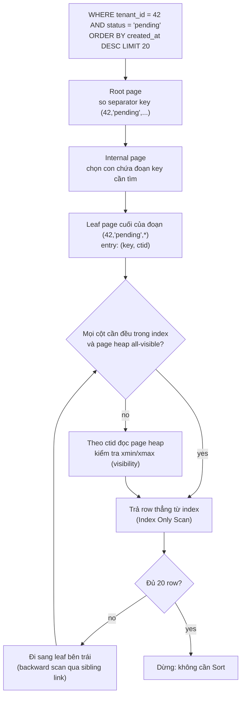
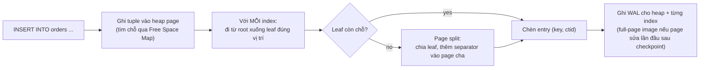

## Bối cảnh & vấn đề

Hãy bắt đầu bằng một câu chuyện rất thường gặp. Bảng `orders` của một hệ thống multi-tenant có 200 triệu row, khoảng 60 GB dữ liệu. Endpoint "danh sách đơn hàng của tenant, lọc theo trạng thái, mới nhất trước" chạy câu sau:

```sql
SELECT id, total, created_at
FROM orders
WHERE tenant_id = 42 AND status = 'pending'
ORDER BY created_at DESC
LIMIT 20;
```

Không có index phù hợp, Postgres chỉ có một cách: đọc **toàn bộ** 60 GB (một `Seq Scan`), giữ lại những row khớp, rồi sort chúng để lấy 20 row đầu. Nếu dữ liệu nằm trên disk, đó là hàng chục giây. Nếu nằm trong RAM, vẫn là vài giây CPU cho mỗi request. Với 200 request/giây, database chết.

Thêm đúng một index, câu này chạy dưới 1 ms và chỉ đọc khoảng 5–25 page 8 KB. Thêm **sai** index (sai thứ tự cột, bọc hàm lên cột, sai kiểu dữ liệu), câu này vẫn chạy seq scan, còn mỗi `INSERT` lại chậm thêm vì phải cập nhật một index vô dụng. Khoảng cách giữa hai kết quả đó là toàn bộ nội dung bài này: index là gì về mặt vật lý, nó giúp những query nào, nó tốn gì, và làm sao để thiết kế index theo đúng hình dạng của query.

Bài này tập trung vào **B-tree**, loại index mặc định của Postgres (`CREATE INDEX` không ghi `USING` thì là B-tree) và là loại bạn dùng cho 90% trường hợp. Các loại khác (GIN, GiST, BRIN) nằm ở bài [GIN, GiST, BRIN và JSONB](/tracks/sql-postgres/learn/index-types-jsonb). Cách planner quyết định có dùng index hay không nằm ở bài [Query planner & đọc EXPLAIN](/tracks/sql-postgres/learn/planner-explain). Cách Postgres lưu table (heap, page 8 KB) được giải thích ở bài [Storage & WAL](/tracks/sql-postgres/learn/storage-wal).

## Khái niệm

### Index là gì: từ cuốn danh bạ đến cấu trúc thật

Tưởng tượng một cuốn sổ ghi tên khách hàng theo **thứ tự họ đến cửa hàng**. Muốn tìm "Nguyễn Văn Zack", bạn phải lật từng trang. Đó chính là **heap** của Postgres: row được ghi vào chỗ trống nào đó trong file của table, không theo thứ tự nào có ý nghĩa. Giờ bạn làm thêm một cuốn **danh bạ**: chỉ ghi tên (đã sắp xếp theo alphabet) và số trang trong cuốn sổ gốc. Tìm "Zack" trong danh bạ rất nhanh vì nó đã sắp xếp, rồi bạn lật thẳng tới đúng trang trong sổ gốc.

Index trong Postgres đúng là cuốn danh bạ đó. Nó là một **cấu trúc dữ liệu riêng** (một file riêng trên disk), chứa **giá trị của cột được index** (gọi là **key**) đã sắp xếp, và với mỗi key là một con trỏ tới row trong heap. Con trỏ này gọi là **TID** hay **`ctid`**: một cặp `(block number, offset)`, ví dụ `(7, 3)` nghĩa là "page số 7 của file table, item thứ 3 trong page đó". Nó không phải địa chỉ bộ nhớ và không phải primary key.

Điểm cần khắc sâu: trong Postgres, **mọi index đều là secondary index**, kể cả index của primary key. Table luôn là heap không sắp xếp, và index PK cũng chỉ là một B-tree trỏ vào heap bằng `ctid`. Đây là khác biệt lớn với SQL Server và MySQL InnoDB, nơi **clustered index** chính là table (leaf page chứa cả row). Lệnh `CLUSTER` của Postgres chỉ sắp xếp lại heap **một lần** theo một index, không duy trì thứ tự khi có dữ liệu mới.

```sql
SELECT ctid, id, email FROM users LIMIT 3;
--  ctid  | id |      email
-- -------+----+-----------------
--  (0,1) |  1 | an@example.com
--  (0,2) |  2 | binh@example.com
--  (0,3) |  3 | chi@example.com
```

**Interview angle:** câu "PK index ở Postgres có phải clustered không?" là bẫy phổ biến cho người từ SQL Server. Câu trả lời đúng: không, Postgres không có clustered index; mọi index trỏ tới `ctid` trong heap.

### Cấu trúc B-tree: root, internal, leaf

**B-tree** (chính xác hơn là biến thể B+tree theo thuật toán Lehman–Yao) là một cây **cân bằng**: mọi leaf đều ở cùng độ sâu. Mỗi node của cây là một **page 8 KB**, cùng kích thước page với heap. Có ba loại page:

- **Root page**: điểm bắt đầu của mọi lần tìm kiếm. Chứa các "separator key" và con trỏ xuống page con.
- **Internal page** (branch): giống root, mỗi entry nói "key từ X trở lên thì đi xuống page con này".
- **Leaf page**: chứa các index tuple thật `(key, ctid)` đã sắp xếp. Các leaf page được **nối với nhau** thành danh sách liên kết hai chiều (trỏ sang page trái và page phải), nên một range scan chỉ cần tìm leaf đầu tiên rồi đi ngang, không phải quay lại root.

Vì mỗi page 8 KB chứa được vài trăm entry, cây rất **rộng và thấp**. Đây là lý do B-tree thắng cây nhị phân cho database: cây nhị phân với 100 triệu phần tử cao khoảng 27 tầng (27 lần đọc page ngẫu nhiên), còn B-tree với fan-out khoảng 300–400 chỉ cao 3–4 tầng.

Ví dụ ngắn với số thật: index `bigint` trên 100 triệu row. Mỗi index tuple khoảng 16 byte cộng 4 byte line pointer, nên một leaf page chứa khoảng 350–400 entry (fillfactor mặc định 90% cho leaf). 100M / 370 ≈ 270.000 leaf page (≈ 2,1 GB). Tầng trên: 270.000 / 400 ≈ 680 page. Tầng trên nữa: 2 page. Rồi root. Tổng cộng **4 tầng**: một lần tìm `id = 12345` đọc 4 page index + 1 page heap. Root và internal page gần như luôn nằm trong `shared_buffers` (tổng chỉ vài MB), nên trên thực tế thường chỉ có 1–2 lần đọc thật từ disk.

**Interview angle:** người phỏng vấn muốn nghe "O(log n) tính bằng **page read**, với fan-out hàng trăm nên 3–4 tầng cho hàng trăm triệu row", chứ không phải "O(log n) vì là cây".

### B-tree hỗ trợ những operator nào

Vì leaf đã sắp xếp, B-tree trả lời được mọi câu hỏi dựa trên **thứ tự**:

- So sánh: `=`, `<`, `<=`, `>`, `>=`, `BETWEEN`, `IN (...)`, `= ANY($1)`.
- `IS NULL` / `IS NOT NULL`: Postgres B-tree **có** index NULL (khác Oracle).
- `ORDER BY col` (có hoặc không có `LIMIT`): đọc leaf theo thứ tự, không cần node `Sort`. B-tree đọc được **cả hai chiều**, nên index `(created_at)` phục vụ luôn `ORDER BY created_at DESC`. Chỉ cần khai báo `DESC` trong index khi sort **trộn chiều** trên nhiều cột, ví dụ `ORDER BY a ASC, b DESC` cần index `(a, b DESC)`.
- `min(col)` / `max(col)`: đi thẳng tới đầu hoặc cuối cây.
- Prefix `LIKE 'abc%'`: chỉ khi cột dùng collation `C`, hoặc index được tạo với operator class `text_pattern_ops` / `varchar_pattern_ops`. Với collation mặc định như `en_US.UTF-8`, thứ tự sắp xếp theo ngôn ngữ không khớp với thứ tự byte của prefix, nên planner không dùng được.

B-tree **không** giúp: `LIKE '%abc'` hay `LIKE '%abc%'` (không có prefix để seek; dùng `pg_trgm` + GIN), điều kiện trên hàm của cột khi index là cột thô, containment trong `jsonb` hay array (dùng GIN), và overlap của range (dùng GiST).

**Interview angle:** "index có giúp `ORDER BY created_at DESC` không nếu index là ASC?" Có, backward scan. Người trả lời "phải tạo index DESC" đang lộ ra một hiểu lầm phổ biến.

### Chi phí của index

Index không miễn phí. Mỗi index là một **bản sao có sắp xếp** của một phần dữ liệu, và bản sao đó phải luôn đồng bộ:

- **Mỗi `INSERT`** phải chèn một entry vào **mọi** index của table. Table có 8 index thì một `INSERT` là 1 lần ghi heap + 8 lần ghi index, mỗi lần đều sinh **WAL** (write-ahead log). Page index vừa bị sửa lần đầu sau checkpoint còn phải ghi nguyên page vào WAL (full-page write).
- **Mỗi `UPDATE`** trong Postgres tạo một phiên bản row mới ở vị trí mới (MVCC, xem bài [MVCC & VACUUM](/tracks/sql-postgres/learn/mvcc-vacuum)). Nếu không phải **HOT update**, Postgres phải thêm entry mới vào **mọi** index, kể cả index trên cột không đổi. HOT chỉ xảy ra khi không cột indexed nào đổi **và** page còn chỗ. Mỗi index thêm vào là một cột nữa có thể phá HOT.
- **Bloat**: entry trỏ tới row đã chết vẫn nằm trong index tới khi VACUUM dọn. Page index trống một phần không trả lại cho OS; muốn thu nhỏ phải `REINDEX CONCURRENTLY` (PG 12+).
- **Page split**: khi leaf đầy, Postgres chia nó thành hai page và thêm separator vào page cha. Key tăng dần (`bigint identity`, UUIDv7) luôn chèn vào leaf bên phải nhất; key ngẫu nhiên (UUIDv4) chèn khắp cây, gây nhiều split và làm cache kém hiệu quả.
- **Dung lượng và RAM**: index cạnh tranh `shared_buffers` với dữ liệu. Index không ai dùng vẫn chiếm cache mỗi khi bị ghi.

Kiểm tra index không được dùng bằng `pg_stat_user_indexes.idx_scan` (xem trên **tất cả** replica trước khi xoá, vì thống kê là riêng từng server).

**Interview angle:** red flag kinh điển là "càng nhiều index càng nhanh". Câu trả lời senior nói được chi phí ghi (write amplification, WAL, mất HOT, bloat) và cách đo index thừa.

### Composite index và quy tắc leftmost prefix

**Composite index** (multicolumn index) là index trên nhiều cột, ví dụ `(tenant_id, status, created_at)`. Entry được sắp xếp như sắp từ điển: trước hết theo `tenant_id`, trong cùng `tenant_id` thì theo `status`, trong cùng `status` thì theo `created_at`. Hình dung danh bạ sắp theo (tỉnh, họ, tên): tìm "mọi người họ Nguyễn ở Huế" rất nhanh, nhưng tìm "mọi người tên An ở mọi tỉnh" thì danh bạ gần như vô dụng.

Từ đó sinh ra **quy tắc leftmost prefix**: index dùng được để **seek** (nhảy thẳng tới một đoạn liên tục của leaf) khi query có điều kiện trên một **tiền tố** các cột từ trái sang. Theo tài liệu Postgres, các điều kiện equality trên những cột đầu, cộng với điều kiện range trên **cột đầu tiên không phải equality**, xác định đoạn index cần quét. Điều kiện trên các cột **sau** cột range vẫn được kiểm tra trong index (lọc bớt trước khi đọc heap) nhưng không thu hẹp đoạn quét.

Vì vậy quy tắc thiết kế thực dụng là: **equality trước → range sau → cột sort cuối cùng** (thường range và sort là cùng một cột, như `created_at`). Quy tắc "cột selective nhất đặt đầu" không phải luật: điều quan trọng là **hình dạng query**. Một cột ít giá trị như `status` đặt giữa vẫn rất tốt nếu query luôn lọc `status = ?`.

Từ PG 18, B-tree có **skip scan**: khi query thiếu điều kiện trên cột đầu nhưng cột đầu có ít giá trị distinct, planner có thể "nhảy" qua từng giá trị của cột đầu (verify). Đó là điểm cộng, nhưng đừng thiết kế index dựa vào nó.

**Interview angle:** red flag là "thứ tự cột không quan trọng, planner tự sắp lại". Planner sắp lại **điều kiện trong WHERE**, nhưng không sắp lại **cột trong index**.

### Covering index, INCLUDE và Index Only Scan

Một **Index Scan** bình thường làm hai bước: tìm entry trong index, rồi theo `ctid` đọc row từ heap để lấy các cột còn lại. Bước thứ hai là random I/O, và với 10.000 row thì là tới 10.000 lần đọc page heap.

Nếu index chứa **mọi cột mà query cần** (trong `SELECT`, `WHERE`, `ORDER BY`), planner có thể dùng **Index Only Scan**: trả kết quả thẳng từ index. Index như vậy gọi là **covering index**. Từ PG 11, bạn có thể thêm cột "payload" bằng `INCLUDE`: `CREATE INDEX ON orders (tenant_id, customer_id) INCLUDE (total, status)`. Cột trong `INCLUDE` chỉ nằm ở leaf, không tham gia sắp xếp, không dùng được để seek hay sort, không tham gia ràng buộc `UNIQUE`, và không cần operator class (nên có thể include kiểu không có B-tree ops).

Nhưng Postgres có một điều kiện mà SQL Server không có: **visibility**. Vì MVCC, index không lưu thông tin "row này có visible với transaction của tôi không" (xmin/xmax nằm ở heap). Để trả kết quả mà không đọc heap, Postgres tra **visibility map**: một bitmap nhỏ, mỗi page heap 2 bit, trong đó bit "all-visible" nghĩa là mọi tuple trên page đó visible với mọi transaction. Chỉ **VACUUM** bật bit này; mọi thay đổi trên page tắt nó. Page nào chưa all-visible thì Index Only Scan vẫn phải đọc heap cho row đó, và `EXPLAIN ANALYZE` báo con số này ở dòng `Heap Fetches:`.

**Interview angle:** "vì sao Index Only Scan vẫn chạm heap?" → visibility map, `Heap Fetches`, và cách sửa là autovacuum mạnh hơn cho table đó (giảm `autovacuum_vacuum_scale_factor`, hoặc bật `autovacuum_vacuum_insert_scale_factor` cho table chỉ insert, có từ PG 13).

### Partial index

**Partial index** là index chỉ chứa những row thoả một điều kiện: `CREATE INDEX ... WHERE <predicate>`. Nó nhỏ hơn (chỉ index tập con), rẻ hơn khi ghi (row không thoả predicate không cần entry), và thường nằm gọn trong RAM.

Hai use case production kinh điển:

1. **Soft delete + unique**: `CREATE UNIQUE INDEX ON users (tenant_id, lower(email)) WHERE deleted_at IS NULL`. Email chỉ cần unique trong số user còn sống, nên user đã xoá có thể đăng ký lại.
2. **Hàng đợi / trạng thái hiếm**: bảng `jobs` 50 triệu row nhưng chỉ vài nghìn row `pending`. `CREATE INDEX ON jobs (run_at) WHERE status = 'pending'` chỉ có vài nghìn entry, trong khi index đầy đủ trên `(status, run_at)` có 50 triệu entry.

Điều kiện để planner dùng partial index: nó phải **chứng minh được** rằng WHERE của query **suy ra** predicate của index. Việc chứng minh này đơn giản, không phải định lý tổng quát: `WHERE status = 'pending' AND run_at < now()` thì được; `WHERE status = $1` trong **generic plan** thì không, vì planner không biết `$1` là gì. Đây là cái bẫy với ORM dùng prepared statement (xem generic plan ở bài [planner](/tracks/sql-postgres/learn/planner-explain)).

**Interview angle:** SQL Server gọi đây là **filtered index** và có cùng vấn đề với query tham số hoá.

### Expression index

**Expression index** index kết quả của một biểu thức thay vì cột thô: `CREATE INDEX ON users (lower(email))`. Planner chỉ dùng nó khi query viết **đúng biểu thức đó** (so khớp cấu trúc, không suy luận): `WHERE lower(email) = 'an@x.com'` thì dùng; `WHERE email ILIKE 'an@x.com'` hay `WHERE lower(trim(email)) = ...` thì không.

Chỉ hàm **IMMUTABLE** (cùng input luôn cho cùng output) mới được index. `lower(text)` là immutable. `date_trunc('day', created_at)` với `created_at` là `timestamptz` thì **không**, vì kết quả phụ thuộc setting `TimeZone` của session; Postgres báo lỗi `functions in index expression must be marked IMMUTABLE`. Cách thường dùng là cố định múi giờ: `((created_at AT TIME ZONE 'UTC')::date)` (verify).

Sau khi tạo expression index, chạy `ANALYZE` để Postgres thu thập statistics cho **biểu thức** (nó lưu riêng); không có bước này, estimate cho `lower(email) = ...` là con số mặc định.

**Interview angle:** thay thế cho expression index là cột kiểu `citext` hoặc **generated column** (`GENERATED ALWAYS AS (lower(email)) STORED`) cộng index thường; ORM dễ dùng cột thật hơn biểu thức.

### Sargability

**Sargable** (Search ARGument ABLE) là thuật ngữ cho một điều kiện có thể dùng index để seek. Nguyên tắc: **để cột trần một bên, đưa mọi phép biến đổi sang phía hằng số/tham số**. Những thứ phá sargability:

- Hàm bọc cột: `date(created_at) = current_date`, `extract(year from created_at) = 2026`, `lower(email) = ...` khi không có expression index.
- Cast trên cột: `tenant_id::text = $1`. Cast phía tham số (`tenant_id = $1::bigint`) thì vô hại.
- **Implicit cast**: so cột `integer` với tham số `numeric` làm Postgres cast **cột** sang `numeric`; driver gửi tham số sai kiểu là nguyên nhân phổ biến.
- `LIKE '%abc'`, `ILIKE` (trừ khi có trigram index).
- `OR` giữa hai cột khác nhau: có thể thành `BitmapOr` nếu mỗi cột có index riêng, nếu không thì seq scan; đôi khi viết lại bằng `UNION ALL` tốt hơn.
- Phép toán trên cột: `created_at + interval '1 day' > now()` → viết lại `created_at > now() - interval '1 day'`.

**Interview angle:** SQL Server dùng đúng từ "SARGable", và implicit conversion ở đó cũng làm mất index seek (plan có warning `CONVERT_IMPLICIT`).

| Khái niệm | Ý chính |
|---|---|
| Index | Cấu trúc riêng, key đã sắp xếp + `ctid` trỏ về heap |
| B-tree | 3–4 tầng cho 100M+ row, leaf nối với nhau, đọc được hai chiều |
| Chi phí | Mỗi write chạm mọi index, WAL, mất HOT, bloat |
| Composite | Equality → range → sort; leftmost prefix |
| Covering | `INCLUDE` + visibility map → Index Only Scan, xem `Heap Fetches` |
| Partial | Index tập con; planner phải suy ra predicate |
| Expression | Query phải khớp đúng biểu thức; chỉ hàm IMMUTABLE |
| Sargable | Cột trần một bên, biến đổi phía tham số |

## Cơ chế hoạt động

### Một lần tìm kiếm đi qua cây như thế nào



Sơ đồ trên theo dõi query ở phần Bối cảnh với index `(tenant_id, status, created_at)`. Postgres bắt đầu từ **root page**, so sánh key tìm kiếm `(42, 'pending', +∞)` với các separator để chọn page con, lặp lại ở tầng internal, và dừng ở **leaf page** chứa entry cuối cùng của đoạn `(42, 'pending', *)`. Vì query cần `created_at DESC`, nó đọc leaf **ngược** từ cuối đoạn về đầu, đi qua sibling link khi hết một page. Với mỗi entry, nếu index đã có đủ cột và page heap đã all-visible thì trả kết quả luôn; nếu không thì theo `ctid` đọc heap để kiểm tra row có visible với snapshot hiện tại không (có thể row đã bị xoá bởi một transaction đã commit). Khi đủ 20 row, scan dừng: không có node `Sort` vì dữ liệu ra đã đúng thứ tự.

Chi phí: 3–4 page cho phần đi xuống cây, 1–2 leaf page cho 20 entry, và tối đa 20 page heap. Tổng khoảng 25 page thay vì 7,5 triệu page của seq scan.

### Một INSERT chạm vào những gì



Sơ đồ thứ hai cho thấy vì sao index làm chậm ghi. Một `INSERT` ghi heap một lần, rồi **lặp lại** thao tác "đi xuống cây, chèn vào leaf" cho từng index. Nếu leaf đầy thì có thêm page split, và đôi khi split lan lên page cha. Mọi thay đổi đều sinh bản ghi WAL, và page lần đầu bị sửa sau checkpoint phải ghi nguyên 8 KB vào WAL. Table có 10 index nhận 5.000 insert/giây nghĩa là 55.000 thao tác chèn cây/giây, và lượng WAL này còn phải stream sang replica.

### Composite index quyết định đoạn quét thế nào

Với index `(tenant_id, status, created_at)`, hãy xem các entry như một danh sách đã sắp xếp:

```text
(41, 'shipped', 2026-09-01 ...)
(42, 'cancelled', 2026-08-30 ...)
(42, 'pending',  2026-09-20 10:00)   <- đầu đoạn tenant=42 AND status='pending'
(42, 'pending',  2026-09-21 08:15)
(42, 'pending',  2026-09-28 17:42)   <- cuối đoạn (đọc ngược từ đây cho DESC)
(42, 'shipped',  2026-07-11 ...)
(43, 'pending',  2026-09-02 ...)
```

`tenant_id = 42 AND status = 'pending'` tương ứng với **một đoạn liên tục**, trong đoạn đó `created_at` đã sắp xếp. Nhưng `tenant_id = 42 AND created_at > '2026-09-20'` (không có `status`) thì các row thoả điều kiện nằm **rải rác** trong từng nhóm status của tenant 42: Postgres seek được tới đầu tenant 42, rồi phải quét hết mọi entry của tenant 42 và lọc `created_at` trong index. Đó là ý nghĩa của "range/cột thiếu ở giữa làm các cột sau không dùng để seek được".

## Ví dụ thực tế

### Dựng dữ liệu và thử composite index

Đoạn sau chạy được trên PostgreSQL 13+ (số liệu thời gian là từ một laptop, của bạn sẽ khác):

```sql
CREATE TABLE orders (
  id          bigint GENERATED ALWAYS AS IDENTITY PRIMARY KEY,
  tenant_id   bigint      NOT NULL,
  customer_id bigint      NOT NULL,
  status      text        NOT NULL,
  total       numeric(12,2) NOT NULL,
  created_at  timestamptz NOT NULL
);

INSERT INTO orders (tenant_id, customer_id, status, total, created_at)
SELECT (random() * 999)::int + 1,
       (random() * 99999)::int + 1,
       (ARRAY['pending','paid','shipped','cancelled'])[1 + (random() * 3)::int],
       round((random() * 500)::numeric, 2),
       now() - random() * interval '365 days'
FROM generate_series(1, 5000000);

ANALYZE orders;

EXPLAIN (ANALYZE, BUFFERS)
SELECT id, total, created_at FROM orders
WHERE tenant_id = 42 AND status = 'pending'
ORDER BY created_at DESC LIMIT 20;
```

Trước khi có index (rút gọn):

```text
Limit  (actual time=182.4..185.1 rows=20 loops=1)
  Buffers: shared hit=2208 read=39460
  ->  Gather Merge  (actual time=182.4..185.0 rows=20 loops=1)
        ->  Sort  (actual time=170.2..170.2 rows=12 loops=3)
              Sort Key: created_at DESC
              Sort Method: top-N heapsort  Memory: 27kB
              ->  Parallel Seq Scan on orders  (actual time=0.9..169.6 rows=276 loops=3)
                    Filter: ((tenant_id = 42) AND (status = 'pending'::text))
                    Rows Removed by Filter: 1666390
Execution Time: 185.3 ms
```

Tạo index theo quy tắc equality → equality → sort:

```sql
CREATE INDEX orders_tenant_status_created
  ON orders (tenant_id, status, created_at);
```

```text
Limit  (actual time=0.041..0.069 rows=20 loops=1)
  Buffers: shared hit=24
  ->  Index Scan Backward using orders_tenant_status_created on orders
        (actual time=0.040..0.066 rows=20 loops=1)
        Index Cond: ((tenant_id = 42) AND (status = 'pending'::text))
Execution Time: 0.090 ms
```

Từ 41.668 buffer xuống 24 buffer, từ 185 ms xuống 0,09 ms. Để ý `Index Scan Backward`: index khai báo ASC vẫn phục vụ `DESC`, và không còn node `Sort`.

Bảng dưới là cùng index đó với các hình dạng query khác:

| Query | Index dùng thế nào |
|---|---|
| `tenant_id = ? AND status = ? ORDER BY created_at DESC LIMIT 20` | Tốt nhất: seek 2 cột, không sort |
| `tenant_id = ?` | Dùng được (leftmost prefix) |
| `tenant_id = ? AND status = ? AND created_at >= ?` | Seek cả 3 cột (range ở cột cuối) |
| `tenant_id = ? AND created_at >= ?` | Seek theo `tenant_id`, lọc `created_at` trong index (quét mọi status) |
| `tenant_id = ? ORDER BY created_at DESC LIMIT 20` | Phải Sort (status ở giữa phá thứ tự); cần index `(tenant_id, created_at)` riêng |
| `tenant_id = ? AND status IN ('paid','shipped') ORDER BY created_at` | Seek được, nhưng thứ tự `created_at` không liên tục giữa hai status → cần Sort |
| `status = ?` | Không seek được (trước PG 18); PG 18 có thể skip scan qua `tenant_id` nếu ít giá trị (verify) |

### Covering index và Heap Fetches

```sql
CREATE INDEX orders_customer_cover
  ON orders (tenant_id, customer_id) INCLUDE (total, status);
VACUUM orders;  -- bật bit all-visible trong visibility map

EXPLAIN (ANALYZE, BUFFERS)
SELECT total, status FROM orders WHERE tenant_id = 7 AND customer_id = 42;
```

```text
Index Only Scan using orders_customer_cover on orders
  (actual time=0.021..0.023 rows=1 loops=1)
  Index Cond: ((tenant_id = 7) AND (customer_id = 42))
  Heap Fetches: 0
  Buffers: shared hit=4
```

Giờ update một phần table rồi chạy lại **trước khi** autovacuum kịp chạy:

```sql
UPDATE orders SET total = total + 1 WHERE id % 10 = 0;  -- ~500k row, tắt bit all-visible trên phần lớn page
```

```text
Index Only Scan using orders_customer_cover on orders
  (actual time=0.030..0.045 rows=1 loops=1)
  Index Cond: ((tenant_id = 7) AND (customer_id = 42))
  Heap Fetches: 1
  Buffers: shared hit=6
```

Với một row thì không đáng kể, nhưng với query đếm hàng chục nghìn row trên table update liên tục, `Heap Fetches` gần bằng `rows` nghĩa là Index Only Scan chẳng khác Index Scan.

### Partial index cho soft delete và hàng đợi

```sql
CREATE UNIQUE INDEX users_email_alive
  ON users (tenant_id, lower(email)) WHERE deleted_at IS NULL;

INSERT INTO users (tenant_id, email) VALUES (1, 'An@x.com');
UPDATE users SET deleted_at = now() WHERE tenant_id = 1 AND lower(email) = 'an@x.com';
INSERT INTO users (tenant_id, email) VALUES (1, 'an@x.com');  -- OK: row cũ đã ra khỏi index
INSERT INTO users (tenant_id, email) VALUES (1, 'AN@x.com');
-- ERROR:  duplicate key value violates unique constraint "users_email_alive"
-- DETAIL:  Key (tenant_id, lower(email::text))=(1, an@x.com) already exists.

CREATE INDEX jobs_pending_run_at ON jobs (run_at) WHERE status = 'pending';

SELECT pg_size_pretty(pg_relation_size('jobs_pending_run_at'));  -- 184 kB
SELECT pg_size_pretty(pg_relation_size('jobs_status_run_at'));   -- 1071 MB (index đầy đủ để so sánh)
```

### Debug: "lọc đơn hôm nay" chạy seq scan trên 200M row

Đây là câu hỏi debug của track. Index có sẵn là `orders (created_at)`:

```sql
SELECT id, total FROM orders
WHERE date(created_at) = current_date
  AND tenant_id::text = $1
ORDER BY created_at DESC;
```

```text
Gather Merge  (actual time=41203.1..41210.8 rows=312 loops=1)
  ->  Sort
        ->  Parallel Seq Scan on orders  (actual rows=104 loops=3)
              Filter: (((tenant_id)::text = '42'::text) AND (date(created_at) = CURRENT_DATE))
              Rows Removed by Filter: 66666562
```

Có ba vấn đề. Thứ nhất, `date(created_at)` bọc hàm lên cột nên index `created_at` không dùng được; và vì `date()` trên `timestamptz` phụ thuộc `TimeZone` của session, "hôm nay" là hôm nay theo **server**, không phải theo tenant. Thứ hai, `tenant_id::text = $1` cast **cột**, nên không index nào có `tenant_id` dùng được. Thứ ba, index chỉ có `created_at` nên dù sửa hai lỗi trên, nó vẫn phải lọc tenant sau khi đọc heap.

```sql
CREATE INDEX CONCURRENTLY orders_tenant_created
  ON orders (tenant_id, created_at) INCLUDE (total);

-- $2 = đầu ngày theo time zone của tenant, tính ở app hoặc trong SQL:
SELECT id, total FROM orders
WHERE tenant_id = $1::bigint
  AND created_at >= $2::timestamptz
  AND created_at <  $2::timestamptz + interval '1 day'
ORDER BY created_at DESC;
```

```text
Index Only Scan Backward using orders_tenant_created on orders
  (actual time=0.035..0.412 rows=312 loops=1)
  Index Cond: ((tenant_id = '42'::bigint) AND (created_at >= ...) AND (created_at < ...))
  Heap Fetches: 7
  Buffers: shared hit=11
Execution Time: 0.46 ms
```

Phía TypeScript, lỗi thứ hai thường đến từ driver gửi mọi thứ dưới dạng string. Truyền đúng kiểu và cast phía tham số:

```typescript
import { Pool } from "pg";

const pool = new Pool();

export async function todaysOrders(tenantId: number, tz: string) {
  const { rows } = await pool.query<{ id: string; total: string }>(
    `SELECT id, total FROM orders
      WHERE tenant_id = $1::bigint
        AND created_at >= date_trunc('day', now() AT TIME ZONE $2) AT TIME ZONE $2
        AND created_at <  (date_trunc('day', now() AT TIME ZONE $2) + interval '1 day') AT TIME ZONE $2
      ORDER BY created_at DESC`,
    [tenantId, tz],
  );
  return rows;
}

console.log(await todaysOrders(42, "Asia/Ho_Chi_Minh"));
// [ { id: '198877311', total: '129.00' }, { id: '198877020', total: '54.50' }, ... ]
```

Mọi biến đổi ở đây đều nằm ở phía `now()` và tham số, cột `created_at` để trần, nên điều kiện sargable.

### Thiết kế index cho một bảng orders multi-tenant

Với endpoint list, detail, search-by-status và reporting, một bộ index hợp lý:

```sql
-- detail: PK (id) đủ, nhưng luôn kèm tenant_id trong WHERE để chặn truy cập chéo tenant
-- list mới nhất:
CREATE INDEX ON orders (tenant_id, created_at, id);
-- lọc theo status (status phổ biến):
CREATE INDEX ON orders (tenant_id, status, created_at);
-- status hiếm, truy cập nóng:
CREATE INDEX ON orders (tenant_id, created_at) WHERE status = 'pending';
-- lookup theo khách:
CREATE INDEX ON orders (tenant_id, customer_id) INCLUDE (total, status);
```

`tenant_id` đứng đầu gần như mọi index vì **mọi** query đều có `tenant_id = ?`. Cột `id` cuối index list cho phép keyset pagination `(created_at, id) < ($1, $2)` (xem [Access patterns](/tracks/sql-postgres/learn/access-patterns)). Reporting (tổng theo tháng, trên mọi tenant) **không** nên kéo thêm index vào bảng OLTP: chạy trên replica hoặc warehouse. Trước khi thêm index thứ năm, đo `pg_stat_statements` xem query nào thật sự tốn, và đo chi phí ghi.

**Interview angle:** câu design multi-tenant muốn nghe "index theo access pattern, `tenant_id` đầu, đo trước, tính chi phí ghi, reporting tách ra", không phải một danh sách index cho mọi cột.

## Trade-offs & lựa chọn thay thế

| Lựa chọn | Được gì | Mất gì | Khi nào chọn |
|---|---|---|---|
| Không index, seq scan | Ghi nhanh nhất, không tốn chỗ | Đọc O(n) | Table nhỏ, query lấy phần lớn table, batch/analytics |
| Index một cột | Đơn giản | Không phục vụ filter + sort nhiều cột | Lookup theo một khoá (FK, email) |
| Composite index | Seek + sort trong một lần | Chỉ hợp một số hình dạng query; to hơn | Endpoint nóng có WHERE + ORDER BY cố định |
| Nhiều index một cột + BitmapAnd | Linh hoạt cho filter tuỳ ý | Không cho thứ tự; chậm hơn composite | Màn hình tìm kiếm nhiều bộ lọc tuỳ chọn |
| Covering (`INCLUDE`) | Bỏ bước đọc heap | Index to hơn; phụ thuộc VACUUM | Query nóng đọc ít cột, table ít update |
| Partial index | Nhỏ, rẻ khi ghi, unique có điều kiện | Chỉ dùng khi planner suy ra predicate | Trạng thái hiếm, soft delete |
| Expression index | Index được `lower()`, `->>` | Query phải khớp biểu thức | Tìm kiếm không phân biệt hoa thường |
| Generated column + index | ORM dùng như cột thường, có statistics | Tốn chỗ lưu thêm, rewrite khi thêm cột | Biểu thức dùng ở nhiều nơi |

**Khi nào chọn cái nào.** Bắt đầu từ query chứ không từ bảng: liệt kê các query nóng (từ `pg_stat_statements`), nhóm theo hình dạng WHERE + ORDER BY, rồi thiết kế ít index nhất phục vụ được nhiều nhóm nhất. Một composite index tốt thường thay được hai hoặc ba index một cột. Covering index đáng giá khi query đọc rất nhiều row (list, aggregate) và table không bị update dồn dập; nếu table update liên tục thì heap fetches sẽ ăn mất lợi ích. Partial index là vũ khí tốt nhất cho "kim trong đống rơm": trạng thái chiếm dưới vài phần trăm row. Còn với màn hình tìm kiếm có mười bộ lọc tuỳ chọn, đừng cố tạo composite cho mọi tổ hợp: vài index một cột và để planner kết hợp bằng bitmap, hoặc đưa sang search engine.

So với SQL Server: ở đó table thường là **clustered index**, nonclustered index trỏ tới **clustering key**, và một "Key Lookup" là đi lại cây clustered. Ở Postgres bước tương đương là đọc heap theo `ctid`, rẻ hơn một lần duyệt cây nhưng cần kiểm tra visibility. `INCLUDE` có ở cả hai; filtered index của SQL Server tương ứng partial index.

## Edge cases & failure modes

- **Index không được dùng dù có**: selectivity thấp (query trả 30% table thì seq scan thật sự rẻ hơn), statistics cũ sau bulk load, `random_page_cost = 4` mặc định làm index scan trông đắt trên SSD. Chi tiết ở bài [planner](/tracks/sql-postgres/learn/planner-explain).
- **Cột boolean hay low-cardinality**: index trên `is_active` khi 95% row là `true` vô dụng cho `is_active = true`. Nếu query tìm phần 5% còn lại, dùng partial index `WHERE is_active = false` thay vì index cả cột.
- **Index bloat sau khi xoá hàng loạt**: `DELETE` 80% row, VACUUM đánh dấu entry chết là tái sử dụng được, nhưng file index không nhỏ đi; range scan vẫn đi qua nhiều page gần rỗng. Sửa bằng `REINDEX INDEX CONCURRENTLY`. PG 13+ có **deduplication** và PG 14+ có **bottom-up deletion** giúp giảm bloat cho index có nhiều bản trùng hoặc bị update dồn (verify).
- **`CREATE INDEX` không có `CONCURRENTLY`** giữ lock `SHARE` chặn mọi `INSERT/UPDATE/DELETE` suốt thời gian build (hàng chục phút với table lớn). `CONCURRENTLY` không chặn ghi, nhưng không chạy trong transaction block và có thể để lại index `INVALID` nếu lỗi (xem [Zero-downtime migrations](/tracks/sql-postgres/learn/zero-downtime-migrations)).
- **Giới hạn kích thước key**: entry B-tree không được vượt khoảng 1/3 page (~2.700 byte). Index trên cột text dài có thể lỗi `index row size ... exceeds btree version 4 maximum 2704` khi một row có giá trị lớn. Dùng index trên `md5(col)` hoặc hash index nếu chỉ cần `=`.
- **Partial index với tham số**: query `WHERE status = $1` qua prepared statement dùng partial index ở 5 lần đầu (custom plan), rồi có thể mất index khi chuyển sang generic plan. Triệu chứng: query nhanh lúc đầu rồi chậm đột ngột.
- **Collation**: `LIKE 'abc%'` không dùng index với collation không phải `C`; nâng cấp thư viện ICU/glibc có thể đổi thứ tự sắp xếp và làm **hỏng** index text (cần `REINDEX`).
- **UUIDv4 làm khoá**: insert ngẫu nhiên khắp cây, working set của index bằng cả index, cache miss tăng khi index lớn hơn RAM. UUIDv7 hoặc `bigint identity` chèn vào cuối cây.
- **Index trên cột update thường xuyên**: mỗi index mới trên cột như `last_seen_at` làm mọi update đó mất HOT, bloat tăng nhanh.

## Pitfalls

- ❌ "Thêm index cho mọi cột trong WHERE" → ✅ thiết kế composite theo hình dạng query, vì các index riêng lẻ không cho thứ tự và nhân chi phí ghi.
- ❌ Đặt cột selective nhất lên đầu bất kể query → ✅ equality trước, range/sort sau, vì thứ tự cột quyết định đoạn quét liên tục, không phải độ selective.
- ❌ Tạo index `(created_at DESC)` "để ORDER BY DESC nhanh" → ✅ index ASC đã scan ngược được; chỉ cần DESC khi sort trộn chiều nhiều cột.
- ❌ `WHERE date(created_at) = current_date` → ✅ `created_at >= $start AND created_at < $start + interval '1 day'`, với `$start` tính theo time zone đúng.
- ❌ `WHERE tenant_id::text = $1` hoặc để driver gửi tham số sai kiểu → ✅ cast phía tham số `$1::bigint`, vì cast cột làm index không dùng được.
- ❌ Tạo `lower(email)` index rồi query `email ILIKE $1` → ✅ query đúng biểu thức `lower(email) = lower($1)`, hoặc dùng `citext`.
- ❌ Tin rằng Index Only Scan không bao giờ đọc heap → ✅ kiểm tra `Heap Fetches` và tuning autovacuum cho table đó.
- ❌ Xoá index "không dùng" dựa trên `idx_scan = 0` ở primary → ✅ kiểm tra cả replica và xem index có phục vụ `UNIQUE`/FK không.
- ❌ `CREATE INDEX` thường trên table production lớn → ✅ `CREATE INDEX CONCURRENTLY` ngoài transaction, kiểm tra `indisvalid` sau đó.

## Tóm tắt

- Index là cấu trúc riêng chứa key đã sắp xếp + `ctid`; ở Postgres mọi index, kể cả PK, trỏ vào heap, không có clustered index.
- B-tree rộng và thấp: 3–4 tầng cho hàng trăm triệu row, leaf nối nhau cho range scan, đọc được hai chiều nên `DESC` miễn phí.
- B-tree phục vụ `=`, range, `IN`, `IS NULL`, `ORDER BY`, `min/max`, prefix `LIKE` (với `C` collation hoặc `text_pattern_ops`); không phục vụ `LIKE '%x'`, jsonb containment, range overlap.
- Mỗi index làm mọi `INSERT` và mọi update không-HOT chậm hơn, sinh thêm WAL và bloat: đo trước khi thêm.
- Composite: equality → range → sort, leftmost prefix; cột range ở giữa làm các cột sau chỉ còn lọc.
- Covering `INCLUDE` cho Index Only Scan, nhưng visibility map quyết định có phải đọc heap không (`Heap Fetches`).
- Partial index cho trạng thái hiếm và unique có điều kiện; planner phải suy ra được predicate, cẩn thận generic plan.
- Expression index cần query khớp đúng biểu thức và hàm IMMUTABLE; giữ điều kiện sargable bằng cách để cột trần.
