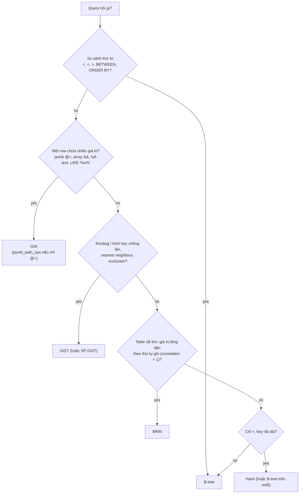
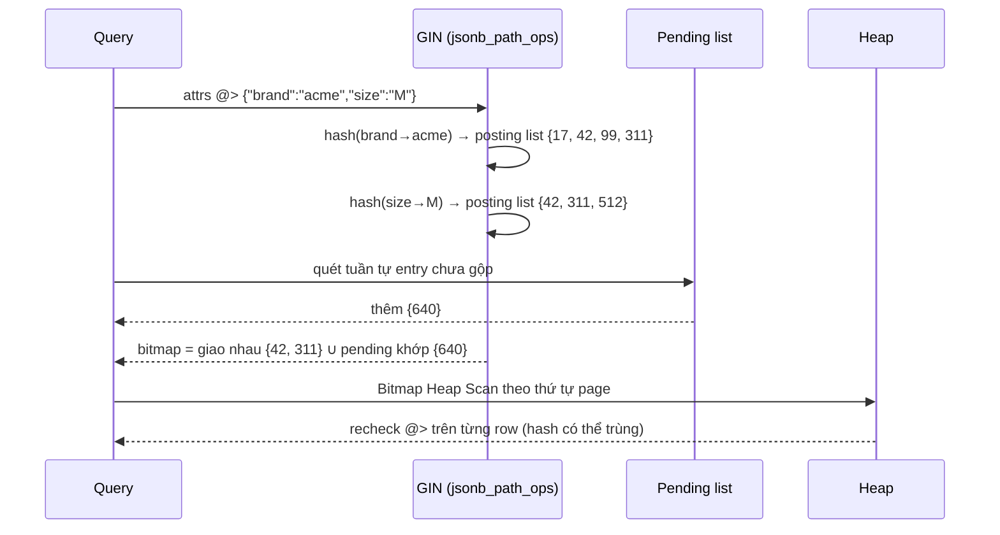

## Bối cảnh & vấn đề

Bài [B-tree index](/tracks/sql-postgres/learn/btree-indexes) cho thấy B-tree rất giỏi một việc: tìm trong dữ liệu **có thứ tự tuyến tính**. Mỗi row có một giá trị key, các key so sánh được với nhau bằng `<`, `=`, `>`, và index là danh sách đã sắp xếp của chúng. Nhưng nhiều câu hỏi thực tế không có hình dạng đó.

Ba ví dụ từ production. Một bảng `products` lưu thuộc tính động trong cột `attrs jsonb` (`{"brand": "acme", "size": "M", "color": "red"}`), và màn hình lọc hỏi "sản phẩm nào có brand = acme **và** size = M". Một row có **nhiều** giá trị cần tìm, nên không có "một key" để sắp xếp. Một bảng `shifts` cần đảm bảo cùng một nhân viên không có hai ca **chồng lấn thời gian**; "chồng lấn" không phải `=` hay `<`, mà là quan hệ giữa hai khoảng. Một bảng `events` nhận 30 triệu row mỗi ngày, giữ 13 tháng; một B-tree trên `created_at` cho 12 tỉ row nặng hàng trăm GB và phải cập nhật với mọi insert.

Postgres giải quyết ba bài toán đó bằng ba loại index khác: **GIN** cho "một row chứa nhiều key", **GiST** cho dữ liệu hình học / khoảng / "gần nhất", và **BRIN** cho table rất lớn mà giá trị tương quan với vị trí vật lý. Bài này giải thích từng loại hoạt động ra sao, khi nào dùng, tốn gì, và đi sâu vào **JSONB**, kiểu dữ liệu mà GIN hay phục vụ nhất.

## Khái niệm

### Access method và operator class

Postgres tách hai ý: **index access method** (cấu trúc dữ liệu: `btree`, `hash`, `gist`, `spgist`, `gin`, `brin`) và **operator class** (opclass: cách một kiểu dữ liệu cụ thể được lưu trong cấu trúc đó, và operator nào index hỗ trợ). Ví dụ `jsonb` có hai opclass GIN là `jsonb_ops` và `jsonb_path_ops`; cùng là GIN nhưng hỗ trợ tập operator khác nhau.

Hệ quả thực tế: planner chỉ dùng một index khi **operator trong WHERE** thuộc opclass của index đó. Một GIN index trên `attrs` phục vụ `attrs @> '{"brand":"acme"}'`, nhưng **không** phục vụ `attrs->>'brand' = 'acme'`, vì `->>` rồi `=` trên text không phải operator của opclass jsonb. Đây là nguồn gốc của rất nhiều câu "sao tôi có index mà không dùng".

```sql
SELECT am.amname, opc.opcname
FROM pg_opclass opc JOIN pg_am am ON am.oid = opc.opcmethod
WHERE opc.opcintype = 'jsonb'::regtype;
--  amname |    opcname
-- --------+----------------
--  btree  | jsonb_ops
--  hash   | jsonb_ops
--  gin    | jsonb_ops
--  gin    | jsonb_path_ops
```

**Interview angle:** "index được dùng khi operator khớp opclass" là câu giải thích đúng cho follow-up "vì sao `attrs->>'brand' = 'acme'` không dùng GIN".

### GIN: inverted index

**GIN** (Generalized Inverted Index) đảo ngược quan hệ row → giá trị. Thay vì "row 17 có các giá trị A, B, C", GIN lưu "giá trị A xuất hiện ở các row 17, 42, 99". Đây đúng là cách mục "Index" ở cuối một cuốn sách hoạt động: từ khoá → danh sách trang. Bên trong, GIN là một B-tree của các **key** (các phần tử được tách ra: key/value của jsonb, phần tử array, lexeme của full-text), và mỗi key trỏ tới một **posting list** (hoặc posting tree khi danh sách dài) các `ctid`.

Truy vấn "chứa A **và** B" thành: lấy posting list của A, lấy posting list của B, giao hai danh sách. Vì vậy GIN rất nhanh cho containment và full-text. GIN phục vụ:

- `jsonb`: `@>` (containment), `?`, `?|`, `?&` (key tồn tại), `@?` và `@@` (jsonpath).
- Array: `@>`, `<@`, `&&` (overlap), `=`.
- Full-text: `tsvector @@ tsquery`.
- Trigram (extension `pg_trgm`, opclass `gin_trgm_ops`): `LIKE '%abc%'`, `ILIKE`, regex `~`.

GIN chỉ hỗ trợ **Bitmap Index Scan** (không có Index Scan thường, không Index Only Scan), không cho thứ tự nên không giúp `ORDER BY`, và không làm unique được.

**Interview angle:** câu "tìm kiếm `LIKE '%abc%'` nhanh thế nào?" có câu trả lời chuẩn là `pg_trgm` + GIN, không phải B-tree.

### jsonb_ops và jsonb_path_ops

Opclass mặc định **`jsonb_ops`** tách mọi **key** và mọi **value** trong document thành các item riêng. Với `{"brand":"acme","size":"M"}` nó index `brand`, `acme`, `size`, `M`. Nhờ vậy nó trả lời được `?` ("có key `brand` không") lẫn `@>`. Nhược điểm: index to, và query `@> '{"brand":"acme"}'` phải giao posting list của `brand` và `acme` rồi recheck, vì "acme" có thể xuất hiện dưới key khác.

Opclass **`jsonb_path_ops`** chỉ index **hash của cả đường dẫn tới mỗi value**: một item cho `brand → acme`, một item cho `size → M`. Index thường nhỏ hơn đáng kể và `@>` nhanh hơn vì mỗi cặp là một lookup. Đổi lại, nó **không** hỗ trợ `?`, `?|`, `?&` (không có item cho key đứng riêng), và query `@> '{}'` (không có value nào để tra) phải quét toàn index.

```sql
CREATE INDEX products_attrs_gin      ON products USING gin (attrs);                 -- jsonb_ops
CREATE INDEX products_attrs_path_gin ON products USING gin (attrs jsonb_path_ops);  -- chỉ @>, @?, @@
```

**Interview angle:** chọn `jsonb_path_ops` khi mọi query là `@>`; chọn `jsonb_ops` khi cần kiểm tra key tồn tại.

### Chi phí ghi của GIN và fastupdate

Một row jsonb với 20 key/value sinh 20 (hoặc 40) item trong GIN. Chèn một row nghĩa là cập nhật 20–40 posting list rải rác khắp cây, đắt hơn nhiều so với một entry B-tree. Để giảm chi phí, GIN mặc định bật **`fastupdate`**: entry mới được ghi nối vào một **pending list** chưa sắp xếp, và chỉ được gộp vào cây chính khi pending list vượt `gin_pending_list_limit` (mặc định 4 MB), khi VACUUM/autoanalyze chạy, hoặc khi gọi `gin_clean_pending_list()`.

Cái giá của `fastupdate`: mọi query phải quét **cả** pending list (tuần tự) ngoài cây chính, nên pending list lớn làm đọc chậm; và insert nào "trúng" lúc pending list đầy sẽ phải tự gộp, tạo **latency spike** (một insert bình thường 1 ms bỗng mất 500 ms). Nếu p99 của insert quan trọng hơn throughput, tắt nó: `ALTER INDEX ... SET (fastupdate = off)`, hoặc giảm `gin_pending_list_limit` cho index đó.

**Interview angle:** "GIN đọc nhanh, ghi chậm, có pending list" là ba ý người phỏng vấn chờ đợi.

### GiST: cây tổng quát cho dữ liệu chồng lấn

**GiST** (Generalized Search Tree) là một **khung** để xây cây cân bằng cho kiểu dữ liệu không có thứ tự tuyến tính. Mỗi node trong cây lưu một **predicate bao** các con của nó: với hình học là bounding box, với range là khoảng bao. Tìm "cái gì chồng lấn với X" là đi xuống mọi nhánh mà khoảng bao của nó chồng lấn X. Khác B-tree, các nhánh có thể chồng lấn nhau, nên đôi khi phải đi xuống nhiều nhánh; GiST cũng thường **lossy** (node chỉ nói "có thể khớp", heap row phải được kiểm tra lại).

GiST phục vụ:

- **Range types** (`tstzrange`, `daterange`, `int4range`): `&&` (overlap), `@>` (chứa điểm hoặc range), `<@`, `<<`, `>>`, `-|-` (kề).
- Hình học và PostGIS: `&&` trên bounding box, `ST_DWithin`, `ST_Intersects`.
- **Nearest neighbour (KNN)**: `ORDER BY location <-> point(106.7, 10.8) LIMIT 5`, cây trả kết quả theo thứ tự khoảng cách mà không phải tính khoảng cách cho mọi row.
- **Exclusion constraint**: ràng buộc "không có hai row nào thoả `A WITH =, B WITH &&`", tổng quát hoá của `UNIQUE`.
- Full-text (`tsvector`) cũng được, nhưng GIN thường nhanh hơn cho đọc; GiST ghi nhanh hơn và nhỏ hơn.

**SP-GiST** là họ hàng dành cho cấu trúc phân hoạch không cân bằng (quad-tree, radix tree), hợp với điểm, IP, prefix text.

**Interview angle:** exclusion constraint chống đặt phòng/ca trùng giờ là use case GiST mà người phỏng vấn thích nhất, vì nó giải quyết race condition ở tầng database mà code app khó làm đúng.

### BRIN: tóm tắt theo block range

**BRIN** (Block Range INdex) không index từng row. Nó chia heap thành các **block range** liên tiếp (mặc định `pages_per_range = 128`, tức 128 × 8 KB = 1 MB heap) và với mỗi range chỉ lưu một **summary**, với opclass `minmax` là giá trị nhỏ nhất và lớn nhất trong range. Query `WHERE created_at >= '2026-09-01'` đọc toàn bộ BRIN (rất nhỏ), đánh dấu những range có `max >= '2026-09-01'`, rồi đọc heap của những range đó và lọc lại từng row.

BRIN cực nhỏ: table 1 TB có khoảng 1 triệu block range, mỗi summary vài chục byte, tức index chỉ vài chục MB, so với B-tree vài chục GB. Chèn row gần như không tốn gì. Nhưng BRIN chỉ có ích khi giá trị **tương quan với thứ tự vật lý**: log/event append-only với `created_at` tăng dần thì mỗi range chứa một khoảng thời gian hẹp. Nếu dữ liệu bị xáo trộn (update, backfill dữ liệu cũ, `created_at` ngẫu nhiên), mọi range có `min` rất cũ và `max` rất mới, BRIN không loại được range nào và thành seq scan. Kiểm tra bằng `pg_stats.correlation`: gần 1 hoặc -1 là tốt, gần 0 là BRIN vô dụng.

Ví dụ: `SELECT correlation FROM pg_stats WHERE tablename = 'events' AND attname = 'created_at';` trả `0.9998` là tín hiệu tốt cho BRIN.

**Interview angle:** follow-up kinh điển: "BRIN trên `created_at` hết tác dụng sau khi backfill dữ liệu cũ, vì sao?" → backfill ghi row cũ vào page mới (hoặc chỗ trống rải rác), phá tương quan vật lý, làm min/max của nhiều range bị giãn ra.

### Hash index

**Hash index** lưu hash 32-bit của key, chỉ hỗ trợ `=`. Từ PG 10 nó được ghi WAL nên an toàn khi crash và replicate được (trước đó thì không, nên lời khuyên cũ "đừng dùng hash index" giờ đã lỗi thời). Nó không unique được, không multicolumn, không range, không sort. Lợi thế duy nhất: với key dài (URL, token 200 byte) index nhỏ hơn B-tree vì chỉ lưu hash 4 byte. Trong đa số trường hợp, B-tree vẫn là lựa chọn mặc định.

### JSON và JSONB

Postgres có hai kiểu JSON. **`json`** lưu **nguyên văn text** đầu vào: giữ khoảng trắng, thứ tự key, và cả key trùng. Mỗi lần dùng operator hay hàm, nó phải parse lại. **`jsonb`** parse một lần khi ghi và lưu dạng **binary đã phân rã**: bỏ khoảng trắng, **không giữ thứ tự key**, và nếu có key trùng thì **chỉ giữ giá trị cuối**. Số được lưu dạng `numeric`.

```sql
SELECT '{"b":1, "a":2, "a":3}'::json  AS j,
       '{"b":1, "a":2, "a":3}'::jsonb AS jb;
--            j            |        jb
-- ------------------------+------------------
--  {"b":1, "a":2, "a":3}  | {"a": 3, "b": 1}
```

`jsonb` ghi chậm hơn một chút (phải parse, chuyển đổi) nhưng đọc nhanh hơn nhiều, có operator `=`, hỗ trợ GIN, containment, jsonpath. `json` không có operator `=` và không có GIN. Kết luận thực dụng: **gần như luôn dùng `jsonb`**; chỉ dùng `json` khi phải giữ nguyên văn payload (ví dụ lưu raw body webhook để kiểm tra chữ ký, audit).

**Interview angle:** trả lời "jsonb vì index được" là đúng nhưng chưa đủ; ý senior là "và vì sao vẫn nên kéo key hay filter ra cột thật" (xem Trade-offs).

### Operator của jsonb

- `->` lấy field, trả **jsonb**: `attrs->'size'` → `"M"` (còn dấu nháy, kiểu jsonb).
- `->>` lấy field, trả **text**: `attrs->>'size'` → `M`. So sánh số phải cast: `(attrs->>'price')::numeric > 100`.
- `#>` / `#>>` theo đường dẫn: `attrs #>> '{dims,width}'`.
- `@>` containment: `attrs @> '{"brand":"acme"}'` ("attrs chứa cặp này").
- `?`, `?|`, `?&`: key tồn tại (một, bất kỳ, tất cả).
- `@?`, `@@` và `jsonb_path_query()`: **SQL/JSON path** (PG 12+): `attrs @? '$.tags[*] ? (@ == "sale")'`.
- Subscripting (PG 14+): `attrs['size']`, cả đọc lẫn `UPDATE ... SET attrs['size'] = '"L"'` (verify).
- Sửa: `jsonb_set()`, `||` (merge), `-` (xoá key).

**Interview angle:** "vì sao `attrs->>'price' > '100'` cho kết quả sai?" → so sánh **text**, `'9' > '100'` là true; phải cast sang numeric.

## Cơ chế hoạt động

### Chọn loại index theo câu hỏi



Sơ đồ là cây quyết định nhanh. Câu hỏi đầu tiên luôn là "B-tree có đủ không", vì B-tree hỗ trợ nhiều loại scan nhất (Index Scan, Index Only Scan, sort, unique). Chỉ khi operator không phải so sánh thứ tự mới đi tiếp: dữ liệu "nhiều giá trị trong một row" → GIN; dữ liệu có kích thước/khoảng (range, hình học) hoặc cần "gần nhất" → GiST; table khổng lồ mà dữ liệu tự nhiên có thứ tự vật lý → BRIN. Hash chỉ là lựa chọn ngách.

### GIN trả lời containment như thế nào



Sơ đồ thứ hai cho thấy các bước của một query containment. Planner tách document trong điều kiện thành các cặp đường dẫn–giá trị, tra posting list cho từng cặp trong cây GIN, giao các danh sách lại, cộng thêm entry khớp trong **pending list** (vì `fastupdate` đang bật), rồi dựng bitmap các page. **Bitmap Heap Scan** đọc heap theo thứ tự page và **recheck** điều kiện trên row thật, vì `jsonb_path_ops` lưu hash nên có thể có va chạm, và vì visibility phải kiểm tra ở heap.

### BRIN loại block range như thế nào

Với `events` append-only, summary BRIN trông như sau:

```text
range  pages      min(created_at)        max(created_at)
0      0-127      2025-09-01 00:00:00    2025-09-01 00:41:10
1      128-255    2025-09-01 00:41:10    2025-09-01 01:22:31
...
9120   ...        2026-09-28 23:20:05    2026-09-29 00:01:44
```

`WHERE created_at >= '2026-09-28'` đọc toàn bộ summary (vài nghìn entry, vài trăm KB), chỉ giữ các range có `max >= '2026-09-28'`, và đọc heap của chúng. Range mới được ghi chưa có summary cho tới khi VACUUM chạy (hoặc index tạo với `autosummarize = on`), và range chưa summary thì **luôn** bị đọc, nên query gần "bây giờ" vẫn đúng, chỉ đọc hơi nhiều hơn.

## Ví dụ thực tế

### Lọc JSONB attributes

```sql
CREATE TABLE products (
  id        bigint GENERATED ALWAYS AS IDENTITY PRIMARY KEY,
  tenant_id bigint NOT NULL,
  name      text   NOT NULL,
  attrs     jsonb  NOT NULL DEFAULT '{}'
);

INSERT INTO products (tenant_id, name, attrs)
SELECT (random() * 99)::int + 1, 'p' || g,
       jsonb_build_object(
         'brand', (ARRAY['acme','globex','initech','umbrella'])[1 + (random() * 3)::int],
         'size',  (ARRAY['S','M','L','XL'])[1 + (random() * 3)::int],
         'price', round((random() * 200)::numeric, 2),
         'tags',  CASE WHEN random() < 0.05 THEN '["sale"]'::jsonb ELSE '[]'::jsonb END)
FROM generate_series(1, 2000000) g;

CREATE INDEX products_attrs_path ON products USING gin (attrs jsonb_path_ops);
ANALYZE products;

EXPLAIN (ANALYZE, BUFFERS)
SELECT id FROM products WHERE attrs @> '{"brand":"acme","size":"M"}';
```

```text
Bitmap Heap Scan on products  (cost=58.2..6721.4 rows=2000 width=8) (actual time=21.3..88.9 rows=83412 loops=1)
  Recheck Cond: (attrs @> '{"size": "M", "brand": "acme"}'::jsonb)
  Heap Blocks: exact=27820
  Buffers: shared hit=28104
  ->  Bitmap Index Scan on products_attrs_path  (cost=0.00..57.7 rows=2000 width=0) (actual time=17.8..17.8 rows=83412 loops=1)
        Index Cond: (attrs @> '{"size": "M", "brand": "acme"}'::jsonb)
Execution Time: 92.1 ms
```

Hai quan sát. Index được dùng như mong đợi (Bitmap Index Scan, vì GIN chỉ có bitmap). Và estimate `rows=2000` so với actual `83412`: planner không có statistics cho giá trị **bên trong** jsonb, nên dùng selectivity mặc định cho `@>` (khoảng 0,1% table). Với một filter đứng riêng thì không sao; khi query này join với bảng khác, estimate sai 40 lần có thể dẫn tới plan tệ (xem [planner](/tracks/sql-postgres/learn/planner-explain)).

Giờ viết cùng ý nhưng bằng `->>`:

```sql
EXPLAIN SELECT id FROM products WHERE attrs->>'brand' = 'acme' AND attrs->>'size' = 'M';
```

```text
Gather  (cost=1000.00..58342.10 rows=50 width=8)
  ->  Parallel Seq Scan on products
        Filter: (((attrs ->> 'brand'::text) = 'acme'::text) AND ((attrs ->> 'size'::text) = 'M'::text))
```

Seq scan, vì `->>` + `=` không phải operator của `jsonb_path_ops`. Có hai cách sửa: viết lại query bằng `@>`, hoặc nếu `brand` là key được lọc/sort thường xuyên, tạo **expression B-tree** cho đúng key đó:

```sql
CREATE INDEX products_brand ON products (tenant_id, (attrs->>'brand'));
ANALYZE products;  -- thu thập statistics cho biểu thức attrs->>'brand'
EXPLAIN SELECT id FROM products WHERE tenant_id = 7 AND attrs->>'brand' = 'acme';
-- Bitmap Heap Scan on products  (rows=5130)
--   ->  Bitmap Index Scan on products_brand  (rows=5130)
--         Index Cond: ((tenant_id = 7) AND ((attrs ->> 'brand'::text) = 'acme'::text))
```

Expression B-tree có hai lợi thế so với GIN: có statistics thật (estimate `5130` giờ đã sát), và hỗ trợ range + sort (`ORDER BY (attrs->>'brand')`, hoặc `((attrs->>'price')::numeric)` cho lọc giá).

Phía TypeScript, truyền filter dạng object và để `pg` serialize thành jsonb:

```typescript
import { Pool } from "pg";
const pool = new Pool();

async function findProducts(tenantId: number, filter: Record<string, string>) {
  const { rows } = await pool.query<{ id: string; name: string }>(
    "SELECT id, name FROM products WHERE tenant_id = $1 AND attrs @> $2::jsonb LIMIT 5",
    [tenantId, JSON.stringify(filter)],
  );
  return rows;
}

console.log(await findProducts(7, { brand: "acme", size: "M" }));
// [ { id: '1043', name: 'p1043' }, { id: '1187', name: 'p1187' }, ... ]
```

### Exclusion constraint chống ca làm trùng giờ

```sql
CREATE EXTENSION IF NOT EXISTS btree_gist;  -- cho phép "employee_id WITH =" trong GiST

CREATE TABLE shifts (
  id          bigint GENERATED ALWAYS AS IDENTITY PRIMARY KEY,
  employee_id bigint      NOT NULL,
  starts_at   timestamptz NOT NULL,
  ends_at     timestamptz NOT NULL,
  CHECK (ends_at > starts_at),
  CONSTRAINT shifts_no_overlap EXCLUDE USING gist (
    employee_id WITH =,
    tstzrange(starts_at, ends_at, '[)') WITH &&
  )
);

INSERT INTO shifts (employee_id, starts_at, ends_at)
VALUES (1, '2026-09-29 08:00+07', '2026-09-29 12:00+07');   -- OK
INSERT INTO shifts (employee_id, starts_at, ends_at)
VALUES (1, '2026-09-29 12:00+07', '2026-09-29 16:00+07');   -- OK: '[)' nên 12:00 không chồng
INSERT INTO shifts (employee_id, starts_at, ends_at)
VALUES (1, '2026-09-29 11:00+07', '2026-09-29 13:00+07');
-- ERROR:  conflicting key value violates exclusion constraint "shifts_no_overlap"
-- DETAIL:  Key (employee_id, tstzrange(starts_at, ends_at, '[)'::text))=(1, ["2026-09-29 04:00:00+00","2026-09-29 06:00:00+00"))
--          conflicts with existing key (employee_id, tstzrange(starts_at, ends_at, '[)'::text))=(1, ["2026-09-29 01:00:00+00","2026-09-29 05:00:00+00")).
```

Vì sao đây là cách đúng: kiểm tra "có ca chồng không" bằng `SELECT` rồi `INSERT` trong app có race condition: hai request đồng thời đều thấy "không chồng" rồi cùng insert. Exclusion constraint được kiểm tra trong index với cơ chế giống unique constraint, nên request thứ hai **chờ** request thứ nhất commit rồi báo lỗi. Cùng index GiST đó còn phục vụ query "ca nào đang diễn ra lúc này": `WHERE tstzrange(starts_at, ends_at, '[)') @> now()`.

### BRIN cho bảng events

```sql
CREATE INDEX events_created_brin ON events USING brin (created_at) WITH (pages_per_range = 64);
CREATE INDEX events_created_btree ON events (created_at);  -- chỉ để so sánh kích thước

SELECT relname, pg_size_pretty(pg_relation_size(oid))
FROM pg_class WHERE relname IN ('events', 'events_created_brin', 'events_created_btree');
--         relname        | pg_size_pretty
-- -----------------------+----------------
--  events                | 71 GB
--  events_created_btree  | 19 GB
--  events_created_brin   | 1336 kB

EXPLAIN (ANALYZE, BUFFERS)
SELECT count(*) FROM events WHERE created_at >= '2026-09-28' AND created_at < '2026-09-29';
```

```text
Aggregate  (actual time=1402.6..1402.6 rows=1 loops=1)
  ->  Bitmap Heap Scan on events  (actual time=3.1..1210.4 rows=30114208 loops=1)
        Recheck Cond: ((created_at >= '2026-09-28 ...') AND (created_at < '2026-09-29 ...'))
        Rows Removed by Index Recheck: 18392
        Heap Blocks: lossy=366720
        ->  Bitmap Index Scan on events_created_brin  (actual time=2.9..2.9 rows=3667200 loops=1)
```

BRIN 1,3 MB làm được việc gần như B-tree 19 GB cho query theo khoảng thời gian (phải đọc thừa một ít row ở rìa range: `Rows Removed by Index Recheck`). Với câu thiết kế "30 triệu event/ngày, giữ 13 tháng", BRIN trên `created_at` là mảnh ghép tốt, kết hợp với **partition theo tháng** để xoá dữ liệu cũ bằng `DROP`/`DETACH PARTITION` thay vì `DELETE` (xem [Replication & scaling](/tracks/sql-postgres/learn/replication-scaling)). B-tree vẫn cần cho lookup theo `id` hay `(tenant_id, created_at)` nếu có query điểm theo tenant.

## Trade-offs & lựa chọn thay thế

| Index | Cấu trúc | Operator tiêu biểu | Kích thước | Chi phí ghi | Use case |
|---|---|---|---|---|---|
| B-tree | Cây sắp xếp | `=`, `<`, `>`, `ORDER BY` | Trung bình | Thấp | Mặc định cho mọi thứ có thứ tự |
| GIN | Inverted: key → posting list | `@>`, `?`, `&&`, `@@`, trigram | Lớn | Cao (pending list) | jsonb, array, full-text, `LIKE '%x%'` |
| GiST | Cây predicate bao, lossy | `&&`, `@>`, `<->`, exclusion | Trung bình | Trung bình | Range, PostGIS, KNN, chống chồng lấn |
| SP-GiST | Cây phân hoạch | điểm, IP, prefix | Nhỏ–trung bình | Trung bình | Quad-tree, `inet`, text prefix |
| BRIN | Summary mỗi block range | `<`, `>`, `=` (lossy) | Rất nhỏ | Gần 0 | Time series append-only |
| Hash | Bảng băm | `=` | Nhỏ với key dài | Thấp | Lookup `=` trên key rất dài |

| Lưu attribute | Được | Mất |
|---|---|---|
| Cột thật | Type, constraint, FK, statistics chính xác, B-tree đầy đủ, update rẻ | Phải migrate schema khi thêm thuộc tính |
| `jsonb` + GIN | Linh hoạt, thêm key không cần migration, containment nhanh | Không có statistics bên trong, không constraint theo key, update một key ghi lại cả document |
| `jsonb` + expression index / generated column | Một key hay dùng có B-tree + statistics | Mỗi key cần một index riêng |
| EAV (bảng key/value) | Linh hoạt | Join nhiều, query phức tạp, thường tệ hơn jsonb |

**Khi nào chọn cái nào.** Dùng `jsonb` cho thuộc tính **thưa và động**: thuộc tính sản phẩm khác nhau theo category, metadata do tenant tự định nghĩa, payload tích hợp. Kéo ra **cột thật** những field bạn lọc, join, sort, ràng buộc, hoặc cập nhật thường xuyên: `tenant_id`, `status`, `price`, `customer_id` không bao giờ nên nằm trong jsonb. Nếu một key trong jsonb trở thành "nóng", bước trung gian là generated column (`price numeric GENERATED ALWAYS AS ((attrs->>'price')::numeric) STORED`) hoặc expression index. Chọn GIN `jsonb_path_ops` nếu mọi query là `@>`; `jsonb_ops` nếu cần `?`. Chọn BRIN thay B-tree chỉ khi đã kiểm tra `correlation` và table là append-only.

## Edge cases & failure modes

- **GIN pending list làm latency spike**: insert throughput cao, pending list đầy 4 MB, insert "không may" phải gộp hàng nghìn entry. Triệu chứng: p99 insert nhảy vọt định kỳ. Giảm `gin_pending_list_limit` hoặc tắt `fastupdate` cho index đó; đảm bảo autovacuum chạy đều.
- **GIN làm update jsonb đắt hơn nhiều**: sửa một key trong document 5 KB là ghi lại cả document (TOAST nếu trên ~2 KB) và cập nhật các item GIN liên quan; cột có GIN index không bao giờ được HOT update khi giá trị đổi. Document lớn bị update liên tục là mùi thiết kế.
- **Estimate sai với jsonb**: selectivity mặc định cho `@>` và `?` khiến planner đoán sai hàng chục lần; sửa bằng expression index + `ANALYZE` (có statistics cho biểu thức) hoặc kéo ra cột thật.
- **`jsonb_path_ops` và `@> '{}'`** hoặc query chỉ kiểm tra key tồn tại: không dùng được index, rơi về seq scan hoặc full index scan.
- **So sánh text thay vì số**: `attrs->>'price' > '100'` so sánh chuỗi. Luôn cast: `(attrs->>'price')::numeric > 100`, và cast lỗi (`invalid input syntax for type numeric`) nếu một row có giá trị không phải số: dữ liệu jsonb không có kiểu được đảm bảo.
- **BRIN sau backfill/update**: backfill dữ liệu tháng cũ vào table đang dùng BRIN làm các range mới có min rất cũ; `UPDATE` di chuyển tuple sang page khác cũng vậy. Theo dõi `pg_stats.correlation`, và dùng opclass `minmax_multi_ops` (PG 14+) chịu được vài giá trị ngoại lai trong một range (verify).
- **BRIN range chưa summarize**: dữ liệu mới nhất chưa có summary, luôn bị quét; không sai kết quả nhưng query "1 giờ gần đây" có thể đọc nhiều hơn dự kiến nếu VACUUM chưa chạy. Cân nhắc `autosummarize = on`.
- **Exclusion constraint và `CONCURRENTLY`**: thêm exclusion constraint vào table có sẵn phải build index GiST và giữ lock mạnh; không có dạng `NOT VALID` như CHECK/FK. Với table lớn, lên kế hoạch maintenance window hoặc tạo table mới.
- **Exclusion constraint và dữ liệu sai**: thiếu `'[)'` (dùng `'[]'`) làm hai ca nối tiếp 8–12h và 12–16h bị coi là chồng nhau.

## Pitfalls

- ❌ Tạo GIN trên `attrs` rồi query `attrs->>'brand' = 'acme'` → ✅ viết `attrs @> '{"brand":"acme"}'`, hoặc tạo expression B-tree `((attrs->>'brand'))`, vì index chỉ phục vụ operator của opclass.
- ❌ Dùng `json` "cho nhẹ" → ✅ dùng `jsonb`, trừ khi phải giữ nguyên văn payload; `json` không có `=` và không có GIN.
- ❌ Nhét `status`, `tenant_id`, `price` vào jsonb "cho linh hoạt" → ✅ field hay lọc/join/sort là cột thật, vì chúng cần statistics, constraint và B-tree.
- ❌ `jsonb_path_ops` cho mọi thứ → ✅ chỉ khi không cần `?`/`?|`/`?&`.
- ❌ BRIN trên cột không tương quan với thứ tự ghi (`customer_id`, `updated_at` bị update) → ✅ kiểm tra `pg_stats.correlation` trước; BRIN hợp với `created_at` append-only.
- ❌ Kiểm tra trùng lịch bằng `SELECT` rồi `INSERT` trong app → ✅ exclusion constraint GiST, vì nó đúng dưới concurrency.
- ❌ `LIKE '%abc%'` trên B-tree và mong nhanh → ✅ `pg_trgm` + GIN (`gin_trgm_ops`), hoặc full-text search nếu tìm theo từ.
- ❌ Né hash index vì "không crash-safe" → ✅ điều đó chỉ đúng trước PG 10; nhưng B-tree vẫn thường là lựa chọn tốt hơn.

## Tóm tắt

- Index chỉ được dùng khi operator trong WHERE thuộc **opclass** của index; đó là lý do `->>` không dùng GIN.
- **GIN** là inverted index: key → posting list; dành cho jsonb `@>`/`?`, array, full-text, trigram; đọc nhanh, ghi đắt, có pending list (`fastupdate`), chỉ Bitmap scan.
- `jsonb_path_ops` nhỏ và nhanh cho `@>` nhưng không hỗ trợ `?`; `jsonb_ops` (mặc định) hỗ trợ nhiều operator hơn.
- **GiST** cho range, hình học, KNN `<->` và **exclusion constraint** (chống đặt lịch trùng, cần `btree_gist` để kèm cột `=`).
- **BRIN** lưu min/max mỗi block range: cực nhỏ, gần như không tốn khi ghi, nhưng chỉ có ích khi dữ liệu tương quan với thứ tự vật lý (append-only).
- `jsonb` lưu binary đã parse, bỏ key trùng và thứ tự key; gần như luôn chọn `jsonb` thay `json`.
- `->` trả jsonb, `->>` trả text (cast khi so số); `@>`, `?`, jsonpath `@?` cho query phức tạp.
- Field hay lọc/sort/join nên là cột thật hoặc generated column; key jsonb nóng dùng expression B-tree để có statistics và range/sort.
