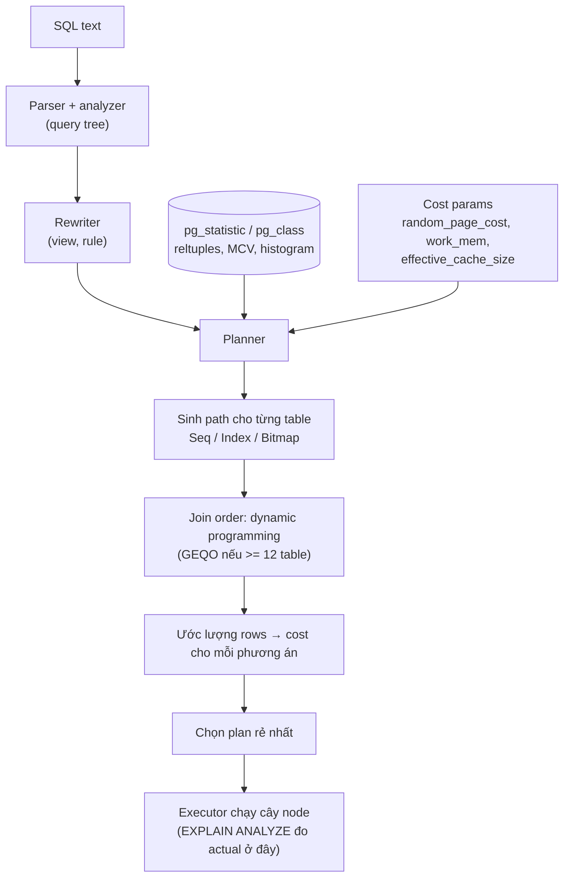
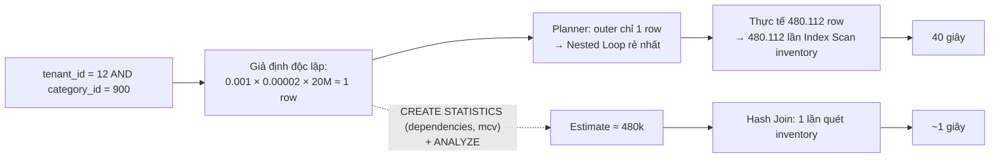

## Bối cảnh & vấn đề

Một buổi chiều, endpoint "đơn hàng theo danh mục" của tenant 12 từ 50 ms nhảy lên 40 giây. Không ai deploy gì. Không index nào bị xoá. Tenant 12 vừa import 480.000 sản phẩm vào một danh mục mới. Chạy `EXPLAIN ANALYZE`, bạn thấy planner **ước lượng 1 row** nhưng thực tế có **480.112 row**, và vì tin là chỉ có 1 row, nó chọn Nested Loop: tra bảng `inventory` 480.112 lần qua index, mỗi lần vài page. Một Hash Join lẽ ra chỉ mất 1 giây.

Câu chuyện này tóm tắt bản chất của Postgres query planner: nó không "biết" dữ liệu, nó **đoán** dựa trên statistics. SQL là ngôn ngữ khai báo: bạn nói **muốn gì**, còn planner quyết định **làm thế nào**: đọc table nào trước, dùng index nào, join bằng thuật toán nào. Nó chọn bằng cách ước lượng **cost** của nhiều phương án và lấy cái rẻ nhất. Khi dự đoán số row đúng, plan thường tốt. Khi dự đoán sai hàng trăm lần, plan có thể tệ hàng nghìn lần.

Vì vậy kỹ năng tuning quan trọng nhất không phải là "thêm index", mà là **đọc được plan**: thấy planner nghĩ gì (estimate), thực tế ra sao (actual), chỗ nào lệch, và vì sao lệch. Bài này dạy từ cost model, statistics, tới đọc `EXPLAIN (ANALYZE, BUFFERS)` từng dòng, các loại scan và join, những lý do planner bỏ qua index, và cái bẫy của prepared statement. Kiến thức nền về index nằm ở bài [B-tree index](/tracks/sql-postgres/learn/btree-indexes); pipeline parse → rewrite → plan → execute nằm ở bài [Query processing](/tracks/sql-postgres/learn/query-processing).

## Khái niệm

### Cost-based planner

Postgres dùng **cost-based optimizer**: với mỗi table, nó sinh các **path** (cách truy cập: seq scan, index scan trên từng index phù hợp, bitmap scan), rồi với join thì thử các thứ tự join và thuật toán join, tính cost cho từng phương án và giữ cái rẻ nhất. Việc tìm thứ tự join dùng **dynamic programming** kiểu System R (xây plan tốt nhất cho mọi tập con table, từ nhỏ đến lớn). Khi query có từ `geqo_threshold` (mặc định 12) mục FROM trở lên, không gian tìm kiếm quá lớn, nên Postgres chuyển sang **GEQO** (genetic algorithm) cho kết quả "đủ tốt". Ngoài ra `join_collapse_limit` (mặc định 8) giới hạn số table mà planner được tự do sắp xếp lại từ `JOIN` tường minh.

**Cost** là một con số không có đơn vị thời gian, quy ước 1.0 = chi phí đọc tuần tự một page. Nó được tính từ các tham số:

| Tham số | Mặc định | Ý nghĩa |
|---|---|---|
| `seq_page_cost` | 1.0 | Đọc một page tuần tự |
| `random_page_cost` | 4.0 | Đọc một page ngẫu nhiên (index scan đọc heap) |
| `cpu_tuple_cost` | 0.01 | Xử lý một row |
| `cpu_index_tuple_cost` | 0.005 | Xử lý một index entry |
| `cpu_operator_cost` | 0.0025 | Đánh giá một operator/hàm |
| `effective_cache_size` | 4GB | Ước lượng tổng cache (shared_buffers + OS), giúp planner đoán page index đã nằm trong RAM |

Ví dụ trong tài liệu Postgres: table `tenk1` có 10.000 row trên 345 page. Cost của seq scan là `345 × 1.0 + 10000 × 0.01 = 445`, đúng con số `cost=0.00..445.00` mà `EXPLAIN` in ra.

`random_page_cost = 4` được chọn cho ổ quay (HDD), nơi đọc ngẫu nhiên đắt hơn nhiều so với tuần tự. Trên SSD/NVMe hoặc cloud storage, tỉ lệ này thấp hơn nhiều, và giá trị 1.1–1.5 thường phản ánh thực tế tốt hơn. Để mặc định 4 trên SSD làm index scan trông đắt gấp 3–4 lần thực tế, khiến planner chọn seq scan quá sớm.

**Interview angle:** câu "planner hoạt động thế nào" muốn nghe: cost-based, statistics → cardinality estimate → cost, dynamic programming cho join order, và "plan là thứ planner **nghĩ** là rẻ nhất, không phải chắc chắn rẻ nhất".

### Statistics: pg_statistic và pg_stats

Để ước lượng "điều kiện này giữ lại bao nhiêu row" (**selectivity**, và từ đó **cardinality**), planner dùng statistics do `ANALYZE` thu thập. `ANALYZE` không đọc cả table: nó lấy mẫu ngẫu nhiên `300 × default_statistics_target` row (mặc định target 100, tức 30.000 row). Kết quả lưu trong catalog `pg_statistic`; view dễ đọc là **`pg_stats`**. Các cột quan trọng:

- `null_frac`: tỉ lệ NULL.
- `n_distinct`: số giá trị khác nhau. Số dương là con số tuyệt đối; số **âm** là tỉ lệ so với số row (−1 nghĩa là mọi giá trị đều khác nhau, như cột unique).
- `most_common_vals` / `most_common_freqs` (**MCV**): các giá trị phổ biến nhất và tần suất của chúng. Với `status = 'pending'`, nếu `pending` có trong MCV thì selectivity chính là tần suất đó.
- `histogram_bounds`: các mốc chia phần dữ liệu còn lại (không thuộc MCV) thành những "bucket" có số row bằng nhau; dùng cho điều kiện range như `created_at > X`.
- `correlation`: mức tương quan giữa thứ tự giá trị và thứ tự vật lý trong heap (−1 đến 1). Gần 1 nghĩa là index scan đọc heap gần như tuần tự, rẻ hơn; gần 0 nghĩa là mỗi row là một random read.

Ngoài ra `pg_class.reltuples` và `relpages` cho kích thước table (cập nhật bởi VACUUM/ANALYZE).

```sql
SELECT attname, null_frac, n_distinct, most_common_vals, most_common_freqs, correlation
FROM pg_stats WHERE tablename = 'orders' AND attname IN ('status', 'tenant_id');
--   attname  | null_frac | n_distinct |          most_common_vals          |      most_common_freqs      | correlation
-- -----------+-----------+------------+------------------------------------+-----------------------------+-------------
--  status    |         0 |          4 | {paid,shipped,pending,cancelled}   | {0.34,0.33,0.17,0.16}       |        0.25
--  tenant_id |         0 |       1000 | {17,512,3,...}                     | {0.0013,0.0012,0.0012,...}  |       0.002
```

**Interview angle:** biết đọc `pg_stats` là điểm phân biệt senior: "estimate lệch" phải dẫn tới câu hỏi "statistics nói gì về cột này".

### ANALYZE và autovacuum analyze

Statistics chỉ tốt bằng lần `ANALYZE` gần nhất. **Autovacuum** tự chạy analyze cho một table khi số row thay đổi kể từ lần trước vượt `autovacuum_analyze_threshold + autovacuum_analyze_scale_factor × reltuples`, mặc định `50 + 0.1 × reltuples`. Với table 100 triệu row, đó là 10 triệu thay đổi: một đợt import 480.000 row cho một tenant mới **không** kích hoạt analyze, nên planner không biết tenant đó tồn tại với khối lượng lớn.

Các thao tác cần `ANALYZE` thủ công ngay sau đó: bulk load/import, tạo expression index (để có statistics cho biểu thức), `CREATE STATISTICS`, và sau `pg_upgrade` (statistics không được mang sang, trừ PG 18 có thể giữ một phần (verify)). Table lớn nên có scale factor riêng: `ALTER TABLE orders SET (autovacuum_analyze_scale_factor = 0.01)`.

Có thể tăng độ chi tiết cho một cột lệch: `ALTER TABLE products ALTER COLUMN tenant_id SET STATISTICS 1000` (MCV và histogram tối đa 1.000 mục, sample lớn hơn).

**Interview angle:** "import xong, query chậm" → câu đầu tiên nên là "đã `ANALYZE` chưa?".

### Giả định độc lập và extended statistics

Khi WHERE có nhiều điều kiện, planner mặc định coi chúng **độc lập** và **nhân** selectivity. Bảng `products` có 20 triệu row, 1.000 tenant và 50.000 category: `tenant_id = 12` được ước lượng 0,1%, `category_id = 900` được ước lượng 1/50.000 = 0,002%, nên 20M × 0,001 × 0,00002 = 0,4, làm tròn lên **1 row** (planner không bao giờ ước lượng dưới 1). Nhưng category 900 vừa được import và **chỉ** thuộc tenant 12 (hai cột **tương quan**, cộng thêm statistics cũ), nên thực tế là 480.112 row. Estimate sai gần 500.000 lần.

**Extended statistics** (`CREATE STATISTICS`, PG 10+) cho planner biết về quan hệ giữa các cột:

- `dependencies`: functional dependency (biết `category_id` thì gần như biết `tenant_id`).
- `ndistinct`: số tổ hợp distinct, giúp `GROUP BY a, b`.
- `mcv` (PG 12+): danh sách tổ hợp giá trị phổ biến nhất, chính xác nhất cho trường hợp dữ liệu lệch.

```sql
CREATE STATISTICS products_tenant_category (dependencies, mcv) ON tenant_id, category_id FROM products;
ANALYZE products;
```

**Interview angle:** câu debug "1 row vs 480k" muốn nghe cả hai nguyên nhân: statistics cũ và **cột tương quan**, cùng cách sửa `CREATE STATISTICS` thay vì "thêm hint".

### EXPLAIN và EXPLAIN ANALYZE

**`EXPLAIN`** chỉ in plan planner chọn cùng các **ước lượng**: `cost=startup..total`, `rows` (số row ước lượng node trả ra) và `width` (byte trung bình mỗi row). Nó **không chạy** query.

**`EXPLAIN ANALYZE`** **chạy thật** query, rồi in thêm `actual time=startup..total` (ms), `rows` thực tế, và `loops` (node được thực thi bao nhiêu lần). Thêm **`BUFFERS`** để thấy I/O: `shared hit` (page tìm thấy trong `shared_buffers`), `shared read` (phải đọc từ OS/disk), `dirtied`/`written`, và `temp read/written` (spill ra disk khi `work_mem` không đủ). Từ PG 18, `BUFFERS` được bật mặc định khi có `ANALYZE` (verify). Các option hữu ích khác: `VERBOSE` (cột output, schema), `SETTINGS` (tham số planner khác mặc định), `WAL` (lượng WAL sinh ra), `FORMAT JSON` (cho tool như explain.dalibo.com).

Vì `EXPLAIN ANALYZE` **thực thi** câu lệnh, chạy nó trên `UPDATE`/`DELETE`/`INSERT` là **sửa dữ liệu thật**. Trigger vẫn chạy, lock vẫn bị giữ, sequence vẫn tăng (không rollback được). Luôn bọc:

```sql
BEGIN;
EXPLAIN (ANALYZE, BUFFERS)
UPDATE orders SET status = 'archived' WHERE created_at < now() - interval '2 years';
ROLLBACK;
```

Ngay cả khi rollback, câu lệnh vẫn tốn tài nguyên như chạy thật, giữ row lock trong lúc chạy (chặn các update khác trên cùng row) và sinh WAL. Trên production, chạy vào giờ thấp điểm hoặc trên bản sao dữ liệu.

**Interview angle:** red flag là không biết `EXPLAIN ANALYZE` chạy thật; câu trả lời tốt nhắc cả `BEGIN … ROLLBACK` lẫn "vẫn giữ lock và tốn tài nguyên".

### Scan node

- **Seq Scan**: đọc mọi page của table theo thứ tự. Rẻ nhất cho mỗi page (đọc tuần tự, có read-ahead) và là lựa chọn đúng khi query lấy phần lớn table hoặc table nhỏ. `Parallel Seq Scan` chia table cho nhiều worker.
- **Index Scan**: duyệt index, với mỗi entry đọc row từ heap. Tốt khi lấy **ít** row, hoặc khi cần thứ tự của index (`ORDER BY ... LIMIT`). Mỗi row có thể là một random read.
- **Index Only Scan**: như Index Scan nhưng lấy dữ liệu từ index, chỉ đọc heap với page chưa all-visible (`Heap Fetches`).
- **Bitmap Index Scan + Bitmap Heap Scan**: bước một duyệt index và đánh dấu các page chứa row khớp vào một **bitmap**; bước hai đọc heap **theo thứ tự page**, mỗi page một lần. Là phương án trung gian cho vài trăm tới vài chục nghìn row, và kết hợp được nhiều index (`BitmapAnd`, `BitmapOr`). Khi bitmap quá lớn so với `work_mem`, nó trở thành **lossy** (chỉ nhớ page, không nhớ row), nên phải `Recheck Cond` trên mọi row của page.

### Join node

- **Nested Loop**: với mỗi row bên ngoài (outer), tìm row khớp bên trong (inner), thường qua index. Tuyệt vời khi outer **ít** row và inner có index; thảm hoạ khi outer thực tế có hàng trăm nghìn row. Từ PG 14, node **Memoize** có thể cache kết quả inner cho các giá trị lặp lại.
- **Hash Join**: đọc bảng nhỏ hơn, xây **hash table** trong bộ nhớ (`work_mem × hash_mem_multiplier`), rồi quét bảng lớn và tra hash. Tốt cho join lớn với điều kiện `=`, không cần input đã sắp xếp. Hash table không vừa bộ nhớ thì chia **batch** và spill ra disk (`Batches: 8` trong plan).
- **Merge Join**: hai input **đã sắp xếp** theo khoá join, đi song song như trộn hai danh sách. Tốt khi cả hai phía đã có thứ tự sẵn (từ index) hoặc join rất lớn.

**Interview angle:** "Nested Loop không xấu": nó là join tốt nhất cho OLTP (ít row, có index). Nó chỉ xấu khi estimate sai.

| Node | Chọn khi | Cảnh báo |
|---|---|---|
| Seq Scan | Lấy nhiều row, table nhỏ | Trên table lớn với ít row trả về |
| Index Scan | Ít row, cần thứ tự | Nhiều row → random I/O |
| Bitmap Heap Scan | Số row trung bình, nhiều index | `lossy` + recheck nhiều |
| Nested Loop | Outer nhỏ, inner có index | `loops` lớn |
| Hash Join | Join lớn, `=` | `Batches > 1` (spill) |
| Merge Join | Input đã sort | Sort thêm tốn kém |

### Prepared statement: custom plan và generic plan

**Prepared statement** tách việc parse/plan khỏi việc thực thi: `PREPARE q(bigint) AS SELECT ... WHERE tenant_id = $1`, rồi `EXECUTE q(12)` nhiều lần. Postgres có hai kiểu plan cho nó:

- **Custom plan**: lập kế hoạch lại **mỗi lần execute**, dùng giá trị tham số thật. Planner thấy `tenant_id = 12` và tra MCV, nên estimate chính xác cho tenant đó. Tốn thời gian planning mỗi lần.
- **Generic plan**: lập kế hoạch **một lần**, không nhìn giá trị tham số (dùng selectivity trung bình), rồi tái sử dụng. Không tốn planning, nhưng có thể sai cho giá trị "bất thường".

Với `plan_cache_mode = auto` (mặc định, PG 12+), **5 lần execute đầu** luôn dùng custom plan. Từ lần thứ 6, Postgres so cost ước lượng của generic plan với **cost trung bình** của các custom plan đã chạy (cộng chi phí planning); nếu generic không đắt hơn đáng kể, nó chuyển sang generic và giữ đó. Bạn có thể ép bằng `SET plan_cache_mode = force_custom_plan` (hoặc `force_generic_plan`), theo session, theo role (`ALTER ROLE ... SET`) hoặc theo database. `pg_prepared_statements` (PG 14+) cho biết `generic_plans` và `custom_plans` đã dùng; `EXPLAIN (GENERIC_PLAN)` (PG 16+) cho xem generic plan mà không cần giá trị (verify).

Driver quyết định bạn có dùng prepared statement hay không. Với `node-postgres`, query có tham số nhưng **không** có `name` đi qua unnamed statement, được plan lại mỗi lần với giá trị thật; query có `name` được prepare trên connection đó và chịu quy tắc 5 lần (verify). JDBC chuyển sang server-side prepare sau `prepareThreshold = 5` lần; nhiều ORM prepare mặc định.

**So với SQL Server parameter sniffing**: SQL Server compile plan **lần đầu** với giá trị tham số của lần đó ("sniff") rồi cache cho mọi lần sau. Nếu lần đầu là tenant nhỏ, plan Nested Loop được cache và tenant 50 triệu row dùng lại nó. Cách sửa ở đó: `OPTION (RECOMPILE)`, `OPTIMIZE FOR (@p = ...)` / `OPTIMIZE FOR UNKNOWN`, Query Store force plan, và từ SQL Server 2022 là Parameter Sensitive Plan optimization (nhiều plan theo khoảng giá trị) (verify). Postgres thì ngược lại: 5 lần đầu luôn đúng theo giá trị, vấn đề xuất hiện **sau** khi chuyển sang generic plan, thường với giá trị hiếm/lệch mà generic plan coi như trung bình.

**Interview angle:** câu multi-tenant: "plan tốt cho tenant 100 row tệ cho tenant 50 triệu row"; sửa bằng `force_custom_plan` cho câu đó, statistics tốt hơn, partial index, hoặc tách tenant lớn.

### Vì sao count(*) chậm

Ở nhiều người mới dùng Postgres, `SELECT count(*) FROM orders` trên 200 triệu row mất cả chục giây là điều bất ngờ. Lý do là **MVCC** (xem [MVCC & VACUUM](/tracks/sql-postgres/learn/mvcc-vacuum)): mỗi transaction có snapshot riêng, và cùng một thời điểm hai transaction có thể thấy số row khác nhau. Không có "bộ đếm row" chung nào đúng cho mọi snapshot, nên Postgres phải **quét** và kiểm tra visibility từng row: `Parallel Seq Scan`, hoặc `Index Only Scan` trên index nhỏ nhất (vẫn đọc heap cho page chưa all-visible).

Các lựa chọn: (1) **ước lượng** từ `pg_class.reltuples` (cập nhật bởi VACUUM/ANALYZE) hoặc từ `rows` trong `EXPLAIN`, đủ cho "khoảng 1,2 triệu kết quả"; (2) **counter table** cập nhật bằng trigger hoặc app, cẩn thận vì một row counter bị mọi transaction update là **hot row** gây lock contention, nên chia thành nhiều slot rồi `sum()`; (3) count có filter hẹp + index phù hợp (`count(*) WHERE tenant_id = ? AND status = 'pending'` qua partial index là rẻ); (4) đổi UI: bỏ tổng số, dùng "có trang tiếp theo" bằng `LIMIT n + 1`.

**Interview angle:** câu trả lời mạnh nói **vì sao** (MVCC visibility, không có counter chung) trước khi liệt kê cách xử lý. SQL Server cũng phải quét (index nhỏ nhất); ước lượng lấy từ `sys.dm_db_partition_stats`.

### Tìm query chậm: pg_stat_statements và auto_explain

`EXPLAIN` chỉ hữu ích khi bạn đã biết query nào chậm. Hai công cụ để tìm:

- **`pg_stat_statements`** (extension, cần `shared_preload_libraries`): gom mọi query theo **dạng chuẩn hoá** (hằng số thay bằng `$1`) và tích luỹ `calls`, `total_exec_time`, `mean_exec_time`, `rows`, `shared_blks_hit/read`, `temp_blks_written`. Sắp theo `total_exec_time` để thấy query nào tiêu tốn database nhiều nhất (thường là query nhanh nhưng gọi hàng triệu lần), theo `mean_exec_time` để thấy query chậm nhất mỗi lần.
- **`auto_explain`** (module): tự log plan của mọi query chạy lâu hơn `auto_explain.log_min_duration`. Bật `log_analyze` để có actual rows (tốn overhead đo thời gian trên mọi query, nên dùng kèm `auto_explain.sample_rate`), `log_buffers`, `log_format = json`. Đây là cách duy nhất để bắt plan **đúng lúc** query chậm, ví dụ khi nó chỉ chậm với generic plan hay với một tenant.

Ngoài ra: `log_min_duration_statement` (log text query chậm), và APM/tracing ở tầng app để nối query với endpoint.

**Interview angle:** câu CV "bạn tối ưu query thế nào" cần một chuỗi: **phát hiện** (APM, `pg_stat_statements`) → **bằng chứng** (plan, buffers, estimate lệch) → **thay đổi** → **số đo trước/sau** và chi phí ghi của index mới.

## Cơ chế hoạt động

### Từ SQL tới plan



Sơ đồ cho thấy planner có hai đầu vào ngoài câu SQL: **statistics** (để ước lượng số row) và **cost parameters** (để đổi số row và page thành cost). Nó sinh các path truy cập cho từng table, tìm thứ tự join bằng dynamic programming, ước lượng cost và chọn cái rẻ nhất; executor chạy cây node đó. `EXPLAIN` in ra kết quả ở bước "chọn plan"; `EXPLAIN ANALYZE` in thêm số đo thật từ executor. Mọi sai lầm của planner đều truy về một trong hai đầu vào: statistics sai (ước lượng row sai) hoặc cost parameters không phản ánh phần cứng.

### Estimate sai lan truyền thế nào



Sơ đồ thứ hai cho thấy vì sao một estimate sai ở node dưới cùng làm hỏng cả plan. Số row ước lượng ở mỗi node là đầu vào để tính cost cho node phía trên. Khi scan `products` được ước lượng 1 row, mọi phương án join đều được tính như thể chỉ join một row, và Nested Loop thắng. Sửa statistics ở gốc thì estimate đúng lan lên trên, và planner tự chọn Hash Join. Đó là lý do cách sửa đúng gần như luôn là **sửa estimate**, không phải ép plan.

### Đọc một plan theo thứ tự

Plan là một **cây**: node thụt vào sâu nhất chạy trước và đẩy row lên node cha (dấu `->` đánh dấu node con). Đọc theo trình tự:

1. Tìm node có **actual time** lớn nhất (nhớ nhân với `loops`: `actual time` và `rows` là **trung bình mỗi loop**).
2. Ở mỗi node, so **estimated rows** với **actual rows**. Lệch 10 lần trở lên là đáng ngờ; lệch 1.000 lần là nguyên nhân.
3. Xem `Buffers`: `shared read` lớn nghĩa là đọc disk (cold cache); `temp written` nghĩa là sort/hash spill ra disk (tăng `work_mem` cho câu đó hoặc giảm dữ liệu).
4. Xem `Rows Removed by Filter`: lớn nghĩa là đọc nhiều rồi vứt đi, thiếu index hoặc index sai cột.
5. Xem loại join và `loops` phía inner.

## Ví dụ thực tế

### Đọc từng dòng một plan khoẻ

```sql
EXPLAIN (ANALYZE, BUFFERS)
SELECT o.id, o.total
FROM customers c
JOIN orders o ON o.customer_id = c.id
WHERE c.tenant_id = 7 AND c.email = 'a@b.com';
```

```text
Nested Loop  (cost=0.85..1250.40 rows=120 width=64) (actual time=0.050..3.200 rows=118 loops=1)
  Buffers: shared hit=480
  ->  Index Scan using customers_tenant_email on customers c  (cost=0.42..8.44 rows=1 width=8) (actual time=0.020..0.021 rows=1 loops=1)
        Index Cond: ((tenant_id = 7) AND (email = 'a@b.com'::text))
        Buffers: shared hit=4
  ->  Bitmap Heap Scan on orders o  (cost=5.36..1240.76 rows=120 width=64) (actual time=0.028..3.150 rows=118 loops=1)
        Recheck Cond: (customer_id = c.id)
        Heap Blocks: exact=114
        Buffers: shared hit=476
        ->  Bitmap Index Scan on orders_customer_id  (cost=0.00..5.33 rows=120 width=0) (actual time=0.015..0.015 rows=118 loops=1)
              Index Cond: (customer_id = c.id)
              Buffers: shared hit=4
Planning Time: 0.210 ms
Execution Time: 3.260 ms
```

Đọc từ trong ra ngoài:

- `Index Scan using customers_tenant_email`: tìm đúng một khách qua composite index `(tenant_id, email)`. Ước lượng `rows=1`, thực tế `rows=1`. `shared hit=4`: bốn page (3 tầng index + 1 page heap), tất cả trong cache.
- `Bitmap Index Scan on orders_customer_id`: với `customer_id` vừa tìm, lấy `ctid` của 118 đơn và dựng bitmap theo page.
- `Bitmap Heap Scan on orders`: đọc 114 page heap (`Heap Blocks: exact=114`, bitmap không lossy), mỗi page một lần theo thứ tự. `Recheck Cond` luôn được in ra cho bitmap heap scan, nhưng chỉ thực sự chạy trên page lossy.
- `Nested Loop`: outer 1 row, nên inner chạy `loops=1`. Estimate 120 so với actual 118: statistics tốt.
- `cost=0.85..1250.40`: startup cost (trước khi trả row đầu tiên) và total cost, theo đơn vị cost. `actual time=0.050..3.200`: ms tới row đầu và tới row cuối.
- Toàn bộ là `shared hit`, không có `read`: dữ liệu nóng trong `shared_buffers`. Chạy lần đầu sau restart sẽ thấy `read=` và thời gian lớn hơn nhiều; đừng so sánh một lần chạy lạnh với một lần chạy nóng.

### Debug: estimate 1 row, thực tế 480.000

```text
Nested Loop  (cost=1.13..16.20 rows=1 width=40) (actual time=0.090..40211.550 rows=480112 loops=1)
  Buffers: shared hit=1922811 read=517030
  ->  Index Scan using products_tenant_category on products p  (cost=0.56..8.58 rows=1 width=16) (actual time=0.041..812.330 rows=480112 loops=1)
        Index Cond: ((tenant_id = 12) AND (category_id = 900))
  ->  Index Scan using inventory_pkey on inventory i  (cost=0.57..7.60 rows=1 width=24) (actual time=0.081..0.082 rows=1 loops=480112)
        Index Cond: (product_id = p.id)
Execution Time: 40298.114 ms
```

Dòng quan trọng nhất là `rows=1` so với `rows=480112` ở node `products`. Phía inner có `loops=480112`: 480.112 lần duyệt `inventory_pkey`, mỗi lần 4–5 page, tổng 2,4 triệu buffer, trong đó 517.030 page phải đọc từ disk. Kiểm tra statistics:

```sql
SELECT last_analyze, last_autoanalyze, n_mod_since_analyze
FROM pg_stat_user_tables WHERE relname = 'products';
--  last_analyze | last_autoanalyze        | n_mod_since_analyze
-- --------------+-------------------------+---------------------
--               | 2026-09-12 03:14:55+00  |              480112
```

480.112 thay đổi chưa được analyze (dưới ngưỡng 10% của 20 triệu row). Sửa gốc:

```sql
CREATE STATISTICS products_tenant_category (dependencies, mcv) ON tenant_id, category_id FROM products;
ANALYZE products;
ALTER TABLE products SET (autovacuum_analyze_scale_factor = 0.01);  -- analyze sau 1% thay đổi
```

```text
Hash Join  (cost=31882.10..402113.95 rows=478300 width=40) (actual time=210.4..1105.8 rows=480112 loops=1)
  Hash Cond: (i.product_id = p.id)
  Buffers: shared hit=120433 read=88210
  ->  Seq Scan on inventory i  (actual time=0.010..402.7 rows=20000000 loops=1)
  ->  Hash  (actual time=208.9..208.9 rows=480112 loops=1)
        Buckets: 524288  Batches: 1  Memory Usage: 26881kB
        ->  Index Scan using products_tenant_category on products p  (rows=478300) (actual rows=480112 loops=1)
Execution Time: 1131.020 ms
```

Estimate giờ là 478.300, planner tự chọn Hash Join, từ 40 giây xuống 1,1 giây. `Batches: 1` nghĩa là hash table vừa `work_mem`, không spill. Không cần hint nào; Postgres không có query hint built-in (có extension `pg_hint_plan`, nhưng đó là giải pháp cuối cùng, không phải cách sửa gốc).

### Checklist: vì sao planner bỏ qua index

Khi thấy `Seq Scan` trong khi bạn "có index", đi lần lượt:

1. **Selectivity thấp**: query trả 20% table thì seq scan thật sự rẻ hơn. Kiểm tra `rows` thực tế so với `reltuples`.
2. **Statistics cũ hoặc sai**: vừa bulk load, cột tương quan, dữ liệu lệch. `ANALYZE`, `CREATE STATISTICS`, `SET STATISTICS`.
3. **Hàm, cast, kiểu lệch trên cột**: `date(created_at)`, `col::text`, so `integer` với `numeric`, tham số sai collation. Xem dòng `Filter:`, nếu có cast trên cột là thủ phạm.
4. **Thiếu leading column** của composite index.
5. **`LIKE '%x'`, `ILIKE`**, hoặc `LIKE 'x%'` với collation không phải `C` mà index không có `text_pattern_ops`.
6. **Partial index** mà predicate không suy ra được, nhất là với **generic plan**.
7. **Table nhỏ**: vài page thì seq scan luôn rẻ nhất; đừng lo.
8. **Cost parameters**: `random_page_cost = 4` trên SSD.
9. **`ORDER BY ... LIMIT`**: planner có thể chọn đi index theo thứ tự sort và lọc dần, đặt cược rằng sẽ sớm gặp đủ row khớp; nếu row khớp nằm cuối, query chậm khủng khiếp. Ngược lại, nó có thể bỏ index lọc để dùng index sort.
10. **`OR` trên nhiều cột**: có thể thành `BitmapOr` hoặc seq scan.

Để kiểm tra "index có thực sự nhanh hơn không" mà không đụng production, chỉ đổi setting **trong session của bạn**:

```sql
BEGIN;
SET LOCAL enable_seqscan = off;  -- chỉ trong transaction này, chỉ để chẩn đoán
EXPLAIN (ANALYZE, BUFFERS) SELECT ... ;
ROLLBACK;
```

Nếu plan dùng index **nhanh hơn thật** nhưng planner không chọn, vấn đề là estimate hoặc cost parameters; nếu **chậm hơn**, planner đúng. Đừng để `enable_seqscan = off` trong cấu hình: nó không cấm seq scan mà chỉ cộng một cost khổng lồ, làm méo mọi plan khác.

### Custom vs generic plan với tenant lệch

```sql
PREPARE orders_by_tenant(bigint) AS
  SELECT id, total FROM orders WHERE tenant_id = $1 ORDER BY created_at DESC LIMIT 50;

-- chạy 6 lần với tenant nhỏ, rồi thử tenant 1 (chiếm 60% table)
EXECUTE orders_by_tenant(42);  -- x6
SELECT name, generic_plans, custom_plans FROM pg_prepared_statements;
--        name        | generic_plans | custom_plans
-- -------------------+---------------+--------------
--  orders_by_tenant  |             1 |            5

EXPLAIN ANALYZE EXECUTE orders_by_tenant(1);
-- Limit  (actual time=...)
--   ->  Index Scan Backward using orders_tenant_created on orders
--         Index Cond: (tenant_id = $1)
```

Dòng `Index Cond: (tenant_id = $1)` (thay vì `= 1`) là dấu hiệu nhận biết **generic plan**: planner đã lập kế hoạch không có giá trị. Trong ví dụ này plan vẫn ổn vì index hợp với cả hai loại tenant, nhưng với query có join hoặc aggregate theo tenant, generic plan được tối ưu cho "tenant trung bình" có thể rất tệ cho tenant 1. Sửa theo mức độ: `SET plan_cache_mode = force_custom_plan` cho session/role chạy query đó; hoặc để driver không dùng named prepared statement cho query nhạy cảm với tham số.

### Tìm query tốn nhất bằng pg_stat_statements

```sql
SELECT left(query, 60) AS query, calls,
       round(total_exec_time::numeric / 1000, 1) AS total_s,
       round(mean_exec_time::numeric, 2)         AS mean_ms,
       shared_blks_read
FROM pg_stat_statements
ORDER BY total_exec_time DESC LIMIT 3;
--                            query                             |  calls   | total_s | mean_ms | shared_blks_read
-- -------------------------------------------------------------+----------+---------+---------+------------------
--  SELECT id, total FROM orders WHERE tenant_id = $1 AND date(  |    91244 |  7302.1 |   80.03 |        912003411
--  SELECT * FROM carts WHERE id = $1                           | 48112090 |  1924.5 |    0.04 |            10233
--  UPDATE products SET stock = stock - $1 WHERE id = $2 AND st  |  2210931 |   840.7 |    0.38 |           220114
```

Dòng đầu là ứng viên rõ ràng: 80 ms mỗi lần, 2 giờ tổng, gần một tỉ page đọc từ disk: đó chính là câu non-sargable ở bài [B-tree index](/tracks/sql-postgres/learn/btree-indexes). Dòng thứ hai cho thấy một kiểu vấn đề khác: mỗi lần chỉ 0,04 ms nhưng 48 triệu lần, có thể là N+1 hoặc thiếu cache.

Phía app, bạn có thể gắn tên endpoint vào connection để nối query với API khi đọc `pg_stat_activity` hoặc log `auto_explain`:

```typescript
import { Pool } from "pg";

const pool = new Pool({ application_name: "orders-api" });

async function explain(sql: string, params: unknown[]) {
  const client = await pool.connect();
  try {
    await client.query("BEGIN");
    const { rows } = await client.query(`EXPLAIN (ANALYZE, BUFFERS, FORMAT JSON) ${sql}`, params);
    await client.query("ROLLBACK"); // an toàn cả khi sql là UPDATE/DELETE
    const plan = rows[0]["QUERY PLAN"][0];
    return { ms: plan["Execution Time"], root: plan.Plan["Node Type"], rows: plan.Plan["Actual Rows"] };
  } finally {
    client.release();
  }
}

console.log(await explain("SELECT id FROM orders WHERE tenant_id = $1 LIMIT 50", [42]));
// { ms: 0.084, root: 'Limit', rows: 50 }
```

## Trade-offs & lựa chọn thay thế

| Vấn đề | Cách sửa ưu tiên | Cách thay thế | Khi nào dùng thay thế |
|---|---|---|---|
| Estimate sai do statistics cũ | `ANALYZE`, scale factor riêng cho table | Tăng `SET STATISTICS` | Dữ liệu lệch mạnh, MCV mặc định 100 mục không đủ |
| Cột tương quan | `CREATE STATISTICS (dependencies, mcv)` | Composite index + viết lại query | Khi estimate vẫn sai sau extended stats |
| Index scan bị đánh giá đắt | `random_page_cost = 1.1` trên SSD | `effective_cache_size` đúng RAM | Luôn nên đặt cả hai khớp phần cứng |
| Generic plan tệ | `plan_cache_mode = force_custom_plan` (theo role/session) | Không dùng named prepared statement | Query ngắn gọi rất nhiều lần thì planning tốn: cân nhắc |
| Cần ép plan | Sửa statistics, predicate, index | `pg_hint_plan` | Chỉ khi đã hết cách và có test hồi quy |
| `count(*)` chậm | Ước lượng `reltuples` / bỏ tổng số | Counter table (chia slot) | Cần số chính xác, cập nhật thường xuyên |
| Tìm query chậm | `pg_stat_statements` | `auto_explain` với `sample_rate` | Cần plan thật lúc query chậm |

**Khi nào chọn cái nào.** Nguyên tắc: **sửa đầu vào của planner, không ép đầu ra**. Hầu hết plan tệ đến từ estimate sai, và sửa estimate (analyze, extended statistics, predicate sargable) làm mọi query liên quan tốt lên, kể cả những query bạn chưa biết. Ép plan (hint, `enable_*` trong config) làm một query nhanh hôm nay và chậm khi dữ liệu thay đổi. Chỉnh cost parameters ở cấp cluster một lần cho khớp phần cứng. Với prepared statement, chỉ ép custom plan cho những query nhạy cảm với tham số (multi-tenant lệch), vì custom plan tốn planning mỗi lần.

So với SQL Server: SQL Server có hint phong phú (`OPTION (HASH JOIN)`, `WITH (INDEX(...))`), Query Store để force plan, và `UPDATE STATISTICS`; Postgres có `ANALYZE` và không có hint built-in, nên văn hoá tuning thiên về sửa statistics và schema.

## Edge cases & failure modes

- **Plan đổi đột ngột "không ai đụng gì"**: autoanalyze chạy và statistics mới đẩy estimate qua ngưỡng; hoặc prepared statement chuyển sang generic plan ở lần thứ 6; hoặc dữ liệu tăng làm table vượt `effective_cache_size`. Bật `auto_explain` để bắt plan lúc chậm.
- **Ước lượng ổn ở staging, sai ở production**: staging có dữ liệu đồng đều, production có một tenant chiếm 60%. Luôn kiểm tra với tham số của tenant lớn nhất.
- **`LIMIT` với ORDER BY làm planner đặt cược sai**: `WHERE status = 'rare' ORDER BY created_at LIMIT 10` đi index `created_at` và lọc, giả định row `rare` rải đều; nếu tất cả nằm ở cuối, nó quét gần hết index. Sửa bằng index `(status, created_at)` hoặc partial index.
- **Hash Join spill**: estimate thấp làm `work_mem` không đủ, `Batches` tăng, `temp written` lớn. Tăng `work_mem` cho câu đó (`SET LOCAL work_mem = '256MB'`), không đặt toàn cluster vì mỗi node sort/hash của mỗi connection có thể dùng tới mức đó.
- **`EXPLAIN ANALYZE` đo sai do overhead timing**: trên node có hàng triệu row, việc đo thời gian từng row làm chậm đáng kể; dùng `TIMING OFF` để xem chỉ số row.
- **`EXPLAIN ANALYZE` trên write**: sửa dữ liệu thật, trigger chạy, sequence tăng, row lock bị giữ tới khi xong; câu `DELETE` lớn có thể chặn các request khác ngay cả trong `BEGIN … ROLLBACK`.
- **Sau `pg_upgrade`**: statistics không được mang sang (tuỳ version), plan tệ hàng loạt tới khi chạy `vacuumdb --analyze-in-stages` (verify).
- **Query có ≥ 12 table** chuyển sang GEQO, plan có thể khác nhau giữa các lần chạy; và `JOIN` tường minh vượt `join_collapse_limit` bị giữ nguyên thứ tự viết.
- **`count(*)` trên table vừa update nhiều**: index-only scan mất lợi thế vì visibility map chưa cập nhật; `count` chậm dần giữa các lần vacuum.

## Pitfalls

- ❌ Chạy `EXPLAIN ANALYZE UPDATE ...` trên production "để xem plan" → ✅ `BEGIN; EXPLAIN ANALYZE ...; ROLLBACK;`, và nhớ nó vẫn giữ lock và tốn tài nguyên.
- ❌ Nhìn `cost` như thời gian → ✅ cost là đơn vị tương đối; so **estimated rows vs actual rows** và `actual time × loops`.
- ❌ Quên nhân với `loops` → ✅ `actual time` và `rows` là trung bình mỗi loop; node inner `0.08 ms × 480112 loops` là 40 giây.
- ❌ "Nested Loop là xấu" → ✅ Nested Loop là join tốt nhất cho ít row; vấn đề là estimate sai khiến nó chạy với nhiều row.
- ❌ Đặt `enable_seqscan = off` hoặc dùng hint để "ép index" → ✅ tìm vì sao estimate hoặc predicate sai; dùng `SET LOCAL` chỉ để chẩn đoán.
- ❌ Không `ANALYZE` sau bulk import → ✅ analyze ngay, và đặt `autovacuum_analyze_scale_factor` thấp cho table lớn.
- ❌ Giữ `random_page_cost = 4` trên SSD → ✅ 1.1–1.5, và đặt `effective_cache_size` đúng RAM.
- ❌ So sánh một lần chạy lạnh với một lần chạy nóng → ✅ đọc `shared hit` vs `read`, chạy vài lần, so buffers chứ không chỉ ms.
- ❌ Hiển thị `count(*)` chính xác cho mọi trang danh sách → ✅ ước lượng hoặc "có trang tiếp theo".

## Tóm tắt

- Planner là **cost-based**: statistics → ước lượng số row → cost (theo `seq_page_cost`, `random_page_cost`, ...) → chọn plan rẻ nhất; join order bằng dynamic programming, GEQO từ 12 table.
- Statistics (`pg_stats`: `n_distinct`, MCV, histogram, `correlation`) đến từ `ANALYZE` lấy mẫu; autoanalyze mặc định chờ 10% thay đổi, nên analyze thủ công sau bulk load.
- Giả định độc lập giữa các cột gây estimate sai cho cột tương quan; sửa bằng `CREATE STATISTICS (dependencies, mcv)`.
- `EXPLAIN` chỉ ước lượng; `EXPLAIN ANALYZE` chạy thật (bọc write trong `BEGIN … ROLLBACK`); `BUFFERS` cho thấy hit/read/temp.
- Đọc plan: node tốn nhất (nhân `loops`), estimated vs actual rows, buffers, `Rows Removed by Filter`, loại join.
- Seq / Index / Index Only / Bitmap scan và Nested Loop / Hash / Merge join đều đúng trong bối cảnh riêng; plan tệ thường là plan đúng cho estimate sai.
- Prepared statement: 5 lần custom plan rồi có thể generic plan (`$1` trong `Index Cond`); `plan_cache_mode` để điều khiển; khác parameter sniffing của SQL Server (compile theo lần đầu).
- Tìm query chậm bằng `pg_stat_statements` (tổng thời gian) và `auto_explain` (plan thật lúc chậm); `count(*)` chậm vì MVCC, dùng ước lượng hoặc counter.
