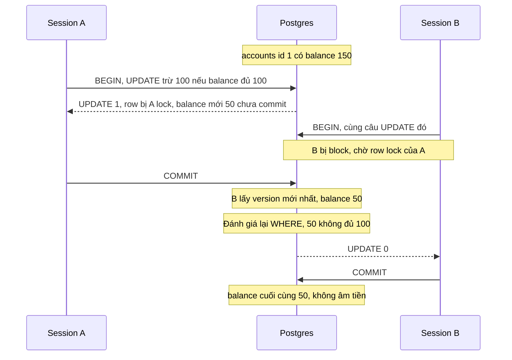
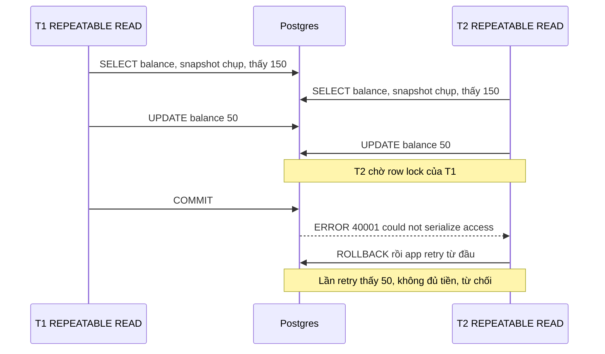
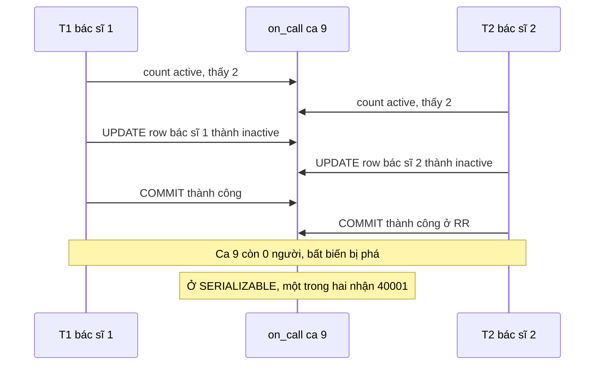
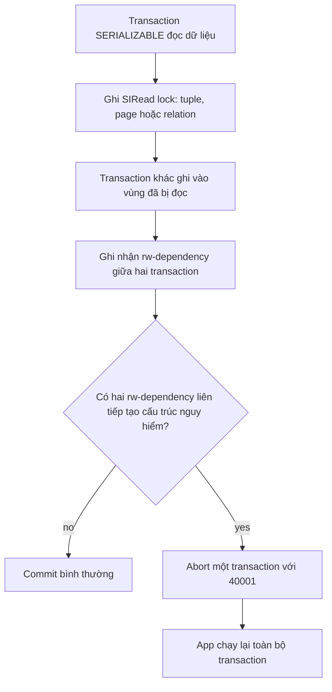

## Bối cảnh & vấn đề

Một ví điện tử có hàm rút tiền viết rất "hợp lý":

```ts
const { rows } = await db.query("SELECT balance FROM accounts WHERE id = $1", [id]);
if (rows[0].balance < amount) throw new Error("insufficient funds");
await db.query("UPDATE accounts SET balance = $1 WHERE id = $2", [rows[0].balance - amount, id]);
```

Bọc trong `BEGIN ... COMMIT` rồi, test đơn lẻ đều xanh. Nhưng khi user bấm "Rút 100" hai lần liên tiếp trên số dư 150, hai request chạy song song: cả hai đọc `150`, cả hai thấy đủ tiền, cả hai ghi `50`. User nhận 200, số dư còn 50. Transaction không sai, database không lỗi; đây là một **anomaly** mà isolation level mặc định cho phép.

Transaction đảm bảo **Atomicity** (tất cả hoặc không gì cả) và **Durability** (commit rồi thì không mất), nội dung của [lesson storage & WAL](/tracks/sql-postgres/learn/storage-wal). Còn **Isolation**, tức "các transaction chạy đồng thời ảnh hưởng nhau tới mức nào", thì **không tuyệt đối**. Mỗi database cho bạn chọn một **isolation level**, và mỗi level cho phép một số anomaly để đổi lấy hiệu năng. Hiểu chính xác level nào cho phép anomaly nào, và Postgres khác chuẩn SQL và SQL Server ở đâu, là thứ phân biệt senior với junior trong phỏng vấn.

Bài này định nghĩa từng anomaly bằng timeline hai session, rồi đi qua ba level thực tế của Postgres (Read Committed, Repeatable Read, Serializable), cách SQL Server làm cùng việc đó bằng lock hoặc version store, và cuối cùng là helper TypeScript để retry khi Postgres báo lỗi `40001`.

## Khái niệm

### Transaction, snapshot và isolation level

**Transaction** là một nhóm câu lệnh được coi như một đơn vị: `BEGIN`, các câu lệnh, rồi `COMMIT` hoặc `ROLLBACK`. Trong Postgres, câu lệnh gõ lẻ không có `BEGIN` cũng chạy trong một transaction ngầm (autocommit).

**Snapshot** là "ảnh chụp" cho biết transaction nào đã commit tại một thời điểm; một câu lệnh đọc qua snapshot chỉ thấy dữ liệu của các transaction đã commit trước khi ảnh được chụp. Postgres thực hiện điều này bằng MVCC: mỗi row version có `xmin`/`xmax`, và snapshot quyết định version nào visible ([MVCC & VACUUM](/tracks/sql-postgres/learn/mvcc-vacuum)).

**Isolation level** quyết định **khi nào chụp snapshot** và **làm gì khi hai transaction cùng đụng một dữ liệu**. Đặt bằng `BEGIN ISOLATION LEVEL REPEATABLE READ;` hoặc `SET TRANSACTION ISOLATION LEVEL ...` ngay sau `BEGIN`; mặc định toàn server nằm ở `default_transaction_isolation` (mặc định `read committed`).

### Dirty read

**Dirty read**: transaction T2 đọc được dữ liệu mà T1 **chưa commit**. Nếu T1 sau đó rollback, T2 đã ra quyết định dựa trên dữ liệu chưa bao giờ tồn tại. Ví dụ: T1 trừ số dư 1000 thành 500 nhưng chưa commit, T2 đọc 500 và từ chối một khoản thanh toán, T1 rollback. **Postgres không bao giờ cho dirty read**, ở bất kỳ level nào, vì snapshot chỉ gồm transaction đã commit.

### Non-repeatable read

**Non-repeatable read**: trong cùng một transaction, đọc **cùng một row** hai lần mà ra hai giá trị khác nhau, vì giữa hai lần đọc có transaction khác update và commit. Ví dụ: một report đọc số dư tài khoản A = 1000 ở đầu, T2 chuyển tiền và commit, report đọc lại A = 1200 ở cuối, và tổng các con số không khớp nhau.

### Phantom read

**Phantom read**: chạy lại **cùng một điều kiện tìm kiếm** mà tập row trả về khác đi, vì có transaction khác insert hoặc delete row khớp điều kiện. Khác non-repeatable read ở chỗ không row nào "thay đổi giá trị", mà có row **mới xuất hiện** (hoặc biến mất). Ví dụ: `SELECT count(*) FROM orders WHERE price > 100` ra 2, T2 insert đơn giá 200 và commit, chạy lại ra 3.

### Lost update

**Lost update**: hai transaction cùng đọc một giá trị, cùng tính giá trị mới **trong app**, cùng ghi đè; bản ghi sau xoá mất tác dụng của bản ghi trước. Đây chính là bug ví điện tử ở trên. Chuẩn SQL không liệt kê nó trong bảng anomaly, nhưng nó là anomaly phổ biến nhất trong code thực tế. Chú ý điều kiện: nó chỉ xảy ra với mẫu **read-modify-write qua app**; câu `UPDATE accounts SET balance = balance - 100` tính trong database thì không bị (lý do ở phần cơ chế).

### Write skew

**Write skew**: hai transaction cùng **đọc một tập dữ liệu chung**, mỗi bên kiểm tra một bất biến, rồi mỗi bên **ghi vào một row khác nhau**. Vì không có row nào bị cả hai ghi, không có xung đột write-write nào để phát hiện, và cả hai commit. Kết quả vi phạm bất biến mà mỗi transaction đơn lẻ đều đã kiểm tra.

Ví dụ kinh điển: bệnh viện yêu cầu mỗi ca phải còn ít nhất một bác sĩ on-call. Ca 9 có hai bác sĩ đang on-call. Bác sĩ 1 và bác sĩ 2 cùng lúc bấm "xin nghỉ": mỗi transaction đếm được 2 người, thấy "còn người khác", và tắt on-call của **chính mình** (row khác nhau). Cả hai commit: ca 9 còn 0 người. Các dạng khác trong thực tế: hai booking đặt cùng phòng họp trùng giờ (mỗi bên insert một row riêng), hai request cùng tạo username đã kiểm tra là "chưa tồn tại" khi không có unique constraint.

### Read-only anomaly

Anomaly tinh vi nhất: một transaction **chỉ đọc** cũng có thể thấy trạng thái mà không thứ tự tuần tự nào tạo ra được. Ví dụ nổi tiếng (Fekete và cộng sự): một batch đóng sổ ngày và một giao dịch gửi tiền chạy song song ở snapshot isolation; một report chỉ đọc chạy chen giữa có thể thấy "sổ đã đóng" nhưng lại không thấy giao dịch mà về logic phải thuộc về ngày đó. Repeatable Read của Postgres cho phép anomaly này; Serializable thì chặn được. Với report dài, Postgres có chế độ `SERIALIZABLE READ ONLY DEFERRABLE`: nó chờ tới khi chụp được một snapshot "an toàn" rồi chạy không bao giờ bị abort.

### Bốn level theo chuẩn và theo Postgres

Chuẩn SQL định nghĩa bốn level bằng những anomaly mà mỗi level **phải chặn**. Postgres thực hiện **mạnh hơn** chuẩn yêu cầu ở hai chỗ.

| Level | Dirty read | Non-repeatable read | Phantom | Serialization anomaly (write skew...) |
|---|---|---|---|---|
| Read Uncommitted (chuẩn) | Cho phép | Cho phép | Cho phép | Cho phép |
| Read Uncommitted (Postgres) | **Không** (chạy như RC) | Có thể | Có thể | Có thể |
| Read Committed | Không | Có thể | Có thể | Có thể |
| Repeatable Read (chuẩn) | Không | Không | Cho phép | Cho phép |
| Repeatable Read (Postgres) | Không | Không | **Không** | Có thể |
| Serializable | Không | Không | Không | Không |

Đọc bảng: "cho phép" nghĩa là chuẩn **không cấm**, không có nghĩa là database bắt buộc phải để xảy ra. Postgres chấp nhận cú pháp `READ UNCOMMITTED` nhưng xử lý như Read Committed, nên không có cách nào dirty read trong Postgres; tương tự, Repeatable Read của Postgres là **snapshot isolation**, nên không có phantom. Cái mà Repeatable Read vẫn cho phép là write skew và read-only anomaly, gọi chung là **serialization anomaly**.

**Interview angle:** câu `sql-postgres-003`: bốn level, mặc định Postgres là Read Committed, SQL Server cũng Read Committed nhưng lock-based (trừ khi bật RCSI). Red flag là nói "Postgres có dirty read với READ UNCOMMITTED như NOLOCK".

## Cơ chế hoạt động

### Read Committed: một snapshot cho mỗi câu lệnh

Ở **Read Committed** (RC), mỗi **câu lệnh** chụp một snapshot mới lúc nó bắt đầu. Trong một câu lệnh, dữ liệu nhất quán; giữa hai câu lệnh của cùng transaction, bạn thấy mọi thứ đã commit trong khoảng đó. Vì vậy hai `SELECT` liên tiếp trong cùng một transaction RC có thể trả kết quả khác nhau: non-repeatable read và phantom đều xảy ra được, đúng như chuẩn.

Phần thú vị là khi câu lệnh **ghi** (`UPDATE`, `DELETE`, `SELECT ... FOR UPDATE`) gặp một row mà transaction khác vừa sửa. Nếu transaction kia chưa commit, câu lệnh **chờ** (row lock nằm trong `xmax`). Khi transaction kia commit, Postgres **không** dùng lại version cũ trong snapshot: nó lấy **version mới nhất** của đúng row đó, **đánh giá lại điều kiện `WHERE`** trên version mới (cơ chế nội bộ tên là **EvalPlanQual**), và chỉ update nếu điều kiện vẫn đúng. Nếu row đã bị xoá, nó bỏ qua row đó.



Sơ đồ này chính là câu `sql-postgres-020`. Hai session chạy `UPDATE accounts SET balance = balance - 100 WHERE id = 1 AND balance >= 100` trên số dư 150. Session B bị block tới khi A commit, rồi được "đánh thức" và kiểm tra lại điều kiện trên version mới (balance 50). Điều kiện sai, nên B update 0 row. App đọc `rowCount = 0` và báo "không đủ tiền". Không có lost update, không âm tiền, không cần isolation level cao hơn.

Nhưng chú ý hai điều. Thứ nhất, điều này chỉ bảo vệ **câu lệnh ghi có điều kiện**; mẫu `SELECT` rồi `UPDATE balance = <số app tính>` như ở đầu bài vẫn lost update, vì `SELECT` thường không lock và `UPDATE ... WHERE id = 1` luôn đúng khi re-check. Thứ hai, re-check chỉ áp dụng cho **row bị update**, không chạy lại toàn bộ query; với câu lệnh phức tạp (join, subquery đọc bảng khác), kết quả có thể là một tổ hợp không nhất quán. Tài liệu Postgres nói rõ RC "không phù hợp cho câu lệnh có điều kiện tìm kiếm phức tạp".

**Interview angle:** trả lời `sql-postgres-020` phải có từ khoá "B chờ lock, rồi re-evaluate WHERE trên version mới nhất". Red flag là "cả hai thành công và số dư âm 50".

### Ba cách chặn lost update ở Read Committed

Lost update là việc của **app**, và có ba cách chữa chuẩn (câu `sql-postgres-022`):

1. **Atomic UPDATE**: đẩy phép tính vào database. `UPDATE stock SET qty = qty - $1 WHERE id = $2 AND qty >= $1` rồi kiểm tra `rowCount`. Nhanh và đơn giản nhất, dùng được khi logic diễn đạt được bằng SQL.
2. **Pessimistic lock**: `SELECT ... FOR UPDATE` để lock row trước khi đọc-tính-ghi. Session thứ hai chờ ở câu `SELECT` và sẽ đọc giá trị mới sau khi session đầu commit. Giá phải trả: giữ connection và lock trong suốt thời gian tính toán, nguy cơ deadlock nếu lock nhiều row không theo thứ tự ([Locking](/tracks/sql-postgres/learn/locking-concurrency)).
3. **Optimistic lock**: thêm cột `version`, và `UPDATE ... SET version = version + 1 WHERE id = $1 AND version = $2`. Nếu `rowCount = 0` thì ai đó đã sửa trước; báo conflict cho user hoặc retry. Không giữ lock, hợp với form chỉnh sửa trên UI kéo dài vài phút; contention cao thì retry nhiều.

### Repeatable Read: snapshot isolation

Ở **Repeatable Read** (RR), snapshot được chụp **một lần** tại câu lệnh đầu tiên của transaction (không phải tại `BEGIN`) và dùng cho **mọi** câu lệnh sau. Cả transaction nhìn một trạng thái đóng băng: đọc lại row nào cũng ra giá trị cũ, chạy lại điều kiện nào cũng ra tập row cũ. Vì vậy Postgres RR chặn cả non-repeatable read lẫn phantom. Mô hình này gọi là **snapshot isolation**.

Khi transaction RR cố **ghi** vào một row mà transaction khác đã sửa và commit **sau** thời điểm snapshot, Postgres không thể làm như RC (nhảy sang version mới), vì như thế sẽ phá snapshot. Thay vào đó nó báo lỗi:

```text
ERROR:  could not serialize access due to concurrent update
SQLSTATE: 40001
```

Transaction bị abort và app phải **chạy lại cả transaction** từ đầu. Với ví dụ ví điện tử: ở RR, dù app đọc rồi mới ghi, session thứ hai sẽ nhận `40001` khi `UPDATE`, nên lost update bị phát hiện thay vì âm thầm xảy ra.



Điều RR **không** chặn là write skew. Trong ví dụ bác sĩ, T1 update row của bác sĩ 1, T2 update row của bác sĩ 2: không có row nào bị cả hai ghi, nên không có "concurrent update" để báo lỗi. Cả hai commit.



**Interview angle:** `sql-postgres-021` muốn nghe "RR của Postgres là snapshot isolation, không phantom (mạnh hơn chuẩn), nhưng có write skew và phải retry 40001"; `sql-postgres-055` muốn bạn vẽ được đúng timeline write skew này.

### Serializable: Serializable Snapshot Isolation

**Serializable** đảm bảo kết quả của mọi transaction đã commit giống như khi chúng chạy **lần lượt** theo một thứ tự nào đó. Postgres (từ 9.1) thực hiện level này bằng **SSI** (Serializable Snapshot Isolation): transaction vẫn chạy trên snapshot như RR, vẫn không block nhau khi đọc, nhưng Postgres **theo dõi** thêm những gì mỗi transaction đã đọc.

Cơ chế: mỗi lần đọc, Postgres ghi một **SIRead lock** (predicate lock) trên tuple, page index hoặc cả relation đã đọc. Lock này **không block ai**; nó chỉ là dấu vết. Khi transaction khác ghi vào vùng mà ai đó đã đọc, Postgres ghi nhận một **rw-dependency** (T1 đọc cái mà T2 sau đó ghi). Nếu phát hiện một cấu trúc nguy hiểm, cụ thể là hai rw-dependency liên tiếp tạo thành vòng có thể không serializable được, nó abort một transaction với:

```text
ERROR:  could not serialize access due to read/write dependencies among transactions
DETAIL:  Reason code: Canceled on identification as a pivot, during commit attempt.
SQLSTATE: 40001
```

Trong ví dụ bác sĩ: T1 đọc tập row ca 9 và T2 ghi vào tập đó; T2 cũng đọc tập đó và T1 ghi vào. Hai dependency ngược chiều nhau, nên một bên bị abort, retry, đếm lại thấy chỉ còn 1 người và từ chối.



Sơ đồ cho thấy vì sao SSI rẻ hơn Serializable kiểu lock truyền thống: không có bước nào **chờ**. Reader không block writer, writer không block reader; giá phải trả là CPU/RAM để theo dõi dependency và một tỉ lệ transaction bị abort cần retry. SSI có thể abort **nhầm** (false positive): nếu query đọc bằng Seq Scan, SIRead lock phủ cả relation và mọi ghi vào table đó đều thành "xung đột". Có index tốt thì lock chỉ phủ các page index liên quan và false positive giảm hẳn. Khi số predicate lock quá nhiều, Postgres **gộp** lock tuple thành lock page rồi relation (điều chỉnh bằng `max_pred_locks_per_transaction`, `max_pred_locks_per_relation`), cũng làm tăng false positive.

Hai điều kiện để SSI thực sự bảo vệ bất biến: **mọi** transaction đụng tới dữ liệu đó phải chạy ở `SERIALIZABLE` (một transaction RC chen vào thì không được theo dõi), và app **phải có vòng retry** cho `40001`. Lỗi có thể đến ở bất kỳ câu lệnh nào, kể cả chính `COMMIT`.

**Interview angle:** follow-up của `sql-postgres-055` là "Serializable tốn gì?". Trả lời: throughput giảm do abort và retry, cần retry loop idempotent, transaction nên ngắn, cần index tốt để giảm false positive; không phải "lock nhiều và deadlock" như Serializable kiểu lock.

## Ví dụ thực tế

### Hai session psql ở Repeatable Read

Chuẩn bị:

```sql
CREATE TABLE accounts (id int PRIMARY KEY, balance int NOT NULL);
INSERT INTO accounts VALUES (1, 150);
```

Mở hai cửa sổ `psql` và chạy theo đúng thứ tự thời gian:

```sql
-- Session A
BEGIN ISOLATION LEVEL REPEATABLE READ;
SELECT balance FROM accounts WHERE id = 1;          -- 150

-- Session B
BEGIN ISOLATION LEVEL REPEATABLE READ;
SELECT balance FROM accounts WHERE id = 1;          -- 150

-- Session A
UPDATE accounts SET balance = 50 WHERE id = 1;      -- UPDATE 1
COMMIT;

-- Session B
SELECT balance FROM accounts WHERE id = 1;          -- vẫn 150: snapshot cố định
UPDATE accounts SET balance = 50 WHERE id = 1;
```

```text
ERROR:  could not serialize access due to concurrent update
```

```sql
-- Session B
ROLLBACK;
SELECT balance FROM accounts WHERE id = 1;          -- 50 (transaction mới, snapshot mới)
```

Thử lại cùng kịch bản với `READ COMMITTED`: câu `SELECT` thứ hai của B trả **50** (snapshot mới cho mỗi câu lệnh), và `UPDATE ... SET balance = 50` thành công, ghi đè: đó là lost update nếu 50 được tính từ giá trị 150 đọc trước đó.

### Helper TypeScript: retry khi gặp 40001

Mọi code chạy ở `REPEATABLE READ` hoặc `SERIALIZABLE` cần một wrapper chạy lại cả transaction. Helper dưới đây dùng `node-postgres` (`pg`), retry cả `40001` (serialization failure) và `40P01` (deadlock detected), với exponential backoff có jitter.

```ts
import { Pool, type PoolClient } from "pg";

type Isolation = "READ COMMITTED" | "REPEATABLE READ" | "SERIALIZABLE";
const RETRYABLE = new Set(["40001", "40P01"]);
const sleep = (ms: number) => new Promise((r) => setTimeout(r, ms));

export async function withTransaction<T>(
  pool: Pool,
  isolation: Isolation,
  fn: (client: PoolClient) => Promise<T>,
  { maxAttempts = 5, baseDelayMs = 20 } = {},
): Promise<T> {
  for (let attempt = 1; ; attempt++) {
    const client = await pool.connect();
    try {
      await client.query(`BEGIN ISOLATION LEVEL ${isolation}`);
      const result = await fn(client);
      await client.query("COMMIT"); // 40001 cũng có thể xảy ra ở đây
      return result;
    } catch (err) {
      await client.query("ROLLBACK").catch(() => {});
      const code = (err as { code?: string }).code;
      if (!code || !RETRYABLE.has(code) || attempt >= maxAttempts) throw err;
      const delay = Math.round(baseDelayMs * 2 ** (attempt - 1) * (0.5 + Math.random()));
      console.warn(`attempt ${attempt} failed with ${code}, retrying in ${delay}ms`);
      await sleep(delay);
    } finally {
      client.release();
    }
  }
}
```

Dùng helper để chặn write skew của bài toán bác sĩ on-call:

```ts
const pool = new Pool({ connectionString: process.env.DATABASE_URL });

async function goOffCall(doctorId: number): Promise<string> {
  return withTransaction(pool, "SERIALIZABLE", async (c) => {
    const { rows } = await c.query(
      "SELECT count(*)::int AS n FROM on_call WHERE shift_id = 9 AND active",
    );
    if (rows[0].n < 2) return `doctor ${doctorId}: refused, last one on call`;
    await c.query(
      "UPDATE on_call SET active = false WHERE shift_id = 9 AND doctor_id = $1",
      [doctorId],
    );
    return `doctor ${doctorId}: off call`;
  });
}

console.log(await Promise.all([goOffCall(1), goOffCall(2)]));
```

```text
attempt 1 failed with 40001, retrying in 27ms
[ 'doctor 1: off call', 'doctor 2: refused, last one on call' ]
```

Một request thắng; request kia bị abort, chạy lại, đếm được 1 và từ chối. Đổi `"SERIALIZABLE"` thành `"REPEATABLE READ"` và bạn sẽ thấy cả hai in `off call`. Ba quy tắc khi viết `fn`: nó phải **chạy lại được** (không gửi email, không gọi payment API bên trong; làm việc đó sau khi commit hoặc qua outbox), nó phải **ngắn**, và nó dùng đúng `client` được truyền vào, không dùng `pool.query` (sẽ chạy ngoài transaction).

## Trade-offs & lựa chọn thay thế

| Cách tiếp cận | Chặn được | Giá phải trả | Hợp với |
|---|---|---|---|
| Read Committed + atomic UPDATE có điều kiện | Lost update trên một row | Logic phải viết được bằng một câu SQL | Trừ kho, trừ số dư, counter |
| Read Committed + `SELECT ... FOR UPDATE` | Lost update, write skew nếu lock đúng tập row | Chờ lock, giữ connection, rủi ro deadlock | Read-modify-write phức tạp trên vài row |
| Read Committed + optimistic `version` | Lost update | Retry/conflict khi contention cao | Form chỉnh sửa dài trên UI |
| Repeatable Read | Non-repeatable read, phantom, lost update (báo 40001) | Retry 40001; vẫn có write skew | Report cần một ảnh nhất quán, `pg_dump` |
| Serializable (SSI) | Mọi serialization anomaly | Retry 40001, false positive, overhead theo dõi | Bất biến trải trên nhiều row khó lock tường minh |
| Constraint trong DB | Bất biến diễn đạt được (unique, exclusion) | Không phải bất biến nào cũng viết được | Không trùng booking, username duy nhất |

Khi nào chọn gì? Đa số OLTP chạy **Read Committed** và xử lý từng điểm nóng bằng atomic UPDATE hoặc lock tường minh: nó nhanh, dễ hiểu, không cần retry khắp nơi. Chọn **Repeatable Read** khi một transaction chỉ đọc cần nhiều câu lệnh nhìn cùng một trạng thái (export, report đối soát). Chọn **Serializable** khi bất biến phụ thuộc vào **tập** row (còn ít nhất một người on-call, tổng hạn mức không vượt X) và bạn không muốn tự tìm đúng row để lock; đổi lại cả team phải có kỷ luật retry.

Trước khi tăng isolation, hãy hỏi "bất biến này có viết được thành constraint không?". Booking phòng trùng giờ chặn được bằng **exclusion constraint** (`EXCLUDE USING gist (room_id WITH =, during WITH &&)`); username chặn bằng unique index. Constraint luôn đúng ở mọi isolation level và không cần retry logic.

## So sánh với SQL Server

SQL Server có cùng tên level nhưng cơ chế mặc định khác hẳn: **lock-based**, không phải MVCC.

**Read Committed mặc định (lock-based).** `SELECT` lấy **shared lock** trên row hoặc page đang đọc và nhả ngay sau khi đọc xong row đó. Writer giữ **exclusive lock** tới khi commit. Hệ quả: reader **bị block** bởi writer đang sửa row đó, và writer cũng có thể phải chờ reader. Deadlock giữa reader và writer là chuyện thường ngày, nên nhiều codebase rải `WITH (NOLOCK)` khắp nơi. `NOLOCK` là Read Uncommitted: dirty read, và tệ hơn, có thể đọc **trùng hoặc thiếu row** khi page split xảy ra giữa lúc scan.

**READ COMMITTED SNAPSHOT (RCSI).** Bật bằng `ALTER DATABASE app SET READ_COMMITTED_SNAPSHOT ON`. Mỗi câu lệnh đọc một snapshot từ **version store** (trong `tempdb`, hoặc Persistent Version Store khi bật ADR), gần giống Postgres RC: reader không block writer và ngược lại. Chi phí là tải lên tempdb và 14 byte version pointer mỗi row. **Azure SQL Database bật RCSI mặc định** (verify); SQL Server on-premises thì không.

**SNAPSHOT isolation.** Cần `ALLOW_SNAPSHOT_ISOLATION ON` rồi `SET TRANSACTION ISOLATION LEVEL SNAPSHOT`. Snapshot cho cả transaction, tương đương Postgres RR; ghi vào row đã bị sửa sau snapshot thì báo lỗi **3960** ("Snapshot isolation transaction aborted due to update conflict"), tương đương `40001`.

**Repeatable Read và Serializable (lock-based).** RR của SQL Server giữ shared lock trên mọi row đã đọc **tới cuối transaction**, nên row đã đọc không bị sửa, nhưng row mới vẫn chen vào được: **có phantom**, đúng như chuẩn. Serializable thêm **key-range lock** để chặn phantom, trả giá bằng blocking và deadlock nhiều hơn. Ngược lại, Postgres RR không phantom và Postgres Serializable không block.

| | SQL Server RC (mặc định on-prem) | SQL Server RCSI | Postgres RC |
|---|---|---|---|
| Reader chờ writer? | Có | Không | Không |
| Dirty read | Chỉ khi dùng `NOLOCK` | Không | Không bao giờ |
| Snapshot | Không có | Mỗi câu lệnh | Mỗi câu lệnh |
| Nơi giữ version cũ | Không giữ | tempdb / PVS | Ngay trong heap (cần VACUUM) |
| UPDATE gặp row vừa bị sửa | Chờ lock rồi đọc bản mới | Chờ lock rồi đọc bản mới | Chờ lock, re-evaluate WHERE trên bản mới |

Bug khi port code từ SQL Server lock-based sang RCSI hoặc Postgres: code cũ "vô tình đúng" nhờ blocking. Ví dụ, `SELECT` kiểm tra tồn kho bị block cho tới khi transaction đang trừ kho commit, nên luôn đọc số mới. Sang MVCC, `SELECT` đọc ngay bản đã commit trước đó mà không chờ, và hai request cùng thấy "còn hàng": race condition xuất hiện mà không một dòng code nào thay đổi. Cách chữa là lock tường minh (`FOR UPDATE`), atomic UPDATE, hoặc constraint.

**Interview angle:** `sql-postgres-037` cần ba ý: lock-based RC block và dẫn tới `NOLOCK`; RCSI là statement snapshot từ version store; Postgres RC là MVCC luôn bật. Follow-up là chính bug "vô tình đúng nhờ blocking" ở trên.

## Edge cases & failure modes

- **Retry storm.** Dưới contention cao (flash sale trên một row tồn kho), Serializable hay Repeatable Read abort liên tục; retry không backoff làm tải càng tăng. Giới hạn số lần retry, backoff có jitter, và với hot row thì chuyển sang atomic UPDATE hoặc hàng đợi.
- **Retry không idempotent.** `fn` gửi email hay gọi Stripe rồi mới bị `40001`: lần retry gửi lần hai. Side effect bên ngoài phải nằm sau commit (outbox pattern).
- **Transaction dài ở Repeatable Read/Serializable.** Snapshot cũ giữ `xmin` của cả cluster, VACUUM không dọn được dead tuple, table bloat ([MVCC & VACUUM](/tracks/sql-postgres/learn/mvcc-vacuum)). Transaction càng dài thì càng dễ va chạm và bị abort.
- **Trộn level.** Một transaction Serializable và một transaction RC cùng sửa một bất biến: SSI không theo dõi transaction RC, nên write skew vẫn xảy ra. Đặt `default_transaction_isolation` cho cả database, hoặc bắt buộc trong helper.
- **False positive vì Seq Scan.** Table thiếu index làm SIRead lock phủ cả relation; tỉ lệ `40001` tăng vọt khi traffic tăng dù các transaction đụng các row khác nhau.
- **Read Committed với câu lệnh phức tạp.** `UPDATE ... FROM` join nhiều bảng, re-check chỉ áp dụng cho row bị update; các bảng khác vẫn đọc theo snapshot cũ, có thể cho kết quả không nhất quán. Chia nhỏ hoặc lock tường minh.
- **PgBouncer transaction mode và `SET`.** `SET default_transaction_isolation` ở mức session sẽ rơi vào connection khác. Luôn khai báo isolation trong `BEGIN ISOLATION LEVEL ...` ([Connection pooling](/tracks/sql-postgres/learn/connection-pooling)).
- **Deadlock `40P01`.** Không phải lỗi isolation, nhưng cũng cần retry; nguồn gốc thường là lock row theo thứ tự khác nhau giữa hai code path.

## Pitfalls

- ❌ Nghĩ `BEGIN ... COMMIT` là đủ chống race → ✅ transaction chỉ đảm bảo atomicity; ở RC, read-modify-write qua app vẫn lost update. Dùng atomic UPDATE, `FOR UPDATE` hoặc optimistic version.
- ❌ Dùng `READ UNCOMMITTED` ở Postgres để "đọc nhanh như NOLOCK" → ✅ nó chạy như RC; reader trong Postgres vốn không bị block.
- ❌ Tin rằng Postgres RR có phantom "vì chuẩn nói vậy" → ✅ Postgres RR là snapshot isolation, không phantom; cái nó thiếu là chặn write skew.
- ❌ Bật Serializable mà không có retry loop → ✅ `40001` là hành vi bình thường của SSI, không phải bug; mọi transaction phải chạy lại được.
- ❌ Chỉ bắt lỗi ở câu `UPDATE` → ✅ `40001` có thể đến ở `COMMIT`; retry toàn bộ transaction, không retry từng câu.
- ❌ Chống write skew bằng cách lock row mình định ghi → ✅ phải lock **tập row đã đọc để kiểm tra bất biến** (mọi row on-call của ca 9, hoặc row `shifts` cha), hoặc dùng Serializable, hoặc constraint.
- ❌ Port code SQL Server mà giữ giả định "SELECT bị block nên luôn đọc số mới" → ✅ trên Postgres/RCSI, reader không chờ writer; thêm lock tường minh ở đúng chỗ.
- ❌ Gọi HTTP bên ngoài trong transaction đang giữ `FOR UPDATE` → ✅ giữ transaction ngắn; lock càng lâu, hàng đợi càng dài.

## Tóm tắt

- Anomaly: **dirty read** (đọc chưa commit), **non-repeatable read** (row đổi giá trị), **phantom** (tập row đổi), **lost update** (ghi đè qua app), **write skew** (đọc chung, ghi row khác nhau), **read-only anomaly**.
- Postgres mặc định **Read Committed**: snapshot mỗi câu lệnh; `READ UNCOMMITTED` chạy như RC nên **không bao giờ dirty read**.
- RC khi UPDATE gặp row đang bị sửa: **chờ lock, lấy version mới nhất, re-evaluate WHERE** (EvalPlanQual). Atomic UPDATE có điều kiện an toàn; read-modify-write qua app thì không.
- **Repeatable Read = snapshot isolation**: snapshot từ câu lệnh đầu tiên, không phantom, ghi xung đột báo `40001` "could not serialize access due to concurrent update"; vẫn có write skew.
- **Serializable = SSI**: SIRead lock không block, phát hiện rw-dependency nguy hiểm và abort với `40001`; cần retry loop, mọi transaction liên quan phải Serializable, index tốt để giảm false positive.
- Chống lost update: atomic UPDATE, `SELECT ... FOR UPDATE`, hoặc optimistic `version`; chống write skew: Serializable, lock tập row đã đọc, hoặc constraint.
- SQL Server: RC mặc định **lock-based** (reader bị block, văn hoá `NOLOCK`); **RCSI** = statement snapshot từ version store (mặc định trên Azure SQL Database); **SNAPSHOT** ≈ Postgres RR (lỗi 3960); RR lock-based vẫn có phantom.
