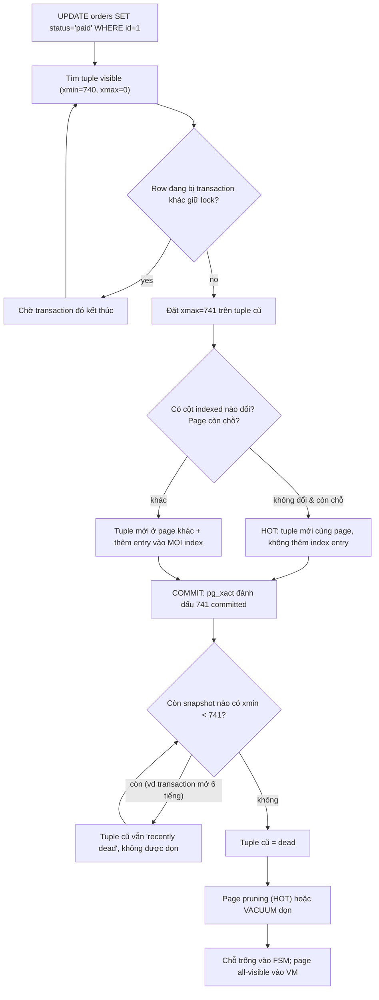

## Bối cảnh & vấn đề

Hãy tưởng tượng một database chỉ dùng lock để bảo vệ dữ liệu. Một job báo cáo chạy `SELECT sum(total) FROM orders` mất 40 giây. Để kết quả nhất quán, nó phải lấy **shared lock** trên các row đã đọc. Trong 40 giây đó, mọi `UPDATE orders SET status = 'paid'` chạm vào những row này đều phải chờ, và API checkout treo theo. Ngược lại, một transaction đang update 10.000 row làm mọi `SELECT` trên các row đó phải chờ nó commit. Đây là hành vi của SQL Server ở chế độ mặc định on-prem (`READ COMMITTED` dựa trên lock): **reader chặn writer, writer chặn reader**.

**MVCC (Multi-Version Concurrency Control)** giải bài toán này bằng một ý tưởng đơn giản: đừng sửa row tại chỗ, hãy giữ **nhiều version** của row. Mỗi transaction đọc theo một **snapshot**, tức là một "ảnh chụp" xem transaction nào đã commit tại thời điểm đó. Reader đọc version cũ phù hợp với snapshot của nó, writer tạo version mới. Hai bên không cần chờ nhau. Chỉ khi **hai writer cùng sửa một row** thì mới phải xếp hàng (xem [locking & concurrency](/tracks/sql-postgres/learn/locking-concurrency)).

Không có gì miễn phí. Version cũ phải được giữ lại cho tới khi không còn snapshot nào cần nó, sau đó phải có người dọn. Ở Postgres, người dọn là **VACUUM**. Khi VACUUM không theo kịp, hoặc bị một transaction mở 6 tiếng chặn lại, table phình to (**bloat**), query chậm dần và disk tăng mỗi ngày. Trường hợp xấu nhất, bộ đếm transaction ID 32-bit gần "quay vòng" và Postgres **từ chối mọi lệnh ghi** để bảo vệ dữ liệu. Bài này đi từ tuple header tới những sự cố production đó.

**Interview angle:** interviewer muốn nghe bạn nói được cả lợi ích (không block đọc/ghi) lẫn cái giá (dead tuple, bloat, wraparound), không chỉ "MVCC = không lock".

## Khái niệm

### Tuple, xmin, xmax và ctid

Trong Postgres, mỗi version của một row trên disk gọi là một **tuple**, nằm trong heap page 8 KB (xem [storage & WAL](/tracks/sql-postgres/learn/storage-wal)). Mỗi tuple có header chứa hai trường quan trọng nhất cho MVCC. **`xmin`** là transaction ID (xid) đã tạo ra tuple này (bằng INSERT hoặc UPDATE). **`xmax`** là xid đã xoá hoặc thay thế tuple (bằng DELETE hoặc UPDATE), hoặc `0` nếu chưa ai đụng tới. `xmax` cũng được dùng để ghi row lock, nên một `SELECT ... FOR UPDATE` cũng ghi vào `xmax`.

**`ctid`** là địa chỉ vật lý của tuple: `(số page, số line pointer)`, ví dụ `(0,1)` là tuple đầu tiên trên page 0. Khi một row được UPDATE, tuple cũ trỏ `ctid` của nó sang tuple mới, tạo thành một chuỗi version. Vì `ctid` thay đổi sau mỗi UPDATE, đừng bao giờ dùng nó làm khoá lâu dài trong ứng dụng.

Ba cột này là system column, bạn có thể SELECT trực tiếp: `SELECT xmin, xmax, ctid, * FROM t`. Đây là công cụ tốt nhất để "nhìn thấy" MVCC.

### Transaction ID và commit log (pg_xact)

Mỗi transaction **ghi dữ liệu** được cấp một xid 32-bit tăng dần. Transaction chỉ đọc thì không tốn xid thật, nó chỉ có một **virtual xid**. Xid được cấp lười biếng ở lệnh ghi đầu tiên, không phải ở `BEGIN`. Nhờ vậy một hệ thống đọc nhiều không "đốt" xid.

Tuple chỉ ghi xid, không ghi "đã commit hay chưa". Trạng thái của từng xid (in progress, committed, aborted) nằm trong **commit log**, thư mục `pg_xact` (tên cũ là `pg_clog`), mỗi xid chiếm 2 bit. Khi reader gặp một tuple có `xmin = 741`, nó tra `pg_xact` xem 741 đã commit chưa. Để khỏi tra lại mỗi lần, lần đầu tra xong Postgres đặt **hint bit** trên tuple header (ví dụ `XMIN_COMMITTED`).

Hệ quả thú vị: **ROLLBACK ở Postgres gần như miễn phí**. Nó chỉ đánh dấu xid là aborted trong `pg_xact`. Các tuple mà transaction đó đã chèn vẫn nằm trên page, trở thành rác vô hình và chờ VACUUM dọn.

### Snapshot

**Snapshot** trả lời câu hỏi "transaction nào tôi được coi là đã commit?". Nó gồm ba phần:

- **`xmin`**: xid nhỏ nhất còn đang chạy. Mọi xid nhỏ hơn đã kết thúc (commit hoặc abort).
- **`xmax`**: xid tiếp theo sẽ được cấp. Mọi xid từ đây trở lên là "tương lai", vô hình.
- **`xip`** (in-progress list): các xid nằm giữa `xmin` và `xmax` nhưng lúc chụp vẫn đang chạy, nên cũng vô hình.

Bạn xem được snapshot hiện tại bằng `SELECT pg_current_snapshot();` (PG 13+), kết quả dạng `740:745:741,743`, nghĩa là xmin=740, xmax=745, xip={741, 743}. Ở `READ COMMITTED`, mỗi **câu lệnh** chụp snapshot mới. Ở `REPEATABLE READ` và `SERIALIZABLE`, cả transaction dùng snapshot chụp ở câu lệnh đầu tiên. Chi tiết anomaly từng level nằm ở bài [isolation levels](/tracks/sql-postgres/learn/isolation-levels).

### Quy tắc visibility

Kết hợp tuple header, `pg_xact` và snapshot, một tuple **visible** với snapshot S khi:

1. `xmin` là của chính transaction đang đọc, hoặc `xmin` đã commit **và** không thuộc "tương lai" hay `xip` của S; **và**
2. `xmax` bằng 0, hoặc `xmax` đã abort, hoặc `xmax` vẫn còn chạy / thuộc tương lai theo S (tức là việc xoá chưa "xảy ra" với S). Trường hợp `xmax` chỉ là row lock cũng không làm tuple biến mất.

Nói bằng lời: "tuple được sinh ra trước tôi, và chưa bị giết trước tôi". Hai transaction với hai snapshot khác nhau có thể nhìn cùng một page và thấy hai version khác nhau của cùng một row. Đó là toàn bộ phép màu của MVCC.

### Dead tuple và bloat

Một tuple là **dead** khi `xmax` đã commit và **không còn snapshot nào** có thể cần nhìn thấy nó. Mốc để phán đoán là **xmin horizon** (còn gọi là OldestXmin): xmin nhỏ nhất trong tất cả snapshot đang tồn tại trên toàn cluster, cộng thêm những thứ giữ horizon khác như replication slot. Tuple bị xoá bởi xid mới hơn horizon vẫn "có thể còn ai đó cần", nên VACUUM không được đụng vào.

**Bloat** là phần không gian trong table hoặc index bị chiếm bởi dead tuple hoặc bởi chỗ trống không được tái sử dụng. Table 10 GB dữ liệu sống nhưng chiếm 30 GB trên disk nghĩa là seq scan đọc gấp 3 lần page cần thiết, cache hit ratio giảm và backup to hơn.

**Interview angle:** câu follow-up kinh điển là "tại sao `n_dead_tup` tăng mãi dù autovacuum vẫn chạy?" Câu trả lời gần như luôn là xmin horizon bị giữ lại.

### VACUUM, VACUUM FULL và pg_repack

**`VACUUM`** (thường) quét table và làm năm việc: xoá các index entry trỏ tới dead tuple, đánh dấu chỗ của dead tuple là trống trong **free space map (FSM)** để INSERT/UPDATE sau dùng lại, cập nhật **visibility map (VM)** (bit "all-visible" và "all-frozen" cho từng page), **freeze** các tuple đủ cũ, và cập nhật thống kê `reltuples`/`relpages`. Nó chỉ lấy lock `SHARE UPDATE EXCLUSIVE`, nên SELECT/INSERT/UPDATE/DELETE vẫn chạy bình thường. Nó thường **không trả dung lượng về OS**, chỉ cắt được các page trống ở cuối file.

**`VACUUM FULL`** viết lại toàn bộ table sang file mới chỉ gồm tuple sống, rebuild mọi index, rồi xoá file cũ. Dung lượng được trả về OS, nhưng nó giữ **`ACCESS EXCLUSIVE`** suốt quá trình: không ai đọc hay ghi được table, và cần thêm disk bằng kích thước table mới. Với table 500 GB, đó là hàng giờ downtime.

**`pg_repack`** (extension) làm được việc của VACUUM FULL mà gần như online: tạo bản sao table, dùng trigger ghi lại các thay đổi xảy ra trong lúc copy, áp dụng log đó, rồi swap file dưới một `ACCESS EXCLUSIVE` rất ngắn ở cuối. Nó cần PK hoặc unique index NOT NULL và cần gấp đôi disk tạm thời.

### Visibility map và count(*)

**Visibility map** lưu 2 bit cho mỗi heap page. Bit **all-visible** nghĩa là mọi tuple trên page đều visible với mọi transaction. Bit **all-frozen** nghĩa là mọi tuple đã freeze. VM có hai công dụng: VACUUM bỏ qua page all-visible, và **index-only scan** chỉ cần đọc heap cho những page chưa all-visible.

Đây là lý do `SELECT count(*) FROM orders` chậm. Postgres không có counter chung vì mỗi snapshot có thể thấy số row khác nhau. Nó phải quét tuple và kiểm tra visibility từng cái, hoặc dùng index-only scan trên index nhỏ nhất và vẫn phải vào heap ở những page VM chưa đánh dấu. Table vừa bị update nhiều, VM ít bit all-visible, count sẽ chậm hơn hẳn. Khi chỉ cần ước lượng, dùng `SELECT reltuples FROM pg_class WHERE relname = 'orders'` (do VACUUM/ANALYZE cập nhật).

### HOT update và fillfactor

Vì mỗi UPDATE tạo tuple mới ở `ctid` mới, lẽ ra **mọi index** của table đều phải thêm entry mới trỏ tới nó, kể cả index trên cột không đổi. Table có 6 index thì một UPDATE đổi `status` sinh ra 1 heap write cộng 6 index write. **HOT (Heap-Only Tuple)** tránh việc đó khi thoả hai điều kiện: UPDATE **không đổi cột nào nằm trong index** (PG 16+ không tính các index "summarizing" như BRIN (verify)), và **page hiện tại còn đủ chỗ** cho tuple mới.

Khi đó tuple mới nằm cùng page và được đánh dấu heap-only. Index vẫn trỏ vào line pointer gốc, Postgres đi theo chuỗi HOT trong page để tìm version đúng. Không có index entry mới, và dead tuple trong chuỗi HOT có thể được dọn bằng **page pruning** ngay khi một query đọc page gần đầy, không cần chờ VACUUM.

**`fillfactor`** quyết định INSERT được lấp page tới bao nhiêu phần trăm (mặc định 100 cho table). Đặt `fillfactor = 85` chừa 15% mỗi page cho UPDATE sau, làm HOT khả thi hơn đổi lại table to hơn một chút. Theo dõi tỉ lệ bằng `n_tup_hot_upd / n_tup_upd` trong `pg_stat_user_tables`.

**Interview angle:** "bạn thêm index trên `updated_at` cho sync job, vì sao write latency tăng?" Vì mọi UPDATE đều đổi `updated_at`, cột đó nay có index nên HOT chết hoàn toàn.

### Transaction ID wraparound và freeze

Xid là số **32-bit**, khoảng 4,29 tỉ giá trị, và được so sánh theo modulo: với mỗi xid, khoảng 2,1 tỉ xid "trước nó" là quá khứ, 2,1 tỉ "sau nó" là tương lai. Nếu một tuple có `xmin = 100` sống quá 2,1 tỉ transaction, bỗng một ngày xid 100 bị coi là "tương lai" và row **biến mất** khỏi mọi query. Đó là **wraparound**, một dạng mất dữ liệu.

Cách phòng là **freeze**: VACUUM đánh dấu những tuple đủ cũ (xmin đã commit từ lâu hơn `vacuum_freeze_min_age`, mặc định 50 triệu) là "frozen", nghĩa là visible với mọi người mãi mãi bất kể xid. Mỗi table có `relfrozenxid` (xid cũ nhất có thể còn chưa freeze), mỗi database có `datfrozenxid`. Khi `age(relfrozenxid)` vượt **`autovacuum_freeze_max_age`** (mặc định 200 triệu), autovacuum buộc phải chạy một **anti-wraparound vacuum** trên table đó, **kể cả khi autovacuum bị tắt**, và lần này nó không tự nhường khi gặp lock conflict.

## Cơ chế hoạt động

Sơ đồ sau theo vòng đời một row từ lúc bị UPDATE tới lúc chỗ của nó được tái sử dụng:



Luồng này có ba điểm đáng chú ý. Thứ nhất, UPDATE **không ghi đè** tuple cũ, nó chỉ đặt `xmax` rồi viết tuple mới. Vì vậy câu "update = delete + insert" chỉ đúng một nửa với Postgres: về logic đúng là có một version chết và một version mới, nhưng tuple mới có thể nằm cùng page và bỏ qua index (HOT), còn việc "delete" bản cũ chỉ là đặt `xmax`. Thứ hai, **commit chỉ là 2 bit** trong `pg_xact` cộng với WAL flush, không có bước "copy dữ liệu vào file chính". Thứ ba, vòng lặp ở nút `I` là trái tim của mọi sự cố bloat: chỉ cần một snapshot cũ còn sống, mọi tuple chết sau thời điểm đó đều bị giữ lại, trên **toàn bộ database**, không chỉ trên table mà transaction cũ đụng tới.

### Autovacuum quyết định khi nào chạy

Autovacuum launcher thức dậy mỗi `autovacuum_naptime` (1 phút) và chọn table cần dọn. Một table được VACUUM khi:

```text
n_dead_tup > autovacuum_vacuum_threshold + autovacuum_vacuum_scale_factor * reltuples
            (mặc định 50)                  (mặc định 0.2)
```

Với table `orders` 200 triệu row, ngưỡng là **40 triệu** dead tuple. Autovacuum chờ tới lúc table đã bloat đáng kể mới bắt đầu, rồi một lần chạy phải dọn 40 triệu tuple. PG 13+ còn có ngưỡng theo số INSERT (`autovacuum_vacuum_insert_threshold`, `..._insert_scale_factor`) để table chỉ-insert cũng được freeze và cập nhật VM. PG 18 thêm `autovacuum_vacuum_max_threshold` (mặc định 100 triệu) làm trần cho ngưỡng này (verify).

Tốc độ bị giới hạn bởi **cost-based delay**: mỗi page đọc/ghi tốn "điểm", khi đạt `autovacuum_vacuum_cost_limit` (mặc định 200, dùng chung cho mọi worker) thì worker ngủ `autovacuum_vacuum_cost_delay` (2 ms từ PG 12). Mặc định này được thiết kế cho ổ đĩa quay thời xưa. Trên SSD/cloud, với table lớn, gần như luôn nên tăng cost limit và giảm scale factor **riêng cho table đó**:

```sql
ALTER TABLE orders SET (
  autovacuum_vacuum_scale_factor = 0.01,   -- 1% thay vì 20%
  autovacuum_vacuum_threshold    = 10000,
  autovacuum_vacuum_cost_limit   = 2000,
  autovacuum_analyze_scale_factor = 0.02
);
```

Chỉ có `autovacuum_max_workers` (mặc định 3) worker chạy cùng lúc cho cả cluster. Một table khổng lồ có thể chiếm một worker hàng giờ.

### Những thứ giữ xmin horizon

VACUUM chạy không có nghĩa là VACUUM dọn được. Các nguồn giữ horizon, theo thứ tự hay gặp:

1. **Transaction chạy lâu**: một báo cáo 3 tiếng, một migration backfill không chia batch.
2. **`idle in transaction`**: app gọi `BEGIN`, query, rồi đi gọi HTTP hoặc bị exception mà không `ROLLBACK`, connection nằm im trong pool với transaction mở.
3. **Replication slot** không có ai tiêu thụ, hoặc consumer lag (Debezium chết từ tuần trước): slot giữ `xmin`/`catalog_xmin`.
4. **`hot_standby_feedback = on`**: replica báo xmin của query dài bên nó về primary, nên query 2 tiếng trên replica giữ bloat trên primary.
5. **Prepared transaction** (`PREPARE TRANSACTION` của 2PC) bị bỏ quên: sống qua cả restart.

## Ví dụ thực tế

### Nhìn thấy tuple version trước và sau UPDATE

Chạy trong hai session psql. Số xid trên máy bạn sẽ khác, quan hệ giữa chúng thì giống.

```sql
-- Session A
CREATE TABLE t (id int PRIMARY KEY, v text);
INSERT INTO t VALUES (1, 'a');
SELECT xmin, xmax, ctid, * FROM t;
```

```text
 xmin | xmax | ctid  | id | v
------+------+-------+----+---
  740 |    0 | (0,1) |  1 | a
```

Tuple được tạo bởi xid 740, chưa ai xoá, nằm ở page 0 slot 1. Giờ session A mở transaction và update nhưng **chưa commit**:

```sql
-- Session A
BEGIN;
UPDATE t SET v = 'b' WHERE id = 1;
SELECT pg_current_xact_id(), pg_current_snapshot();
SELECT xmin, xmax, ctid, * FROM t;
```

```text
 pg_current_xact_id | pg_current_snapshot
--------------------+---------------------
                741 | 741:741:

 xmin | xmax | ctid  | id | v
------+------+-------+----+---
  741 |    0 | (0,2) |  1 | b
```

Session A thấy version mới của chính nó ở `(0,2)`. Cùng lúc đó ở session B:

```sql
-- Session B
SELECT xmin, xmax, ctid, * FROM t;
```

```text
 xmin | xmax | ctid  | id | v
------+------+-------+----+---
  740 |  741 | (0,1) |  1 | a
```

Session B vẫn thấy `'a'`, **không bị block**. Nó thấy tuple cũ có `xmax = 741`, nhưng 741 vẫn đang chạy theo snapshot của B, nên việc xoá "chưa xảy ra". Sau khi A `COMMIT`, B chạy lại câu SELECT (ở Read Committed, snapshot mới) và thấy `741 | 0 | (0,2) | 1 | b`. Dùng extension `pageinspect` bạn còn thấy cả hai tuple vẫn nằm vật lý trên page:

```sql
CREATE EXTENSION IF NOT EXISTS pageinspect;
SELECT lp, t_xmin, t_xmax, t_ctid FROM heap_page_items(get_raw_page('t', 0));
```

```text
 lp | t_xmin | t_xmax | t_ctid
----+--------+--------+--------
  1 |    740 |    741 | (0,2)
  2 |    741 |      0 | (0,2)
```

Tuple 1 trỏ `t_ctid` sang tuple 2: đó là chuỗi version. Tuple 1 giờ là dead và chờ pruning hoặc VACUUM.

### Chứng minh transaction mở lâu chặn VACUUM

```sql
-- Session C: mở snapshot rồi bỏ đó
BEGIN ISOLATION LEVEL REPEATABLE READ;
SELECT 1;
-- (không commit)

-- Session A
UPDATE t SET v = v || 'x';          -- tạo thêm dead tuple
VACUUM (VERBOSE) t;
```

```text
INFO:  vacuuming "app.public.t"
INFO:  finished vacuuming "app.public.t": index scans: 0
pages: 0 removed, 1 remain, 1 scanned (100.00% of total)
tuples: 0 removed, 2 remain, 1 are dead but not yet removable
removable cutoff: 742, which was 2 XIDs old when operation ended
```

Dòng `1 are dead but not yet removable` cùng với `removable cutoff` (định dạng output của PG 15+ (verify)) chính là dấu hiệu horizon bị giữ. Tìm thủ phạm:

```sql
SELECT pid, usename, state,
       now() - xact_start       AS xact_age,
       age(backend_xmin)        AS xmin_age,
       left(query, 60)          AS query
FROM pg_stat_activity
WHERE backend_xmin IS NOT NULL
ORDER BY age(backend_xmin) DESC
LIMIT 5;
```

```text
 pid  | usename |        state        | xact_age | xmin_age |  query
------+---------+---------------------+----------+----------+---------
 8123 | app     | idle in transaction | 06:12:40 |  1843211 | SELECT 1
```

Kiểm tra thêm ba nguồn còn lại:

```sql
SELECT slot_name, active, age(xmin) AS xmin_age, age(catalog_xmin) AS catalog_age
FROM pg_replication_slots;

SELECT gid, prepared, age(transaction) AS xid_age FROM pg_prepared_xacts;

-- trên replica: SHOW hot_standby_feedback; rồi xem pg_stat_activity bên đó
```

Gỡ bằng `SELECT pg_terminate_backend(8123);`, drop slot chết bằng `SELECT pg_drop_replication_slot('debezium_old');`, `ROLLBACK PREPARED 'gid';`. Phòng lâu dài bằng `idle_in_transaction_session_timeout = '5min'`, `statement_timeout`, và alert khi `max(age(backend_xmin))` vượt ngưỡng.

### Đo tỉ lệ HOT và bloat

```sql
SELECT relname, n_tup_upd, n_tup_hot_upd,
       round(100.0 * n_tup_hot_upd / nullif(n_tup_upd, 0), 1) AS hot_pct,
       n_live_tup, n_dead_tup, last_autovacuum
FROM pg_stat_user_tables
ORDER BY n_dead_tup DESC LIMIT 3;
```

```text
 relname  | n_tup_upd | n_tup_hot_upd | hot_pct | n_live_tup | n_dead_tup |        last_autovacuum
----------+-----------+---------------+---------+------------+------------+-------------------------------
 orders   |  48210332 |       2104551 |     4.4 |  201334120 |   38110227 | 2026-09-28 02:14:09.12+00
 sessions |  90331212 |      86113009 |    95.3 |     120331 |       8120 | 2026-09-29 14:59:40.51+00
```

`orders` chỉ 4,4% HOT và có 38 triệu dead tuple: đáng kiểm tra xem có index nào trên cột bị update liên tục không, rồi cân nhắc `ALTER TABLE orders SET (fillfactor = 90)` (chỉ áp dụng cho page mới ghi, cần repack để áp lên dữ liệu cũ). `sessions` 95% HOT: thiết kế tốt, index chỉ trên `id`, còn `last_seen_at` không có index.

### Ứng phó cảnh báo wraparound

Khi log hiện:

```text
WARNING:  database "app" must be vacuumed within 10000000 transactions
HINT:  To avoid XID assignment failures, execute a database-wide VACUUM in that database.
```

Postgres bắt đầu cảnh báo khi còn khoảng 40 triệu xid tới giới hạn, và khi còn khoảng 3 triệu nó sẽ **từ chối cấp xid mới**: `ERROR: database is not accepting commands that assign new transaction IDs to avoid wraparound data loss` (wording và ngưỡng của PG 16+ (verify)). Các bước xử lý:

```sql
-- 1. Database và table nào già nhất?
SELECT datname, age(datfrozenxid) FROM pg_database ORDER BY 2 DESC;
SELECT c.oid::regclass AS tbl, age(c.relfrozenxid) AS xid_age,
       pg_size_pretty(pg_total_relation_size(c.oid)) AS size
FROM pg_class c
WHERE c.relkind IN ('r', 'm', 't')
ORDER BY age(c.relfrozenxid) DESC LIMIT 10;
```

```text
          tbl          |  xid_age   |  size
-----------------------+------------+--------
 public.events_archive | 2137483001 | 812 GB
 pg_toast.pg_toast_16412 | 2137482990 | 40 GB
 public.orders         |  190230117 | 520 GB
```

2. Gỡ thứ chặn freeze: prepared transaction cũ, transaction mở lâu, replication slot cũ (các query ở phần trên). Nếu không gỡ, mọi VACUUM đều vô ích.
3. Chạy VACUUM trên table già nhất trước, trong một session riêng, bỏ giới hạn tốc độ:

```sql
SET maintenance_work_mem = '2GB';
SET vacuum_cost_delay = 0;
VACUUM (VERBOSE, INDEX_CLEANUP OFF) public.events_archive;
```

Tài liệu chính thức khuyên dùng `VACUUM` thường ở tình huống này (nó tự thành aggressive vacuum khi tuổi vượt `vacuum_freeze_table_age`), **không** dùng `VACUUM FULL` (cần xid, sẽ lỗi) và không cần `VACUUM FREEZE` (làm nhiều việc hơn mức tối thiểu). `INDEX_CLEANUP OFF` (PG 12+) bỏ qua bước dọn index để freeze xong nhanh nhất. Từ PG 14, khi tuổi vượt `vacuum_failsafe_age` (1,6 tỉ) VACUUM tự bật chế độ failsafe tương tự.

4. Không restart vào single-user mode trừ khi thật sự hết cách. Docs hiện tại nói rõ việc đó thường không cần thiết.
5. Sau sự cố: alert khi `age(datfrozenxid)` vượt ~50% của 2 tỉ, đảm bảo anti-wraparound autovacuum không bị chặn, và tăng cost limit cho table lớn.

## Trade-offs & lựa chọn thay thế

| Công cụ | Lock | Trả disk về OS | Thời gian / chi phí | Khi nào dùng |
|---|---|---|---|---|
| Autovacuum | `SHARE UPDATE EXCLUSIVE`, tự nhường (trừ anti-wraparound) | Không (chỉ cắt page cuối) | Nền, bị throttle | Luôn bật; tune per-table cho table lớn |
| `VACUUM` thủ công | `SHARE UPDATE EXCLUSIVE` | Không | Chạy hết tốc độ nếu tắt cost delay | Sau bulk update/delete, trước giờ cao điểm, sự cố wraparound |
| `VACUUM FULL` | `ACCESS EXCLUSIVE` suốt quá trình | Có | Rewrite + rebuild index, cần thêm disk | Table nhỏ, hoặc có maintenance window |
| `pg_repack` / `pg_squeeze` | `ACCESS EXCLUSIVE` rất ngắn ở đầu/cuối | Có | Cần ~2x disk, trigger ghi thêm tải | Table lớn bị bloat nặng, không có downtime |
| Partition + `DROP`/`DETACH` | Ngắn trên partition | Có, tức thì | Cần thiết kế từ trước | Dữ liệu theo thời gian (events, logs) |
| `fillfactor` + bỏ index thừa | Không | N/A (phòng ngừa) | Table to hơn chút | Table update nhiều, muốn HOT |

Cách chọn: coi autovacuum là tuyến phòng thủ chính và **tune nó trước**, vì phần lớn bloat là do autovacuum chạy quá muộn hoặc bị horizon chặn. `VACUUM` thủ công dùng cho tình huống đặc biệt. Chỉ khi bloat đã có sẵn và lớn (ví dụ table 500 GB mà 60% là rỗng) mới cần viết lại table: dùng `pg_repack` nếu hệ thống phải online, `VACUUM FULL` nếu có maintenance window và table vừa phải. Với dữ liệu có vòng đời theo thời gian, partitioning thắng tuyệt đối: `DROP` một partition cũ không tạo dead tuple nào.

Nhìn rộng hơn, lựa chọn thay thế cho MVCC kiểu Postgres là **undo log** (Oracle, MySQL InnoDB): row được sửa tại chỗ, version cũ nằm trong undo segment riêng. Cách này không bloat heap, nhưng query đọc snapshot cũ phải "tua ngược" qua undo, và long transaction làm undo phình ra (lỗi "snapshot too old" của Oracle). Postgres chọn lưu version ngay trong heap: rollback và đọc version cũ rất rẻ, đổi lại phải VACUUM.

## So sánh với SQL Server

SQL Server mặc định (on-prem) không phải MVCC: `READ COMMITTED` dùng shared lock, UPDATE sửa row **tại chỗ** trên page của clustered index, và bản cũ chỉ được giữ trong transaction log phục vụ rollback. Khi bật **RCSI** (`READ_COMMITTED_SNAPSHOT ON`, mặc định trên Azure SQL Database) hoặc `SNAPSHOT` isolation, trước khi sửa, SQL Server copy bản cũ vào **version store** trong **tempdb** (hoặc Persistent Version Store trong chính database khi bật Accelerated Database Recovery, SQL Server 2019+), và thêm con trỏ version 14 byte vào row. Reader đi theo chuỗi version trong tempdb.

Tương đương "VACUUM" bên SQL Server là tiến trình nền dọn version store, và **ghost cleanup** dọn **ghost record** (row bị DELETE chỉ được đánh dấu ghost, dọn sau). Bệnh cũng giống: một transaction snapshot chạy lâu làm tempdb phình to, giống xmin horizon ở Postgres. Khác biệt lớn là SQL Server không có xid wraparound 32-bit, và không có bloat heap kiểu Postgres vì row mới không nằm ở chỗ mới.

**Interview angle:** "bản cũ nằm ở đâu?" Postgres: ngay trong heap, cùng table. SQL Server RCSI: tempdb version store (hoặc PVS với ADR). Oracle/InnoDB: undo.

## Edge cases & failure modes

- **Horizon bị giữ là toàn cục**: một transaction `idle in transaction` đụng vào table `users` vẫn chặn VACUUM dọn table `orders` trong cùng database. Replication slot còn chặn trên mọi database của cluster.
- **Anti-wraparound autovacuum không nhường lock**: autovacuum thường tự huỷ khi có ai xin lock xung đột. Anti-wraparound thì không. Một `ALTER TABLE` xin `ACCESS EXCLUSIVE` sẽ xếp hàng sau nó, và mọi query mới xếp sau `ALTER TABLE`. Đây là một kịch bản outage khi migrate (xem [zero-downtime migrations](/tracks/sql-postgres/learn/zero-downtime-migrations)). Trong `pg_stat_activity`, nó hiện dạng `autovacuum: VACUUM public.orders (to prevent wraparound)`.
- **Table chỉ INSERT vẫn cần freeze**: trước PG 13, table append-only hầu như không có dead tuple nên autovacuum ít ghé, rồi một ngày anti-wraparound phải quét cả 800 GB. PG 13+ có ngưỡng theo insert để freeze dần.
- **MultiXact wraparound**: row lock dùng chung (`FOR SHARE`, FK check từ nhiều transaction) tạo MultiXact ID, cũng 32-bit, cũng cần freeze. Theo dõi `mxid_age(datminmxid)`.
- **Index bloat không đi cùng heap**: VACUUM đánh dấu page index trống để tái dùng nhưng không co index. Index B-tree trên cột tăng dần với xoá theo lô có thể bloat nặng, dùng `REINDEX INDEX CONCURRENTLY` (PG 12+).
- **VACUUM không có đủ bộ nhớ**: danh sách dead TID bị giới hạn bởi `maintenance_work_mem` (autovacuum dùng `autovacuum_work_mem`). Thiếu thì VACUUM phải quét index nhiều vòng. PG 17 thay bằng cấu trúc TID store tiết kiệm hơn và bỏ giới hạn 1 GB (verify).
- **Replica query bị huỷ**: không bật `hot_standby_feedback`, VACUUM trên primary xoá tuple mà query dài trên replica cần, replica huỷ query với `canceling statement due to conflict with recovery`. Bật lên thì hết lỗi nhưng bloat chuyển sang primary. Đây là trade-off, không phải bug.

## Pitfalls

- ❌ Chạy `VACUUM FULL` trên table production đông traffic giờ hành chính → ✅ dùng `pg_repack`, hoặc trước hết tìm vì sao autovacuum không theo kịp. `VACUUM FULL` khoá cả đọc lẫn ghi suốt quá trình rewrite.
- ❌ Tắt autovacuum "vì nó ăn IO" → ✅ tune nó chạy **sớm hơn và nhanh hơn** (scale factor nhỏ, cost limit lớn). Tắt đi thì bloat tích tụ, và anti-wraparound vẫn sẽ chạy vào lúc tệ nhất.
- ❌ Giữ transaction mở trong lúc gọi payment API hoặc chờ user → ✅ transaction ngắn, gọi I/O ngoài transaction, đặt `idle_in_transaction_session_timeout`.
- ❌ Tin `n_dead_tup` giảm sau VACUUM nghĩa là hết bloat → ✅ VACUUM chỉ đánh dấu chỗ trống; kích thước file vẫn thế. Đo bloat bằng `pgstattuple` hoặc ước lượng từ `pg_class.relpages` so với kích thước dữ liệu kỳ vọng.
- ❌ Index mọi cột "cho chắc", kể cả `updated_at`, `view_count` → ✅ mỗi index trên cột update liên tục giết HOT và nhân write amplification. Tách counter sang table riêng.
- ❌ Bỏ quên replication slot sau khi tắt CDC consumer → ✅ drop slot, và alert khi slot `active = false` hoặc lag lớn. Slot chết giữ cả WAL (đầy disk) lẫn xmin (bloat).
- ❌ Gặp cảnh báo wraparound thì restart vào single-user mode ngay → ✅ gỡ blocker, rồi `VACUUM` table già nhất trong khi database vẫn phục vụ đọc.

## Tóm tắt

- MVCC giữ nhiều version của row. Mỗi tuple có `xmin` (người tạo) và `xmax` (người xoá hoặc lock). Snapshot (`xmin:xmax:xip`) cộng `pg_xact` quyết định tuple nào visible. Reader và writer không block nhau.
- UPDATE ở Postgres = đặt `xmax` trên tuple cũ + viết tuple mới. ROLLBACK chỉ đánh dấu xid aborted; tuple rác vẫn nằm đó chờ dọn.
- Tuple chỉ dead khi mọi snapshot đều không cần nó. Transaction dài, `idle in transaction`, replication slot, `hot_standby_feedback`, prepared xact giữ xmin horizon và chặn VACUUM trên toàn database.
- `VACUUM` dọn dead tuple, cập nhật FSM/VM, freeze, không block DML và không trả disk. `VACUUM FULL` rewrite dưới `ACCESS EXCLUSIVE`. Table lớn online thì dùng `pg_repack`.
- Autovacuum mặc định (20% + 50) quá lười với table lớn: đặt scale factor 1–2% và tăng cost limit per-table.
- HOT update bỏ qua index khi không đổi cột indexed và page còn chỗ. Dùng `fillfactor`, tránh index cột update liên tục, đo bằng `n_tup_hot_upd`.
- Xid 32-bit: VACUUM phải freeze tuple cũ trước ~2 tỉ transaction. Cảnh báo → gỡ blocker → `VACUUM` table già nhất; theo dõi `age(datfrozenxid)`.
- `count(*)` phải kiểm visibility từng tuple nên chậm; dùng `reltuples` khi chỉ cần ước lượng.
