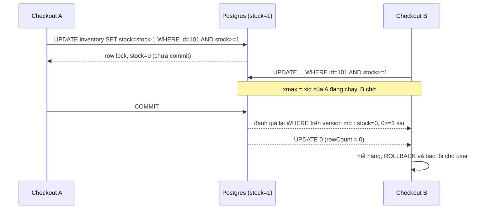
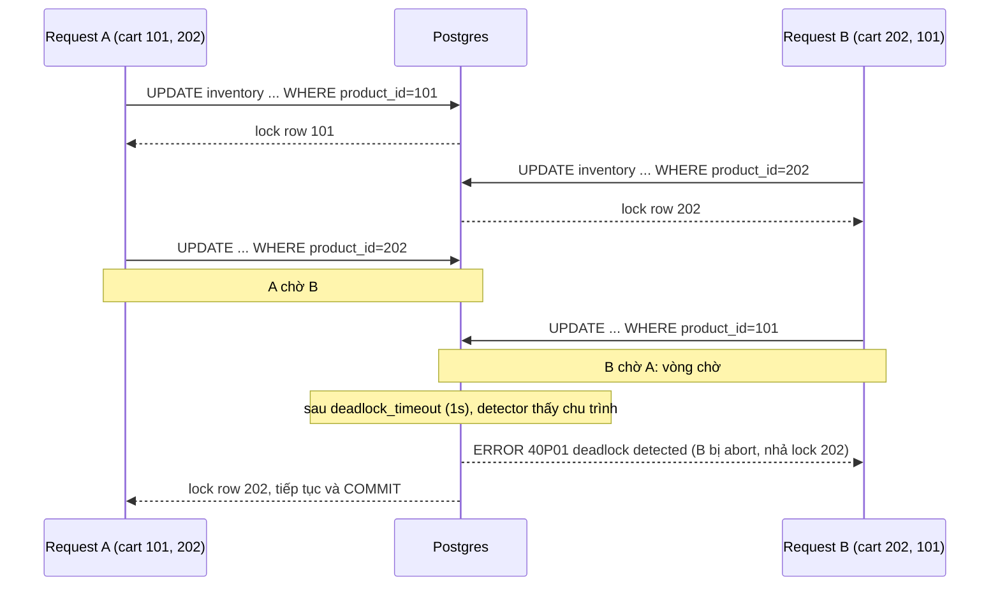
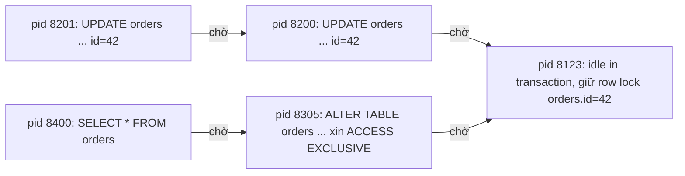

## Bối cảnh & vấn đề

Flash sale: sản phẩm 101 còn đúng 1 chiếc. Hai request checkout đến cùng lúc, và code viết theo kiểu "đọc, tính, ghi":

```ts
const { rows } = await db.query('SELECT stock FROM inventory WHERE product_id = $1', [101]);
if (rows[0].stock >= 1) {
  await db.query('UPDATE inventory SET stock = $1 WHERE product_id = $2', [rows[0].stock - 1, 101]);
  await createOrder(/* ... */);
}
```

Cả hai request đọc `stock = 1`, cả hai thấy đủ hàng, cả hai ghi `stock = 0` và cả hai tạo order. Bạn vừa bán 2 chiếc khi chỉ có 1. Đây là **lost update**: hai transaction đọc cùng giá trị cũ rồi ghi đè lên nhau, và một trong hai thay đổi "biến mất". Bọc cả đoạn trong `BEGIN ... COMMIT` **không** sửa được lỗi này ở `READ COMMITTED` (mặc định của Postgres), vì SELECT thường không lấy lock nào (xem [MVCC](/tracks/sql-postgres/learn/mvcc-vacuum)).

MVCC giải quyết xung đột reader–writer, nhưng **writer–writer** trên cùng dữ liệu vẫn cần phối hợp. Công cụ phối hợp là **lock**: ở mức table, mức row, hoặc lock tự định nghĩa (advisory). Dùng thiếu lock thì dữ liệu sai. Dùng thừa lock thì hệ thống chậm, xếp hàng, và **deadlock**. Bài này dạy bạn chọn đúng mức: khi nào một câu `UPDATE` có điều kiện là đủ, khi nào cần `FOR UPDATE`, khi nào optimistic locking thắng, và làm sao dựng job queue hay upsert an toàn dưới concurrency.

**Interview angle:** câu hỏi CV về checkout gần như luôn bắt đầu từ lost update. Nói được vì sao `BEGIN/COMMIT` một mình không đủ là tín hiệu senior.

## Khái niệm

### Table-level lock modes

Mọi câu lệnh đều lấy một **table-level lock** trên table nó đụng tới, kể cả `SELECT`. Postgres có 8 mode, từ yếu tới mạnh. Tên của chúng gây hiểu nhầm (ví dụ `ROW EXCLUSIVE` là lock mức table), nên hãy nhớ theo câu lệnh:

| Mode | Ai lấy | Xung đột với (rút gọn) |
|---|---|---|
| `ACCESS SHARE` | `SELECT` | chỉ `ACCESS EXCLUSIVE` |
| `ROW SHARE` | `SELECT ... FOR UPDATE/SHARE` | `EXCLUSIVE`, `ACCESS EXCLUSIVE` |
| `ROW EXCLUSIVE` | `INSERT`, `UPDATE`, `DELETE`, `MERGE` | `SHARE` trở lên |
| `SHARE UPDATE EXCLUSIVE` | `VACUUM`, `ANALYZE`, `CREATE INDEX CONCURRENTLY`, `VALIDATE CONSTRAINT` | chính nó, `SHARE` trở lên |
| `SHARE` | `CREATE INDEX` (thường) | `ROW EXCLUSIVE`, `SHARE UPDATE EXCLUSIVE`, và các mode mạnh hơn |
| `SHARE ROW EXCLUSIVE` | `CREATE TRIGGER`, `ADD FOREIGN KEY` | `ROW EXCLUSIVE` trở lên |
| `EXCLUSIVE` | `REFRESH MATERIALIZED VIEW CONCURRENTLY` | mọi thứ trừ `ACCESS SHARE` |
| `ACCESS EXCLUSIVE` | `DROP`, `TRUNCATE`, phần lớn `ALTER TABLE`, `VACUUM FULL`, `LOCK TABLE` | **mọi mode**, kể cả `SELECT` |

Hai hàng cần thuộc: DML thường (`ROW EXCLUSIVE`) không xung đột với nhau, nên 1.000 transaction có thể cùng INSERT/UPDATE vào một table. `ACCESS EXCLUSIVE` xung đột với tất cả. Vì lock chờ theo **hàng đợi FIFO**, một `ALTER TABLE` đang chờ `ACCESS EXCLUSIVE` phía sau một transaction dài sẽ khiến mọi `SELECT` mới xếp hàng sau nó. Đó là cơ chế outage khi migrate, được mổ xẻ ở bài [zero-downtime migrations](/tracks/sql-postgres/learn/zero-downtime-migrations).

### Row-level lock: bốn mode

Row lock chỉ chặn **writer và locker khác**, không bao giờ chặn `SELECT` thường. Postgres có bốn mode, từ mạnh tới yếu:

- **`FOR UPDATE`**: "tôi sắp xoá row này hoặc đổi key của nó". `DELETE` và `UPDATE` đổi cột thuộc unique index có thể dùng cho FK sẽ lấy mode này.
- **`FOR NO KEY UPDATE`**: "tôi sắp sửa row nhưng không đổi key". Một `UPDATE` thông thường (đổi `status`, `stock`) lấy mode này.
- **`FOR SHARE`**: "đừng ai sửa row này trong lúc tôi đọc".
- **`FOR KEY SHARE`**: "đừng ai xoá row này hoặc đổi key của nó". Foreign key check lấy mode này trên row cha.

Bảng xung đột (✗ = phải chờ):

| Đang giữ ↓ / Xin → | KEY SHARE | SHARE | NO KEY UPDATE | UPDATE |
|---|---|---|---|---|
| `FOR KEY SHARE` | | | | ✗ |
| `FOR SHARE` | | | ✗ | ✗ |
| `FOR NO KEY UPDATE` | | ✗ | ✗ | ✗ |
| `FOR UPDATE` | ✗ | ✗ | ✗ | ✗ |

Row lock được ghi **ngay trong tuple header** (trường `xmax` cùng các bit cờ), không nằm trong bảng lock bộ nhớ. Vì thế Postgres khoá được hàng triệu row mà không tốn RAM và **không có lock escalation** như SQL Server. Cái giá: lock một row là **ghi** vào page (dirty page, WAL). Khi nhiều transaction cùng giữ lock chia sẻ, Postgres tạo một **MultiXact** để liệt kê họ. Transaction phải chờ row lock thực chất là chờ `transactionid` của người đang giữ kết thúc, như bạn sẽ thấy trong `pg_locks`.

### Vì sao FK dùng FOR KEY SHARE

Khi bạn `INSERT INTO order_items (order_id, ...) VALUES (42, ...)`, Postgres phải đảm bảo order 42 không bị xoá trước khi transaction commit. Nó lấy `FOR KEY SHARE` trên row `orders.id = 42`. Mode này chỉ xung đột với `FOR UPDATE`, nên một transaction khác đang `UPDATE orders SET status = 'paid' WHERE id = 42` (lấy `FOR NO KEY UPDATE`) **không** chặn insert item. Trước PG 9.3, FK check dùng `FOR SHARE` và kiểu contention này rất phổ biến.

Bẫy thực tế: app viết `SELECT * FROM orders WHERE id = 42 FOR UPDATE` "cho chắc" trước khi sửa status. `FOR UPDATE` xung đột với `FOR KEY SHARE`, nên giờ mọi insert `order_items` cho order đó phải chờ. Nếu không đổi key, hãy dùng `FOR NO KEY UPDATE`. Tương tự, UPDATE đổi giá trị primary key của cha lấy `FOR UPDATE` và sẽ chặn (và bị chặn bởi) insert con.

**Interview angle:** "vì sao UPDATE cha không chặn INSERT con?" Trả lời bằng cặp `FOR NO KEY UPDATE` vs `FOR KEY SHARE` là đủ điểm.

### NOWAIT, SKIP LOCKED và lock_timeout

Mặc định, xin lock bị xung đột thì **chờ vô hạn**. Ba cách thay đổi hành vi đó:

- **`NOWAIT`**: báo lỗi ngay `ERROR: could not obtain lock on row in relation "inventory"` (SQLSTATE `55P03`). Hợp với UI "sản phẩm đang được người khác sửa".
- **`SKIP LOCKED`**: bỏ qua row đang bị lock, trả về những row còn lại. Đây là nền của job queue. Kết quả **cố ý không nhất quán**, nên đừng dùng cho báo cáo.
- **`SET lock_timeout = '2s'`**: chờ tối đa 2 giây rồi lỗi `canceling statement due to lock timeout` (`55P03`). Áp dụng cho mọi loại lock, kể cả table lock của DDL.

### Advisory lock

**Advisory lock** là lock trên một **số bigint do ứng dụng tự đặt nghĩa**. Database không gắn nó với row hay table nào, chỉ đảm bảo hai session không cùng giữ một key. Dùng khi thứ cần bảo vệ không phải một row: "chỉ một instance chạy cron `daily-invoice`", "chỉ một worker tính lại số dư của tenant 42".

Có hai phạm vi. **Transaction-level** (`pg_advisory_xact_lock(key)`, `pg_try_advisory_xact_lock(key)`) tự nhả khi commit/rollback, không thể quên. **Session-level** (`pg_advisory_lock`, `pg_try_advisory_lock`, `pg_advisory_unlock`) giữ tới khi gọi unlock hoặc đóng connection, và có đếm lặp: lock hai lần thì phải unlock hai lần. Key thường được sinh bằng `hashtext('job:daily-invoice')`, trả về int4, nên có khả năng va chạm. Tốt hơn là dùng dạng hai tham số `(namespace int4, id int4)`, ví dụ `pg_advisory_xact_lock(1, tenant_id)` với namespace 1 = "tính số dư".

**PgBouncer transaction mode** là bẫy lớn nhất (xem [connection pooling](/tracks/sql-postgres/learn/connection-pooling)). Ở mode này, mỗi transaction của client có thể chạy trên một server connection khác. Session lock gắn vào server connection, nên sau khi transaction kết thúc, lock vẫn nằm trên connection đó và **client khác mượn connection sẽ "thừa kế" lock**, còn lệnh unlock của bạn chạy trên connection khác và trả về `false` với warning `you don't own a lock of type ExclusiveLock`. Quy tắc: sau pooler transaction mode, **chỉ dùng xact-level**.

**Interview angle:** interviewer hỏi xact vs session để nghe bạn nhắc tới PgBouncer. Không nhắc là mất điểm.

### Deadlock

**Deadlock** là vòng chờ: transaction A giữ lock X và chờ Y, B giữ Y và chờ X. Không bên nào tự tiến lên được. Postgres không kiểm tra deadlock mỗi lần chờ (tốn kém). Một transaction chờ lock quá **`deadlock_timeout`** (mặc định 1s) mới chạy bộ dò: duyệt đồ thị "ai chờ ai" tìm chu trình. Nếu có, **một** transaction trong vòng bị abort với SQLSTATE **`40P01`**, và các bên còn lại chạy tiếp. Docs nói rõ bên nào bị chọn là khó đoán và không nên dựa vào. Thường đó là bên chạy bộ dò.

Deadlock ở Postgres gần như luôn là **writer–writer** trên row, vì reader không lấy row lock. Ở SQL Server lock-based còn có deadlock reader–writer và deadlock do lock escalation. Hạ isolation level **không** giúp gì với deadlock row lock ở Postgres: `UPDATE` ở mọi level đều phải lấy row lock như nhau.

### Upsert với INSERT ... ON CONFLICT

**Upsert** là "chèn nếu chưa có, nếu có thì cập nhật". Làm bằng `SELECT` rồi `INSERT` là race kinh điển: hai request cùng thấy "chưa có" và cùng insert, một bên dính `duplicate key`. `INSERT ... ON CONFLICT (cols) DO UPDATE` dựa vào một **unique index/constraint** (gọi là arbiter) và đảm bảo atomic ở `READ COMMITTED`: mỗi row đề xuất sẽ **hoặc được insert, hoặc update row đang tồn tại**, kể cả khi có insert đồng thời. Trong nhánh update, pseudo-table **`EXCLUDED`** chứa giá trị bạn định insert. `DO NOTHING` thì bỏ qua row bị conflict.

Ba gotcha: `RETURNING` **không trả row có sẵn** khi `DO NOTHING` (không có gì được ghi); sequence của cột `id` vẫn bị tiêu hao khi conflict (gap trong id là bình thường); và một câu không được đụng cùng một row hai lần (`ON CONFLICT DO UPDATE command cannot affect row a second time` nếu `VALUES` có hai dòng cùng key).

## Cơ chế hoạt động

### Một UPDATE chờ row lock như thế nào

Khi `UPDATE` tìm thấy row mà `xmax` là một transaction còn đang chạy, nó ghi nhận row đó đang bị khoá và **chờ transaction kia kết thúc** (chờ trên `transactionid` của nó). Khi transaction kia commit, ở `READ COMMITTED` Postgres **đọc lại version mới nhất của row và đánh giá lại `WHERE`** trước khi update (cơ chế EvalPlanQual). Nếu row mới không còn thoả điều kiện, nó bị bỏ qua và `rowCount` = 0. Ở `REPEATABLE READ`/`SERIALIZABLE`, thay vì đánh giá lại, transaction chờ bị lỗi `could not serialize access due to concurrent update` (`40001`) và app phải retry (xem [isolation levels](/tracks/sql-postgres/learn/isolation-levels)).

Hành vi "đánh giá lại WHERE" chính là lý do một **atomic UPDATE có guard** chống oversell đúng mà không cần `FOR UPDATE`:



Sơ đồ cho thấy B không bao giờ đọc giá trị cũ để tự tính. Nó chờ, rồi kiểm tra điều kiện trên dữ liệu đã commit mới nhất. Kết quả luôn đúng: đúng một bên bán được, bên kia nhận `rowCount = 0`.

### Deadlock trong checkout



Cả hai request chạy cùng một code, chỉ khác thứ tự item trong giỏ. A khoá 101 rồi xin 202, B khoá 202 rồi xin 101. Sau 1 giây, bộ dò chạy, thấy chu trình và abort một bên. Bên bị abort mất toàn bộ công việc trong transaction, và user thấy lỗi 500 nếu app không retry. Sửa gốc: **mọi transaction khoá theo cùng một thứ tự**, ví dụ sort theo `product_id` tăng dần. Khi ai cũng xin 101 trước 202, người đến sau chỉ phải chờ, không bao giờ tạo vòng.

### Đồ thị chờ lock khi sự cố

Trong production, vấn đề hay gặp hơn deadlock là **chuỗi chờ**: một transaction giữ lock rồi treo, phía sau là hàng chục transaction khác.



Gốc của cây là `pid 8123`, một connection quên commit. `pid 8201` chờ `8200` vì các transaction chờ cùng một row xếp hàng nối nhau. Nguy hiểm nhất là nhánh dưới: `ALTER TABLE` chờ `8123`, và vì lock queue FIFO, ngay cả `SELECT` đơn giản (`8400`) cũng bị kẹt sau `ALTER`. Tìm gốc bằng `pg_blocking_pids()` (ví dụ ở phần sau), xử lý gốc thay vì kill từng nạn nhân.

## Ví dụ thực tế

Các ví dụ dùng node-postgres (`pg`) với một helper transaction chung. Helper này là thứ mà mọi codebase Postgres nghiêm túc đều cần: nó dùng **một** client cho cả transaction (dùng `pool.query` cho từng câu sẽ chạy mỗi câu trên connection khác nhau) và retry các lỗi concurrency có thể thử lại.

```ts
import { Pool, PoolClient } from 'pg';
const pool = new Pool({ max: 20 });

const RETRYABLE = new Set(['40P01', '40001']); // deadlock_detected, serialization_failure

export async function withTx<T>(fn: (c: PoolClient) => Promise<T>, attempts = 3): Promise<T> {
  for (let i = 1; ; i++) {
    const c = await pool.connect();
    try {
      await c.query('BEGIN');
      await c.query("SET LOCAL lock_timeout = '3s'");
      const out = await fn(c);
      await c.query('COMMIT');
      return out;
    } catch (e: any) {
      await c.query('ROLLBACK').catch(() => {});
      if (RETRYABLE.has(e.code) && i < attempts) {
        await new Promise((r) => setTimeout(r, 20 * 2 ** i + Math.random() * 20)); // backoff + jitter
        continue;
      }
      throw e;
    } finally {
      c.release();
    }
  }
}
```

Retry chỉ an toàn khi **toàn bộ** công việc nằm trong `fn`, bao gồm cả các lần đọc. Retry lại riêng câu lệnh bị lỗi là sai, vì transaction đã bị rollback.

### Ba cách chống lost update

**Cách 1: atomic UPDATE có guard.** Đẩy phép tính vào SQL để database tự làm "đọc-tính-ghi" dưới row lock:

```ts
async function reserveAtomic(productId: number, qty: number) {
  const r = await pool.query(
    `UPDATE inventory SET stock = stock - $1
     WHERE product_id = $2 AND stock >= $1
     RETURNING stock`,
    [qty, productId],
  );
  if (r.rowCount === 0) throw new Error('OUT_OF_STOCK');
  return r.rows[0].stock;
}

// stock = 1, gọi song song hai lần
console.log(await Promise.allSettled([reserveAtomic(101, 1), reserveAtomic(101, 1)]));
```

```text
[
  { status: 'fulfilled', value: 0 },
  { status: 'rejected', reason: Error: OUT_OF_STOCK }
]
```

Một câu lệnh, một round-trip, lock chỉ giữ trong vài mili giây. Đây là lựa chọn mặc định khi logic diễn đạt được bằng `WHERE`.

**Cách 2: pessimistic `SELECT ... FOR UPDATE`.** Dùng khi quyết định cần logic ứng dụng phức tạp mà SQL không diễn đạt gọn (tính giá theo nhiều rule, kiểm tra hạn mức của nhiều bảng):

```ts
await withTx(async (c) => {
  const { rows } = await c.query(
    'SELECT balance, credit_limit, status FROM accounts WHERE id = $1 FOR NO KEY UPDATE',
    [accountId],
  );
  const acc = rows[0];
  if (acc.status !== 'active') throw new Error('ACCOUNT_LOCKED');
  const fee = computeFee(acc, amount);                      // logic ở app, nhưng row đã bị khoá
  if (acc.balance + acc.credit_limit < amount + fee) throw new Error('INSUFFICIENT_FUNDS');
  await c.query('UPDATE accounts SET balance = balance - $1 WHERE id = $2', [amount + fee, accountId]);
});
```

Transaction thứ hai gọi cùng `accountId` sẽ chờ ở câu `SELECT ... FOR NO KEY UPDATE` cho tới khi transaction đầu commit, rồi đọc số dư mới. Dùng `FOR NO KEY UPDATE` vì ta không đổi key, để không chặn insert vào các bảng con có FK tới `accounts`. Quy tắc sống còn: **không gọi HTTP/payment gateway trong lúc giữ lock**. Lock giữ bao lâu thì mọi request khác trên row đó chờ bấy lâu, và connection bị chiếm suốt thời gian đó.

**Cách 3: optimistic locking với cột `version`.** Không giữ lock trong lúc "suy nghĩ", chỉ kiểm tra lúc ghi rằng không ai đã đổi row kể từ lúc đọc:

```ts
// Form sửa địa chỉ: client đã nhận version=7 khi mở form 3 phút trước
const r = await pool.query(
  `UPDATE addresses SET line1 = $1, version = version + 1
   WHERE id = $2 AND tenant_id = $3 AND version = $4`,
  [line1, id, tenantId, 7],
);
if (r.rowCount === 0) throw new ConflictError('Address was modified by someone else'); // HTTP 409
```

```text
-- Người thứ nhất lưu:  UPDATE 1  (version 7 → 8)
-- Người thứ hai lưu với version=7: UPDATE 0 → 409 Conflict, client tải lại và merge
```

Cách này hợp với thao tác qua UI kéo dài vài phút, nơi giữ transaction mở là không thể. Nhưng dưới contention cao (flash sale, 500 request/giây trên một row), phần lớn request sẽ thất bại và retry liên tục, lãng phí công sức: lúc đó quay lại cách 1.

### Job queue với FOR UPDATE SKIP LOCKED

```sql
CREATE TABLE jobs (
  id          bigint GENERATED ALWAYS AS IDENTITY PRIMARY KEY,
  kind        text        NOT NULL,
  payload     jsonb       NOT NULL,
  status      text        NOT NULL DEFAULT 'pending',   -- pending | running | done | failed
  run_at      timestamptz NOT NULL DEFAULT now(),
  locked_until timestamptz,
  attempts    int         NOT NULL DEFAULT 0,
  last_error  text
);
-- Partial index: chỉ chứa job còn cần xử lý, nhỏ và nóng trong cache
CREATE INDEX jobs_ready_idx ON jobs (run_at) WHERE status IN ('pending', 'running');
```

Worker "claim" một lô job bằng một câu duy nhất, rồi commit ngay. Job được giữ bằng **lease** (`locked_until`) thay vì giữ transaction mở trong lúc chạy:

```sql
WITH next AS (
  SELECT id FROM jobs
  WHERE (status = 'pending' AND run_at <= now())
     OR (status = 'running' AND locked_until < now())      -- lease hết hạn: worker cũ đã chết
  ORDER BY run_at
  LIMIT 10
  FOR UPDATE SKIP LOCKED
)
UPDATE jobs j
SET status = 'running', locked_until = now() + interval '5 minutes', attempts = j.attempts + 1
FROM next WHERE j.id = next.id
RETURNING j.id, j.kind, j.attempts;
```

```ts
async function workerLoop(signal: AbortSignal) {
  while (!signal.aborted) {
    const { rows: batch } = await pool.query(CLAIM_SQL);        // câu SQL ở trên, tự commit
    if (batch.length === 0) { await sleep(1000); continue; }    // hoặc LISTEN/NOTIFY để bớt polling
    for (const job of batch) {
      try {
        await handlers[job.kind](job);                          // phải idempotent: có thể chạy lại
        await pool.query(`UPDATE jobs SET status = 'done', locked_until = NULL WHERE id = $1`, [job.id]);
      } catch (e: any) {
        const failed = job.attempts >= 5;
        await pool.query(
          `UPDATE jobs SET status = $2, last_error = $3, locked_until = NULL,
                           run_at = now() + ($4 || ' seconds')::interval
           WHERE id = $1`,
          [job.id, failed ? 'failed' : 'pending', String(e.message), 2 ** job.attempts * 10],
        );
      }
    }
  }
}
```

```text
worker-1 claimed [1001, 1002, 1003 ... 1010]
worker-2 claimed [1011, 1012 ... 1020]      <- không chờ worker-1, không lấy trùng
worker-3 claimed []                          <- hết job sẵn sàng, ngủ 1s
```

Mỗi worker bỏ qua row mà worker khác đang khoá trong câu claim, nên 10 worker chạy song song không xếp hàng. Nếu worker chết giữa chừng sau khi đã commit `status = 'running'`, job không bị kẹt: khi `locked_until` hết hạn, câu claim sẽ nhặt lại nó. Vì vậy handler **phải idempotent**. Giới hạn: không có thứ tự nghiêm ngặt, polling tốn query, mỗi lần đổi status là một UPDATE tạo dead tuple nên table queue cần autovacuum mạnh và dọn job cũ, và ở mức hàng chục nghìn job/giây hoặc cần fan-out cho nhiều consumer thì Kafka/SQS hợp hơn.

### Advisory lock cho cron chạy một instance

```ts
await withTx(async (c) => {
  const { rows } = await c.query(
    'SELECT pg_try_advisory_xact_lock(1, $1) AS ok', [DAILY_INVOICE_JOB_ID],
  );
  if (!rows[0].ok) { console.log('another instance is running, skip'); return; }
  await generateInvoices(c);                   // lock tự nhả khi COMMIT/ROLLBACK
});
```

```text
pod-a: generating 1,204 invoices...
pod-b: another instance is running, skip
```

Nhược điểm của xact lock ở đây: job chạy bao lâu thì transaction mở bấy lâu, giữ xmin horizon và chặn VACUUM ([MVCC & VACUUM](/tracks/sql-postgres/learn/mvcc-vacuum)). Với job dài, dùng session lock trên một connection **trực tiếp** (không qua PgBouncer transaction mode), hoặc dùng bảng lease như job queue ở trên.

### Sửa deadlock checkout

Code gốc lặp theo thứ tự item trong giỏ. Bản sửa khoá theo thứ tự `product_id` bằng một câu `SELECT ... ORDER BY ... FOR UPDATE`, rồi cập nhật:

```ts
async function reserve(items: { productId: number; qty: number }[]) {
  const sorted = [...items].sort((a, b) => a.productId - b.productId);
  return withTx(async (c) => {
    const ids = sorted.map((i) => i.productId);
    await c.query(
      'SELECT product_id FROM inventory WHERE product_id = ANY($1) ORDER BY product_id FOR NO KEY UPDATE',
      [ids],
    );                                                       // khoá 101 rồi 202 ở MỌI request
    for (const it of sorted) {
      const r = await c.query(
        `UPDATE inventory SET reserved = reserved + $1
         WHERE product_id = $2 AND available - reserved >= $1`,
        [it.qty, it.productId],
      );
      if (r.rowCount === 0) throw new Error(`OUT_OF_STOCK:${it.productId}`); // rollback cả giỏ
    }
  });
}
```

Vì sao không chỉ viết một câu `UPDATE ... FROM (VALUES ...)` nhiều row? Thứ tự mà một câu UPDATE khoá row phụ thuộc vào plan (join order, index hay seq scan), nên **không được đảm bảo**. `SELECT ... ORDER BY ... FOR UPDATE` thì khoá theo thứ tự row được trả về. Khi deadlock vẫn xảy ra (ví dụ do một đường code khác khoá theo thứ tự khác), log sẽ ghi:

```text
ERROR:  deadlock detected
DETAIL:  Process 8200 waits for ShareLock on transaction 99812; blocked by process 8201.
         Process 8201 waits for ShareLock on transaction 99811; blocked by process 8200.
HINT:  See server log for query details.
CONTEXT:  while updating tuple (12,7) in relation "inventory"
```

Đây là thông tin đầu tiên cần thu thập khi điều tra: hai câu lệnh, hai pid, row nào. Bật `log_lock_waits = on` để log cả các lần chờ lâu hơn `deadlock_timeout` dù không thành deadlock.

### Upsert và idempotency key chống double charge

```sql
CREATE TABLE idempotency_keys (
  key          text PRIMARY KEY,
  request_hash text        NOT NULL,
  status       text        NOT NULL DEFAULT 'in_progress',   -- in_progress | done
  response     jsonb,
  created_at   timestamptz NOT NULL DEFAULT now()
);

INSERT INTO idempotency_keys (key, request_hash)
VALUES ('chk_7f3a', 'sha256:ab12...')
ON CONFLICT (key) DO NOTHING
RETURNING key;
```

```text
-- Lần gọi đầu:     key = chk_7f3a   (1 row: ta sở hữu request này)
-- Client retry:    (0 rows)         -- DO NOTHING không trả row cũ!
```

Vì `DO NOTHING` không trả row có sẵn, bên retry phải `SELECT status, response FROM idempotency_keys WHERE key = $1`: nếu `done` thì trả lại đúng response cũ, nếu `in_progress` thì trả 409 "đang xử lý" để client thử lại sau, nếu `request_hash` khác thì trả 422 (dùng lại key cho request khác). Kết hợp với `UPDATE inventory ... WHERE stock >= n` ở trên, đó là bộ đôi chống oversell và double charge. Gọi payment gateway **ngoài** transaction giữ lock, và lưu trạng thái order như một state machine (`pending_payment → paid`) để retry an toàn khi gateway timeout.

Upsert dạng counter dùng `EXCLUDED`:

```sql
INSERT INTO daily_stats (day, product_id, views) VALUES (current_date, 101, 1)
ON CONFLICT (day, product_id) DO UPDATE SET views = daily_stats.views + EXCLUDED.views
RETURNING views;
```

```text
 views
-------
    42
```

### Tìm ai đang chặn ai

```sql
SELECT pid, pg_blocking_pids(pid) AS blocked_by, state,
       now() - xact_start AS xact_age, left(query, 50) AS query
FROM pg_stat_activity
WHERE cardinality(pg_blocking_pids(pid)) > 0
   OR pid IN (SELECT unnest(pg_blocking_pids(pid)) FROM pg_stat_activity);
```

```text
 pid  | blocked_by |        state        | xact_age |              query
------+------------+---------------------+----------+----------------------------------
 8123 | {}         | idle in transaction | 00:14:02 | SELECT * FROM orders WHERE id=42 FOR UPDATE
 8200 | {8123}     | active              | 00:03:10 | UPDATE orders SET status='paid' WHERE id=42
 8305 | {8123}     | active              | 00:00:41 | ALTER TABLE orders ADD COLUMN note text
 8400 | {8305}     | active              | 00:00:39 | SELECT * FROM orders WHERE id = 77
```

Kết quả khớp với đồ thị chờ ở phần cơ chế: gốc là `8123` với `blocked_by` rỗng. `SELECT pg_terminate_backend(8123)` gỡ cả cây.

## Trade-offs & lựa chọn thay thế

| Cách | Giữ lock bao lâu | Round-trip | Contention cao | Hợp với |
|---|---|---|---|---|
| Atomic UPDATE có guard | Vài ms, trong 1 câu | 1 | Tốt nhất (xếp hàng ngắn) | Trừ kho, tăng counter, chuyển trạng thái đơn giản |
| `SELECT ... FOR UPDATE` | Cả transaction | 2+ | Ổn nếu transaction ngắn | Logic nhiều bước ở app, đọc nhiều bảng rồi quyết định |
| Optimistic `version` | Không giữ | 1 khi ghi | Kém: retry storm | Edit qua UI lâu, contention thấp, API REST với `ETag`/`If-Match` |
| `SERIALIZABLE` + retry | Không lock thêm (SSI) | Như thường | Kém: nhiều `40001` | Invariant nhiều row phức tạp (write skew) |
| Advisory lock | Tuỳ phạm vi | 1 | Tốt | Bảo vệ thứ không phải row: job singleton, per-tenant |
| `SKIP LOCKED` | Trong câu claim | 1 | Tốt cho queue | Job queue trung bình, cùng DB với dữ liệu nghiệp vụ |

Cách chọn theo thứ tự: nếu diễn đạt được bằng một câu SQL có `WHERE` guard, dùng **atomic UPDATE**: nhanh nhất, đơn giản nhất, không deadlock với một row. Nếu cần logic ở app nhưng thời gian ngắn và cùng request, dùng **`FOR NO KEY UPDATE`** (hoặc `FOR UPDATE` khi xoá/đổi key) và khoá theo thứ tự cố định. Nếu người dùng "cầm" dữ liệu qua nhiều request (form, editor), dùng **optimistic**. Nếu invariant trải trên nhiều row mà không có row nào để khoá (ví dụ "tổng ca trực mỗi ngày ≥ 1 bác sĩ"), cân nhắc `SERIALIZABLE` hoặc khoá một row đại diện.

Với row cực nóng (một SKU flash sale nhận 5.000 request/giây), mọi cách lock đều xếp hàng tuần tự trên row đó. Giải pháp nằm ngoài lock: chia stock thành nhiều row "bucket" (ví dụ 10 row mỗi row 100 chiếc, request chọn ngẫu nhiên), hoặc đặt trước trong Redis với `DECR` rồi ghi DB bất đồng bộ, hoặc cho request vào hàng đợi và xử lý tuần tự.

## So sánh với SQL Server

SQL Server lưu lock trong **lock manager** bộ nhớ (không phải trong row), với các mode `S`, `U`, `X`, intent lock (`IS`, `IX`) và key-range lock ở `SERIALIZABLE`. Khi một transaction giữ quá nhiều lock (khoảng 5.000 trên một object), nó **escalate** lên table lock, và bất ngờ chặn cả table: Postgres không bao giờ làm vậy. Ở `READ COMMITTED` lock-based mặc định, `SELECT` lấy `S` lock nên reader–writer có thể deadlock nhau; bật RCSI thì hết loại này. Deadlock monitor chọn victim theo `DEADLOCK_PRIORITY` rồi theo chi phí rollback, lỗi **1205**.

Về upsert, `MERGE` của SQL Server **không atomic dưới concurrency** theo mặc định: hai session cùng thấy "không match" và cùng `INSERT`, một bên dính lỗi PK `2627`. Phải thêm `WITH (HOLDLOCK)` (tương đương `SERIALIZABLE`, giữ key-range lock) cho target, và `MERGE` có lịch sử bug đáng kể. Pattern phổ biến thay thế là `UPDATE ... WITH (UPDLOCK, SERIALIZABLE)` rồi `IF @@ROWCOUNT = 0 INSERT`.

Postgres có `MERGE` từ **PG 15** (thêm `RETURNING` ở PG 17 (verify)). Nhưng docs cảnh báo `MERGE` với insert đồng thời vẫn có thể lỗi unique violation, vì nó không có cơ chế "insert hoặc update" dựa trên arbiter index như `ON CONFLICT`. Kết luận: upsert đồng thời ở Postgres dùng `INSERT ... ON CONFLICT`. `MERGE` dành cho đồng bộ dữ liệu batch với logic `WHEN MATCHED / NOT MATCHED` phức tạp, nơi concurrency không phải vấn đề chính.

**Interview angle:** "MERGE của SQL Server có an toàn cho upsert không?" Câu trả lời đúng là "không, cần `HOLDLOCK`", và Postgres giải bằng `ON CONFLICT`.

## Edge cases & failure modes

- **Deadlock với FK**: hai transaction cùng insert con cho cha A và B theo thứ tự ngược nhau, rồi cùng update cha, sẽ deadlock qua `FOR KEY SHARE` → `FOR NO KEY UPDATE`. Lock ordering phải tính cả row cha.
- **`FOR UPDATE` trên JOIN khoá mọi table**: `SELECT ... FROM orders JOIN customers ... FOR UPDATE` khoá row của cả hai. Dùng `FOR UPDATE OF orders` để chỉ khoá table cần.
- **`FOR UPDATE` với `LIMIT` và `ORDER BY`**: khi row bị update đồng thời, kết quả có thể ít hơn `LIMIT` hoặc không đúng thứ tự, vì sắp xếp xảy ra trước khi khoá và row có thể bị bỏ qua sau khi đánh giá lại. Chấp nhận được với queue, không với phân trang chính xác.
- **Atomic UPDATE ở `REPEATABLE READ`**: không còn "đánh giá lại WHERE" mà lỗi `40001`. Code chuyển isolation level phải có retry.
- **`lock_timeout` quá ngắn cho DML thường**: đặt 100 ms toàn cục làm checkout lỗi mỗi khi có contention bình thường. Dùng giá trị ngắn cho DDL migration, dài hơn (vài giây) cho request.
- **MultiXact bùng nổ**: nhiều transaction cùng `FOR SHARE`/`FOR KEY SHARE` một row cha nóng (mỗi insert con), tạo nhiều MultiXact, tốn IO ở `pg_multixact` và cần freeze riêng.
- **`SKIP LOCKED` che lỗi**: một job bị khoá mãi (transaction treo) đơn giản là "vô hình" với worker khác, không có lỗi nào. Cần alert trên tuổi của job `running` lâu nhất.
- **Advisory lock rò rỉ**: session lock không unlock trong nhánh exception, connection trả về pool vẫn giữ lock, và job không bao giờ chạy lại cho tới khi restart. Xem `pg_locks WHERE locktype = 'advisory'`.
- **Retry không idempotent**: retry toàn bộ transaction sau `40P01` là đúng, nhưng nếu trong `fn` có gửi email hay gọi payment thì side effect bị lặp. Đưa side effect ra sau commit (outbox pattern).

## Pitfalls

- ❌ Đọc rồi ghi giá trị tính ở app (`SET stock = $computed`) → ✅ `SET stock = stock - $1 WHERE stock >= $1` và kiểm tra `rowCount`. Đọc-tính-ghi không lock là lost update chờ xảy ra.
- ❌ Nghĩ rằng `BEGIN ... COMMIT` tự chống race → ✅ transaction đảm bảo atomic, không đảm bảo loại trừ lẫn nhau. Ở `READ COMMITTED`, `SELECT` thường không khoá gì.
- ❌ `SELECT ... FOR UPDATE` "cho chắc" trên row cha → ✅ `FOR NO KEY UPDATE` khi không đổi key, để không chặn insert vào bảng con.
- ❌ Hạ isolation level để hết deadlock → ✅ deadlock row lock ở Postgres xảy ra ở mọi level. Sửa bằng lock ordering, transaction ngắn, và retry `40P01`.
- ❌ Gọi payment gateway trong transaction đang giữ `FOR UPDATE` → ✅ khoá, ghi trạng thái `pending_payment`, commit, rồi mới gọi ra ngoài.
- ❌ Session advisory lock sau PgBouncer transaction mode → ✅ `pg_advisory_xact_lock`, hoặc connection riêng không qua pooler.
- ❌ Upsert bằng `SELECT` rồi `INSERT`, hoặc `MERGE` cho upsert đồng thời → ✅ `INSERT ... ON CONFLICT` trên unique index.
- ❌ Chờ `RETURNING` sau `ON CONFLICT DO NOTHING` để lấy row có sẵn → ✅ `SELECT` lại khi nhận 0 row, hoặc dùng `DO UPDATE SET key = EXCLUDED.key` (có ghi thêm một version) nếu buộc phải lấy trong một câu.
- ❌ Retry chỉ câu lệnh lỗi → ✅ retry cả transaction từ đầu, với backoff và jitter.

## Tóm tắt

- Lost update đến từ đọc-tính-ghi không phối hợp. MVCC không tự chống nó ở `READ COMMITTED`.
- Table lock: DML lấy `ROW EXCLUSIVE` (không xung đột nhau), `ACCESS EXCLUSIVE` chặn tất cả, và lock queue là FIFO nên DDL đang chờ chặn cả `SELECT`.
- Row lock nằm trong tuple header, không escalation: `FOR UPDATE` > `FOR NO KEY UPDATE` > `FOR SHARE` > `FOR KEY SHARE`. FK check dùng `KEY SHARE` nên UPDATE thường không chặn insert con.
- Chống lost update: atomic UPDATE có guard (mặc định), `FOR UPDATE` (logic app, transaction ngắn), cột `version` (edit qua UI). Contention cực cao: đổi thiết kế, không đổi lock.
- `SKIP LOCKED` + lease cho job queue; `NOWAIT`/`lock_timeout` để không chờ vô hạn.
- Advisory lock: xact-level an toàn với PgBouncer transaction mode, session-level thì không.
- Deadlock: detector chạy sau `deadlock_timeout` (1s), abort một bên với `40P01`. Phòng bằng thứ tự khoá nhất quán theo id, transaction ngắn, retry cả transaction.
- Upsert: `INSERT ... ON CONFLICT` atomic nhờ unique index, `EXCLUDED` cho giá trị mới, `DO NOTHING` không trả row cũ. SQL Server `MERGE` cần `HOLDLOCK`. Checkout = conditional UPDATE + idempotency key.
